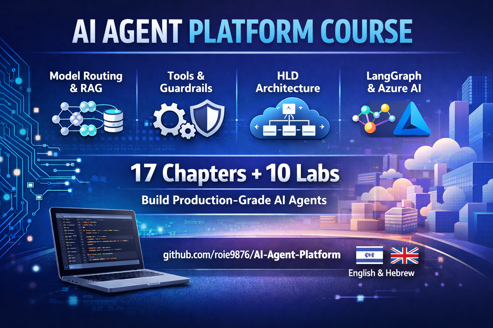

# 📚 AI Agent Platform - Education Hub



> **[🇮🇱 גרסה בעברית](education/heb/README.md)**

## Purpose
This repository is a comprehensive educational resource designed to teach all the concepts, technologies, and architectures required to design and build an **AI Agent Platform as a Service (PaaS)**.

- **📖 Education chapters** (1-17) — deep concept explanations with diagrams
- **🧪 Hands-on labs** (0-9) — build real agents with LangChain/LangGraph, step by step

Each chapter is self-contained, but together they form a complete picture of a Production-grade system.

---

## 📖 Education Chapters

> 🎬 **[Watch the full video playlist on YouTube](https://youtu.be/VaETDxa4GyA?list=PLamHD1dse8erLNzka2iK2nS3zg9nDmbMe)**

| # | Topic | What You'll Learn | Video |
|---|-------|-------------------|-------|
| 1 | [**Fundamentals — What is an AI Agent?**](education/en/01-fundamentals.md) | What is an LLM, what is an Agent, ReAct loop, the difference between a Chatbot and an Agent | [▶️](https://youtu.be/usKAmjDLZzA?list=PLamHD1dse8erLNzka2iK2nS3zg9nDmbMe) |
| 2 | [**Model Abstraction & Routing**](education/en/02-model-abstraction-routing.md) | Unified interface for LLMs, smart routing between models, fallback & retry, caching strategies | [▶️](https://youtu.be/Pc7b5su_gSg?list=PLamHD1dse8erLNzka2iK2nS3zg9nDmbMe) |
| 3 | [**Memory Management & RAG**](education/en/03-memory-management.md) | Short-term & long-term memory, RAG pipeline, embeddings, vector databases, hybrid search | |
| 4 | [**Thread & State Management**](education/en/04-thread-state-management.md) | Conversation management, state machines, checkpointing, human-in-the-loop patterns | |
| 5 | [**Orchestration Patterns**](education/en/05-orchestration.md) | Sequential, parallel, autonomous, sub-agents, DAG workflows, map-reduce, supervisor | |
| 6 | [**Tools & Marketplace**](education/en/06-tools-marketplace.md) | Function calling, tool integration, tool registry, marketplace, MCP protocol | |
| 7 | [**Policy & Governance**](education/en/07-policy-governance.md) | Content safety, DLP, rate limiting, guardrails, budget controls | |
| 8 | [**Control Plane**](education/en/08-control-plane.md) | API gateway, agent registry, identity & access, policy engine, cost dashboard | |
| 9 | [**Runtime Plane**](education/en/09-runtime-plane.md) | Request lifecycle, orchestrator, model layer, tool executor, secure sandbox | |
| 10 | [**Evaluation Engine**](education/en/10-evaluation-engine.md) | Quality metrics, groundedness, relevance, toxicity, automated testing pipelines | |
| 11 | [**Observability & Cost**](education/en/11-observability-cost.md) | Metrics, distributed tracing, token tracking, cost dashboards, alerting | |
| 12 | [**Security & Isolation**](education/en/12-security-isolation.md) | Sandboxing, container isolation, zero trust, secrets management, RBAC | |
| 13 | [**Scalability Patterns**](education/en/13-scalability.md) | Horizontal scaling, multi-tenancy, partitioning, queue-based load leveling | |
| 14 | [**HLD — Full Architecture**](education/en/14-hld-architecture.md) | Complete architecture diagram — how all components connect end-to-end | |
| 15 | [**Microsoft Stack Mapping**](education/en/15-microsoft-stack.md) | Mapping each platform component to specific Azure services | |
| 16 | [**Agent Frameworks & Ecosystem**](education/en/16-agent-frameworks.md) | LangGraph, Semantic Kernel, AutoGen, CrewAI, MCP protocol, A2A protocol | |
| 17 | [**Azure AI Foundry**](education/en/17-azure-ai-foundry.md) | Managed agent platform: Model Catalog, Agents Service, evaluations, tracing | |

---

## 🧪 Hands-On Labs

> **Learn by building.** Each lab teaches one core concept by writing real code with LangChain/LangGraph.

| Lab | What You Build | Education Chapters |
|-----|---------------|--------------------|
| **[Lab 00](labs/lab-00-setup/README.md)** | Azure environment setup (one-click deploy) | — |
| **[Lab 01](labs/lab-01-react-agent/README.md)** | Build a ReAct Agent from scratch, then with LangGraph | Ch 1 |
| **[Lab 02](labs/lab-02-model-routing/README.md)** | Smart model routing (cheap vs expensive) | Ch 2 |
| **[Lab 03](labs/lab-03-memory-rag/README.md)** | Memory & RAG integration | Ch 3, 4 |
| **[Lab 04](labs/lab-04-orchestration/README.md)** | Orchestration patterns (sequential, parallel, map-reduce) | Ch 5 |
| **[Lab 05](labs/lab-05-tools-safety/README.md)** | Tool calling with safety guardrails | Ch 6, 7 |
| **[Lab 06](labs/lab-06-evaluation/README.md)** | Agent evaluation pipeline | Ch 10 |
| **[Lab 07](labs/lab-07-frameworks/README.md)** | Framework deep dive (LangGraph, SK/MAF, Deep Agents, MCP) | Ch 16 |
| **[Lab 08](labs/lab-08-observability/README.md)** | Observability & cost dashboard (OpenTelemetry, token tracking) | Ch 11 |
| **[Lab 09](labs/lab-09-foundry/README.md)** | Azure AI Foundry — agents, evaluations, tracing out of the box | Ch 17 |

**[→ Get started with the labs](labs/README.md)**

---

## 🎯 How to Use This Material

1. **Read in order** — chapters are structured from basics to advanced
2. **Do the labs** — theory + practice together is the fastest way to learn
3. **Study the diagrams** — they illustrate flows and relationships
4. **Check yourself** — every chapter ends with a summary and self-check questions

---

## 🧭 Platform Architecture — Bird's Eye View

```
┌──────────────────────────────────────────────────────────────────────────┐
│                         🎛️  CONTROL PLANE                              │
│                                                                          │
│   API Gateway ─── Identity & Access ─── Agent Registry                  │
│        │                                      │                          │
│   Policy Engine ─── Evaluation Engine ─── Tool Marketplace              │
│        │                  │                    │                          │
│        └──────────────────┼────────────────────┘                         │
│                           │                                              │
│                    Cost Dashboard                                        │
└──────────────────────────┬───────────────────────────────────────────────┘
                           │
                           ▼
┌──────────────────────────────────────────────────────────────────────────┐
│                         ⚙️  RUNTIME PLANE                               │
│                                                                          │
│                      ┌─────────────┐                                    │
│                      │ Orchestrator│                                    │
│                      └──────┬──────┘                                    │
│            ┌────────────┬───┴───┬────────────┐                          │
│            ▼            ▼       ▼            ▼                          │
│      Model Layer   Memory   Thread &    Tool Executor                   │
│      (Routing,     Manager  State       (Function Calling)              │
│       Fallback)             Manager          │                          │
│                                         Secure Sandbox                  │
└──────────────────────────────────────────────────────────────────────────┘
                           │
┌──────────────────────────┴───────────────────────────────────────────────┐
│                      📊  CROSS-CUTTING CONCERNS                         │
│                                                                          │
│          Observability  ───  Security & Isolation  ───  Scalability     │
│          (Ch 11)             (Ch 12)                    (Ch 13)          │
└──────────────────────────────────────────────────────────────────────────┘
```

Each box maps to an education chapter — read them in order to build the full picture.

---

## 🌐 Available Languages

| Language | Path |
|----------|------|
| **English** | [education/en/](education/en/) |
| **Hebrew (עברית)** | [education/heb/](education/heb/) |

---

> **Note:** All Mermaid diagrams in these documents can be viewed directly on GitHub, in VS Code with the Mermaid extension, or on sites like [mermaid.live](https://mermaid.live).
