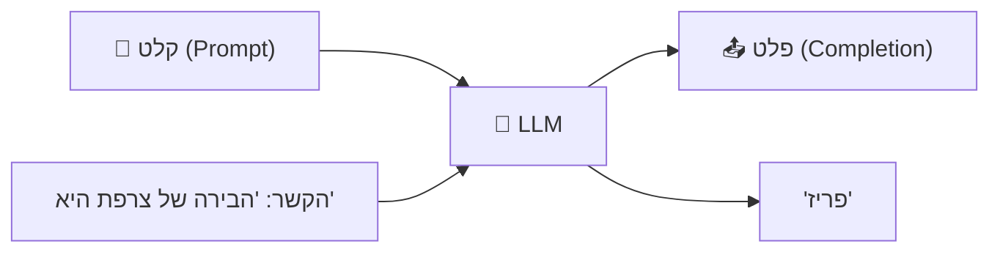
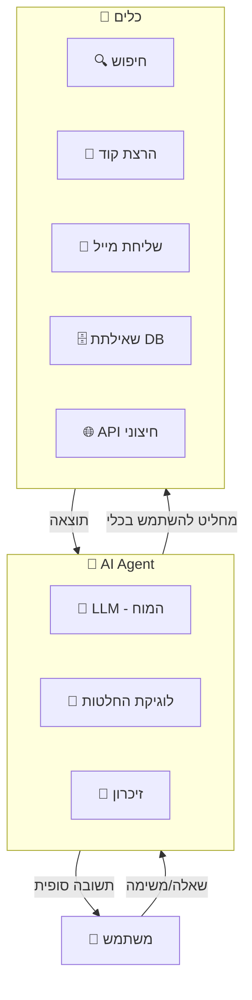
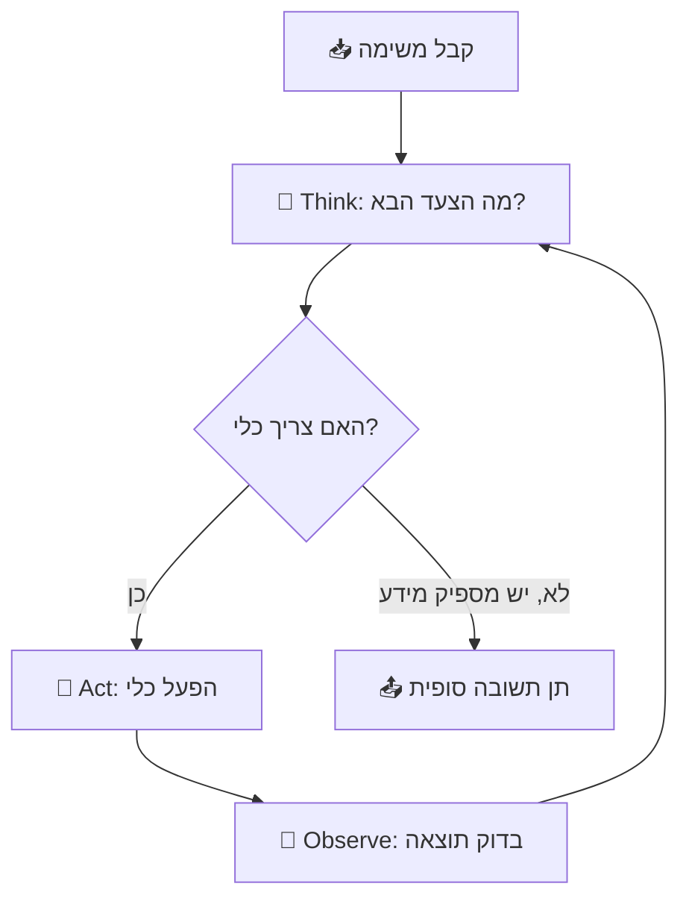
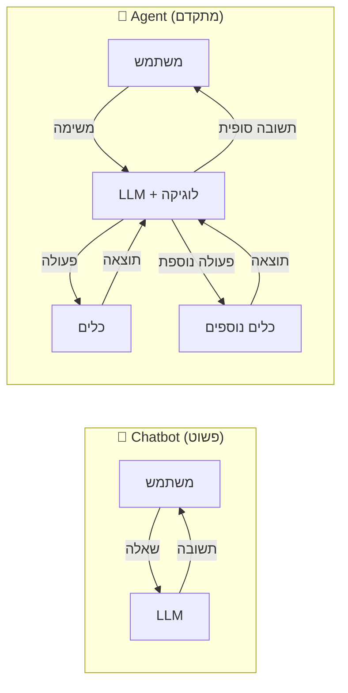
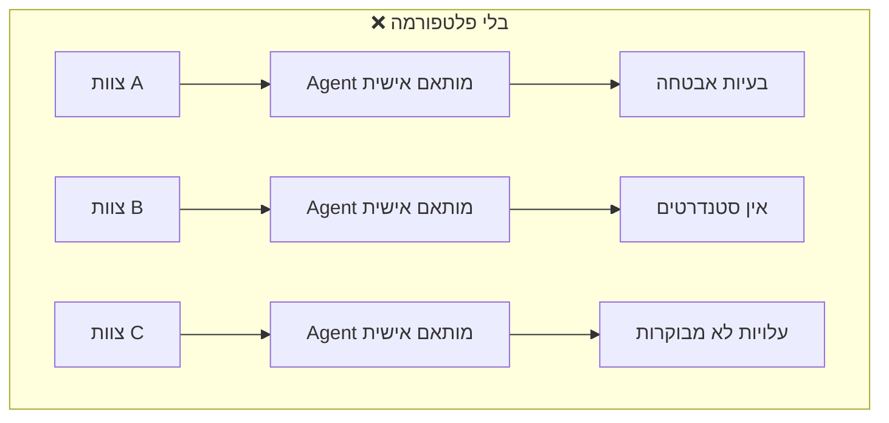
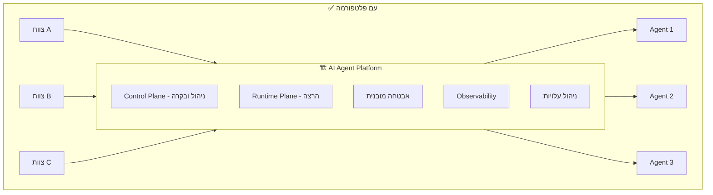
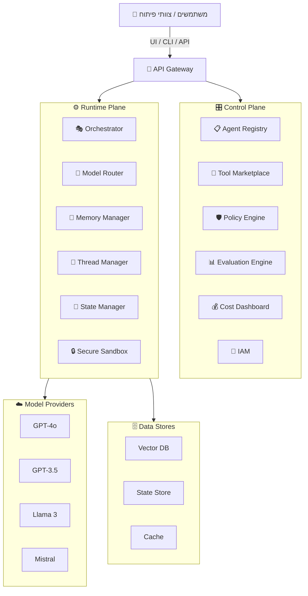

# 🤖 פרק 1: מושגי יסוד - מהו AI Agent?

## תוכן עניינים
- [מה זה LLM?](#מה-זה-llm)
- [מה זה AI Agent?](#מה-זה-ai-agent)
- [ההבדל בין Chatbot ל-Agent](#ההבדל-בין-chatbot-ל-agent)
- [למה צריך פלטפורמה?](#למה-צריך-פלטפורמה)
- [מושגי מפתח](#מושגי-מפתח)
- [סיכום ושאלות](#סיכום-ושאלות)

---

## מה זה LLM?

**LLM = Large Language Model** (מודל שפה גדול)

מודל שפה גדול הוא רשת נוירונים שאומנה על כמויות עצומות של טקסט. הוא למד "להבין" שפה ולייצר טקסט חדש.

### איך זה עובד - בפשטות



### מה LLM **יודע** לעשות:
- לענות על שאלות בשפה טבעית
- לסכם טקסטים
- לתרגם שפות
- לכתוב קוד
- לנתח נתונים טקסטואליים

### מה LLM **לא יודע** לעשות (לבד):
- ❌ לגלוש באינטרנט
- ❌ להריץ קוד
- ❌ לגשת למסד נתונים
- ❌ לשלוח מיילים
- ❌ לזכור שיחות קודמות (ללא מנגנון חיצוני)

### מושגים חשובים ב-LLM

| מושג | הסבר |
|------|-------|
| **Token** | יחידת הטקסט הבסיסית שה-LLM עובד איתה. מילה אחת ≈ 1-3 tokens |
| **Context Window** | כמות הטקסט המקסימלית שה-LLM יכול "לראות" בבת אחת (למשל 128K tokens) |
| **Prompt** | ההוראה/שאלה שאתה שולח ל-LLM |
| **Completion** | התשובה שה-LLM מייצר |
| **Temperature** | פרמטר שקובע כמה "יצירתית" התשובה (0=דטרמיניסטי, 1=יצירתי) |
| **System Prompt** | הוראות שמגדירות את ה"אישיות" וההתנהגות של ה-LLM |
| **Inference** | התהליך של הפעלת המודל כדי לקבל תשובה |

---

## מה זה AI Agent?

**Agent = LLM + כלים + לוגיקה של קבלת החלטות**

Agent הוא מערכת שלוקחת LLM ומוסיפה לו יכולת **לפעול בעולם** - לא רק לייצר טקסט, אלא גם להחליט אילו פעולות לבצע, לבצע אותן, ולהגיב על התוצאות.

### האנטומיה של Agent



### הלולאה הבסיסית של Agent (ReAct Pattern)

זהו הדפוס הנפוץ ביותר של Agents - **Reason + Act**:



### דוגמה מעשית

נניח שמשתמש שואל: *"כמה עובדים יש לי בתל אביב ומה השכר הממוצע שלהם?"*

```
🤔 Think: אני צריך לשלוף נתונים ממסד הנתונים
🔧 Act:  SQL Query → SELECT COUNT(*), AVG(salary) FROM employees WHERE city='Tel Aviv'
👀 Observe: count=142, avg_salary=28500
🤔 Think: יש לי את הנתונים, אני יכול לענות
📤 Answer: "יש לך 142 עובדים בתל אביב, עם שכר ממוצע של 28,500 ₪"
```

---

## ההבדל בין Chatbot ל-Agent

זו אחת השאלות הכי חשובות להבנה:



| תכונה | 💬 Chatbot | 🤖 Agent |
|--------|-----------|----------|
| **קלט** | שאלה בודדת | משימה מורכבת |
| **פלט** | תשובה טקסטואלית | תשובה + פעולות בעולם |
| **כלים** | ❌ אין | ✅ חיפוש, קוד, APIs |
| **זיכרון** | רק ההודעה הנוכחית | שיחה + היסטוריה ארוכת טווח |
| **אוטונומיה** | אפס - מחכה לשאלה | יכול להחליט מה לעשות בעצמו |
| **לולאות** | Turn אחד | ריבוי Steps עד השלמת משימה |
| **תכנון** | ❌ | ✅ יכול לפרק משימה לשלבים |

---

## למה צריך פלטפורמה?

חברה גדולה לא רוצה שכל צוות יבנה Agent מאפס. היא רוצה **פלטפורמה** שמספקת:





### למה "Platform as a Service" (PaaS)?

| מודל | מי אחראי על מה | דוגמה |
|------|----------------|-------|
| **IaaS** (Infrastructure) | אתה מנהל הכל - שרתים, רשת, OS | Azure VMs |
| **PaaS** (Platform) | הפלטפורמה מנהלת תשתית, אתה מתמקד בלוגיקה | Azure App Service |
| **SaaS** (Software) | הכל מוכן, אתה רק משתמש | ChatGPT |

**AI Agent PaaS** = אנחנו בונים את ה-PaaS. צוותי הפיתוח לא צריכים לדאוג לתשתית, אבטחה, או Scaling. הם פשוט יוצרים Agent, מגדירים כלים, ומריצים.

### יתרונות הפלטפורמה:

| יתרון | הסבר |
|-------|-------|
| **סטנדרטיזציה** | כל ה-Agents עובדים באותו אופן |
| **אבטחה מרכזית** | Policy Engine אחד שחל על כולם |
| **שקיפות עלויות** | כל צוות רואה כמה tokens הוא צורך |
| **איכות** | Evaluation Engine מרכזי שמוודא שה-Agents עובדים טוב |
| **מהירות פיתוח** | לא צריך לבנות מאפס כל פעם |
| **Marketplace** | שיתוף כלים ו-Agents בין צוותים |

---

## מושגי מפתח

מילון המונחים שיחזרו לאורך כל חומר הלימוד:

### ארכיטקטורה

| מושג | הסבר |
|------|-------|
| **Control Plane** | השכבה שמנהלת - הגדרות, הרשאות, Policies. לא מריצה Agents |
| **Runtime (Data) Plane** | השכבה שמריצה - כאן ה-Agent באמת עובד |
| **API Gateway** | נקודת כניסה אחת לכל הבקשות - מטפלת באימות, Rate Limiting |
| **Multi-tenancy** | יכולת לשרת הרבה לקוחות/צוותים על אותה תשתית, עם הפרדה ביניהם |

### Agent-ספציפי

| מושג | הסבר |
|------|-------|
| **Function Calling** | היכולת של LLM "לקרוא" לפונקציה חיצונית (כלי) |
| **Tool** | פונקציה שה-Agent יכול להשתמש בה (חיפוש, קוד, API) |
| **Prompt Engineering** | האומנות של כתיבת הוראות ל-LLM כדי לקבל תוצאה טובה |
| **RAG** | Retrieval Augmented Generation - חיפוש מידע רלוונטי ושילובו בפרומפט |
| **Embedding** | ייצוג מספרי של טקסט שמאפשר חיפוש סמנטי |
| **Grounding** | עיגון התשובות של ה-LLM בנתונים אמיתיים (במקום hallucination) |
| **Hallucination** | כשה-LLM "ממציא" מידע שלא נכון |
| **Guardrails** | כללים שמגבילים את ה-Agent ממעשים לא רצויים |

### תשתית

| מושג | הסבר |
|------|-------|
| **Horizontal Scaling** | הוספת מכונות נוספות (לעומת Vertical - הגדלת מכונה קיימת) |
| **Idempotency** | פעולה שאם תריץ אותה פעמיים, התוצאה זהה |
| **Circuit Breaker** | דפוס שמפסיק לשלוח בקשות לשירות כושל |
| **Backpressure** | מנגנון שמאט את קצב הבקשות כשהמערכת עמוסה |

---

## מבנה הפלטפורמה - מבט ראשוני

לפני שנצלול לכל רכיב בנפרד, הנה מבט כולל על איך הפלטפורמה בנויה:



---

## סיכום

| מה למדנו | נקודה מרכזית |
|-----------|-------------|
| **LLM** | מודל שפה שמייצר טקסט, אבל לא יכול לפעול בעולם לבד |
| **Agent** | LLM + כלים + לוגיקה = יכול לבצע משימות מורכבות |
| **ReAct** | Think → Act → Observe → חזור על הלולאה |
| **פלטפורמה** | מערכת מנוהלת שמאפשרת לצוותים ליצור Agents בקלות ובבטחה |
| **PaaS** | Platform as a Service - התשתית מנוהלת, אתה מתמקד בלוגיקה |

---

## ❓ שאלות לבדיקה עצמית

1. מה ההבדל העיקרי בין Chatbot ל-AI Agent?
2. מה זה Token ולמה חשוב לעקוב אחרי צריכת Tokens?
3. הסבר את לולאת ה-ReAct בשלושה צעדים.
4. למה חברה גדולה תעדיף פלטפורמה על פני שכל צוות יבנה Agent בעצמו?
5. מה ההבדל בין Control Plane ל-Runtime Plane? (רמז: ניהול לעומת הרצה)
6. מה זה Hallucination ואיך RAG עוזר להתמודד עם זה?

---

### 📝 תשובות

<details>
<summary>1. מה ההבדל העיקרי בין Chatbot ל-AI Agent?</summary>

**Chatbot** מגיב לשאלות עם תשובות טקסט בלבד - הוא רק "מדבר". **AI Agent** יכול גם **לפעול** - להפעיל כלים (APIs, DBs, שליחת מייל), לקבל החלטות, ולבצע משימות מורכבות באופן אוטונומי. Agent = LLM + Tools + Memory + Reasoning.
</details>

<details>
<summary>2. מה זה Token ולמה חשוב לעקוב אחרי צריכת Tokens?</summary>

**Token** הוא יחידת הטקסט הבסיסית שה-LLM מעבד (בערך 0.75 מילה באנגלית). חשוב לעקוב כי: (1) **עלות** - כל token עולה כסף, (2) **Context Window** - יש מגבלה על כמות ה-tokens בבקשה אחת, (3) **ביצועים** - יותר tokens = יותר זמן עיבוד.
</details>

<details>
<summary>3. הסבר את לולאת ה-ReAct בשלושה צעדים.</summary>

1. **Think (חשוב)** - ה-Agent מנתח את המשימה ומחליט מה הצעד הבא.
2. **Act (פעל)** - ה-Agent מפעיל כלי (API call, DB query, חיפוש).
3. **Observe (צפה)** - ה-Agent קורא את התוצאה ומחליט אם לחזור על הלולאה (צעד נוסף) או לסיים ולתת תשובה סופית.
</details>

<details>
<summary>4. למה חברה גדולה תעדיף פלטפורמה על פני שכל צוות יבנה Agent בעצמו?</summary>

בלי פלטפורמה: כל צוות בונה הכל מאפס → כפילויות, אין סטנדרט אבטחה, אין שליטה בעלויות, קשה לתחזק. עם פלטפורמה (PaaS): אבטחה מרכזית, שליטה בעלויות, שיתוף כלים ומודלים, סטנדרטיזציה, Observability אחיד, ו-Time-to-Market מהיר יותר.
</details>

<details>
<summary>5. מה ההבדל בין Control Plane ל-Runtime Plane?</summary>

**Control Plane** = שכבת **ניהול** - הגדרת Agents, ניהול הרשאות, policies, registry. עובד לעיתים רחוקות (כשמגדירים/משנים). **Runtime Plane** = שכבת **הרצה** - מעבד בקשות בפועל, מריץ Agents, קורא ל-LLMs ולכלים. עובד כל הזמן עם כל בקשת משתמש.
</details>

<details>
<summary>6. מה זה Hallucination ואיך RAG עוזר להתמודד עם זה?</summary>

**Hallucination** = כשה-LLM "ממציא" מידע שנשמע אמין אבל לא נכון. **RAG (Retrieval Augmented Generation)** עוזר על ידי כך שלפני שה-LLM עונה, המערכת **מחפשת מידע רלוונטי ממקורות אמינים** (מסמכים, DB) ומזריקה אותו ל-prompt. כך ה-LLM מבסס את התשובה על עובדות אמיתיות.
</details>

---

**[➡️ המשך לפרק 2: Control Plane →](02-control-plane.md)**
