# ⚙️ פרק 3: Runtime (Data) Plane

## תוכן עניינים
- [מהו Runtime Plane?](#מהו-runtime-plane)
- [ההבדל בין Control ל-Runtime](#ההבדל-בין-control-ל-runtime)
- [מחזור חיים של בקשה](#מחזור-חיים-של-בקשה)
- [רכיבי ה-Runtime Plane](#רכיבי-ה-runtime-plane)
- [The Orchestrator](#the-orchestrator)
- [Execution Models](#execution-models)
- [הרצה בטוחה - Sandboxing](#הרצה-בטוחה---sandboxing)
- [יתרונות וחסרונות](#יתרונות-וחסרונות)
- [סיכום ושאלות](#סיכום-ושאלות)

---

## מהו Runtime Plane?

ה-**Runtime Plane** (נקרא גם Data Plane) הוא המקום שבו ה-Agent **באמת עובד**. כאן קורים כל הדברים "החיים": קריאות ל-LLM, הרצת כלים, ניהול זיכרון, ובניית תשובות.

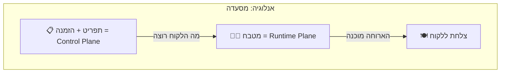

### בקצרה:
- **Control Plane** = "מה לעשות?" (הגדרות, Policies, Registry)
- **Runtime Plane** = "עושה את זה!" (הרצה, LLM calls, כלים)

---

## ההבדל בין Control ל-Runtime

| תכונה | 🎛️ Control Plane | ⚙️ Runtime Plane |
|--------|-----------------|-----------------|
| **מטרה** | ניהול והגדרות | הרצה ועיבוד |
| **תעבורה** | נמוכה (קונפיגורציה) | גבוהה (בקשות משתמשים) |
| **Latency דרוש** | לא קריטי (שניות OK) | קריטי (מילישניות) |
| **Scaling** | מינימלי | אגרסיבי (אלפי בקשות/שנייה) |
| **Stateful/Stateless** | בעיקר Stateless | Stateful (Thread, Memory) |
| **כשל** | "אי אפשר לנהל" | "Agents לא עובדים" |
| **דוגמאות** | Registry, IAM, Policy | Orchestrator, LLM calls, Tools |

---

## מחזור חיים של בקשה (Request Lifecycle)

הנה מה שקורה מהרגע שמשתמש שולח בקשה לAgent ועד שמקבל תשובה:

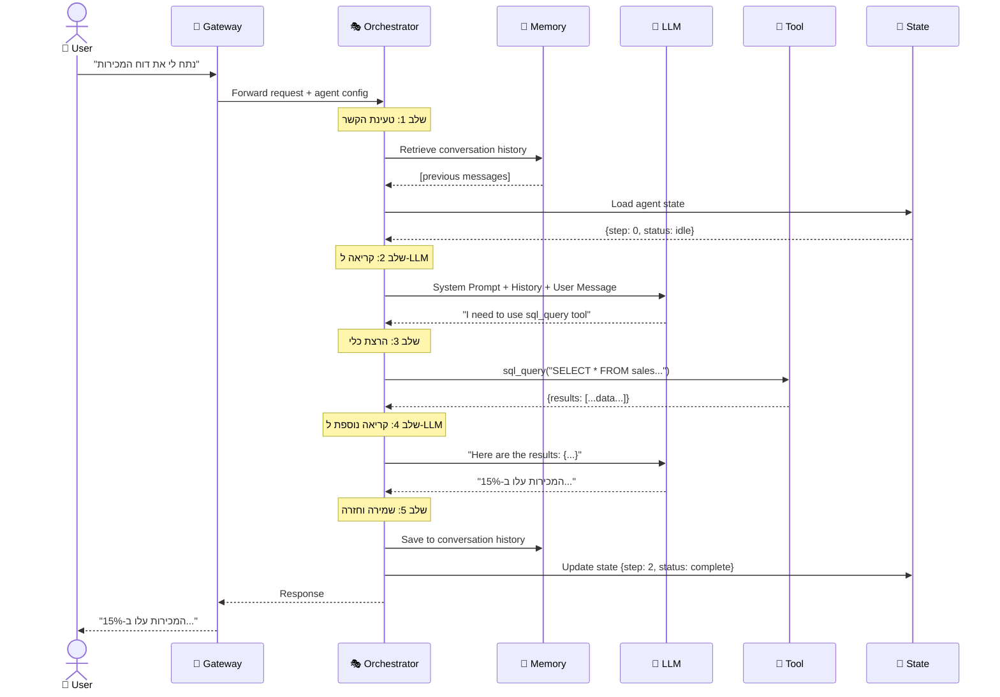

### מבנה ה-Request בכל שלב:

```
Request Lifecycle:
│
├── 1. 📥 RECEIVE
│   ├── Parse user input
│   ├── Identify target agent
│   └── Load agent configuration from Registry
│
├── 2. 📚 CONTEXT BUILDING
│   ├── Load conversation history (Short-term Memory)
│   ├── Retrieve relevant docs (Long-term Memory / RAG)
│   ├── Load agent state
│   └── Build full prompt
│
├── 3. 🧠 LLM INFERENCE
│   ├── Send prompt to Model Router
│   ├── Model Router selects best model
│   └── Get LLM response
│
├── 4. 🔍 PARSE & DECIDE
│   ├── Is it a final answer? → Go to step 6
│   ├── Is it a tool call? → Go to step 5
│   └── Is it a sub-agent call? → Spawn sub-agent
│
├── 5. 🔧 TOOL EXECUTION
│   ├── Validate tool is allowed (Policy check)
│   ├── Execute in sandbox
│   ├── Capture result
│   └── Go back to step 3 (with tool result)
│
└── 6. 📤 RESPOND
    ├── Format response
    ├── Save to memory
    ├── Update state
    ├── Log metrics (tokens, latency, cost)
    └── Return to user
```

---

## רכיבי ה-Runtime Plane

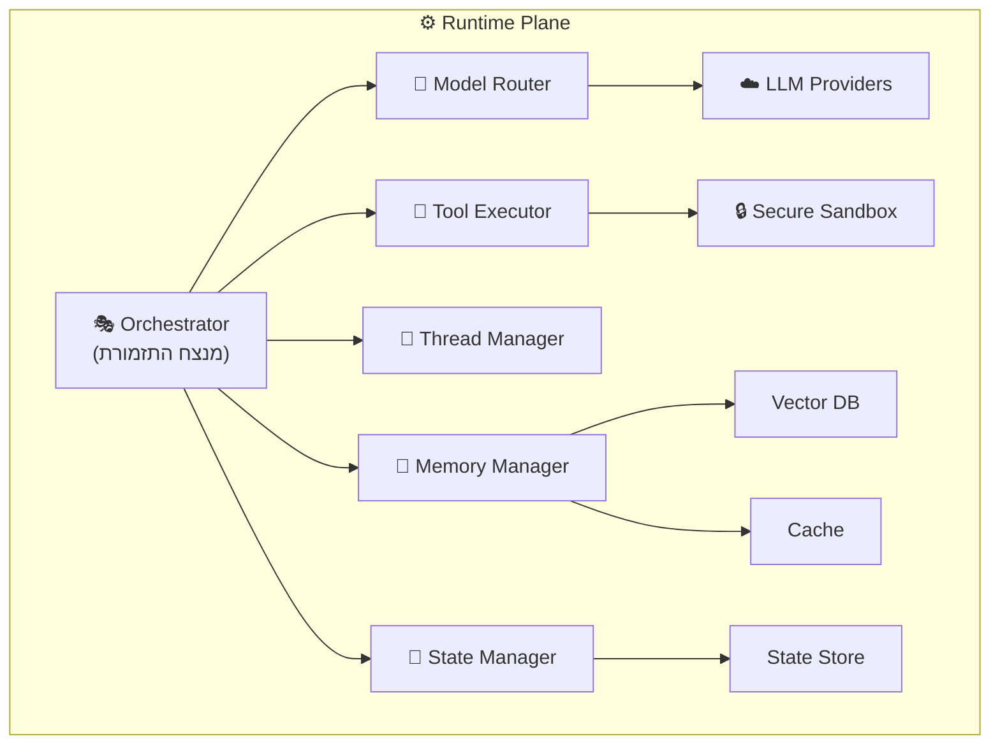

| רכיב | תפקיד | פרק מורחב |
|------|--------|-----------|
| **Orchestrator** | מנהל את זרימת ההרצה, מחליט מתי לקרוא ל-LLM ומתי לכלי | פרק 7 |
| **Model Router** | בוחר איזה LLM להשתמש לכל בקשה | פרק 4 |
| **Memory Manager** | מנהל זיכרון קצר/ארוך טווח | פרק 5 |
| **Thread Manager** | מנהל שיחות ו-context | פרק 6 |
| **State Manager** | שומר מצב של workflows ארוכים | פרק 6 |
| **Tool Executor** | מריץ כלים בסביבה מאובטחת | פרק 8 |

---

## The Orchestrator

ה-Orchestrator הוא **הלב** של ה-Runtime Plane. הוא ה"מנצח" שמתאם בין כל הרכיבים.

### תפקידים:

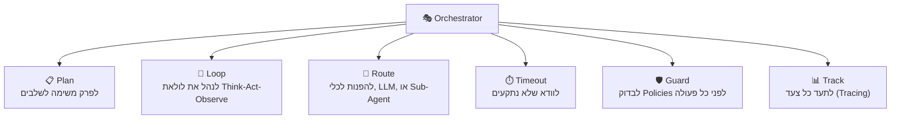

### הלולאה הפנימית של ה-Orchestrator:

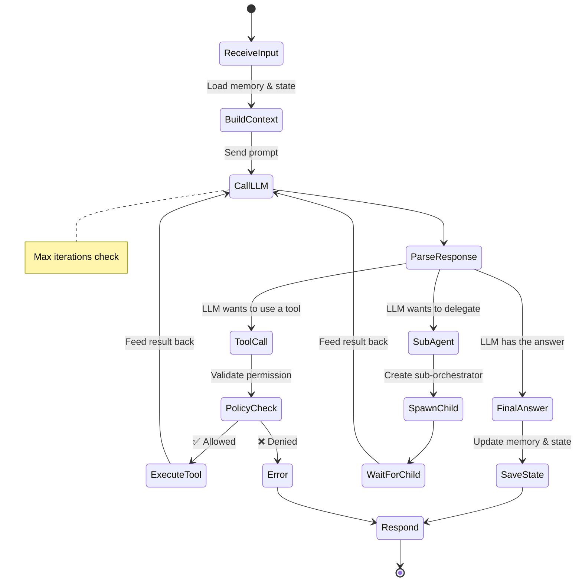

### Max Steps / Circuit Breaker

בעיה: מה אם ה-Agent נכנס ללולאה אינסופית?

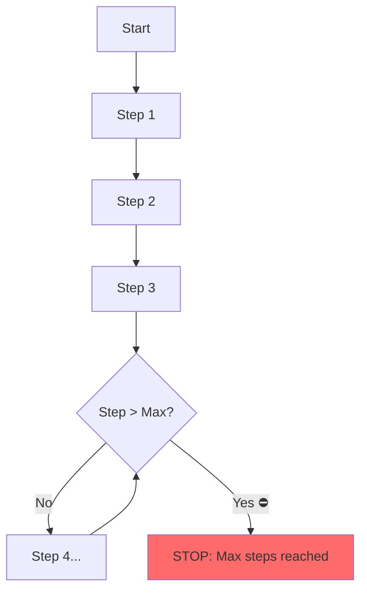

| מנגנון הגנה | הסבר |
|-------------|-------|
| **Max Steps** | מספר מקסימלי של iterations (למשל 10) |
| **Timeout** | זמן מקסימלי להרצה (למשל 120 שניות) |
| **Token Budget** | מספר מקסימלי של tokens (למשל 50,000) |
| **Cost Budget** | עלות מקסימלית (למשל $0.50) |
| **Circuit Breaker** | אם שירות חיצוני כושל 3 פעמים, תפסיק לנסות |

---

## Execution Models

יש כמה דרכים שונות להריץ Agent. כל אחת מתאימה למקרה שימוש אחר:

### 1. Synchronous (סינכרוני)

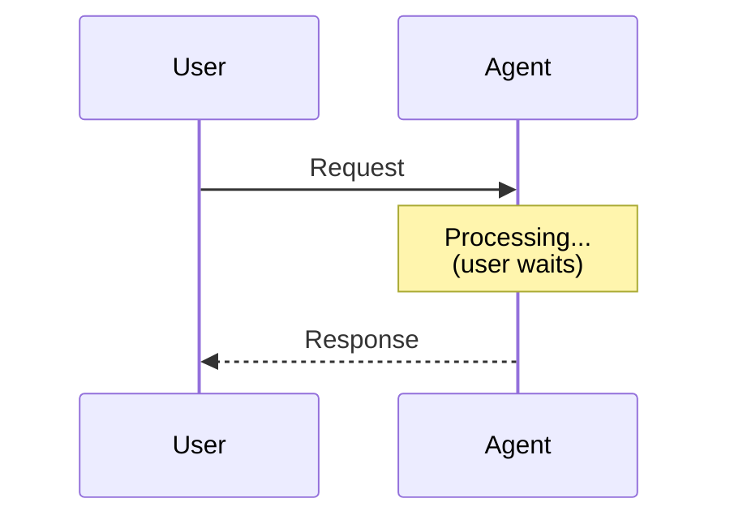

| בעד | נגד |
|-----|-----|
| פשוט ליישום | המשתמש מחכה |
| קל לדבג | לא מתאים למשימות ארוכות |
| תשובה מיידית | Timeout ב-HTTP (30-60 sec) |

**מתאים ל:** שאלות מהירות, chat-style

### 2. Asynchronous (אסינכרוני)

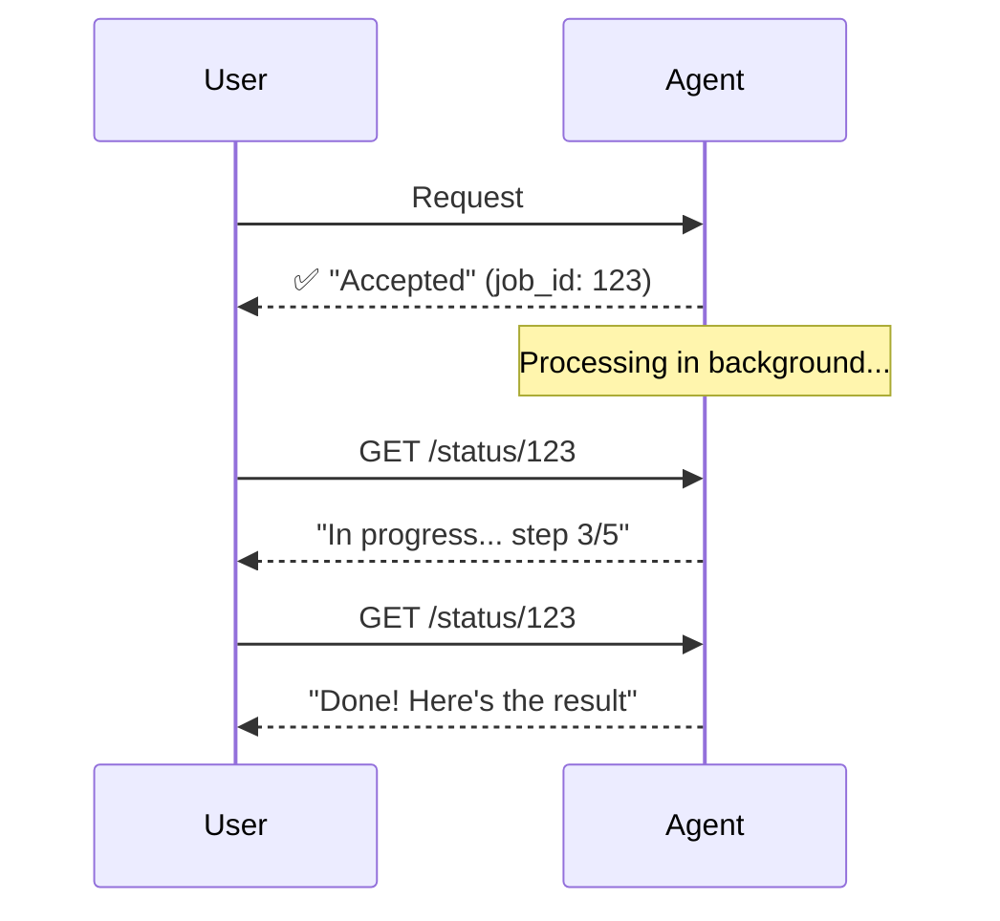

| בעד | נגד |
|-----|-----|
| המשתמש לא מחכה | מורכבות גבוהה יותר |
| מתאים למשימות ארוכות | צריך מנגנון Polling/Webhook |
| אפשר לבטל | ניהול State מורכב |

**מתאים ל:** משימות מורכבות, דוחות, אנליזות

### 3. Streaming

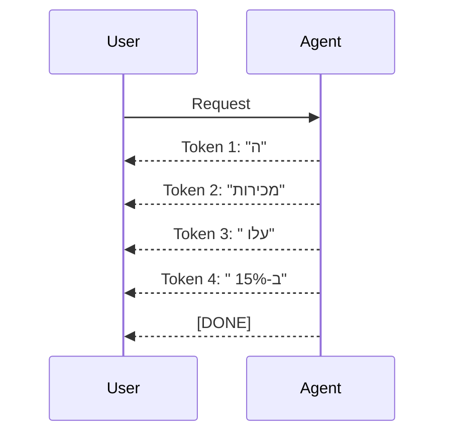

| בעד | נגד |
|-----|-----|
| תחושת מהירות (UX טוב) | מורכבות בצד Client |
| המשתמש רואה תוצאות תוך כדי | קשה לעבד Tool Calls |
| נמוך Memory footprint | Retry Logic מורכב |

**מתאים ל:** Chat UI, תשובות טקסטואליות ארוכות

---

## הרצה בטוחה - Sandboxing

### למה צריך Sandbox?

Agent יכול לייצר ולהריץ קוד. זה **מסוכן**:

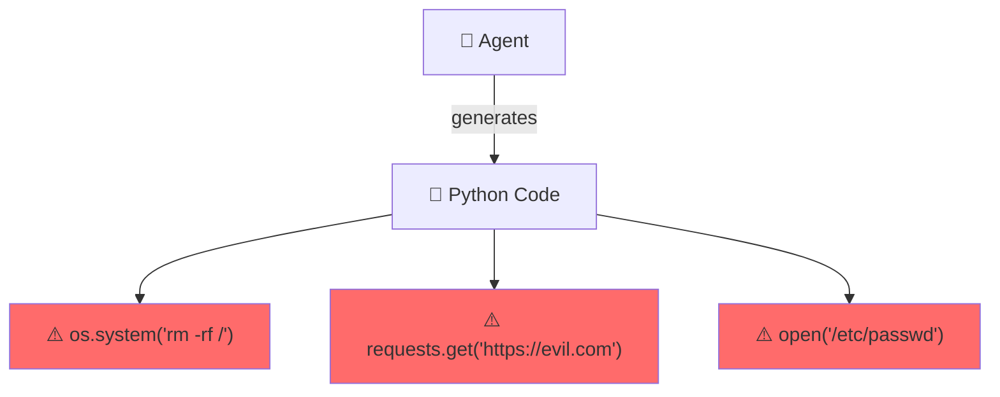

### פתרון: Secure Sandbox

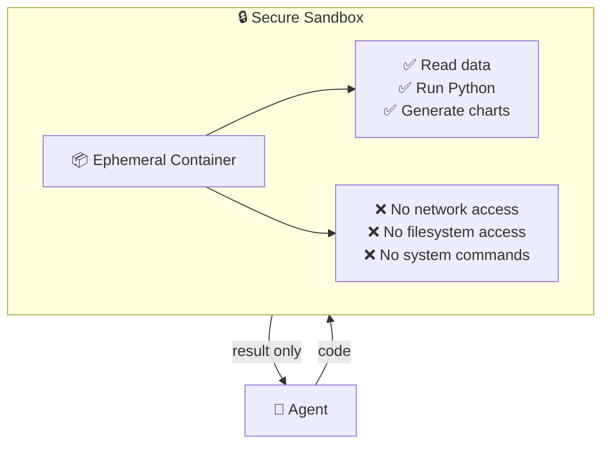

### רמות בידוד (Isolation Levels)

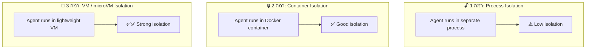

| רמה | טכנולוגיה | אבטחה | ביצועים | עלות |
|-----|-----------|--------|---------|------|
| **Process** | subprocess, fork | ⚠️ נמוכה | ⚡ מהיר | 💰 זול |
| **Container** | Docker, containerd | ✅ טובה | ⚡ מהיר | 💰 בינוני |
| **microVM** | Firecracker, gVisor | ✅✅ גבוהה | 🐌 איטי | 💰💰 יקר |
| **Ephemeral Session** | Azure Dynamic Sessions | ✅✅ גבוהה | ⚡ מהיר | 💰💰 בינוני |

### תכונות של Sandbox טוב:

| תכונה | הסבר |
|--------|-------|
| **Ephemeral** | נוצר ונהרס לכל הרצה - אין שאריות |
| **Resource Limits** | CPU, Memory, Disk מוגבלים |
| **Network Isolation** | אין גישה לרשת (או גישה מוגבלת) |
| **Filesystem Isolation** | אין גישה ל-filesystem של המארח |
| **Time Limit** | ההרצה מוגבלת בזמן |
| **Read-only** | ה-Agent יכול לקרוא אבל לא לכתוב |

---

## Scaling ב-Runtime Plane

ה-Runtime Plane הוא זה שצריך את ה-Scaling הכי אגרסיבי:

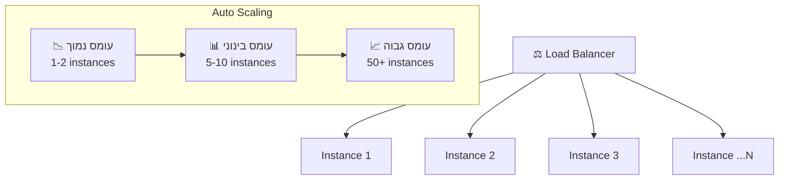

### Stateless vs Stateful Scaling

| סוגי רכיבים | Scaling | הסבר |
|-------------|---------|-------|
| **Stateless** (API, Router) | קל | פשוט מוסיפים instances |
| **Stateful** (Memory, State) | מורכב | צריך shared storage או sticky sessions |

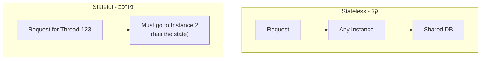

**הפתרון:** externalize state

כל ה-state נשמר **מחוץ** ל-instance (ב-Redis, DB, etc.), כך שכל instance יכול לטפל בכל בקשה.

---

## יתרונות וחסרונות

### ✅ יתרונות

| יתרון | הסבר |
|-------|-------|
| **Decoupled** | כל רכיב עצמאי - קל להחליף/לשדרג |
| **Scalable** | כל רכיב scales בנפרד |
| **Observable** | ניתן למדוד כל שלב בזרימה |
| **Secure** | Sandbox isolates untrusted code |

### ❌ אתגרים

| אתגר | הסבר | פתרון |
|-------|------|-------|
| **Latency** | הרבה hops = latency | Optimize critical path, caching |
| **Complexity** | הרבה רכיביות | Good observability, testing |
| **State management** | Hard to scale stateful components | Externalize state |
| **Cost** | LLM calls are expensive | Model routing, caching |

---

## סיכום

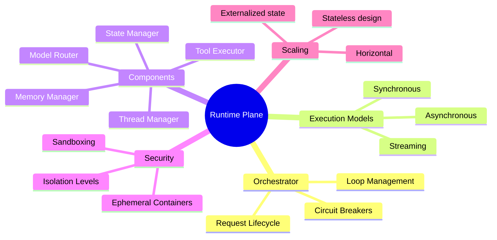

| מה למדנו | נקודה מרכזית |
|-----------|-------------|
| **Runtime Plane** | כאן ה-Agent באמת עובד - LLM calls, כלים, זיכרון |
| **Request Lifecycle** | Receive → Context → LLM → Parse → Tool/Answer → Save |
| **Orchestrator** | ה"מנצח" - מתאם בין כל הרכיבים |
| **Execution Models** | Sync (מהיר), Async (ארוך), Streaming (UX טוב) |
| **Sandbox** | סביבה מבודדת להרצת קוד שה-Agent מייצר |
| **Scaling** | Stateless components scale בקלות, Stateful דורש externalized state |

---

## ❓ שאלות לבדיקה עצמית

1. מה ההבדל העיקרי בין Control Plane ל-Runtime Plane?
2. תתאר את 6 השלבים במחזור חיים של בקשה.
3. מה תפקיד ה-Orchestrator?
4. למה צריך Circuit Breaker ומה הוא עושה?
5. מה ההבדל בין Sync, Async, ו-Streaming execution?
6. למה Agent צריך Sandbox וכמה רמות בידוד יש?
7. מה הבעיה עם Stateful components ב-Scaling ומה הפתרון?

---

**[⬅️ חזרה לפרק 2: Control Plane](02-control-plane.md)** | **[➡️ המשך לפרק 4: Model Abstraction & Routing →](04-model-abstraction-routing.md)**
