# 🧠 פרק 4: Model Abstraction & Multi-Model Routing

## תוכן עניינים
- [למה צריך שכבת הפשטה?](#למה-צריך-שכבת-הפשטה)
- [Model Abstraction Layer](#model-abstraction-layer)
- [Multi-Model Routing](#multi-model-routing)
- [אסטרטגיות Routing](#אסטרטגיות-routing)
- [Fallback & Retry](#fallback--retry)
- [Load Balancing בין מודלים](#load-balancing-בין-מודלים)
- [Caching של תשובות](#caching-של-תשובות)
- [השוואת מודלים](#השוואת-מודלים)
- [יתרונות וחסרונות](#יתרונות-וחסרונות)
- [סיכום ושאלות](#סיכום-ושאלות)

---

## למה צריך שכבת הפשטה?

### הבעיה: כל ספק LLM שונה

כל ספק (OpenAI, Anthropic, Meta, Google) מציע API שונה:

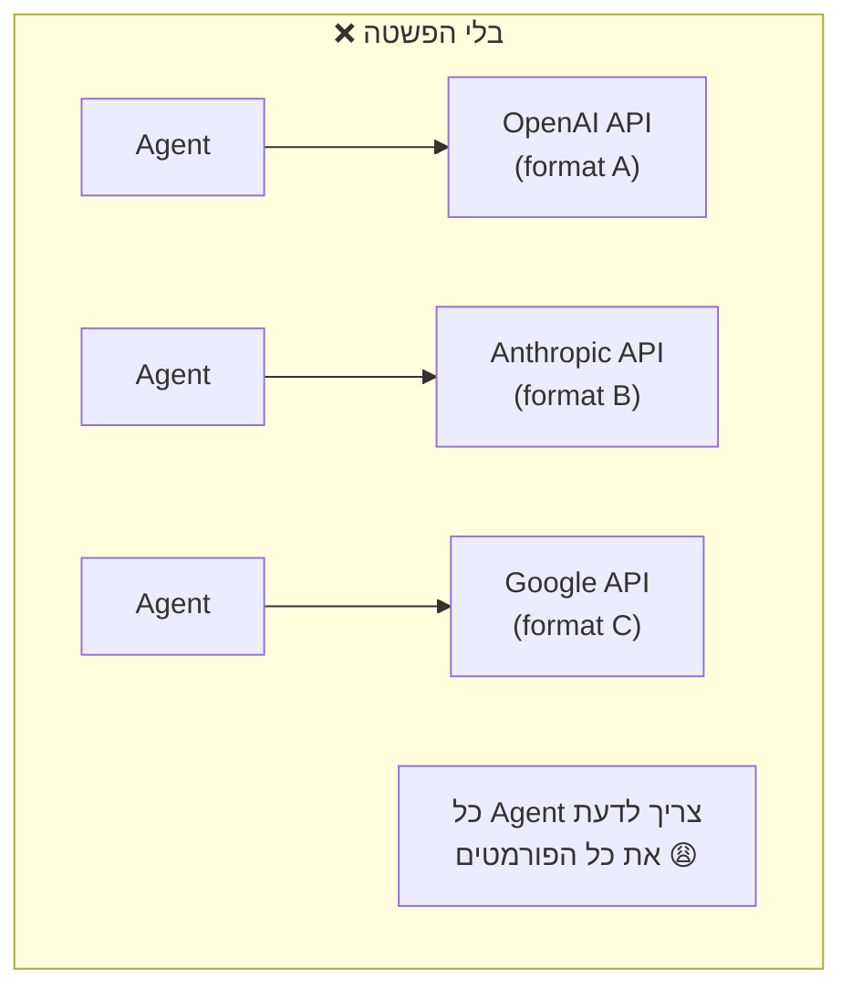

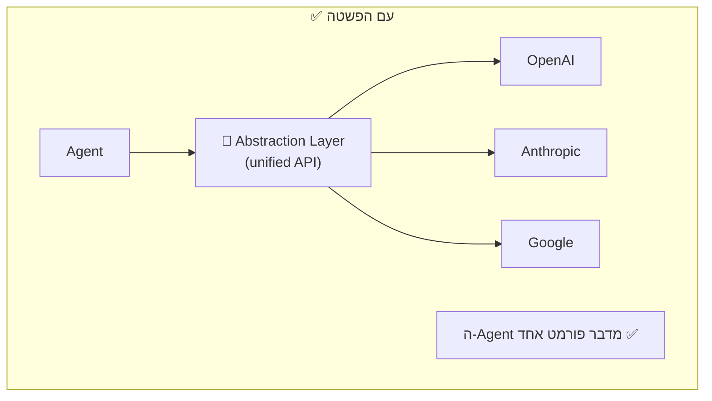

### דוגמה קונקרטית לבעיה:

| ספק | פורמט Request | Tool Calling | Streaming |
|-----|--------------|-------------|-----------|
| **OpenAI** | `messages: [{role, content}]` | `tools: [{function}]` | SSE events |
| **Anthropic** | `messages: [{role, content}]` | `tools: [{name, input_schema}]` | SSE (different format) |
| **Google** | `contents: [{parts}]` | `function_declarations` | Server-sent events |

ה-Agent לא צריך להכיר את כל ההבדלים האלה. שכבת ההפשטה מסתירה אותם.

---

## Model Abstraction Layer

### מה זה?
שכבה שמספקת **Interface אחיד** לכל ה-LLMs. לא משנה איזה מודל מאחורה, ה-Agent שולח בפורמט אחד.

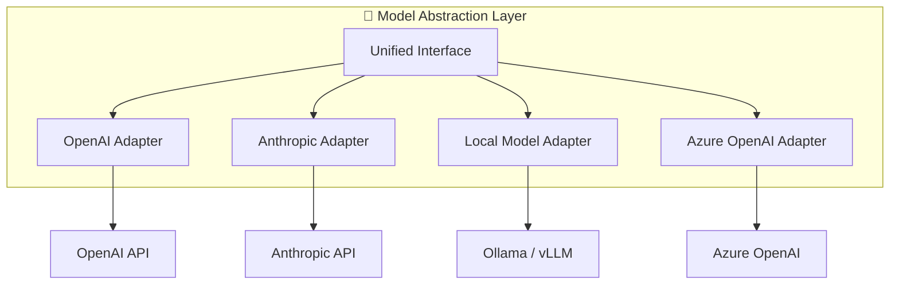

### Adapter Pattern (דפוס עיצוב)

ה-Abstraction Layer משתמש בדפוס **Adapter**:

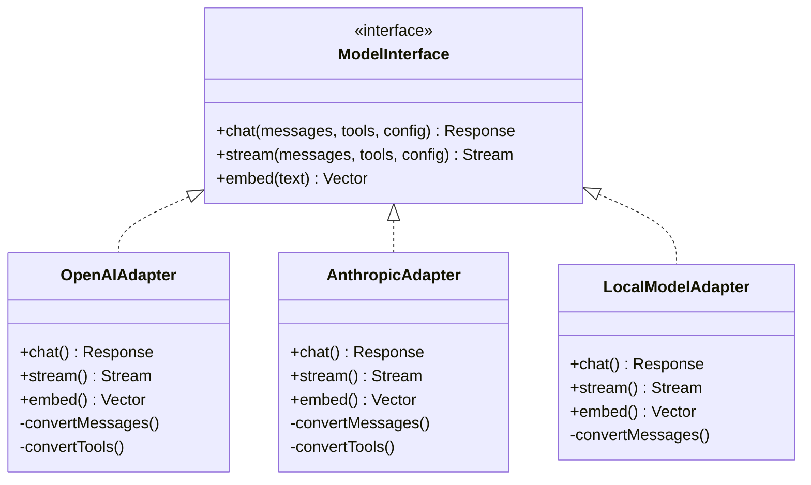

### מה ה-Adapter עושה:
1. **Input Translation** - ממיר את הפורמט האחיד לפורמט של הספק
2. **Output Normalization** - ממיר את התשובה חזרה לפורמט אחיד
3. **Error Handling** - מטפל בשגיאות ספציפיות לספק
4. **Feature Detection** - יודע אילו יכולות המודל תומך (function calling, vision, etc.)

---

## Multi-Model Routing

### מה זה?
**Model Router** הוא הרכיב שמחליט **לאיזה מודל** לשלוח כל בקשה. לא כל משימה צריכה את המודל הכי חזק (ויקר).

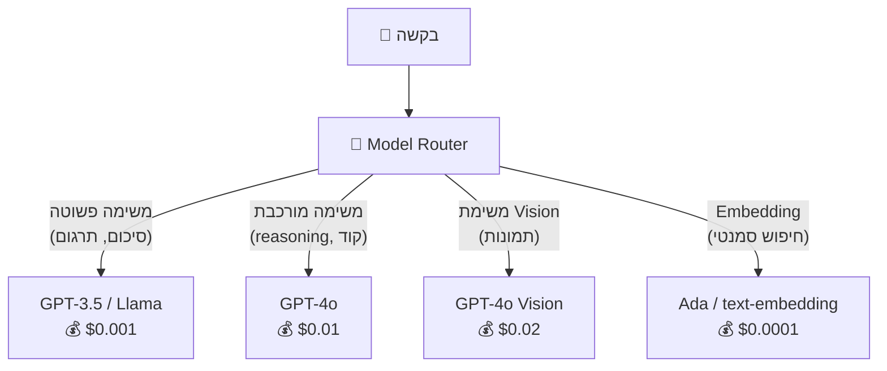

### למה לא פשוט להשתמש תמיד במודל הכי טוב?

| מודל | איכות | מהירות | עלות ל-1M tokens |
|------|--------|--------|-----------------|
| **GPT-4o** | ⭐⭐⭐⭐⭐ | 🐌 | $5.00 |
| **GPT-4o-mini** | ⭐⭐⭐⭐ | ⚡ | $0.15 |
| **GPT-3.5** | ⭐⭐⭐ | ⚡⚡ | $0.50 |
| **Llama 3 (self-hosted)** | ⭐⭐⭐ | ⚡ | $0.00 (infra costs) |

> **מסקנה:** אם 80% מהבקשות הן פשוטות, אפשר לחסוך הרבה כסף על ידי ניתוב חכם!

---

## אסטרטגיות Routing

### 1. Content-Based Routing (לפי תוכן)

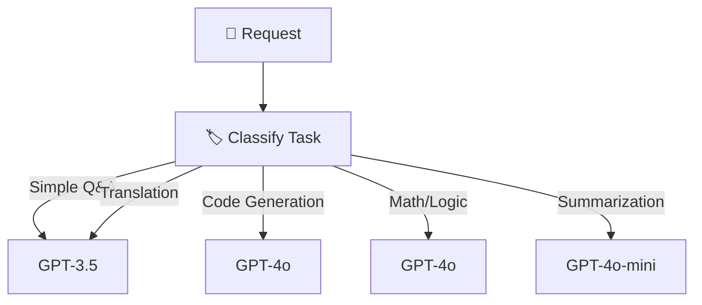

**איך מסווגים?**
- Classifier קטן (LLM קטן או regex)
- לפי הכלים שה-Agent משתמש
- לפי keywords ב-prompt

| בעד | נגד |
|-----|-----|
| ✅ חיסכון משמעותי | ❌ הסיווג עצמו לוקח זמן |
| ✅ כל משימה מקבלת מודל מתאים | ❌ סיווג שגוי = תשובה גרועה |

### 2. Cost-Based Routing (לפי עלות)

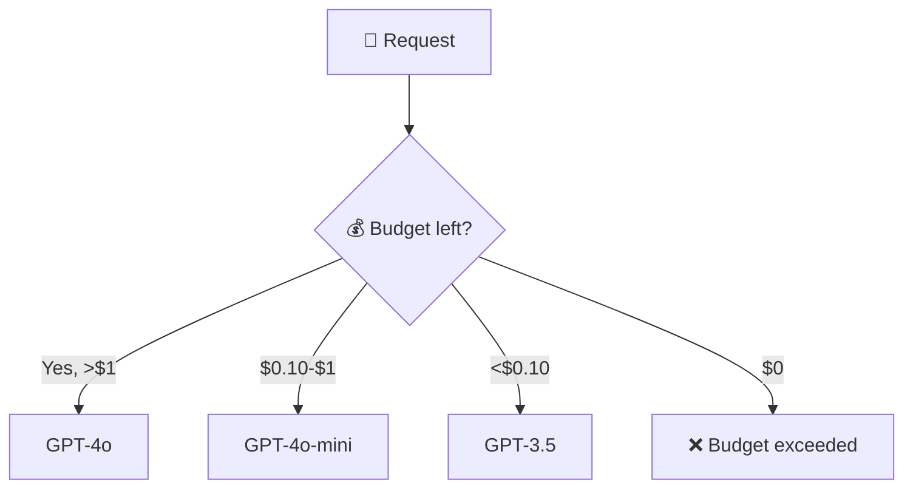

| בעד | נגד |
|-----|-----|
| ✅ שליטה מלאה בעלויות | ❌ איכות עלולה לרדת |
| ✅ אכיפת budget per-agent | ❌ לא תמיד הסכום מייצג את הצורך |

### 3. Latency-Based Routing (לפי מהירות)

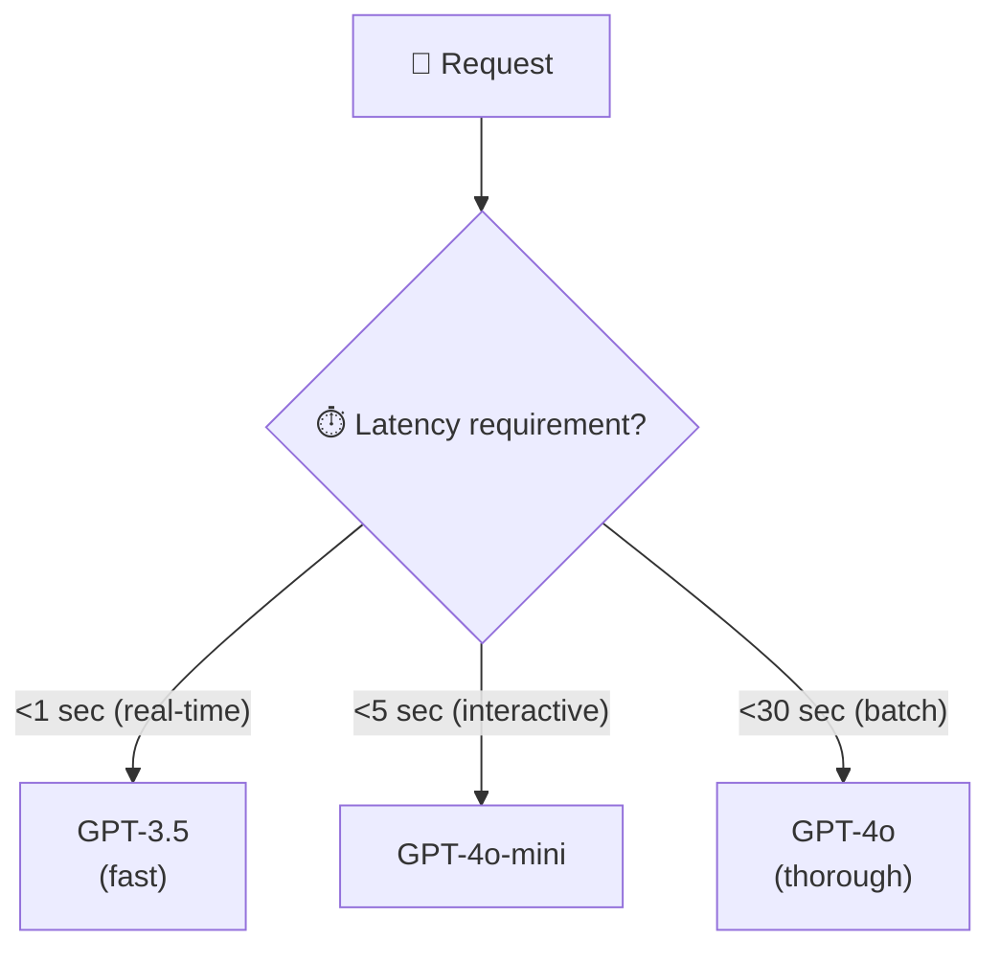

### 4. Capability-Based Routing (לפי יכולות)

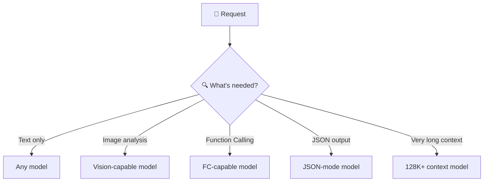

### 5. Hybrid Routing (שילוב)

בפרקטיקה, משלבים מספר אסטרטגיות:

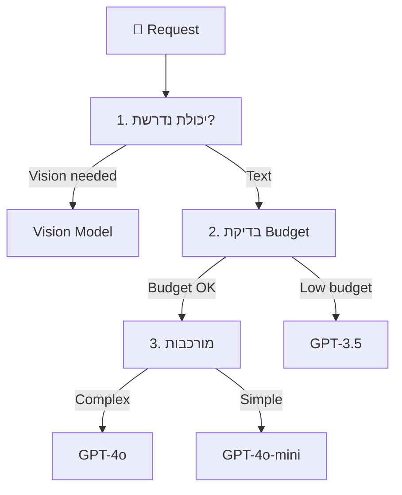

---

## Fallback & Retry

### מה קורה כשמודל לא זמין?

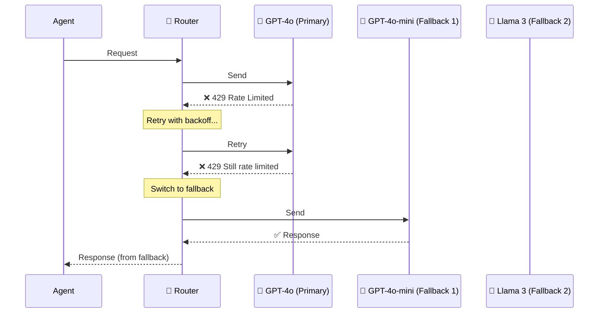

### Retry Strategies

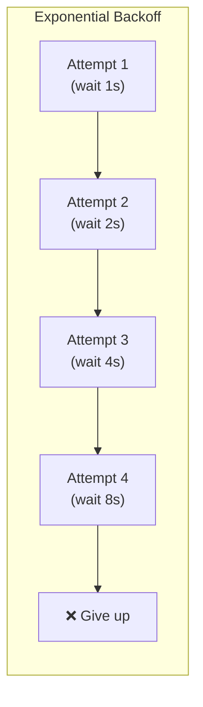

| אסטרטגיית Retry | הסבר | מתי להשתמש |
|-----------------|-------|-----------|
| **Fixed delay** | מחכה X שניות בין ניסיונות | שגיאות זמניות קצרות |
| **Exponential backoff** | מכפיל את זמן ההמתנה | Rate limiting (429) |
| **Jitter** | מוסיף אקראיות לזמן ההמתנה | כשהרבה clients עושים retry |
| **Circuit breaker** | מפסיק לנסות לגמרי | כשהשירות נפל לגמרי |

### Fallback Chain

```
Primary: GPT-4o (Azure East US)
    ↓ (if fails)
Fallback 1: GPT-4o (Azure West Europe)
    ↓ (if fails)
Fallback 2: GPT-4o-mini (Azure East US)
    ↓ (if fails)
Fallback 3: Local Llama 3
    ↓ (if fails)
Error: "Service temporarily unavailable"
```

---

## Load Balancing בין מודלים

כשיש הרבה deployments של אותו מודל, צריך **לפזר עומס**:

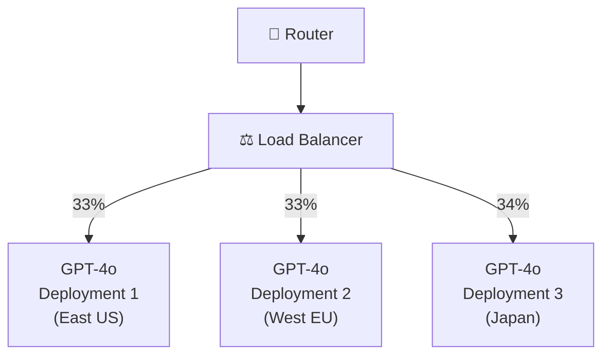

### אלגוריתמי Load Balancing:

| אלגוריתם | הסבר | בעד | נגד |
|-----------|-------|-----|-----|
| **Round Robin** | מחלק לפי תור | פשוט | לא מתחשב בעומס |
| **Least Connections** | שולח לזה עם הכי פחות בקשות פתוחות | מתחשב בעומס | צריך tracking |
| **Weighted** | לפי משקלים (deployment חזק = יותר בקשות) | גמיש | צריך כיול |
| **Latency-based** | שולח לזה עם ה-latency הנמוך ביותר | מהירות | צריך monitoring |
| **Token-aware** | מתחשב ב-RPM/TPM limits של כל deployment | מנצל TPM limits טוב | מורכב |

---

## Caching של תשובות

### למה Caching?
אם אותה שאלה חוזרת, למה לשלם שוב על LLM call?

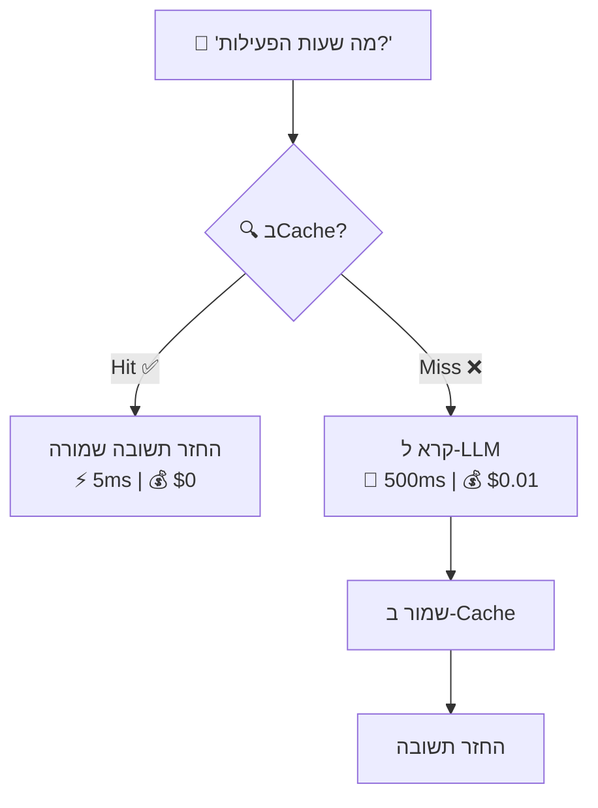

### סוגי Cache:

| סוג | הסבר | Hit Rate | מורכבות |
|-----|-------|----------|---------|
| **Exact Match** | אותה שאלה בדיוק | נמוך | פשוט |
| **Semantic Cache** | שאלות דומות (embedding similarity) | גבוה | מורכב |
| **Prompt Cache** | Cache של system prompt (prefix) | גבוה | בינוני |

### Semantic Cache - דוגמה:

```
Query 1: "What are your business hours?"
Query 2: "When are you open?"
Query 3: "What time do you close?"

→ כולם דומים סמנטית → אותה תשובה מה-Cache!
```

### מתי **לא** לעשות Cache:
- ❌ שאלות שדורשות נתונים עדכניים ("מה מזג האוויר?")
- ❌ שאלות פרסונליות ("מה הקניות שלי?")
- ❌ Agent שחייב tool execution
- ❌ תשובות שתלויות ב-context רנדומלי

---

## השוואת מודלים

### ציר האיכות-עלות-מהירות:

```mermaid
quadrantChart
    title Model Comparison: Quality vs Cost
    x-axis Low Cost --> High Cost
    y-axis Low Quality --> High Quality
    quadrant-1 Best (but expensive)
    quadrant-2 Ideal
    quadrant-3 Budget
    quadrant-4 Avoid
    GPT-4o: [0.8, 0.9]
    GPT-4o-mini: [0.3, 0.75]
    GPT-3.5: [0.15, 0.5]
    Llama-3-70B: [0.4, 0.7]
    Llama-3-8B: [0.1, 0.4]
    Claude-Opus: [0.9, 0.95]
    Claude-Sonnet: [0.5, 0.85]
```

### טבלת השוואה מפורטת:

| קריטריון | כשלבחור מודל גדול | כשלבחור מודל קטן |
|-----------|-------------------|-------------------|
| **Complex reasoning** | ✅ | ❌ |
| **Simple Q&A** | Overkill | ✅ |
| **Code generation** | ✅ | ⚠️ |
| **Summarization** | Overkill | ✅ |
| **Translation** | Overkill | ✅ |
| **Math / Logic** | ✅ | ❌ |
| **High volume** | 💸 Expensive | ✅ |
| **Low latency** | 🐌 Slower | ✅ |

---

## יתרונות וחסרונות

### ✅ יתרונות של Model Abstraction + Routing

| יתרון | הסבר |
|-------|-------|
| **Vendor Independence** | לא נעולים בספק אחד |
| **Cost Optimization** | כל משימה מגיעה למודל המתאים (ולא ליקר ביותר) |
| **Resilience** | אם מודל אחד נפל, יש Fallback |
| **Flexibility** | קל להוסיף/להחליף מודלים |
| **A/B Testing** | קל לבדוק מודלים חדשים על production traffic |

### ❌ אתגרים

| אתגר | פתרון |
|-------|-------|
| Routing logic מורכב | התחל עם כללים פשוטים, הוסף מורכבות בהדרגה |
| Latency נוסף (classification) | Cache classification results |
| Inconsistency בין מודלים | Evaluation Engine (פרק 10) |
| Semantic Cache accuracy | טיונינג של similarity threshold |

---

## סיכום

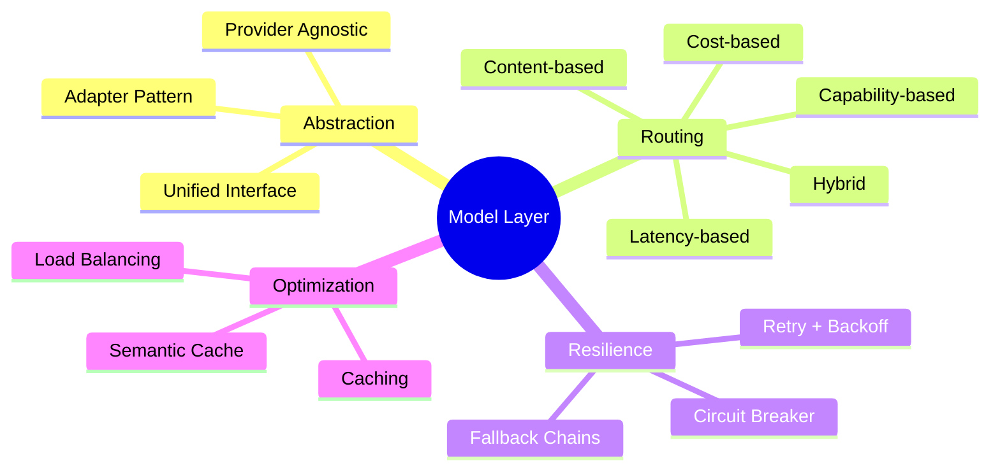

| מה למדנו | נקודה מרכזית |
|-----------|-------------|
| **Abstraction Layer** | Interface אחיד לכל ה-LLMs - Adapter Pattern |
| **Model Router** | מחליט לאיזה מודל לשלוח כל בקשה |
| **Routing Strategies** | Content, Cost, Latency, Capability, Hybrid |
| **Fallback** | Chain של מודלים חלופיים במקרה של כשל |
| **Load Balancing** | פיזור עומס בין deployments (Round Robin, Least Connections) |
| **Caching** | Exact Match / Semantic Cache לחיסכון בעלויות |

---

## ❓ שאלות לבדיקה עצמית

1. למה צריך שכבת הפשטה מעל ה-LLMs?
2. מהו ה-Adapter Pattern ואיך הוא עוזר כאן?
3. תתאר 3 אסטרטגיות Routing שונות ואיך הן עובדות.
4. מה ההבדל בין Fallback ל-Retry?
5. מה זה Exponential Backoff עם Jitter ולמה זה חשוב?
6. מה ההבדל בין Exact Match Cache ל-Semantic Cache?
7. מתי **לא** כדאי לעשות Cache?
8. איזה מודל תבחר לכל משימה: סיכום דוח, פתרון בעיית קוד, תרגום, שיחת חולין?

---

**[⬅️ חזרה לפרק 3: Runtime Plane](03-runtime-plane.md)** | **[➡️ המשך לפרק 5: Memory Management & RAG →](05-memory-management.md)**
