# 💾 פרק 5: Memory Management & RAG

## תוכן עניינים
- [למה Agent צריך זיכרון?](#למה-agent-צריך-זיכרון)
- [סוגי זיכרון](#סוגי-זיכרון)
- [Short-Term Memory](#short-term-memory)
- [Long-Term Memory](#long-term-memory)
- [RAG - Retrieval Augmented Generation](#rag---retrieval-augmented-generation)
- [Vector Databases & Embeddings](#vector-databases--embeddings)
- [אסטרטגיות זיכרון](#אסטרטגיות-זיכרון)
- [יתרונות וחסרונות](#יתרונות-וחסרונות)
- [סיכום ושאלות](#סיכום-ושאלות)

---

## למה Agent צריך זיכרון?

LLM לבד הוא **Stateless** - הוא לא זוכר כלום בין קריאות. כל בקשה מתחילה מדף חלק.

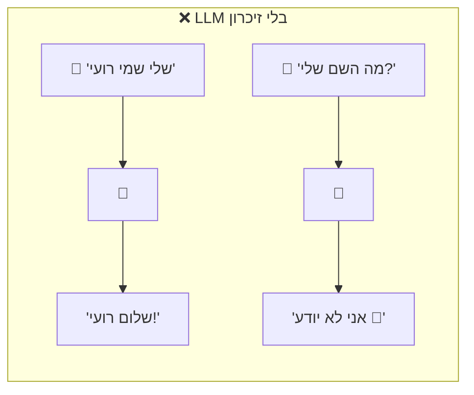
```mermaid
graph LR
    subgraph "❌ LLM בלי זיכרון"
        U1["👤 'שלי שמי רועי'"] --> LLM1["🧠"] --> A1["'שלום רועי!'"]
        U2["👤 'מה השם שלי?'"] --> LLM2["🧠"] --> A2["'אני לא יודע 🤷'"]
    end
```

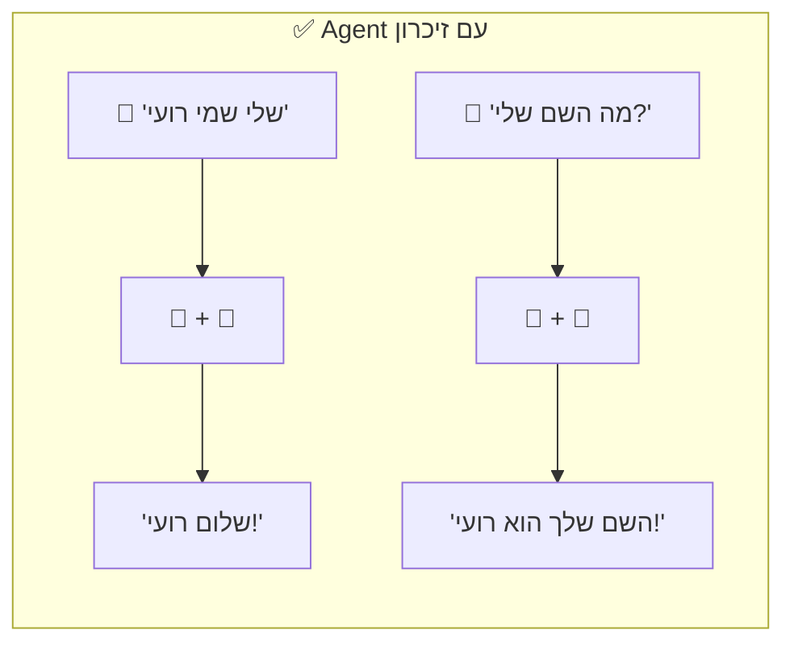
```mermaid
graph LR
    subgraph "✅ Agent עם זיכרון"
        U3["👤 'שלי שמי רועי'"] --> Agent1["🤖 + 💾"] --> A3["'שלום רועי!'"]
        U4["👤 'מה השם שלי?'"] --> Agent2["🤖 + 💾"] --> A4["'השם שלך הוא רועי!'"]
    end
```

### הבעיות שזיכרון פותר:

| בעיה | פתרון |
|------|-------|
| LLM לא זוכר שיחה קודמת | Short-term memory (היסטוריית שיחה) |
| LLM לא מכיר את המידע של החברה | Long-term memory (RAG) |
| Context window מוגבל | סינון ודחיסה חכמה של הזיכרון |
| Hallucination (המצאת מידע) | Grounding במידע אמיתי דרך RAG |

---

## סוגי זיכרון

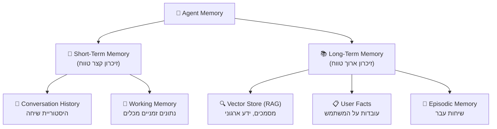
```mermaid
graph TB
    Memory["💾 Agent Memory"]
    
    Memory --> STM["🔄 Short-Term Memory\n(זיכרון קצר טווח)"]
    Memory --> LTM["📚 Long-Term Memory\n(זיכרון ארוך טווח)"]
    
    STM --> Conv["💬 Conversation History\nהיסטוריית שיחה"]
    STM --> Working["🧮 Working Memory\nנתונים זמניים מכלים"]
    
    LTM --> Vector["🔍 Vector Store (RAG)\nמסמכים, ידע ארגוני"]
    LTM --> Facts["📋 User Facts\nעובדות על המשתמש"]
    LTM --> Episodes["📖 Episodic Memory\nשיחות עבר"]
```

### השוואה:

| תכונה | 🔄 Short-Term | 📚 Long-Term |
|--------|--------------|-------------|
| **מה נשמר** | ההודעות בשיחה הנוכחית | ידע, מסמכים, עובדות |
| **משך חיים** | שיחה/session אחד | לצמיתות |
| **גודל** | מוגבל (context window) | בלתי מוגבל (כמעט) |
| **גישה** | ישירה (הכל ב-prompt) | חיפוש (search/retrieval) |
| **איפה נשמר** | Cache / In-memory | Vector DB / Database |
| **דוגמה** | "מה אמרת לפני 2 הודעות" | "מה כתוב במדיניות החברה" |

---

## Short-Term Memory

### מה זה?
השיחה הנוכחית - כל ההודעות שהוחלפו בין המשתמש ל-Agent ב-Thread הנוכחי.

### הבעיה: Context Window מוגבל

ל-LLM יש **חלון הקשר** (Context Window) מוגבל. אי אפשר לשלוח לו את כל השיחה:

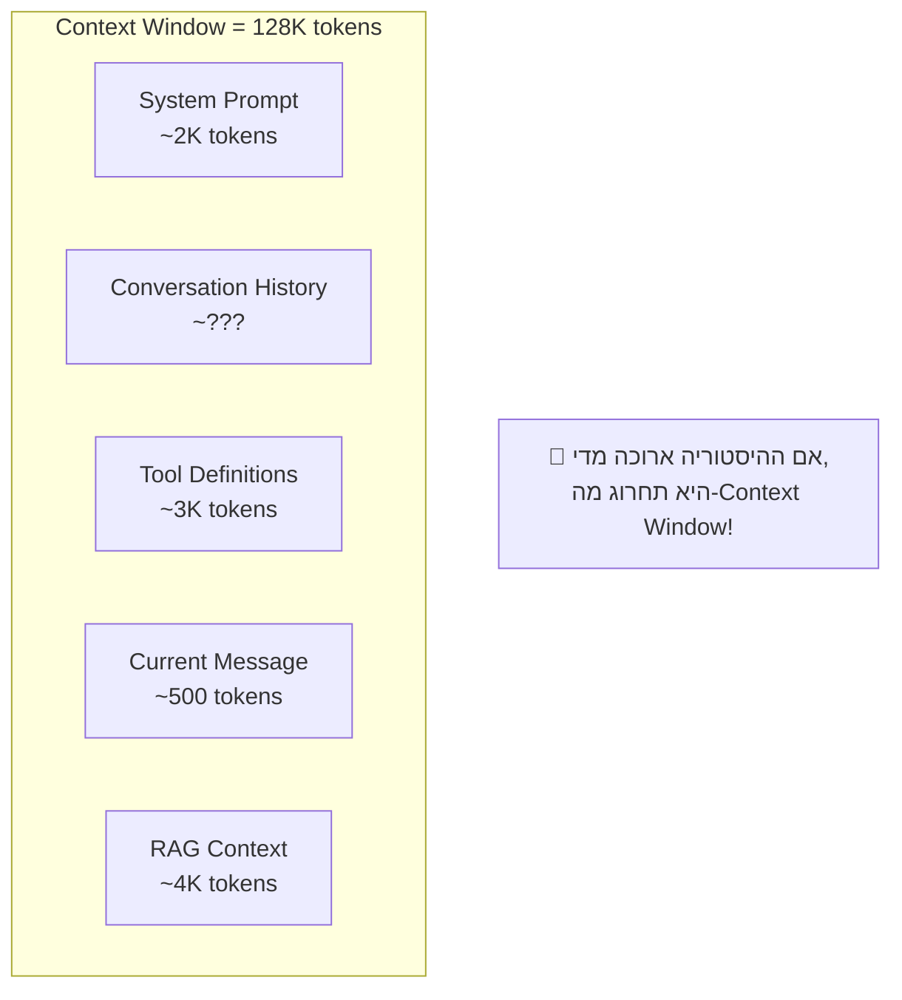
```mermaid
graph TB
    subgraph "Context Window = 128K tokens"
        System["System Prompt\n~2K tokens"]
        History["Conversation History\n~???"]
        Tools["Tool Definitions\n~3K tokens"]
        UserMsg["Current Message\n~500 tokens"]
        RAG["RAG Context\n~4K tokens"]
    end
    
    Note["🚨 אם ההיסטוריה ארוכה מדי,\nהיא תחרוג מה-Context Window!"]
```

### אסטרטגיות לניהול Short-Term Memory:

#### 1. Sliding Window (חלון נע)

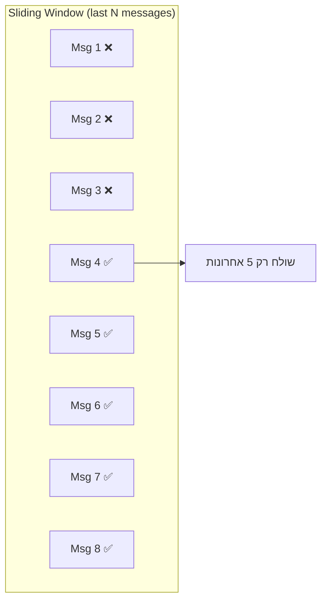
```mermaid
graph LR
    subgraph "Sliding Window (last N messages)"
        M1["Msg 1 ❌"]
        M2["Msg 2 ❌"]
        M3["Msg 3 ❌"]
        M4["Msg 4 ✅"]
        M5["Msg 5 ✅"]
        M6["Msg 6 ✅"]
        M7["Msg 7 ✅"]
        M8["Msg 8 ✅"]
    end
    
    M4 --> Send["שולח רק 5 אחרונות"]
```

| בעד | נגד |
|-----|-----|
| ✅ פשוט מאוד | ❌ מאבדים הקשר ישן |
| ✅ גודל צפוי | ❌ Agent "שוכח" מה נאמר בהתחלה |

#### 2. Token-Based Truncation (קיצוץ לפי Tokens)

```
Total budget: 50K tokens
- System prompt: 2K
- Tools: 3K  
- RAG context: 5K
- Current message: 500
- Available for history: 39,500 tokens

→ כמה הודעות ישנות שנכנסות ב-39,500 tokens
```

#### 3. Summarization (סיכום)

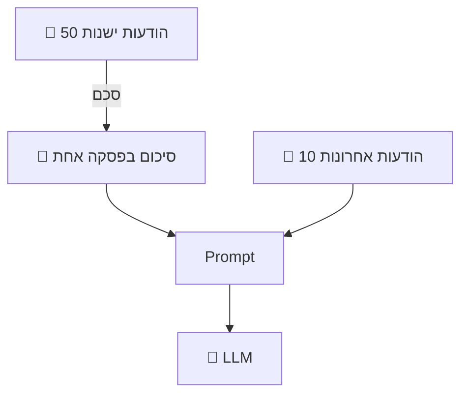
```mermaid
graph TD
    Old["📜 50 הודעות ישנות"] -->|"סכם"| Summary["📝 סיכום בפסקה אחת"]
    Summary --> Prompt["Prompt"]
    Recent["💬 10 הודעות אחרונות"] --> Prompt
    Prompt --> LLM["🧠 LLM"]
```

| בעד | נגד |
|-----|-----|
| ✅ שומר על הקשר | ❌ הסיכום עצמו עולה tokens |
| ✅ לא מאבדים מידע קריטי | ❌ סיכום יכול לפספס פרטים |

#### 4. Hybrid (שילוב)

```
Memory Strategy:
├── Last 10 messages → Full (as-is)
├── Messages 11-50 → Summarized
└── Messages 50+ → Dropped (but saved in long-term)
```

---

## Long-Term Memory

### מה זה?
זיכרון שנשמר **מעבר לשיחה הנוכחית**. הוא מאפשר ל-Agent לדעת דברים שלא נאמרו עכשיו.

### סוגי Long-Term Memory:

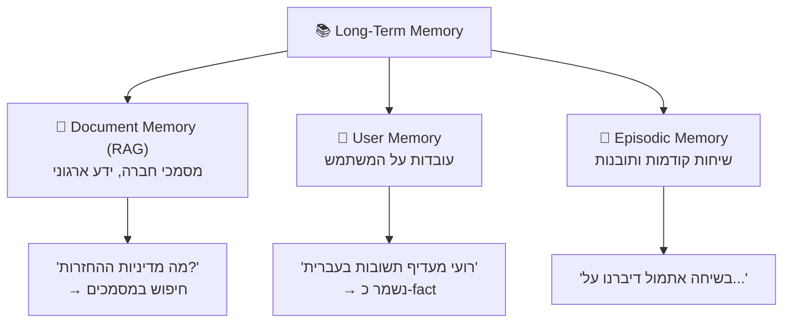
```mermaid
graph TB
    LTM["📚 Long-Term Memory"]
    
    LTM --> RAG_LTM["📄 Document Memory (RAG)\nמסמכי חברה, ידע ארגוני"]
    LTM --> User_LTM["👤 User Memory\nעובדות על המשתמש"]
    LTM --> Episodic["📖 Episodic Memory\nשיחות קודמות ותובנות"]
    
    RAG_LTM --> Ex1["'מה מדיניות ההחזרות?'\n→ חיפוש במסמכים"]
    User_LTM --> Ex2["'רועי מעדיף תשובות בעברית'\n→ נשמר כ-fact"]
    Episodic --> Ex3["'בשיחה אתמול דיברנו על...'"]
```

---

## RAG - Retrieval Augmented Generation

### מה זה RAG?
RAG = **שליפה + יצירה**. במקום לסמוך על הידע של ה-LLM (שעלול לא להיות מדויק), אנחנו **מחפשים מידע רלוונטי** ו**מזריקים** אותו לפרומפט.

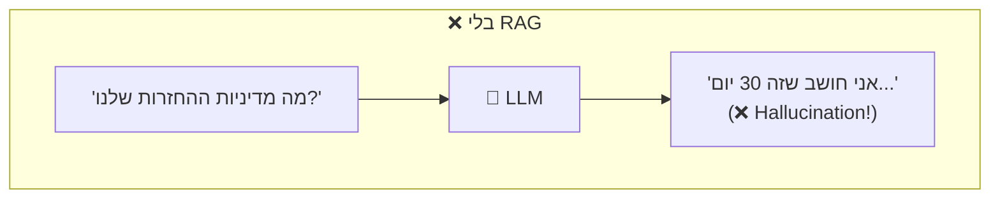
```mermaid
graph TB
    subgraph "❌ בלי RAG"
        Q1["'מה מדיניות ההחזרות שלנו?'"] --> LLM1["🧠 LLM"]
        LLM1 --> A1["'אני חושב שזה 30 יום...'\n(❌ Hallucination!)"]
    end
```

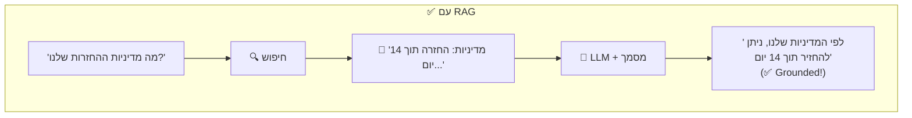
```mermaid
graph TB
    subgraph "✅ עם RAG"
        Q2["'מה מדיניות ההחזרות שלנו?'"] --> Search["🔍 חיפוש"]
        Search --> Docs["📄 'מדיניות: החזרה תוך 14 יום...'"]
        Docs --> LLM2["🧠 LLM + מסמך"]
        LLM2 --> A2["'לפי המדיניות שלנו, ניתן להחזיר תוך 14 יום'\n(✅ Grounded!)"]
    end
```

### הזרימה המלאה של RAG:

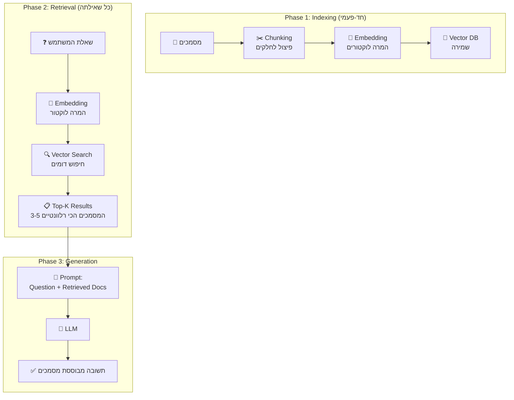
```mermaid
graph TB
    subgraph "Phase 1: Indexing (חד-פעמי)"
        Docs["📄 מסמכים"] --> Chunk["✂️ Chunking\nפיצול לחלקים"]
        Chunk --> Embed1["🔢 Embedding\nהמרה לוקטורים"]
        Embed1 --> Store["💾 Vector DB\nשמירה"]
    end
    
    subgraph "Phase 2: Retrieval (כל שאילתה)"
        Query["❓ שאלת המשתמש"] --> Embed2["🔢 Embedding\nהמרה לוקטור"]
        Embed2 --> Search["🔍 Vector Search\nחיפוש דומים"]
        Search --> TopK["📋 Top-K Results\n3-5 המסמכים הכי רלוונטיים"]
    end
    
    subgraph "Phase 3: Generation"
        TopK --> Prompt["📝 Prompt:\nQuestion + Retrieved Docs"]
        Prompt --> LLM["🧠 LLM"]
        LLM --> Answer["✅ תשובה מבוססת מסמכים"]
    end
```

### שלב 1: Chunking (פיצול מסמכים)

מסמך ארוך צריך להתפצל לחלקים קטנים. למה? כי ה-embedding מייצג את **משמעות** הטקסט, וחלק קטן וממוקד מייצג טוב יותר מאשר מסמך שלם.

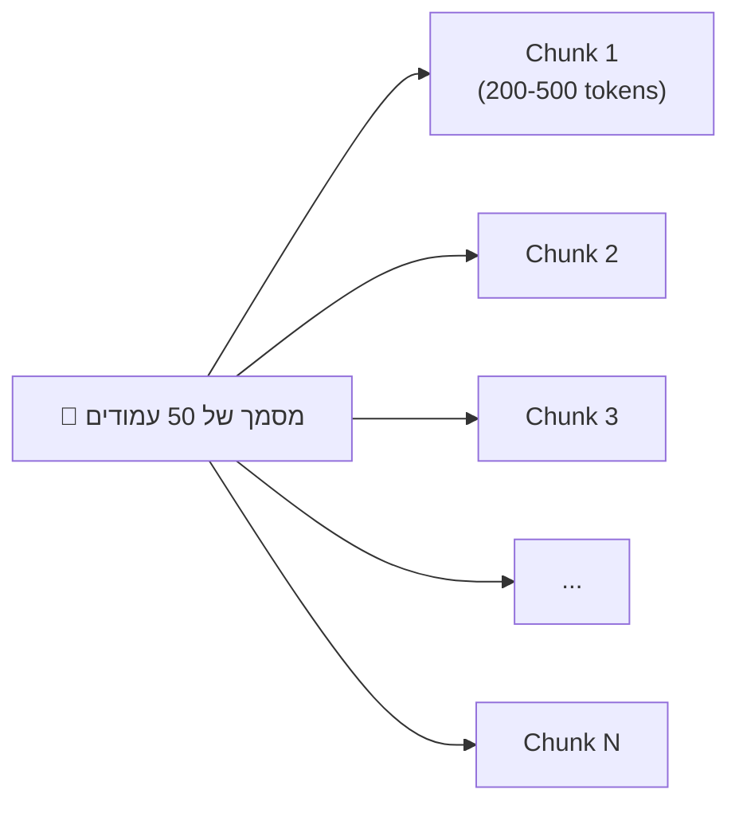
```mermaid
graph LR
    Doc["📄 מסמך של 50 עמודים"] --> C1["Chunk 1\n(200-500 tokens)"]
    Doc --> C2["Chunk 2"]
    Doc --> C3["Chunk 3"]
    Doc --> C4["..."]
    Doc --> CN["Chunk N"]
```

**אסטרטגיות Chunking:**

| שיטה | הסבר | בעד | נגד |
|-------|-------|-----|-----|
| **Fixed size** | כל X tokens | פשוט | עלול לחתוך באמצע משפט |
| **Sentence-based** | לפי משפטים | שומר הקשר | חלקים לא אחידים בגודל |
| **Paragraph-based** | לפי פסקאות | הקשר טוב | פסקאות יכולות להיות ארוכות |
| **Semantic** | לפי נושא (באמצעות LLM) | הקשר מצוין | יקר ואיטי |
| **Overlap** | חפיפה בין chunks | מפחית אובדן | יותר chunks = יותר storage |

**Overlap - למה חשוב:**

```
Chunk 1: "מדיניות ההחזרות של החברה מאפשרת החזרה"
Chunk 2: "מאפשרת החזרה תוך 14 יום ממועד הרכישה"
         ^^^^^^^^^^^^^^^^
         Overlap - מבטיח שהמידע לא נחתך
```

### שלב 2: Embeddings (הטמעה וקטורית)

#### מה זה Embedding?
המרה של טקסט ל**וקטור** (רשימה של מספרים) שמייצג את ה**משמעות** של הטקסט.

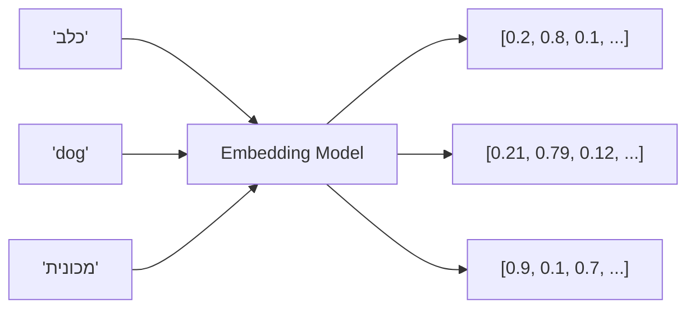
```mermaid
graph LR
    T1["'כלב'"] --> E["Embedding Model"] --> V1["[0.2, 0.8, 0.1, ...]"]
    T2["'dog'"] --> E --> V2["[0.21, 0.79, 0.12, ...]"]
    T3["'מכונית'"] --> E --> V3["[0.9, 0.1, 0.7, ...]"]
```

**הנקודה:** "כלב" ו-"dog" יהיו **קרובים** במרחב הוקטורי כי הם אומרים את אותו דבר. "מכונית" יהיה **רחוק** כי המשמעות שונה.

#### Similarity Search (חיפוש דמיון)

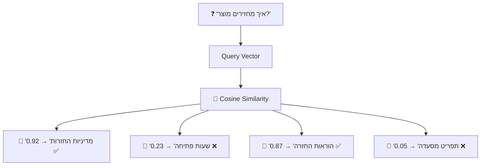
```mermaid
graph TB
    Query["❓ 'איך מחזירים מוצר?'"] --> QVec["Query Vector"]
    
    QVec --> Sim["📐 Cosine Similarity"]
    
    Sim --> D1["📄 'מדיניות החזרות' → 0.92 ✅"]
    Sim --> D2["📄 'שעות פתיחה' → 0.23 ❌"]
    Sim --> D3["📄 'הוראות החזרה' → 0.87 ✅"]
    Sim --> D4["📄 'תפריט מסעדה' → 0.05 ❌"]
```

**Cosine Similarity:** מדד שמחשב כמה שני וקטורים "מצביעים באותו כיוון":
- **1.0** = זהים לחלוטין
- **0.0** = לא קשורים
- **-1.0** = הפוכים

### שלב 3: Vector Database

Vector Database הוא מסד נתונים שמותאם לשמירה וחיפוש של **וקטורים**:

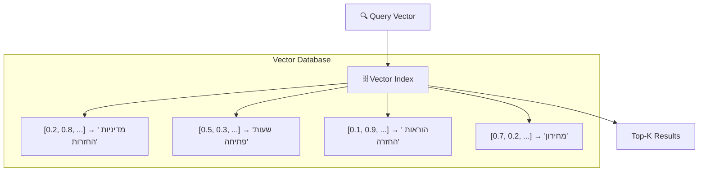
```mermaid
graph TB
    subgraph "Vector Database"
        Index["🗄️ Vector Index"]
        
        Index --> V1["[0.2, 0.8, ...] → 'מדיניות החזרות'"]
        Index --> V2["[0.5, 0.3, ...] → 'שעות פתיחה'"]
        Index --> V3["[0.1, 0.9, ...] → 'הוראות החזרה'"]
        Index --> V4["[0.7, 0.2, ...] → 'מחירון'"]
    end
    
    Query["🔍 Query Vector"] --> Index
    Index --> Results["Top-K Results"]
```

**השוואת Vector Databases:**

| DB | סוג | בעד | נגד |
|----|-----|-----|-----|
| **Azure AI Search** | Managed Service | Hybrid search, enterprise-ready | Cloud-only, cost |
| **Pinecone** | Managed Service | פשוט, serverless | Vendor lock-in |
| **Weaviate** | Open Source | גמיש, self-hosted | צריך לנהל |
| **Qdrant** | Open Source | ביצועים גבוהים | פחות integrations |
| **ChromaDB** | Open Source | קל להתחיל | לא production-grade |
| **pgvector** | Extension | PostgreSQL integration | ביצועים בינוניים |

### Hybrid Search (חיפוש היברידי)

שילוב של חיפוש **סמנטי** (Vector) עם חיפוש **מילות מפתח** (BM25/Full-text):

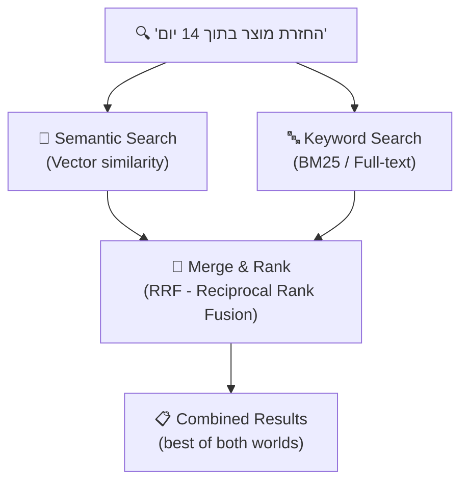
```mermaid
graph TB
    Query["🔍 'החזרת מוצר בתוך 14 יום'"] --> Sem["📐 Semantic Search\n(Vector similarity)"]
    Query --> KW["🔤 Keyword Search\n(BM25 / Full-text)"]
    
    Sem --> Merge["🔀 Merge & Rank\n(RRF - Reciprocal Rank Fusion)"]
    KW --> Merge
    
    Merge --> Results["📋 Combined Results\n(best of both worlds)"]
```

| חיפוש | בעד | נגד |
|--------|-----|-----|
| **Semantic** | מבין משמעות, מתמודד עם ניסוחים שונים | עלול לפספס מילים ספציפיות |
| **Keyword** | מדויק למילים ספציפיות | לא מבין ניסוחים שונים של אותה שאלה |
| **Hybrid** | הכי טוב משני העולמות | מורכבות גבוהה יותר |

---

## אסטרטגיות זיכרון

### 1. Memory Scoping (מי רואה מה)

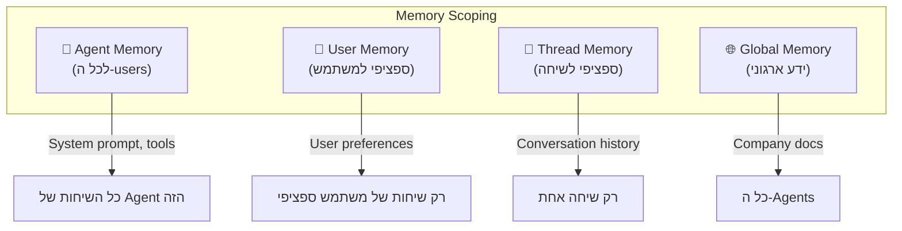
```mermaid
graph TB
    subgraph "Memory Scoping"
        Agent_Mem["🤖 Agent Memory\n(לכל ה-users)"]
        User_Mem["👤 User Memory\n(ספציפי למשתמש)"]
        Thread_Mem["🧵 Thread Memory\n(ספציפי לשיחה)"]
        Global_Mem["🌐 Global Memory\n(ידע ארגוני)"]
    end
    
    Agent_Mem -->|"System prompt, tools"| All["כל השיחות של Agent הזה"]
    User_Mem -->|"User preferences"| OneUser["רק שיחות של משתמש ספציפי"]
    Thread_Mem -->|"Conversation history"| OneThread["רק שיחה אחת"]
    Global_Mem -->|"Company docs"| Everyone["כל ה-Agents"]
```

### 2. Memory Lifecycle (מחזור חיים)

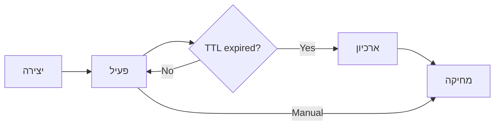
```mermaid
graph LR
    Create["יצירה"] --> Active["פעיל"]
    Active --> TTL{"TTL expired?"}
    TTL -->|"No"| Active
    TTL -->|"Yes"| Archive["ארכיון"]
    Archive --> Delete["מחיקה"]
    
    Active -->|"Manual"| Delete
```

| פרמטר | הסבר | ערך טיפוסי |
|--------|-------|-----------|
| **TTL (Time To Live)** | כמה זמן הזיכרון חי | 24 שעות - 30 יום |
| **Max Size** | גודל מקסימלי | 100K tokens |
| **Eviction Policy** | מה נמחק כשנגמר מקום | LRU (Least Recently Used) |

### 3. Memory Architecture Pattern

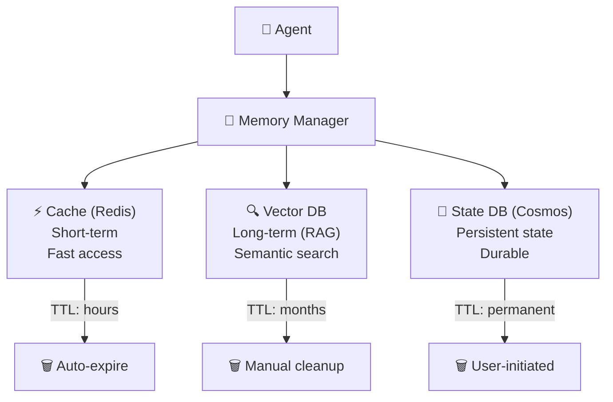
```mermaid
graph TB
    Agent["🤖 Agent"] --> MemMgr["💾 Memory Manager"]
    
    MemMgr --> Cache["⚡ Cache (Redis)\nShort-term\nFast access"]
    MemMgr --> VectorDB["🔍 Vector DB\nLong-term (RAG)\nSemantic search"]
    MemMgr --> StateDB["📌 State DB (Cosmos)\nPersistent state\nDurable"]
    
    Cache -->|"TTL: hours"| Expire1["🗑️ Auto-expire"]
    VectorDB -->|"TTL: months"| Expire2["🗑️ Manual cleanup"]
    StateDB -->|"TTL: permanent"| Expire3["🗑️ User-initiated"]
```

---

## End-to-End RAG Flow - דוגמה מלאה

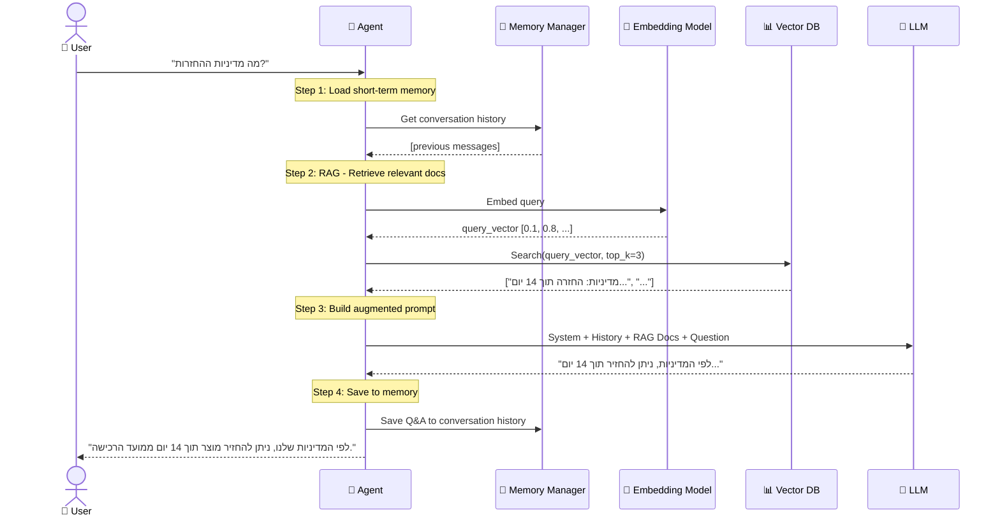
```mermaid
sequenceDiagram
    actor User as 👤 User
    participant Agent as 🤖 Agent
    participant Mem as 💾 Memory Manager
    participant Embed as 🔢 Embedding Model
    participant VDB as 📊 Vector DB
    participant LLM as 🧠 LLM
    
    User->>Agent: "מה מדיניות ההחזרות?"
    
    Note over Agent: Step 1: Load short-term memory
    Agent->>Mem: Get conversation history
    Mem-->>Agent: [previous messages]
    
    Note over Agent: Step 2: RAG - Retrieve relevant docs
    Agent->>Embed: Embed query
    Embed-->>Agent: query_vector [0.1, 0.8, ...]
    Agent->>VDB: Search(query_vector, top_k=3)
    VDB-->>Agent: ["מדיניות: החזרה תוך 14 יום...", "..."]
    
    Note over Agent: Step 3: Build augmented prompt
    Agent->>LLM: System + History + RAG Docs + Question
    LLM-->>Agent: "לפי המדיניות, ניתן להחזיר תוך 14 יום..."
    
    Note over Agent: Step 4: Save to memory
    Agent->>Mem: Save Q&A to conversation history
    
    Agent-->>User: "לפי המדיניות שלנו, ניתן להחזיר מוצר תוך 14 יום ממועד הרכישה."
```

---

## יתרונות וחסרונות

### Short-Term Memory

| ✅ יתרון | ❌ חיסרון |
|----------|----------|
| שומר על הקשר שיחה | מוגבל בגודל (context window) |
| מספק continuity | נמחק בסוף ה-session |
| מהיר (in-memory) | עולה tokens |

### Long-Term Memory (RAG)

| ✅ יתרון | ❌ חיסרון |
|----------|----------|
| Grounds LLM בנתונים אמיתיים | Retrieval שגוי = תשובה שגויה |
| מפחית Hallucination | Chunking + Indexing עולים כסף |
| בלתי מוגבל בגודל | Latency נוסף (embedding + search) |
| ניתן לעדכון | איכות תלויה באיכות ה-data |

---

## סיכום

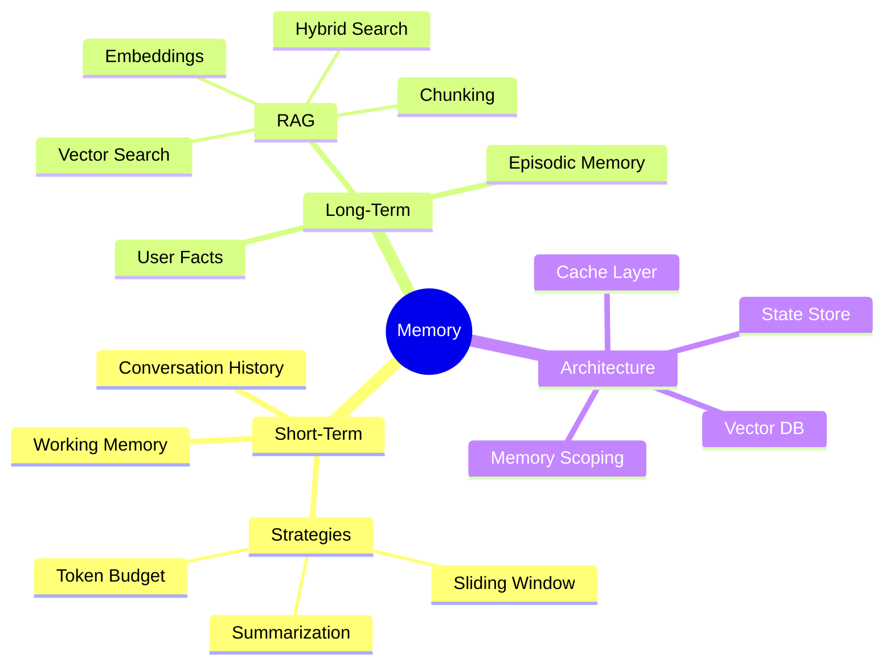
```mermaid
mindmap
  root((Memory))
    Short-Term
      Conversation History
      Working Memory
      Strategies
        Sliding Window
        Summarization
        Token Budget
    Long-Term
      RAG
        Chunking
        Embeddings
        Vector Search
        Hybrid Search
      User Facts
      Episodic Memory
    Architecture
      Cache Layer
      Vector DB
      State Store
      Memory Scoping
```

| מה למדנו | נקודה מרכזית |
|-----------|-------------|
| **Short-Term** | היסטוריית שיחה, מוגבלת, נשמרת ב-cache |
| **Long-Term** | RAG, ידע ארגוני, נשמר ב-Vector DB |
| **RAG** | Chunking → Embedding → Search → Augment Prompt |
| **Embedding** | ייצוג מספרי של טקסט שמאפשר חיפוש סמנטי |
| **Vector DB** | מסד נתונים מותאם לחיפוש semantic |
| **Hybrid Search** | שילוב Semantic + Keyword = התוצאות הכי טובות |
| **Chunking** | פיצול מסמכים לחלקים קטנים עם overlap |

---

## ❓ שאלות לבדיקה עצמית

1. למה LLM לבד לא "זוכר" שיחות קודמות?
2. מה ההבדל בין Short-Term ל-Long-Term memory?
3. מה הבעיה עם Context Window ואיך Sliding Window פותר אותה?
4. הסבר את שלושת השלבים של RAG.
5. מה זה Embedding ואיך Cosine Similarity עובד?
6. למה צריך Chunking ומה הטכניקה של Overlap?
7. מה ההבדל בין Semantic Search ל-Keyword Search?
8. מה זה Hybrid Search ולמה הוא עדיף?
9. מה זה Memory Scoping ולמה הוא חשוב?

---

**[⬅️ חזרה לפרק 4: Model Abstraction](04-model-abstraction-routing.md)** | **[➡️ המשך לפרק 6: Thread & State Management →](06-thread-state-management.md)**
