# 🧵 פרק 6: Thread & State Management

## תוכן עניינים
- [מה זה Thread?](#מה-זה-thread)
- [Thread Management](#thread-management)
- [State Management](#state-management)
- [State Machine ב-Agents](#state-machine-ב-agents)
- [Checkpointing](#checkpointing)
- [Human-in-the-Loop (HITL)](#human-in-the-loop-hitl)
- [Long-Running Workflows](#long-running-workflows)
- [יתרונות וחסרונות](#יתרונות-וחסרונות)
- [סיכום ושאלות](#סיכום-ושאלות)

---

## מה זה Thread?

**Thread** (חוט שיחה) הוא יחידת השיחה הבסיסית. הוא מכיל את כל ההודעות שהוחלפו בין המשתמש ל-Agent בהקשר מסוים.

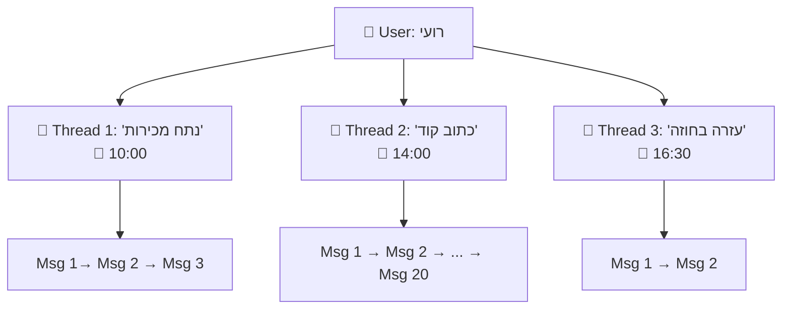

### ההיררכיה:

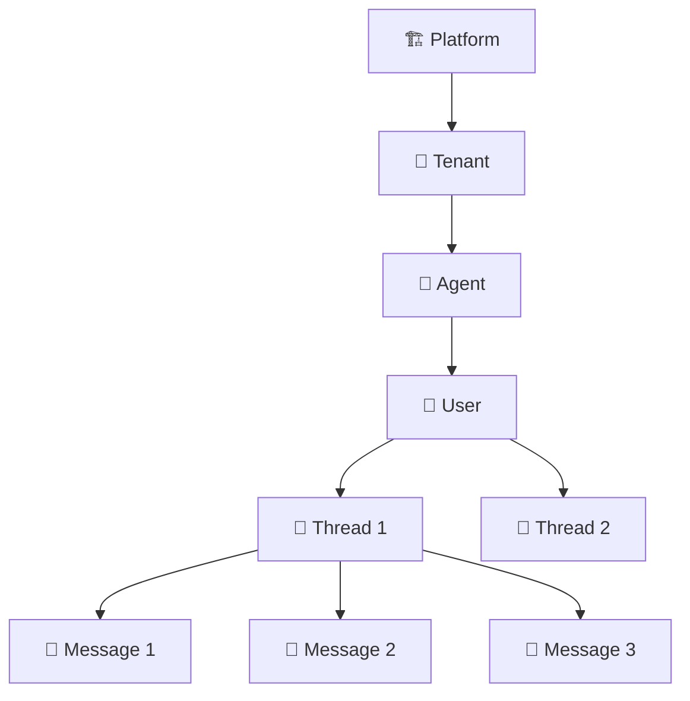

### מבנה Thread:

```
Thread: thread-abc-123
├── id: "thread-abc-123"
├── agent_id: "agent-data-analyst"
├── user_id: "user-roi"
├── tenant_id: "team-analytics"
├── created_at: "2026-02-21T10:00:00Z"
├── updated_at: "2026-02-21T10:05:23Z"
├── status: "active"
├── metadata:
│   ├── title: "ניתוח מכירות Q4"
│   └── tags: ["sales", "analytics"]
└── messages:
    ├── [0] {role: "system", content: "You are a data analyst..."}
    ├── [1] {role: "user", content: "נתח לי את המכירות"}
    ├── [2] {role: "assistant", content: "", tool_calls: [{sql_query}]}
    ├── [3] {role: "tool", content: "{results: [...]}"}
    └── [4] {role: "assistant", content: "המכירות עלו ב-15%..."}
```

---

## Thread Management

### תפקידי Thread Manager:

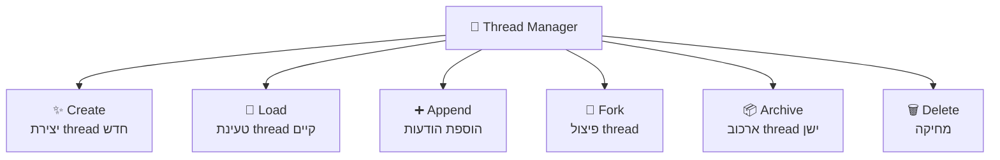

### Thread Lifecycle:

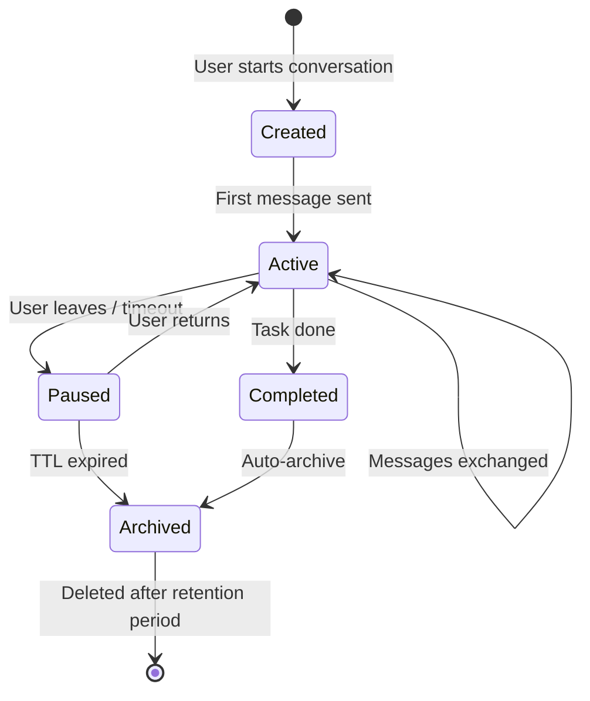

### Thread Forking (פיצול)

לפעמים שיחה מתפצלת - המשתמש רוצה "לנסות כיוון אחר":

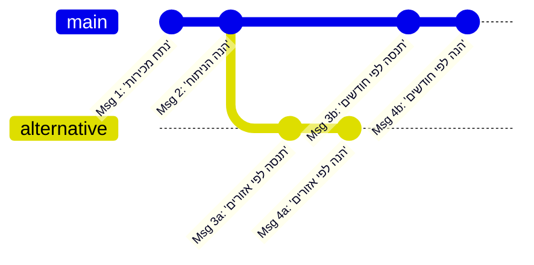

---

## State Management

### ההבדל בין Thread ל-State

| Thread | State |
|--------|-------|
| **ההודעות** בשיחה | **המצב** של אובייקט/תהליך |
| Append-only (רק מוסיפים) | Mutable (משתנה) |
| Text-based | Structured data |
| רגיל: "מה נאמר" | מורכב: "באיזה שלב אנחנו" |

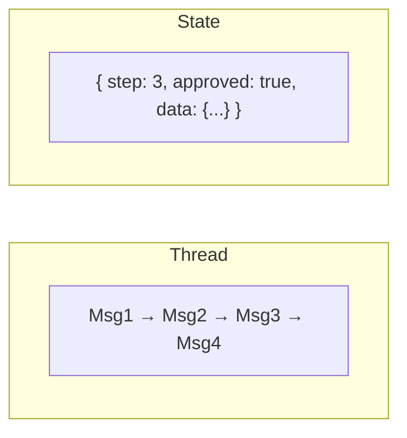

### למה צריך State Management?

Agent פשוט סיים עם תשובה אחת. אבל Agent **מורכב** יכול:
- לבצע workflow עם שלבים
- לחכות לאישור אנושי
- לרוץ ימים
- ליפול באמצע ולהמשיך

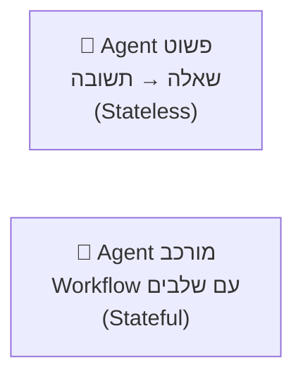

---

## State Machine ב-Agents

### מה זה State Machine?
מכונת מצבים (State Machine) מגדירה את כל **המצבים** האפשריים של Agent ואת **המעברים** ביניהם.

### דוגמה: Agent ניתוח דוח כספי

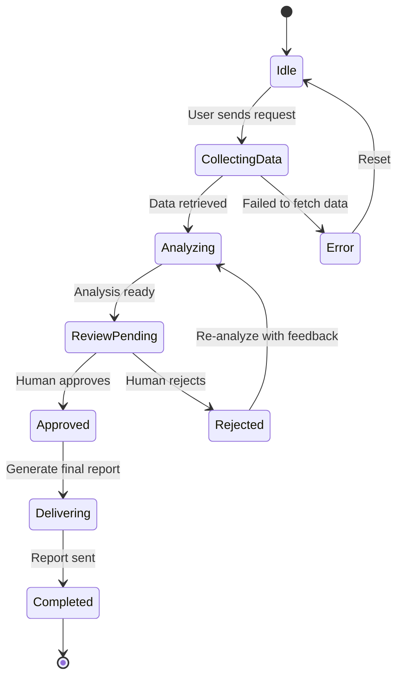

### State Storage:

```
Agent Run State:
├── run_id: "run-xyz-789"
├── agent_id: "agent-financial-analyzer"
├── thread_id: "thread-abc-123"
├── current_state: "ReviewPending"
├── step_count: 4
├── started_at: "2026-02-21T10:00:00Z"
├── data:
│   ├── query_results: [{...}]
│   ├── analysis: "Revenue increased by 15%..."
│   └── charts: ["chart1.png", "chart2.png"]
├── pending_action:
│   ├── type: "human_approval"
│   ├── prompt: "אשר את הדוח לפני שליחה?"
│   └── timeout: "24h"
└── history:
    ├── [0] {state: "Idle", timestamp: "10:00:00"}
    ├── [1] {state: "CollectingData", timestamp: "10:00:01"}
    ├── [2] {state: "Analyzing", timestamp: "10:00:15"}
    └── [3] {state: "ReviewPending", timestamp: "10:01:30"}
```

---

## Checkpointing

### מה זה?
**Checkpoint** = שמירת "צילום מצב" (snapshot) של ה-Agent כדי שאפשר יהיה:
- לחזור לנקודה קודמת (rollback)
- להמשיך אחרי כשל (recovery)
- לשחזר הרצה (replay)

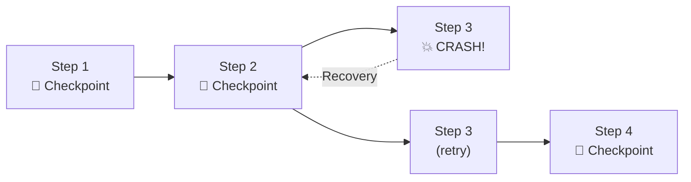

### מה נשמר ב-Checkpoint:

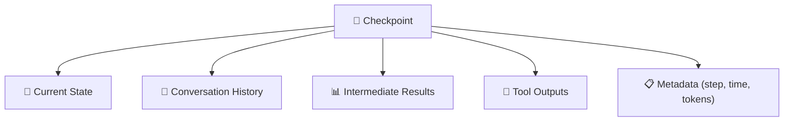

### Checkpoint Strategies:

| אסטרטגיה | הסבר | בעד | נגד |
|-----------|-------|-----|-----|
| **Every step** | שומר אחרי כל LLM call | Recovery מדויק | Storage + latency |
| **Every N steps** | שומר כל N צעדים | balance | עלול לאבד צעדים |
| **On tool calls** | שומר רק לפני/אחרי כלים | שומר נקודות קריטיות | לא מכסה הכל |
| **On state change** | שומר על מעבר מצב | הגיוני ביותר | תלוי בהגדרת מצבים |

---

## Human-in-the-Loop (HITL)

### מה זה?
HITL = הצורך לעצור את ה-Agent ולחכות ל**אישור אנושי** לפני המשך.

### למה צריך HITL?

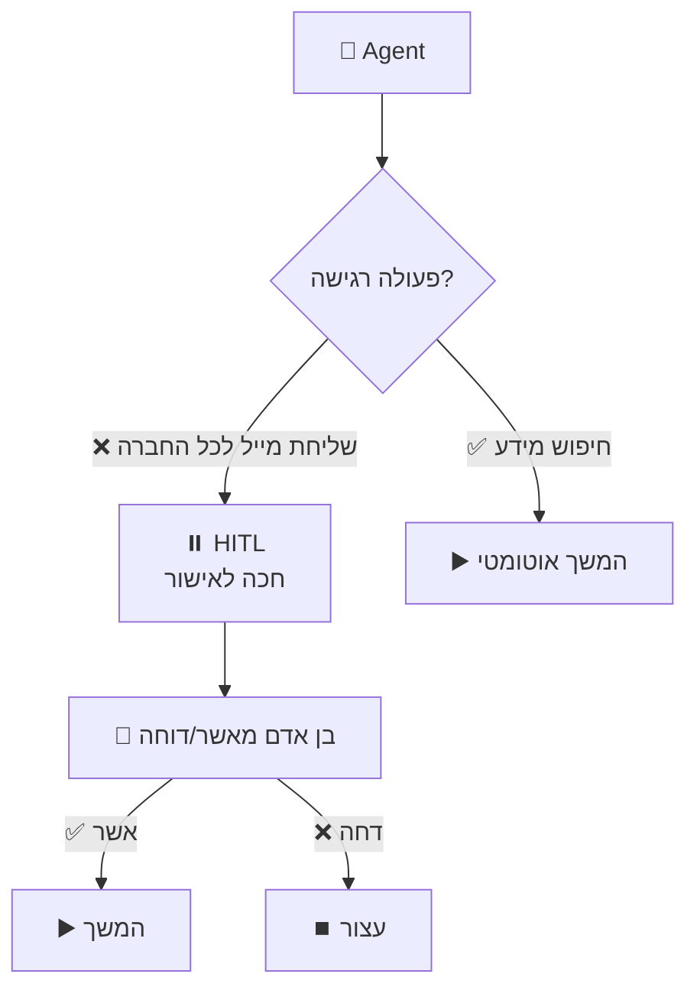

### סוגי HITL:

| סוג | הסבר | דוגמה |
|-----|-------|-------|
| **Approval Gate** | אישור/דחייה פשוט | "לשלוח את המייל? כן/לא" |
| **Review & Edit** | אישור עם אפשרות עריכה | "הנה הדוח, אפשר לערוך לפני שליחה" |
| **Feedback Loop** | בקשת מידע נוסף | "אני צריך פרטים נוספים..." |
| **Escalation** | העברה לאדם כש-Agent לא יודע | "אני לא בטוח, מעביר לנציג" |

### HITL Architecture:

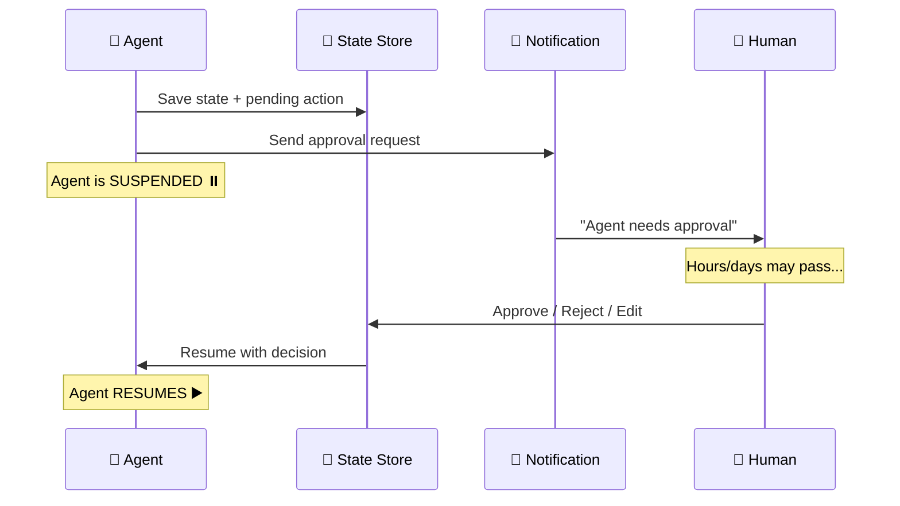

### האתגר: Suspension & Resumption

כשAgent חוכה ל-HITL, הוא יכול לחכות **שעות או ימים**. אי אפשר להשאיר תהליך ריצה חי כל הזמן.

**פתרון: Durable State**

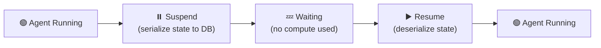

---

## Long-Running Workflows

### הבעיה
Agents פשוטים סיימו ב-30 שניות. אבל יש workflows שרצים **שעות או ימים**:

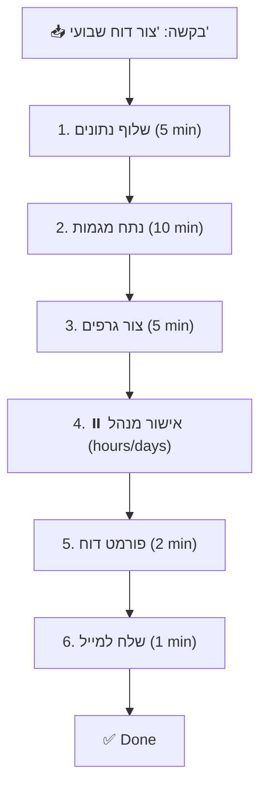

### Durable Execution Pattern

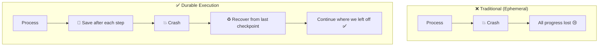

### Patterns for Long-Running Workflows:

| Pattern | הסבר | מתאים ל |
|---------|-------|---------|
| **Saga** | כל שלב הוא transaction עצמאי עם compensation | כשצריך rollback |
| **Workflow Engine** | DAG של steps עם dependencies | workflows מורכבים |
| **Event Sourcing** | כל שינוי נשמר כ-event | audit trail מלא |
| **Actor Model** | כל Agent הוא Actor עצמאי | parallel execution |

### Saga Pattern - עומק:

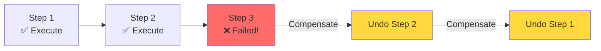

**דוגמה:** Agent שמזמין חופשה:
1. ✅ הזמן טיסה
2. ✅ הזמן מלון
3. ❌ הזמן רכב - נכשל!
4. ↩️ בטל מלון (compensation)
5. ↩️ בטל טיסה (compensation)

---

## Concurrency: ניהול ריבוי Thread-ים

### הבעיה: מה קורה כשמשתמש שולח הודעה חדשה בזמן שה-Agent עדיין מעבד?

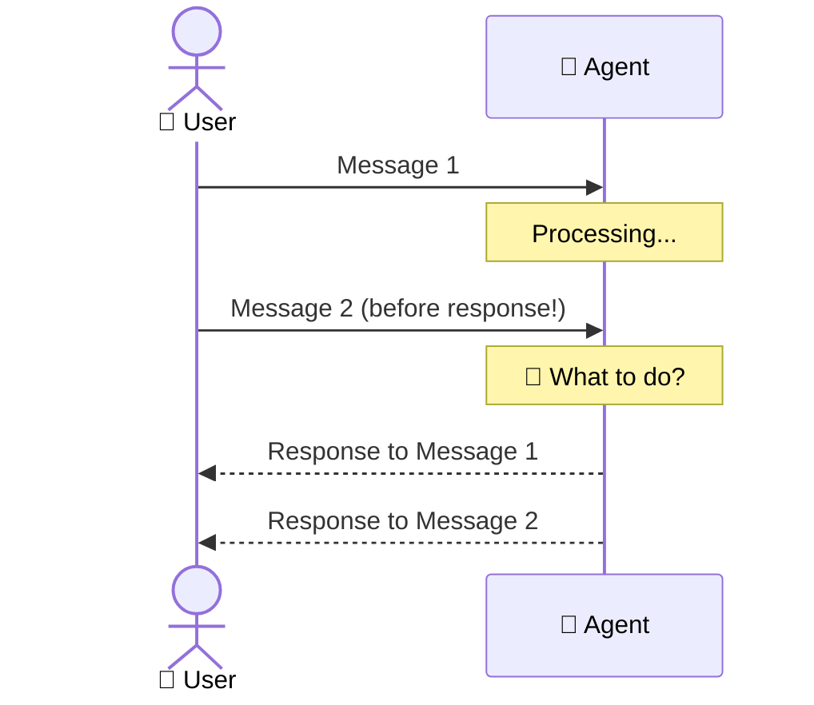

### אסטרטגיות:

| אסטרטגיה | הסבר |
|-----------|-------|
| **Queue** | הודעות נכנסות לתור, מטופלות אחת-אחת |
| **Cancel & Replace** | הודעה חדשה מבטלת את הנוכחית |
| **Parallel** | שתי ההודעות מטופלות במקביל (מורכב) |
| **Lock** | Thread נעול בזמן עיבוד, הודעה חדשה מחכה |

---

## יתרונות וחסרונות

### Thread Management

| ✅ יתרון | ❌ חיסרון |
|----------|----------|
| ארגון שיחות ברור | Storage grows with usage |
| הפרדה בין contexts | Thread cleanup policy needed |
| Fork & Branch support | Concurrency challenges |

### State Management

| ✅ יתרון | ❌ חיסרון |
|----------|----------|
| Recovery from failures | מורכב ליישום |
| HITL support | State serialization overhead |
| Long-running workflows | Debugging stateful systems harder |
| Audit trail | State migration between versions |

---

## סיכום

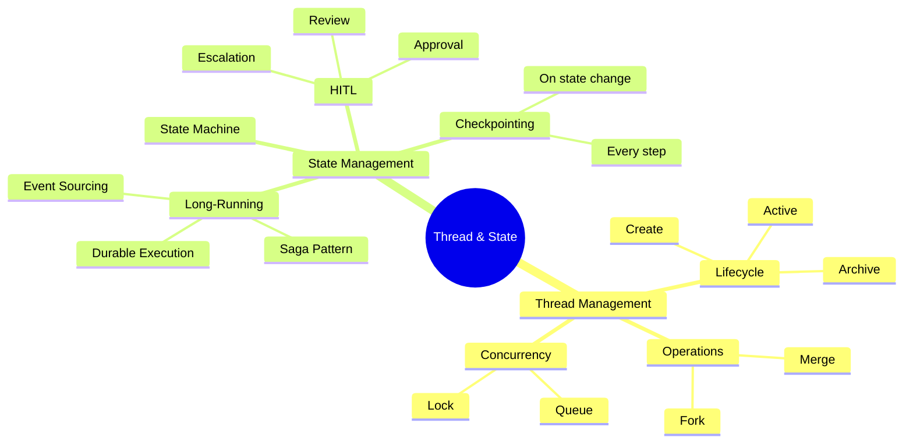

| מה למדנו | נקודה מרכזית |
|-----------|-------------|
| **Thread** | יחידת שיחה שמכילה את כל ההודעות |
| **State** | המצב של ה-Agent בכל רגע נתון |
| **Checkpoint** | שמירת מצב לשחזור אחרי כשל |
| **HITL** | עצירת Agent לאישור אנושי |
| **Saga** | Pattern ל-rollback של workflows מורכבים |
| **Durable Execution** | ריצה ארוכת טווח ששורדת crashes |

---

## ❓ שאלות לבדיקה עצמית

1. מה ההבדל בין Thread ל-State?
2. מהו Thread Lifecycle (ציין 4 מצבים)?
3. למה צריך Checkpointing ואילו אסטרטגיות יש?
4. מהו HITL ואילו סוגים שלו קיימים?
5. מהו Saga Pattern ומתי משתמשים בו?
6. מה הפתרון לבעיית Long-Running Workflows?
7. מה קורה כשמשתמש שולח הודעה בזמן שה-Agent עדיין מעבד?

---

**[⬅️ חזרה לפרק 5: Memory Management](05-memory-management.md)** | **[➡️ המשך לפרק 7: Orchestration Patterns →](07-orchestration.md)**
