# 🎭 פרק 7: Orchestration Patterns

## תוכן עניינים
- [מה זה Orchestration?](#מה-זה-orchestration)
- [Sequential Execution](#sequential-execution)
- [Parallel Execution](#parallel-execution)
- [Autonomous Execution](#autonomous-execution)
- [Sub-Agent Orchestration](#sub-agent-orchestration)
- [DAG Workflows](#dag-workflows)
- [Patterns מתקדמים](#patterns-מתקדמים)
- [השוואת Patterns](#השוואת-patterns)
- [סיכום ושאלות](#סיכום-ושאלות)

---

## מה זה Orchestration?

**Orchestration** = איך ה-Agent (או מספר Agents) מתאמים פעולות כדי להשלים משימה.

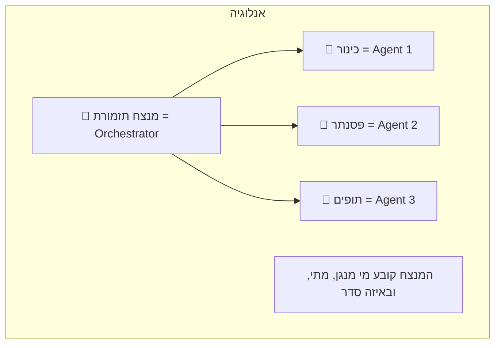

### למה צריך Orchestration?

משימות פשוטות = Agent אחד מספיק. משימות מורכבות = צריך **תיאום**:

| משימה | Agent אחד? | Orchestration? |
|--------|-----------|---------------|
| "מה מזג האוויר?" | ✅ | ❌ |
| "סכם את המייל" | ✅ | ❌ |
| "נתח מכירות, השווה למתחרים, וכתוב דוח" | ❌ | ✅ |
| "תתכנן טיול: טיסות + מלון + השכרת רכב" | ❌ | ✅ |

---

## Sequential Execution (ביצוע סדרתי)

### מה זה?
שלב אחרי שלב - כל שלב מתחיל רק אחרי שהקודם סיים.

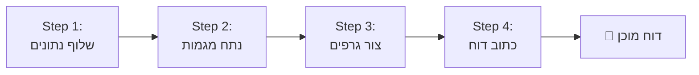

### דוגמה: Pipeline של עיבוד מסמך

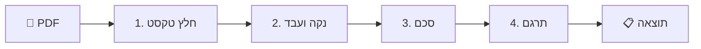

### בעד ונגד

| ✅ בעד | ❌ נגד |
|--------|--------|
| פשוט להבנה | איטי - שלב מחכה לקודמו |
| קל לדבג | לא מנצל parallelism |
| Deterministic - תמיד אותו סדר | אם שלב נכשל, הכל עוצר |
| קל להוסיף Checkpoint | |

---

## Parallel Execution (ביצוע מקבילי)

### מה זה?
מספר פעולות רצות **במקביל** - לא תלויות אחת בשנייה.

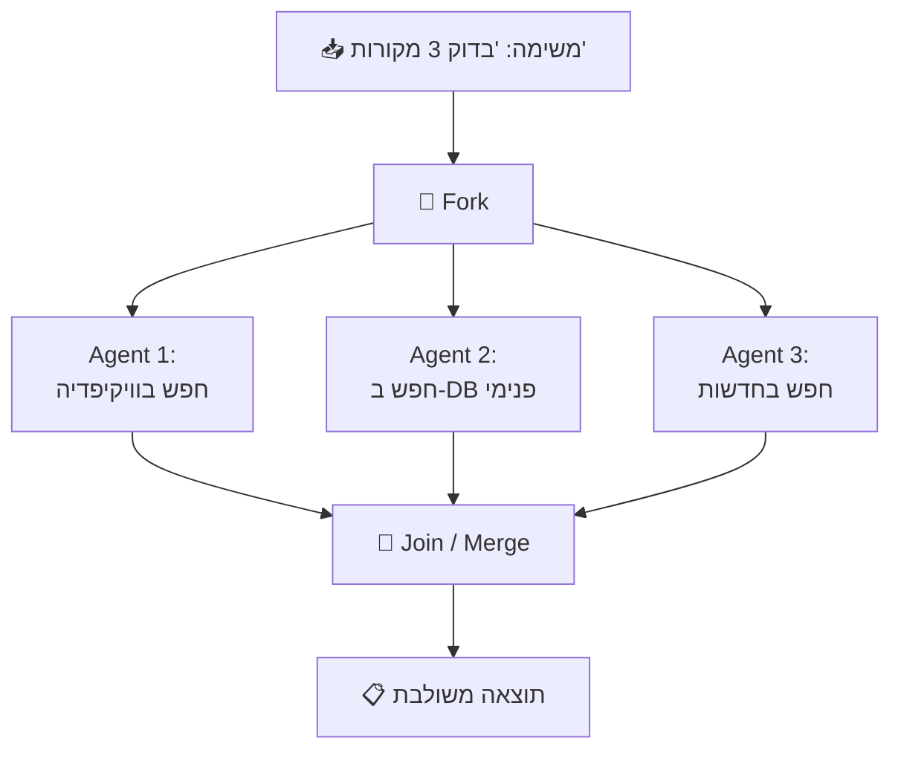

### Fan-Out / Fan-In Pattern

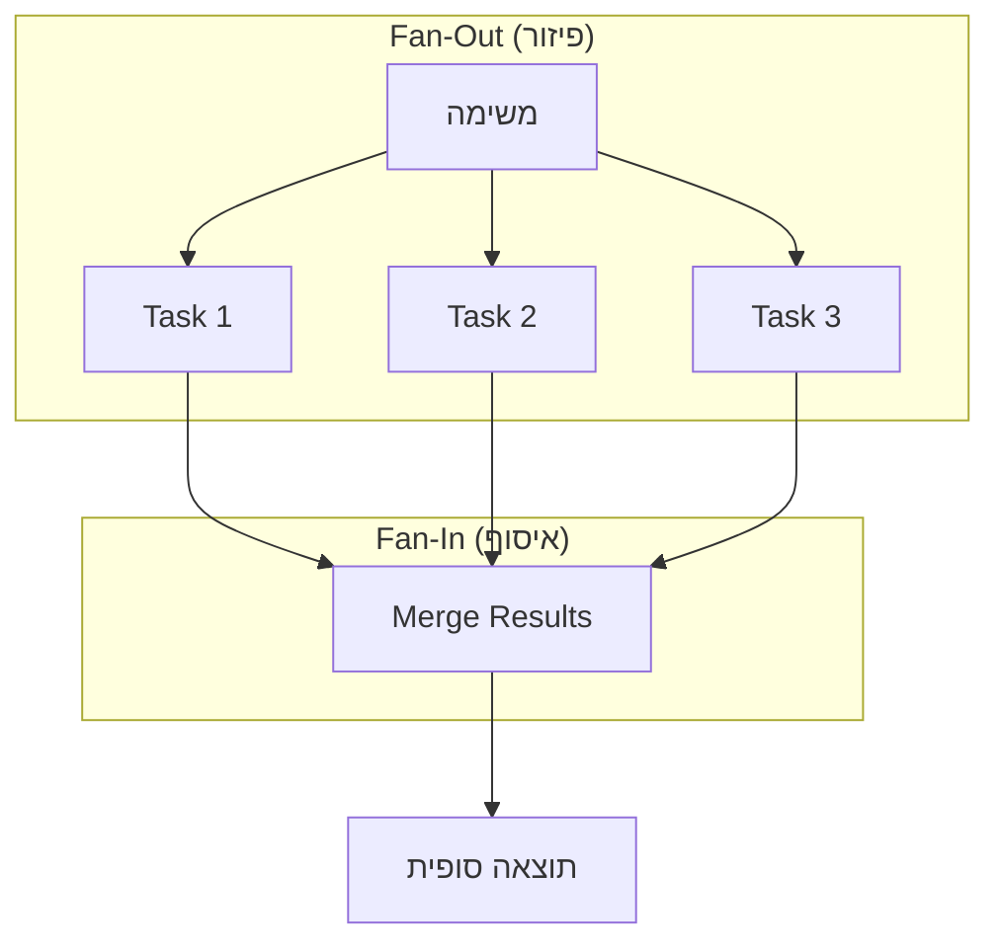

### אתגרים בביצוע מקבילי:

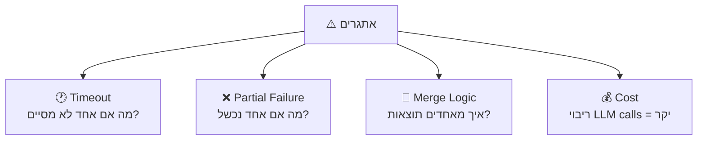

| אתגר | פתרון |
|-------|-------|
| **Timeout** | קבע deadline; אם לא סיים, המשך בלעדיו |
| **Partial Failure** | החלט: כשל אחד = כשל הכל? או המשך עם מה שיש? |
| **Merge** | Aggregator Agent שמאחד תוצאות |
| **Cost** | הגבל parallelism (max concurrent) |

### בעד ונגד

| ✅ בעד | ❌ נגד |
|--------|--------|
| מהיר (N פעולות בזמן של 1) | מורכב |
| מנצל משאבים טוב | Merge logic לא טריוויאלי |
| מתאים לחיפוש multi-source | כשל חלקי קשה לטפל |

---

## Autonomous Execution (ביצוע אוטונומי)

### מה זה?
ה-Agent **מחליט בעצמו** מה לעשות הלאה. אין workflow קבוע מראש - ה-Agent מנווט לפי הצורך.

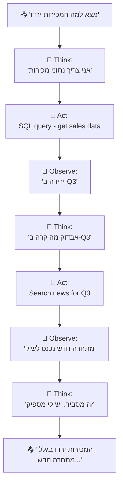

### ReAct Pattern (Reason + Act)

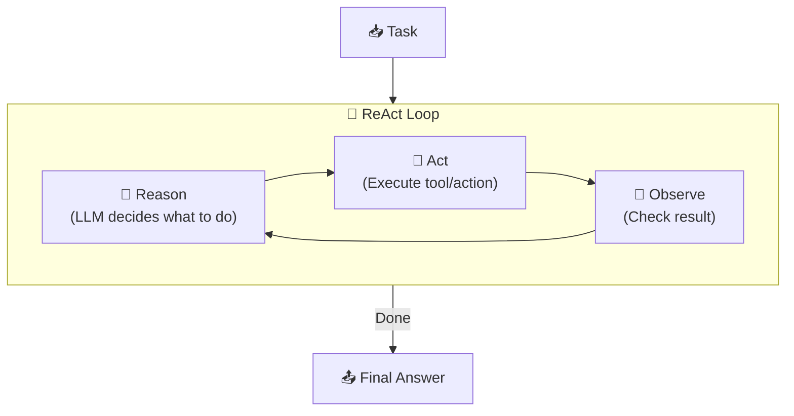

### Plan-and-Execute Pattern

שיפור על ReAct: ה-Agent **מתכנן מראש** ואז **מבצע** את התכנית:

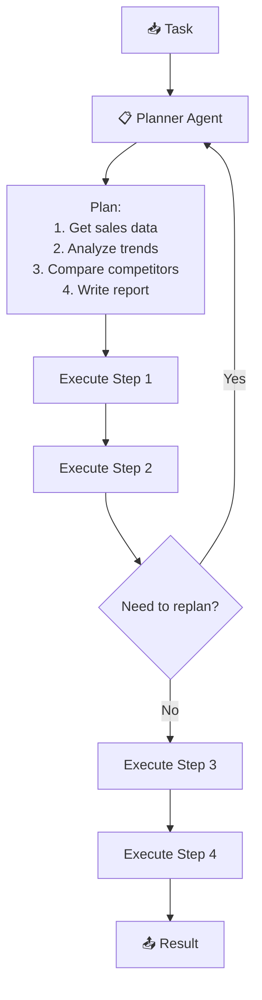

### בעד ונגד

| ✅ בעד | ❌ נגד |
|--------|--------|
| גמיש מאוד | לא צפוי (non-deterministic) |
| מגלה דברים שלא חשבת עליהם | יכול ללכת לאיבוד |
| מתאים לבעיות פתוחות | עלות גבוהה (הרבה LLM calls) |
| | קשה לדבג |
| | צריך guardrails חזקים |

---

## Sub-Agent Orchestration

### מה זה?
Agent ראשי שמאציל משימות ל-**Agents מומחים**:

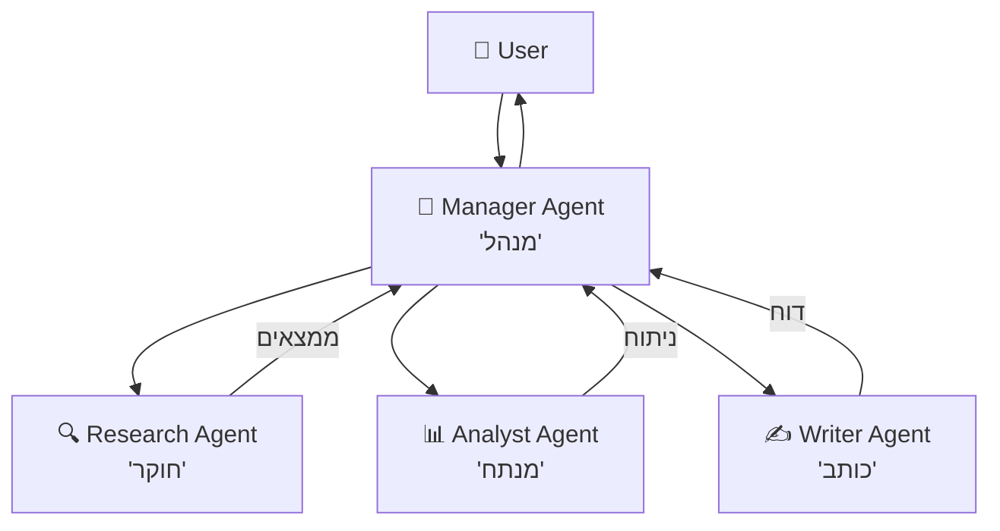

### דוגמה: כתיבת מאמר

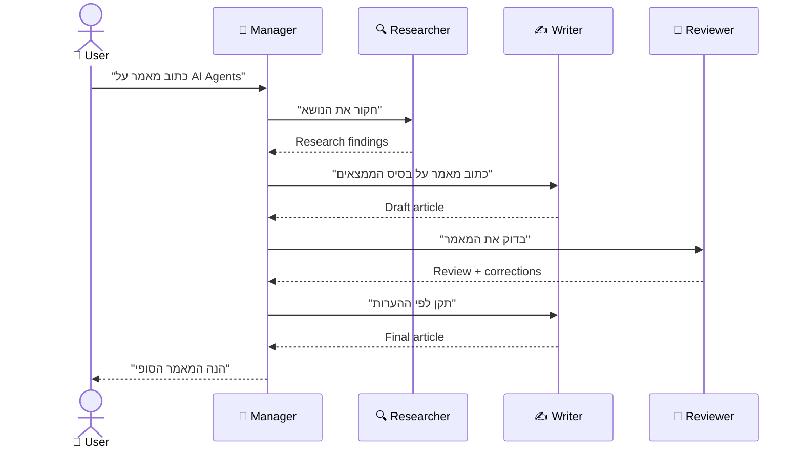

### Patterns של Sub-Agent:

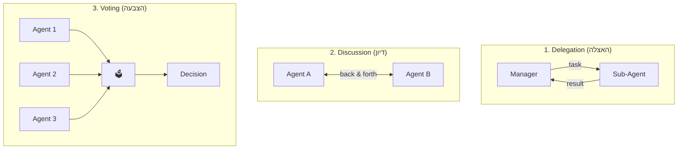

### יתרונות וחסרונות

| ✅ בעד | ❌ נגד |
|--------|--------|
| כל Agent מומחה בתחומו | תקשורת overhead |
| Scaling של experts | ריבוי LLM calls = cost |
| מודולריות - קל להחליף Agent | ניהול מורכב |
| Parallel execution אפשרי | Debugging קשה |

---

## DAG Workflows

### מה זה DAG?
**DAG = Directed Acyclic Graph** = גרף מכוון ללא מעגלים.

מאפשר לתאר workflows מורכבים עם **dependencies** - "שלב X רץ רק אחרי ש-A ו-B סיימו":

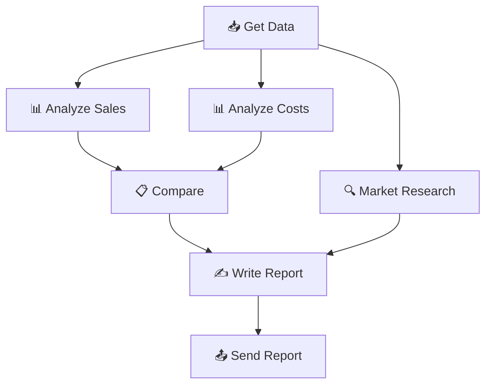

### למה DAG ולא רשימה?

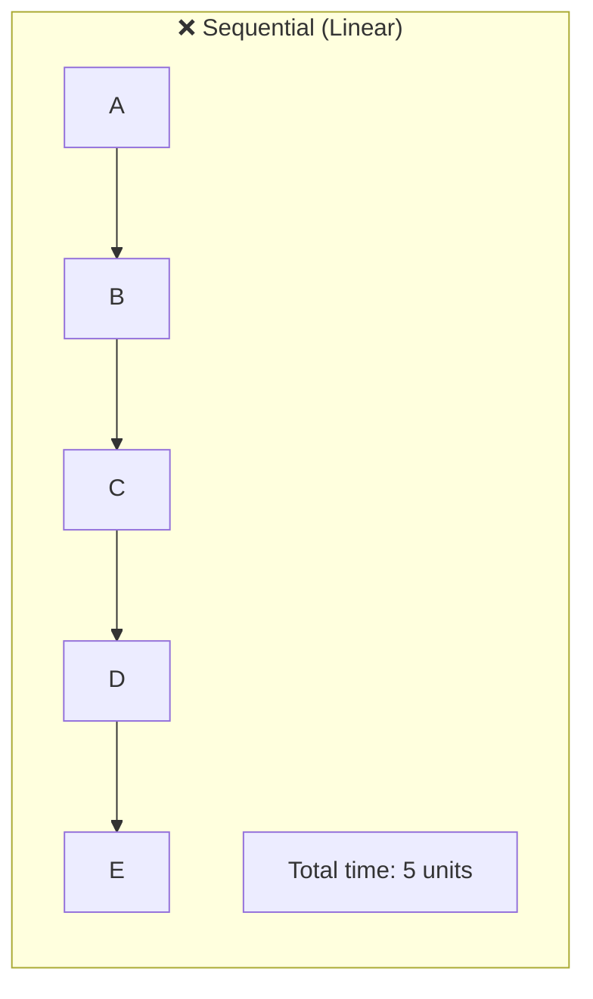

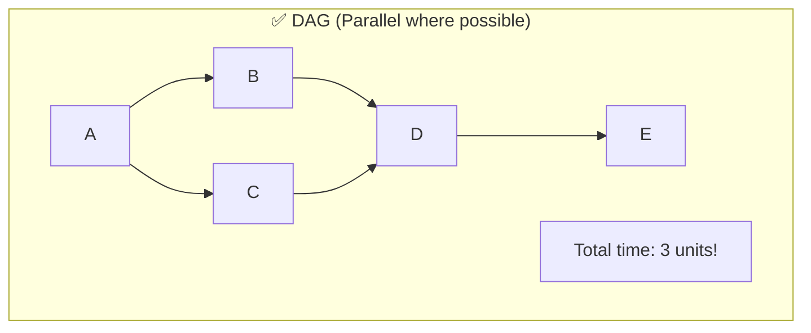

### DAG vs Sequential:

| Sequential | DAG |
|-----------|-----|
| A→B→C→D→E = 5 steps | A→(B,C parallel)→D→E = 3 steps |
| פשוט | מהיר |
| כל שלב תלוי בקודמו | שלבים עצמאיים רצים במקביל |

---

## Patterns מתקדמים

### 1. Map-Reduce Pattern

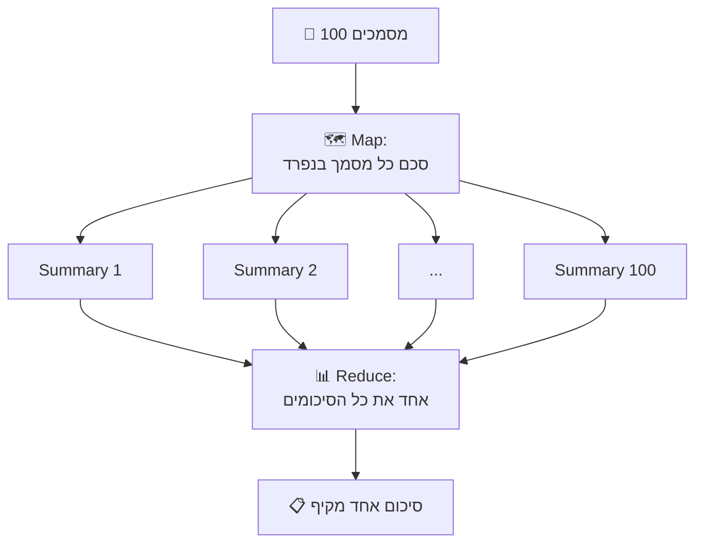

**מתאים ל:** סיכום מסמכים רבים, ניתוח datasets, aggregation

### 2. Supervisor Pattern

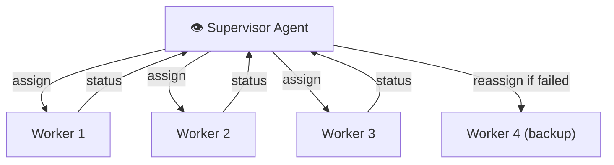

**Supervisor אחראי על:**
- הקצאת משימות ל-Workers
- מעקב אחרי התקדמות
- טיפול בכשלים (reassign)
- החלטה מתי הכל סיים

### 3. Critic Pattern

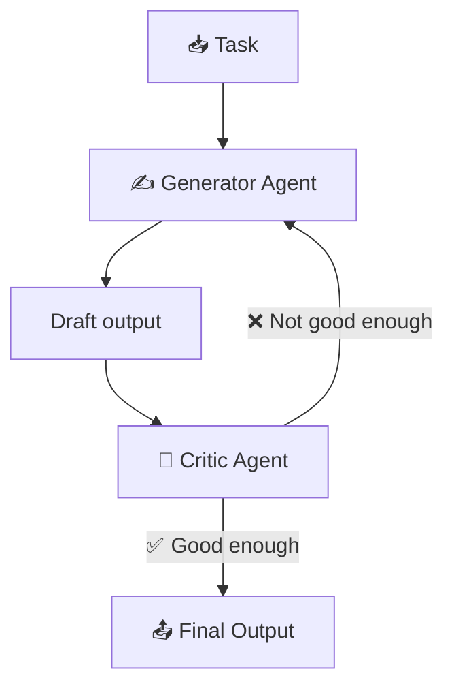

**מתאים ל:** כתיבה, קוד, תשובות שצריכות איכות גבוהה

---

## השוואת Patterns

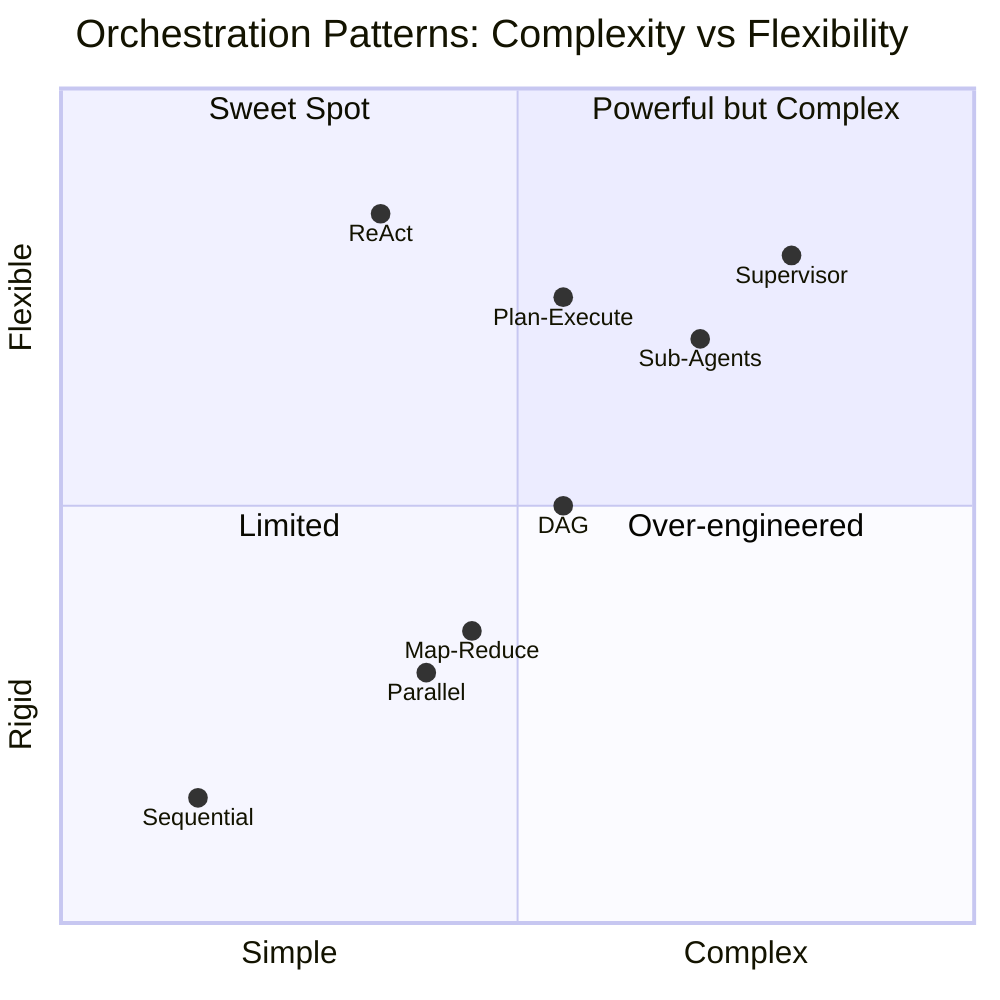

| Pattern | מתאים ל | מורכבות | עלות |
|---------|---------|---------|------|
| **Sequential** | Pipelines פשוטים | ⭐ | 💰 |
| **Parallel** | חיפוש multi-source | ⭐⭐ | 💰💰 |
| **ReAct** | בעיות פתוחות | ⭐⭐ | 💰💰💰 |
| **Plan-Execute** | משימות מורכבות | ⭐⭐⭐ | 💰💰💰 |
| **Sub-Agents** | צוות של מומחים | ⭐⭐⭐ | 💰💰💰💰 |
| **DAG** | Workflows עם dependencies | ⭐⭐⭐ | 💰💰 |
| **Map-Reduce** | עיבוד bulk | ⭐⭐ | 💰💰💰 |
| **Supervisor** | מערכות מבוזרות | ⭐⭐⭐⭐ | 💰💰💰💰 |

---

## סיכום

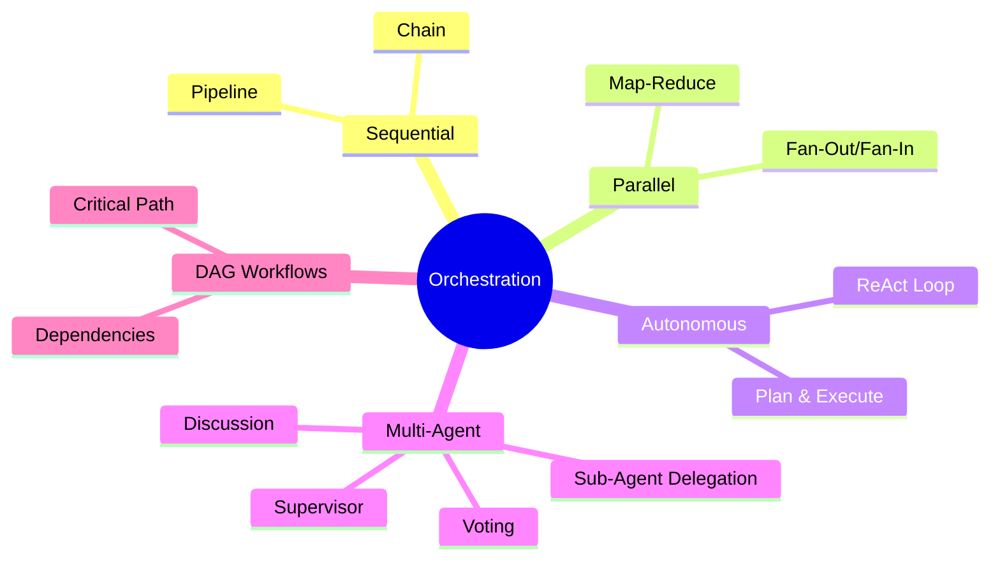

| מה למדנו | נקודה מרכזית |
|-----------|-------------|
| **Sequential** | שלב אחרי שלב - פשוט אך איטי |
| **Parallel** | מספר פעולות במקביל - מהיר אך מורכב |
| **Autonomous** | Agent מחליט בעצמו - גמיש אך לא צפוי |
| **Sub-Agents** | מומחים לכל תחום - מודולרי אך יקר |
| **DAG** | גרף dependencies - מאזן בין מקביליות לסדר |
| **Map-Reduce** | עיבוד bulk של נתונים |
| **Supervisor** | Agent שמנהל workers |

---

## ❓ שאלות לבדיקה עצמית

1. מה ההבדל בין Sequential ל-Parallel execution?
2. מה זה ReAct Pattern? תתאר את הלולאה.
3. מה היתרון של Plan-and-Execute על פני ReAct?
4. מתי כדאי להשתמש ב-Sub-Agents?
5. מה זה DAG ולמה הוא עדיף על רשימה?
6. מה זה Map-Reduce Pattern ומתי משתמשים בו?
7. מה תפקיד ה-Supervisor Agent?
8. איזה Pattern מתאים לכל סיטואציה: סיכום 100 מסמכים? חיפוש ב-3 מקורות? כתיבת מאמר?

---

**[⬅️ חזרה לפרק 6: Thread & State](06-thread-state-management.md)** | **[➡️ המשך לפרק 8: Tools & Marketplace →](08-tools-marketplace.md)**
