# 📈 פרק 11: Observability & Cost Dashboard

## תוכן עניינים
- [מה זה Observability?](#מה-זה-observability)
- [3 עמודי Observability](#3-עמודי-observability)
- [Metrics](#metrics)
- [Logging](#logging)
- [Distributed Tracing](#distributed-tracing)
- [Token Tracking](#token-tracking)
- [Cost Observability Dashboard](#cost-observability-dashboard)
- [Alerting](#alerting)
- [יתרונות וחסרונות](#יתרונות-וחסרונות)
- [סיכום ושאלות](#סיכום-ושאלות)

---

## מה זה Observability?

**Observability** = היכולת **להבין מה קורה בפנים** של מערכת, בלי לצלול לתוך הקוד.

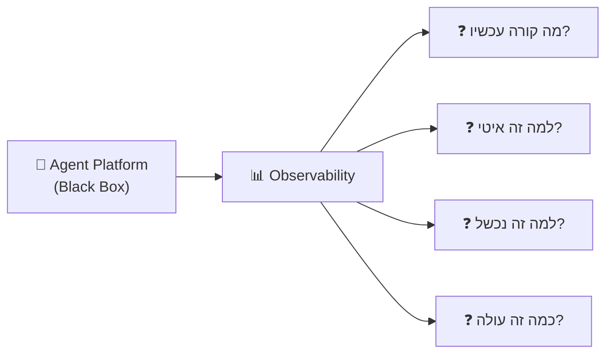

### Monitoring vs Observability:

| Monitoring | Observability |
|------------|--------------|
| שואל: "האם המערכת עובדת?" | שואל: "למה המערכת לא עובדת?" |
| Predefined checks | Explore unknown issues |
| Dashboard + Alerts | Metrics + Logs + Traces |
| מספר אם משהו שבור | מסביר **למה** משהו שבור |

---

## 3 עמודי Observability

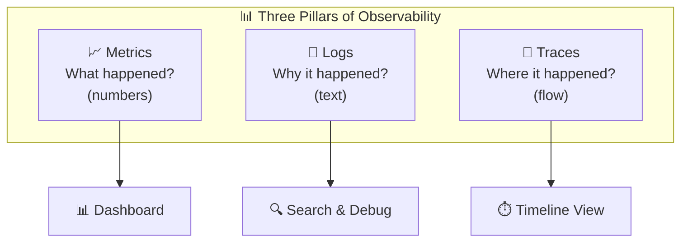

---

## Metrics

### מה זה?
**Metrics** = מספרים שמייצגים את המצב של המערכת ברגע נתון.

### מדדים חיוניים ל-Agent Platform:

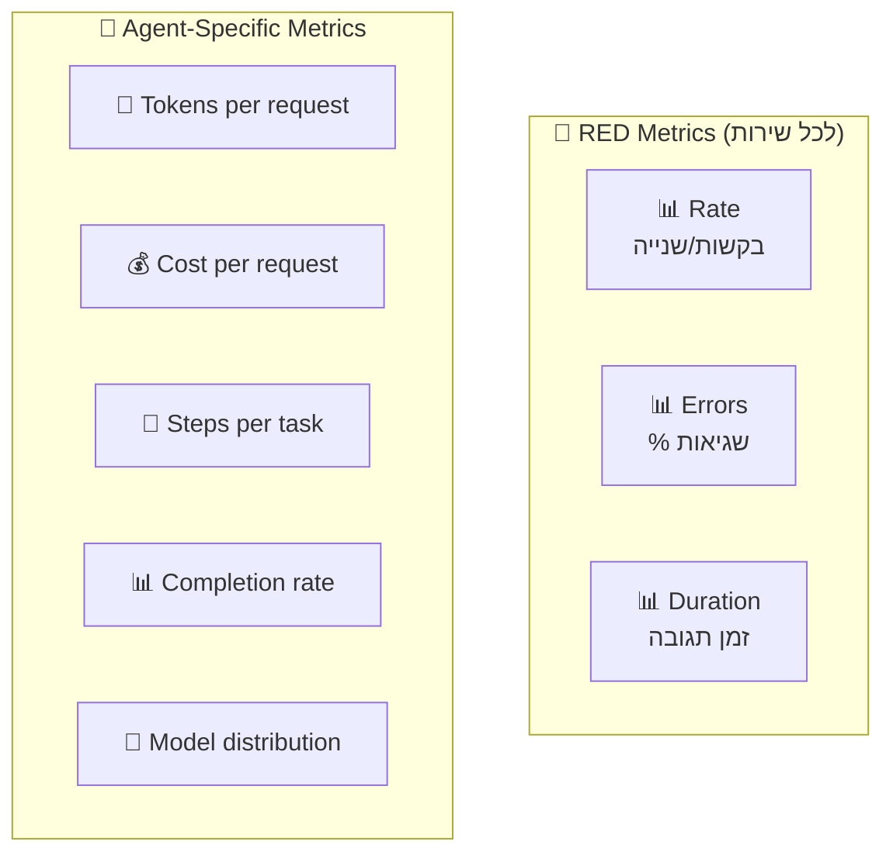

### Types of Metrics:

| סוג | הסבר | דוגמאות |
|-----|-------|---------|
| **Counter** | מונה שרק עולה | Total requests, total errors |
| **Gauge** | ערך נוכחי (עולה/יורד) | Active agents, queue depth |
| **Histogram** | התפלגות ערכים | Response time percentiles |
| **Rate** | שינוי per second | Requests/sec, tokens/sec |

### Key Metrics Dashboard:

```
┌─────────────────────────────────────────────────┐
│  Agent Platform - Live Dashboard                │
├───────────────┬───────────────┬─────────────────┤
│ Requests/min  │ Error Rate    │ Avg Latency     │
│    1,234      │    0.3%       │    1.8s         │
├───────────────┼───────────────┼─────────────────┤
│ Active Agents │ Tokens/min    │ Cost/hour       │
│      47       │   125,000     │    $12.50       │
├───────────────┼───────────────┼─────────────────┤
│ Completion %  │ Model Calls   │ Tool Calls      │
│    94.2%      │    856        │    2,341        │
└───────────────┴───────────────┴─────────────────┘
```

---

## Logging

### מה מתעדים ב-Agent Platform?

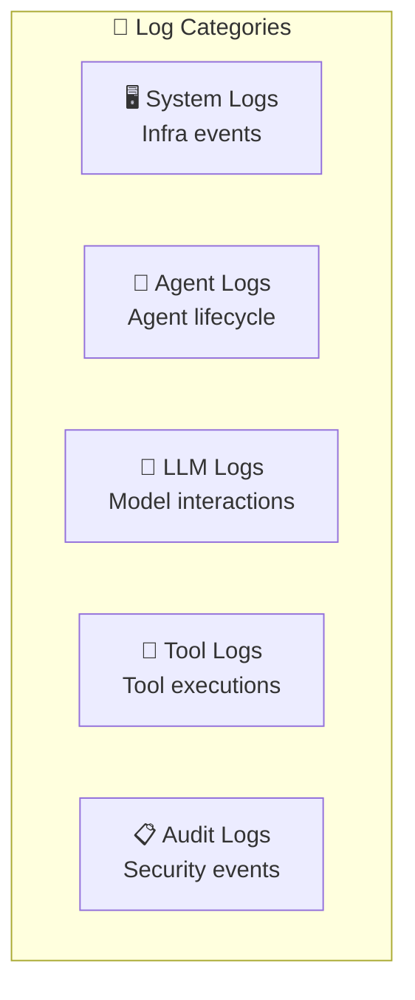

### Structured Logging:

```json
{
  "timestamp": "2026-02-21T10:00:01.234Z",
  "level": "INFO",
  "service": "agent-runtime",
  "trace_id": "abc-123-def",
  "span_id": "span-456",
  "agent_id": "data-analyst-v2",
  "tenant_id": "tenant-acme",
  "user_id": "roi@acme.com",
  "event": "tool_execution",
  "tool": "sql_query",
  "duration_ms": 245,
  "tokens_used": 1523,
  "model": "gpt-4o",
  "status": "success"
}
```

### Log Levels:

| Level | מתי | דוגמה |
|-------|-----|-------|
| **DEBUG** | פרטים טכניים | "Prompt template rendered: ..." |
| **INFO** | אירוע רגיל | "Agent completed task in 3 steps" |
| **WARN** | בעיה פוטנציאלית | "Token usage at 80% of limit" |
| **ERROR** | כשלון | "Tool execution failed: timeout" |
| **FATAL** | כשלון קריטי | "Cannot connect to model provider" |

---

## Distributed Tracing

### מה זה?
**Tracing** = מעקב אחרי **בקשה אחת** לאורך כל המערכות שהיא עוברת.

### למה חשוב ב-Agent Platform?
בקשה אחת ל-Agent עוברת דרך **הרבה שירותים**:

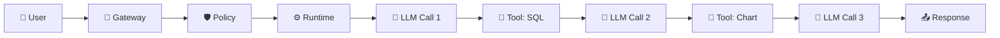

### Trace Visualization:

```
Trace ID: abc-123-def                      Total: 4.2s
├── API Gateway                            ▓░░░░░░░░░░░░░░░░░░  50ms
├── Policy Check                           ░▓░░░░░░░░░░░░░░░░░  30ms
├── Agent Orchestrator                     ░░▓▓▓▓▓▓▓▓▓▓▓▓▓▓▓▓  4.0s
│   ├── LLM Call 1 (gpt-4o)               ░░▓▓▓░░░░░░░░░░░░░░  1.2s
│   │   └── Token count: 1,200                     input: 800 + output: 400
│   ├── Tool: sql_query                    ░░░░░▓░░░░░░░░░░░░░  0.3s
│   ├── LLM Call 2 (gpt-4o)               ░░░░░░▓▓░░░░░░░░░░░  0.8s
│   │   └── Token count: 2,100                     input: 1,500 + output: 600
│   ├── Tool: chart_gen                    ░░░░░░░░▓░░░░░░░░░░  0.5s
│   └── LLM Call 3 (gpt-4o)               ░░░░░░░░░▓▓▓░░░░░░░  1.0s
│       └── Token count: 900                       input: 700 + output: 200
└── Response serialization                 ░░░░░░░░░░░░░▓░░░░░  120ms
    
Total tokens: 4,200  |  Cost: $0.042  |  Steps: 3  |  Tools: 2
```

### Trace Structure:

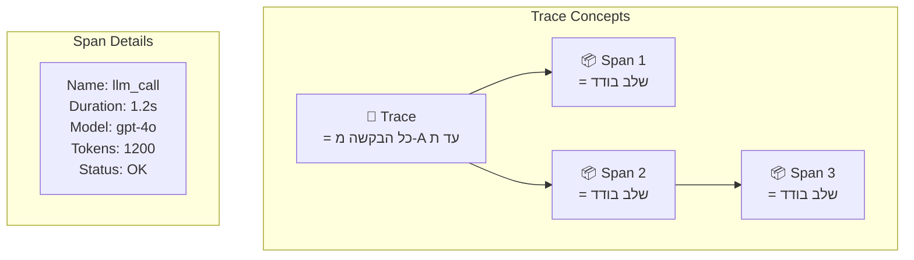

| מונח | הסבר |
|------|-------|
| **Trace** | הבקשה השלמה, מקצה לקצה |
| **Span** | פעולה בודדת (LLM call, tool call) |
| **Trace ID** | מזהה ייחודי לכל הבקשה |
| **Span ID** | מזהה ייחודי לכל פעולה |
| **Parent Span** | ה-Span שהפעיל את הנוכחי |

---

## Token Tracking

### למה Token Tracking חשוב?
**Tokens = כסף** ב-LLM platforms. כל token עולה כסף.

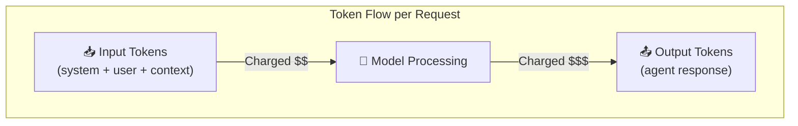

### Token Cost Comparison:

| Model | Input (per 1M) | Output (per 1M) | Speed |
|-------|----------------|------------------|-------|
| GPT-4o | $2.50 | $10.00 | Fast |
| GPT-4o-mini | $0.15 | $0.60 | Fastest |
| Claude 3.5 Sonnet | $3.00 | $15.00 | Fast |
| Claude 3 Opus | $15.00 | $75.00 | Slow |

### Token Tracking Architecture:

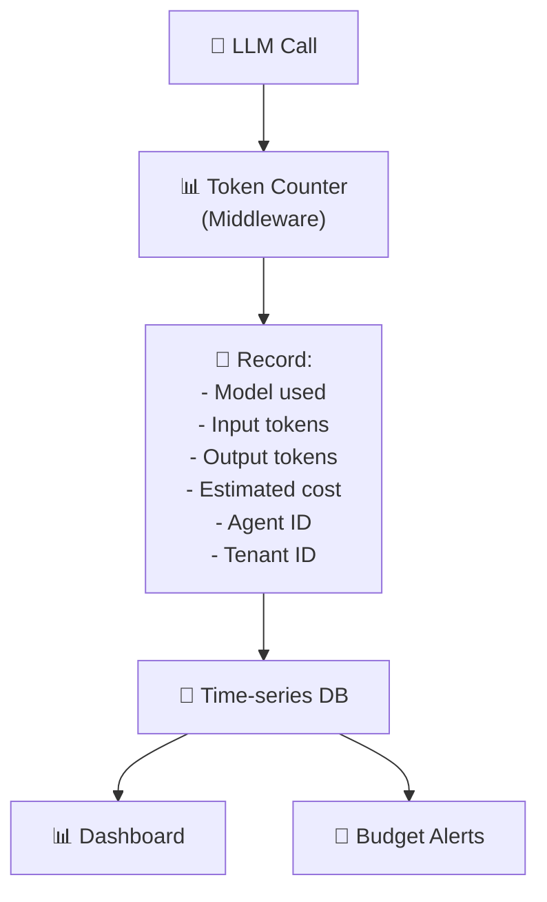

### איפה ה-tokens נצרכים?

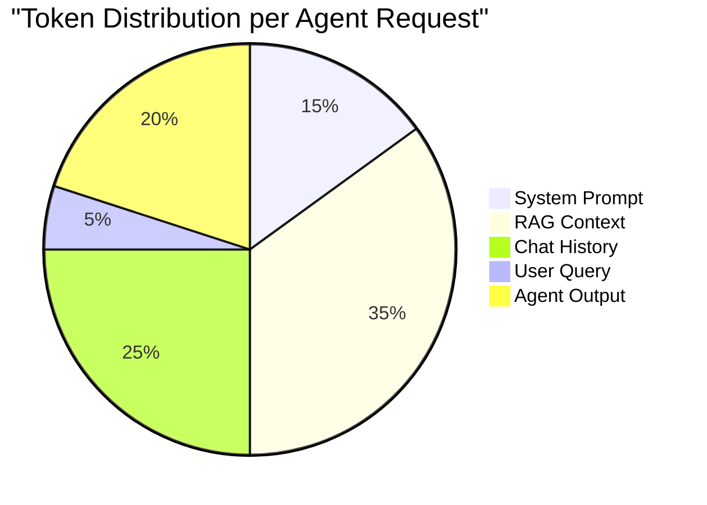

---

## Cost Observability Dashboard

### Dashboard Layout:

```
┌───────────────────────────────────────────────────┐
│           💰 Cost Observability Dashboard          │
├───────────────────────────────────────────────────┤
│                                                    │
│  📊 Total Cost Today: $127.50  (Budget: $200)     │
│  ████████████████████░░░░░░░░  63.7%              │
│                                                    │
├──────────────┬──────────────┬─────────────────────┤
│ By Tenant    │ By Agent     │ By Model             │
│ acme: $45    │ analyst: $30 │ gpt-4o: $80          │
│ beta: $38    │ support: $25 │ gpt-4o-mini: $20     │
│ gamma: $25   │ writer: $20  │ claude-3.5: $15      │
│ delta: $19   │ coder: $18   │ embeddings: $12      │
├──────────────┴──────────────┴─────────────────────┤
│                                                    │
│  📈 Cost Trend (7 days)                           │
│  $150 │    ╲                                      │
│  $120 │     ╲   ╱╲                                │
│  $100 │      ╲╱   ╲  ╱╲                           │
│   $80 │            ╲╱   ╲                         │
│       └─────────────────────                      │
│        Mon  Tue  Wed  Thu  Fri                    │
│                                                    │
├───────────────────────────────────────────────────┤
│ 🚨 Alerts:                                        │
│ ⚠️  Tenant 'acme' at 90% of daily budget          │
│ ⚠️  Agent 'analyst-v3' cost 3x higher than v2     │
└───────────────────────────────────────────────────┘
```

### Cost Dimensions:

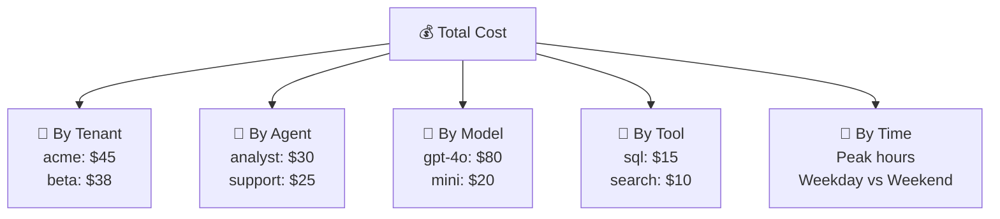

### Cost Attribution Model:

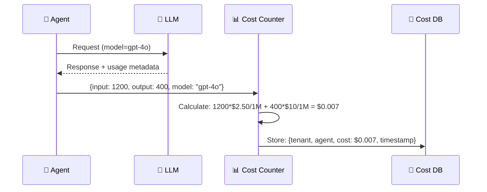

---

## Alerting

### מתי מתריעים?

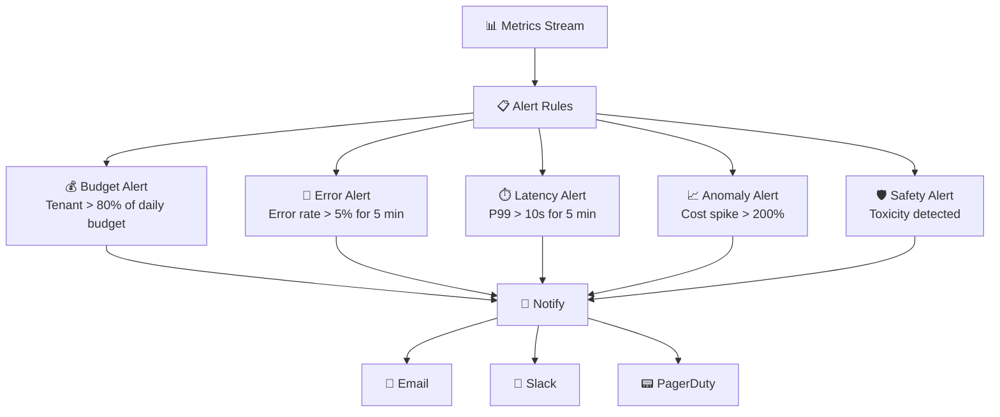

### Alert Severity:

| Severity | דוגמה | Action |
|----------|-------|--------|
| **P0 - Critical** | Platform down | PagerDuty, immediate response |
| **P1 - High** | Error rate > 10% | Slack + Email, 15 min SLA |
| **P2 - Medium** | Budget 90% | Email, investigate today |
| **P3 - Low** | Latency increased 20% | Dashboard, review weekly |

---

## OpenTelemetry

### מה זה?
**OpenTelemetry (OTel)** = סטנדרט פתוח ל-Observability. מגדיר איך לאסוף Metrics, Logs, Traces.

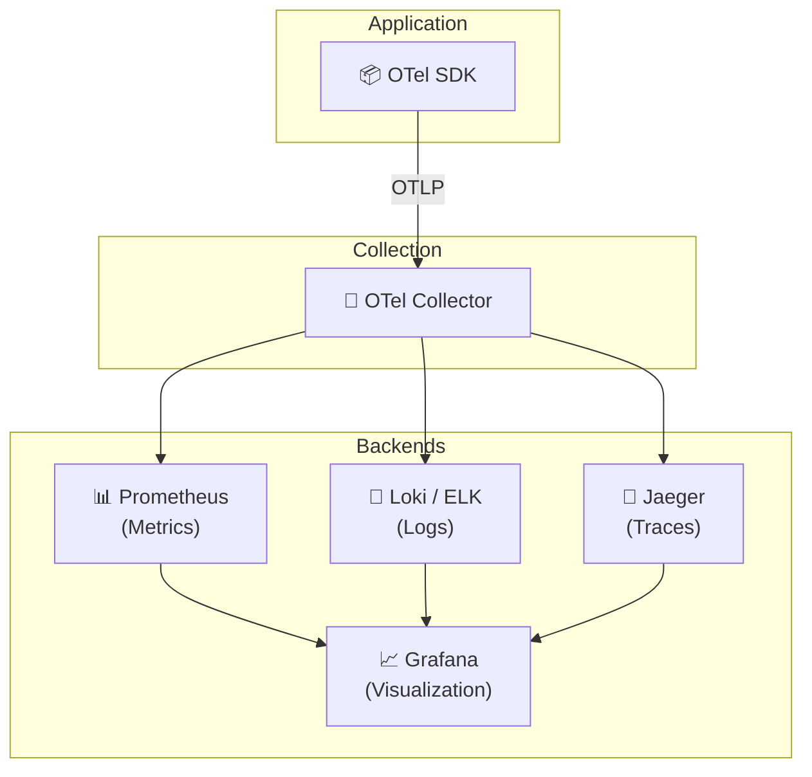

### למה OTel חשוב?

| יתרון | הסבר |
|-------|-------|
| **Vendor Neutral** | לא תלוי ב-Azure Monitor / Datadog / etc. |
| **Standard** | כולם מדברים את אותה שפה |
| **Auto-instrumentation** | SDK אוטומטי לרוב השפות |
| **Flexible backends** | אפשר להחליף backend בלי לשנות קוד |

---

## יתרונות וחסרונות

| ✅ יתרון | ❌ חיסרון |
|----------|----------|
| Full visibility לתוך המערכת | Storage costs (logs, traces) |
| Debug מהיר עם traces | Instrumentation overhead |
| Cost control בזמן אמת | Complex setup |
| Anomaly detection | Alert fatigue (יותר מדי התראות) |
| Capacity planning | Sensitive data in logs (PII risk) |

---

## סיכום

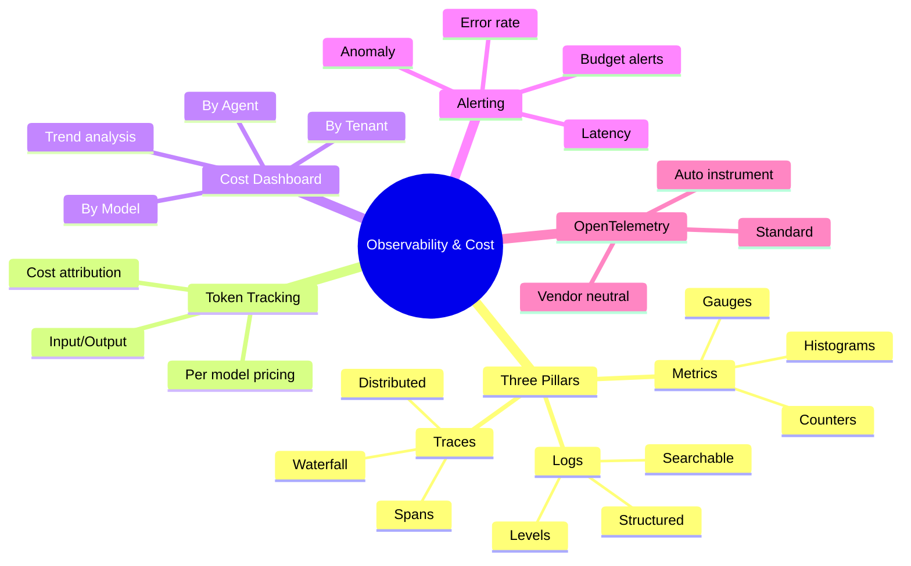

| מה למדנו | נקודה מרכזית |
|-----------|-------------|
| **Observability** | היכולת להבין מה קורה בתוך המערכת |
| **3 Pillars** | Metrics, Logs, Traces |
| **Distributed Tracing** | מעקב אחרי בקשה דרך כל השירותים |
| **Token Tracking** | מעקב אחרי צריכת tokens = כסף |
| **Cost Dashboard** | חיתוך עלויות per tenant/agent/model |
| **Alerting** | התראות על חריגות בזמן אמת |
| **OpenTelemetry** | סטנדרט פתוח ל-Observability |

---

## ❓ שאלות לבדיקה עצמית

1. מה ההבדל בין Monitoring ל-Observability?
2. מהם 3 עמודי ה-Observability?
3. מה זה Trace, Span, Trace ID?
4. למה Token Tracking חשוב?
5. אילו חיתוכים יש ב-Cost Dashboard?
6. מה זה OpenTelemetry ולמה הוא חשוב?
7. מה זו Alert Fatigue ואיך מתמודדים?

---

### 📝 תשובות

<details>
<summary>1. מה ההבדל בין Monitoring ל-Observability?</summary>

**Monitoring** = מעקב אחרי מדדים ידועים מראש ("CPU > 80%? תתריע"). תגובתי - מגיב למה שידוע שקורה. **Observability** = יכולת להבין **למה** משהו קורה מתוך הנתונים. חקירתית - עונה לשאלות שלא צפיתי מראש. Monitoring ⊂ Observability.
</details>

<details>
<summary>2. מהם 3 עמודי ה-Observability?</summary>

1. **Logs** - תיעוד טקסטואלי של אירועים ("מה קרה").
2. **Metrics** - מדדים מספריים לאורך זמן (latency, throughput, errors).
3. **Traces** - מעקב מסע בקשה דרך כל השירותים ("איפה זה קרה"). כולם יחד = תמונה מלאה.
</details>

<details>
<summary>3. מה זה Trace, Span, Trace ID?</summary>

**Trace** = מסע שלם של בקשה אחת דרך כל המערכת. **Span** = קטע אחד בתוך ה-trace (למשל: LLM call, tool execution, DB query). לכל span יש start time, duration, metadata. **Trace ID** = מזהה ייחודי שמקשר את כל ה-spans לאותה בקשה. מאפשר לעקוב אחרי בקשה אחת דרך כל השכבות.
</details>

<details>
<summary>4. למה Token Tracking חשוב?</summary>

כי **tokens = כסף**. בלי מעקב: (1) לא יודעים כמה עולה כל agent, (2) agent אחד יכול לצרוך הרבה (לולאות ארוכות), (3) לא ניתן לזהות חריגות. Token Tracking מאפשר: ניראות עלות, זיהוי אנומליות, חיוב per tenant, בחירת מודל חסכוני יותר.
</details>

<details>
<summary>5. אילו חיתוכים יש ב-Cost Dashboard?</summary>

Cost Dashboard מראה עלות בחיתוכים: (1) **Per Agent** - איזה agent עולה הכי יותר, (2) **Per Tenant** - חיוב לכל לקוח, (3) **Per Model** - GPT-4o vs GPT-4o-mini, (4) **Per Tool** - כלים יקרים, (5) **Over Time** - מגמות לאורך זמן.
</details>

<details>
<summary>6. מה זה OpenTelemetry ולמה הוא חשוב?</summary>

**OpenTelemetry (OTel)** = סטנדרט פתוח (לא של vendor) לאיסוף logs, metrics, traces מאפליקציות. חשוב כי: (1) **לא vendor lock-in** - עובד עם Jaeger, Prometheus, Azure Monitor, Datadog, (2) **סטנדרטי** - auto-instrumentation להרבה שפות, (3) **קהילתי** - מתוחזק ונתמך על ידי CNCF.
</details>

<details>
<summary>7. מה זו Alert Fatigue ואיך מתמודדים?</summary>

**Alert Fatigue** = כשיש יותר מדי התראות, הצוות מתחיל להתעלם מהן ולפספס גם את הקריטיות. התמודדות: (1) **Severity levels** - Critical/Warning/Info, (2) **איחוד** - alert אחד לבעיה, לא 20, (3) **Actionable** - כל alert חייב להיות עם פעולה ברורה, (4) **Cooldown** - לא לשלוח אותו alert שוב ושוב.
</details>

---

**[⬅️ חזרה לפרק 10: Evaluation](10-evaluation-engine.md)** | **[➡️ המשך לפרק 12: Security & Isolation →](12-security-isolation.md)**
