# 🏗️ פרק 14: HLD Architecture - Vendor Agnostic

## תוכן עניינים
- [מה זה HLD?](#מה-זה-hld)
- [System Context](#system-context)
- [ארכיטקטורה מלאה](#ארכיטקטורה-מלאה)
- [Control Plane Architecture](#control-plane-architecture)
- [Runtime Plane Architecture](#runtime-plane-architecture)
- [Data Flow](#data-flow)
- [Component Breakdown](#component-breakdown)
- [Cross-Cutting Concerns](#cross-cutting-concerns)
- [Deployment Architecture](#deployment-architecture)
- [Technology Decisions](#technology-decisions)
- [סיכום ושאלות](#סיכום-ושאלות)

---

## מה זה HLD?

**HLD (High-Level Design)** = תיאור ארכיטקטוני **ברמה גבוהה** של המערכת - מה הרכיבים, איך הם מתקשרים, מה האחריות של כל אחד.

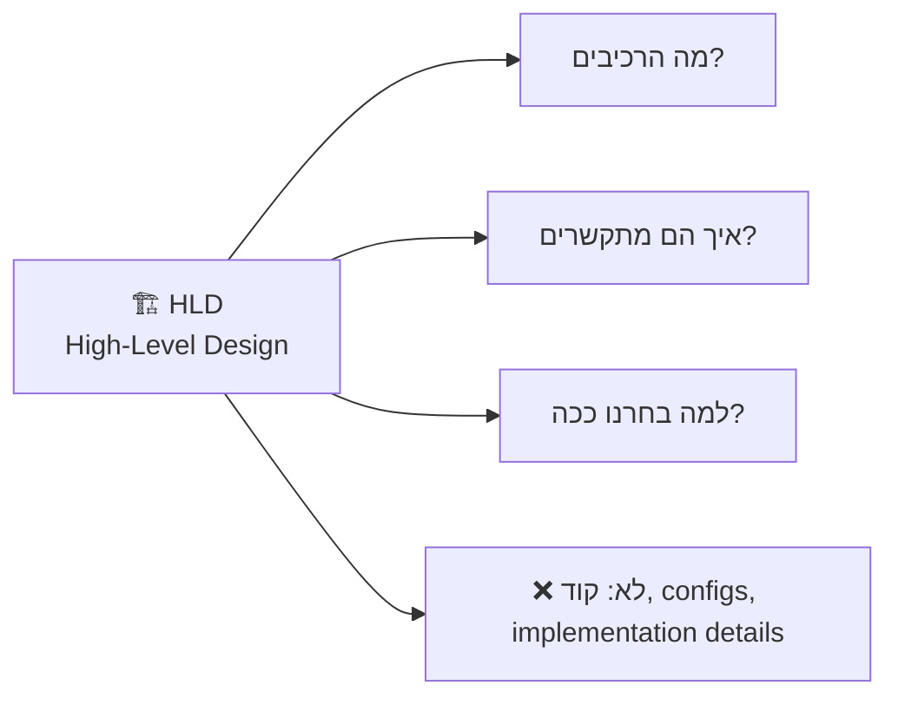

### Vendor Agnostic = לא תלוי בספק:

| Vendor Agnostic | Vendor Specific |
|-----------------|-----------------|
| "Message Queue" | "Azure Service Bus" |
| "LLM Provider" | "Azure OpenAI" |
| "Vector Database" | "Azure AI Search" |
| "Container Orchestration" | "AKS" |
| "Identity Provider" | "Microsoft Entra ID" |

---

## System Context

### מי משתמש במערכת?

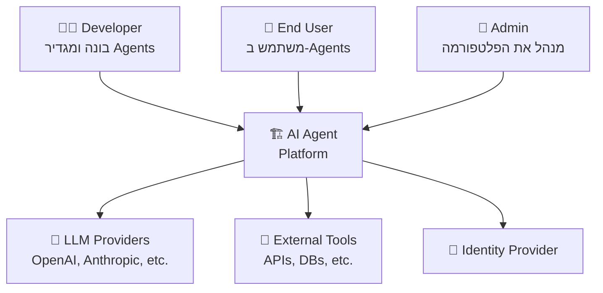

---

## ארכיטקטורה מלאה

### Full HLD Diagram:

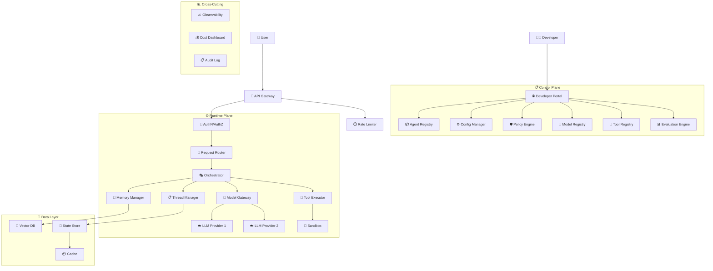

---

## Control Plane Architecture

### רכיבי ה-Control Plane:

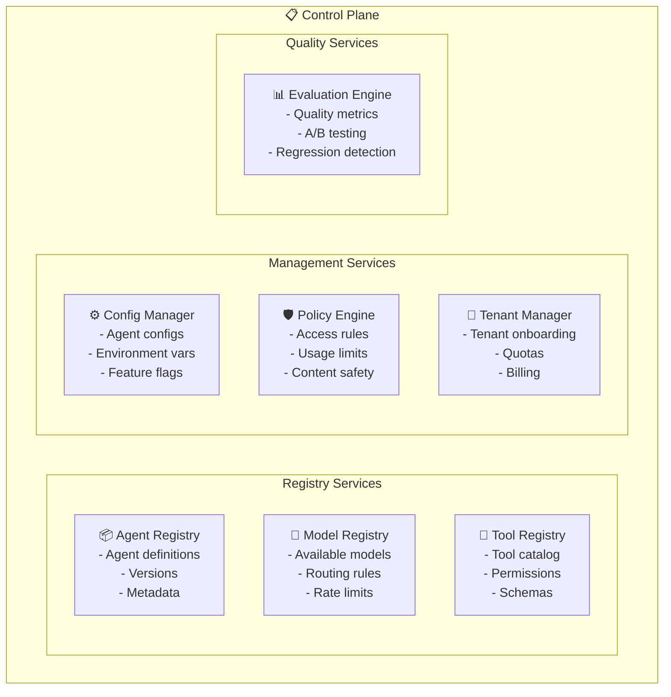

### Control Plane APIs:

| API | Method | Path | Description |
|-----|--------|------|-------------|
| Create Agent | POST | /agents | הגדרת Agent חדש |
| List Agents | GET | /agents | רשימת כל ה-Agents |
| Get Agent | GET | /agents/{id} | פרטי Agent |
| Update Config | PUT | /agents/{id}/config | עדכון הגדרות |
| Register Tool | POST | /tools | רישום כלי חדש |
| Set Policy | POST | /policies | הגדרת policy |
| Run Evaluation | POST | /evaluations | הרצת הערכה |

---

## Runtime Plane Architecture

### Request Processing Flow:

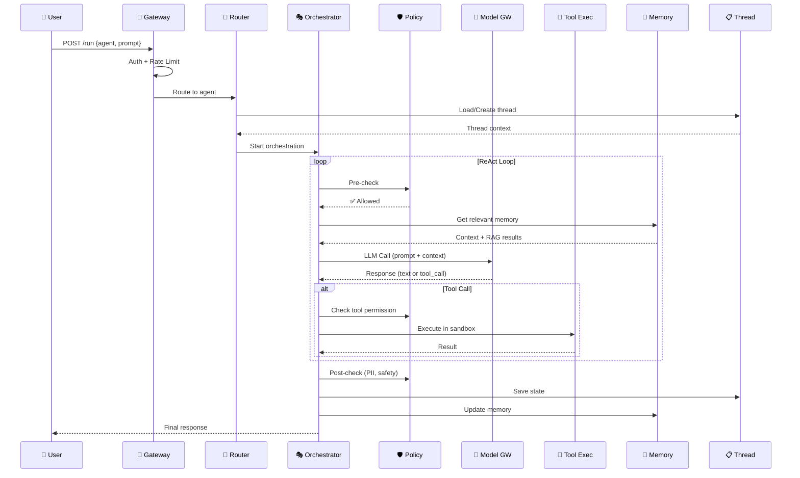

### Orchestrator State Machine:

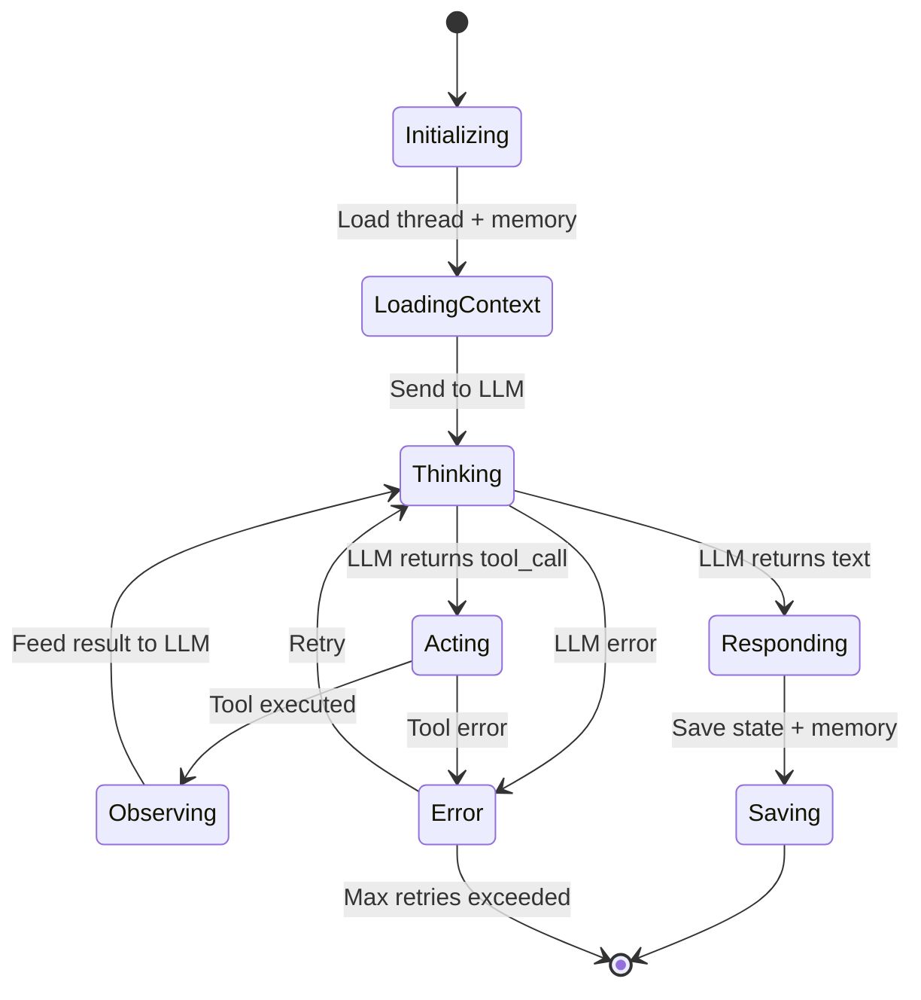

---

## Data Flow

### Data Flow Diagram:

```mermaid
graph LR
    subgraph "Ingest"
        Docs["📄 Documents"] --> Chunker["✂️ Chunker"]
        Chunker --> Embedder["📐 Embedder"]
        Embedder --> VDB["💾 Vector DB"]
    end
    
    subgraph "Query"
        Query["❓ User Query"] --> QEmbed["📐 Embed Query"]
        QEmbed --> Search["🔍 Vector Search"]
        VDB --> Search
        Search --> Context["📋 Top K Results"]
        Context --> LLM["🧠 LLM"]
        LLM --> Response["📤 Response"]
    end
    
    subgraph "State"
        Response --> Thread["📋 Thread Store"]
        Response --> History["📜 Chat History"]
        Response --> Audit["📋 Audit Log"]
    end
```

### Data Stores:

| Store | Type | What it stores | E.g. |
|-------|------|---------------|------|
| **State Store** | Key-Value / Document | Thread state, agent state | Redis, Cosmos DB |
| **Vector DB** | Vector | Document embeddings for RAG | Qdrant, Pinecone |
| **Chat History** | Document | Conversation messages | MongoDB, Cosmos DB |
| **Audit Log** | Append-only | All actions | Kafka → Storage |
| **Config Store** | Key-Value | Agent configs, policies | etcd, Consul |
| **Cache** | In-memory | LLM responses, tool results | Redis |
| **Blob Storage** | Object | Files, documents | S3, Blob |

---

## Component Breakdown

### כל רכיב, תפקידו, ו-inputs/outputs:

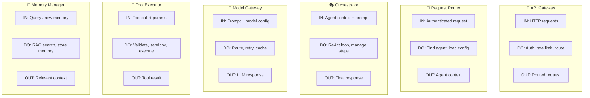

---

## Cross-Cutting Concerns

### רכיבים שעוברים את כל השכבות:

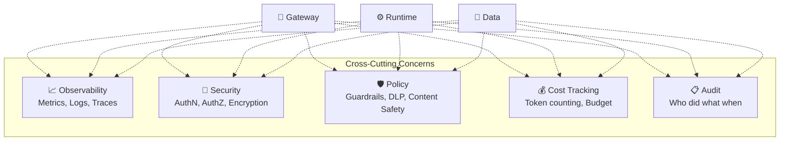

---

## Deployment Architecture

### Kubernetes-Based Deployment:

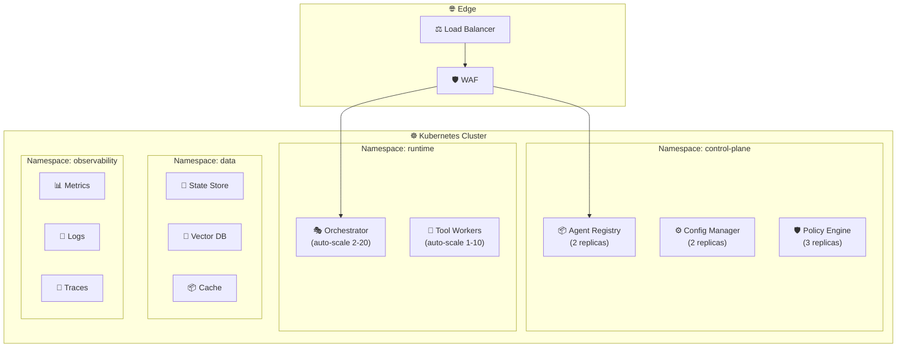

### Deployment Configurations:

| Environment | Config |
|------------|--------|
| **Dev** | 1 node, minimal replicas, mock LLM |
| **Staging** | 3 nodes, real LLM, synthetic data |
| **Production** | 5+ nodes, auto-scale, multi-region, real data |

---

## Technology Decisions

### כל רכיב ואופציות טכנולוגיות (Vendor Agnostic):

| Component | Option A | Option B | Option C |
|-----------|----------|----------|----------|
| **API Gateway** | Kong | Envoy | NGINX |
| **Container Runtime** | Kubernetes | Docker Swarm | Nomad |
| **State Store** | Redis | PostgreSQL | MongoDB |
| **Vector DB** | Qdrant | Pinecone | Weaviate |
| **Message Queue** | RabbitMQ | Kafka | NATS |
| **Cache** | Redis | Memcached | Hazelcast |
| **Observability** | OTel + Grafana | Datadog | Elastic Stack |
| **Secret Vault** | HashiCorp Vault | CyberArk | SOPS |
| **Identity** | Keycloak | Auth0 | Okta |
| **LLM Framework** | LangChain | Semantic Kernel | LlamaIndex |
| **Blob Storage** | MinIO | Ceph | NAS |

### Decision Framework:

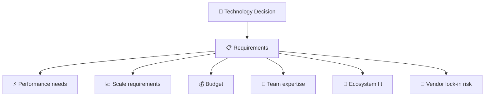

---

## Architecture Qualities

### Non-Functional Requirements:

| Quality | Target | How |
|---------|--------|-----|
| **Latency** | P99 < 5s for simple queries | Caching, streaming |
| **Throughput** | 1000 RPS | Horizontal scaling |
| **Availability** | 99.9% (8.7 hours/year downtime) | Multi-AZ, redundancy |
| **Durability** | No data loss | Replication, backups |
| **Security** | SOC 2 compliant | Zero Trust, encryption |
| **Scalability** | 10x without redesign | Stateless, auto-scale |
| **Extensibility** | Add tools/models easily | Registry pattern, plugins |
| **Operability** | Quick debugging | Observability, tracing |

---

## סיכום

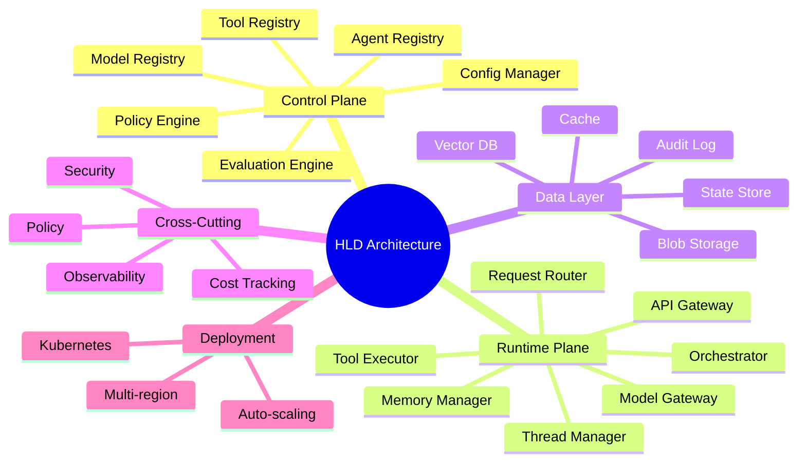

| מה למדנו | נקודה מרכזית |
|-----------|-------------|
| **HLD** | תיאור ארכיטקטוני ברמה גבוהה, ללא implementation |
| **Control Plane** | ניהול, הגדרות, Registry-ים |
| **Runtime Plane** | הרצה, Orchestrator, Model/Tool Gateway |
| **Data Layer** | State, Vectors, Cache, Audit |
| **Cross-Cutting** | Observability, Security, Cost - בכל השכבות |
| **Vendor Agnostic** | לא תלוי בספק מסוים |
| **Architecture Qualities** | Latency, Throughput, Availability, Security |

---

## ❓ שאלות לבדיקה עצמית

1. מה ההבדל בין Control Plane ל-Runtime Plane?
2. מהם 7 הרכיבים של ה-Control Plane?
3. מה עושה ה-Orchestrator ומה ה-state machine שלו?
4. מהם 7 סוגי ה-Data Stores ומה כל אחד שומר?
5. מה זה Cross-Cutting Concerns ותן 5 דוגמאות?
6. מה ההבדל בין Vendor Agnostic ל-Vendor Specific?
7. מהם ה-Non-Functional Requirements העיקריים?

---

**[⬅️ חזרה לפרק 13: Scalability](13-scalability.md)** | **[➡️ המשך לפרק 15: Microsoft Stack →](15-microsoft-stack.md)**
