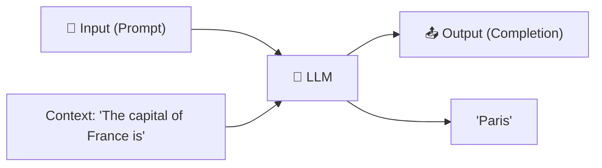
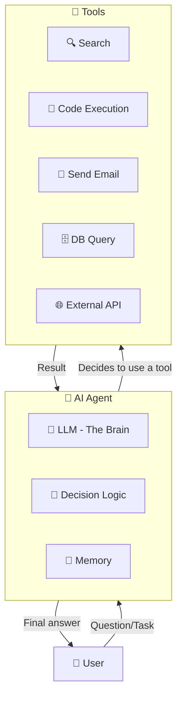
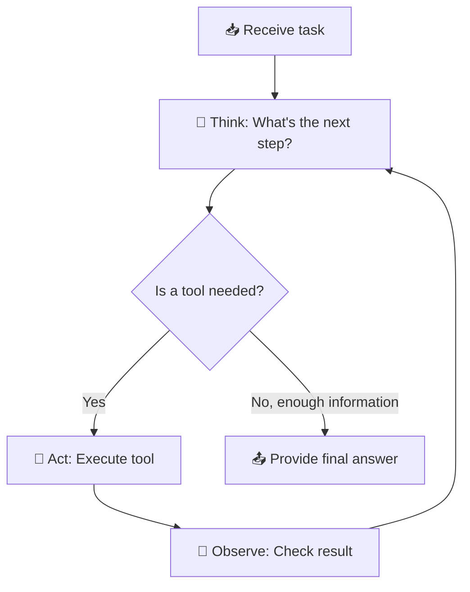
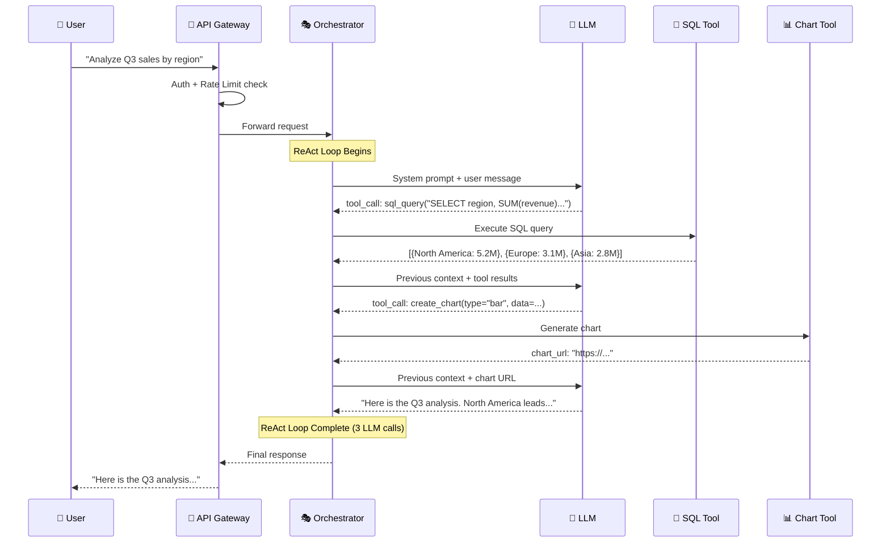
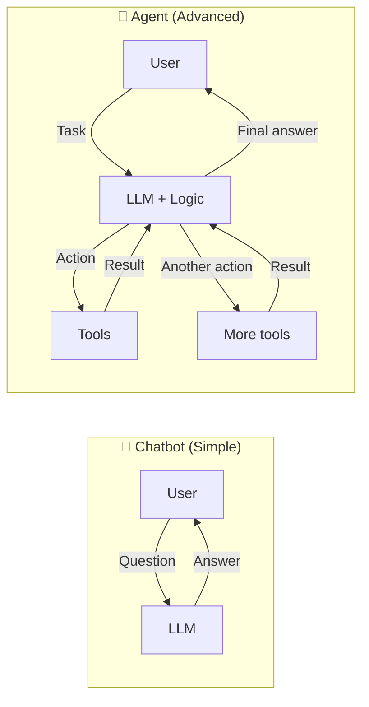
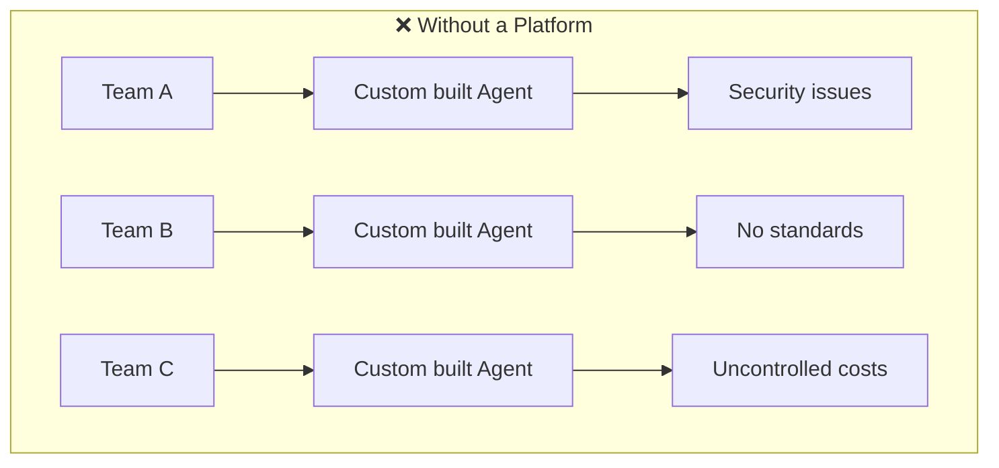
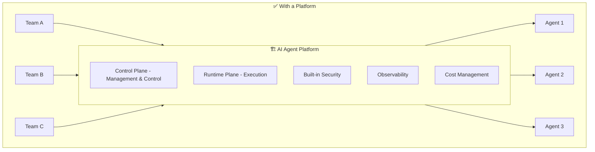
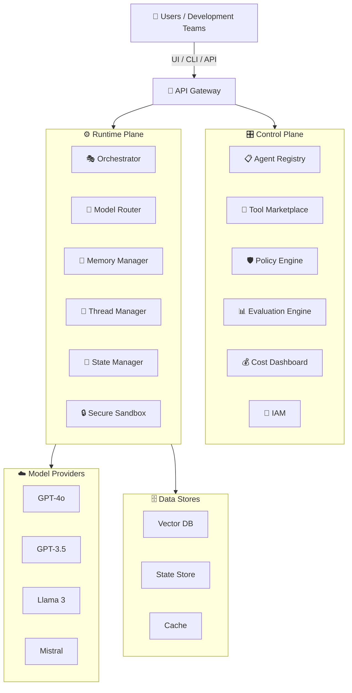

# 🤖 Chapter 1: Fundamentals - What is an AI Agent?

## Table of Contents
- [What is an LLM?](#what-is-an-llm)
- [What is an AI Agent?](#what-is-an-ai-agent)
- [The Difference Between a Chatbot and an Agent](#the-difference-between-a-chatbot-and-an-agent)
- [Why Do We Need a Platform?](#why-do-we-need-a-platform)
- [Key Concepts](#key-concepts)
- [Industry Landscape: Agent Frameworks & LLM Providers](#industry-landscape-agent-frameworks--llm-providers)
- [Summary and Questions](#summary-and-questions)

---

## What is an LLM?

**LLM = Large Language Model**

A Large Language Model is a neural network trained on massive amounts of text. It has learned to "understand" language and generate new text.

### How It Works - Simply Put



### What an LLM **can** do:
- Answer questions in natural language
- Summarize text
- Translate languages
- Write code
- Analyze textual data

### What an LLM **cannot** do (on its own):
- ❌ Browse the internet
- ❌ Run code
- ❌ Access a database
- ❌ Send emails
- ❌ Remember previous conversations (without an external mechanism)

### Important LLM Concepts

| Concept | Explanation |
|---------|-------------|
| **Token** | The basic unit of text the LLM works with. One word ≈ 1-3 tokens |
| **Context Window** | The maximum amount of text the LLM can "see" at once (e.g., 128K tokens) |
| **Prompt** | The instruction/question you send to the LLM |
| **Completion** | The response the LLM generates |
| **Temperature** | A parameter that determines how "creative" the response is (0=deterministic, 1=creative) |
| **System Prompt** | Instructions that define the LLM's "personality" and behavior |
| **Inference** | The process of running the model to get a response |

---

## What is an AI Agent?

**Agent = LLM + Tools + Decision-Making Logic**

An Agent is a system that takes an LLM and adds the ability to **act in the world** - not just generate text, but also decide which actions to take, execute them, and respond to the results.

### The Anatomy of an Agent



### The Basic Agent Loop (ReAct Pattern)

This is the most common Agent pattern - **Reason + Act**:



### Practical Example

Suppose a user asks: *"How many employees do I have in Tel Aviv and what is their average salary?"*

```
🤔 Think: I need to pull data from the database
🔧 Act:  SQL Query → SELECT COUNT(*), AVG(salary) FROM employees WHERE city='Tel Aviv'
👀 Observe: count=142, avg_salary=28500
🤔 Think: I have the data, I can answer
📤 Answer: "You have 142 employees in Tel Aviv, with an average salary of 28,500 ₪"
```

### End-to-End Example: What Really Happens Inside

Let's trace a real request through the platform to understand every step:



In code, this translates to:

```python
# What happens inside the platform for each request:

# 1. USER sends a request
response = platform.run(
    agent="data-analyst",
    message="Analyze Q3 sales by region",
    user_id="roi@acme.com",
    thread_id="thread-123"
)

# 2. ORCHESTRATOR manages the ReAct loop:
# Loop iteration 1: LLM decides to query the database
#   → tool_call: sql_query("SELECT region, SUM(revenue) FROM sales WHERE quarter='Q3'")
#   → result: [{"region": "North America", "total": 5200000}, ...]

# Loop iteration 2: LLM decides to create a chart
#   → tool_call: create_chart(type="bar", data=results)
#   → result: "https://charts.platform.ai/abc123.png"

# Loop iteration 3: LLM has enough information → generates final answer
#   → "Based on Q3 data, North America leads with $5.2M..."

# 3. Total: 3 LLM calls, 2 tool calls, ~8 seconds, ~$0.05
```

---

## The Difference Between a Chatbot and an Agent

This is one of the most important distinctions to understand:



| Feature | 💬 Chatbot | 🤖 Agent |
|---------|-----------|----------|
| **Input** | Single question | Complex task |
| **Output** | Text response | Response + actions in the world |
| **Tools** | ❌ None | ✅ Search, code, APIs |
| **Memory** | Only the current message | Conversation + long-term history |
| **Autonomy** | Zero - waits for a question | Can decide what to do on its own |
| **Loops** | Single turn | Multiple steps until task completion |
| **Planning** | ❌ | ✅ Can break down a task into steps |

---

## Why Do We Need a Platform?

Imagine a company with 10 teams, each building their own AI agent. Without a platform, each team independently solves authentication, cost tracking, safety guardrails, and model access. That's 10 teams duplicating the same security code, 10 separate billing accounts to manage, and zero standardization. When a security vulnerability is found, 10 teams need to fix it independently. A platform solves this by providing shared infrastructure — security, observability, cost management, and model access — so teams focus on building agents, not plumbing.

A large company doesn't want every team building an Agent from scratch. It wants a **platform** that provides:





### Why "Platform as a Service" (PaaS)?

| Model | Who is responsible for what | Example |
|-------|---------------------------|---------|
| **IaaS** (Infrastructure) | You manage everything - servers, network, OS | Azure VMs |
| **PaaS** (Platform) | The platform manages infrastructure, you focus on logic | Azure App Service |
| **SaaS** (Software) | Everything is ready, you just use it | ChatGPT |

**AI Agent PaaS** = we build the PaaS. Development teams don't need to worry about infrastructure, security, or scaling. They simply create an Agent, define tools, and run it.

### Platform Advantages:

| Advantage | Explanation |
|-----------|-------------|
| **Standardization** | All Agents work in the same way |
| **Centralized Security** | A single Policy Engine that applies to all |
| **Cost Transparency** | Every team can see how many tokens it consumes |
| **Quality** | A central Evaluation Engine that ensures Agents work well |
| **Development Speed** | No need to build from scratch every time |
| **Marketplace** | Sharing tools and Agents between teams |

---

## Key Concepts

These terms will appear throughout every chapter. You don't need to memorize them now — you'll learn each one deeply as we go. This table is a reference you can come back to.

A glossary of terms that will recur throughout this learning material:

### Architecture

| Concept | Explanation |
|---------|-------------|
| **Control Plane** | The management layer - settings, permissions, Policies. Does not run Agents |
| **Runtime (Data) Plane** | The execution layer - where the Agent actually works |
| **API Gateway** | A single entry point for all requests - handles authentication, Rate Limiting |
| **Multi-tenancy** | The ability to serve many customers/teams on the same infrastructure, with isolation between them |

### Agent-Specific

| Concept | Explanation |
|---------|-------------|
| **Function Calling** | The ability of an LLM to "call" an external function (tool) |
| **Tool** | A function that the Agent can use (search, code, API) |
| **Prompt Engineering** | The art of writing instructions for an LLM to get good results |
| **RAG** | Retrieval Augmented Generation - searching for relevant information and incorporating it into the prompt |
| **Embedding** | A numerical representation of text that enables semantic search |
| **Grounding** | Anchoring the LLM's responses in real data (instead of hallucination) |
| **Hallucination** | When the LLM "makes up" incorrect information |
| **Guardrails** | Rules that restrict the Agent from undesired actions |

### Infrastructure

| Concept | Explanation |
|---------|-------------|
| **Horizontal Scaling** | Adding more machines (as opposed to Vertical - enlarging an existing machine) |
| **Idempotency** | An operation that produces the same result if run twice |
| **Circuit Breaker** | A pattern that stops sending requests to a failing service |
| **Backpressure** | A mechanism that slows the request rate when the system is overloaded |

---

## Platform Structure - Initial Overview

Don't worry if this diagram looks complex — each box is covered in its own chapter. For now, just understand the two main layers: the **Control Plane** (management — who can do what, how much can they spend) and the **Runtime Plane** (execution — actually running agents, calling LLMs, executing tools). Everything else plugs into these two layers.

Before we dive into each component individually, here is an overall view of how the platform is built:



---

## Industry Landscape: Agent Frameworks & LLM Providers

Before building agents, it's important to understand what the industry uses in production.

### Agent Frameworks

| Framework | Creator | Language | Best For |
|-----------|---------|----------|----------|
| **LangGraph** | LangChain | Python, JS | Stateful graph workflows, production agents |
| **LangChain** | LangChain | Python, JS | Simple chains, RAG, huge ecosystem |
| **Microsoft Agent Framework** | Microsoft | C#, Python | Enterprise, Azure-native, multi-agent |
| **CrewAI** | CrewAI | Python | Role-based multi-agent teams |
| **AutoGen / AG2** | Microsoft | Python | Multi-agent conversations, code execution |
| **Deep Agents** | LangChain | Python | Autonomous coding agents |

### LLM Providers

| Provider | Models | Access |
|----------|--------|--------|
| **Azure OpenAI** | GPT-4.1, GPT-4o, GPT-4o-mini | Enterprise, SLA, compliance ✅ |
| **OpenAI** (direct) | Same models | Direct API, no enterprise controls |
| **Anthropic** | Claude 4 | Strong reasoning, long context |
| **Google** | Gemini 2.5 | Multi-modal, large context |
| **Meta** | Llama 4 | Open-source, self-hosted |
| **Mistral** | Mistral Large | European, open-weight options |

### Open Source vs Azure (Production)

| Layer | Open Source | Azure (Production) |
|-------|-----------|-------------------|
| **Agent framework** | LangGraph | Azure AI Foundry Agents |
| **LLM** | Any (via LangChain) | Azure OpenAI GPT-4.1 |
| **Agent loop** | Raw Python → LangGraph | Same pattern in all frameworks |

> 💡 **Why LangGraph?** It's the most popular open-source agent framework, works with any LLM provider,
> and the skills transfer to production (Azure, AWS, or self-hosted).

---

## Summary

| What We Learned | Key Point |
|----------------|-----------|
| **LLM** | A language model that generates text, but cannot act in the world on its own |
| **Agent** | LLM + tools + logic = can perform complex tasks |
| **ReAct** | Think → Act → Observe → repeat the loop |
| **Platform** | A managed system that enables teams to create Agents easily and safely |
| **PaaS** | Platform as a Service - infrastructure is managed, you focus on logic |

---

## ❓ Self-Check Questions

1. What is the main difference between a Chatbot and an AI Agent?
2. What is a Token and why is it important to track Token consumption?
3. Explain the ReAct loop in three steps.
4. Why would a large company prefer a platform over having each team build its own Agent?
5. What is the difference between Control Plane and Runtime Plane? (Hint: management vs. execution)
6. What is Hallucination and how does RAG help address it?

---

### 📝 Answers

<details>
<summary>1. What is the main difference between a Chatbot and an AI Agent?</summary>

A **Chatbot** responds to questions with text responses only - it just "talks." An **AI Agent** can also **act** - execute tools (APIs, DBs, send emails), make decisions, and perform complex tasks autonomously. Agent = LLM + Tools + Memory + Reasoning.
</details>

<details>
<summary>2. What is a Token and why is it important to track Token consumption?</summary>

A **Token** is the basic unit of text the LLM processes (approximately 0.75 words in English). It's important to track because: (1) **Cost** - each token costs money, (2) **Context Window** - there's a limit on the number of tokens in a single request, (3) **Performance** - more tokens = more processing time.
</details>

<details>
<summary>3. Explain the ReAct loop in three steps.</summary>

1. **Think (Reason)** - The Agent analyzes the task and decides what the next step is.
2. **Act (Execute)** - The Agent executes a tool (API call, DB query, search).
3. **Observe (Check)** - The Agent reads the result and decides whether to loop again (another step) or finish and provide a final answer.
</details>

<details>
<summary>4. Why would a large company prefer a platform over having each team build its own Agent?</summary>

Without a platform: each team builds everything from scratch → duplications, no security standard, no cost control, hard to maintain. With a platform (PaaS): centralized security, cost control, shared tools and models, standardization, unified Observability, and faster Time-to-Market.
</details>

<details>
<summary>5. What is the difference between Control Plane and Runtime Plane?</summary>

**Control Plane** = the **management** layer - defining Agents, managing permissions, policies, registry. Active infrequently (when configuring/changing). **Runtime Plane** = the **execution** layer - processes requests in real-time, runs Agents, calls LLMs and tools. Active all the time with every user request.
</details>

<details>
<summary>6. What is Hallucination and how does RAG help address it?</summary>

**Hallucination** = when the LLM "makes up" information that sounds credible but is incorrect. **RAG (Retrieval Augmented Generation)** helps by having the system **search for relevant information from reliable sources** (documents, DBs) before the LLM answers, and injecting it into the prompt. This way, the LLM bases its response on actual facts.
</details>

---

**[➡️ Continue to Chapter 2: Model Abstraction & Routing →](02-model-abstraction-routing.md)**
