# 🧠 Chapter 2: Model Abstraction & Multi-Model Routing

## Table of Contents
- [Why Do We Need an Abstraction Layer?](#why-do-we-need-an-abstraction-layer)
- [Model Abstraction Layer](#model-abstraction-layer)
- [Multi-Model Routing](#multi-model-routing)
- [Routing Strategies](#routing-strategies)
- [Fallback & Retry](#fallback--retry)
- [Load Balancing Between Models](#load-balancing-between-models)
- [Response Caching](#response-caching)
- [Model Comparison](#model-comparison)
- [Advantages and Disadvantages](#advantages-and-disadvantages)
- [Industry Landscape: Model Routing in Production](#industry-landscape-model-routing-in-production)
- [Summary and Questions](#summary-and-questions)

---

## Why Do We Need an Abstraction Layer?

### The Problem: Every LLM Provider Is Different

Each provider (OpenAI, Anthropic, Meta, Google) offers a different API:

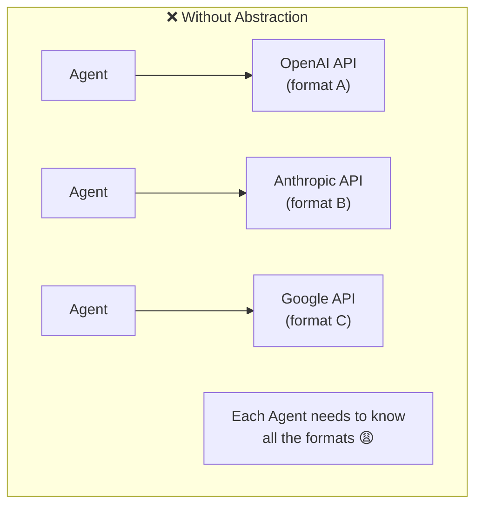

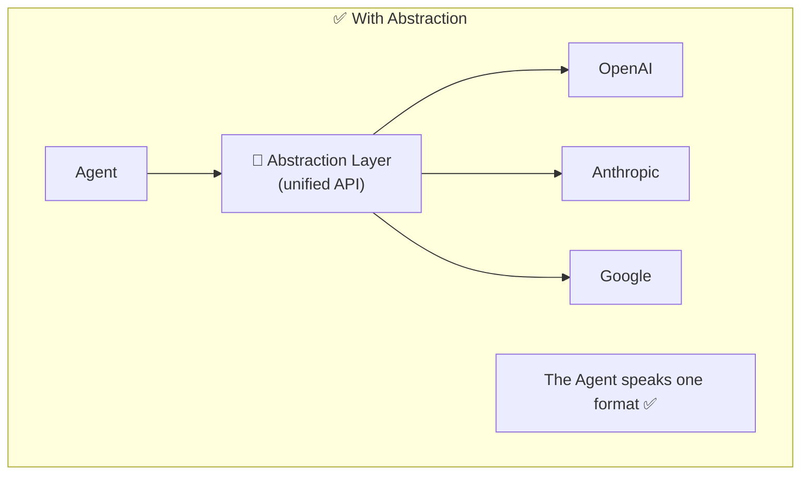

### Concrete Example of the Problem:

| Provider | Request Format | Tool Calling | Streaming |
|----------|---------------|-------------|-----------|
| **OpenAI** | `messages: [{role, content}]` | `tools: [{function}]` | SSE events |
| **Anthropic** | `messages: [{role, content}]` | `tools: [{name, input_schema}]` | SSE (different format) |
| **Google** | `contents: [{parts}]` | `function_declarations` | Server-sent events |

The Agent doesn't need to know all these differences. The abstraction layer hides them.

---

## Model Abstraction Layer

### What Is It?
A layer that provides a **Unified Interface** for all LLMs. Regardless of which model is behind it, the Agent sends in one format.

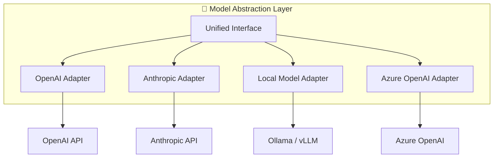

### Adapter Pattern (Design Pattern)

The Abstraction Layer uses the **Adapter** pattern — each LLM provider has a different API format, but the Adapter translates between your unified interface and the provider's specific format. This means your agent code doesn't change when you switch from OpenAI to Anthropic. Only the Adapter changes.

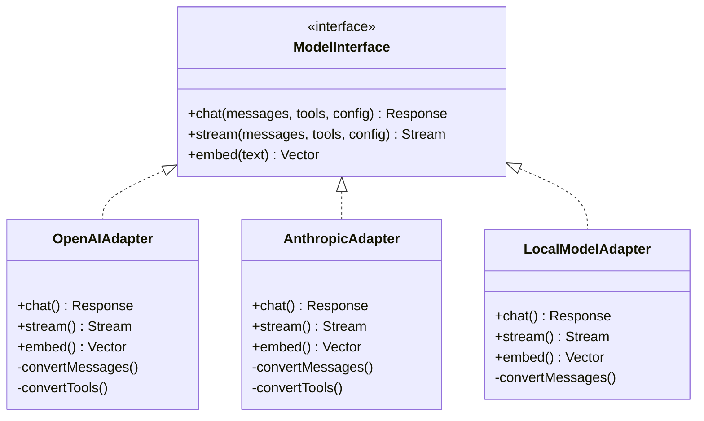

### What Does the Adapter Do:
1. **Input Translation** - Converts the unified format to the provider's format
2. **Output Normalization** - Converts the response back to the unified format
3. **Error Handling** - Handles provider-specific errors
4. **Feature Detection** - Knows which capabilities the model supports (function calling, vision, etc.)

---

## Multi-Model Routing

### What Is It?
**Model Router** is the component that decides **which model** to send each request to. Not every task needs the strongest (and most expensive) model.

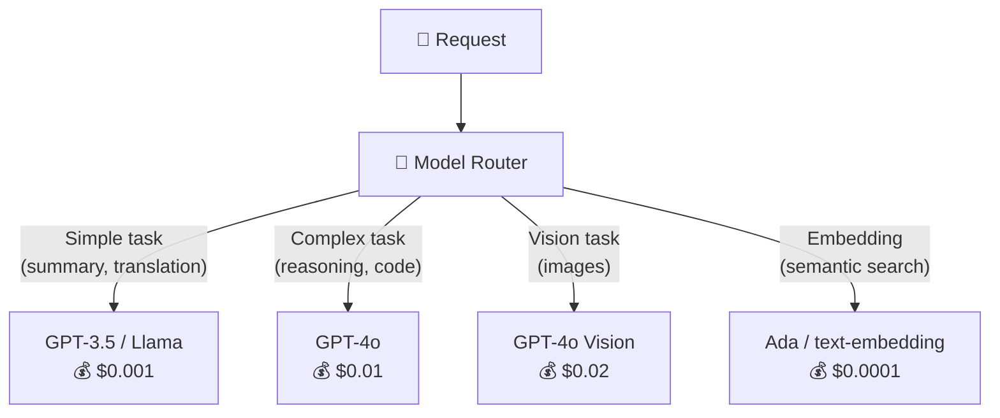

### Why Not Just Always Use the Best Model?

| Model | Quality | Speed | Cost per 1M tokens |
|-------|---------|-------|---------------------|
| **GPT-4o** | ⭐⭐⭐⭐⭐ | 🐌 | $5.00 |
| **GPT-4o-mini** | ⭐⭐⭐⭐ | ⚡ | $0.15 |
| **GPT-3.5** | ⭐⭐⭐ | ⚡⚡ | $0.50 |
| **Llama 3 (self-hosted)** | ⭐⭐⭐ | ⚡ | $0.00 (infra costs) |

> **Conclusion:** If 80% of requests are simple, you can save a lot of money with smart routing!

---

## Routing Strategies

### 1. Content-Based Routing (By Content)

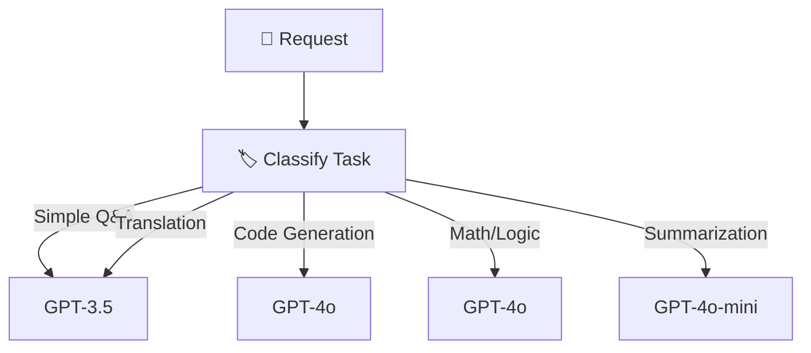

**How to classify?**
- A small classifier (small LLM or regex)
- Based on the tools the Agent uses
- Based on keywords in the prompt

| Pros | Cons |
|------|------|
| ✅ Significant savings | ❌ Classification itself takes time |
| ✅ Each task gets the right model | ❌ Wrong classification = bad answer |

### 2. Cost-Based Routing (By Cost)

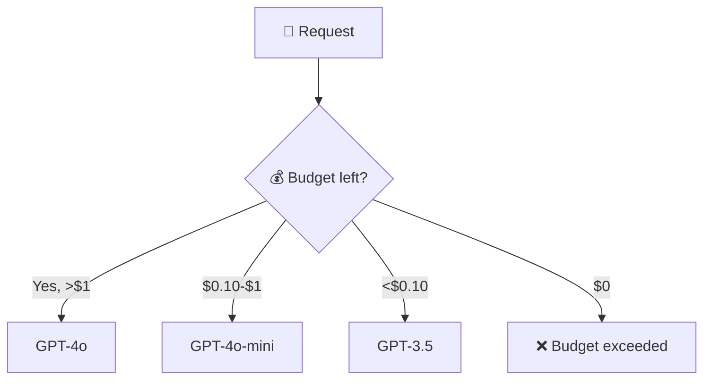

| Pros | Cons |
|------|------|
| ✅ Full control over costs | ❌ Quality may decrease |
| ✅ Budget enforcement per-agent | ❌ The amount doesn't always represent the need |

### 3. Latency-Based Routing (By Speed)

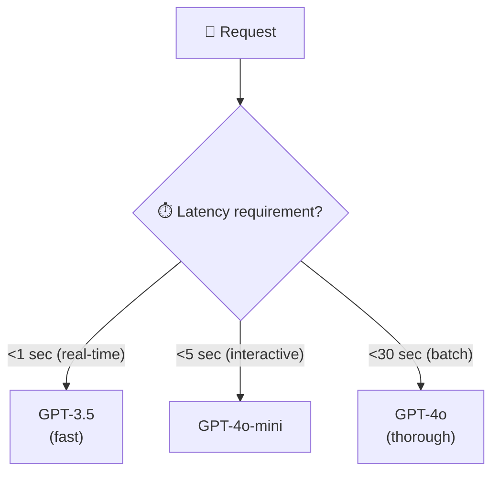

### 4. Capability-Based Routing (By Capabilities)

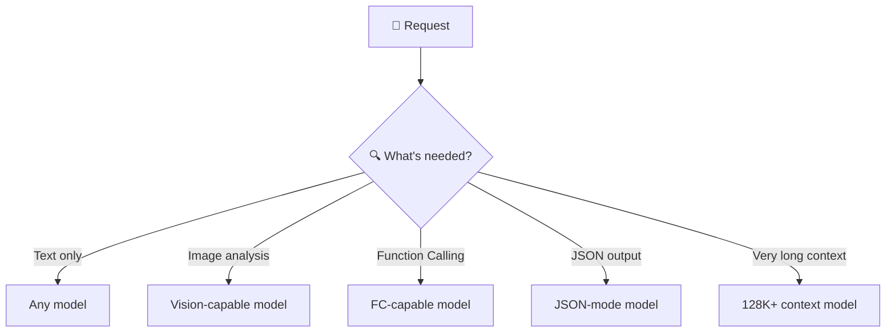

### 5. Hybrid Routing (Combination)

In practice, multiple strategies are combined:

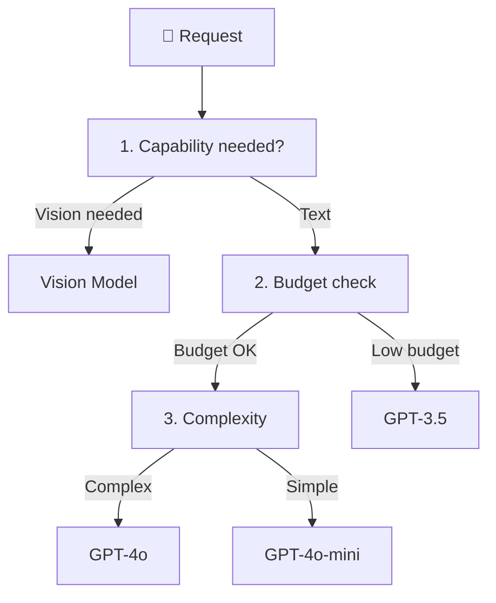

---

## Fallback & Retry

In production, LLM APIs go down. Rate limits are hit. Network timeouts happen. If your agent crashes every time the primary model is unavailable, your users will have a terrible experience. Fallback and retry strategies ensure the agent keeps working even when things go wrong — by automatically trying alternative models or waiting and retrying.

### What Happens When a Model Is Unavailable?

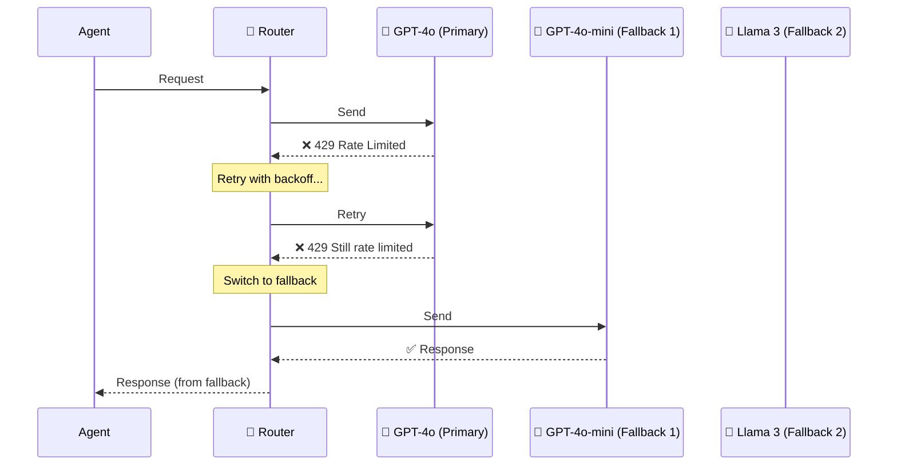

### Retry Strategies

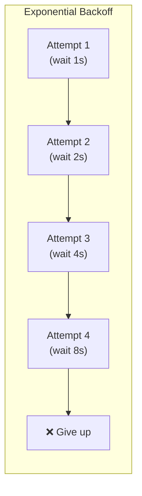

| Retry Strategy | Explanation | When to Use |
|----------------|-------------|-------------|
| **Fixed delay** | Waits X seconds between attempts | Short temporary errors |
| **Exponential backoff** | Doubles the wait time | Rate limiting (429) |
| **Jitter** | Adds randomness to the wait time | When many clients are retrying |
| **Circuit breaker** | Stops trying entirely | When the service is completely down |

### Fallback Chain

```
Primary: GPT-4o (Azure East US)
    ↓ (if fails)
Fallback 1: GPT-4o (Azure West Europe)
    ↓ (if fails)
Fallback 2: GPT-4o-mini (Azure East US)
    ↓ (if fails)
Fallback 3: Local Llama 3
    ↓ (if fails)
Error: "Service temporarily unavailable"
```

---

## Load Balancing Between Models

Azure OpenAI has rate limits per deployment (e.g., 100K tokens per minute). If you have one deployment and your traffic exceeds the limit, all requests fail. The solution: create multiple deployments of the same model and distribute traffic between them. This is load balancing — a critical pattern for any production agent platform.

When there are many deployments of the same model, the load needs to be **distributed**:

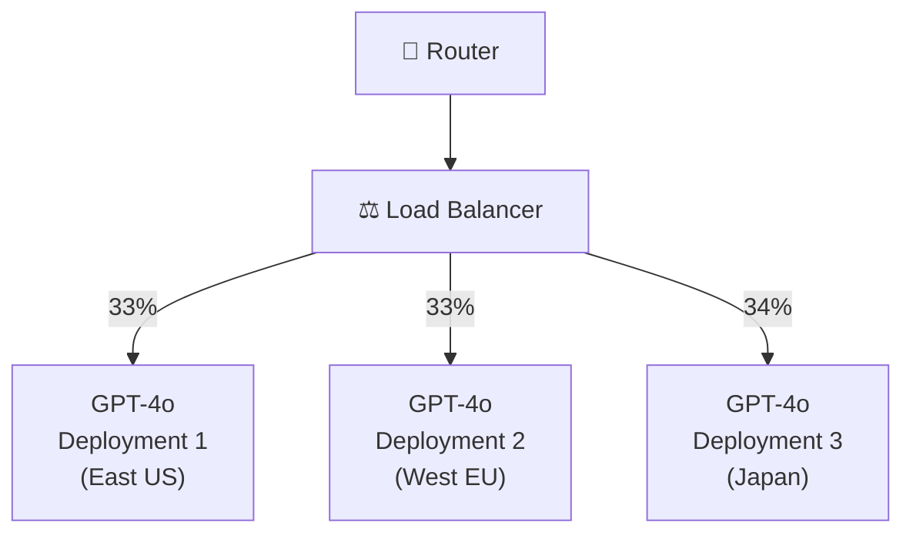

### Load Balancing Algorithms:

| Algorithm | Explanation | Pros | Cons |
|-----------|-------------|------|------|
| **Round Robin** | Distributes by turn | Simple | Doesn't account for load |
| **Least Connections** | Sends to the one with the fewest open requests | Accounts for load | Requires tracking |
| **Weighted** | By weights (stronger deployment = more requests) | Flexible | Requires calibration |
| **Latency-based** | Sends to the one with the lowest latency | Speed | Requires monitoring |
| **Token-aware** | Accounts for RPM/TPM limits of each deployment | Utilizes TPM limits well | Complex |

---

## Response Caching

Every LLM call costs money and takes time. But many users ask similar questions — "What's the refund policy?" shows up 50 times a day. Without caching, you pay for 50 identical LLM calls. With caching, you pay for 1 call and serve the cached response for the other 49. This can reduce costs by 30-50% for platforms with repetitive queries.

### Why Caching?
If the same question keeps coming up, why pay again for an LLM call?

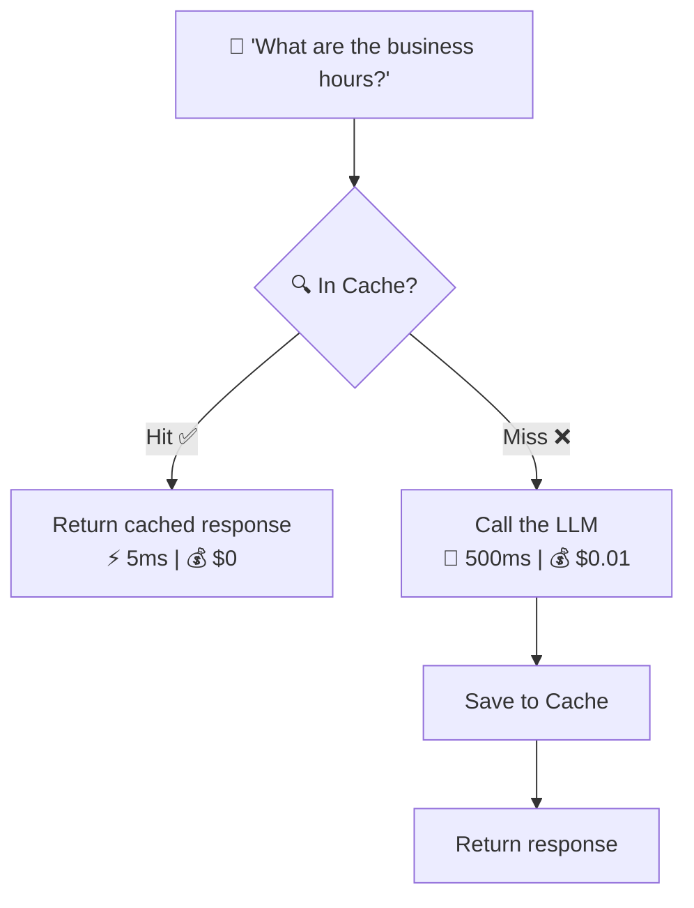

### Cache Types:

| Type | Explanation | Hit Rate | Complexity |
|------|-------------|----------|------------|
| **Exact Match** | Exactly the same question | Low | Simple |
| **Semantic Cache** | Similar questions (embedding similarity) | High | Complex |
| **Prompt Cache** | Cache of system prompt (prefix) | High | Medium |

### Semantic Cache - Example:

```
Query 1: "What are your business hours?"
Query 2: "When are you open?"
Query 3: "What time do you close?"

→ All are semantically similar → Same response from Cache!
```

### When **Not** to Cache:
- ❌ Questions that require up-to-date data ("What's the weather?")
- ❌ Personal questions ("What are my purchases?")
- ❌ Agent that requires tool execution
- ❌ Responses that depend on random context

---

## Model Comparison

Understanding the strengths, weaknesses, and costs of different models is essential for building a routing strategy. Not every model is best at everything — GPT-4.1 excels at reasoning but costs 13x more than GPT-4o-mini. Claude has enormous context windows but different tool-calling behavior. The table below helps you match models to tasks.

### The Quality-Cost-Speed Axis:

```mermaid
quadrantChart
    title Model Comparison: Quality vs Cost
    x-axis Low Cost --> High Cost
    y-axis Low Quality --> High Quality
    quadrant-1 Best (but expensive)
    quadrant-2 Ideal
    quadrant-3 Budget
    quadrant-4 Avoid
    GPT-4o: [0.8, 0.9]
    GPT-4o-mini: [0.3, 0.75]
    GPT-3.5: [0.15, 0.5]
    Llama-3-70B: [0.4, 0.7]
    Llama-3-8B: [0.1, 0.4]
    Claude-Opus: [0.9, 0.95]
    Claude-Sonnet: [0.5, 0.85]
```

### Detailed Comparison Table:

| Criterion | When to Choose a Large Model | When to Choose a Small Model |
|-----------|------------------------------|------------------------------|
| **Complex reasoning** | ✅ | ❌ |
| **Simple Q&A** | Overkill | ✅ |
| **Code generation** | ✅ | ⚠️ |
| **Summarization** | Overkill | ✅ |
| **Translation** | Overkill | ✅ |
| **Math / Logic** | ✅ | ❌ |
| **High volume** | 💸 Expensive | ✅ |
| **Low latency** | 🐌 Slower | ✅ |

---

## Advantages and Disadvantages

### ✅ Advantages of Model Abstraction + Routing

| Advantage | Explanation |
|-----------|-------------|
| **Vendor Independence** | Not locked into a single provider |
| **Cost Optimization** | Each task goes to the appropriate model (not the most expensive one) |
| **Resilience** | If one model goes down, there's a Fallback |
| **Flexibility** | Easy to add/replace models |
| **A/B Testing** | Easy to test new models on production traffic |

### ❌ Challenges

| Challenge | Solution |
|-----------|----------|
| Complex routing logic | Start with simple rules, add complexity gradually |
| Additional latency (classification) | Cache classification results |
| Inconsistency between models | Evaluation Engine (Chapter 10) |
| Semantic Cache accuracy | Tuning the similarity threshold |

---

## Industry Landscape: Model Routing in Production

Model routing isn't just a theoretical exercise — it's a critical pattern in production AI systems.

### How Companies Route Models

| Approach | Who Uses It | How It Works |
|----------|------------|-------------|
| **LLM-based classifier** | Most startups | Cheap model classifies complexity → routes to right model |
| **Azure API Management + policies** | Enterprise Azure | APIM policies route by URL, headers, or custom logic |
| **Azure AI Foundry model catalog** | Azure users | Multiple models deployed, selected per request |
| **Martian Model Router** | Production systems | Third-party routing service with automatic model selection |
| **OpenRouter** | Multi-provider teams | API that routes across OpenAI, Anthropic, Google, etc. |
| **Portkey AI Gateway** | Production teams | Gateway with automatic fallback, load balancing, cost tracking |

### Model Providers & Pricing (2025-2026)

| Provider | Cheap Model | Cost | Expensive Model | Cost | Ratio |
|----------|------------|------|----------------|------|-------|
| **Azure OpenAI** | GPT-4o-mini | ~$0.15/1M in | GPT-4.1 | ~$2.00/1M in | 13x |
| **OpenAI** | GPT-4o-mini | ~$0.15/1M in | GPT-4.1 | ~$2.00/1M in | 13x |
| **Anthropic** | Claude 3.5 Haiku | ~$0.80/1M in | Claude 4 Opus | ~$15/1M in | 19x |
| **Google** | Gemini 2.0 Flash | ~$0.10/1M in | Gemini 2.5 Pro | ~$1.25/1M in | 12x |

### Production Routing Patterns

| Pattern | Description | When to Use |
|---------|------------|------------|
| **Complexity routing** | Simple→cheap, complex→expensive | General-purpose |
| **Fallback routing** | Try cheap first, escalate if quality is low | When quality is measurable |
| **Latency routing** | Fast model for real-time, slow for batch | Mixed latency requirements |
| **Cost budget routing** | Route to cheapest that fits remaining budget | Hard cost limits per user/tenant |
| **A/B routing** | Split traffic to compare models | Model evaluation in production |

### Open Source vs Azure

| Layer | Open Source (LangGraph) | Azure Production |
|-------|----------------------|------------------|
| **Classifier** | LLM-based prompt | Same (or Azure Content Safety classifier) |
| **Routing logic** | LangGraph conditional edges | Azure APIM policies or custom middleware |
| **Model deployment** | Any provider | Azure OpenAI multi-deployment |
| **Cost tracking** | Manual tracking | Azure Monitor + Cost Management |

---

## Summary

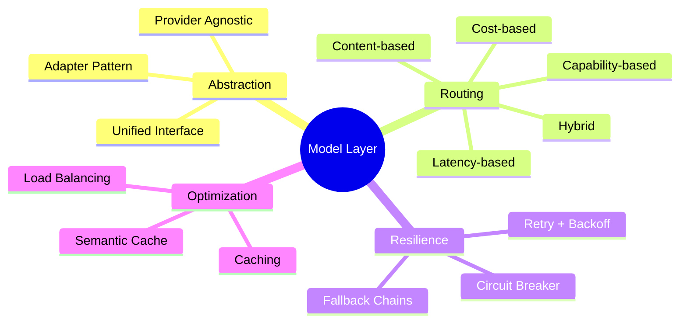

| What We Learned | Key Point |
|-----------------|-----------|
| **Abstraction Layer** | Unified Interface for all LLMs - Adapter Pattern |
| **Model Router** | Decides which model to send each request to |
| **Routing Strategies** | Content, Cost, Latency, Capability, Hybrid |
| **Fallback** | Chain of alternative models in case of failure |
| **Load Balancing** | Distributing load across deployments (Round Robin, Least Connections) |
| **Caching** | Exact Match / Semantic Cache for cost savings |

---

## ❓ Self-Check Questions

1. Why do we need an abstraction layer above the LLMs?
2. What is the Adapter Pattern and how does it help here?
3. Describe 3 different Routing strategies and how they work.
4. What is the difference between Fallback and Retry?
5. What is Exponential Backoff with Jitter and why is it important?
6. What is the difference between Exact Match Cache and Semantic Cache?
7. When should you **not** use Cache?
8. Which model would you choose for each task: report summary, solving a code problem, translation, casual conversation?

---

### 📝 Answers

<details>
<summary>1. Why do we need an abstraction layer above the LLMs?</summary>

Without abstraction, the code is tightly coupled to a single provider (OpenAI/Anthropic). The abstraction layer enables: (1) **Switching providers** without changing code, (2) **Smart routing** between models, (3) **Automatic fallback** if a provider is unavailable, (4) **Unified interface** for all models.
</details>

<details>
<summary>2. What is the Adapter Pattern and how does it help here?</summary>

**Adapter Pattern** = A Design Pattern that translates one interface to another. Here: each LLM provider has a different API, so an **Adapter** is created for each provider (OpenAIAdapter, AnthropicAdapter) that converts the request to that provider's format. The application talks to one unified interface → the Adapter translates.
</details>

<details>
<summary>3. Describe 3 different Routing strategies.</summary>

1. **Content-Based** - By task type: code → Claude, conversation → GPT-4o-mini.
2. **Cost-Based** - Tries the cheap model first, and if it fails → expensive model.
3. **Latency-Based** - Chooses the model with the lowest response time at the moment.
</details>

<details>
<summary>4. What is the difference between Fallback and Retry?</summary>

**Retry** = Trying again with the **same** provider/model (maybe there was a temporary issue). **Fallback** = Switching to a **different provider/model** (because the primary provider is unavailable or retry failed). Retry → same model again. Fallback → different model.
</details>

<details>
<summary>5. What is Exponential Backoff with Jitter and why is it important?</summary>

**Exponential Backoff** = The wait between retries grows: 1s → 2s → 4s → 8s. Prevents flooding a provider that is already overloaded. **Jitter** = Adding small randomness to the wait time. Prevents a situation where many clients retry at exactly the same moment ("thundering herd").
</details>

<details>
<summary>6. What is the difference between Exact Match Cache and Semantic Cache?</summary>

**Exact Match** = Cache hit only if the prompt is **exactly identical** (character by character). Many misses. **Semantic Cache** = Cache hit if the prompt is **semantically similar** (embedding similarity > threshold). "What are Q3 sales?" ≈ "Q3 sales numbers?" → cache hit. More hits, but requires embedding computation.
</details>

<details>
<summary>7. When should you not use Cache?</summary>

- When the response needs to be **up-to-date** (real-time data).
- When **temperature > 0** and you want diverse responses.
- When there is **PII** in the response (security risk).
- When the input is **very unique** (low cache hit rate).
</details>

<details>
<summary>8. Which model would you choose for each task?</summary>

- **Report summary** → GPT-4o-mini (simple, cheap, fast).
- **Solving a code problem** → Claude 3.5 Sonnet / GPT-4o (requires strong reasoning).
- **Translation** → GPT-4o-mini (standard task, cost-effective).
- **Casual conversation** → GPT-4o-mini (doesn't need a strong model, important to be fast and cheap).
</details>

---

**[⬅️ Back to Chapter 1: Fundamentals](01-fundamentals.md)** | **[➡️ Continue to Chapter 3: Memory Management & RAG →](03-memory-management.md)**
