# 💾 Chapter 3: Memory Management & RAG

## Table of Contents
- [Why Does an Agent Need Memory?](#why-does-an-agent-need-memory)
- [Types of Memory](#types-of-memory)
- [Short-Term Memory](#short-term-memory)
- [Long-Term Memory](#long-term-memory)
- [RAG - Retrieval Augmented Generation](#rag---retrieval-augmented-generation)
- [Vector Databases & Embeddings](#vector-databases--embeddings)
- [Memory Strategies](#memory-strategies)
- [Advantages and Disadvantages](#advantages-and-disadvantages)
- [Industry Landscape: RAG & Memory in Production](#industry-landscape-rag--memory-in-production)
- [Summary and Questions](#summary-and-questions)

---

## Why Does an Agent Need Memory?

An LLM by itself is **Stateless** - it doesn't remember anything between calls. Every request starts from a blank slate.

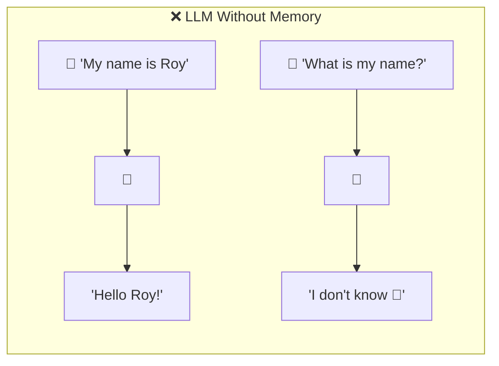
```mermaid
graph LR
    subgraph "❌ LLM Without Memory"
        U1["👤 'My name is Roy'"] --> LLM1["🧠"] --> A1["'Hello Roy!'"]
        U2["👤 'What is my name?'"] --> LLM2["🧠"] --> A2["'I don't know 🤷'"]
    end
```

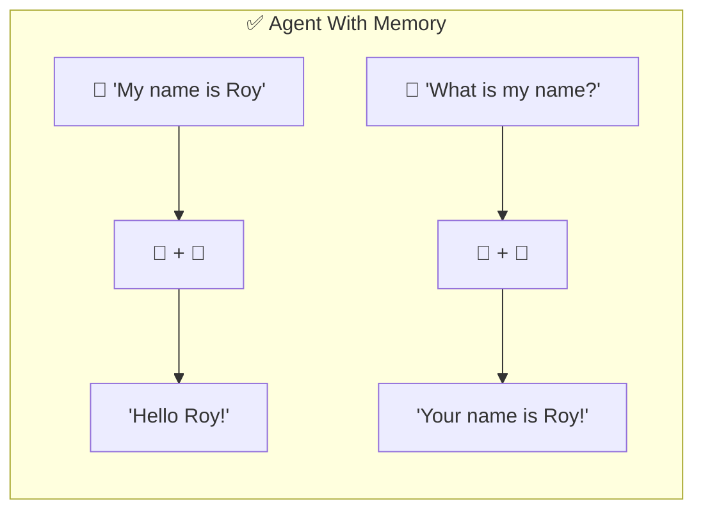
```mermaid
graph LR
    subgraph "✅ Agent With Memory"
        U3["👤 'My name is Roy'"] --> Agent1["🤖 + 💾"] --> A3["'Hello Roy!'"]
        U4["👤 'What is my name?'"] --> Agent2["🤖 + 💾"] --> A4["'Your name is Roy!'"]
    end
```

### Problems That Memory Solves:

| Problem | Solution |
|---------|----------|
| LLM doesn't remember previous conversations | Short-term memory (conversation history) |
| LLM doesn't know the company's information | Long-term memory (RAG) |
| Limited context window | Smart filtering and compression of memory |
| Hallucination (making up information) | Grounding in real information through RAG |

---

## Types of Memory

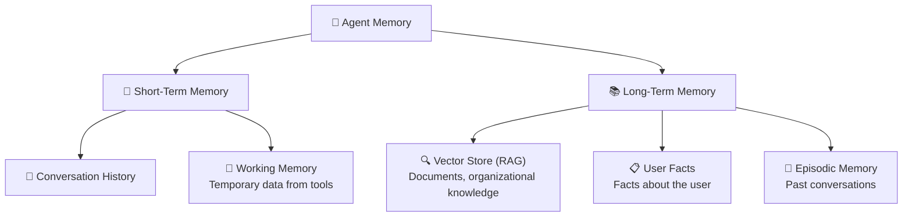
```mermaid
graph TB
    Memory["💾 Agent Memory"]
    
    Memory --> STM["🔄 Short-Term Memory"]
    Memory --> LTM["📚 Long-Term Memory"]
    
    STM --> Conv["💬 Conversation History"]
    STM --> Working["🧮 Working Memory<br/>Temporary data from tools"]
    
    LTM --> Vector["🔍 Vector Store (RAG)<br/>Documents, organizational knowledge"]
    LTM --> Facts["📋 User Facts<br/>Facts about the user"]
    LTM --> Episodes["📖 Episodic Memory<br/>Past conversations"]
```

### Comparison:

| Feature | 🔄 Short-Term | 📚 Long-Term |
|---------|--------------|-------------|
| **What is stored** | Messages in the current conversation | Knowledge, documents, facts |
| **Lifespan** | Single conversation/session | Permanent |
| **Size** | Limited (context window) | Virtually unlimited |
| **Access** | Direct (everything in the prompt) | Search (search/retrieval) |
| **Where stored** | Cache / In-memory | Vector DB / Database |
| **Example** | "What did you say 2 messages ago" | "What does the company policy say" |

---

## Short-Term Memory

### What Is It?
The current conversation - all messages exchanged between the user and the Agent in the current Thread.

### The Problem: Limited Context Window

An LLM has a limited **Context Window**. You can't send it the entire conversation:

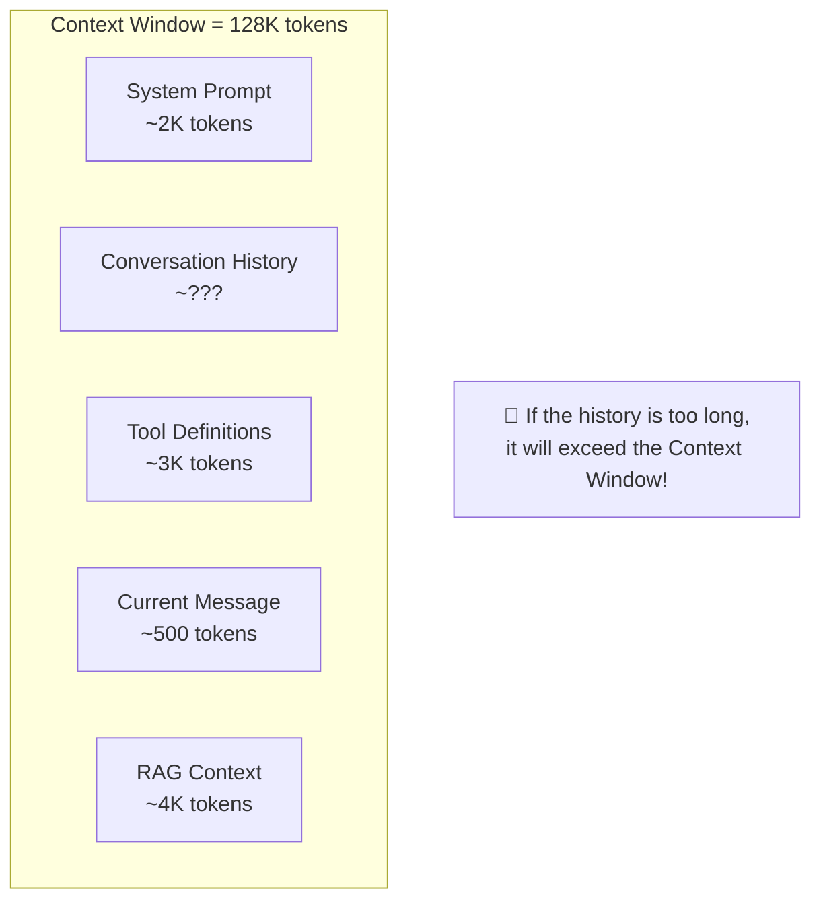
```mermaid
graph TB
    subgraph "Context Window = 128K tokens"
        System["System Prompt<br/>~2K tokens"]
        History["Conversation History<br/>~???"]
        Tools["Tool Definitions<br/>~3K tokens"]
        UserMsg["Current Message<br/>~500 tokens"]
        RAG["RAG Context<br/>~4K tokens"]
    end
    
    Note["🚨 If the history is too long,<br/>it will exceed the Context Window!"]
```

### Strategies for Managing Short-Term Memory:

#### 1. Sliding Window

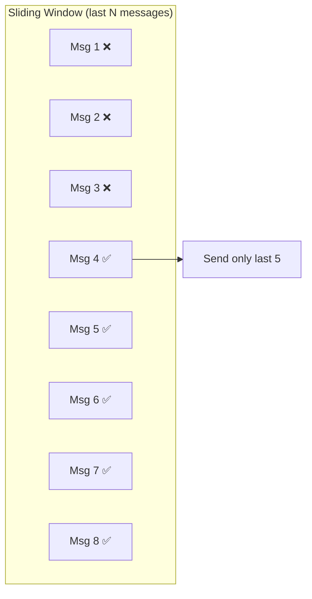
```mermaid
graph LR
    subgraph "Sliding Window (last N messages)"
        M1["Msg 1 ❌"]
        M2["Msg 2 ❌"]
        M3["Msg 3 ❌"]
        M4["Msg 4 ✅"]
        M5["Msg 5 ✅"]
        M6["Msg 6 ✅"]
        M7["Msg 7 ✅"]
        M8["Msg 8 ✅"]
    end
    
    M4 --> Send["Send only last 5"]
```

| Pros | Cons |
|------|------|
| ✅ Very simple | ❌ Lose old context |
| ✅ Predictable size | ❌ Agent "forgets" what was said at the beginning |

#### 2. Token-Based Truncation

```
Total budget: 50K tokens
- System prompt: 2K
- Tools: 3K  
- RAG context: 5K
- Current message: 500
- Available for history: 39,500 tokens

→ As many old messages as fit in 39,500 tokens
```

#### 3. Summarization

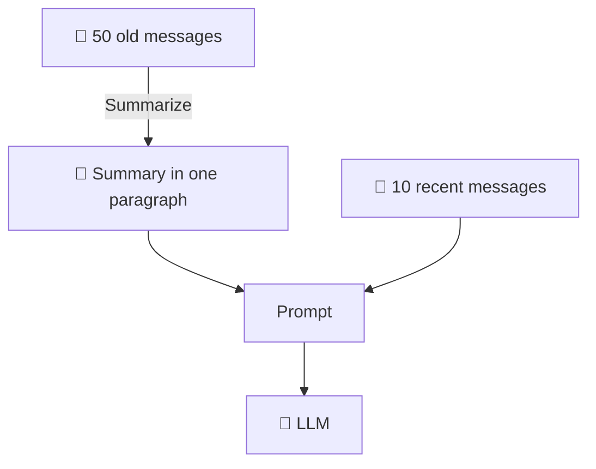
```mermaid
graph TD
    Old["📜 50 old messages"] -->|"Summarize"| Summary["📝 Summary in one paragraph"]
    Summary --> Prompt["Prompt"]
    Recent["💬 10 recent messages"] --> Prompt
    Prompt --> LLM["🧠 LLM"]
```

| Pros | Cons |
|------|------|
| ✅ Preserves context | ❌ The summary itself costs tokens |
| ✅ Doesn't lose critical information | ❌ Summary may miss details |

#### 4. Hybrid (Combination)

```
Memory Strategy:
├── Last 10 messages → Full (as-is)
├── Messages 11-50 → Summarized
└── Messages 50+ → Dropped (but saved in long-term)
```

---

## Long-Term Memory

### What Is It?
Memory that persists **beyond the current conversation**. It allows the Agent to know things that weren't said right now.

### Types of Long-Term Memory:

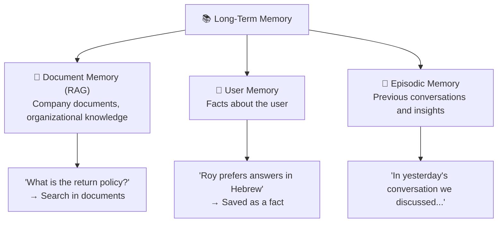
```mermaid
graph TB
    LTM["📚 Long-Term Memory"]
    
    LTM --> RAG_LTM["📄 Document Memory (RAG)<br/>Company documents, organizational knowledge"]
    LTM --> User_LTM["👤 User Memory<br/>Facts about the user"]
    LTM --> Episodic["📖 Episodic Memory<br/>Previous conversations and insights"]
    
    RAG_LTM --> Ex1["'What is the return policy?'<br/>→ Search in documents"]
    User_LTM --> Ex2["'Roy prefers answers in Hebrew'<br/>→ Saved as a fact"]
    Episodic --> Ex3["'In yesterday's conversation we discussed...'"]
```

---

## RAG - Retrieval Augmented Generation

### What Is RAG?
RAG = **Retrieval + Generation**. Instead of relying on the LLM's knowledge (which may not be accurate), we **search for relevant information** and **inject** it into the prompt.

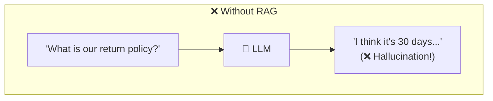
```mermaid
graph TB
    subgraph "❌ Without RAG"
        Q1["'What is our return policy?'"] --> LLM1["🧠 LLM"]
        LLM1 --> A1["'I think it's 30 days...'<br/>(❌ Hallucination!)"]
    end
```

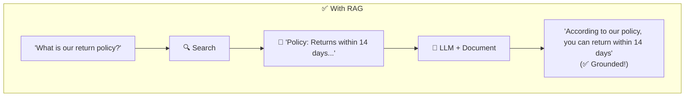
```mermaid
graph TB
    subgraph "✅ With RAG"
        Q2["'What is our return policy?'"] --> Search["🔍 Search"]
        Search --> Docs["📄 'Policy: Returns within 14 days...'"]
        Docs --> LLM2["🧠 LLM + Document"]
        LLM2 --> A2["'According to our policy, you can return within 14 days'<br/>(✅ Grounded!)"]
    end
```

### The Complete RAG Flow:

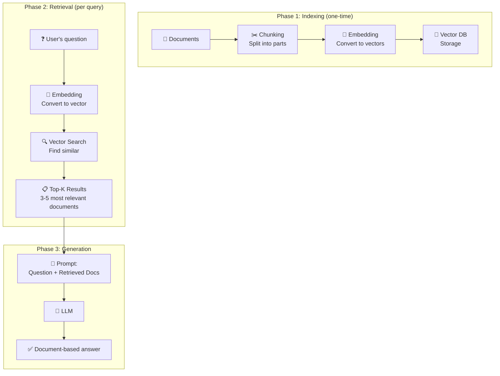
```mermaid
graph TB
    subgraph "Phase 1: Indexing (one-time)"
        Docs["📄 Documents"] --> Chunk["✂️ Chunking<br/>Split into parts"]
        Chunk --> Embed1["🔢 Embedding<br/>Convert to vectors"]
        Embed1 --> Store["💾 Vector DB<br/>Storage"]
    end
    
    subgraph "Phase 2: Retrieval (per query)"
        Query["❓ User's question"] --> Embed2["🔢 Embedding<br/>Convert to vector"]
        Embed2 --> Search["🔍 Vector Search<br/>Find similar"]
        Search --> TopK["📋 Top-K Results<br/>3-5 most relevant documents"]
    end
    
    subgraph "Phase 3: Generation"
        TopK --> Prompt["📝 Prompt:<br/>Question + Retrieved Docs"]
        Prompt --> LLM["🧠 LLM"]
        LLM --> Answer["✅ Document-based answer"]
    end
```

### Step 1: Chunking (Splitting Documents)

A long document needs to be split into small parts. Why? Because the embedding represents the **meaning** of the text, and a small, focused part represents it better than a whole document.

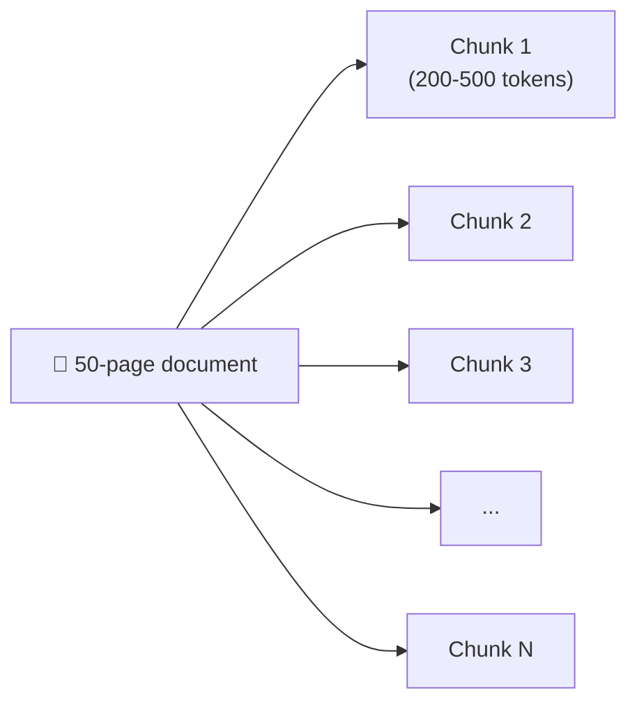
```mermaid
graph LR
    Doc["📄 50-page document"] --> C1["Chunk 1<br/>(200-500 tokens)"]
    Doc --> C2["Chunk 2"]
    Doc --> C3["Chunk 3"]
    Doc --> C4["..."]
    Doc --> CN["Chunk N"]
```

**Chunking Strategies:**

| Method | Explanation | Pros | Cons |
|--------|-------------|------|------|
| **Fixed size** | Every X tokens | Simple | May cut in the middle of a sentence |
| **Sentence-based** | By sentences | Preserves context | Uneven chunk sizes |
| **Paragraph-based** | By paragraphs | Good context | Paragraphs can be long |
| **Semantic** | By topic (using LLM) | Excellent context | Expensive and slow |
| **Overlap** | Overlap between chunks | Reduces information loss | More chunks = more storage |

**Overlap - Why It Matters:**

```
Chunk 1: "The company's return policy allows returns"
Chunk 2: "allows returns within 14 days of purchase"
         ^^^^^^^^^^^^^^^^
         Overlap - ensures information isn't cut off
```

### Step 2: Embeddings (Vector Embedding)

#### What Is an Embedding?
Converting text into a **vector** (a list of numbers) that represents the **meaning** of the text.

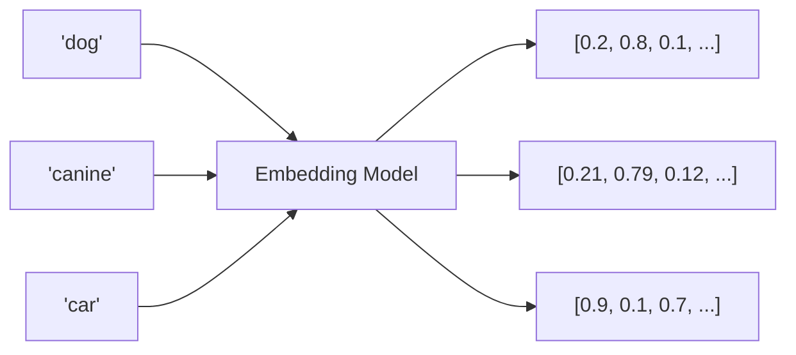
```mermaid
graph LR
    T1["'dog'"] --> E["Embedding Model"] --> V1["[0.2, 0.8, 0.1, ...]"]
    T2["'canine'"] --> E --> V2["[0.21, 0.79, 0.12, ...]"]
    T3["'car'"] --> E --> V3["[0.9, 0.1, 0.7, ...]"]
```

**The point:** "dog" and "canine" will be **close** in the vector space because they mean the same thing. "car" will be **far** because the meaning is different.

#### Similarity Search

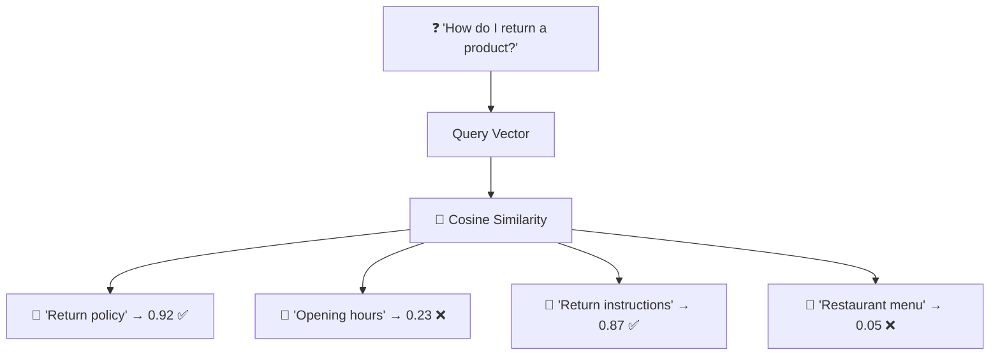
```mermaid
graph TB
    Query["❓ 'How do I return a product?'"] --> QVec["Query Vector"]
    
    QVec --> Sim["📐 Cosine Similarity"]
    
    Sim --> D1["📄 'Return policy' → 0.92 ✅"]
    Sim --> D2["📄 'Opening hours' → 0.23 ❌"]
    Sim --> D3["📄 'Return instructions' → 0.87 ✅"]
    Sim --> D4["📄 'Restaurant menu' → 0.05 ❌"]
```

**Cosine Similarity:** A measure that calculates how much two vectors "point in the same direction":
- **1.0** = Completely identical
- **0.0** = Unrelated
- **-1.0** = Opposite

### Step 3: Vector Database

A Vector Database is a database optimized for storing and searching **vectors**:

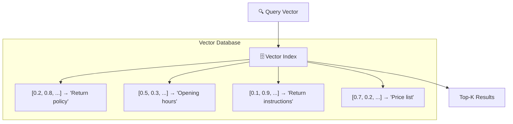
```mermaid
graph TB
    subgraph "Vector Database"
        Index["🗄️ Vector Index"]
        
        Index --> V1["[0.2, 0.8, ...] → 'Return policy'"]
        Index --> V2["[0.5, 0.3, ...] → 'Opening hours'"]
        Index --> V3["[0.1, 0.9, ...] → 'Return instructions'"]
        Index --> V4["[0.7, 0.2, ...] → 'Price list'"]
    end
    
    Query["🔍 Query Vector"] --> Index
    Index --> Results["Top-K Results"]
```

**Vector Database Comparison:**

| DB | Type | Pros | Cons |
|----|------|------|------|
| **Azure AI Search** | Managed Service | Hybrid search, enterprise-ready | Cloud-only, cost |
| **Pinecone** | Managed Service | Simple, serverless | Vendor lock-in |
| **Weaviate** | Open Source | Flexible, self-hosted | Requires management |
| **Qdrant** | Open Source | High performance | Fewer integrations |
| **ChromaDB** | Open Source | Easy to get started | Not production-grade |
| **pgvector** | Extension | PostgreSQL integration | Medium performance |

### Hybrid Search

A combination of **semantic** search (Vector) with **keyword** search (BM25/Full-text):

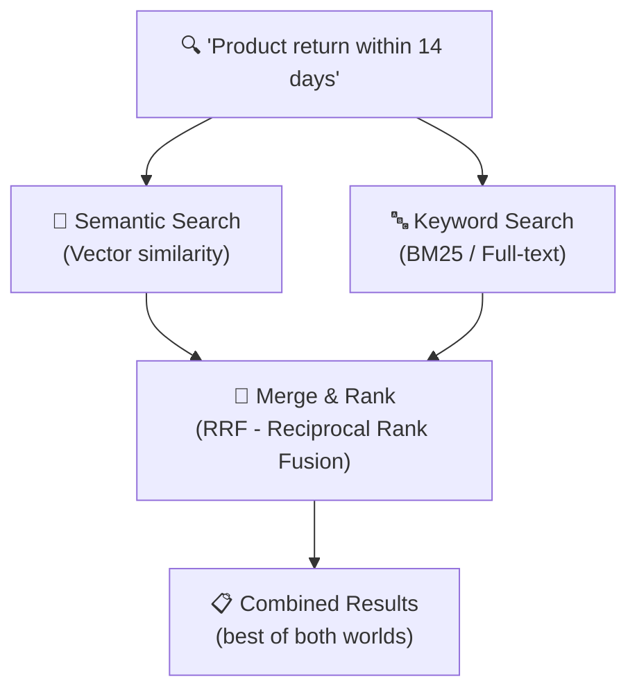
```mermaid
graph TB
    Query["🔍 'Product return within 14 days'"] --> Sem["📐 Semantic Search<br/>(Vector similarity)"]
    Query --> KW["🔤 Keyword Search<br/>(BM25 / Full-text)"]
    
    Sem --> Merge["🔀 Merge & Rank<br/>(RRF - Reciprocal Rank Fusion)"]
    KW --> Merge
    
    Merge --> Results["📋 Combined Results<br/>(best of both worlds)"]
```

| Search | Pros | Cons |
|--------|------|------|
| **Semantic** | Understands meaning, handles different phrasings | May miss specific words |
| **Keyword** | Precise for specific words | Doesn't understand different phrasings of the same question |
| **Hybrid** | Best of both worlds | Higher complexity |

---

## Memory Strategies

### 1. Memory Scoping (Who Sees What)

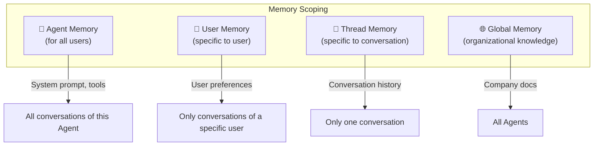
```mermaid
graph TB
    subgraph "Memory Scoping"
        Agent_Mem["🤖 Agent Memory<br/>(for all users)"]
        User_Mem["👤 User Memory<br/>(specific to user)"]
        Thread_Mem["🧵 Thread Memory<br/>(specific to conversation)"]
        Global_Mem["🌐 Global Memory<br/>(organizational knowledge)"]
    end
    
    Agent_Mem -->|"System prompt, tools"| All["All conversations of this Agent"]
    User_Mem -->|"User preferences"| OneUser["Only conversations of a specific user"]
    Thread_Mem -->|"Conversation history"| OneThread["Only one conversation"]
    Global_Mem -->|"Company docs"| Everyone["All Agents"]
```

### 2. Memory Lifecycle

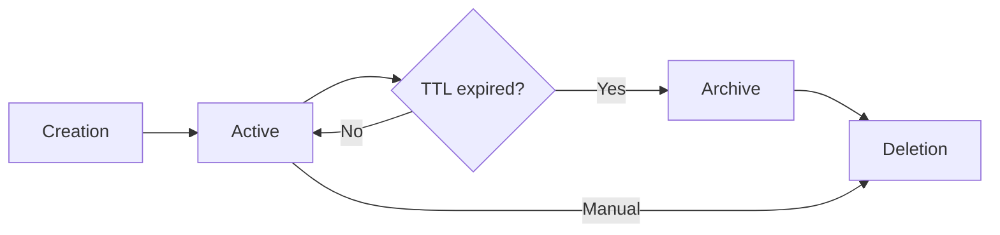
```mermaid
graph LR
    Create["Creation"] --> Active["Active"]
    Active --> TTL{"TTL expired?"}
    TTL -->|"No"| Active
    TTL -->|"Yes"| Archive["Archive"]
    Archive --> Delete["Deletion"]
    
    Active -->|"Manual"| Delete
```

| Parameter | Explanation | Typical Value |
|-----------|-------------|---------------|
| **TTL (Time To Live)** | How long the memory lives | 24 hours - 30 days |
| **Max Size** | Maximum size | 100K tokens |
| **Eviction Policy** | What gets deleted when space runs out | LRU (Least Recently Used) |

### 3. Memory Architecture Pattern

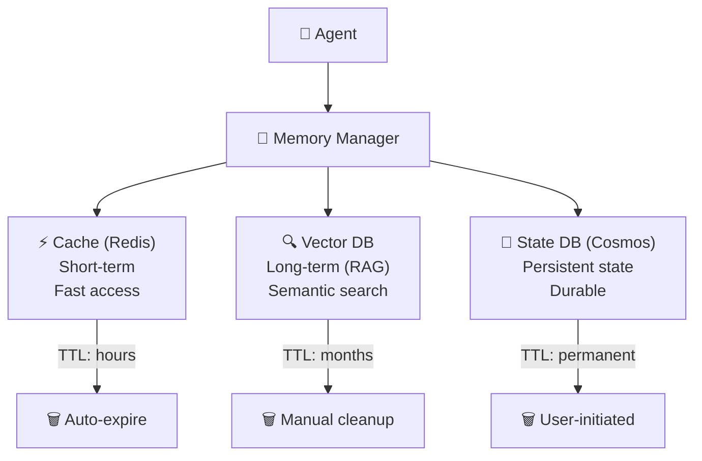
```mermaid
graph TB
    Agent["🤖 Agent"] --> MemMgr["💾 Memory Manager"]
    
    MemMgr --> Cache["⚡ Cache (Redis)<br/>Short-term<br/>Fast access"]
    MemMgr --> VectorDB["🔍 Vector DB<br/>Long-term (RAG)<br/>Semantic search"]
    MemMgr --> StateDB["📌 State DB (Cosmos)<br/>Persistent state<br/>Durable"]
    
    Cache -->|"TTL: hours"| Expire1["🗑️ Auto-expire"]
    VectorDB -->|"TTL: months"| Expire2["🗑️ Manual cleanup"]
    StateDB -->|"TTL: permanent"| Expire3["🗑️ User-initiated"]
```

---

## End-to-End RAG Flow - Full Example

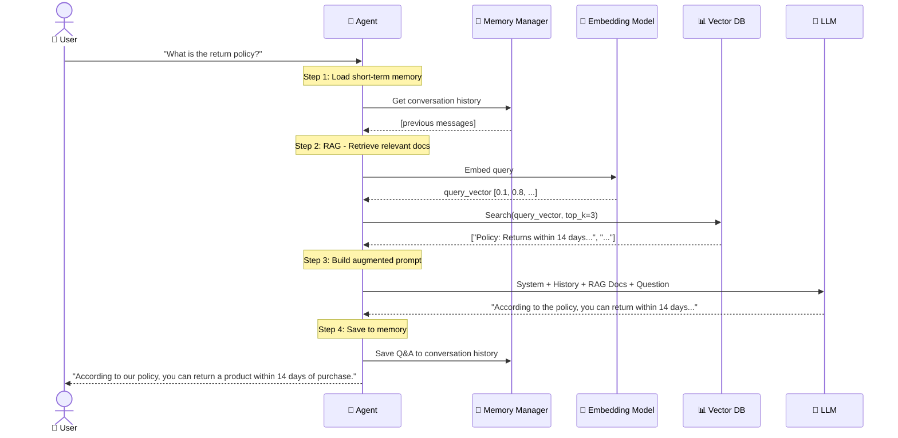
```mermaid
sequenceDiagram
    actor User as 👤 User
    participant Agent as 🤖 Agent
    participant Mem as 💾 Memory Manager
    participant Embed as 🔢 Embedding Model
    participant VDB as 📊 Vector DB
    participant LLM as 🧠 LLM
    
    User->>Agent: "What is the return policy?"
    
    Note over Agent: Step 1: Load short-term memory
    Agent->>Mem: Get conversation history
    Mem-->>Agent: [previous messages]
    
    Note over Agent: Step 2: RAG - Retrieve relevant docs
    Agent->>Embed: Embed query
    Embed-->>Agent: query_vector [0.1, 0.8, ...]
    Agent->>VDB: Search(query_vector, top_k=3)
    VDB-->>Agent: ["Policy: Returns within 14 days...", "..."]
    
    Note over Agent: Step 3: Build augmented prompt
    Agent->>LLM: System + History + RAG Docs + Question
    LLM-->>Agent: "According to the policy, you can return within 14 days..."
    
    Note over Agent: Step 4: Save to memory
    Agent->>Mem: Save Q&A to conversation history
    
    Agent-->>User: "According to our policy, you can return a product within 14 days of purchase."
```

---

## Advantages and Disadvantages

### Short-Term Memory

| ✅ Advantage | ❌ Disadvantage |
|-------------|----------------|
| Preserves conversation context | Limited in size (context window) |
| Provides continuity | Deleted at end of session |
| Fast (in-memory) | Costs tokens |

### Long-Term Memory (RAG)

| ✅ Advantage | ❌ Disadvantage |
|-------------|----------------|
| Grounds LLM in real data | Incorrect retrieval = incorrect answer |
| Reduces Hallucination | Chunking + Indexing cost money |
| Unlimited in size | Additional latency (embedding + search) |
| Can be updated | Quality depends on data quality |

---

## Industry Landscape: RAG & Memory in Production

Before building RAG and memory systems, it's important to understand what the industry uses in production.

### RAG Solutions in Production

| Solution | Type | What It Does | Best For |
|----------|------|-------------|----------|
| **Azure AI Search** | Vector + Keyword DB | Hybrid search (vector + BM25 + semantic reranking) | Enterprise, Azure-native |
| **Pinecone** | Managed Vector DB | Serverless vector search, zero-ops | Startups, fast prototyping |
| **Qdrant** | Open-source Vector DB | Self-hosted, Rust-based, fast | Teams wanting full control |
| **Weaviate** | Open-source Vector DB | GraphQL API, hybrid search, multi-modal | Complex RAG pipelines |
| **ChromaDB** | Open-source Vector DB | Lightweight, Python-native, great for dev | Prototyping, small datasets |
| **Milvus** | Open-source Vector DB | Distributed, handles billions of vectors | Large-scale production |
| **LlamaIndex** | RAG Framework | Data connectors + indexing + query engines | RAG-heavy applications |
| **LangChain Retrievers** | RAG Framework | Pluggable retrievers for any vector DB | LangGraph-based agents |

### Memory Solutions in Production

| Solution | Type | How It Works | Best For |
|----------|------|-------------|----------|
| **LangGraph MemorySaver** | Framework built-in | Full state checkpoint in RAM | Development, prototyping |
| **LangGraph SqliteSaver** | Framework built-in | Checkpoint to SQLite file | Single-server production |
| **LangGraph PostgresSaver** | Framework built-in | Checkpoint to PostgreSQL | Multi-server production |
| **Azure Cosmos DB** | Cloud database | Serverless, global replication, partition by thread | Azure-native, enterprise |
| **Mem0** | Smart memory platform | Extracts facts from conversations, not raw messages | User-level memory across sessions |
| **Zep** | Memory platform | Conversation summarization + user facts + temporal awareness | Long-running agent sessions |
| **LangMem** | LangChain memory | Long-term memory with LangGraph Store API | LangGraph-native apps |
| **Redis** | In-memory cache | Fast read/write, TTL support | Recent context caching |
| **MongoDB** | Document database | Flexible schema, conversation storage | General-purpose persistence |

### The 4 Types of Agent Memory

The industry recognizes four distinct types of memory:

```
┌─────────────────────────────────────────────────────────────────┐
│                                                                  │
│  1. CONVERSATION MEMORY (Short-term)                            │
│     What: Full message history of current conversation           │
│     Tools: LangGraph Checkpointer, Redis                        │
│                                                                  │
│  2. USER MEMORY (Long-term, per user)                           │
│     What: Facts about the user across ALL conversations          │
│     Tools: Mem0, Zep, LangMem                                   │
│     Example: "Roi prefers Hebrew", "works in analytics team"    │
│                                                                  │
│  3. SEMANTIC MEMORY (Knowledge)                                 │
│     What: Documents, knowledge base, organizational info         │
│     Tools: Azure AI Search, Pinecone, Qdrant, LlamaIndex        │
│                                                                  │
│  4. EPISODIC MEMORY (Past experiences)                          │
│     What: Summaries of previous tasks and outcomes               │
│     Tools: Zep, custom vector DB solutions                       │
│     Example: "Last time, user needed the enterprise policy"     │
│                                                                  │
└─────────────────────────────────────────────────────────────────┘
```

### Open Source vs Azure

| Aspect | Open Source (LangGraph) | Microsoft Azure |
|--------|----------------------|-----------------|
| **RAG search** | LangChain retriever with any vector DB | Azure AI Search (hybrid + semantic) |
| **Embeddings** | Any embedding model | Azure OpenAI text-embedding-3-large |
| **Conversation memory** | LangGraph `MemorySaver` / `SqliteSaver` | Azure Cosmos DB |
| **User memory** | Mem0 (optional) | Cosmos DB with custom schema |
| **Agent framework** | LangGraph `create_react_agent` | Azure AI Foundry Agents Service |

> 💡 **Key insight:** The concepts are the same — only the implementation differs.
> Understanding WHAT (RAG, memory types, chunking) matters more than WHERE (Azure vs self-hosted).

---

## Summary

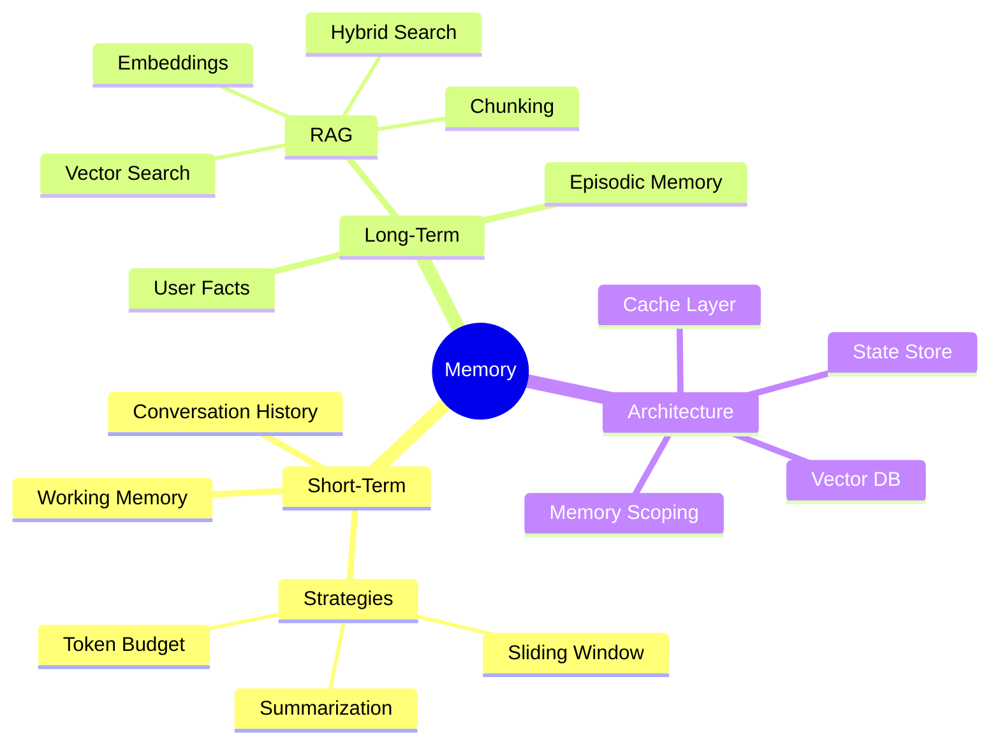
```mermaid
mindmap
  root((Memory))
    Short-Term
      Conversation History
      Working Memory
      Strategies
        Sliding Window
        Summarization
        Token Budget
    Long-Term
      RAG
        Chunking
        Embeddings
        Vector Search
        Hybrid Search
      User Facts
      Episodic Memory
    Architecture
      Cache Layer
      Vector DB
      State Store
      Memory Scoping
```

| What We Learned | Key Point |
|-----------------|-----------|
| **Short-Term** | Conversation history, limited, stored in cache |
| **Long-Term** | RAG, organizational knowledge, stored in Vector DB |
| **RAG** | Chunking → Embedding → Search → Augment Prompt |
| **Embedding** | Numerical representation of text that enables semantic search |
| **Vector DB** | Database optimized for semantic search |
| **Hybrid Search** | Combining Semantic + Keyword = best results |
| **Chunking** | Splitting documents into small parts with overlap |

---

## ❓ Self-Check Questions

1. Why doesn't an LLM by itself "remember" previous conversations?
2. What is the difference between Short-Term and Long-Term memory?
3. What is the problem with the Context Window and how does Sliding Window solve it?
4. Explain the three stages of RAG.
5. What is an Embedding and how does Cosine Similarity work?
6. Why is Chunking needed and what is the Overlap technique?
7. What is the difference between Semantic Search and Keyword Search?
8. What is Hybrid Search and why is it preferable?
9. What is Memory Scoping and why is it important?

---

### 📝 Answers

<details>
<summary>1. Why doesn't an LLM by itself "remember" previous conversations?</summary>

An LLM is **Stateless** - every request is independent. It doesn't store information between calls. To "remember" a conversation, you need to **send the entire history** again with every request as part of the prompt. This is the responsibility of the surrounding system, not the model itself.
</details>

<details>
<summary>2. What is the difference between Short-Term and Long-Term memory?</summary>

**Short-Term** = memory of the current conversation (messages, context). Deleted when the conversation ends. Stored in RAM/Cache. **Long-Term** = memory that persists over time (facts about the user, documents, knowledge). Stored in Vector DB. Remains even after the conversation ends.
</details>

<details>
<summary>3. What is the problem with the Context Window and how does Sliding Window solve it?</summary>

The Context Window is limited (e.g., 128K tokens). A long conversation exceeds the limit. **Sliding Window** = keeping only the last N messages and dropping old ones. This way you always stay within the limit, but you lose old context. Alternatives: Summarization (summarizing the history) or Hybrid (old summary + recent messages).
</details>

<details>
<summary>4. Explain the three stages of RAG.</summary>

1. **Retrieve** - Search for relevant documents in the Vector DB based on semantic similarity to the question.
2. **Augment** - Insert the found documents into the prompt as context.
3. **Generate** - The LLM generates an answer based on the context provided to it (grounded).
</details>

<details>
<summary>5. What is an Embedding and how does Cosine Similarity work?</summary>

**Embedding** = converting text into a vector of numbers (e.g., 1536 dimensions) that represents the **meaning** of the text. **Cosine Similarity** = a similarity measure between two vectors, calculating the angle between them. A value of 1.0 = identical, 0 = unrelated, -1 = opposite. Used to find semantically similar texts.
</details>

<details>
<summary>6. Why is Chunking needed and what is the Overlap technique?</summary>

**Chunking** = dividing a long document into small pieces. Why: (1) Embedding works better on short texts, (2) enables precise retrieval (specific parts). **Overlap** = overlap between chunks (e.g., 50 tokens). Prevents information loss at the boundary between two chunks.
</details>

<details>
<summary>7. What is the difference between Semantic Search and Keyword Search?</summary>

**Keyword Search** = searching by exact words (BM25). "car" doesn't find "automobile". **Semantic Search** = searching by meaning using embeddings. "car" does find "automobile" because they are semantically close. Keyword is precise but misses things. Semantic understands meaning but may be less precise.
</details>

<details>
<summary>8. What is Hybrid Search and why is it preferable?</summary>

**Hybrid Search** = combining Keyword Search + Semantic Search. Both are run, and then results are combined with **Reciprocal Rank Fusion (RRF)**. It's preferable because you get the advantages of both: literal precision (keyword) + understanding meaning (semantic).
</details>

<details>
<summary>9. What is Memory Scoping and why is it important?</summary>

**Memory Scoping** = defining who can access which memory. Levels: **User** (private to user), **Agent** (shared among all users of an agent), **Tenant** (shared within an organization), **Global** (shared with everyone). Important for: (1) **Security** - user A doesn't see user B's data, (2) **Privacy** - tenant isolation, (3) **Relevance** - more accurate context.
</details>

---

**[⬅️ Back to Chapter 2: Model Abstraction](02-model-abstraction-routing.md)** | **[➡️ Continue to Chapter 4: Thread & State Management →](04-thread-state-management.md)**
