# 🧵 Chapter 4: Thread & State Management

## Table of Contents
- [What is a Thread?](#what-is-a-thread)
- [Thread Management](#thread-management)
- [State Management](#state-management)
- [State Machine in Agents](#state-machine-in-agents)
- [Checkpointing](#checkpointing)
- [Human-in-the-Loop (HITL)](#human-in-the-loop-hitl)
- [Long-Running Workflows](#long-running-workflows)
- [Industry Tools & Frameworks](#industry-tools--frameworks)
- [Advantages and Disadvantages](#advantages-and-disadvantages)
- [Summary and Questions](#summary-and-questions)

---


### Real-World Scenario: The Browser Crash
Imagine your user is using your Agent to write a long piece of software. The Agent has generated 3 out of 5 Python files. Suddenly, the user's laptop runs out of battery, or the browser tab crashes.
- **Without State/Thread Management:** The process stops. When the user logs back in, the AI says "Hello, how can I help you today?" The progress is entirely lost.
- **With State Management & Checkpointing:** The user logs back in, pulls up `Thread 2`, and the Agent realizes it is exactly at `Step 3 (Generating tests)`. It resumes the workflow seamlessly.

## What is a Thread?

**Thread** (conversation thread) is the basic unit of conversation. It contains all the messages exchanged between the user and the Agent in a specific context.

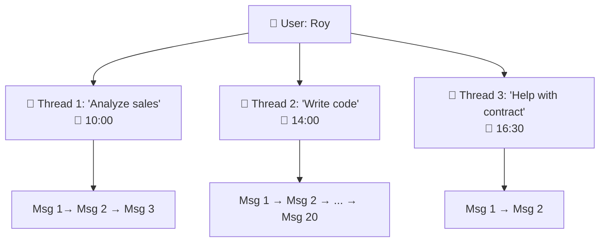

### The Hierarchy:

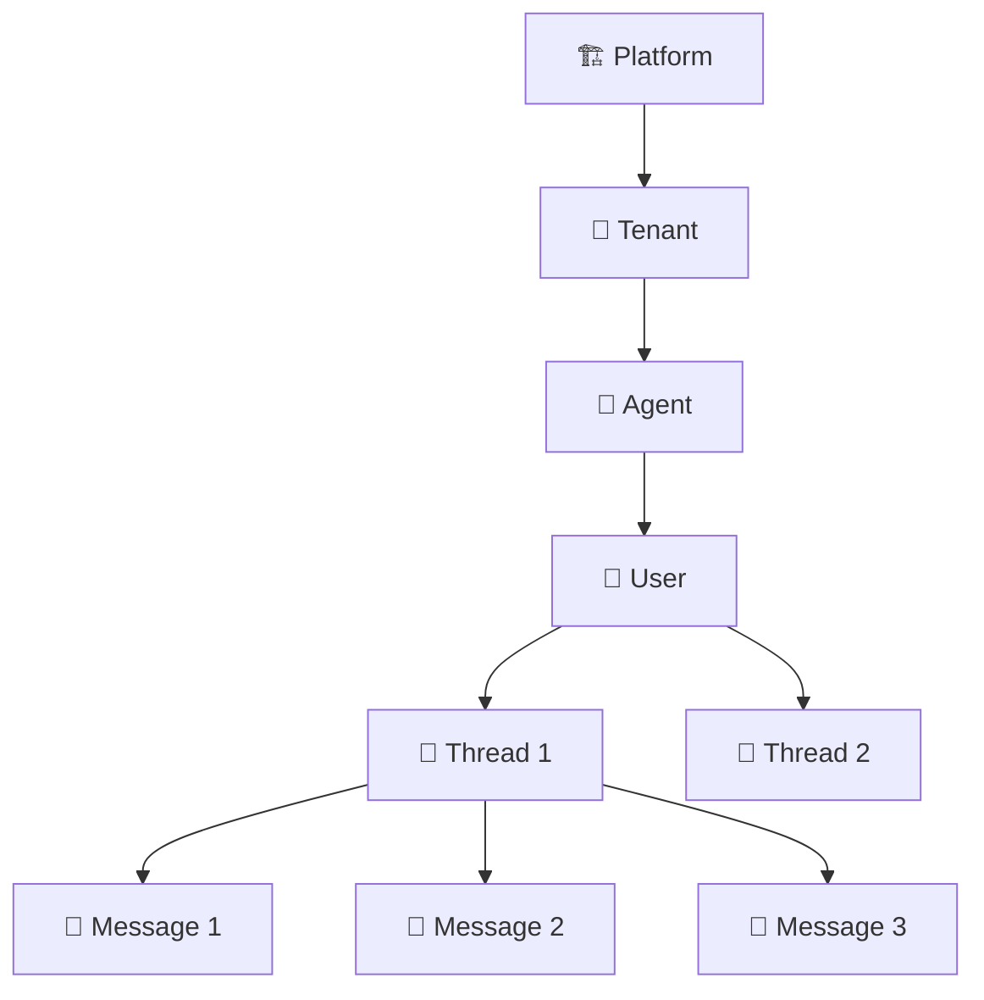

### Thread Structure:

```
Thread: thread-abc-123
├── id: "thread-abc-123"
├── agent_id: "agent-data-analyst"
├── user_id: "user-roi"
├── tenant_id: "team-analytics"
├── created_at: "2026-02-21T10:00:00Z"
├── updated_at: "2026-02-21T10:05:23Z"
├── status: "active"
├── metadata:
│   ├── title: "Q4 Sales Analysis"
│   └── tags: ["sales", "analytics"]
└── messages:
    ├── [0] {role: "system", content: "You are a data analyst..."}
    ├── [1] {role: "user", content: "Analyze the sales for me"}
    ├── [2] {role: "assistant", content: "", tool_calls: [{sql_query}]}
    ├── [3] {role: "tool", content: "{results: [...]}"}
    └── [4] {role: "assistant", content: "Sales increased by 15%..."}
```

---

## Thread Management

### Thread Manager Roles:

The Thread Manager handles every lifecycle operation for conversations. **Create** starts a new conversation. **Fork** creates a branch (useful for "what if?" explorations without losing the original). **Archive** moves old threads to cold storage. **Resume** brings an archived thread back to life.

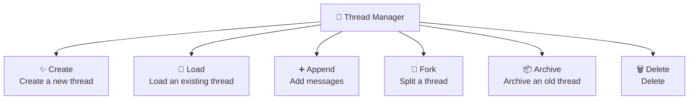

### Thread Lifecycle:

Every thread follows a predictable lifecycle. Understanding this prevents bugs like sending messages to archived threads, or forgetting to clean up expired conversations that consume storage.

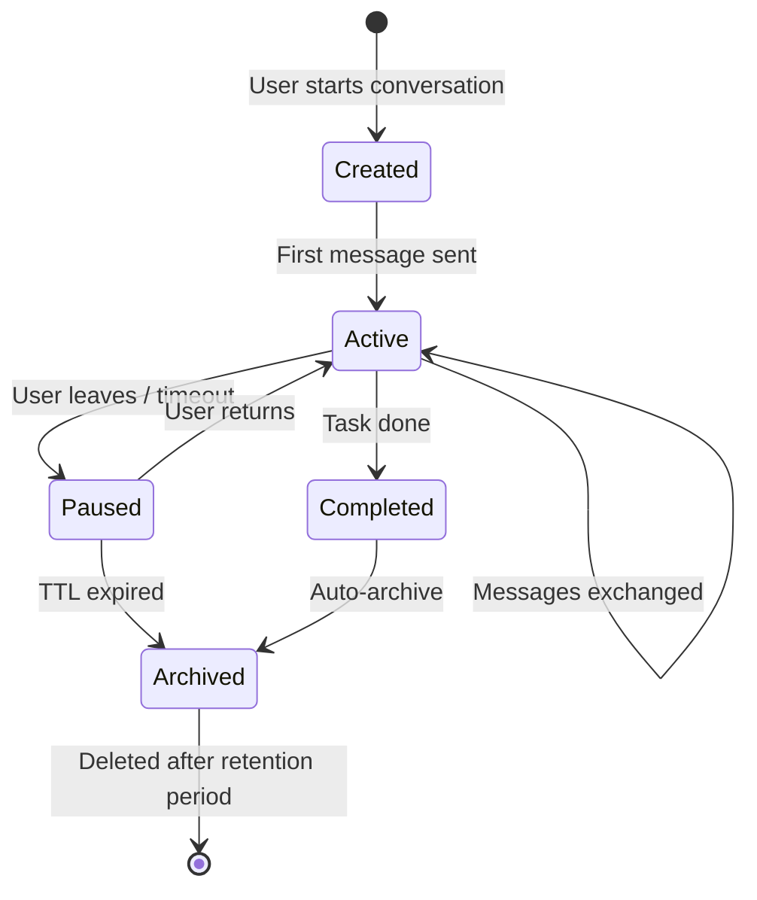

### Thread Forking

Sometimes a conversation branches — the user wants to "try a different direction":

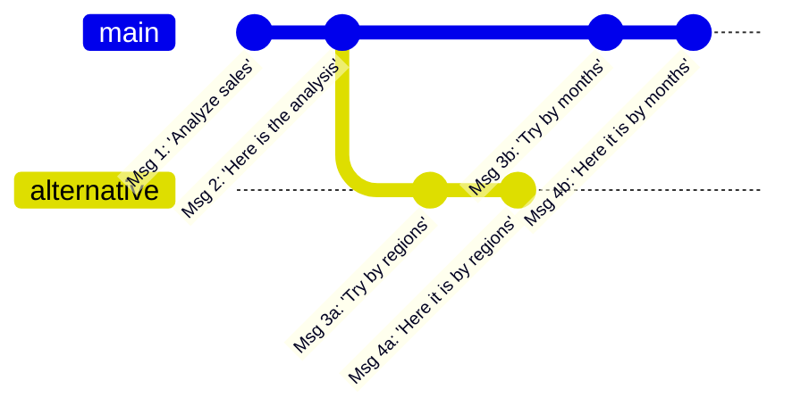

---

## State Management

### The Difference Between Thread and State

This is one of the most common sources of confusion. Think of it this way: the **Thread** is the conversation (messages exchanged), while the **State** is the workflow progress (which step we're on, what's been approved, what's pending). A customer support thread might contain 20 messages, but the state simply says `waiting_for_manager_approval`.

| Thread | State |
|--------|-------|
| **The messages** in a conversation | **The status** of an object/process |
| Append-only (only adding) | Mutable (changes) |
| Text-based | Structured data |
| Simple: "what was said" | Complex: "what step are we at" |

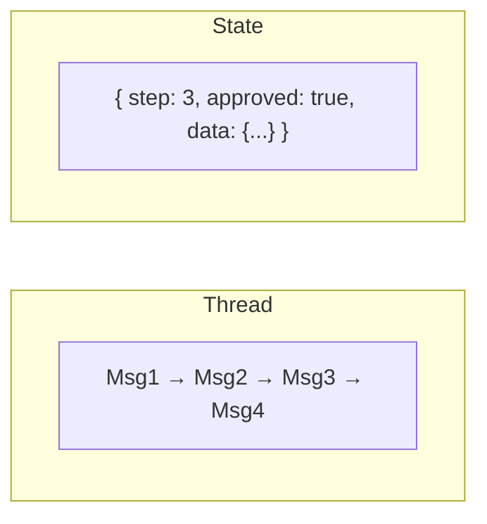

### Why Do We Need State Management?

A simple Agent finishes with a single response. But a **complex** Agent can:
- Execute a workflow with steps
- Wait for human approval
- Run for days
- Crash mid-process and resume

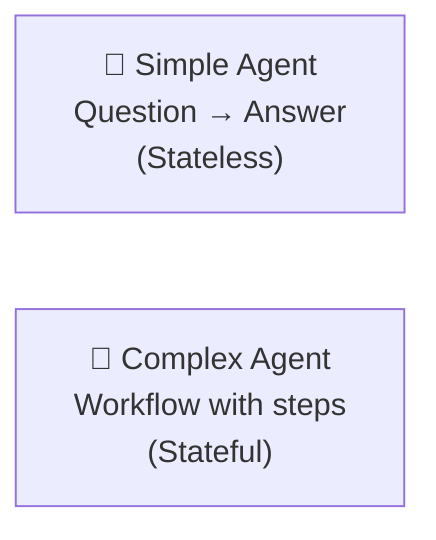

---

## State Machine in Agents

### What is a State Machine?
A State Machine defines all the **possible states** of an Agent and the **transitions** between them.

### Example: Financial Report Analysis Agent

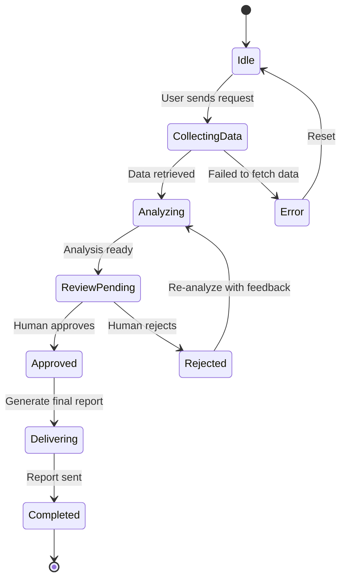

### State Storage:

```
Agent Run State:
├── run_id: "run-xyz-789"
├── agent_id: "agent-financial-analyzer"
├── thread_id: "thread-abc-123"
├── current_state: "ReviewPending"
├── step_count: 4
├── started_at: "2026-02-21T10:00:00Z"
├── data:
│   ├── query_results: [{...}]
│   ├── analysis: "Revenue increased by 15%..."
│   └── charts: ["chart1.png", "chart2.png"]
├── pending_action:
│   ├── type: "human_approval"
│   ├── prompt: "Approve the report before sending?"
│   └── timeout: "24h"
└── history:
    ├── [0] {state: "Idle", timestamp: "10:00:00"}
    ├── [1] {state: "CollectingData", timestamp: "10:00:01"}
    ├── [2] {state: "Analyzing", timestamp: "10:00:15"}
    └── [3] {state: "ReviewPending", timestamp: "10:01:30"}
```

---

## Checkpointing

### What is it?
**Checkpoint** = saving a "snapshot" of the Agent's state so that it's possible to:
- Return to a previous point (rollback)
- Continue after a failure (recovery)
- Reproduce a run (replay)

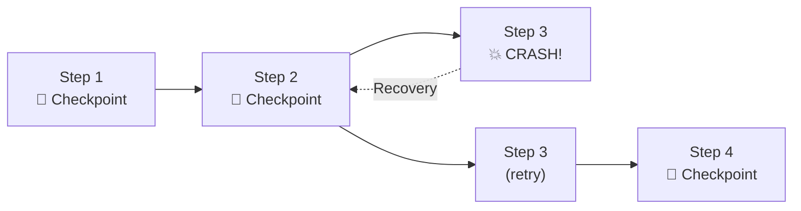

### What is Saved in a Checkpoint:

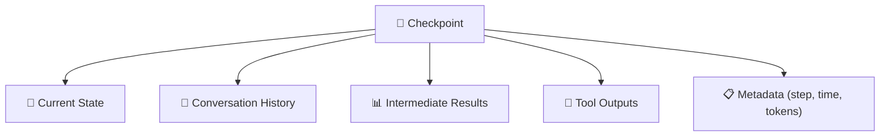

### Checkpoint Strategies:

| Strategy | Explanation | Pros | Cons |
|----------|-------------|------|------|
| **Every step** | Saves after every LLM call | Precise recovery | Storage + latency |
| **Every N steps** | Saves every N steps | Balance | May lose steps |
| **On tool calls** | Saves only before/after tools | Saves critical points | Doesn't cover everything |
| **On state change** | Saves on state transition | Most logical | Depends on state definitions |

---

## Human-in-the-Loop (HITL)

### What is it?
HITL = the need to stop the Agent and wait for **human approval** before continuing.

### Why Do We Need HITL?

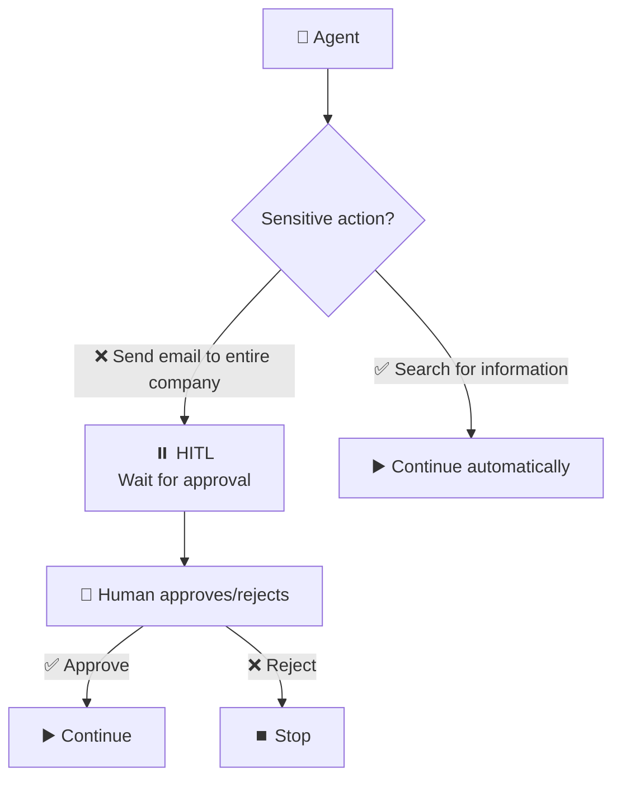

### Types of HITL:

| Type | Explanation | Example |
|------|-------------|---------|
| **Approval Gate** | Simple approve/reject | "Send the email? Yes/No" |
| **Review & Edit** | Approval with editing option | "Here's the report, you can edit before sending" |
| **Feedback Loop** | Request for additional information | "I need more details..." |
| **Escalation** | Transfer to a human when Agent doesn't know | "I'm not sure, transferring to a representative" |

### HITL Architecture:

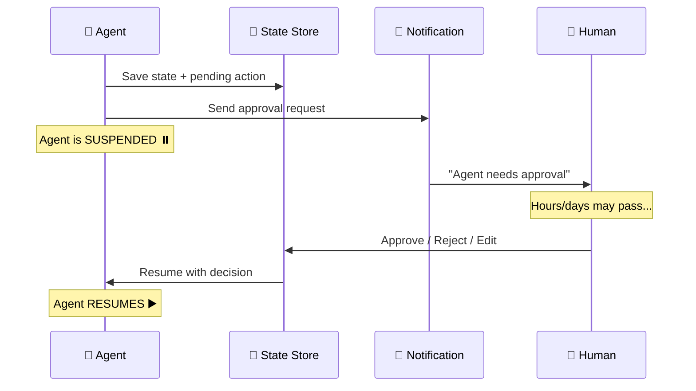

### The Challenge: Suspension & Resumption

When an Agent waits for HITL, it can wait **hours or days**. You can't keep a running process alive the entire time.

**Solution: Durable State**

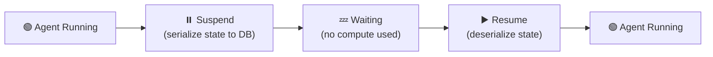

---

## Long-Running Workflows

### The Problem
Simple Agents finish in 30 seconds. But there are workflows that run for **hours or days**:

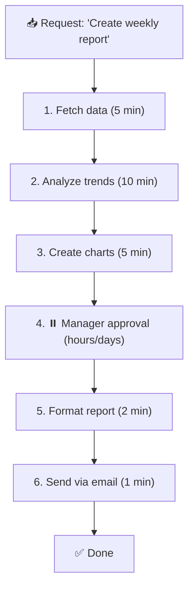

### Durable Execution Pattern

Regular processes are **ephemeral** — if the server restarts, deploys, crashes, or scales down, the process is lost along with all its state. For a simple API call, this is fine (just retry). But for an agent that's been working on a 30-minute research task, losing progress is unacceptable. Durable execution solves this by persisting every step so the workflow can resume exactly where it left off.

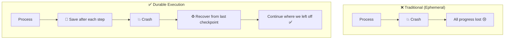

### Patterns for Long-Running Workflows:

| Pattern | Explanation | Suitable For |
|---------|-------------|--------------|
| **Saga** | Each step is an independent transaction with compensation | When rollback is needed |
| **Workflow Engine** | DAG of steps with dependencies | Complex workflows |
| **Event Sourcing** | Every change is saved as an event | Full audit trail |
| **Actor Model** | Each Agent is an independent Actor | Parallel execution |

### Saga Pattern - Deep Dive:

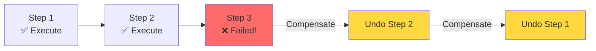

**Example:** An Agent that books a vacation:
1. ✅ Book flight
2. ✅ Book hotel
3. ❌ Book car - failed!
4. ↩️ Cancel hotel (compensation)
5. ↩️ Cancel flight (compensation)

---

## Concurrency: Managing Multiple Threads

### The Problem: What happens when a user sends a new message while the Agent is still processing?

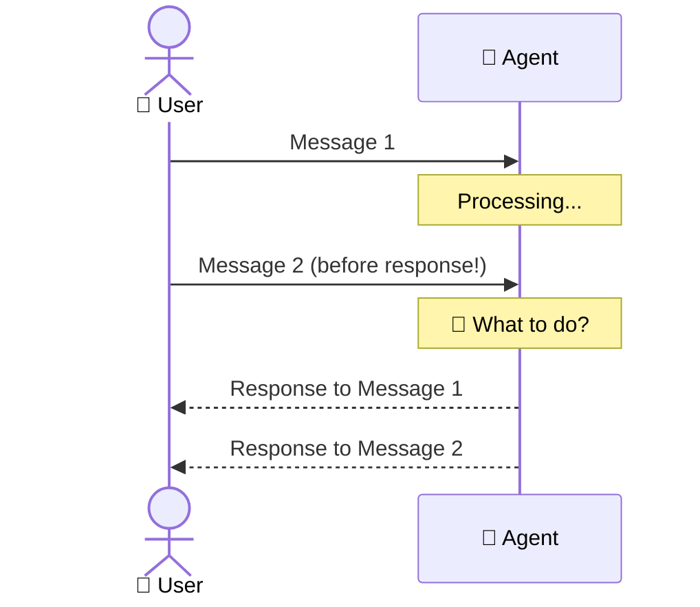

### Strategies:

| Strategy | Explanation |
|----------|-------------|
| **Queue** | Messages enter a queue, processed one by one |
| **Cancel & Replace** | New message cancels the current one |
| **Parallel** | Both messages are processed in parallel (complex) |
| **Lock** | Thread is locked during processing, new message waits |

---

## Industry Tools & Frameworks

### State Management & Checkpointing

| Tool | Creator | What It Does | Best For |
|------|---------|-------------|----------|
| **LangGraph Checkpointer** | LangChain | Built-in state persistence (MemorySaver, SqliteSaver, PostgresSaver) | LangGraph agents, conversation state |
| **Azure Cosmos DB** | Microsoft | Globally distributed, partition by thread_id | Multi-region agent platforms |
| **Redis** | Open-source | Fast in-memory state store with TTL | Short-lived session state, caching |
| **PostgreSQL** | Open-source | Reliable relational storage for checkpoints | Production LangGraph deployments |

### Long-Running Workflow Engines

| Tool | What It Does | Best For |
|------|-------------|----------|
| **Azure Durable Functions** | Serverless stateful workflows with automatic checkpointing | Azure-native, event-driven workflows |
| **Temporal** | Open-source workflow engine (used by Stripe, Netflix) | Complex multi-step agent workflows |
| **Restate** | Lightweight durable execution engine | Low-latency stateful agents |
| **Apache Airflow** | DAG-based workflow orchestration | Batch processing, data pipelines |

### Human-in-the-Loop Platforms

| Tool | What It Does | Best For |
|------|-------------|----------|
| **LangGraph Interrupt** | Built-in HITL with `interrupt()` function | LangGraph agents needing approval |
| **Azure Logic Apps** | Visual workflow designer with approval steps | Enterprise approval chains |
| **Retool** | Build internal tools with approval UIs | Custom approval dashboards |

### Why This Matters — Real-World Scenario

Imagine an agent that processes expense approvals. Without proper state management:

```
1. Employee submits $5,000 expense
2. Agent starts processing, calls manager for approval
3. Server restarts (deploy, crash, scale-down)
4. State is LOST — the expense is stuck in limbo
5. Employee waits forever, submits again → duplicate processing
```

With checkpointing (e.g., LangGraph + PostgreSQL):

```
1. Employee submits $5,000 expense
2. Agent saves state → "waiting_for_approval"
3. Server restarts
4. Agent resumes from checkpoint → sends reminder to manager
5. Manager approves → agent completes the flow
```

This is why thread and state management isn't optional in production — it's the difference between a demo and a reliable system.

---

## Advantages and Disadvantages

### Thread Management

| ✅ Advantage | ❌ Disadvantage |
|-------------|----------------|
| Clear conversation organization | Storage grows with usage |
| Separation between contexts | Thread cleanup policy needed |
| Fork & Branch support | Concurrency challenges |

### State Management

| ✅ Advantage | ❌ Disadvantage |
|-------------|----------------|
| Recovery from failures | Complex to implement |
| HITL support | State serialization overhead |
| Long-running workflows | Debugging stateful systems harder |
| Audit trail | State migration between versions |

---

## Summary

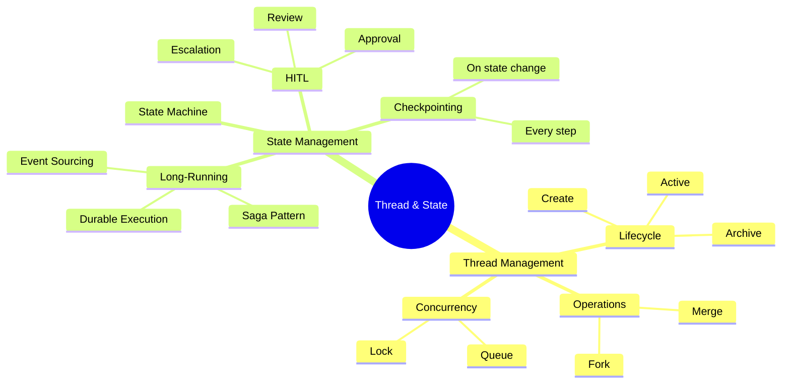

| What We Learned | Key Point |
|-----------------|-----------|
| **Thread** | A conversation unit that contains all the messages |
| **State** | The Agent's status at any given moment |
| **Checkpoint** | Saving state for recovery after failure |
| **HITL** | Stopping the Agent for human approval |
| **Saga** | Pattern for rollback of complex workflows |
| **Durable Execution** | Long-running execution that survives crashes |

---

## ❓ Self-Check Questions

1. What is the difference between Thread and State?
2. What is the Thread Lifecycle (name 4 states)?
3. Why is Checkpointing needed and what strategies exist?
4. What is HITL and what types of it exist?
5. What is the Saga Pattern and when is it used?
6. What is the solution to the Long-Running Workflows problem?
7. What happens when a user sends a message while the Agent is still processing?

---

### 📝 Answers

<details>
<summary>1. What is the difference between Thread and State?</summary>

**Thread** = an entire conversation — contains a sequence of ordered messages. A thread has a thread_id and represents **what was said**. **State** = the Agent's current status at a specific moment (where it is in the ReAct loop, which tools were activated, variables). It represents **where we are in the process**.
</details>

<details>
<summary>2. What is the Thread Lifecycle (name 4 states)?</summary>

1. **Created** - thread is created, still empty.
2. **Active** - active conversation, messages are being sent/received.
3. **Suspended** - temporarily frozen (waiting for HITL, timeout).
4. **Closed/Archived** - conversation is over, saved to archive.
</details>

<details>
<summary>3. Why is Checkpointing needed and what strategies exist?</summary>

**Checkpointing** = saving a state snapshot at fixed time points. It's needed because: if the system crashes, you can return to the last point instead of starting from scratch. Strategies: (1) **Every Step** - saves after every step (reliable but slow), (2) **Periodic** - every N seconds (trade-off), (3) **On-Demand** - only at critical points.
</details>

<details>
<summary>4. What is HITL and what types of it exist?</summary>

**HITL (Human-in-the-Loop)** = a human enters the loop to approve/correct/reject. Types: (1) **Approval** - Agent requests approval before a critical action ("Send an order for $5000?"), (2) **Review** - Agent presents a result and the human approves/rejects, (3) **Escalation** - Agent transfers to a human when it doesn't have enough confidence.
</details>

<details>
<summary>5. What is the Saga Pattern and when is it used?</summary>

**Saga Pattern** = a pattern for managing multi-step transactions. Instead of one large transaction, it's broken down into small steps, and each step has a **compensating action** (undo action). If step 3 fails → undo steps 2 and 1. It's used when there's a sequence of actions involving multiple systems (booking + payment + notification).
</details>

<details>
<summary>6. What is the solution to the Long-Running Workflows problem?</summary>

**Durable Execution** - using a framework like Durable Functions / Temporal. The idea: the workflow saves its state in durable storage, can wait for days (e.g., waiting for HITL), and if it crashes — continues from where it stopped. It doesn't hit the regular timeout.
</details>

<details>
<summary>7. What happens when a user sends a message while the Agent is still processing?</summary>

This is **Concurrent Message Handling**. Options: (1) **Queue** - the message enters a queue and is processed after the current processing is completed. (2) **Reject** - return an error "The Agent is busy, try again later". (3) **Cancel & Replace** - cancel the current processing and start with the new message.
</details>

---

**[⬅️ Back to Chapter 3: Memory Management](03-memory-management.md)** | **[➡️ Continue to Chapter 5: Orchestration Patterns →](05-orchestration.md)**
