# 🔧 Chapter 6: Tools & Marketplace

## Table of Contents
- [What Are Tools?](#what-are-tools)
- [Function Calling](#function-calling)
- [Types of Tools](#types-of-tools)
- [Tool Registry](#tool-registry)
- [Tool Execution Pipeline](#tool-execution-pipeline)
- [Tool Marketplace](#tool-marketplace)
- [Tool Security](#tool-security)
- [Pros and Cons](#pros-and-cons)
- [Summary and Questions](#summary-and-questions)

---

## What Are Tools?

**Tool** = A function/API that the Agent can invoke to **act in the real world**.

The LLM knows how to generate text. Tools give it **hands**:

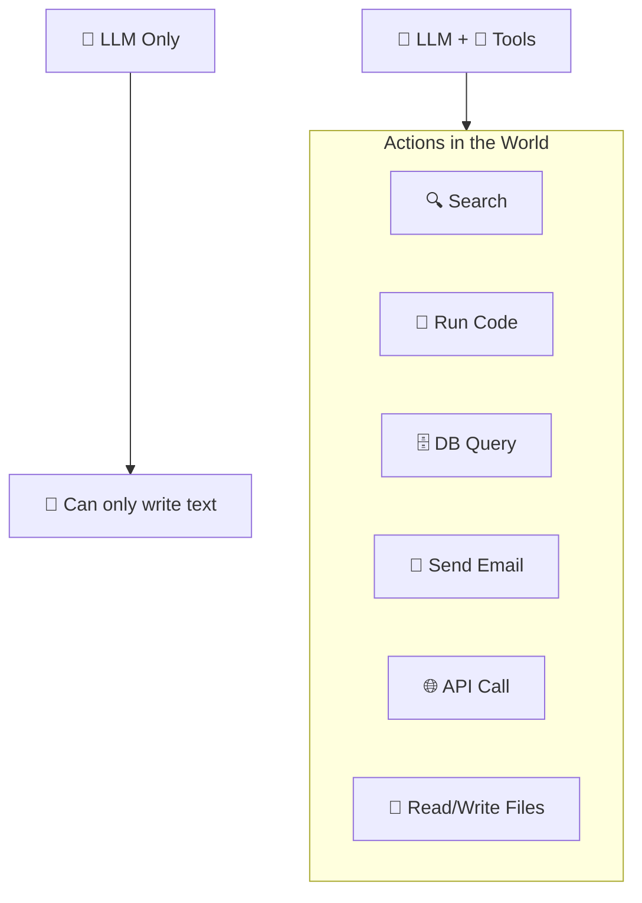

---

## Function Calling

### What Is It?
**Function Calling** is the mechanism by which the LLM "requests" to invoke a tool. The LLM doesn't run the tool itself - it **returns an instruction** that the system executes.

### The Flow:

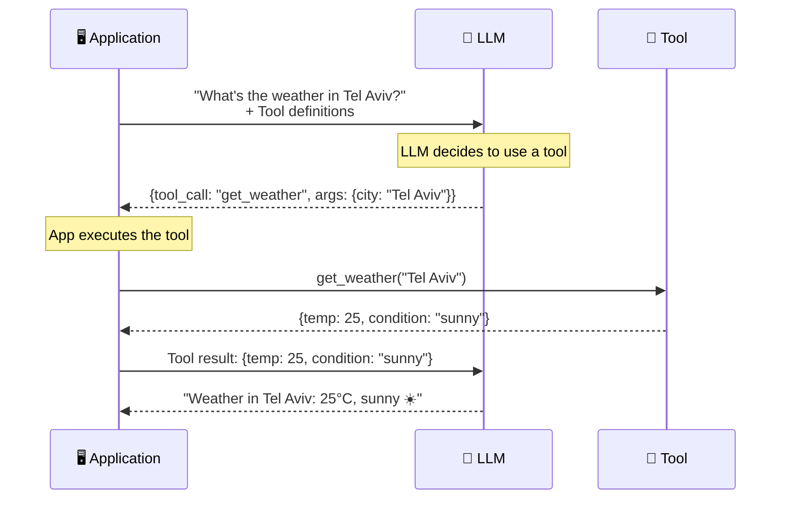

### How Does the LLM "Know" About the Tools?

We send **tool definitions** as part of the prompt:

```
Tool Definition:
├── name: "get_weather"
├── description: "Get current weather for a city"
└── parameters:
    ├── city (string, required): "The city name"
    └── unit (string, optional): "celsius or fahrenheit"
```

The LLM sees the definition and **decides** if and when to use a tool.

### Important Point: The LLM Doesn't Execute Anything!

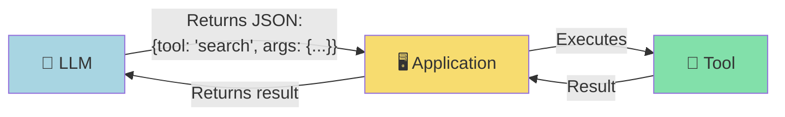

---

## Types of Tools

### 1. Data Retrieval Tools

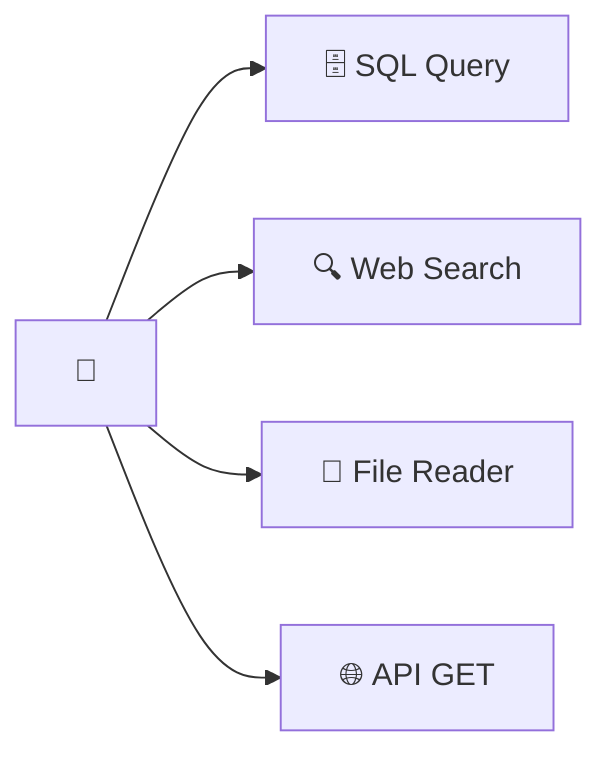

| Tool | What It Does | Example |
|------|-------------|---------|
| SQL Query | Query a database | `SELECT * FROM sales WHERE...` |
| Web Search | Search the internet | Bing/Google search |
| File Reader | Read a file | Read CSV, PDF, Excel |
| API Call | Call an external API | GET /api/customers |

### 2. Action Tools

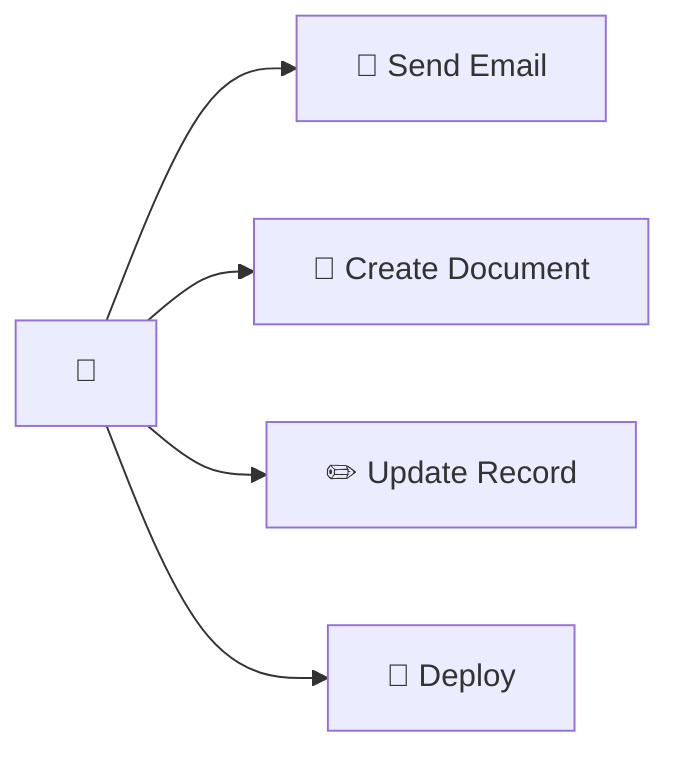

### 3. Computation Tools

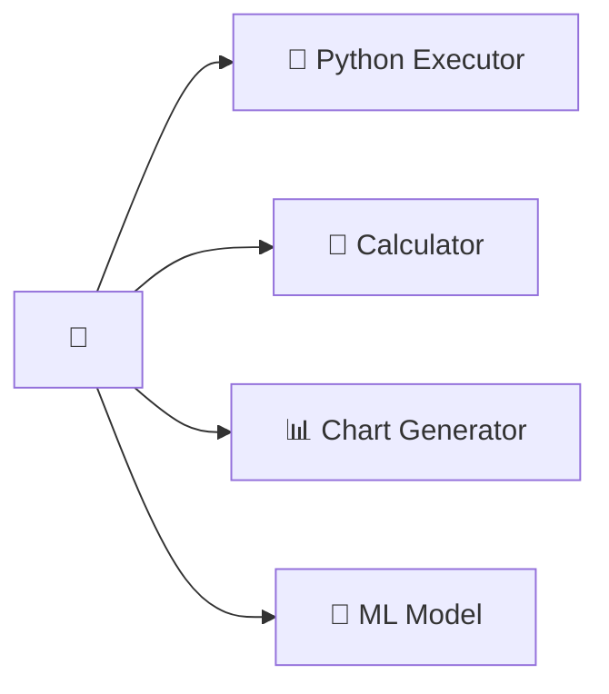

### 4. Communication Tools

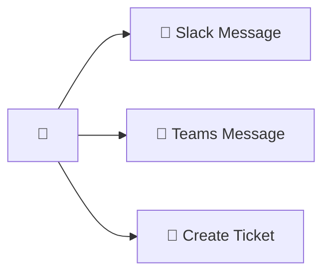

### Classification by Risk Level:

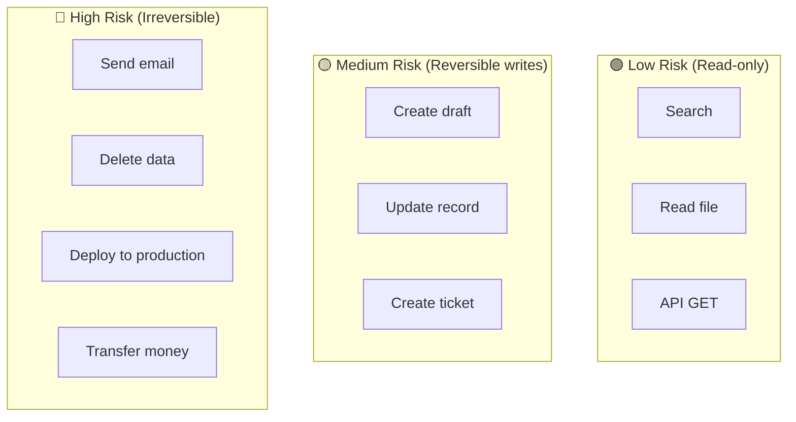

---

## Tool Registry

### What Is It?
**Tool Registry** = A central repository of all available tools in the platform.

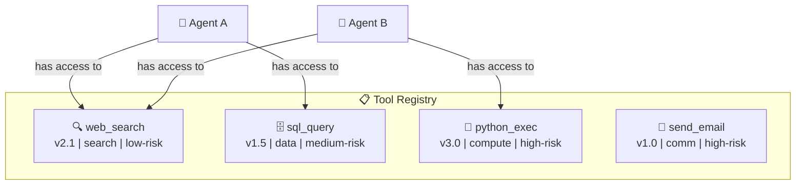

### Tool Definition Schema:

```
Tool:
├── id: "tool-sql-query"
├── name: "sql_query"
├── version: "1.5"
├── description: "Execute read-only SQL queries"
├── category: "data-retrieval"
├── risk_level: "medium"
├── parameters:
│   ├── query (string, required): "SQL query to execute"
│   └── database (string, required): "Target database name"
├── returns:
│   └── results (array): "Query results"
├── auth:
│   └── requires: ["db-read-access"]
├── limits:
│   ├── max_rows: 1000
│   ├── timeout: 30s
│   └── rate_limit: "10/minute"
├── sandbox:
│   └── required: true
└── owner: "team-data-platform"
```

---

## Tool Execution Pipeline

The flow from the moment the LLM requests a tool until the result comes back:

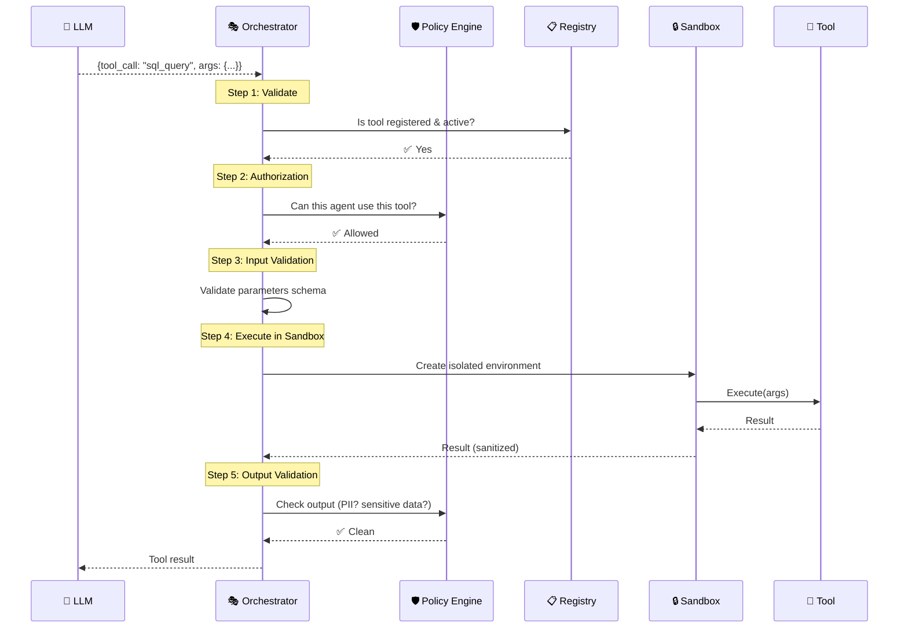

### Pipeline Steps:

| Step | What Happens | Why It's Important |
|------|-------------|-------------------|
| **1. Validate** | Check that the tool exists | Prevent errors |
| **2. Authorize** | Check permissions | Security |
| **3. Input Validate** | Check that parameters are valid | Prevent injection |
| **4. Execute** | Run in an isolated environment | Security + isolation |
| **5. Output Validate** | Check that the result doesn't contain PII | Compliance |

### Implementation Example

```python
from typing import Any
from pydantic import ValidationError

async def execute_tool_pipeline(
    tool_call: ToolCall,
    agent_context: AgentContext
) -> ToolResult:
    """The 5-step tool execution pipeline."""
    
    # Step 1: Validate - Does the tool exist?
    tool = tool_registry.get(tool_call.name)
    if not tool:
        raise ToolNotFoundError(f"Tool '{tool_call.name}' not registered")
    if not tool.is_active:
        raise ToolDisabledError(f"Tool '{tool_call.name}' is disabled")
    
    # Step 2: Authorize - Can this agent use this tool?
    if not policy_engine.check_tool_permission(
        agent_id=agent_context.agent_id,
        tool_name=tool_call.name,
        user_role=agent_context.user_role
    ):
        raise ToolUnauthorizedError(
            f"Agent '{agent_context.agent_id}' cannot use '{tool_call.name}'"
        )
    
    # Step 3: Input Validation - Are parameters valid and safe?
    try:
        validated_params = tool.input_schema.validate(tool_call.arguments)
    except ValidationError as e:
        raise InvalidToolInputError(f"Invalid parameters: {e}")
    
    # Sanitize inputs (prevent SQL injection, command injection, etc.)
    sanitized_params = input_sanitizer.sanitize(validated_params, tool.input_schema)
    
    # Step 4: Execute in Sandbox
    result = await sandbox.execute(
        tool=tool,
        params=sanitized_params,
        timeout=tool.limits.timeout,
        resource_limits=tool.limits.resources
    )
    
    # Step 5: Output Validation - Check for PII, sensitive data
    scan_result = dlp_scanner.scan(result.data)
    if scan_result.has_violations:
        result.data = dlp_scanner.mask(result.data, scan_result.violations)
    
    # Log the execution
    audit_logger.log_tool_execution(
        tool=tool_call.name,
        agent=agent_context.agent_id,
        user=agent_context.user_id,
        duration=result.duration,
        status="success"
    )
    
    return result
```

### Tool Definition Example

```json
{
  "name": "sql_query",
  "version": "1.5",
  "description": "Execute read-only SQL queries on authorized databases",
  "parameters": {
    "type": "object",
    "properties": {
      "query": {
        "type": "string",
        "description": "SQL SELECT query to execute"
      },
      "database": {
        "type": "string",
        "enum": ["sales_db", "analytics_db"],
        "description": "Target database"
      }
    },
    "required": ["query", "database"]
  },
  "security": {
    "requires_permissions": ["db-read-access"],
    "allowed_operations": ["SELECT"],
    "blocked_keywords": ["DROP", "DELETE", "UPDATE", "INSERT", "ALTER"]
  },
  "limits": {
    "max_rows": 1000,
    "timeout": "30s",
    "rate_limit": "10/minute"
  }
}
```

---

## Tool Marketplace

### What Is It?
**Marketplace** = A store/catalog where teams can **publish**, **discover**, and **use** tools that others have built.

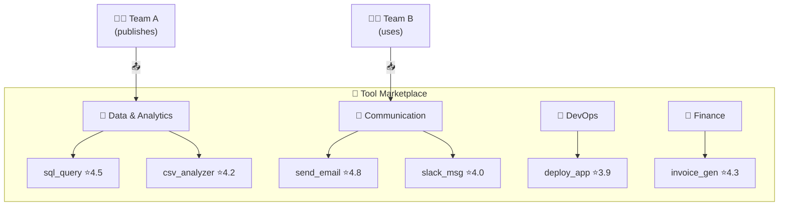

### Marketplace Features:

| Feature | Explanation |
|---------|------------|
| **Discovery** | Search for tools by category, name, description |
| **Versioning** | Each tool with versions (v1.0, v1.1, v2.0) |
| **Documentation** | Documentation, usage examples, API reference |
| **Ratings & Reviews** | Ratings and feedback from users |
| **Usage Analytics** | How many times the tool was used, success rate |
| **Access Control** | Who can use it - public/private/team-only |
| **Certification** | Tools that passed security and quality checks |

### Publishing Flow:

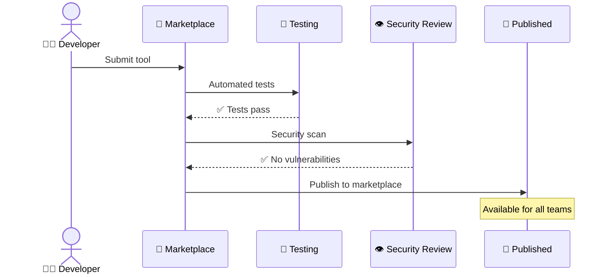

---

## Tool Security

### Input Sanitization

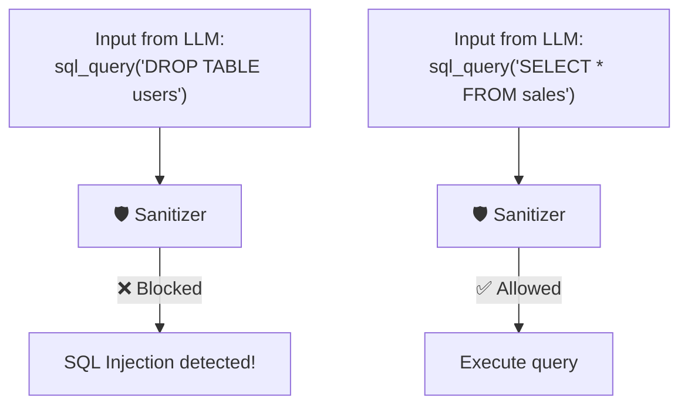

### Security Risks in Tools:

| Risk | Explanation | Protection |
|------|------------|------------|
| **Prompt Injection** | LLM tricked into calling an unauthorized tool | Policy Engine, allowlist |
| **SQL Injection** | LLM generates malicious SQL | Parameterized queries, read-only |
| **Code Injection** | Agent generates dangerous code | Sandbox, restricted permissions |
| **Data Exfiltration** | Tool sends sensitive data out | Network isolation, output scanning |
| **Excessive Permissions** | Tool with overly broad permissions | Least Privilege, scoped access |

### Principle of Least Privilege:

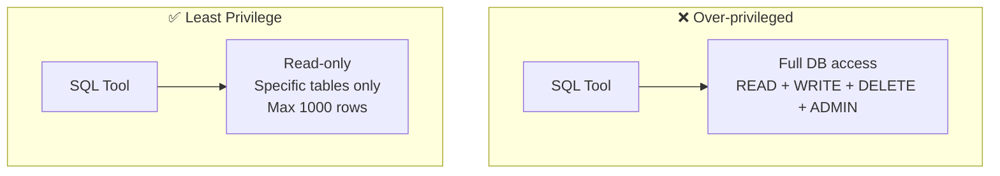

---

## Pros and Cons

### Tools

| ✅ Advantage | ❌ Disadvantage |
|-------------|----------------|
| Agent can act in the world | Security risks |
| Extends LLM capabilities | Each tool call adds latency |
| Modular - easy to add tools | LLM may call the wrong tool |
| Reusable across Agents | Tool definitions consume tokens |

### Marketplace

| ✅ Advantage | ❌ Disadvantage |
|-------------|----------------|
| Sharing across teams | Version management |
| Easy discovery | Quality control |
| Standardization | Security review overhead |
| Development speed | Dependency management |

---

## Summary

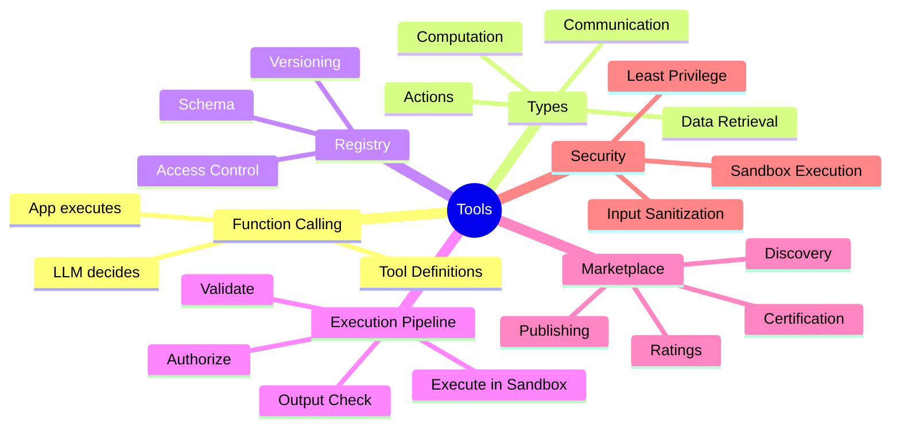

| What We Learned | Key Point |
|----------------|-----------|
| **Tools** | Functions that give the Agent the ability to act in the world |
| **Function Calling** | LLM returns an instruction (JSON), the system executes |
| **Tool Registry** | Central repository of all available tools |
| **Execution Pipeline** | Validate → Auth → Execute → Output Check |
| **Marketplace** | Tool store with discovery, versioning, reviews |
| **Security** | Input sanitization, Least Privilege, Sandbox |

---

## ❓ Self-Assessment Questions

1. What is the difference between a Tool and Function Calling?
2. Why doesn't the LLM execute the tool itself?
3. What are the four types of tools? Give an example for each.
4. What are the 5 steps in the Tool Execution Pipeline?
5. What is a Tool Marketplace and why is it important?
6. What is the Principle of Least Privilege in the context of Tools?
7. What are 3 security risks in using tools and how do you defend against them?

---

### 📝 Answers

<details>
<summary>1. What is the difference between a Tool and Function Calling?</summary>

**Tool** = An external capability that the Agent can invoke (API, DB query, calculator). **Function Calling** = The technical mechanism through which the LLM **requests** tool invocation - it returns JSON with the function name and parameters. Tool = what, Function Calling = how the LLM requests it.
</details>

<details>
<summary>2. Why doesn't the LLM execute the tool itself?</summary>

An LLM is a **language model** - it generates text, it doesn't run code. It is **not connected to the internet/DB/APIs**. Therefore the LLM only **decides** which tool to invoke, and the **Platform** (Runtime) actually executes it - separation of responsibility for security.
</details>

<details>
<summary>3. What are the four types of tools? Give an example for each.</summary>

1. **API Tools** - Calling external services (weather, scheduling a meeting).
2. **Data Tools** - Database access (SQL query, vector search).
3. **Compute Tools** - Computational code (Python sandbox, calculator).
4. **System Tools** - System operations (sending email, file system).
</details>

<details>
<summary>4. What are the 5 steps in the Tool Execution Pipeline?</summary>

1. **Selection** - The LLM chooses which tool to invoke.
2. **Validation** - Checking parameters, permissions, schema.
3. **Execution** - Running the tool (in a sandbox).
4. **Result Processing** - Processing the result (filtering, truncating).
5. **Return** - Returning the result to the LLM for the Observe step in the ReAct loop.
</details>

<details>
<summary>5. What is a Tool Marketplace and why is it important?</summary>

**Tool Marketplace** = A central catalog of ready-to-use tools, like an App Store for tools. Important because: (1) **Reuse** - don't reinvent the wheel, (2) **Compliance** - tools are tested for security and quality, (3) **Documentation** - uniform schema that the LLM understands, (4) **Discovery** - version discovery.
</details>

<details>
<summary>6. What is the Principle of Least Privilege in the context of Tools?</summary>

Give a tool only the **minimum** permissions it needs. For example: a tool that reads from a DB gets only read access, not write/delete. A tool that sends email can only send, not read the entire inbox. Reduces the "blast radius" if something goes wrong.
</details>

<details>
<summary>7. What are 3 security risks in using tools and how do you defend against them?</summary>

1. **Injection** - An attacker injects malicious input into a tool (SQL injection through the agent). Defense: input validation, parameterized queries.
2. **Data Exfiltration** - The Agent sends sensitive data through a tool. Defense: output filtering, DLP.
3. **Excessive Permissions** - A tool with overly broad permissions causes damage. Defense: Least Privilege, regular permission audits.
</details>

---

**[⬅️ Back to Chapter 5: Orchestration](05-orchestration.md)** | **[➡️ Continue to Chapter 7: Policy & Governance →](07-policy-governance.md)**
