# 🎭 Chapter 7: Orchestration Patterns

## Table of Contents
- [What is Orchestration?](#what-is-orchestration)
- [Sequential Execution](#sequential-execution)
- [Parallel Execution](#parallel-execution)
- [Autonomous Execution](#autonomous-execution)
- [Sub-Agent Orchestration](#sub-agent-orchestration)
- [DAG Workflows](#dag-workflows)
- [Advanced Patterns](#advanced-patterns)
- [Patterns Comparison](#patterns-comparison)
- [Summary and Questions](#summary-and-questions)

---

## What is Orchestration?

**Orchestration** = how the Agent (or multiple Agents) coordinate actions to complete a task.

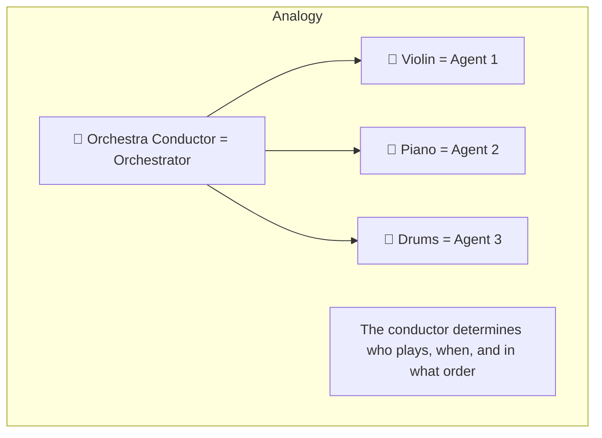

### Why do we need Orchestration?

Simple tasks = one Agent is enough. Complex tasks = require **coordination**:

| Task | One Agent? | Orchestration? |
|------|-----------|---------------|
| "What's the weather?" | ✅ | ❌ |
| "Summarize the email" | ✅ | ❌ |
| "Analyze sales, compare to competitors, and write a report" | ❌ | ✅ |
| "Plan a trip: flights + hotel + car rental" | ❌ | ✅ |

---

## Sequential Execution

### What is it?
Step after step - each step starts only after the previous one finishes.

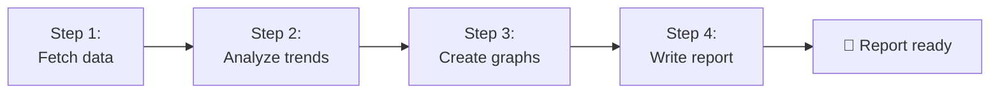

### Example: Document Processing Pipeline

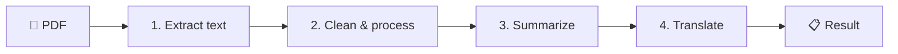

### Pros and Cons

| ✅ Pros | ❌ Cons |
|---------|---------|
| Easy to understand | Slow - each step waits for the previous one |
| Easy to debug | Doesn't utilize parallelism |
| Deterministic - always the same order | If a step fails, everything stops |
| Easy to add Checkpoint | |

---

## Parallel Execution

### What is it?
Multiple actions run **in parallel** - not dependent on each other.

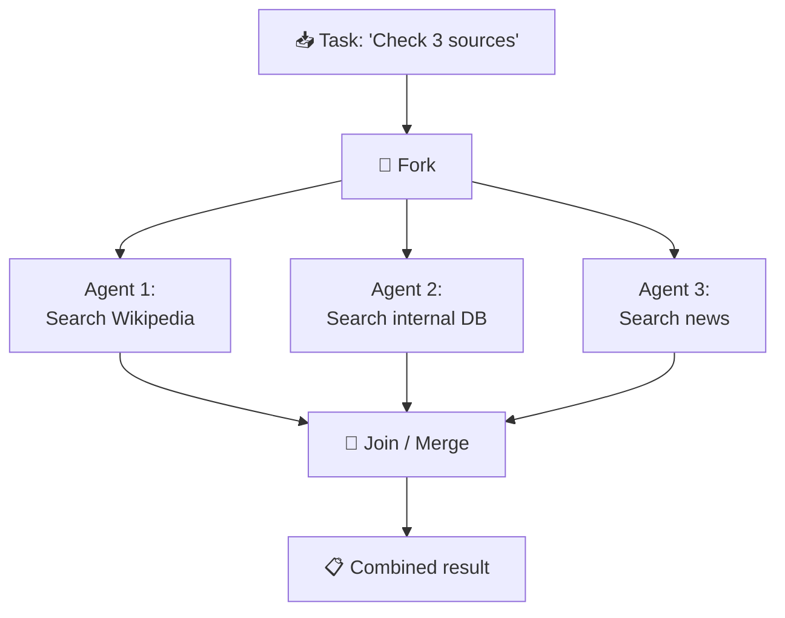

### Fan-Out / Fan-In Pattern

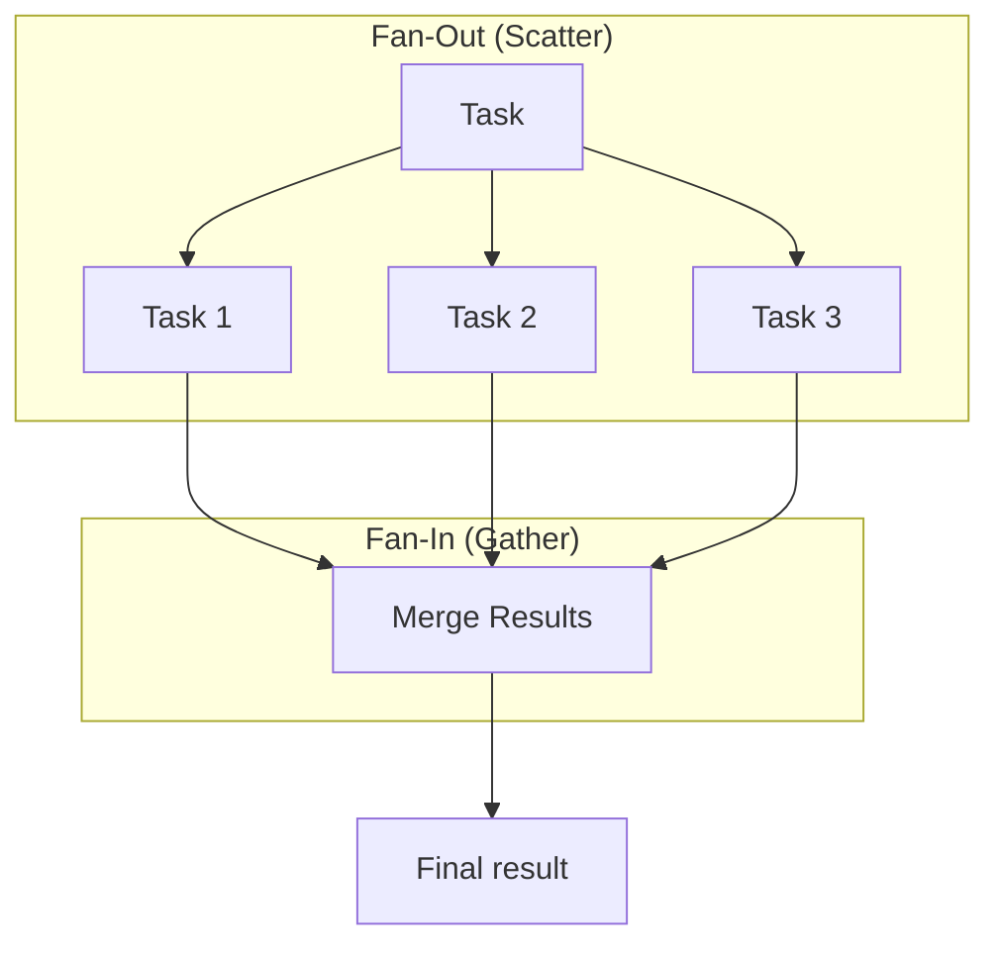

### Challenges in Parallel Execution:

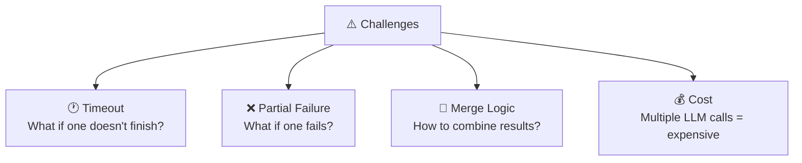

| Challenge | Solution |
|-----------|----------|
| **Timeout** | Set a deadline; if not finished, continue without it |
| **Partial Failure** | Decide: one failure = all fail? Or continue with what's available? |
| **Merge** | Aggregator Agent that combines results |
| **Cost** | Limit parallelism (max concurrent) |

### Pros and Cons

| ✅ Pros | ❌ Cons |
|---------|---------|
| Fast (N operations in the time of 1) | Complex |
| Good resource utilization | Merge logic is non-trivial |
| Suitable for multi-source search | Partial failure is hard to handle |

---

## Autonomous Execution

### What is it?
The Agent **decides on its own** what to do next. No predefined workflow - the Agent navigates as needed.

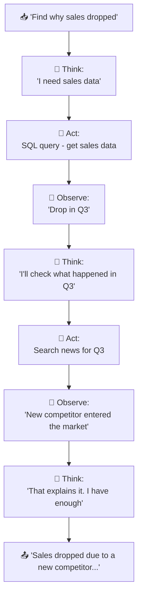

### ReAct Pattern (Reason + Act)

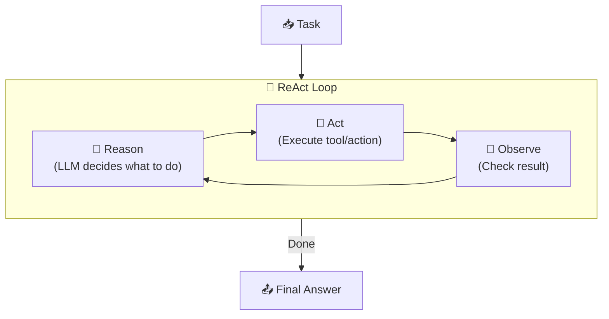

### Plan-and-Execute Pattern

An improvement over ReAct: the Agent **plans ahead** and then **executes** the plan:

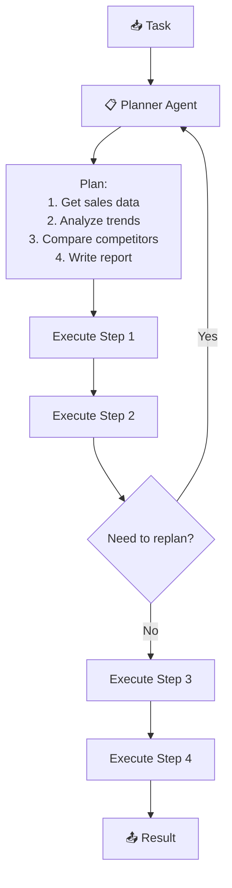

### Pros and Cons

| ✅ Pros | ❌ Cons |
|---------|---------|
| Very flexible | Unpredictable (non-deterministic) |
| Discovers things you didn't think of | Can get lost |
| Suitable for open-ended problems | High cost (many LLM calls) |
| | Hard to debug |
| | Requires strong guardrails |

---

## Sub-Agent Orchestration

### What is it?
A main Agent that delegates tasks to **specialist Agents**:

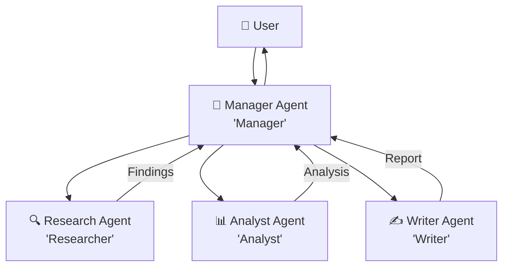

### Example: Writing an Article

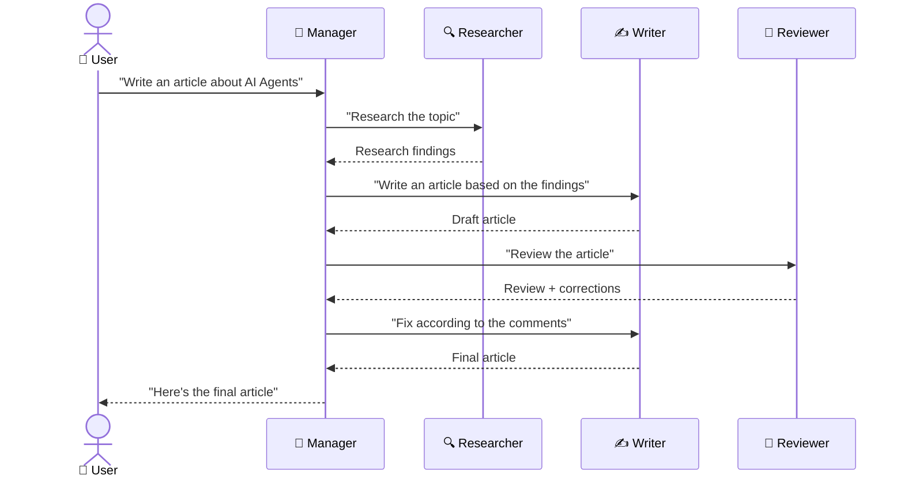

### Sub-Agent Patterns:

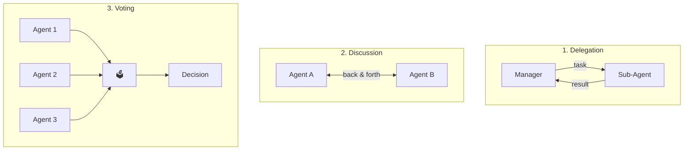

### Pros and Cons

| ✅ Pros | ❌ Cons |
|---------|---------|
| Each Agent specializes in its domain | Communication overhead |
| Scaling of experts | Multiple LLM calls = cost |
| Modularity - easy to replace an Agent | Complex management |
| Parallel execution possible | Debugging is hard |

---

## DAG Workflows

### What is a DAG?
**DAG = Directed Acyclic Graph** = a directed graph with no cycles.

Allows describing complex workflows with **dependencies** - "step X runs only after A and B finish":

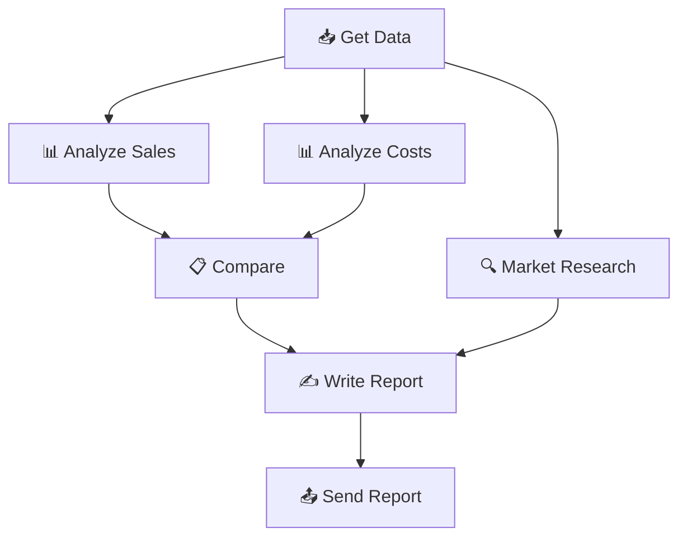

### Why DAG and not a list?

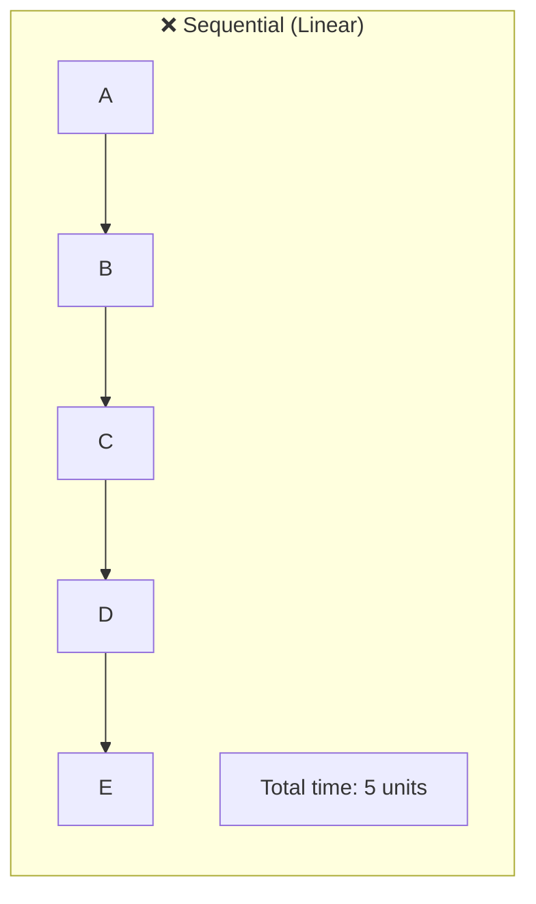

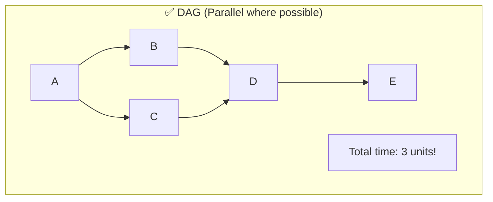

### DAG vs Sequential:

| Sequential | DAG |
|-----------|-----|
| A→B→C→D→E = 5 steps | A→(B,C parallel)→D→E = 3 steps |
| Simple | Fast |
| Each step depends on the previous one | Independent steps run in parallel |

---

## Advanced Patterns

### 1. Map-Reduce Pattern

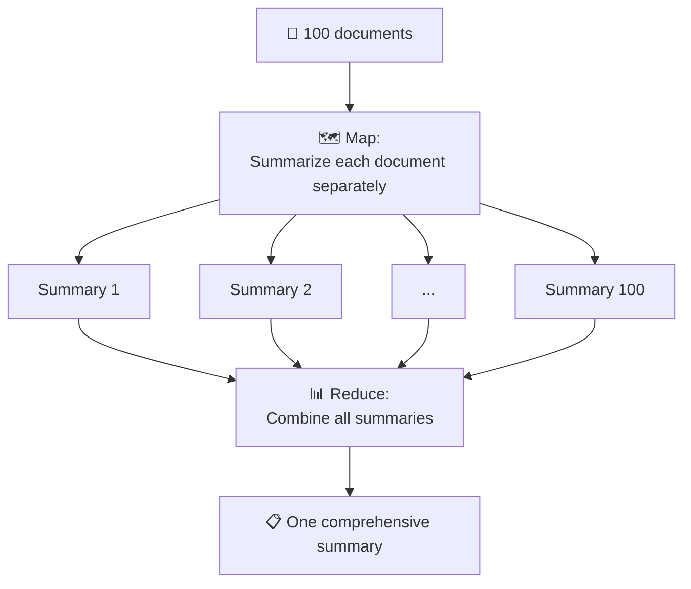

**Suitable for:** Summarizing many documents, analyzing datasets, aggregation

### 2. Supervisor Pattern

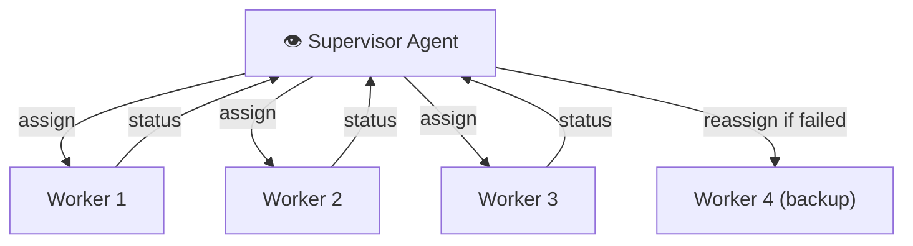

**Supervisor is responsible for:**
- Assigning tasks to Workers
- Tracking progress
- Handling failures (reassign)
- Deciding when everything is done

### 3. Critic Pattern

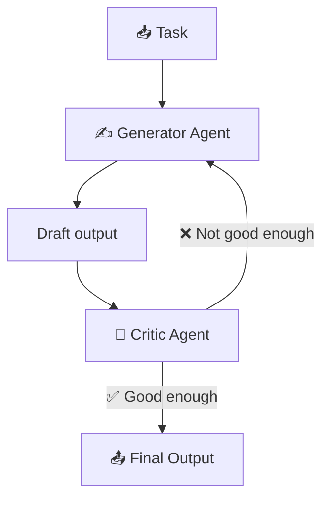

**Suitable for:** Writing, code, answers that require high quality

---

## Patterns Comparison

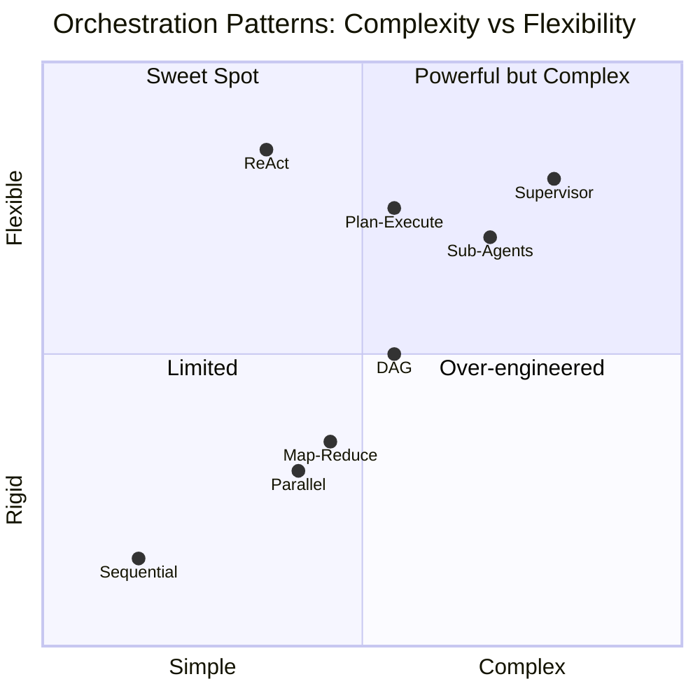

| Pattern | Suitable for | Complexity | Cost |
|---------|-------------|------------|------|
| **Sequential** | Simple pipelines | ⭐ | 💰 |
| **Parallel** | Multi-source search | ⭐⭐ | 💰💰 |
| **ReAct** | Open-ended problems | ⭐⭐ | 💰💰💰 |
| **Plan-Execute** | Complex tasks | ⭐⭐⭐ | 💰💰💰 |
| **Sub-Agents** | Team of experts | ⭐⭐⭐ | 💰💰💰💰 |
| **DAG** | Workflows with dependencies | ⭐⭐⭐ | 💰💰 |
| **Map-Reduce** | Bulk processing | ⭐⭐ | 💰💰💰 |
| **Supervisor** | Distributed systems | ⭐⭐⭐⭐ | 💰💰💰💰 |

---

## Summary

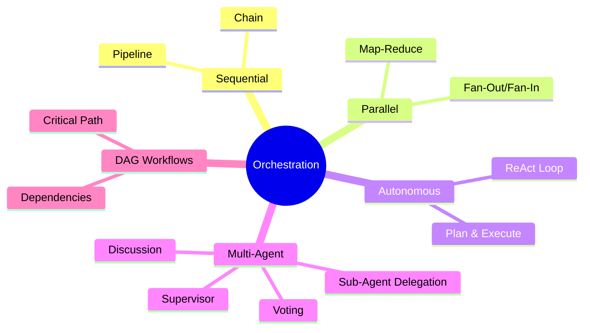

| What we learned | Key point |
|----------------|-----------|
| **Sequential** | Step after step - simple but slow |
| **Parallel** | Multiple operations in parallel - fast but complex |
| **Autonomous** | Agent decides on its own - flexible but unpredictable |
| **Sub-Agents** | Experts for each domain - modular but expensive |
| **DAG** | Dependency graph - balances between parallelism and order |
| **Map-Reduce** | Bulk data processing |
| **Supervisor** | Agent that manages workers |

---

## ❓ Self-Check Questions

1. What is the difference between Sequential and Parallel execution?
2. What is the ReAct Pattern? Describe the loop.
3. What is the advantage of Plan-and-Execute over ReAct?
4. When should you use Sub-Agents?
5. What is a DAG and why is it better than a list?
6. What is the Map-Reduce Pattern and when is it used?
7. What is the role of the Supervisor Agent?
8. Which Pattern is suitable for each situation: summarizing 100 documents? Searching 3 sources? Writing an article?

---

### 📝 Answers

1. What is the difference between Sequential and Parallel execution?

**Sequential** = steps run one after another. The output of step 1 feeds into step 2. Simple, but slow. **Parallel** = steps run simultaneously. Fast, but requires dependency management and fan-out/fan-in.

2. What is the ReAct Pattern? Describe the loop.

**ReAct (Reason + Act)** = a loop of: **Think** (the LLM analyzes what to do) → **Act** (invokes a tool / performs an action) → **Observe** (sees the result) → returns to Think until done. The Agent stops when it has no more actions to perform or reaches max steps.

3. What is the advantage of Plan-and-Execute over ReAct?

**ReAct** decides step by step - doesn't see the full picture. **Plan-and-Execute** first creates a **complete plan** and then executes step by step. Advantages: (1) higher efficiency, (2) fewer LLM calls (planning only once, each execution is separate), (3) each executor can be parallelized.

4. When should you use Sub-Agents?

When the task **consists of multiple different domains** (search + writing + analysis). Each sub-agent is an expert in one domain with a customized system prompt, tools, and model. A main Agent (Supervisor) routes to sub-agents and combines results.

5. What is a DAG and why is it better than a list?

**DAG (Directed Acyclic Graph)** = a directed graph with no cycles. Better than a list because: (1) enables **parallelism** - steps without dependencies run in parallel, (2) enables **complex dependencies** - A → B and also A → C in parallel, (3) ensures there are no **infinite loops**.

6. What is the Map-Reduce Pattern and when is it used?

**Map** = splitting a large task into many sub-tasks that run in parallel. **Reduce** = combining all results into one answer. Suitable for: summarizing 100 documents (Map: summarize each one | Reduce: combine into one summary), analysis of multiple tables.

7. What is the role of the Supervisor Agent?

**Supervisor Agent** = a main Agent that manages a team of Sub-Agents. It: (1) receives the task from the user, (2) decides which sub-agent to route to, (3) tracks results, (4) combines and returns a final answer. It is responsible for routing and quality.

8. Which Pattern is suitable for each situation?

- **Summarizing 100 documents** → **Map-Reduce**: Map summarizes each one, Reduce combines.
- **Searching 3 sources** → **Parallel + Fan-In**: 3 searches in parallel, combine results.
- **Writing an article** → **Plan-and-Execute**: first a plan (outline, research, draft, review) then sequential execution.

---

**[⬅️ Back to Chapter 6: Thread & State](06-thread-state-management.md)** | **[➡️ Continue to Chapter 8: Tools & Marketplace →](08-tools-marketplace.md)**
