# 🎛️ Chapter 8: Control Plane

> 🔗 **See it in production:** [Control Plane — Deep Dive (AI-Platform-System)](https://github.com/roie9876/AI-Platform-System#2-control-plane--deep-dive)

## Table of Contents
- [What is a Control Plane?](#what-is-a-control-plane)
- [Why Separate Control from Runtime?](#why-separate-control-from-runtime)
- [Control Plane Components](#control-plane-components)
- [API Gateway](#api-gateway)
- [Identity & Access Management](#identity--access-management)
- [Agent Registry](#agent-registry)
- [Configuration Management](#configuration-management)
- [Industry Tools & Frameworks](#industry-tools--frameworks)
- [Pros and Cons](#pros-and-cons)
- [Summary and Questions](#summary-and-questions)

---

## What is a Control Plane?

The **Control Plane** is the "management brain" of the platform. It **does not** run Agents - it **manages** them.

Think of it like a command center:

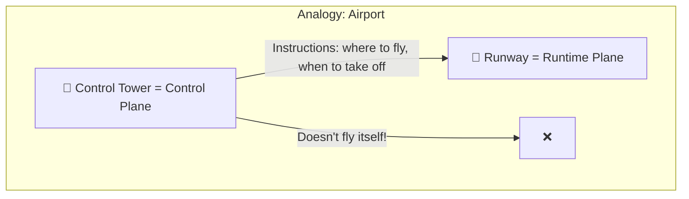

### What the Control Plane does:
- ✅ Defines **which Agents** exist
- ✅ Determines **who is authorized** to do what
- ✅ Defines **Policies** (rules)
- ✅ Manages the tools **Marketplace**
- ✅ Collects **metrics** and displays dashboards
- ✅ Runs **evaluations** on Agents

### What the Control Plane **does not** do:
- ❌ Does not send requests to LLMs
- ❌ Does not run tools
- ❌ Does not manage conversation memory in real-time
- ❌ Does not handle Function Calling invocations

---

## Why Separate Control from Runtime?

This is a fundamental architectural principle. The motivation:

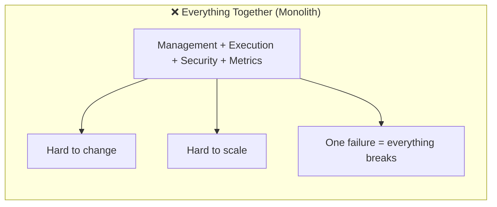

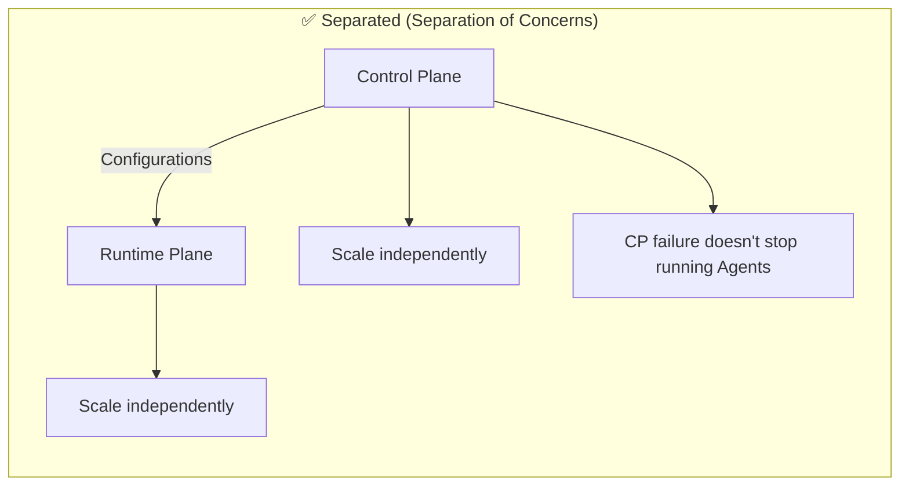

### Benefits of Separation:

The most immediate benefit you'll feel is **independent scaling**: on a busy Monday morning, you scale the Runtime Plane from 2 to 50 instances to handle traffic, while the Control Plane stays at 2 instances (it only handles admin operations). Without separation, you'd be scaling everything together — wasteful and expensive.

| Benefit | Explanation |
|---------|-------------|
| **Independent Scaling** | Runtime needs more resources? Scale only that part |
| **Fault Isolation** | If the dashboard goes down, Agents keep working |
| **Security Boundary** | The Control Plane is not exposed to code the Agent runs |
| **Development Velocity** | Different teams can work on each Plane independently |
| **Compliance** | Easier to demonstrate that "management" is separated from "execution" |

### Examples from the Software World:

| System | Control Plane | Data/Runtime Plane |
|--------|--------------|-------------------|
| **Kubernetes** | API Server, Scheduler, Controller Manager | Kubelets, Pods, Containers |
| **Networking (SDN)** | SDN Controller | Switches, Routers |
| **Database** | Schema management, User permissions | Query execution, Data storage |

---

## Control Plane Components

The Control Plane consists of several interconnected services. Each handles a specific management concern, and together they form the administrative backbone of the platform. The components below are covered in detail in the following sections. Not all are needed from day one — start with API Gateway + Identity + Agent Registry, and add others as you scale.

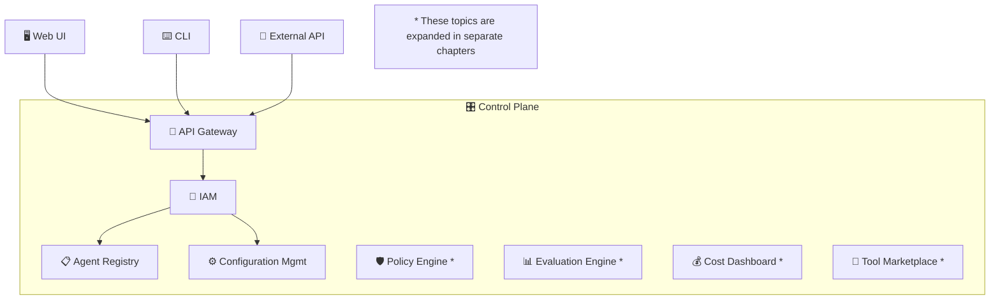

---

## API Gateway

### What is it?
An API Gateway is the **single entry point** to the platform. Every request - from the UI, CLI, or external API - passes through it.

### Why do we need a Gateway instead of accessing services directly?

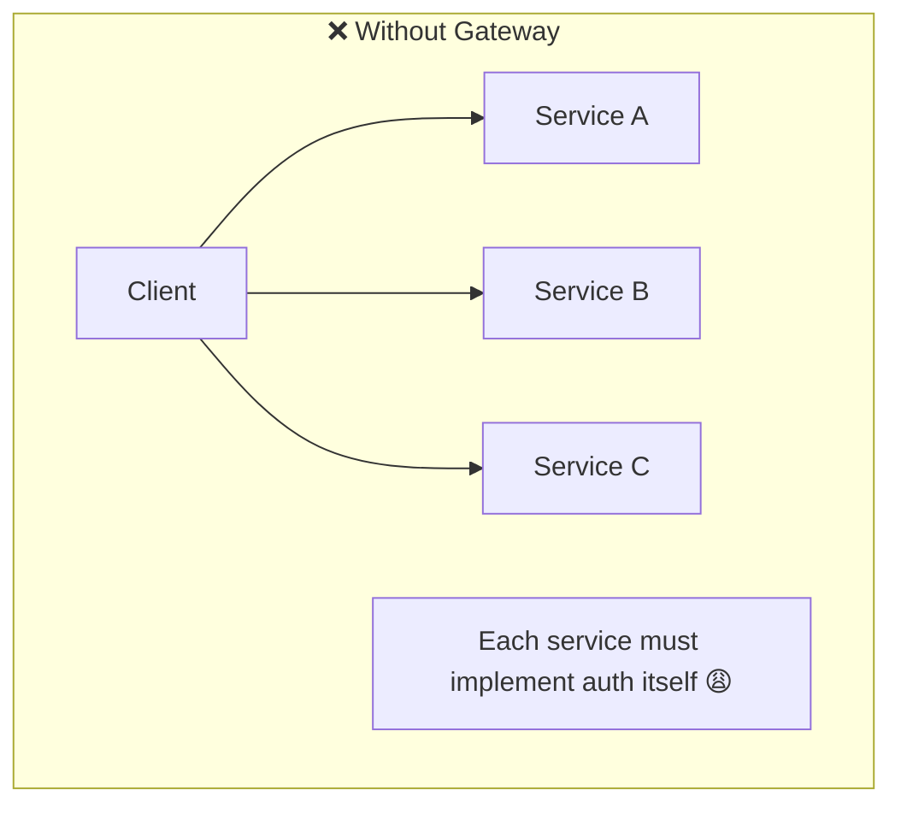

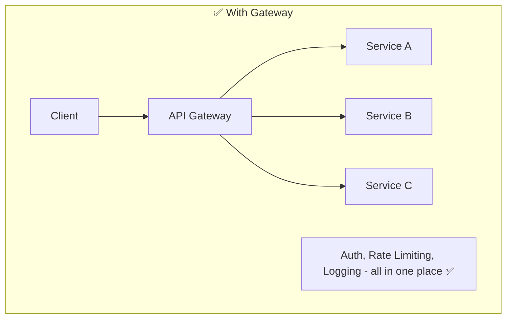

### API Gateway Responsibilities:

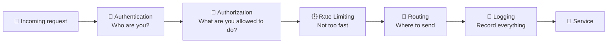

| Role | Explanation | Example |
|------|-------------|---------|
| **Authentication** | Identifies who is sending the request | JWT Token, API Key |
| **Authorization** | Checks if the user has permission | RBAC - "You're an Admin? Allowed" |
| **Rate Limiting** | Limits the number of requests | Maximum 100 requests per minute |
| **Request Routing** | Directs the request to the right service | POST /agents → Agent Service |
| **Load Balancing** | Distributes load across instances | Round-robin, Least connections |
| **Request/Response Transform** | Changes request/response format | Convert XML → JSON |
| **Caching** | Stores frequent responses | GET /agents (cache 60 sec) |
| **Logging & Telemetry** | Records every request | Timestamp, Duration, Status |

### API Gateway Pros and Cons

| ✅ Advantage | ❌ Disadvantage |
|-------------|----------------|
| Single entry point - simplicity | Single point of failure (SPOF) |
| Centralized authentication | Additional latency (extra hop) |
| Built-in Rate Limiting | Complexity in management and maintenance |
| Centralized Observability | Can become a bottleneck |

### How to address the disadvantages?
- **SPOF**: deploying multiple instances with load balancer
- **Latency**: lightweight gateway, proximity to services
- **Bottleneck**: horizontal scaling, caching

---

## Identity & Access Management (IAM)

### What is it?
IAM = **Who are you** (Authentication) + **What are you allowed to do** (Authorization)

### Authentication vs Authorization

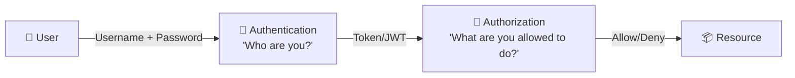

| Concept | Question | Example |
|---------|----------|---------|
| **Authentication (AuthN)** | Who are you? | Login with username/password → receives Token |
| **Authorization (AuthZ)** | What are you allowed to do? | Admin can delete an Agent, regular User can only view |

### RBAC - Role Based Access Control

In RBAC, you don't assign permissions directly to users. You assign a **Role**, and the Role has **Permissions**.

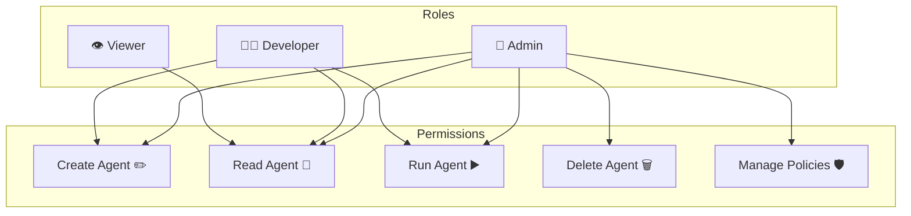

### Multi-Tenancy in IAM

When multiple teams/organizations use the same platform, **isolation** is required:

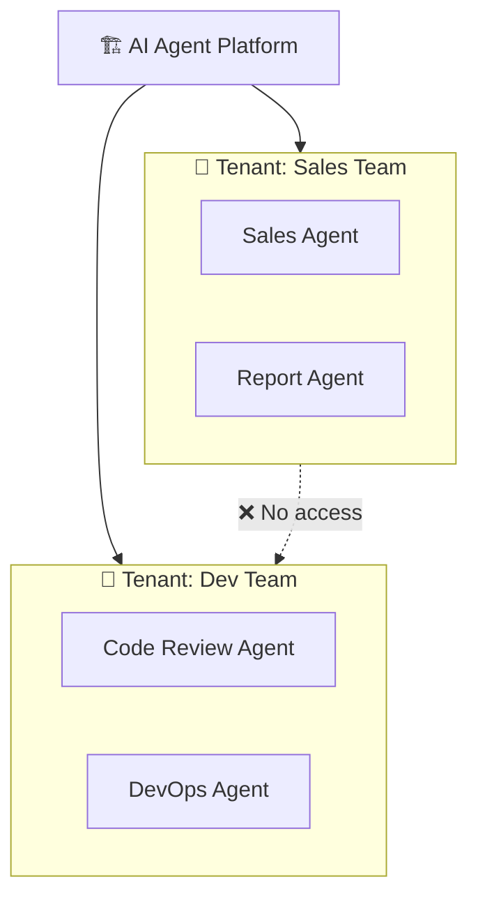

| Multi-Tenancy Model | Explanation | Pros | Cons |
|---------------------|-------------|------|------|
| **Shared DB, Shared Schema** | Everyone in the same DB, tenant_id column | Cheap, simple | Leakage risk, Noisy Neighbor |
| **Shared DB, Separate Schema** | Each tenant has its own schema | Better isolation | Complex schema management |
| **Separate DB** | Separate DB per tenant | Full isolation | Expensive, hard to manage |

---

## Agent Registry

### What is it?
The Agent Registry is the **central repository** where all Agent definitions are stored. Think of it as an "identity card" for each Agent.

### What is stored in the Registry?

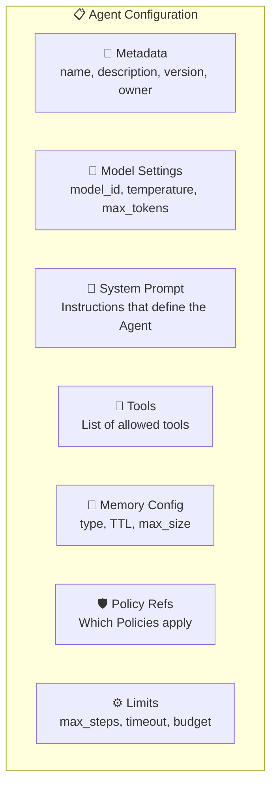

### Example Agent Definition Structure:

```
Agent: "Data Analyst"
├── id: agent-001
├── version: 2.1
├── owner: team-analytics
├── model:
│   ├── primary: gpt-4o
│   ├── fallback: gpt-3.5-turbo
│   └── temperature: 0.2
├── system_prompt: "You are a data analyst..."
├── tools:
│   ├── sql_query (read-only)
│   ├── python_executor
│   └── chart_generator
├── memory:
│   ├── short_term: last 20 messages
│   └── long_term: vector search on company docs
├── policies:
│   ├── no_pii_in_output
│   └── max_cost_per_run: $0.50
└── limits:
    ├── max_steps: 10
    ├── timeout: 120s
    └── max_tokens_per_run: 50000
```

### Versioning - Why is it Important?

Like code, Agents also need **version management**:

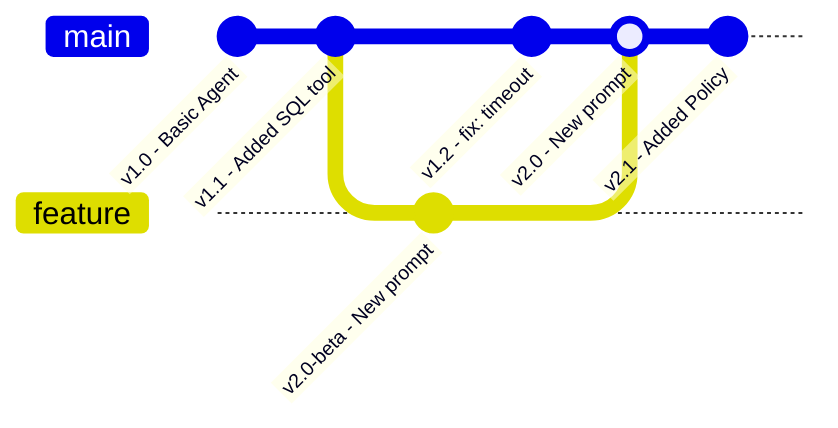

| Versioning Benefit | Explanation |
|--------------------|-------------|
| **Rollback** | If a new version doesn't work well, roll back |
| **A/B Testing** | Run two versions in parallel and compare |
| **Audit Trail** | Who changed what, and when |
| **Gradual Rollout** | Route 10% of traffic to the new version, then 50%, then 100% |

---

## Configuration Management

### What is it?
Managing all platform settings in a centralized, consistent, and controlled manner.

### Important Principles:

**Configuration as Code** is the most impactful principle here. When agent configs are stored as code (YAML/JSON in git), every change gets a code review, an audit trail, and the ability to rollback. This is critical for SOC2 compliance and for debugging "who changed what" when an agent starts misbehaving.

| Principle | Explanation |
|-----------|-------------|
| **Configuration as Code** | Settings are stored as code (YAML/JSON) in Git, not in the UI |
| **Separation of Config from Code** | The Agent's code doesn't change - only the settings do |
| **Environment-specific** | Different settings for Dev, Staging, Production |
| **Secrets Management** | API Keys, passwords are stored in a vault, not in config |

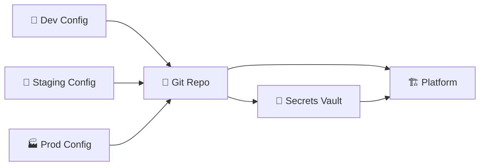

### Example: Agent Configuration File

Here's what a real Agent configuration looks like in YAML:

```yaml
# agent-config.yaml - Example Agent Definition
apiVersion: platform.ai/v1
kind: AgentDefinition
metadata:
  name: data-analyst
  namespace: team-analytics
  version: "1.3"
  labels:
    owner: analytics-team
    environment: production

spec:
  model:
    provider: azure-openai
    deployment: gpt-4o-main
    temperature: 0.2
    max_tokens: 50000

  system_prompt: |
    You are a data analyst specializing in sales data.
    Always cite the data source. Format numbers with commas.
    Never make up data - only use what tools return.

  tools:
    - name: sql_query
      permissions:
        read_only: true
        allowed_tables: [sales, products, customers]
    - name: chart_generator
      permissions:
        output_formats: [png, svg]

  memory:
    short_term:
      max_messages: 20
      ttl: "1h"
    long_term:
      type: vector_search
      index: "rag-sales-docs"
      top_k: 5

  policies:
    - no-pii-output        # DLP policy reference
    - max-cost-daily-50     # Budget limit

  limits:
    max_steps: 10           # Max ReAct loop iterations
    timeout_seconds: 120    # Max request duration
    max_tokens_per_request: 100000
```

### Environment Overrides

```yaml
# overrides/production.yaml
spec:
  model:
    deployment: gpt-4o-prod  # Different deployment in prod
    temperature: 0.1          # More deterministic in prod
  limits:
    max_steps: 8              # Stricter in prod
    timeout_seconds: 60
```

```yaml
# overrides/development.yaml
spec:
  model:
    deployment: gpt-4o-mini-dev  # Cheaper model for dev
    temperature: 0.7              # More creative for testing
  limits:
    max_steps: 20                 # More lenient for dev
    timeout_seconds: 300
```

---

## Request Flow Through the Control Plane

Here's what happens when a user creates a new Agent:

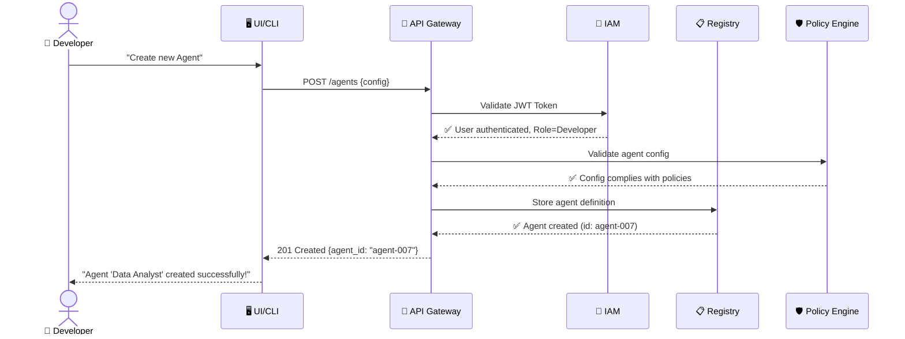

---

## Industry Tools & Frameworks

### Control Plane Components — What the Industry Uses

| Component | Azure | Open Source / Third-Party |
|-----------|-------|--------------------------|
| **API Gateway** | Azure API Management | Kong, Envoy, Traefik, NGINX |
| **Identity & Access** | Microsoft Entra ID (Azure AD) | Keycloak, Auth0, Okta |
| **Agent Registry** | Azure AI Foundry Model Catalog | Custom (DB + API), MLflow Model Registry |
| **Configuration Mgmt** | Azure App Configuration | HashiCorp Consul, etcd, Spring Cloud Config |
| **Cost Dashboard** | Azure Cost Management | Helicone, Portkey, custom Grafana dashboards |
| **Policy Engine** | Azure API Management policies | OPA (Open Policy Agent), custom middleware |
| **Secrets** | Azure Key Vault | HashiCorp Vault, AWS Secrets Manager |

### Why Separate Control from Runtime? — Real-World Scenario

Imagine your agent platform with 15 agents, 50 tools, and 200 users. Without a control plane:

```
Problem: You need to disable Agent X because it's hallucinating.

Without Control Plane:
  → SSH into each server
  → Find the agent config file
  → Comment it out
  → Restart the service
  → Hope you didn't break something
  → Repeat for every server
  → 45 minutes to disable one agent

With Control Plane:
  → Open the Agent Registry dashboard
  → Toggle Agent X to "disabled"
  → All servers pick up the change automatically
  → 10 seconds, zero downtime
```

The Control Plane is the **management dashboard** for your entire platform. It's what makes the difference between "we can build agents" and "we can operate agents at scale."

---

## Pros and Cons

### ✅ Control Plane Advantages

| Advantage | Explanation |
|-----------|-------------|
| **Centralized Management** | One place to view and manage all Agents |
| **Governance** | Enforcement of rules and policies |
| **Audit Trail** | Full documentation of every change |
| **Self-Service** | Teams can create Agents themselves through the UI |
| **Standardization** | All Agents are defined in the same format |

### ❌ Challenges

| Challenge | Explanation | Solution |
|-----------|-------------|----------|
| **SPOF** | If the CP goes down, management is impossible | High Availability, Multi-region |
| **Consistency** | Registry changes need to reach the Runtime | Event-driven propagation |
| **Complexity** | Many components to manage | Infrastructure as Code |
| **Latency** | Every request passes through Gateway + Auth | Caching, Edge deployment |

---

## Summary

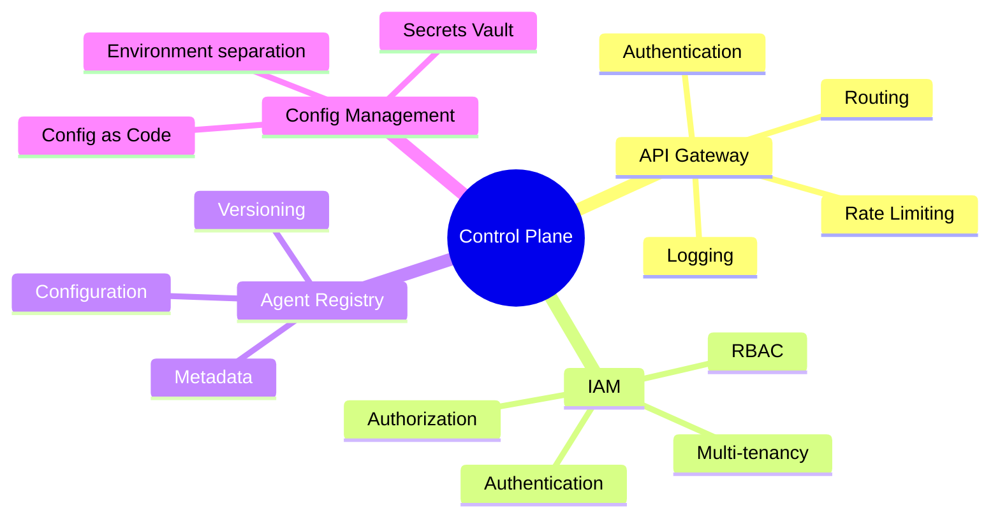

| What We Learned | Key Point |
|----------------|-----------|
| **Control Plane** | Management layer - doesn't run Agents, manages them |
| **Separation** | Separating Control from Runtime enables Scaling and fault isolation |
| **API Gateway** | Single entry point - authentication, Rate Limiting, Routing |
| **IAM** | Authentication (who are you) + Authorization (what are you allowed to do) |
| **RBAC** | Permissions through roles, not directly to users |
| **Registry** | "Identity card" for each Agent - all settings in one place |
| **Versioning** | Versions enable Rollback, A/B Testing, Audit |

---

## ❓ Self-Check Questions

1. What are the two main responsibilities of the Control Plane?
2. What is the difference between Authentication and Authorization? Give an example.
3. Why do we need an API Gateway? What happens without one?
4. What is RBAC and how does it work?
5. Why is Agent Configuration Versioning important?
6. Describe the flow of creating a new Agent (who calls whom).
7. What are the three Multi-Tenancy models and what is the advantage of each?

---

### 📝 Answers

<details>
<summary>1. What are the two main responsibilities of the Control Plane?</summary>

1. **Management** - Defining Agents, registering tools and models, managing policies and permissions.
2. **Configuration** - Storing settings, versioning, managing tenants and setting platform usage rules.
</details>

<details>
<summary>2. What is the difference between Authentication and Authorization? Give an example.</summary>

**Authentication (AuthN)** = "Who are you?" - Identity verification (login, token). **Authorization (AuthZ)** = "What are you allowed to do?" - Permission checking. Example: roi@company.com logs in with a password (AuthN ✅), but is not authorized to delete Agents because they have a viewer role (AuthZ ❌).
</details>

<details>
<summary>3. Why do we need an API Gateway? What happens without one?</summary>

An API Gateway provides: rate limiting, authentication, routing, logging, TLS termination, and versioning. **Without it**: every service must implement all of these on its own → duplications, security holes, no centralized traffic control, difficult to track and limit usage.
</details>

<details>
<summary>4. What is RBAC and how does it work?</summary>

**RBAC (Role-Based Access Control)** = A role-based permission system. Each user is assigned a **Role** (admin, developer, viewer), and each Role defines which **Permissions** it has (create agent, read data, delete). Instead of defining permissions per user, you define per role → simpler to manage.
</details>

<details>
<summary>5. Why is Agent Configuration Versioning important?</summary>

1. **Rollback** - If an update breaks something, you can revert to a previous version.
2. **Audit** - Knowing who changed what and when.
3. **A/B Testing** - Comparing performance between versions.
4. **Reproducibility** - Reproducing exactly the behavior of an Agent at a specific point in time.
</details>

<details>
<summary>6. Describe the flow of creating a new Agent.</summary>

1. **Developer** sends a POST /agents request to the **API Gateway**.
2. Gateway performs **Authentication** (who is this?) and **Authorization** (authorized to create?).
3. The request reaches the **Agent Registry** which validates the schema.
4. **Config Manager** saves the settings.
5. **Policy Engine** verifies the Agent complies with rules.
6. Agent is registered and ready for use in the Runtime Plane.
</details>

<details>
<summary>7. What are the three Multi-Tenancy models and what is the advantage of each?</summary>

1. **Shared Everything** - All tenants share everything (DB, compute). Advantage: **Low cost**. Disadvantage: Noisy Neighbor.
2. **Shared Infra, Isolated Data** - Shared compute but separate DB/namespace per tenant. Advantage: **Cost-security balance**.
3. **Fully Isolated** - Each tenant in a completely separate environment. Advantage: **Maximum security**. Disadvantage: Very expensive.
</details>

---

> 🔗 **See it in production:** [Control Plane — Deep Dive (AI-Platform-System)](https://github.com/roie9876/AI-Platform-System#2-control-plane--deep-dive)

**[⬅️ Back to Chapter 7: Policy & Governance](07-policy-governance.md)** | **[➡️ Continue to Chapter 9: Runtime Plane →](09-runtime-plane.md)**
