# 🛡️ Chapter 9: Policy & Governance Engine

## Table of Contents
- [What is a Policy Engine?](#what-is-a-policy-engine)
- [Why Do We Need Governance?](#why-do-we-need-governance)
- [Types of Policies](#types-of-policies)
- [Policy Enforcement Points](#policy-enforcement-points)
- [Guardrails](#guardrails)
- [Content Safety](#content-safety)
- [Data Loss Prevention (DLP)](#data-loss-prevention-dlp)
- [Audit & Compliance](#audit--compliance)
- [Pros and Cons](#pros-and-cons)
- [Summary and Questions](#summary-and-questions)

---

## What is a Policy Engine?

**Policy Engine** = A rules system that defines **what is allowed and what is forbidden** for Agents to do.

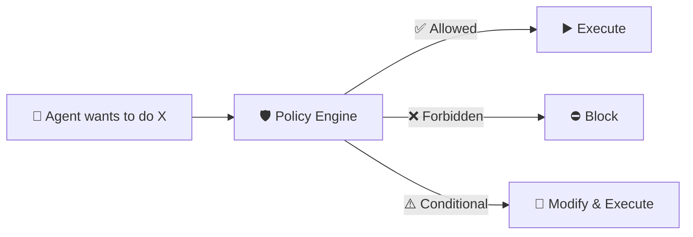

### Analogy:

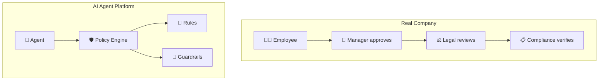

---

## Why Do We Need Governance?

### Without Governance:

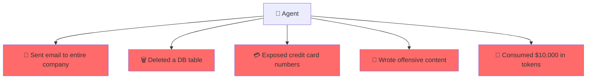

### With Governance:

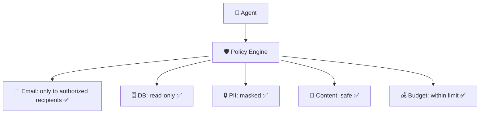

---

## Types of Policies

### 1. Access Policies (Who is authorized)

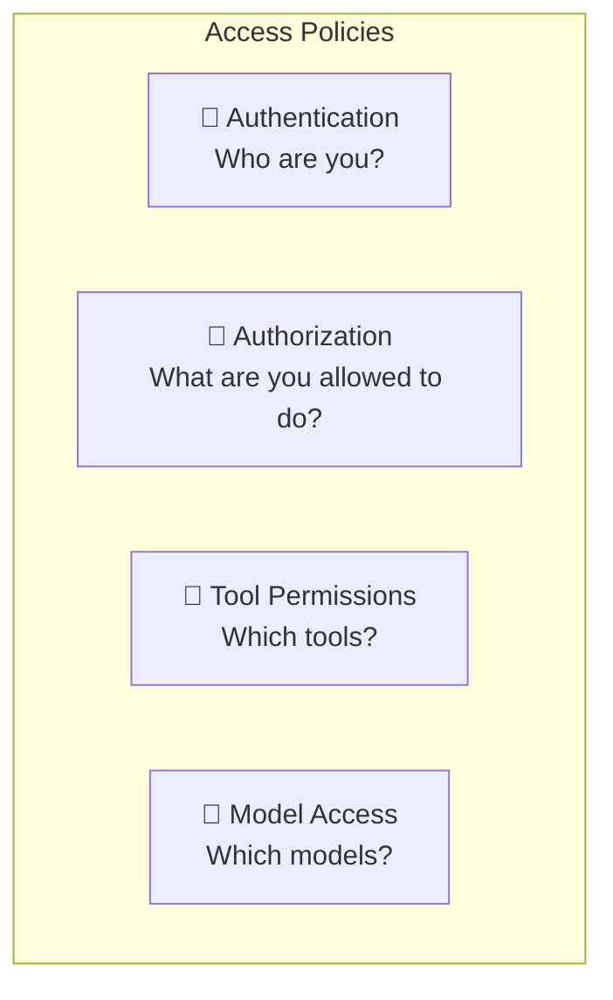

| Policy | Example |
|--------|---------|
| Agent Access | "Only the Analytics team can create Data Agents" |
| Tool Access | "This Agent is only authorized to use search and sql_read" |
| Model Access | "Only approved Agents can use GPT-4o" |
| Data Access | "Agent sees only data from its own tenant" |

### 2. Usage Policies (How much is allowed)

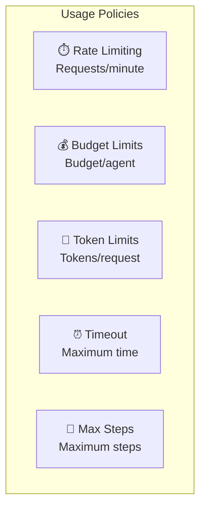

| Policy | Example |
|--------|---------|
| Rate Limit | "Maximum 100 requests/minute per agent" |
| Budget | "Maximum $50/day per tenant" |
| Token Limit | "Maximum 50K tokens per request" |
| Timeout | "Agent must finish within 120 seconds" |
| Max Steps | "Maximum 10 tool calls per request" |

### 3. Content Policies (What is allowed to say)

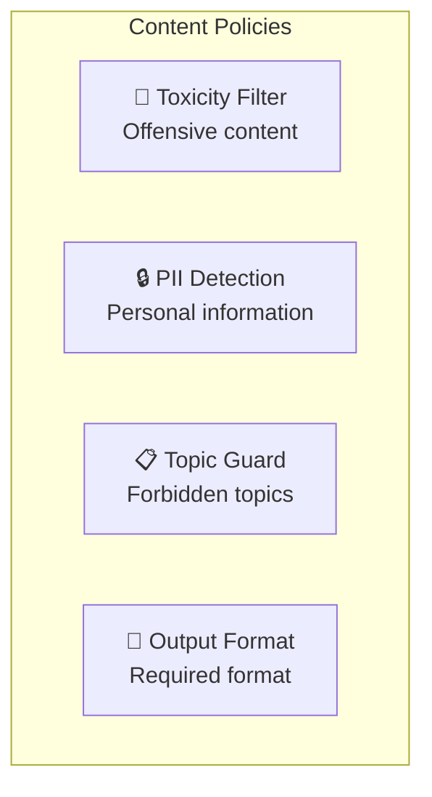

### 4. Operational Policies (How to operate)

| Policy | Example |
|--------|---------|
| Logging | "Every tool call must be documented" |
| Approval | "Sending email requires human approval" |
| Fallback | "If Agent fails 3 times, transfer to a human agent" |
| SLA | "Maximum response time: 5 seconds" |

---

## Policy Enforcement Points

### Where are Policies enforced?

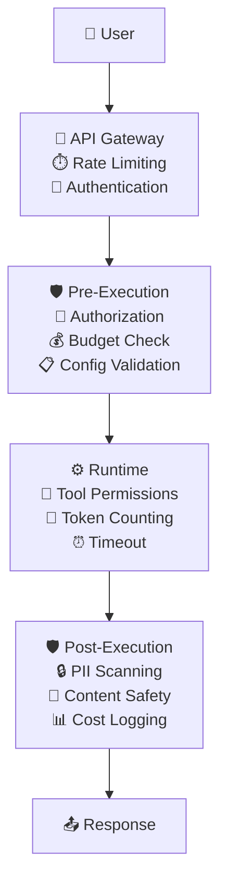

### Pre-Execution Policies (Before execution):

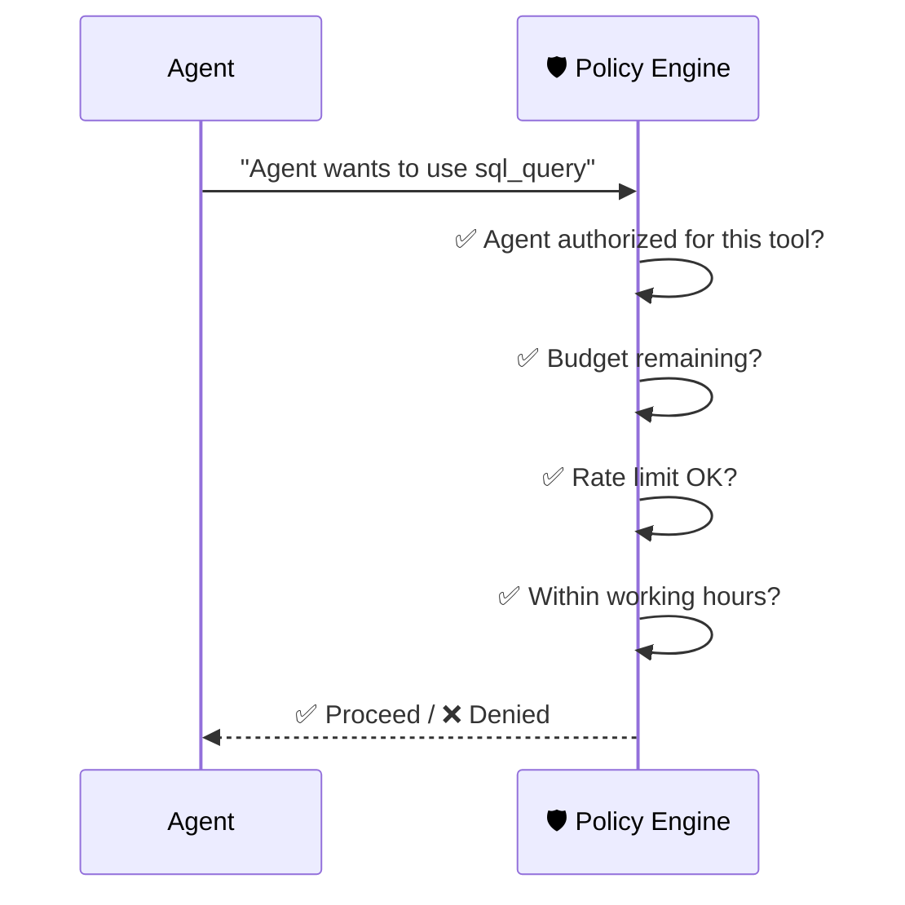

### Runtime Policies (During execution):

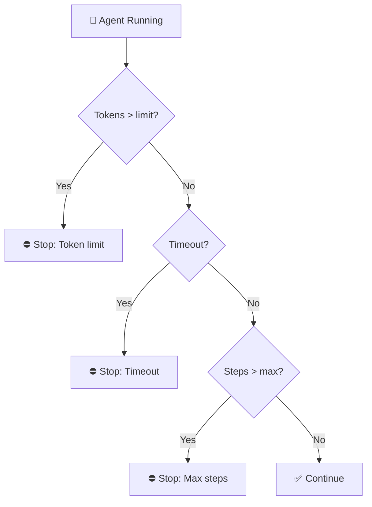

### Post-Execution Policies (After execution):

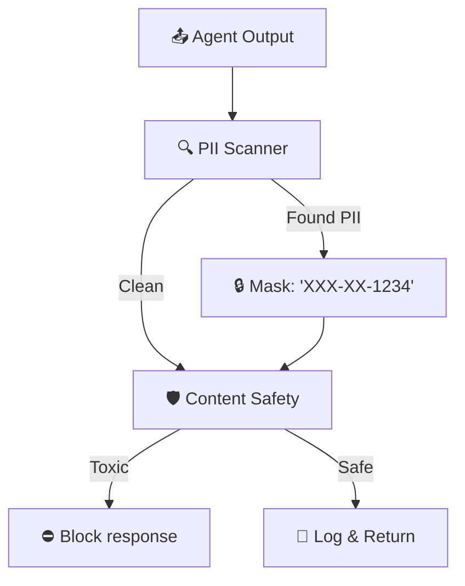

---

## Guardrails

### What are Guardrails?
**Guardrails** = Protection mechanisms that ensure the Agent stays "on track" and doesn't do unwanted things.

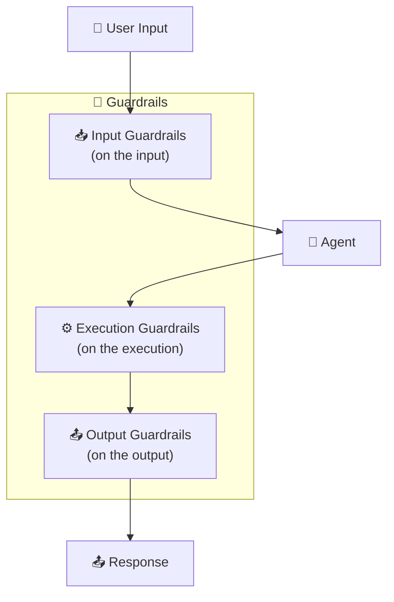

### Input Guardrails:

| Guardrail | What it checks | Example |
|-----------|---------------|---------|
| **Prompt Injection Detection** | Attempt to trick the Agent | "Ignore all previous instructions..." |
| **Topic Boundary** | Question outside the domain | Financial Agent asked a medical question |
| **Language Detection** | Unsupported language | Request in an unsupported language |
| **Input Length** | Input too long | Prompt length limitation |

### Output Guardrails:

| Guardrail | What it checks | Example |
|-----------|---------------|---------|
| **PII Detection** | Personal information in output | ID numbers, credit cards |
| **Toxicity Filter** | Offensive content | Racism, violence |
| **Hallucination Check** | Incorrect facts | Cross-referencing with sources |
| **Format Validation** | Output in wrong format | Invalid JSON |

### Execution Guardrails:

| Guardrail | What it checks |
|-----------|---------------|
| **Max Iterations** | Agent doesn't get stuck in a loop |
| **Allowed Tools** | Agent only uses authorized tools |
| **Network Access** | Agent doesn't access forbidden addresses |
| **Resource Limits** | CPU, Memory, Disk don't exceed limits |

---

## Content Safety

### What is it?
A mechanism that ensures the content the Agent generates is **safe, respectful, and not harmful**.

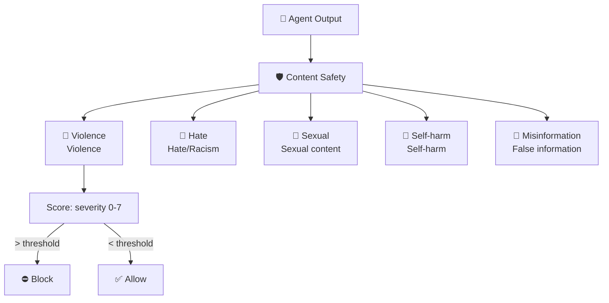

### Multi-Layer Content Safety:

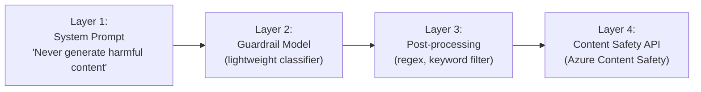

---

## Data Loss Prevention (DLP)

### What is it?
**DLP** = Prevention of sensitive information leakage. Ensuring the Agent doesn't reveal:
- Credit card numbers
- ID numbers / SSN
- Passwords
- Medical information
- Confidential business information

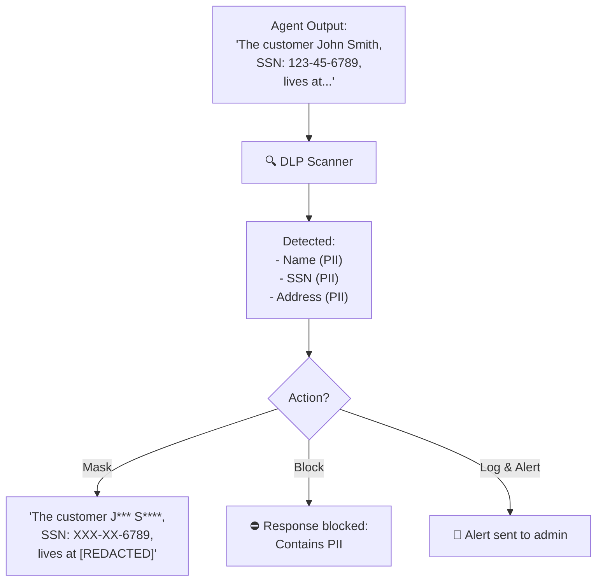

### DLP Strategies:

| Strategy | Explanation | When |
|----------|------------|------|
| **Block** | Block the response entirely | Severe PII (SSN, credit card) |
| **Mask** | Mask the sensitive information | Names, addresses |
| **Tokenize** | Replace with an encrypted token | Internal identifiers |
| **Log & Alert** | Log and send an alert | Doesn't block, but alerts |

---

## Audit & Compliance

### What is an Audit Trail?
Documentation of **every action** that every Agent performed - who, what, when, and why.

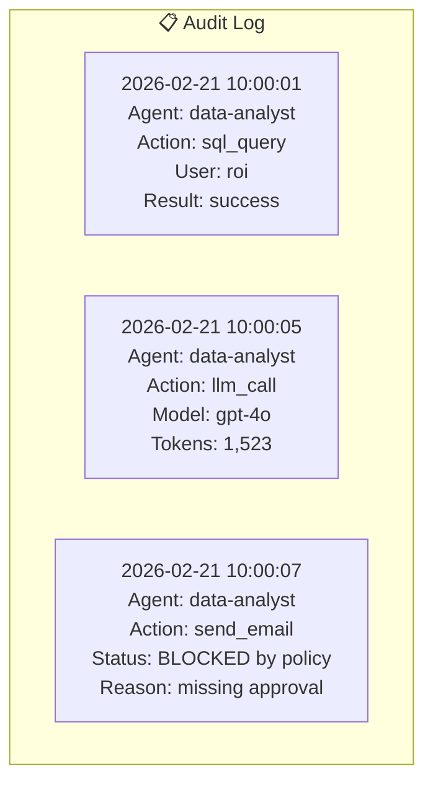

### Compliance Requirements:

| Standard | Explanation | Key Requirements |
|----------|------------|-----------------|
| **GDPR** | European data protection | Right to be forgotten, consent |
| **SOC 2** | Information security | Logging, access control |
| **HIPAA** | Medical information | Encryption, audit trail |
| **PCI-DSS** | Credit cards | PII masking, encryption |

### Policy as Code

Like Infrastructure as Code, Policies also need to be **defined as code**:

```
policy:
  name: "data-analyst-policy"
  version: "1.2"
  rules:
    - name: "read-only-db"
      description: "SQL queries must be read-only"
      target: tool.sql_query
      condition: "query NOT CONTAINS 'DELETE|DROP|UPDATE|INSERT'"
      action: BLOCK
      
    - name: "budget-limit"
      description: "Max $5 per day"
      target: agent.cost
      condition: "daily_cost > 5.00"
      action: BLOCK
      
    - name: "pii-masking"
      description: "Mask PII in output"
      target: agent.output
      condition: "contains_pii(output)"
      action: MASK
```

---

## Pros and Cons

| ✅ Advantage | ❌ Disadvantage |
|-------------|----------------|
| Prevention of unauthorized use | Additional latency (policy checking) |
| Cost control | Complexity in managing rules |
| Automatic Compliance | False positives (blocks legitimate things) |
| Full audit trail | Requires ongoing updates |
| Protection against PII leaks | User experience - Agent is limited |
| Consistent enforcement | Policy conflicts |

---

## Summary

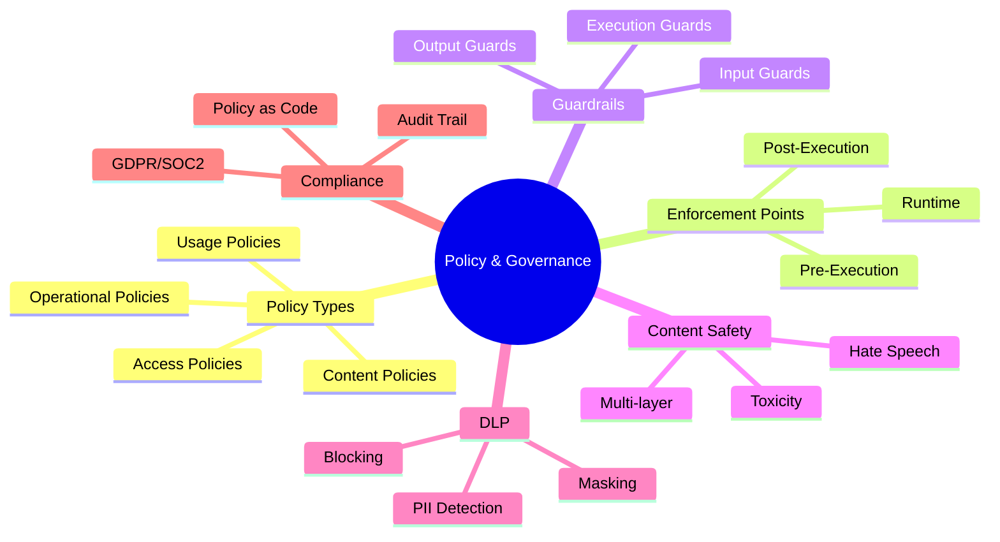

| What We Learned | Key Point |
|----------------|-----------|
| **Policy Engine** | A rules system that determines what is allowed and what is forbidden |
| **Guardrails** | Input, Output, Execution - three layers of protection |
| **Content Safety** | Filtering offensive content |
| **DLP** | Prevention of sensitive information leakage (PII) |
| **Audit Trail** | Documentation of every action for Compliance purposes |
| **Policy as Code** | Policies defined as code, not manually |

---

## ❓ Self-Assessment Questions

1. What are the 4 types of Policies?
2. What is the difference between Pre-Execution and Post-Execution policy?
3. What are Guardrails and what 3 types exist?
4. What is Prompt Injection and how do you defend against it?
5. What is DLP and what handling strategies exist (Block, Mask, etc.)?
6. Why is Audit Trail important?
7. What is Policy as Code and why is it better than manual configuration?

---

### 📝 Answers

<details>
<summary>1. What are the 4 types of Policies?</summary>

1. **Safety Policies** - Prevention of harmful/violent/dangerous content.
2. **Compliance Policies** - Meeting regulations (GDPR, HIPAA).
3. **Business Policies** - Business rules (budget, max cost).
4. **Operational Policies** - Rate limiting, resource monitoring.
</details>

<details>
<summary>2. What is the difference between Pre-Execution and Post-Execution policy?</summary>

**Pre-Execution** = Checked **before** the request reaches the LLM. For example: prompt injection filtering, PII checking in input. If it fails → the request is blocked. **Post-Execution** = Checked **after** the LLM returns a response. For example: PII checking in the response, content safety, groundedness check.
</details>

<details>
<summary>3. What are Guardrails and what 3 types exist?</summary>

**Guardrails** = "Safety fences" that prevent the Agent from deviating from the path. 3 types: (1) **Input Guardrails** - Filtering and validation of input, (2) **Output Guardrails** - Filtering the LLM's response, (3) **Topical Guardrails** - Preventing the Agent from going outside its domain ("don't answer about politics").
</details>

<details>
<summary>4. What is Prompt Injection and how do you defend against it?</summary>

**Prompt Injection** = An attacker injects instructions in input that impersonate a system prompt ("ignore all previous instructions"). Defense: (1) **Input Validation** - Pattern recognition, (2) **Prompt Sandboxing** - Separation between system and user, (3) **Classifier Models** - A separate model that detects injection.
</details>

<details>
<summary>5. What is DLP and what handling strategies exist?</summary>

**DLP (Data Loss Prevention)** = Prevention of sensitive information leakage (PII, secrets, credit cards). Strategies: (1) **Block** - Completely blocks if there's PII, (2) **Mask** - Replaces with asterisks ("***-**-1234"), (3) **Tokenize** - Replaces with a token and returns after processing, (4) **Log & Alert** - Allows but documents.
</details>

<details>
<summary>6. Why is Audit Trail important?</summary>

**Audit Trail** = Full documentation of every action the Agent performed (who, what, when, result). Important for: (1) **Regulation** - GDPR/HIPAA require documentation, (2) **Debug** - Understanding where the Agent reached a decision, (3) **Accountability** - Knowing who did what, (4) **Improvement** - Identifying misuse.
</details>

<details>
<summary>7. What is Policy as Code and why is it better than manual configuration?</summary>

**Policy as Code** = Defining policies in code (YAML/JSON/Rego) instead of manual UI. Better because: (1) **Version Control** - Saved in Git, has history and rollback, (2) **CI/CD** - Automatically tested in pipeline, (3) **Reproducibility** - Same policy in all environments, (4) **Automation** - No human errors.
</details>

---

**[⬅️ Back to Chapter 8: Tools](08-tools-marketplace.md)** | **[➡️ Continue to Chapter 10: Evaluation Engine →](10-evaluation-engine.md)**
