# ⚙️ Chapter 9: Runtime (Data) Plane

> 🔗 **See it in production:** [Runtime Plane — Deep Dive (AI-Platform-System)](https://github.com/roie9876/AI-Platform-System#3-runtime-plane--deep-dive)

## Table of Contents
- [What is the Runtime Plane?](#what-is-the-runtime-plane)
- [The Difference Between Control and Runtime](#the-difference-between-control-and-runtime)
- [Request Lifecycle](#request-lifecycle)
- [Runtime Plane Components](#runtime-plane-components)
- [The Orchestrator](#the-orchestrator)
- [Execution Models](#execution-models)
- [Secure Execution - Sandboxing](#secure-execution---sandboxing)
- [Industry Tools & Frameworks](#industry-tools--frameworks)
- [Advantages and Disadvantages](#advantages-and-disadvantages)
- [Summary and Questions](#summary-and-questions)

---

## What is the Runtime Plane?

The **Runtime Plane** (also called Data Plane) is where the Agent **actually works**. This is where all the "live" things happen: LLM calls, tool execution, memory management, and building responses.

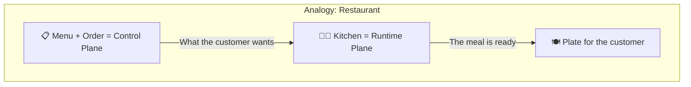

### In short:
- **Control Plane** = "What to do?" (configurations, Policies, Registry)
- **Runtime Plane** = "Doing it!" (execution, LLM calls, tools)

---

## The Difference Between Control and Runtime

Here's a simple test: if the Control Plane goes down, existing agents keep running (users won't notice immediately). If the Runtime Plane goes down, all conversations stop instantly. The Control Plane manages; the Runtime Plane executes.

| Property | 🎛️ Control Plane | ⚙️ Runtime Plane |
|--------|-----------------|-----------------|
| **Purpose** | Management and configuration | Execution and processing |
| **Traffic** | Low (configuration) | High (user requests) |
| **Required Latency** | Not critical (seconds OK) | Critical (milliseconds) |
| **Scaling** | Minimal | Aggressive (thousands of requests/sec) |
| **Stateful/Stateless** | Mostly Stateless | Stateful (Thread, Memory) |
| **Failure** | "Can't manage" | "Agents aren't working" |
| **Examples** | Registry, IAM, Policy | Orchestrator, LLM calls, Tools |

---

## Request Lifecycle

Here's what happens from the moment a user sends a request to an Agent until they receive a response:

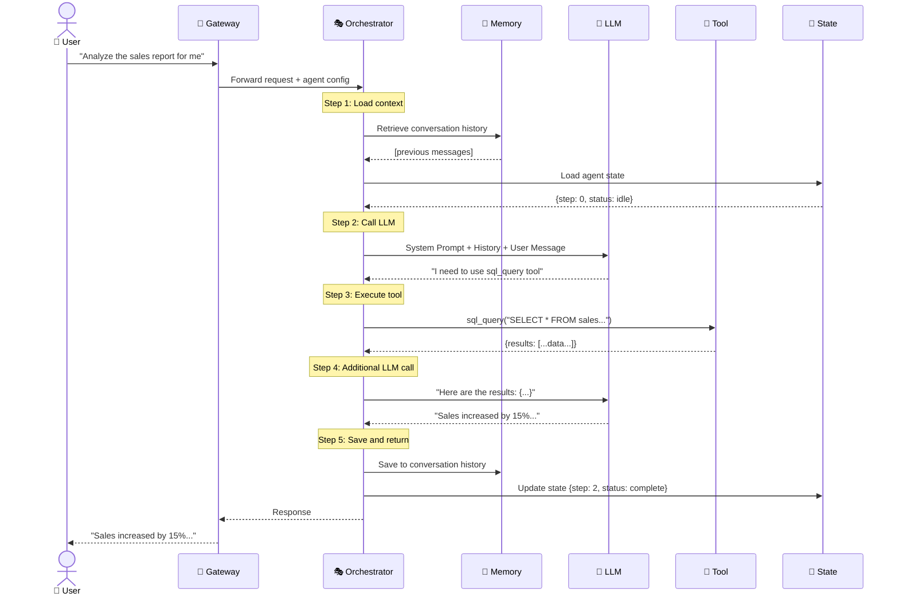

### Request Structure at Each Step:

```
Request Lifecycle:
│
├── 1. 📥 RECEIVE
│   ├── Parse user input
│   ├── Identify target agent
│   └── Load agent configuration from Registry
│
├── 2. 📚 CONTEXT BUILDING
│   ├── Load conversation history (Short-term Memory)
│   ├── Retrieve relevant docs (Long-term Memory / RAG)
│   ├── Load agent state
│   └── Build full prompt
│
├── 3. 🧠 LLM INFERENCE
│   ├── Send prompt to Model Router
│   ├── Model Router selects best model
│   └── Get LLM response
│
├── 4. 🔍 PARSE & DECIDE
│   ├── Is it a final answer? → Go to step 6
│   ├── Is it a tool call? → Go to step 5
│   └── Is it a sub-agent call? → Spawn sub-agent
│
├── 5. 🔧 TOOL EXECUTION
│   ├── Validate tool is allowed (Policy check)
│   ├── Execute in sandbox
│   ├── Capture result
│   └── Go back to step 3 (with tool result)
│
└── 6. 📤 RESPOND
    ├── Format response
    ├── Save to memory
    ├── Update state
    ├── Log metrics (tokens, latency, cost)
    └── Return to user
```

---

## Runtime Plane Components

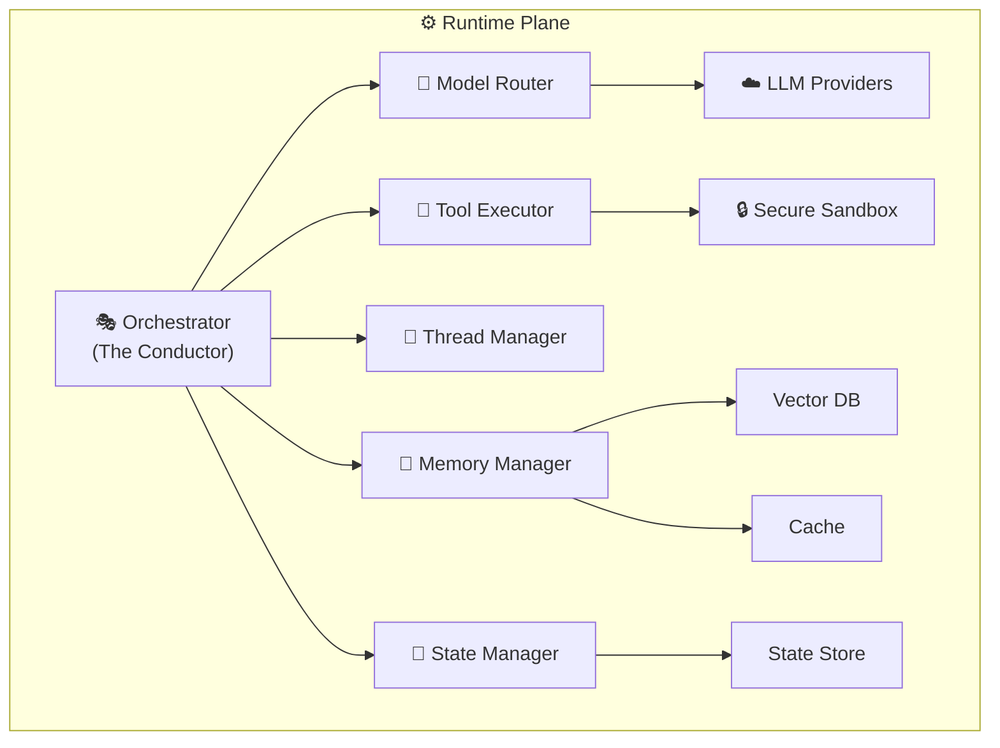

| Component | Role | Extended Chapter |
|------|--------|-----------|
| **Orchestrator** | Manages the execution flow, decides when to call the LLM and when to call tools | Chapter 7 |
| **Model Router** | Selects which LLM to use for each request | Chapter 4 |
| **Memory Manager** | Manages short/long-term memory | Chapter 5 |
| **Thread Manager** | Manages conversations and context | Chapter 6 |
| **State Manager** | Saves state of long-running workflows | Chapter 6 |
| **Tool Executor** | Runs tools in a secure environment | Chapter 8 |

---

## The Orchestrator

The Orchestrator is the **heart** of the Runtime Plane. It is the "conductor" that coordinates between all the components.

### Responsibilities:

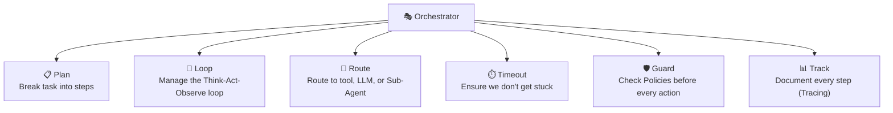

### The Orchestrator's Internal Loop:

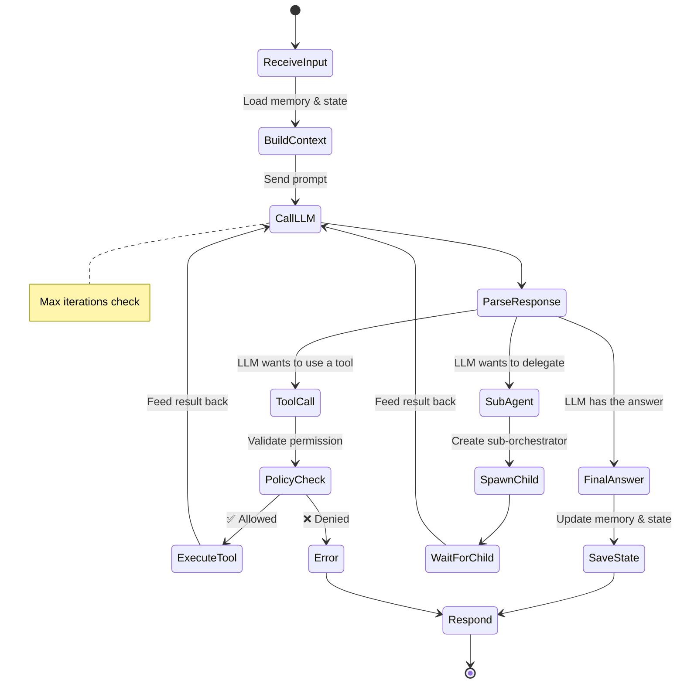

### Max Steps / Circuit Breaker

Problem: What if the Agent enters an infinite loop?

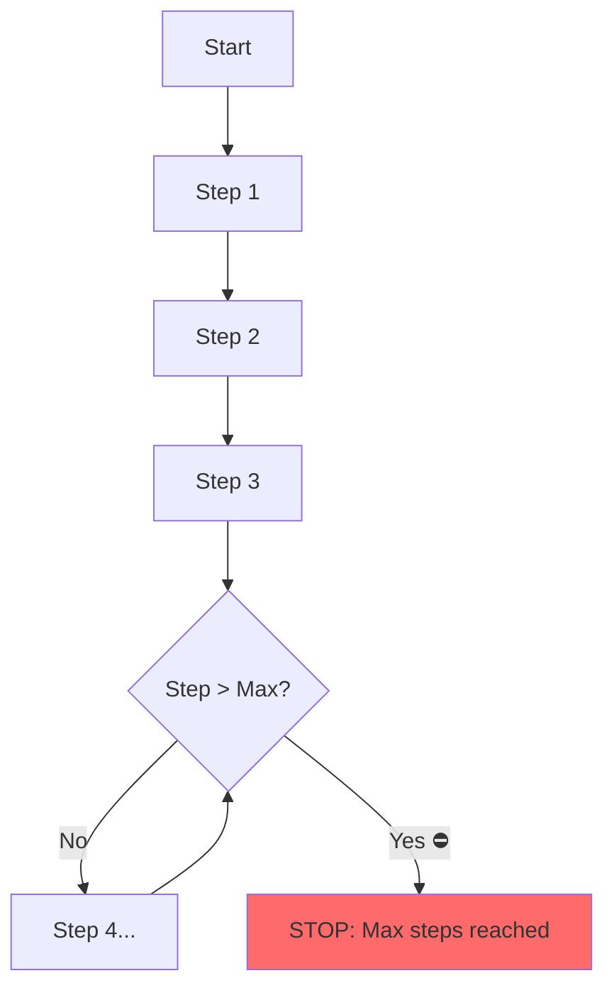

| Protection Mechanism | Explanation |
|-------------|-------|
| **Max Steps** | Maximum number of iterations (e.g., 10) |
| **Timeout** | Maximum execution time (e.g., 120 seconds) |
| **Token Budget** | Maximum number of tokens (e.g., 50,000) |
| **Cost Budget** | Maximum cost (e.g., $0.50) |
| **Circuit Breaker** | If an external service fails 3 times, stop trying |

---

## Execution Models

There are several different ways to run an Agent. Each one is suited for a different use case:

### 1. Synchronous

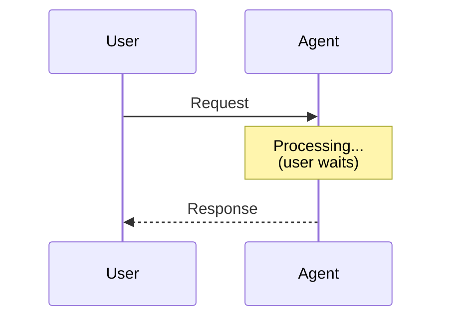

| Pros | Cons |
|-----|-----|
| Simple to implement | User waits |
| Easy to debug | Not suitable for long tasks |
| Immediate response | HTTP timeout (30-60 sec) |

**Suitable for:** Quick questions, chat-style

### 2. Asynchronous

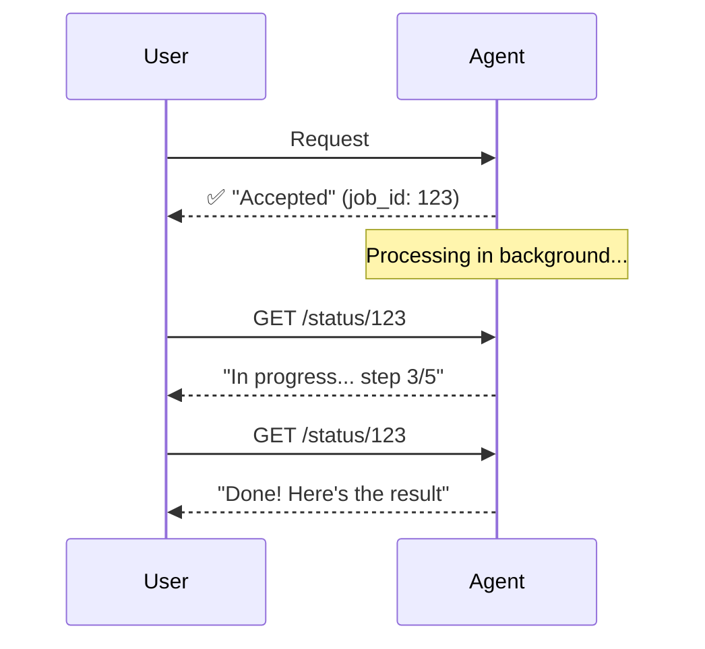

| Pros | Cons |
|-----|-----|
| User doesn't wait | Higher complexity |
| Suitable for long tasks | Needs Polling/Webhook mechanism |
| Can be cancelled | Complex State management |

**Suitable for:** Complex tasks, reports, analyses

### 3. Streaming

Streaming gives users the "typing" experience — tokens appear one by one as the LLM generates them. This is critical for UX: a 5-second wait with a blank screen feels broken, but the same 5 seconds with streaming text feels responsive. Most chat interfaces use this.

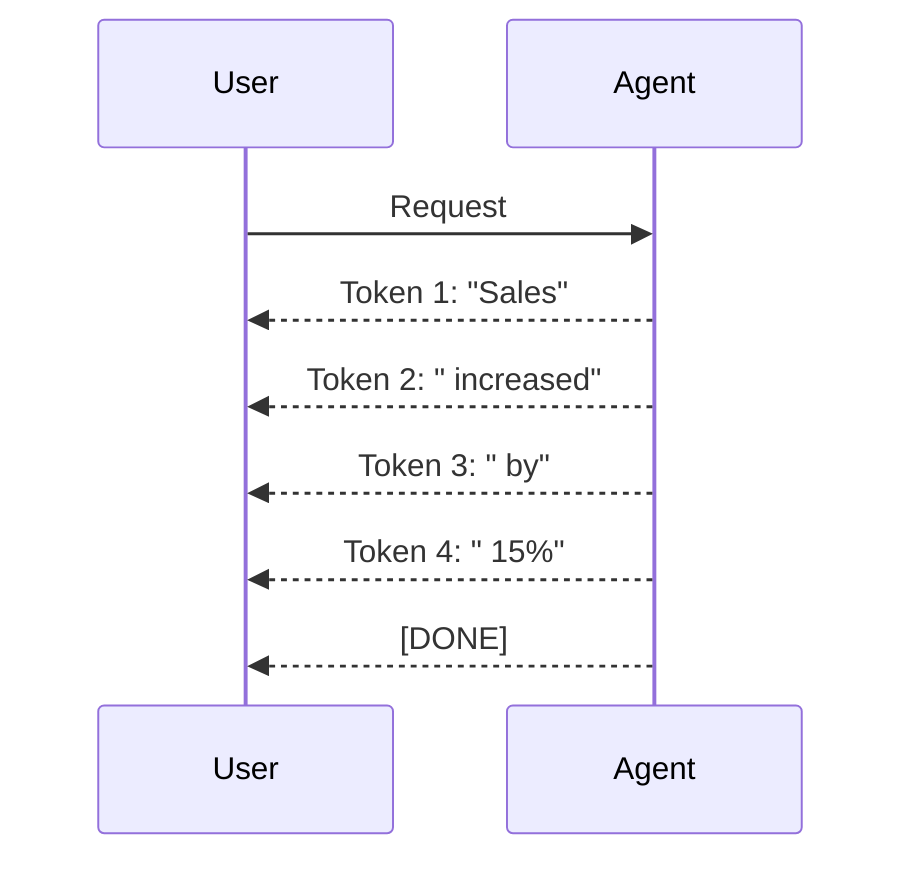

| Pros | Cons |
|-----|-----|
| Sense of speed (good UX) | Client-side complexity |
| User sees results as they come | Hard to process Tool Calls |
| Low Memory footprint | Complex Retry Logic |

**Suitable for:** Chat UI, long text responses

---

## Secure Execution - Sandboxing

### Why do we need a Sandbox?

An Agent can generate and execute code. This is **dangerous**:

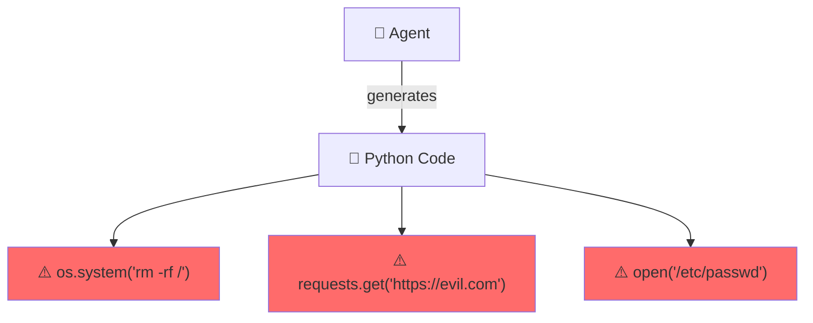

### Solution: Secure Sandbox

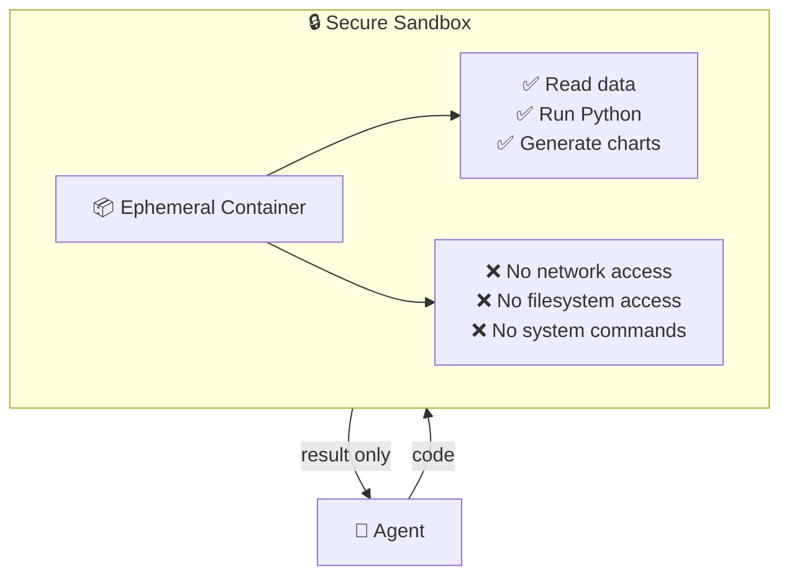

### Isolation Levels

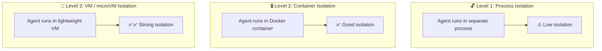

| Level | Technology | Security | Performance | Cost |
|-----|-----------|--------|---------|------|
| **Process** | subprocess, fork | ⚠️ Low | ⚡ Fast | 💰 Cheap |
| **Container** | Docker, containerd | ✅ Good | ⚡ Fast | 💰 Medium |
| **microVM** | Firecracker, gVisor | ✅✅ High | 🐌 Slow | 💰💰 Expensive |
| **Ephemeral Session** | Azure Dynamic Sessions | ✅✅ High | ⚡ Fast | 💰💰 Medium |

### Properties of a Good Sandbox:

The most commonly overlooked property is **Ephemeral** — reusing a container between executions is a security risk because one execution might leave malicious artifacts (files, environment variables) that affect the next one. Always start from a clean state.

| Property | Explanation |
|--------|-------|
| **Ephemeral** | Created and destroyed for each execution - no residue |
| **Resource Limits** | CPU, Memory, Disk are limited |
| **Network Isolation** | No network access (or restricted access) |
| **Filesystem Isolation** | No access to the host filesystem |
| **Time Limit** | Execution is time-limited |
| **Read-only** | The Agent can read but not write |

---

## Scaling in the Runtime Plane

The Runtime Plane is the one that needs the most aggressive Scaling:

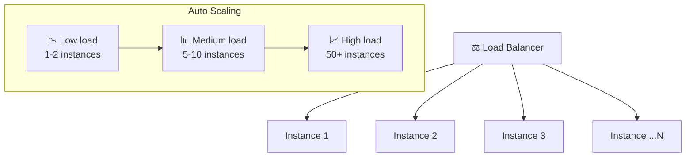

### Stateless vs Stateful Scaling

| Component Types | Scaling | Explanation |
|-------------|---------|-------|
| **Stateless** (API, Router) | Easy | Simply add instances |
| **Stateful** (Memory, State) | Complex | Requires shared storage or sticky sessions |

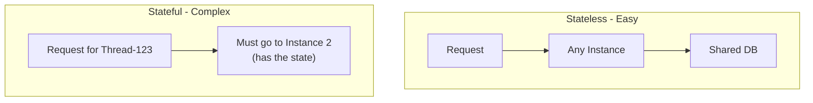

**The solution:** externalize state

All state is saved **outside** the instance (in Redis, DB, etc.), so that any instance can handle any request.

---

## Industry Tools & Frameworks

### Runtime Components — What the Industry Uses

| Component | Azure | Open Source / Third-Party |
|-----------|-------|--------------------------|
| **Orchestrator** | Azure AI Foundry Agents Service | LangGraph, Semantic Kernel, AutoGen |
| **Model Layer** | Azure OpenAI Service | LiteLLM, Ollama, vLLM, OpenRouter |
| **Memory Manager** | Azure Cosmos DB | Redis, PostgreSQL, Mem0, Zep |
| **Tool Executor** | Azure Functions, Container Apps | LangChain Tools, Composio, MCP servers |
| **Sandbox** | Azure Container Apps Dynamic Sessions | gVisor, Firecracker, E2B, Modal |
| **Compute** | Azure Container Apps, AKS | Kubernetes, Docker, Fly.io |

### Why a Separate Runtime Plane? — Real-World Scenario

Think of the Runtime Plane as the **kitchen** of a restaurant. The Control Plane is the **front desk** (takes orders, manages reservations). You wouldn't want the kitchen staff handling reservations, and you wouldn't want the receptionist cooking food.

In an agent platform:
- The **Control Plane** manages WHAT agents exist, WHO can use them, and WHAT rules apply
- The **Runtime Plane** actually RUNS the agents — processing requests, calling LLMs, executing tools

Separating them means:
- You can **scale** the runtime independently (more traffic → more runtime instances, control plane stays the same)
- You can **update** policies without restarting agents
- A **crash** in one agent doesn't take down the management dashboard

---

## Advantages and Disadvantages

### ✅ Advantages

| Advantage | Explanation |
|-------|-------|
| **Decoupled** | Each component is independent - easy to replace/upgrade |
| **Scalable** | Each component scales separately |
| **Observable** | Every step in the flow can be measured |
| **Secure** | Sandbox isolates untrusted code |

### ❌ Challenges

| Challenge | Explanation | Solution |
|-------|------|-------|
| **Latency** | Many hops = latency | Optimize critical path, caching |
| **Complexity** | Many components | Good observability, testing |
| **State management** | Hard to scale stateful components | Externalize state |
| **Cost** | LLM calls are expensive | Model routing, caching |

---

## Summary

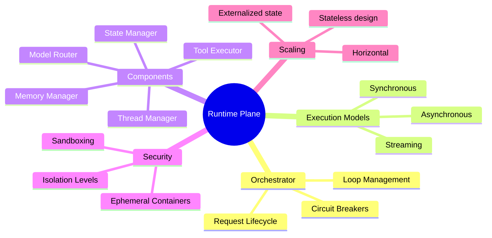

| What We Learned | Key Point |
|-----------|-------------|
| **Runtime Plane** | This is where the Agent actually works - LLM calls, tools, memory |
| **Request Lifecycle** | Receive → Context → LLM → Parse → Tool/Answer → Save |
| **Orchestrator** | The "conductor" - coordinates between all components |
| **Execution Models** | Sync (fast), Async (long), Streaming (good UX) |
| **Sandbox** | An isolated environment for running code that the Agent generates |
| **Scaling** | Stateless components scale easily, Stateful requires externalized state |

---

## ❓ Self-Check Questions

1. What is the main difference between Control Plane and Runtime Plane?
2. Describe the 6 steps in a request lifecycle.
3. What is the role of the Orchestrator?
4. Why do we need a Circuit Breaker and what does it do?
5. What is the difference between Sync, Async, and Streaming execution?
6. Why does an Agent need a Sandbox and how many isolation levels are there?
7. What is the problem with Stateful components in Scaling and what is the solution?

---

### 📝 Answers

<details>
<summary>1. What is the main difference between Control Plane and Runtime Plane?</summary>

**Control Plane** = Management layer - defining agents, policies, configs. Active only when changing configurations. **Runtime Plane** = Execution layer - processes requests, runs agents, calls LLMs and tools. Active with every user request. Similar to networking: Control Plane = managing routing tables, Runtime = forwarding packets.
</details>

<details>
<summary>2. Describe the 6 steps in a request lifecycle.</summary>

1. **Ingress** - Request enters through API Gateway (auth, rate limit).
2. **Routing** - The request is routed to the appropriate Agent.
3. **Context Loading** - Loading thread, history, memory, RAG context.
4. **Execution** - ReAct loop: LLM calls + tool calls.
5. **Post-processing** - PII scan, content safety, cost logging.
6. **Response** - Response returns to the user + state saving.
</details>

<details>
<summary>3. What is the role of the Orchestrator?</summary>

The **Orchestrator** is the "conductor" of the Runtime. It manages the ReAct loop: decides when to call the LLM, when to activate tools, manages the state between steps, handles errors and retries, and stops when the task is completed or max steps are reached.
</details>

<details>
<summary>4. Why do we need a Circuit Breaker and what does it do?</summary>

**Circuit Breaker** protects against cascading failure. When the LLM provider is unavailable, instead of sending requests that will fail (and consume resources), the CB "opens" and blocks requests immediately. After a timeout, it enters **Half-Open** - sends one request as a test. If it succeeds → returns to Closed (normal). If it fails → returns to Open.
</details>

<details>
<summary>5. What is the difference between Sync, Async, and Streaming execution?</summary>

- **Sync** - The client waits until the response is ready. Simple, but blocking.
- **Async** - The client immediately receives a task_id and checks later (polling/webhook). Good for long tasks.
- **Streaming** - The client receives the response bit by bit in real time (SSE/WebSocket). Good UX - the user sees text being "written".
</details>

<details>
<summary>6. Why does an Agent need a Sandbox and how many isolation levels are there?</summary>

An Agent runs code and activates tools - without a Sandbox it can access the entire system. **4 levels**: (1) **Process** - process-level separation, (2) **Container** - Docker/Podman, (3) **MicroVM** - lightweight VM (Firecracker), (4) **Hardware** - Confidential Computing. The higher you go → more security, less performance.
</details>

<details>
<summary>7. What is the problem with Stateful components in Scaling and what is the solution?</summary>

Stateful components (like an Agent with a thread in memory) cannot be easily scaled because each instance holds different state - a request must reach the same instance. **Solution**: **Externalize State** - move the state to an external DB (Redis, Cosmos DB), so that every instance is stateless and can handle any request.
</details>

---

> 🔗 **See it in production:** [Runtime Plane — Deep Dive (AI-Platform-System)](https://github.com/roie9876/AI-Platform-System#3-runtime-plane--deep-dive)

**[⬅️ Back to Chapter 8: Control Plane](08-control-plane.md)** | **[➡️ Continue to Chapter 10: Evaluation Engine →](10-evaluation-engine.md)**
