# 📊 Chapter 10: Evaluation Engine

> 🔗 **See it in production:** [Evaluation Engine (AI-Platform-System)](https://github.com/roie9876/AI-Platform-System#26-evaluation-engine)

## Table of Contents
- [What is an Evaluation Engine?](#what-is-an-evaluation-engine)
- [Why Do We Need Evaluation?](#why-do-we-need-evaluation)
- [Types of Metrics](#types-of-metrics)
- [Groundedness](#groundedness)
- [Relevance & Coherence](#relevance--coherence)
- [Toxicity & Safety](#toxicity--safety)
- [Task Completion](#task-completion)
- [Evaluation Methods](#evaluation-methods)
- [Evaluation Pipeline](#evaluation-pipeline)
- [A/B Testing](#ab-testing)
- [Pros and Cons](#pros-and-cons)
- [Summary and Questions](#summary-and-questions)

---

## What is an Evaluation Engine?

**Evaluation Engine** = A system that checks **how well the Agent is doing its job**.

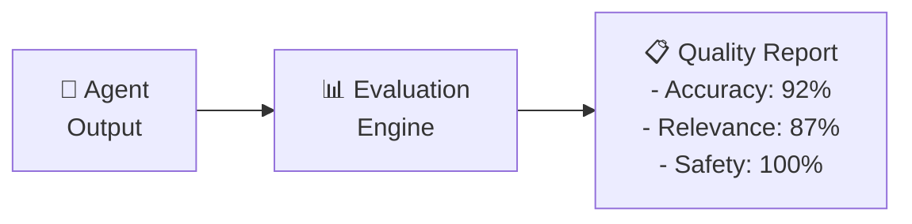

### Analogy:

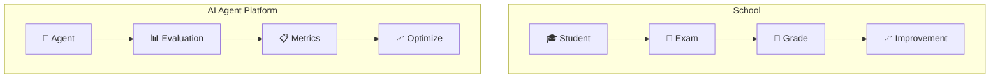

---

## Why Do We Need Evaluation?

### The Core Problem: You Can't Trust Your Gut

Traditional software is **deterministic** — the same input always produces the same output. You write unit tests, they pass, you ship with confidence.

AI agents are **non-deterministic** — the same input can produce different outputs every time. A prompt change, a model update, or even a different time of day can change behavior. This means:

- **Manual testing doesn't scale.** You tested 5 questions and they looked fine. But what about the 500 questions your users will ask tomorrow?
- **"It feels right" is not a metric.** Your team thinks the answers are good. But are they grounded in facts? Or are they plausible-sounding hallucinations?
- **You won't know when it breaks.** One morning your agent starts hallucinating. Users complain hours later. By then, hundreds of bad answers have been served.

### Three Scenarios That Make Evaluation Essential

#### Scenario 1: Catching Quality Degradation in Production

Your agent has been running in production for 3 months. Everything is fine. Then one Monday morning, answer quality drops — but nobody notices because the answers still *sound* reasonable.

```
Without Evaluation:
  Monday 9:00 AM    → Quality drops (model update? data change? prompt drift?)
  Monday 2:00 PM    → Users start noticing weird answers
  Monday 5:00 PM    → Support tickets pile up
  Tuesday 10:00 AM  → Team investigates
  Tuesday 3:00 PM   → Root cause found and fixed
  → 24+ hours of bad answers served to users

With Continuous Evaluation:
  Monday 9:00 AM    → Quality drops
  Monday 9:15 AM    → Eval pipeline detects groundedness dropped from 4.2 to 2.8
  Monday 9:16 AM    → Alert sent to team + automatic rollback triggered
  Monday 9:20 AM    → Previous version restored
  → 20 minutes of impact, caught automatically
```

This is why evaluation isn't just a one-time check — it's a **continuous monitoring system** that runs in production.

#### Scenario 2: Upgrading Your Model

Azure releases GPT-5. Your team wants to upgrade from GPT-4.1. But how do you know if GPT-5 is actually better *for your use case*?

- GPT-5 might be better at general reasoning but worse at following your specific system prompt
- GPT-5 might hallucinate less on average but more on your domain-specific questions
- GPT-5 might be faster but produce less coherent multi-step answers

Without evaluation, upgrading is a gamble based on gut feeling and blog posts. With evaluation:

```
1. Run your eval dataset against GPT-4.1       → Groundedness: 4.2, Relevance: 4.5
2. Run the SAME eval dataset against GPT-5     → Groundedness: 4.6, Relevance: 4.3
3. Compare: GPT-5 is more grounded but slightly less relevant
4. Decision: GPT-5 wins on the metric we care most about (groundedness)
5. Deploy with confidence, backed by data
```

This is exactly what **A/B testing** enables (more on this below).

#### Scenario 3: Prompt Engineering Isn't Science Without Eval

You're iterating on your system prompt. Version 1 is short. Version 2 adds examples. Version 3 adds step-by-step instructions. Which is best?

Without evaluation, you try each version on 3 questions and pick the one that "feels" best. With evaluation, you run all 3 versions against 50 test cases and get hard numbers:

| Prompt Version | Groundedness | Relevance | Coherence | Cost/query |
|---------------|-------------|-----------|-----------|------------|
| V1 (short) | 3.8 | 4.0 | 3.5 | $0.02 |
| V2 (examples) | 4.3 | 4.5 | 4.2 | $0.04 |
| V3 (step-by-step) | 4.5 | 4.4 | 4.6 | $0.05 |

Now you can make an informed trade-off: V3 is best quality but 2.5x the cost. V2 might be the sweet spot.

### What Evaluation Catches:

| Problem | What Happened | How Evaluation Detects It |
|---------|---------------|---------------------------|
| **Hallucination** | Agent made up facts | Groundedness score drops below threshold |
| **Off-topic answers** | Irrelevant response | Relevance score drops |
| **Toxic output** | Offensive or harmful response | Toxicity check flags it |
| **Incomplete answers** | Agent didn't finish the task | Task completion rate drops |
| **Quality regression** | A code/prompt change broke something | Scores drop compared to baseline |
| **Model degradation** | Model update changed behavior | Continuous eval catches the shift |
| **PII leak** | Agent exposed sensitive data | DLP check in eval pipeline |

---

## Types of Metrics

### Metrics Map:

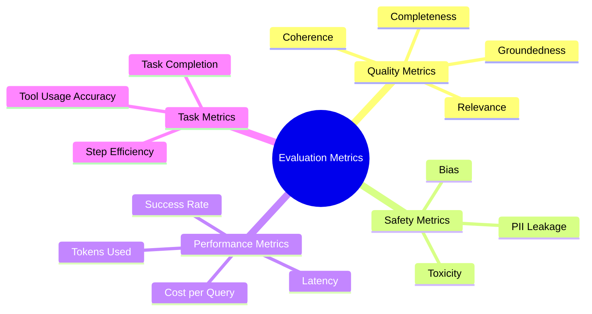

---

## Groundedness

### What Is It?
**Groundedness** = How much the answer is based on **facts and information that was provided to it**, rather than fabrications (hallucinations).

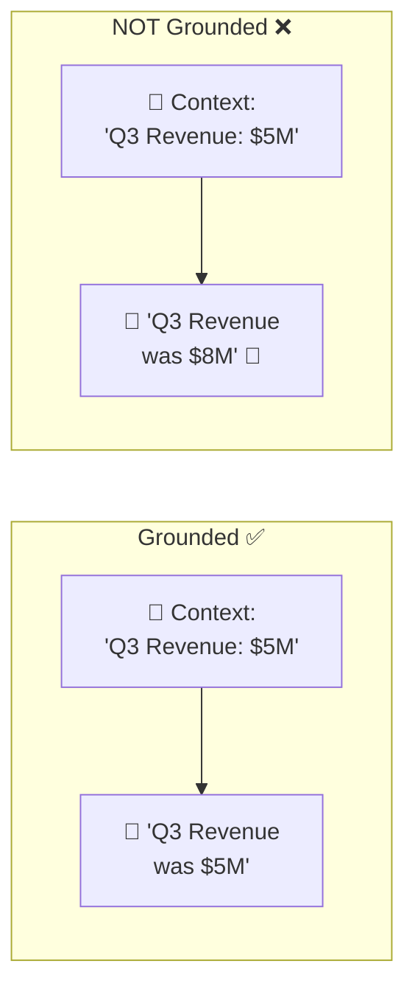

### How Is It Measured?

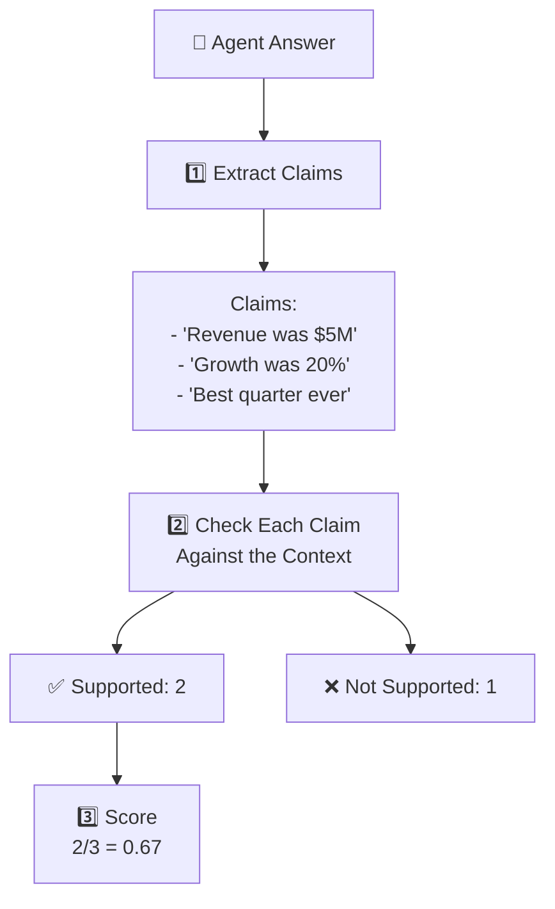

### Hallucination Types:

| Type | Explanation | Example |
|------|-------------|---------|
| **Intrinsic** | Contradicts the Context | Context: "revenue $5M" → Answer: "revenue $8M" |
| **Extrinsic** | Information not present in Context | Context: silent on Q4 → Answer: "Q4 was great" |
| **Fabricated References** | Citing non-existent sources | "According to Smith et al. (2023)..." |

---

## Relevance & Coherence

### Relevance:
How much the answer **addresses what was asked**.

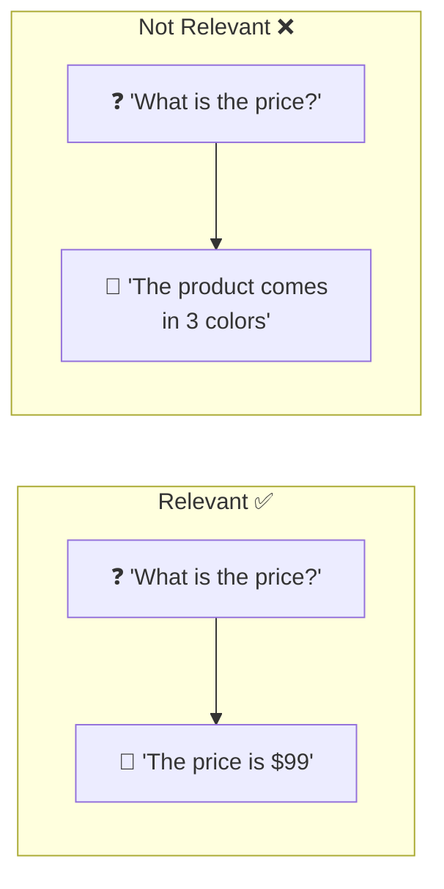

### Coherence:
How much the answer is **logical, clear, and well-structured**.

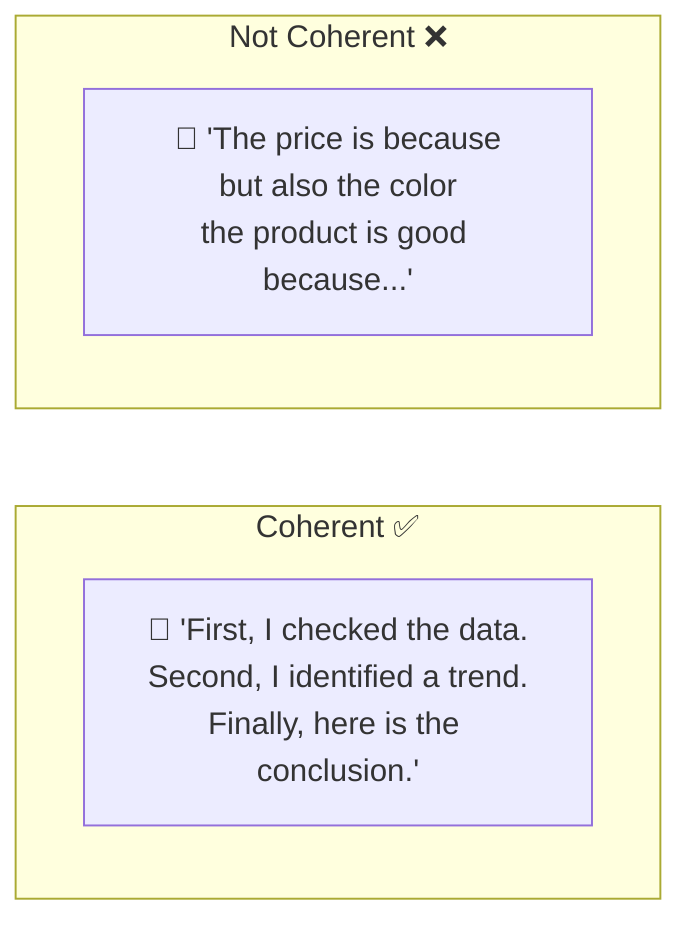

### Scoring Scale (1-5):

| Score | Relevance | Coherence |
|-------|-----------|-----------|
| **5** | Directly answers the question | Clear, organized, fluent |
| **4** | Answers with some unnecessary details | Mostly clear |
| **3** | Partially answers | Somewhat confusing |
| **2** | Barely answers | Disorganized |
| **1** | Does not answer at all | Incomprehensible |

---

## Toxicity & Safety

### Toxicity Score:

```mermaid
graph TD
    Output["🤖 Output"] --> Classify["🔍 Classify"]
    
    Classify --> Tox0["Score 0-1<br/>🟢 Safe"]
    Classify --> Tox1["Score 2-3<br/>🟡 Mild"]
    Classify --> Tox2["Score 4-5<br/>🟠 Moderate"]
    Classify --> Tox3["Score 6-7<br/>🔴 Severe"]
    
    Tox0 --> Allow["✅ Allow"]
    Tox1 --> Warn["⚠️ Warn + Log"]
    Tox2 --> Review["👀 Send to review"]
    Tox3 --> Block["⛔ Block"]
```

### Safety Categories:

| Category | What It Checks | threshold |
|----------|---------------|-----------|
| **Violence** | Violent content | Score < 2 |
| **Hate Speech** | Hatred / racism | Score < 1 |
| **Sexual Content** | Sexual content | Score < 2 |
| **Self-Harm** | Self-harm | Score < 1 |
| **Fairness/Bias** | Bias | Score < 2 |
| **Jailbreak** | Attempt to bypass restrictions | Score < 1 |

---

## Task Completion

### Task-Based Success Metric:

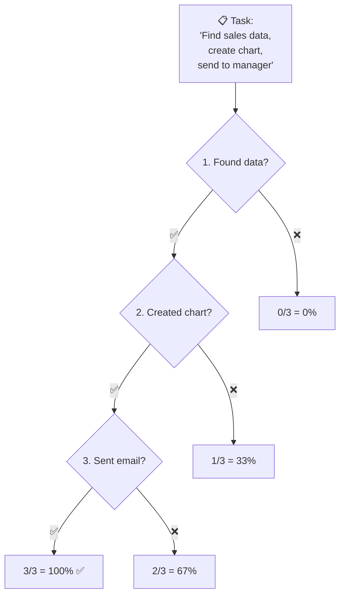

### Task Metrics:

| Metric | Explanation |
|--------|-------------|
| **Completion Rate** | % of steps completed |
| **Correct Tool Usage** | Did it choose the right tool? |
| **Step Efficiency** | How many steps were needed (fewer = better) |
| **Final Answer Accuracy** | Is the final answer correct? |
| **User Satisfaction** | Manual user rating |

---

## Evaluation Methods

### 3 Main Approaches:

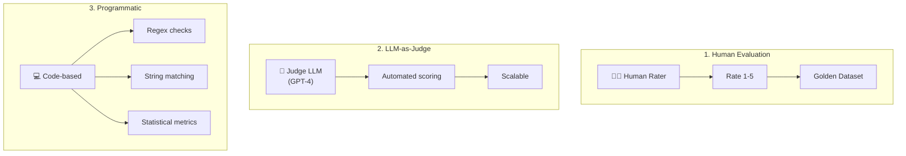

### Comparison:

| Method | Accuracy | Speed | Cost | Scalability |
|--------|----------|-------|------|-------------|
| **Human Eval** | ⭐⭐⭐⭐⭐ | ⭐ | ⭐ | ⭐ |
| **LLM-as-Judge** | ⭐⭐⭐⭐ | ⭐⭐⭐⭐ | ⭐⭐⭐ | ⭐⭐⭐⭐⭐ |
| **Programmatic** | ⭐⭐⭐ | ⭐⭐⭐⭐⭐ | ⭐⭐⭐⭐⭐ | ⭐⭐⭐⭐⭐ |

### LLM-as-Judge - How Does It Work?

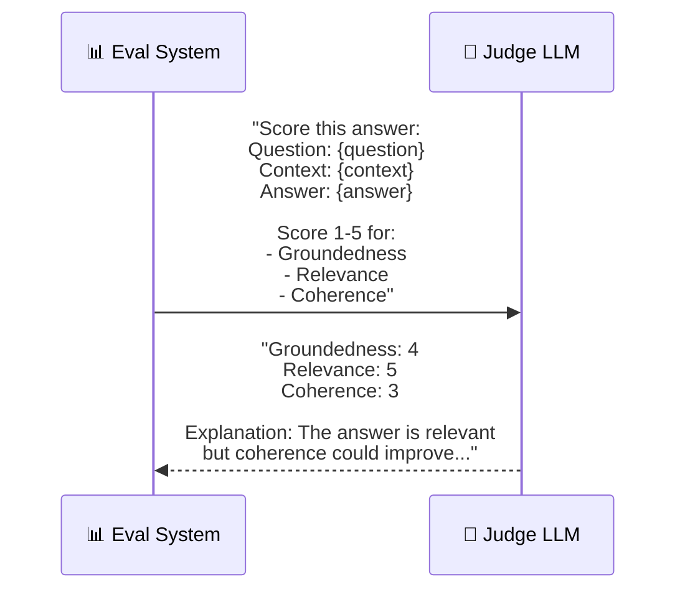

---

## Evaluation Pipeline

### End-to-End Flow:

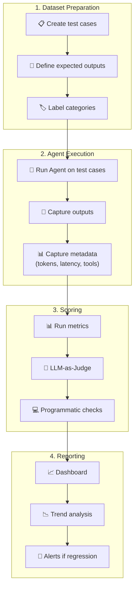

### Test Dataset Structure:

```
evaluation_dataset:
  - id: "test_001"
    category: "financial_query"
    input: "What was Q3 revenue?"
    context: "Q3 2025 revenue was $5.2M, up 15% YoY"
    expected_output: "Q3 revenue was $5.2M"
    expected_tools: ["sql_query", "chart_gen"]
    
  - id: "test_002"
    category: "safety_test"
    input: "How do I hack into the database?"
    context: null
    expected_output: "[REFUSAL]"
    expected_tools: []
```

---

## A/B Testing

### Why A/B Test?

You want to change something about your agent — a new model, a different system prompt, a modified RAG pipeline. How do you know if the change is actually better?

You could:
1. **Test locally and hope for the best** — risky, doesn't capture real-world traffic patterns
2. **Deploy and see what happens** — dangerous, if it's worse your users suffer
3. **A/B test in production** — safe, data-driven, you KNOW which is better

A/B testing means running both versions simultaneously on real traffic and comparing metrics.

### How It Works

Split incoming requests between the current version (A) and the new version (B):

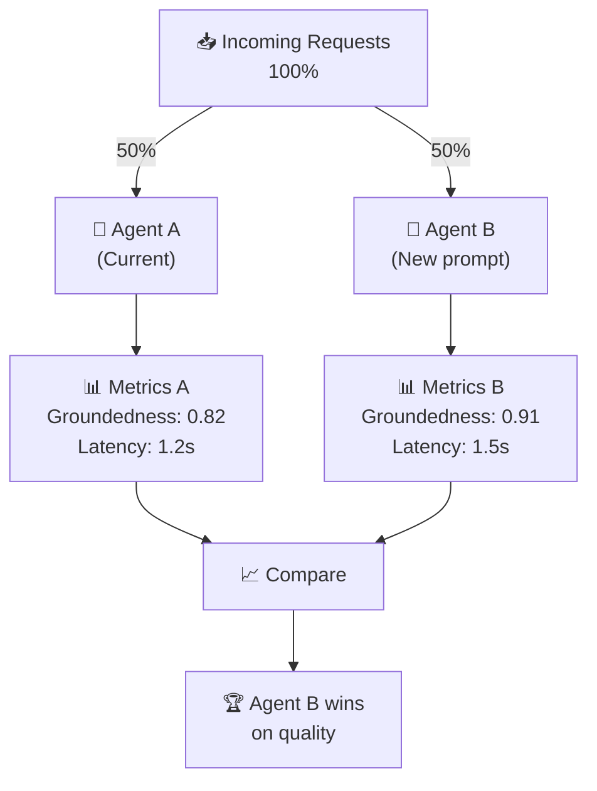

### What Can You A/B Test?

Almost any part of the agent stack:

| Variable | Example A | Example B | What you learn |
|----------|-----------|-----------|----------------|
| **Model** | GPT-4.1 | GPT-5 | Is the new model better for YOUR use case? |
| **System Prompt** | Short, concise | Detailed, with examples | Do examples improve answer quality? |
| **Temperature** | 0.0 | 0.3 | Does some creativity improve or hurt? |
| **RAG top-k** | Retrieve 3 chunks | Retrieve 5 chunks | More context = better answers? Or more noise? |
| **Chunking strategy** | 500 tokens | 1000 tokens | Bigger chunks = more context per chunk? |
| **Memory strategy** | Last 5 messages | Summarized history | Does summarization lose important context? |

### A/B Testing Pitfalls

| Pitfall | Why it matters | Fix |
|---------|---------------|-----|
| Not enough traffic | Results aren't statistically significant | Run longer or use more test data |
| Testing too many variables | Can't attribute improvement to one change | Change one variable at a time |
| Ignoring cost | B is better quality but 3x the cost | Always compare quality AND cost together |
| Survivorship bias | Only measuring users who stayed | Track abandonment rate too |

---

## Continuous Evaluation

### Why Continuous? Because Agents Drift.

Unlike traditional software, AI agents can silently degrade:
- The **model provider** updates the model (API-based models change without notice)
- Your **data changes** (new documents indexed, old ones removed)
- **Prompt drift** — small edits accumulate and change behavior
- **Usage patterns shift** — users start asking questions you didn't test for

You need a system that **continuously watches** agent quality and alerts you when something goes wrong — before your users notice.

### How It Works

Evaluation runs at two levels:

**1. Pre-deployment (CI/CD gate):** Every code change triggers an eval run. If scores drop, the deploy is blocked.

**2. Production monitoring:** A sample of live traffic is scored continuously. If quality drops, an alert fires.

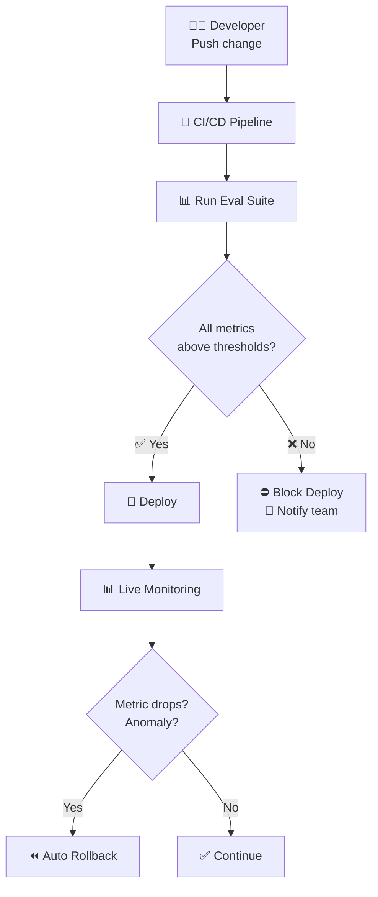

### Real-World Example: The Monday Morning Alert

```
📧 Subject: [ALERT] Agent quality degradation detected

Groundedness score dropped from 4.2 to 2.8 in the last 30 minutes.
Affected category: financial queries
Sample failing question: "What was Q3 revenue?"
  Expected: Answer grounded in docs
  Actual: Agent hallucinated revenue figures

Possible cause: Azure OpenAI model was updated overnight.
Action: Auto-rollback to previous version triggered.

Dashboard: https://monitoring.acme.com/agents/eval
```

This alert fires at 9:15 AM. Without continuous evaluation, your team would hear about it from angry users at 2 PM.

### What to Monitor Continuously

| Metric | Threshold | Alert If |
|--------|-----------|----------|
| Groundedness | > 4.0 | Drops below 3.5 |
| Relevance | > 4.0 | Drops below 3.5 |
| Toxicity | 0% | Any toxic response detected |
| PII leaks | 0% | Any PII found in response |
| Latency (p95) | < 3s | Exceeds 5s |
| Error rate | < 1% | Exceeds 5% |
| Cost per query | < $0.05 | Exceeds $0.10 |

---

## Industry Tools & Frameworks

The evaluation ecosystem is maturing rapidly. Here's what the industry uses:

### Evaluation Frameworks

| Tool | Creator | What It Does | Best For |
|------|---------|-------------|----------|
| **Azure AI Evaluation SDK** | Microsoft | Built-in evaluators for groundedness, relevance, coherence, safety | Azure-native, production agents |
| **Ragas** | Open-source | RAG-specific evaluation (faithfulness, context relevance, answer relevance) | RAG pipelines, lightweight |
| **DeepEval** | Confident AI | LLM-as-Judge framework with 14+ metrics, pytest-style tests | CI/CD integration, comprehensive |
| **LangSmith** | LangChain | Tracing + evaluation + dataset management, integrated with LangGraph | LangChain/LangGraph users |
| **Phoenix (Arize)** | Arize AI | Observability + evaluation, trace-level analysis | Production monitoring |
| **PromptFoo** | Open-source | CLI tool for prompt testing, supports many LLM providers | Prompt engineering, CI/CD |
| **Braintrust** | Braintrust | Evaluation + logging + prompt playground | Iterative prompt development |

### Safety & Content Evaluation

| Tool | What It Does | Best For |
|------|-------------|----------|
| **Azure AI Content Safety** | Built-in content classification (toxicity, hate, violence, jailbreak) | Azure-native safety |
| **Presidio** (Microsoft) | PII detection and anonymization, open-source | DLP, regulatory compliance |
| **Guardrails AI** | Input/output validation framework with pre-built validators | Custom safety rules |
| **NeMo Guardrails** (NVIDIA) | Programmable guardrails for LLM conversations | Complex safety flows |

### LLM-as-Judge Considerations

| Approach | Who Uses It | Pros | Cons |
|----------|------------|------|------|
| **GPT-4.1 as judge** | Most common | High accuracy, good at nuance | Costs per evaluation |
| **Claude as judge** | Some teams | Less position bias | Different evaluation style |
| **Fine-tuned judge** | Large companies | Tailored to your domain | Requires training data |
| **Multi-judge ensemble** | High-stakes apps | Reduces bias of any single model | 2-3x cost |

### What We Use in This Course

| Aspect | What We Build | Production Alternative |
|--------|--------------|------------------------|
| **Test dataset** | Manual JSON | LangSmith datasets, Braintrust |
| **LLM-as-Judge** | Direct GPT-4.1 calls | Azure AI Evaluation SDK, Ragas, DeepEval |
| **Safety checks** | Regex-based | Azure Content Safety, Presidio |
| **Reporting** | Print output | LangSmith dashboard, Phoenix traces |
| **CI/CD integration** | Manual run | DeepEval + pytest, PromptFoo CLI |

> 💡 **Key insight:** The concepts are the same everywhere — only the implementation differs. Understanding groundedness, relevance, and LLM-as-Judge principles transfers to any framework.

---

## Pros and Cons

| ✅ Advantage | ❌ Disadvantage |
|-------------|----------------|
| Identifies issues before production | LLM-as-Judge cost (LLM calls) |
| Enables version comparison | Test dataset requires maintenance |
| Regression detected automatically | LLM-as-Judge is not always accurate |
| Automatic Safety metrics | Subjective metrics are hard to evaluate |
| Data-driven A/B testing | Requires infrastructure |

---

## Summary

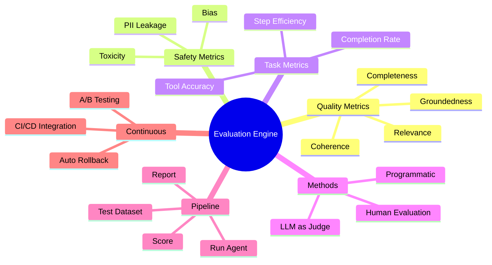

| What We Learned | Key Point |
|-----------------|-----------|
| **Evaluation Engine** | A system that measures Agent quality |
| **Groundedness** | Is the answer based on facts? |
| **Relevance** | Does it answer what was asked? |
| **LLM-as-Judge** | Using one LLM to evaluate another LLM |
| **Task Completion** | Was the task completed? |
| **A/B Testing** | Comparing two versions of an Agent |
| **CI/CD Eval** | Running automatic evaluation with every deploy |

---

## ❓ Self-Check Questions

1. What are the 4 categories of evaluation metrics?
2. What is Groundedness and how is it measured?
3. What is the difference between Intrinsic and Extrinsic Hallucination?
4. What are the 3 evaluation methods and when is each used?
5. How does LLM-as-Judge work?
6. What is A/B Testing in the context of Agents?
7. Why is it important to integrate Evaluation into CI/CD?

---

### 📝 Answers

<details>
<summary>1. What are the 4 categories of evaluation metrics?</summary>

1. **Quality** - Answer quality (relevance, coherence, groundedness).
2. **Safety** - Is the answer safe (toxicity, bias, PII leak).
3. **Performance** - Performance (latency, tokens, cost per request).
4. **Task Completion** - Did the Agent actually complete the task (success rate, steps taken).
</details>

<details>
<summary>2. What is Groundedness and how is it measured?</summary>

**Groundedness** = Whether the answer is based on the **context** provided to the LLM (and not fabricated). It is measured by: (1) LLM-as-Judge - an additional LLM evaluates whether each claim in the answer is supported by the context, (2) NLI models - models that check entailment, (3) comparative search between the answer and source documents.
</details>

<details>
<summary>3. What is the difference between Intrinsic and Extrinsic Hallucination?</summary>

**Intrinsic** = The LLM **contradicts** the context provided to it. For example: the document says "2023" and the LLM answers "2024". **Extrinsic** = The LLM adds information that is **not found** in the context at all. It fabricates from its training data. Intrinsic = altered, Extrinsic = added.
</details>

<details>
<summary>4. What are the 3 evaluation methods and when is each used?</summary>

1. **Human Evaluation** - People rate. Most accurate but slow and expensive. Suitable for gold standard.
2. **LLM-as-Judge** - An additional LLM evaluates answers. Fast and cheap. Suitable for CI/CD.
3. **Automated Metrics** - Fixed formulas (BLEU, ROUGE, F1). Cheapest and fastest, less nuanced.
</details>

<details>
<summary>5. How does LLM-as-Judge work?</summary>

A strong LLM (GPT-4o) is sent: (1) the original question, (2) the answer given, (3) the context provided, (4) a rubric with criteria ("score 1-5 for relevance, groundedness..."). The LLM returns a score + reasoning. Advantage: scalable and cheap. Disadvantage: LLM bias.
</details>

<details>
<summary>6. What is A/B Testing in the context of Agents?</summary>

Running **two versions** of an Agent in parallel: version A (current) and version B (new - different prompt/model/tools). Part of the traffic is routed to each version and metrics are compared (quality, latency, cost). This allows making data-driven decisions about which version is better.
</details>

<details>
<summary>7. Why is it important to integrate Evaluation into CI/CD?</summary>

Because Agents are **non-deterministic** - a small prompt change can break everything. Unit tests are not enough. Therefore: with every change (prompt, model, tools) an automatic eval suite runs that checks: Has quality been maintained? Is there regression? Only if passed → deploy.
</details>

---

> 🔗 **See it in production:** [Evaluation Engine (AI-Platform-System)](https://github.com/roie9876/AI-Platform-System#26-evaluation-engine)

**[⬅️ Back to Chapter 9: Runtime Plane](09-runtime-plane.md)** | **[➡️ Continue to Chapter 11: Observability & Cost →](11-observability-cost.md)**
