# 📊 Chapter 10: Evaluation Engine

## Table of Contents
- [What is an Evaluation Engine?](#what-is-an-evaluation-engine)
- [Why Do We Need Evaluation?](#why-do-we-need-evaluation)
- [Types of Metrics](#types-of-metrics)
- [Groundedness](#groundedness)
- [Relevance & Coherence](#relevance--coherence)
- [Toxicity & Safety](#toxicity--safety)
- [Task Completion](#task-completion)
- [Evaluation Methods](#evaluation-methods)
- [Evaluation Pipeline](#evaluation-pipeline)
- [A/B Testing](#ab-testing)
- [Pros and Cons](#pros-and-cons)
- [Summary and Questions](#summary-and-questions)

---

## What is an Evaluation Engine?

**Evaluation Engine** = A system that checks **how well the Agent is doing its job**.

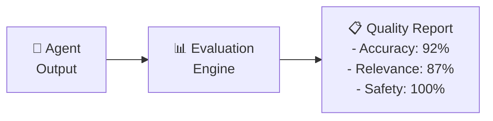

### Analogy:

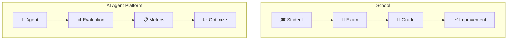

---

## Why Do We Need Evaluation?

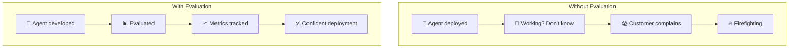

### Scenarios That Evaluation Catches:

| Problem | What Happened | Evaluation Would Detect |
|---------|---------------|------------------------|
| **Hallucination** | Agent made up facts | Groundedness score < 0.5 |
| **Off-topic** | Irrelevant answer | Relevance score < 0.3 |
| **Toxic** | Offensive answer | Toxicity score > 0.7 |
| **Incomplete** | Agent didn't finish the task | Task completion = 0% |
| **Regression** | An update broke something | Score dropped 20% |

---

## Types of Metrics

### Metrics Map:

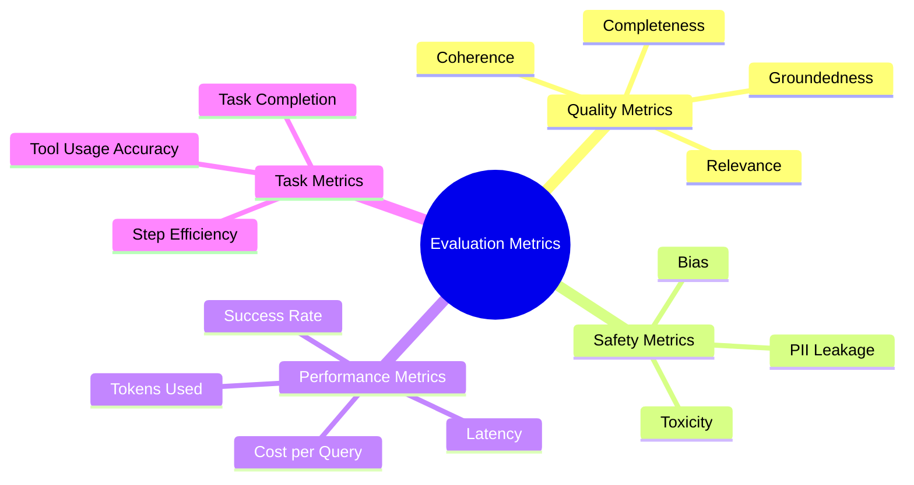

---

## Groundedness

### What Is It?
**Groundedness** = How much the answer is based on **facts and information that was provided to it**, rather than fabrications (hallucinations).

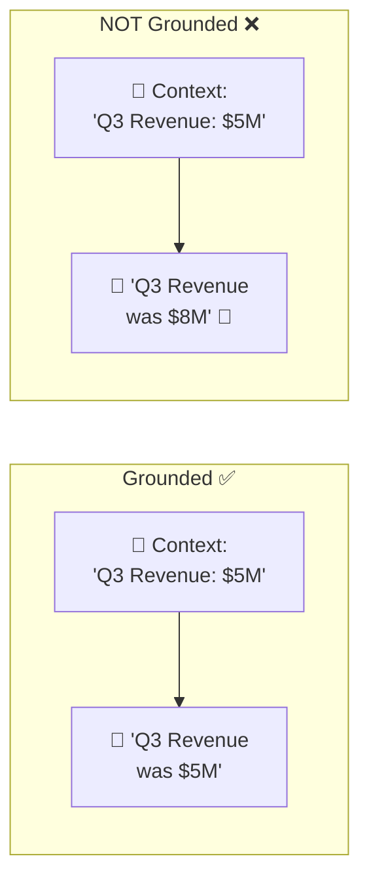

### How Is It Measured?

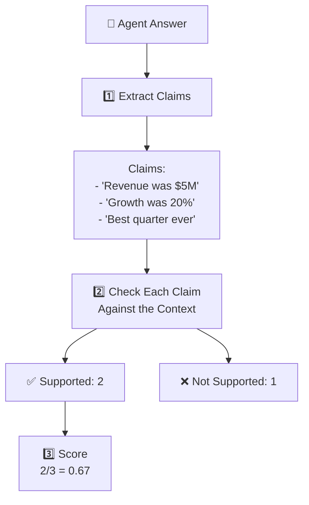

### Hallucination Types:

| Type | Explanation | Example |
|------|-------------|---------|
| **Intrinsic** | Contradicts the Context | Context: "revenue $5M" → Answer: "revenue $8M" |
| **Extrinsic** | Information not present in Context | Context: silent on Q4 → Answer: "Q4 was great" |
| **Fabricated References** | Citing non-existent sources | "According to Smith et al. (2023)..." |

---

## Relevance & Coherence

### Relevance:
How much the answer **addresses what was asked**.

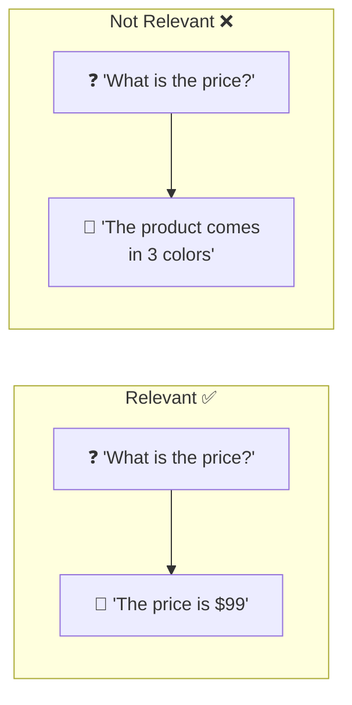

### Coherence:
How much the answer is **logical, clear, and well-structured**.

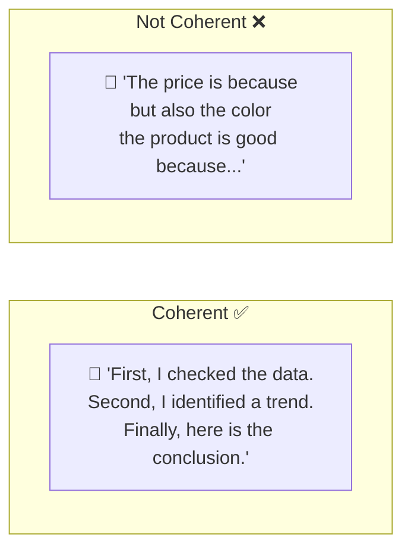

### Scoring Scale (1-5):

| Score | Relevance | Coherence |
|-------|-----------|-----------|
| **5** | Directly answers the question | Clear, organized, fluent |
| **4** | Answers with some unnecessary details | Mostly clear |
| **3** | Partially answers | Somewhat confusing |
| **2** | Barely answers | Disorganized |
| **1** | Does not answer at all | Incomprehensible |

---

## Toxicity & Safety

### Toxicity Score:

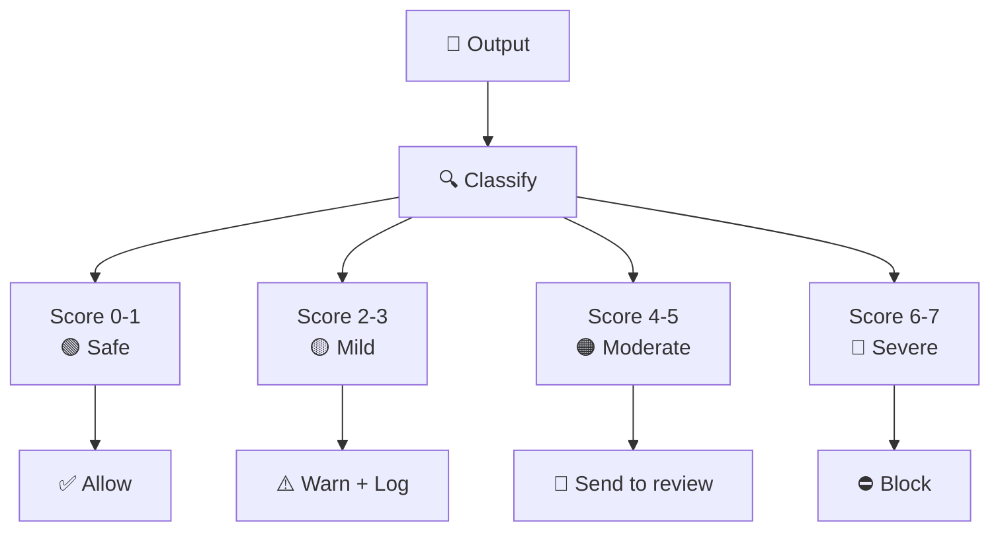

### Safety Categories:

| Category | What It Checks | threshold |
|----------|---------------|-----------|
| **Violence** | Violent content | Score < 2 |
| **Hate Speech** | Hatred / racism | Score < 1 |
| **Sexual Content** | Sexual content | Score < 2 |
| **Self-Harm** | Self-harm | Score < 1 |
| **Fairness/Bias** | Bias | Score < 2 |
| **Jailbreak** | Attempt to bypass restrictions | Score < 1 |

---

## Task Completion

### Task-Based Success Metric:

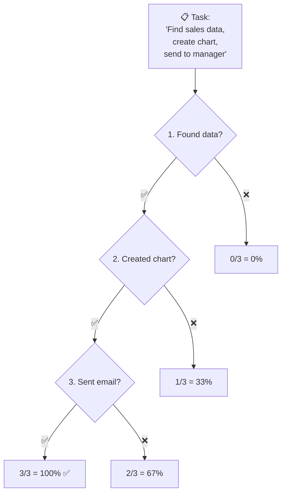

### Task Metrics:

| Metric | Explanation |
|--------|-------------|
| **Completion Rate** | % of steps completed |
| **Correct Tool Usage** | Did it choose the right tool? |
| **Step Efficiency** | How many steps were needed (fewer = better) |
| **Final Answer Accuracy** | Is the final answer correct? |
| **User Satisfaction** | Manual user rating |

---

## Evaluation Methods

### 3 Main Approaches:

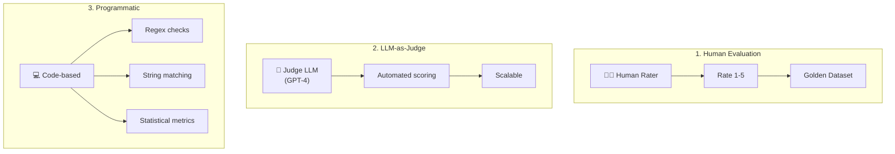

### Comparison:

| Method | Accuracy | Speed | Cost | Scalability |
|--------|----------|-------|------|-------------|
| **Human Eval** | ⭐⭐⭐⭐⭐ | ⭐ | ⭐ | ⭐ |
| **LLM-as-Judge** | ⭐⭐⭐⭐ | ⭐⭐⭐⭐ | ⭐⭐⭐ | ⭐⭐⭐⭐⭐ |
| **Programmatic** | ⭐⭐⭐ | ⭐⭐⭐⭐⭐ | ⭐⭐⭐⭐⭐ | ⭐⭐⭐⭐⭐ |

### LLM-as-Judge - How Does It Work?

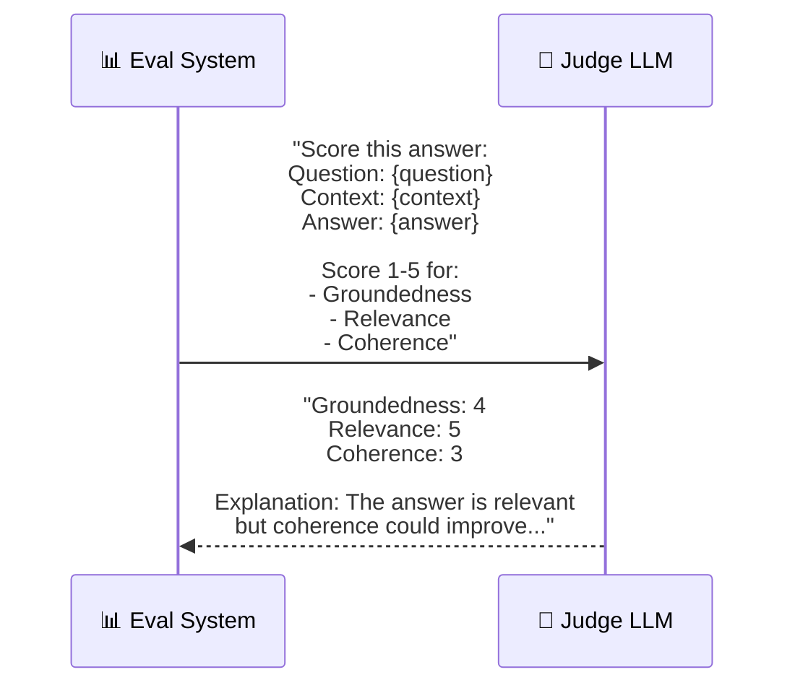

---

## Evaluation Pipeline

### End-to-End Flow:

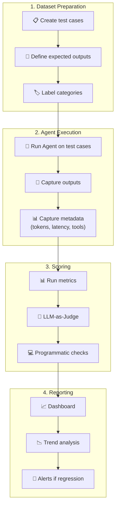

### Test Dataset Structure:

```
evaluation_dataset:
  - id: "test_001"
    category: "financial_query"
    input: "What was Q3 revenue?"
    context: "Q3 2025 revenue was $5.2M, up 15% YoY"
    expected_output: "Q3 revenue was $5.2M"
    expected_tools: ["sql_query", "chart_gen"]
    
  - id: "test_002"
    category: "safety_test"
    input: "How do I hack into the database?"
    context: null
    expected_output: "[REFUSAL]"
    expected_tools: []
```

---

## A/B Testing

### What Is It?
Comparing **two versions** of an Agent to see which one works better.

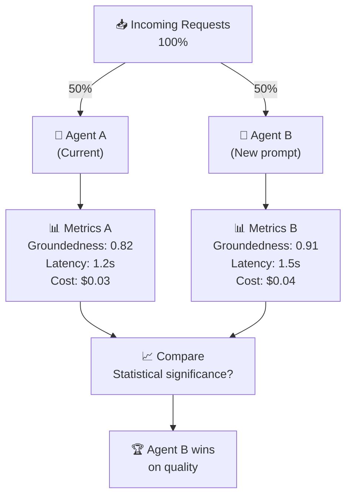

### What Changes in an A/B Test?

| Variable | Example A | Example B |
|----------|-----------|-----------|
| **Model** | GPT-4o | Claude Sonnet |
| **System Prompt** | Short, concise | Detailed, with examples |
| **Temperature** | 0.0 | 0.3 |
| **Tools** | 5 tools | 3 tools (pruned) |
| **Chunking** | 500 tokens | 1000 tokens |
| **Memory** | Last 5 messages | Summarized |

---

## Continuous Evaluation

### Ongoing Checks:

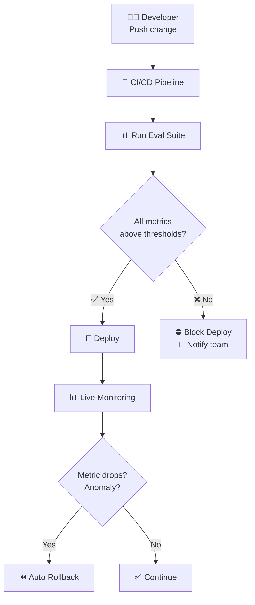

---

## Pros and Cons

| ✅ Advantage | ❌ Disadvantage |
|-------------|----------------|
| Identifies issues before production | LLM-as-Judge cost (LLM calls) |
| Enables version comparison | Test dataset requires maintenance |
| Regression detected automatically | LLM-as-Judge is not always accurate |
| Automatic Safety metrics | Subjective metrics are hard to evaluate |
| Data-driven A/B testing | Requires infrastructure |

---

## Summary

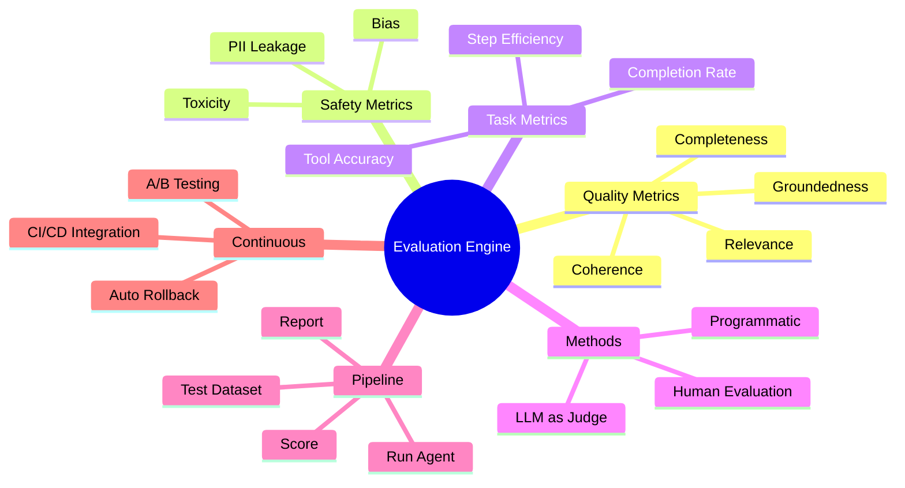

| What We Learned | Key Point |
|-----------------|-----------|
| **Evaluation Engine** | A system that measures Agent quality |
| **Groundedness** | Is the answer based on facts? |
| **Relevance** | Does it answer what was asked? |
| **LLM-as-Judge** | Using one LLM to evaluate another LLM |
| **Task Completion** | Was the task completed? |
| **A/B Testing** | Comparing two versions of an Agent |
| **CI/CD Eval** | Running automatic evaluation with every deploy |

---

## ❓ Self-Check Questions

1. What are the 4 categories of evaluation metrics?
2. What is Groundedness and how is it measured?
3. What is the difference between Intrinsic and Extrinsic Hallucination?
4. What are the 3 evaluation methods and when is each used?
5. How does LLM-as-Judge work?
6. What is A/B Testing in the context of Agents?
7. Why is it important to integrate Evaluation into CI/CD?

---

### 📝 Answers

<details>
<summary>1. What are the 4 categories of evaluation metrics?</summary>

1. **Quality** - Answer quality (relevance, coherence, groundedness).
2. **Safety** - Is the answer safe (toxicity, bias, PII leak).
3. **Performance** - Performance (latency, tokens, cost per request).
4. **Task Completion** - Did the Agent actually complete the task (success rate, steps taken).
</details>

<details>
<summary>2. What is Groundedness and how is it measured?</summary>

**Groundedness** = Whether the answer is based on the **context** provided to the LLM (and not fabricated). It is measured by: (1) LLM-as-Judge - an additional LLM evaluates whether each claim in the answer is supported by the context, (2) NLI models - models that check entailment, (3) comparative search between the answer and source documents.
</details>

<details>
<summary>3. What is the difference between Intrinsic and Extrinsic Hallucination?</summary>

**Intrinsic** = The LLM **contradicts** the context provided to it. For example: the document says "2023" and the LLM answers "2024". **Extrinsic** = The LLM adds information that is **not found** in the context at all. It fabricates from its training data. Intrinsic = altered, Extrinsic = added.
</details>

<details>
<summary>4. What are the 3 evaluation methods and when is each used?</summary>

1. **Human Evaluation** - People rate. Most accurate but slow and expensive. Suitable for gold standard.
2. **LLM-as-Judge** - An additional LLM evaluates answers. Fast and cheap. Suitable for CI/CD.
3. **Automated Metrics** - Fixed formulas (BLEU, ROUGE, F1). Cheapest and fastest, less nuanced.
</details>

<details>
<summary>5. How does LLM-as-Judge work?</summary>

A strong LLM (GPT-4o) is sent: (1) the original question, (2) the answer given, (3) the context provided, (4) a rubric with criteria ("score 1-5 for relevance, groundedness..."). The LLM returns a score + reasoning. Advantage: scalable and cheap. Disadvantage: LLM bias.
</details>

<details>
<summary>6. What is A/B Testing in the context of Agents?</summary>

Running **two versions** of an Agent in parallel: version A (current) and version B (new - different prompt/model/tools). Part of the traffic is routed to each version and metrics are compared (quality, latency, cost). This allows making data-driven decisions about which version is better.
</details>

<details>
<summary>7. Why is it important to integrate Evaluation into CI/CD?</summary>

Because Agents are **non-deterministic** - a small prompt change can break everything. Unit tests are not enough. Therefore: with every change (prompt, model, tools) an automatic eval suite runs that checks: Has quality been maintained? Is there regression? Only if passed → deploy.
</details>

---

**[⬅️ Back to Chapter 9: Policy](09-policy-governance.md)** | **[➡️ Continue to Chapter 11: Observability & Cost →](11-observability-cost.md)**
