# 📈 Chapter 11: Observability & Cost Dashboard

## Table of Contents
- [What is Observability?](#what-is-observability)
- [3 Pillars of Observability](#3-pillars-of-observability)
- [Metrics](#metrics)
- [Logging](#logging)
- [Distributed Tracing](#distributed-tracing)
- [Token Tracking](#token-tracking)
- [Cost Observability Dashboard](#cost-observability-dashboard)
- [Alerting](#alerting)
- [Pros and Cons](#pros-and-cons)
- [Summary and Questions](#summary-and-questions)

---

## What is Observability?

**Observability** = the ability to **understand what's happening inside** a system, without diving into the code.

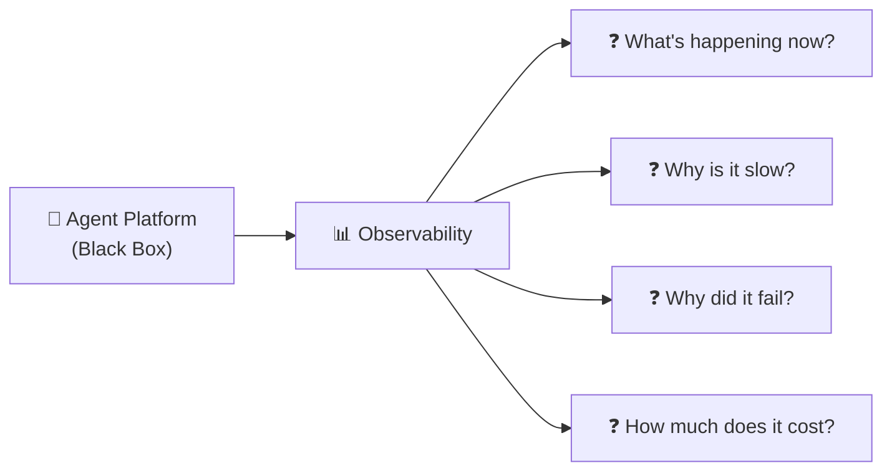

### Monitoring vs Observability:

| Monitoring | Observability |
|------------|--------------|
| Asks: "Is the system working?" | Asks: "Why isn't the system working?" |
| Predefined checks | Explore unknown issues |
| Dashboard + Alerts | Metrics + Logs + Traces |
| Tells if something is broken | Explains **why** something is broken |

---

## 3 Pillars of Observability

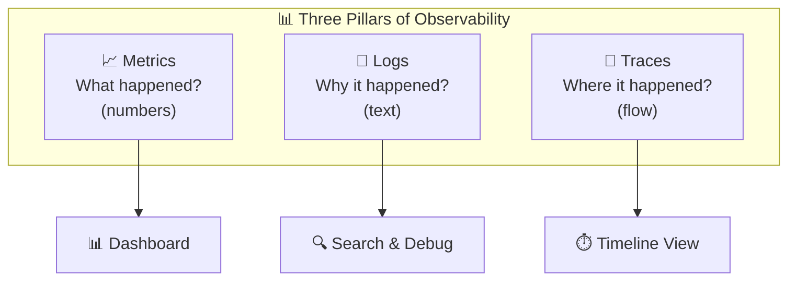

---

## Metrics

### What is it?
**Metrics** = numbers that represent the state of the system at a given moment.

### Essential Metrics for Agent Platform:

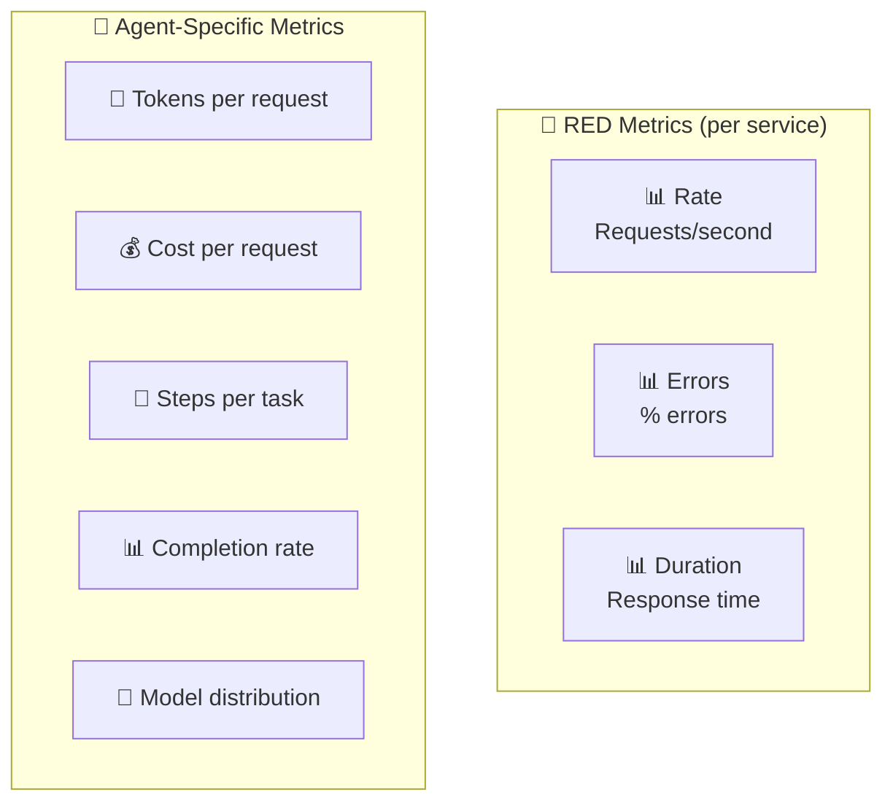

### Types of Metrics:

| Type | Explanation | Examples |
|------|-------------|----------|
| **Counter** | A counter that only goes up | Total requests, total errors |
| **Gauge** | Current value (goes up/down) | Active agents, queue depth |
| **Histogram** | Distribution of values | Response time percentiles |
| **Rate** | Change per second | Requests/sec, tokens/sec |

### Key Metrics Dashboard:

```
┌─────────────────────────────────────────────────┐
│  Agent Platform - Live Dashboard                │
├───────────────┬───────────────┬─────────────────┤
│ Requests/min  │ Error Rate    │ Avg Latency     │
│    1,234      │    0.3%       │    1.8s         │
├───────────────┼───────────────┼─────────────────┤
│ Active Agents │ Tokens/min    │ Cost/hour       │
│      47       │   125,000     │    $12.50       │
├───────────────┼───────────────┼─────────────────┤
│ Completion %  │ Model Calls   │ Tool Calls      │
│    94.2%      │    856        │    2,341        │
└───────────────┴───────────────┴─────────────────┘
```

---

## Logging

### What is logged in an Agent Platform?

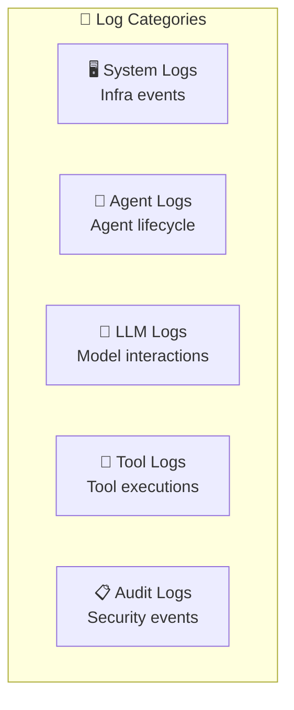

### Structured Logging:

```json
{
  "timestamp": "2026-02-21T10:00:01.234Z",
  "level": "INFO",
  "service": "agent-runtime",
  "trace_id": "abc-123-def",
  "span_id": "span-456",
  "agent_id": "data-analyst-v2",
  "tenant_id": "tenant-acme",
  "user_id": "roi@acme.com",
  "event": "tool_execution",
  "tool": "sql_query",
  "duration_ms": 245,
  "tokens_used": 1523,
  "model": "gpt-4o",
  "status": "success"
}
```

### Log Levels:

| Level | When | Example |
|-------|------|---------|
| **DEBUG** | Technical details | "Prompt template rendered: ..." |
| **INFO** | Normal event | "Agent completed task in 3 steps" |
| **WARN** | Potential issue | "Token usage at 80% of limit" |
| **ERROR** | Failure | "Tool execution failed: timeout" |
| **FATAL** | Critical failure | "Cannot connect to model provider" |

---

## Distributed Tracing

### What is it?
**Tracing** = tracking a **single request** across all the systems it passes through.

### Why is it important in Agent Platform?
A single request to an Agent passes through **many services**:

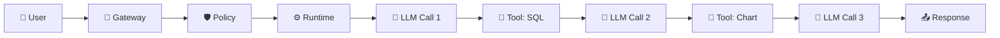

### Trace Visualization:

```
Trace ID: abc-123-def                      Total: 4.2s
├── API Gateway                            ▓░░░░░░░░░░░░░░░░░░  50ms
├── Policy Check                           ░▓░░░░░░░░░░░░░░░░░  30ms
├── Agent Orchestrator                     ░░▓▓▓▓▓▓▓▓▓▓▓▓▓▓▓▓  4.0s
│   ├── LLM Call 1 (gpt-4o)               ░░▓▓▓░░░░░░░░░░░░░░  1.2s
│   │   └── Token count: 1,200                     input: 800 + output: 400
│   ├── Tool: sql_query                    ░░░░░▓░░░░░░░░░░░░░  0.3s
│   ├── LLM Call 2 (gpt-4o)               ░░░░░░▓▓░░░░░░░░░░░  0.8s
│   │   └── Token count: 2,100                     input: 1,500 + output: 600
│   ├── Tool: chart_gen                    ░░░░░░░░▓░░░░░░░░░░  0.5s
│   └── LLM Call 3 (gpt-4o)               ░░░░░░░░░▓▓▓░░░░░░░  1.0s
│       └── Token count: 900                       input: 700 + output: 200
└── Response serialization                 ░░░░░░░░░░░░░▓░░░░░  120ms
    
Total tokens: 4,200  |  Cost: $0.042  |  Steps: 3  |  Tools: 2
```

### Trace Structure:

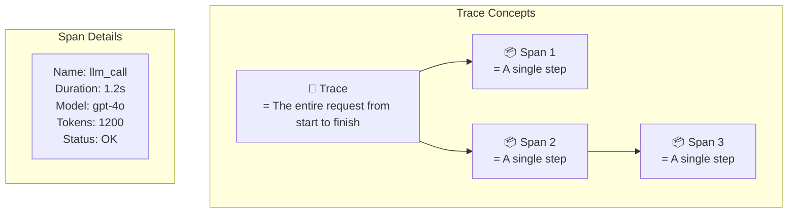

| Term | Explanation |
|------|-------------|
| **Trace** | The complete request, end to end |
| **Span** | A single operation (LLM call, tool call) |
| **Trace ID** | Unique identifier for the entire request |
| **Span ID** | Unique identifier for each operation |
| **Parent Span** | The Span that triggered the current one |

---

## Token Tracking

### Why is Token Tracking important?
**Tokens = money** in LLM platforms. Every token costs money.

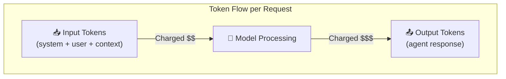

### Token Cost Comparison:

| Model | Input (per 1M) | Output (per 1M) | Speed |
|-------|----------------|------------------|-------|
| GPT-4o | $2.50 | $10.00 | Fast |
| GPT-4o-mini | $0.15 | $0.60 | Fastest |
| Claude 3.5 Sonnet | $3.00 | $15.00 | Fast |
| Claude 3 Opus | $15.00 | $75.00 | Slow |

### Token Tracking Architecture:

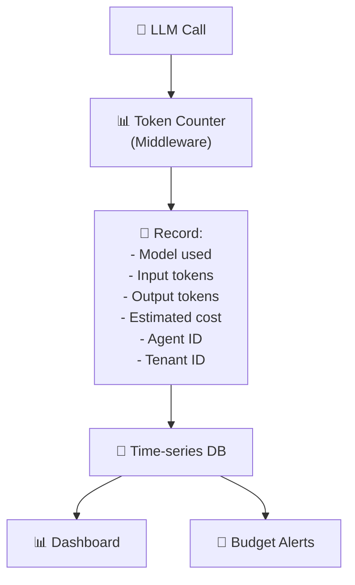

### Where are tokens consumed?

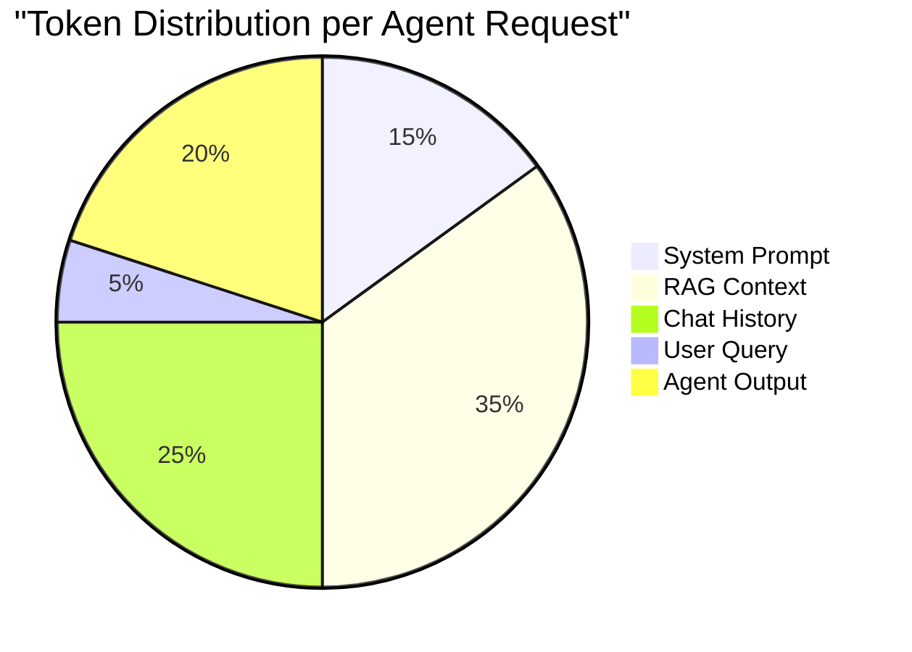

---

## Cost Observability Dashboard

### Dashboard Layout:

```
┌───────────────────────────────────────────────────┐
│           💰 Cost Observability Dashboard          │
├───────────────────────────────────────────────────┤
│                                                    │
│  📊 Total Cost Today: $127.50  (Budget: $200)     │
│  ████████████████████░░░░░░░░  63.7%              │
│                                                    │
├──────────────┬──────────────┬─────────────────────┤
│ By Tenant    │ By Agent     │ By Model             │
│ acme: $45    │ analyst: $30 │ gpt-4o: $80          │
│ beta: $38    │ support: $25 │ gpt-4o-mini: $20     │
│ gamma: $25   │ writer: $20  │ claude-3.5: $15      │
│ delta: $19   │ coder: $18   │ embeddings: $12      │
├──────────────┴──────────────┴─────────────────────┤
│                                                    │
│  📈 Cost Trend (7 days)                           │
│  $150 │    ╲                                      │
│  $120 │     ╲   ╱╲                                │
│  $100 │      ╲╱   ╲  ╱╲                           │
│   $80 │            ╲╱   ╲                         │
│       └─────────────────────                      │
│        Mon  Tue  Wed  Thu  Fri                    │
│                                                    │
├───────────────────────────────────────────────────┤
│ 🚨 Alerts:                                        │
│ ⚠️  Tenant 'acme' at 90% of daily budget          │
│ ⚠️  Agent 'analyst-v3' cost 3x higher than v2     │
└───────────────────────────────────────────────────┘
```

### Cost Dimensions:

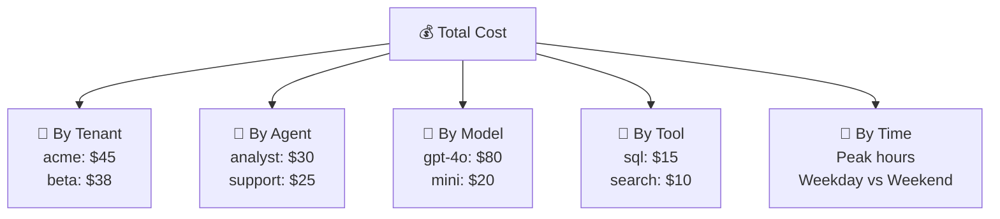

### Cost Attribution Model:

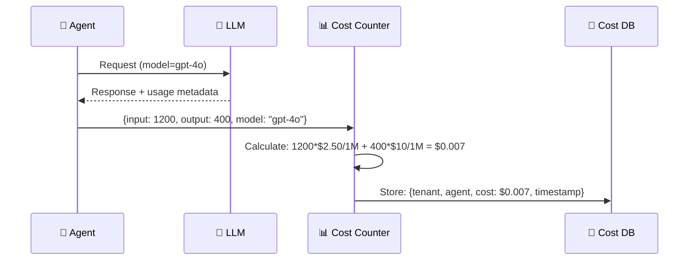

---

## Alerting

### When do we alert?

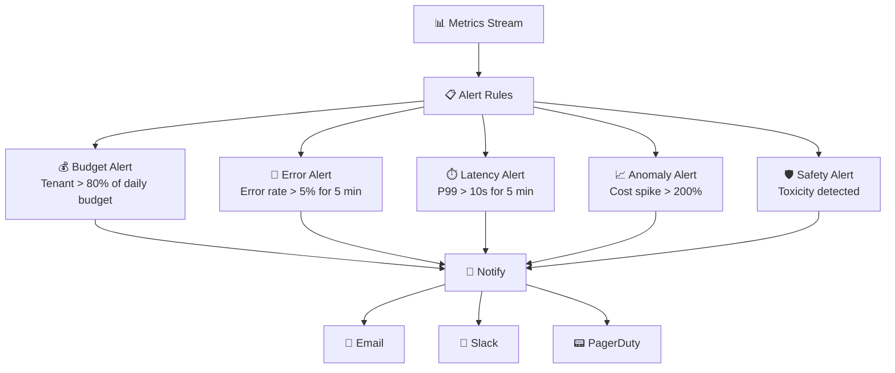

### Alert Severity:

| Severity | Example | Action |
|----------|---------|--------|
| **P0 - Critical** | Platform down | PagerDuty, immediate response |
| **P1 - High** | Error rate > 10% | Slack + Email, 15 min SLA |
| **P2 - Medium** | Budget 90% | Email, investigate today |
| **P3 - Low** | Latency increased 20% | Dashboard, review weekly |

---

## OpenTelemetry

### What is it?
**OpenTelemetry (OTel)** = an open standard for Observability. It defines how to collect Metrics, Logs, Traces.

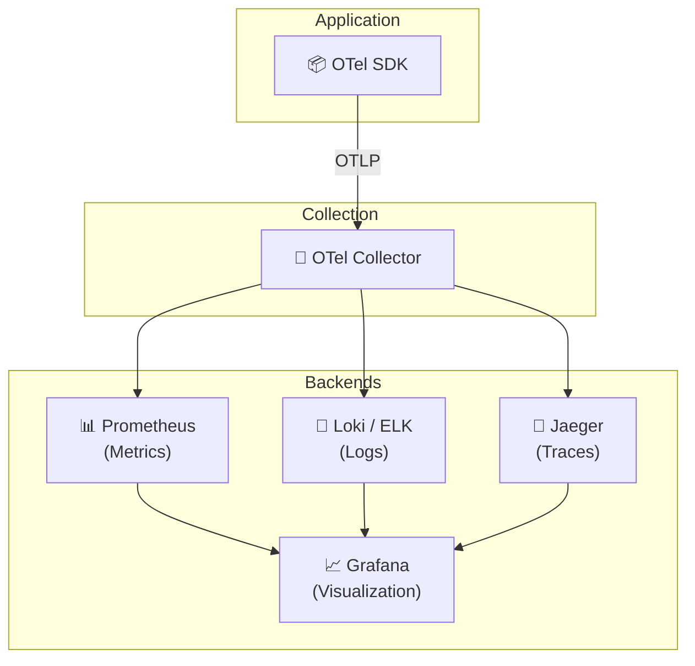

### Why is OTel important?

| Advantage | Explanation |
|-----------|-------------|
| **Vendor Neutral** | Not dependent on Azure Monitor / Datadog / etc. |
| **Standard** | Everyone speaks the same language |
| **Auto-instrumentation** | Automatic SDK for most languages |
| **Flexible backends** | Can switch backends without changing code |

---

## Pros and Cons

| ✅ Advantage | ❌ Disadvantage |
|-------------|----------------|
| Full visibility into the system | Storage costs (logs, traces) |
| Fast debugging with traces | Instrumentation overhead |
| Real-time cost control | Complex setup |
| Anomaly detection | Alert fatigue (too many alerts) |
| Capacity planning | Sensitive data in logs (PII risk) |

---

## Summary

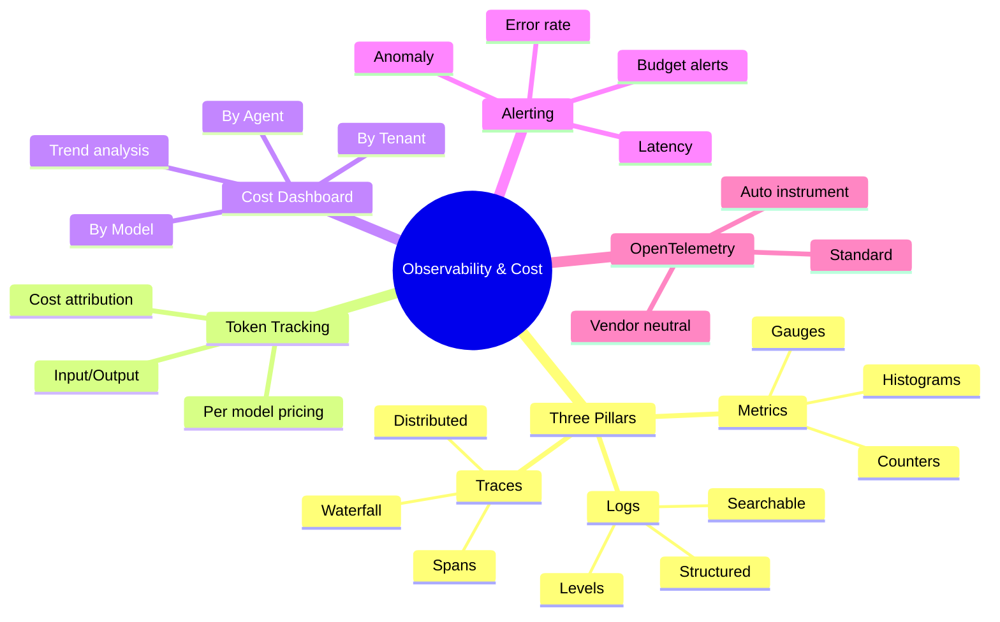

| What We Learned | Key Point |
|-----------------|-----------|
| **Observability** | The ability to understand what's happening inside the system |
| **3 Pillars** | Metrics, Logs, Traces |
| **Distributed Tracing** | Tracking a request across all services |
| **Token Tracking** | Tracking token consumption = money |
| **Cost Dashboard** | Cost breakdown per tenant/agent/model |
| **Alerting** | Real-time alerts on anomalies |
| **OpenTelemetry** | Open standard for Observability |

---

## ❓ Self-Check Questions

1. What is the difference between Monitoring and Observability?
2. What are the 3 pillars of Observability?
3. What is a Trace, Span, Trace ID?
4. Why is Token Tracking important?
5. What breakdowns are available in the Cost Dashboard?
6. What is OpenTelemetry and why is it important?
7. What is Alert Fatigue and how do you deal with it?

---

### 📝 Answers

<details>
<summary>1. What is the difference between Monitoring and Observability?</summary>

**Monitoring** = tracking predefined metrics ("CPU > 80%? Alert"). Reactive - responds to what is known to happen. **Observability** = the ability to understand **why** something is happening from the data. Investigative - answers questions you didn't anticipate in advance. Monitoring ⊂ Observability.
</details>

<details>
<summary>2. What are the 3 pillars of Observability?</summary>

1. **Logs** - Textual documentation of events ("what happened").
2. **Metrics** - Numerical measurements over time (latency, throughput, errors).
3. **Traces** - Tracking a request's journey through all services ("where it happened"). All together = a complete picture.
</details>

<details>
<summary>3. What is a Trace, Span, Trace ID?</summary>

**Trace** = the complete journey of a single request through the entire system. **Span** = a single segment within the trace (e.g., LLM call, tool execution, DB query). Each span has a start time, duration, metadata. **Trace ID** = a unique identifier that links all spans to the same request. It enables tracking a single request across all layers.
</details>

<details>
<summary>4. Why is Token Tracking important?</summary>

Because **tokens = money**. Without tracking: (1) you don't know how much each agent costs, (2) a single agent can consume a lot (long loops), (3) you can't identify anomalies. Token Tracking enables: cost visibility, anomaly detection, per-tenant billing, choosing a more cost-effective model.
</details>

<details>
<summary>5. What breakdowns are available in the Cost Dashboard?</summary>

The Cost Dashboard shows costs broken down by: (1) **Per Agent** - which agent costs the most, (2) **Per Tenant** - billing per customer, (3) **Per Model** - GPT-4o vs GPT-4o-mini, (4) **Per Tool** - expensive tools, (5) **Over Time** - trends over time.
</details>

<details>
<summary>6. What is OpenTelemetry and why is it important?</summary>

**OpenTelemetry (OTel)** = an open standard (not vendor-owned) for collecting logs, metrics, traces from applications. Important because: (1) **No vendor lock-in** - works with Jaeger, Prometheus, Azure Monitor, Datadog, (2) **Standardized** - auto-instrumentation for many languages, (3) **Community-driven** - maintained and supported by CNCF.
</details>

<details>
<summary>7. What is Alert Fatigue and how do you deal with it?</summary>

**Alert Fatigue** = when there are too many alerts, the team starts ignoring them and misses even the critical ones. How to deal with it: (1) **Severity levels** - Critical/Warning/Info, (2) **Consolidation** - one alert per issue, not 20, (3) **Actionable** - every alert must have a clear action, (4) **Cooldown** - don't send the same alert again and again.
</details>

---

**[⬅️ Back to Chapter 10: Evaluation](10-evaluation-engine.md)** | **[➡️ Continue to Chapter 12: Security & Isolation →](12-security-isolation.md)**
