# 📈 Chapter 13: Scalability & High Availability

## Table of Contents
- [What is Scalability?](#what-is-scalability)
- [Horizontal vs Vertical Scaling](#horizontal-vs-vertical-scaling)
- [Stateless vs Stateful Scaling](#stateless-vs-stateful-scaling)
- [Agent Scaling Challenges](#agent-scaling-challenges)
- [Load Balancing](#load-balancing)
- [Queue-Based Architecture](#queue-based-architecture)
- [Auto-Scaling](#auto-scaling)
- [High Availability (HA)](#high-availability-ha)
- [Multi-Region](#multi-region)
- [Caching Strategies](#caching-strategies)
- [Partitioning & Sharding](#partitioning--sharding)
- [Pros and Cons](#pros-and-cons)
- [Summary and Questions](#summary-and-questions)

---

## What is Scalability?

**Scalability** = the ability of a system **to grow** to handle more load, without losing performance.

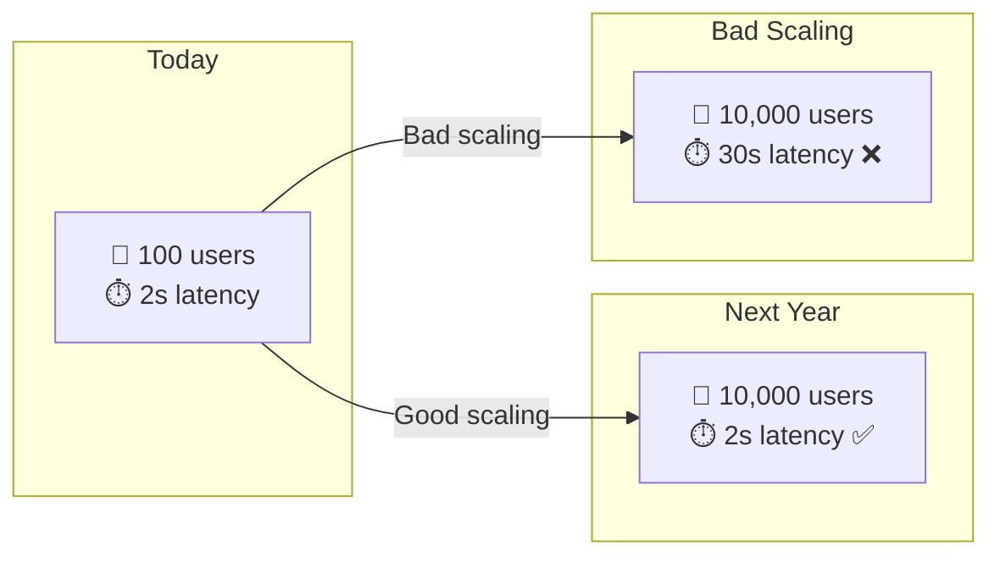

---

## Horizontal vs Vertical Scaling

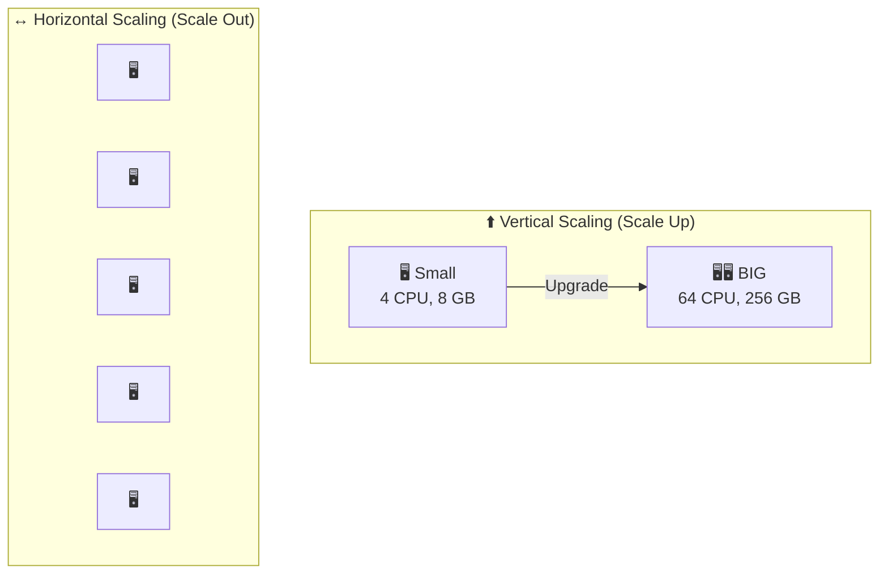

### Comparison:

| | Vertical (Scale Up) | Horizontal (Scale Out) |
|---|---|---|
| **What you do** | Scale up an existing server | Add more servers |
| **Limit** | There's a ceiling (max hardware) | No ceiling (almost) |
| **Cost** | Very expensive upfront | Cheap per unit |
| **Downtime** | Requires restart | Zero downtime |
| **Complexity** | Simple | Complex (state, sync) |
| **Agents** | ❌ Not recommended | ✅ Recommended |

---

## Stateless vs Stateful Scaling

### Why is this important for Agents?
Agents maintain **state** (conversation, memory, Thread). This makes scaling difficult.

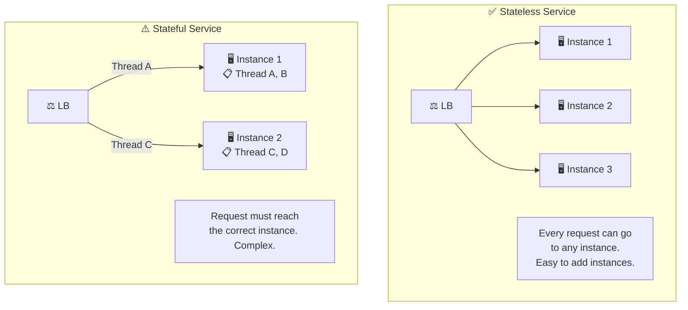

### Solution: Externalize State

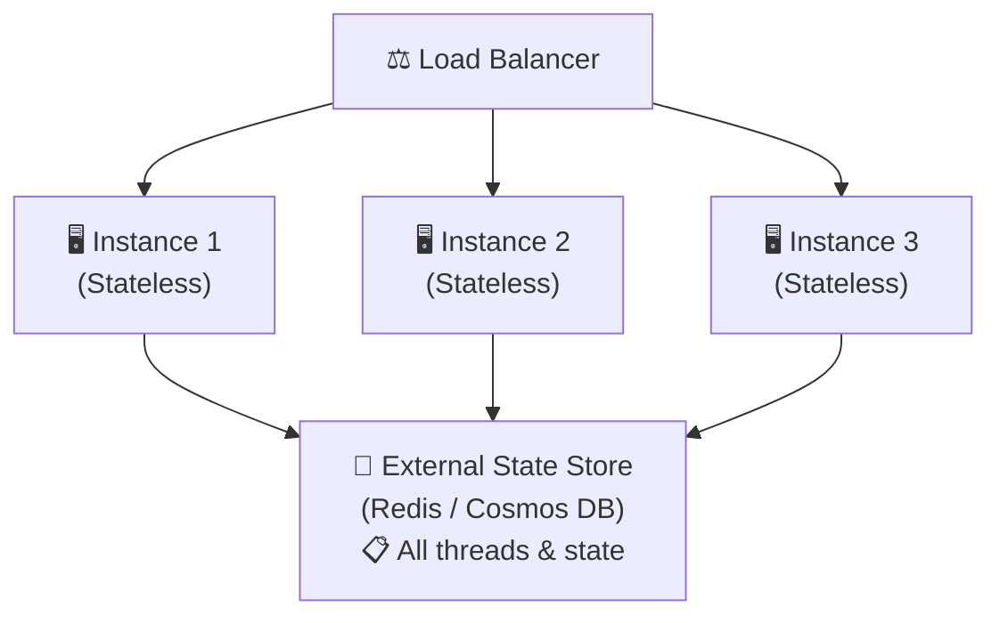

| Strategy | Explanation | Pros | Cons |
|----------|-------------|------|------|
| **Externalize State** | Store state in an external DB | Easy to scale | Latency to DB |
| **Sticky Sessions** | Route user to the same instance | State local | Instance failure = lost state |
| **Event Sourcing** | Store events, rebuild state | Reliable, audit | Complex |

---

## Agent Scaling Challenges

### Why are Agents hard to Scale?

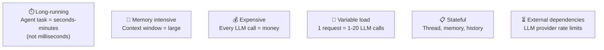

### Resource per Agent Request:

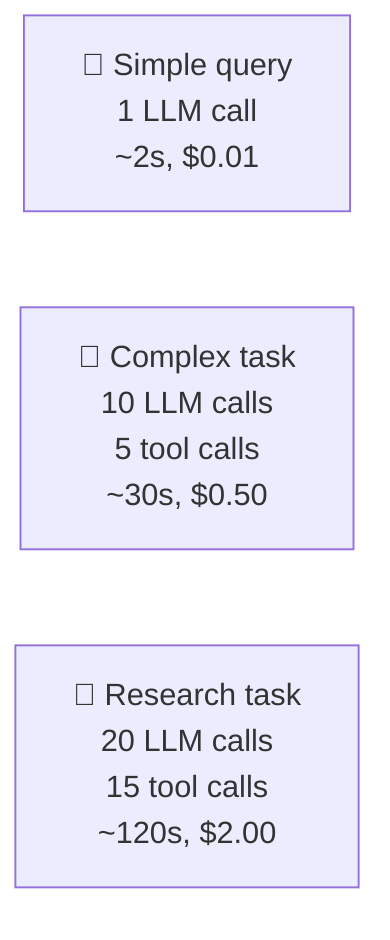

---

## Load Balancing

### Load Balancing Strategies:

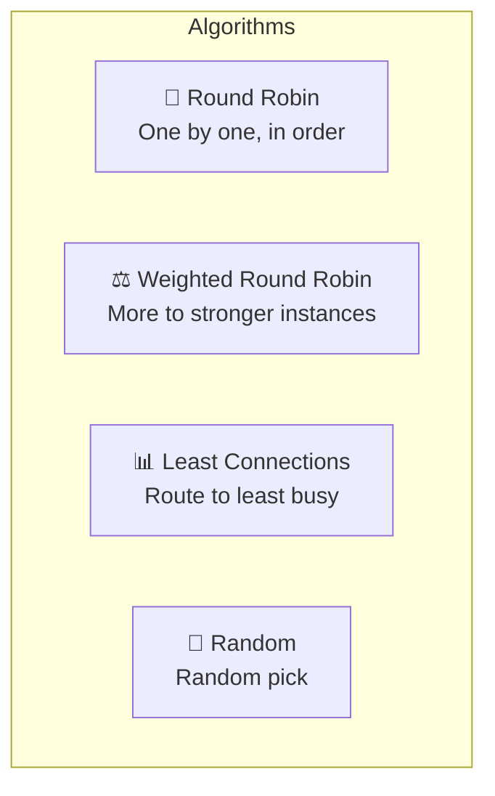

### Agent-Aware Load Balancing:

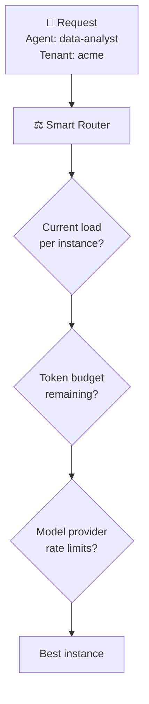

---

## Queue-Based Architecture

### Why Queues?
Agent requests are **long** and **heavy**. A Queue enables:
- **Decoupling** - separation between the sender and the processor
- **Smoothing** - smoothing out load spikes
- **Retry** - automatic retry
- **Priority** - handling by priority

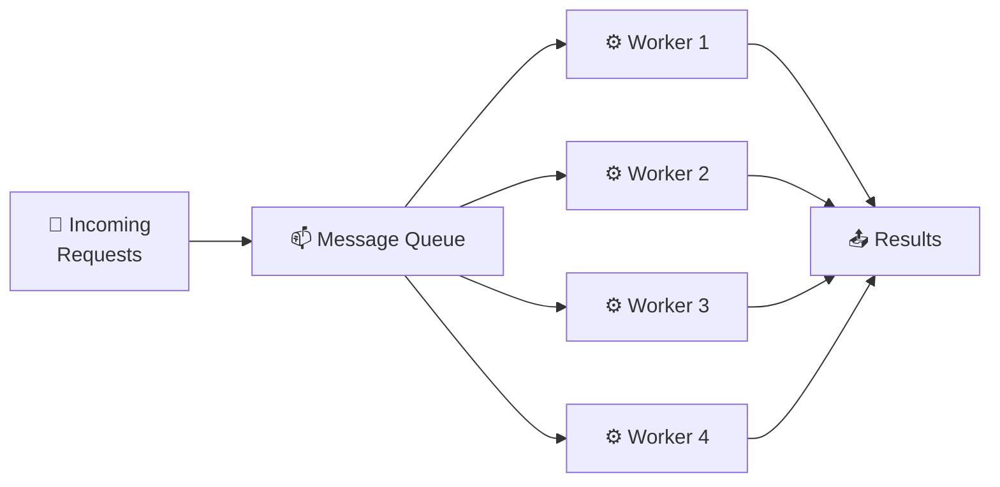

### Priority Queues:

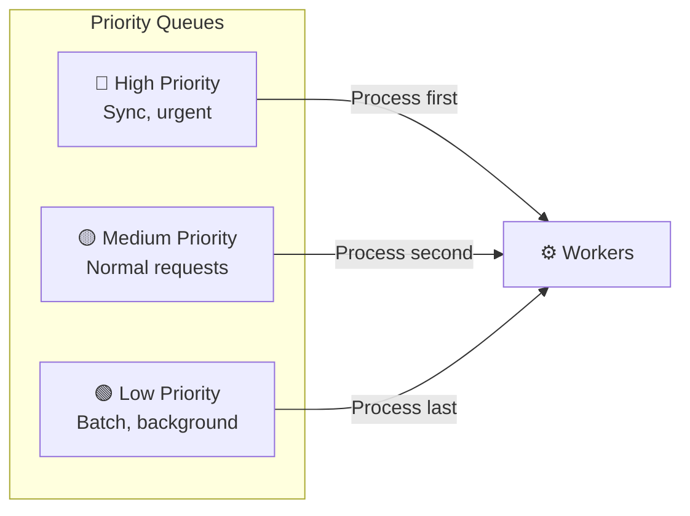

### Async Agent Execution:

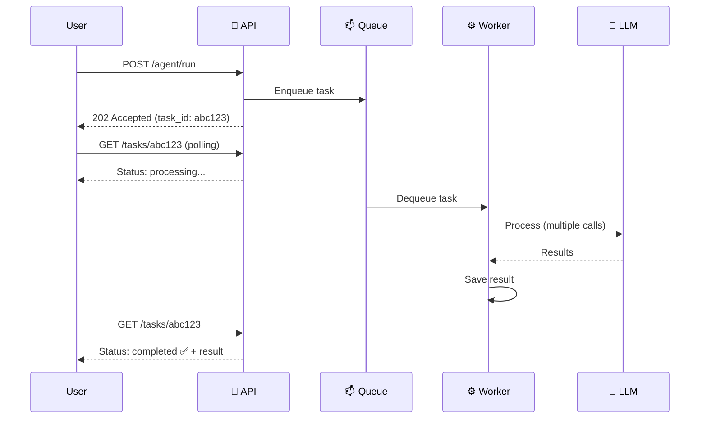

---

## Auto-Scaling

### What is it?
**Auto-scaling** = the system **adds/removes** instances automatically according to the load.

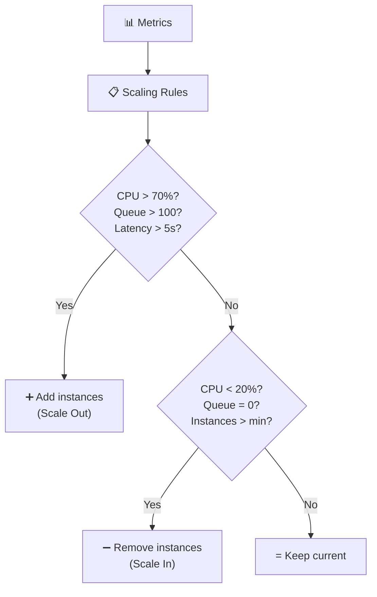

### Scaling Metrics for Agents:

| Metric | Scale Out When | Scale In When |
|--------|---------------|---------------|
| **CPU** | > 70% for 5 min | < 20% for 10 min |
| **Queue Depth** | > 50 pending tasks | Queue = 0 for 10 min |
| **Active Agents** | > 80% capacity | < 20% capacity |
| **Latency P99** | > 10s | < 2s consistently |
| **Concurrent requests** | > threshold | < min threshold |

### KEDA (Kubernetes Event-Driven Autoscaler):

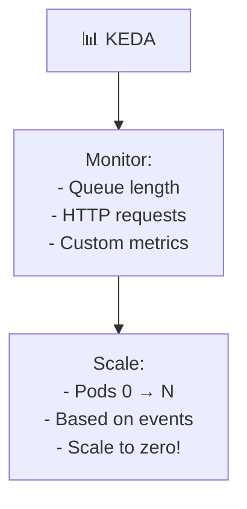

---

## High Availability (HA)

### What is it?
**HA** = the system **continues to work** even when parts of it go down.

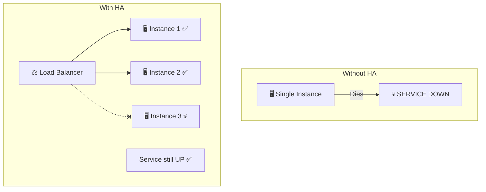

### HA Patterns:

| Pattern | Explanation |
|---------|-------------|
| **Redundancy** | Multiple instances of everything |
| **Health Checks** | Automatic detection of failures |
| **Failover** | Automatic switch to backup |
| **Circuit Breaker** | Stop calling failed services |
| **Retry with Backoff** | Retry with increasing delays |
| **Graceful Degradation** | Reduce features rather than fail |

### Circuit Breaker:

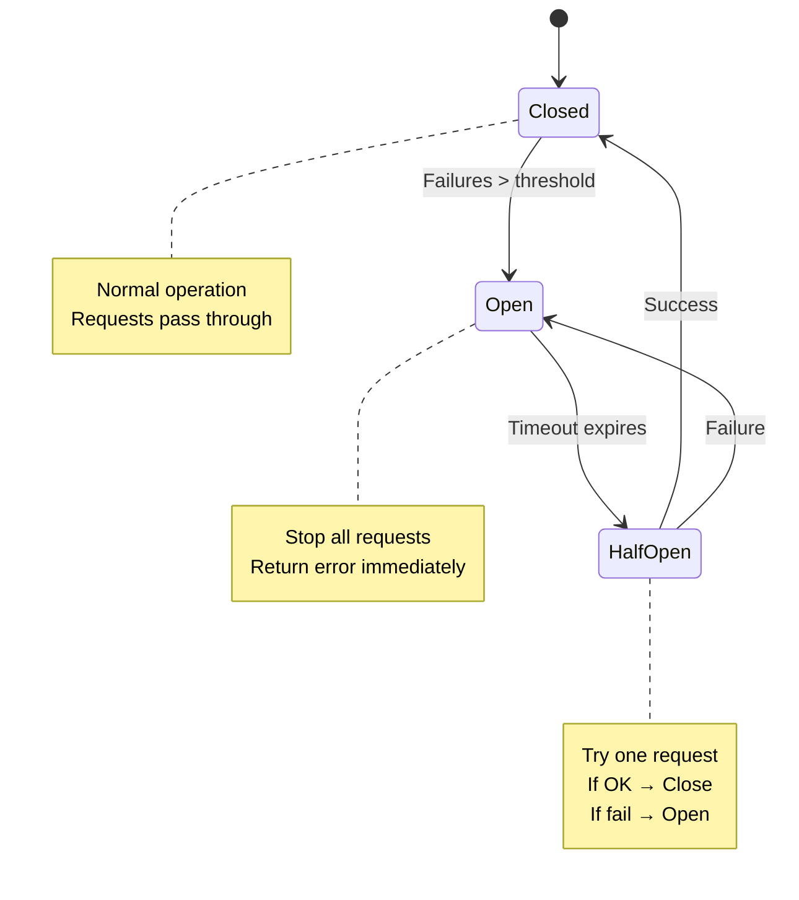

---

## Multi-Region

### Why Multi-Region?

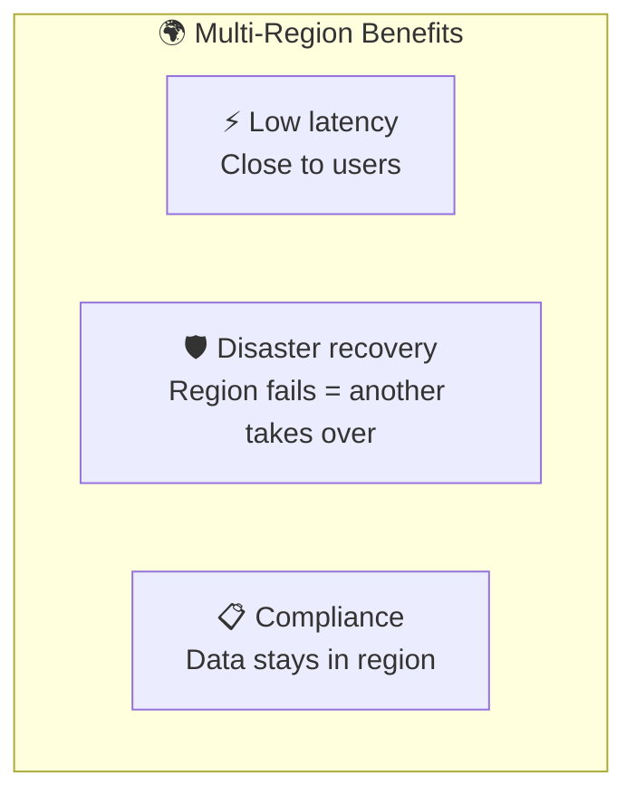

### Active-Active vs Active-Passive:

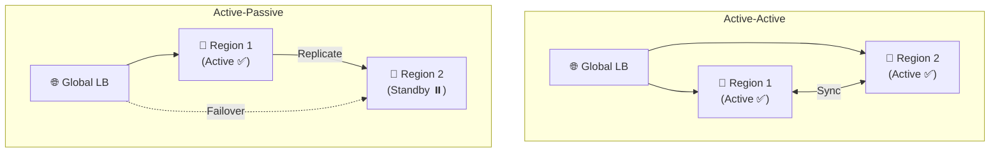

| | Active-Active | Active-Passive |
|---|---|---|
| **Latency** | ✅ Low (close to user) | ⚠️ One region only |
| **Capacity** | ✅ 2x capacity | ⚠️ Wasted standby |
| **Failover** | ✅ Instant | ⚠️ Minutes |
| **Complexity** | ❌ Data sync complex | ✅ Simpler |
| **Cost** | ❌ 2x cost | ✅ Lower |

---

## Caching Strategies

### What goes into the Cache in an Agent Platform?

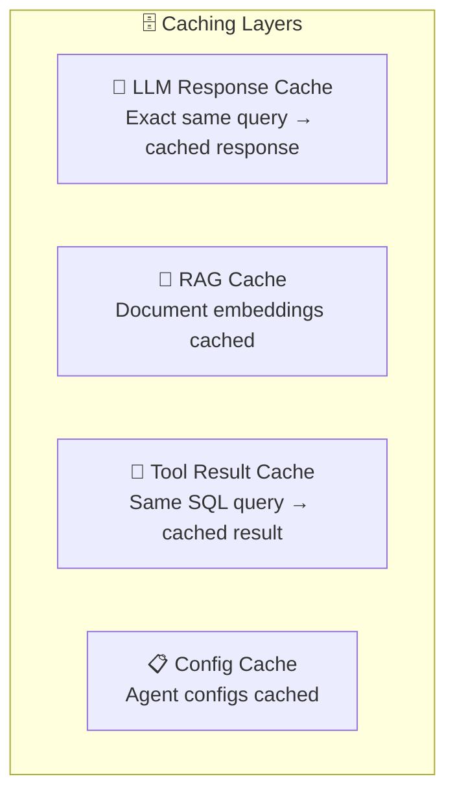

### Semantic Cache:

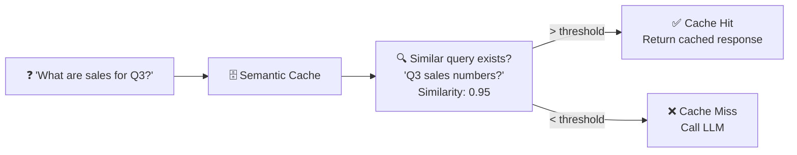

| Cache Type | Hit Rate | Savings |
|------------|----------|---------|
| **Exact Match** | Low (5-10%) | Tokens + latency |
| **Semantic Cache** | Medium (20-40%) | Tokens + latency |
| **RAG Embedding Cache** | High (80%+) | Embedding compute |
| **Tool Result Cache** | Variable | Tool execution time |

---

## Partitioning & Sharding

### Tenant-Based Partitioning:

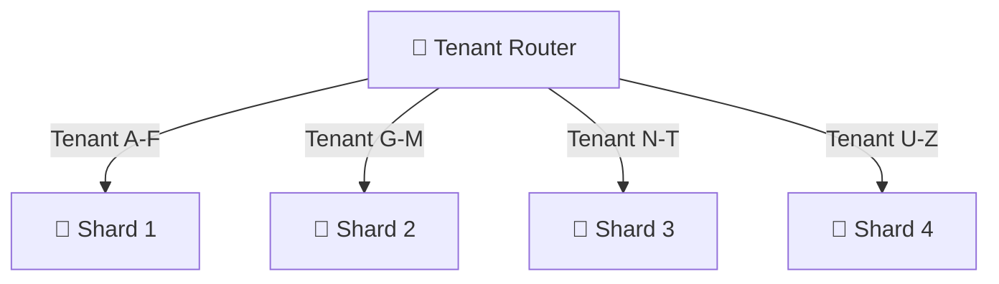

### Partitioning Strategies:

| Strategy | Explanation | For Agents |
|----------|-------------|-----------|
| **By Tenant** | Each tenant in a different partition | ✅ Common, good isolation |
| **By Agent Type** | Each agent type in a different partition | ⚠️ Some types may be hot |
| **By Region** | By geographic region | ✅ Compliance + latency |
| **By Time** | By date (logs, history) | ✅ For time-series data |

---

## Pros and Cons

| ✅ Advantage | ❌ Disadvantage |
|----------|----------|
| Handle growing traffic | Added complexity |
| Cost efficiency (scale to zero) | State management challenges |
| High availability | Data consistency challenges |
| Low latency (multi-region) | Network costs |
| Fault tolerance | Debugging harder |

---

## Summary

```mermaid
mindmap
  root((Scalability & HA))
    Scaling Types
      Horizontal ✅
      Vertical ❌
    State Management
      Externalize state
      Stateless services
      Event sourcing
    Load Balancing
      Round Robin
      Least Connections
      Agent-aware
    Queues
      Async processing
      Priority queues
      Spike smoothing
    Auto-Scaling
      Metrics-based
      KEDA
      Scale to zero
    High Availability
      Redundancy
      Circuit Breaker
      Failover
    Multi-Region
      Active-Active
      Active-Passive
      Data sovereignty
    Caching
      LLM cache
      Semantic cache
      Tool cache
    Partitioning
      By Tenant
      By Region
      By Time
```

| What We Learned | Key Point |
|-----------------|-----------|
| **Horizontal Scaling** | Add more instances (not a more powerful server) |
| **Stateless** | Externalizing state enables easy scaling |
| **Queue-Based** | Queue separates sender from worker, enables async |
| **Auto-Scaling** | The system grows and shrinks automatically based on load |
| **HA** | Redundancy + failover = always-available service |
| **Multi-Region** | Low latency + DR + Compliance |
| **Caching** | Semantic Cache saves tokens and money |
| **Partitioning** | Partitioning per tenant for performance and isolation |

---

## ❓ Self-Check Questions

1. What is the difference between Horizontal and Vertical scaling?
2. Why are Agents hard to scale (5 reasons)?
3. What is Externalize State and why is it important?
4. What is the advantage of Queue-Based Architecture?
5. What is Auto-Scaling and which metrics are used?
6. What is the difference between Active-Active and Active-Passive?
7. What is Semantic Cache and how does it help?
8. What is the tradeoff of Circuit Breaker?

---

### 📝 Answers

<details>
<summary>1. What is the difference between Horizontal and Vertical scaling?</summary>

**Vertical (Scale Up)** = enlarging the existing machine (more CPU, RAM). Simple but has a ceiling. **Horizontal (Scale Out)** = adding more machines (more instances). No theoretical ceiling, but requires handling state and load balancing.
</details>

<details>
<summary>2. Why are Agents hard to scale (5 reasons)?</summary>

1. **Stateful** - each agent holds state (thread, memory).
2. **Long-Running** - requests last seconds (long loops).
3. **Unpredictable Cost** - each request consumes a different number of tokens.
4. **External Dependencies** - LLM APIs with rate limits and variable latency.
5. **Fan-Out** - a single agent can invoke multiple tools/sub-agents in parallel.
</details>

<details>
<summary>3. What is Externalize State and why is it important?</summary>

**Externalize State** = moving the state from the instance to an external DB (Redis, Cosmos DB). Important because: if the state is inside the instance, you can't scale out (a request must reach the same instance). With external state: every instance is stateless → any instance can handle any request.
</details>

<details>
<summary>4. What is the advantage of Queue-Based Architecture?</summary>

Instead of requests going directly to the Agent, they enter a **queue**. Advantages: (1) **Load smoothing** - a spike doesn't crash the system, (2) **Decoupling** - producer and consumer are independent, (3) **Retry** - a failed message goes back to the queue, (4) **Scale** - add consumers based on queue depth.
</details>

<details>
<summary>5. What is Auto-Scaling and which metrics are used?</summary>

**Auto-Scaling** = the system adds/removes instances automatically. Metrics: (1) **Queue depth** - how many messages are waiting in the queue, (2) **Active requests** - how many requests are being processed, (3) **CPU/Memory** - resource utilization, (4) **Latency** - response time. For Agents: queue depth is usually the best metric.
</details>

<details>
<summary>6. What is the difference between Active-Active and Active-Passive?</summary>

**Active-Active** = two regions active simultaneously, traffic is distributed. RTO ≈ 0, but requires complex data sync, more expensive. **Active-Passive** = one region active, the other on standby. When the first goes down → failover to the second. RTO > 0 (there is downtime), but cheaper.
</details>

<details>
<summary>7. What is Semantic Cache and how does it help?</summary>

**Semantic Cache** = saving LLM responses and returning them for **semantically similar** (not identical) questions. Helps with **scalability** by: (1) saving LLM calls → less load on APIs, (2) saving tokens → saving costs, (3) lower latency on cache hit (milliseconds instead of seconds).
</details>

<details>
<summary>8. What is the tradeoff of Circuit Breaker?</summary>

**Advantage**: protects against cascading failure - when a service is unavailable, it stops sending requests that will fail → saves resources. **Disadvantage**: legitimate requests are rejected while the CB is open - they can't be handled. You need to properly tune the thresholds and the timeout period.
</details>

---

**[⬅️ Back to Chapter 12: Security](12-security-isolation.md)** | **[➡️ Continue to Chapter 14: HLD Architecture →](14-hld-architecture.md)**
