# 🏗️ Chapter 14: HLD Architecture - Vendor Agnostic

## Table of Contents
- [What is HLD?](#what-is-hld)
- [System Context](#system-context)
- [Full Architecture](#full-architecture)
- [Control Plane Architecture](#control-plane-architecture)
- [Runtime Plane Architecture](#runtime-plane-architecture)
- [Data Flow](#data-flow)
- [Component Breakdown](#component-breakdown)
- [Cross-Cutting Concerns](#cross-cutting-concerns)
- [Deployment Architecture](#deployment-architecture)
- [Technology Decisions](#technology-decisions)
- [Summary and Questions](#summary-and-questions)

---

## What is HLD?

**HLD (High-Level Design)** = A **high-level** architectural description of the system - what the components are, how they communicate, and what each one is responsible for.

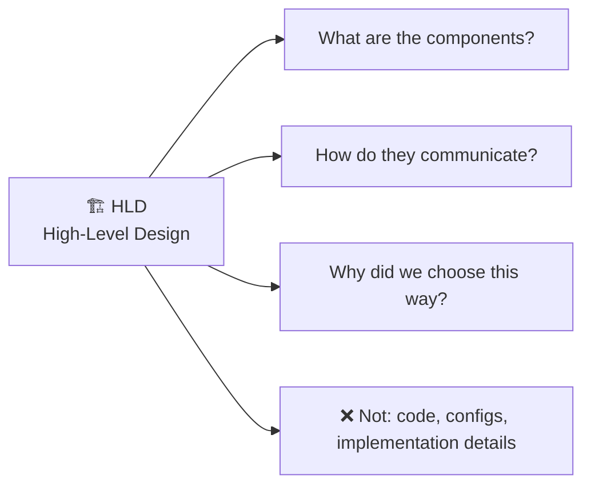

### Vendor Agnostic = Not dependent on a specific provider:

| Vendor Agnostic | Vendor Specific |
|-----------------|-----------------|
| "Message Queue" | "Azure Service Bus" |
| "LLM Provider" | "Azure OpenAI" |
| "Vector Database" | "Azure AI Search" |
| "Container Orchestration" | "AKS" |
| "Identity Provider" | "Microsoft Entra ID" |

---

## System Context

### Who uses the system?

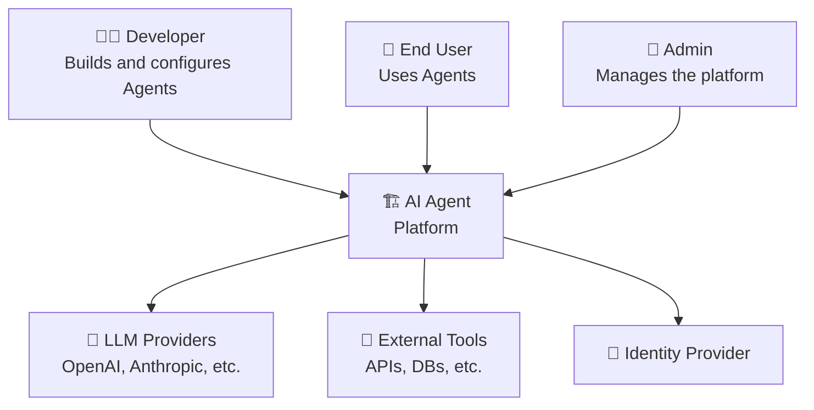

---

## Full Architecture

### Full HLD Diagram:

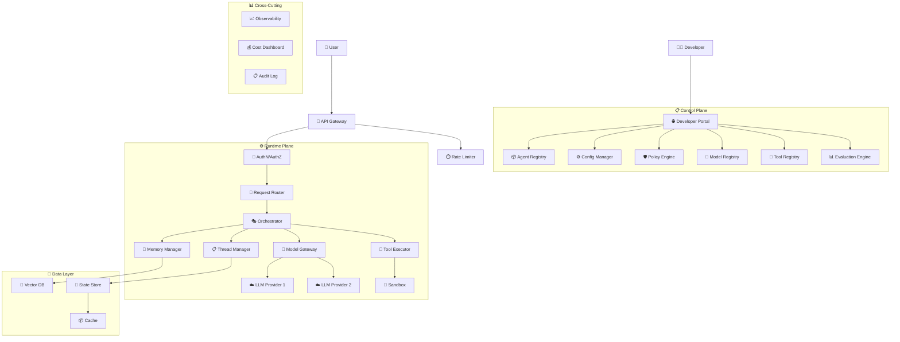

---

## Control Plane Architecture

### Control Plane Components:

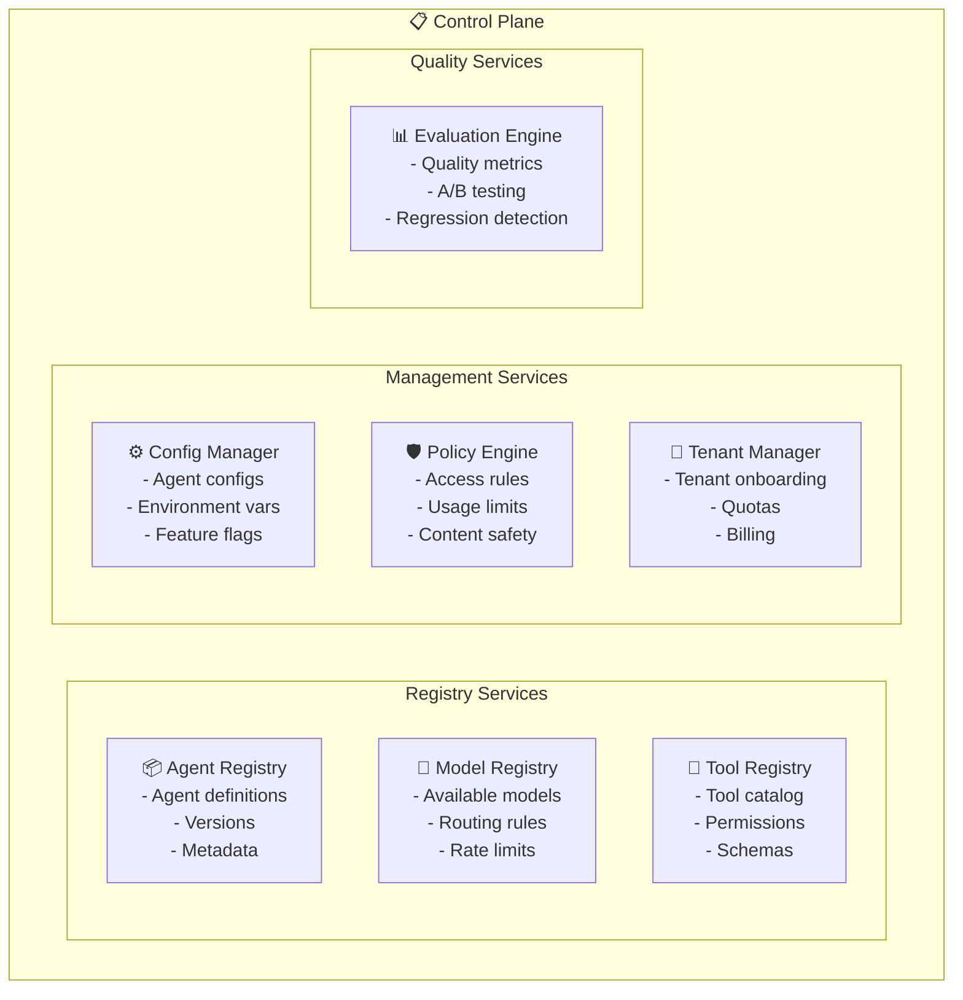

### Control Plane APIs:

| API | Method | Path | Description |
|-----|--------|------|-------------|
| Create Agent | POST | /agents | Define a new Agent |
| List Agents | GET | /agents | List all Agents |
| Get Agent | GET | /agents/{id} | Agent details |
| Update Config | PUT | /agents/{id}/config | Update settings |
| Register Tool | POST | /tools | Register a new tool |
| Set Policy | POST | /policies | Define a policy |
| Run Evaluation | POST | /evaluations | Run an evaluation |

---

## Runtime Plane Architecture

### Request Processing Flow:

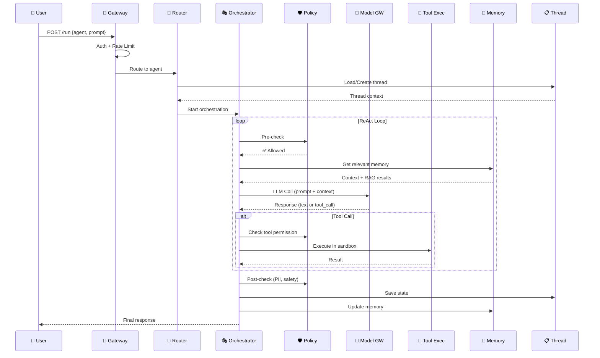

### Orchestrator State Machine:

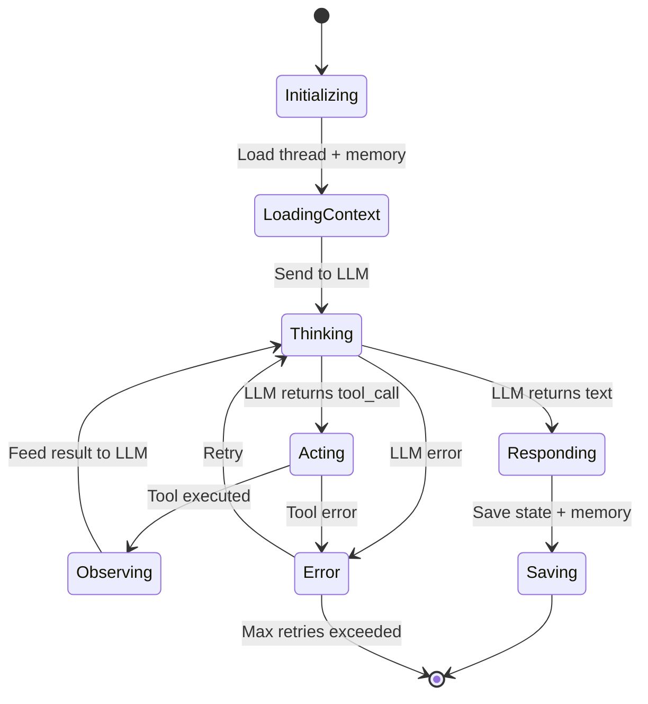

---

## Data Flow

### Data Flow Diagram:

```mermaid
graph LR
    subgraph "Ingest"
        Docs["📄 Documents"] --> Chunker["✂️ Chunker"]
        Chunker --> Embedder["📐 Embedder"]
        Embedder --> VDB["💾 Vector DB"]
    end
    
    subgraph "Query"
        Query["❓ User Query"] --> QEmbed["📐 Embed Query"]
        QEmbed --> Search["🔍 Vector Search"]
        VDB --> Search
        Search --> Context["📋 Top K Results"]
        Context --> LLM["🧠 LLM"]
        LLM --> Response["📤 Response"]
    end
    
    subgraph "State"
        Response --> Thread["📋 Thread Store"]
        Response --> History["📜 Chat History"]
        Response --> Audit["📋 Audit Log"]
    end
```

### Data Stores:

| Store | Type | What it stores | E.g. |
|-------|------|---------------|------|
| **State Store** | Key-Value / Document | Thread state, agent state | Redis, Cosmos DB |
| **Vector DB** | Vector | Document embeddings for RAG | Qdrant, Pinecone |
| **Chat History** | Document | Conversation messages | MongoDB, Cosmos DB |
| **Audit Log** | Append-only | All actions | Kafka → Storage |
| **Config Store** | Key-Value | Agent configs, policies | etcd, Consul |
| **Cache** | In-memory | LLM responses, tool results | Redis |
| **Blob Storage** | Object | Files, documents | S3, Blob |

---

## Component Breakdown

### Each component, its role, and inputs/outputs:

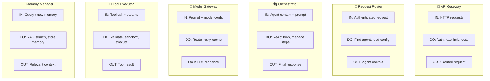

---

## Cross-Cutting Concerns

### Components that span across all layers:

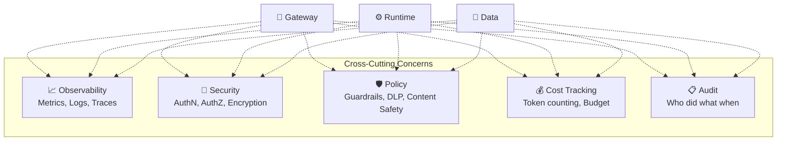

---

## Deployment Architecture

### Kubernetes-Based Deployment:

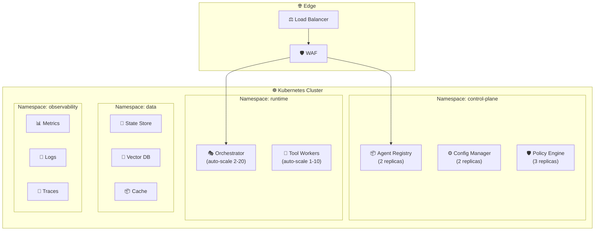

### Deployment Configurations:

| Environment | Config |
|------------|--------|
| **Dev** | 1 node, minimal replicas, mock LLM |
| **Staging** | 3 nodes, real LLM, synthetic data |
| **Production** | 5+ nodes, auto-scale, multi-region, real data |

---

## Technology Decisions

### Each component and its technology options (Vendor Agnostic):

| Component | Option A | Option B | Option C |
|-----------|----------|----------|----------|
| **API Gateway** | Kong | Envoy | NGINX |
| **Container Runtime** | Kubernetes | Docker Swarm | Nomad |
| **State Store** | Redis | PostgreSQL | MongoDB |
| **Vector DB** | Qdrant | Pinecone | Weaviate |
| **Message Queue** | RabbitMQ | Kafka | NATS |
| **Cache** | Redis | Memcached | Hazelcast |
| **Observability** | OTel + Grafana | Datadog | Elastic Stack |
| **Secret Vault** | HashiCorp Vault | CyberArk | SOPS |
| **Identity** | Keycloak | Auth0 | Okta |
| **LLM Framework** | LangChain | Semantic Kernel | LlamaIndex |
| **Blob Storage** | MinIO | Ceph | NAS |

### Decision Framework:

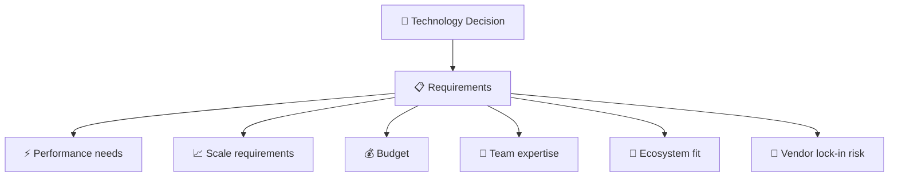

### How to Choose: Decision Flowcharts

#### Choosing a Vector Database:

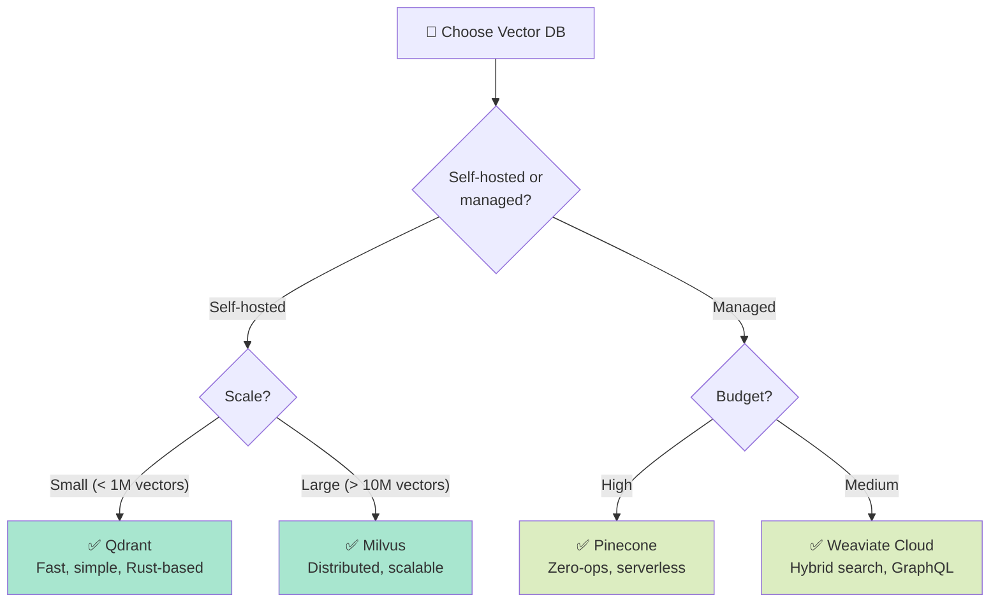

#### Choosing a Message Queue:

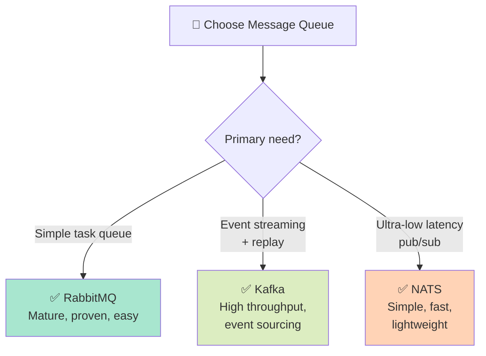

### Deployment Example (Kubernetes)

A minimal production deployment of the platform's runtime plane:

```yaml
# kubernetes/orchestrator-deployment.yaml
apiVersion: apps/v1
kind: Deployment
metadata:
  name: orchestrator
  namespace: agent-runtime
spec:
  replicas: 3
  selector:
    matchLabels:
      app: orchestrator
  template:
    metadata:
      labels:
        app: orchestrator
    spec:
      serviceAccountName: orchestrator-sa
      containers:
      - name: orchestrator
        image: agent-platform/orchestrator:v2.1
        ports:
        - containerPort: 8080
        env:
        - name: LLM_ENDPOINT
          valueFrom:
            secretKeyRef:
              name: llm-secrets
              key: endpoint
        - name: STATE_STORE_URL
          value: "redis://redis.agent-data:6379"
        - name: VECTOR_DB_URL
          value: "http://qdrant.agent-data:6333"
        resources:
          requests:
            memory: "512Mi"
            cpu: "500m"
          limits:
            memory: "2Gi"
            cpu: "2000m"
        livenessProbe:
          httpGet:
            path: /health
            port: 8080
        readinessProbe:
          httpGet:
            path: /ready
            port: 8080

---
apiVersion: autoscaling/v2
kind: HorizontalPodAutoscaler
metadata:
  name: orchestrator-hpa
  namespace: agent-runtime
spec:
  scaleTargetRef:
    apiVersion: apps/v1
    kind: Deployment
    name: orchestrator
  minReplicas: 3
  maxReplicas: 20
  metrics:
  - type: Resource
    resource:
      name: cpu
      target:
        type: Utilization
        averageUtilization: 70
```

---

## Architecture Qualities

### Non-Functional Requirements:

| Quality | Target | How |
|---------|--------|-----|
| **Latency** | P99 < 5s for simple queries | Caching, streaming |
| **Throughput** | 1000 RPS | Horizontal scaling |
| **Availability** | 99.9% (8.7 hours/year downtime) | Multi-AZ, redundancy |
| **Durability** | No data loss | Replication, backups |
| **Security** | SOC 2 compliant | Zero Trust, encryption |
| **Scalability** | 10x without redesign | Stateless, auto-scale |
| **Extensibility** | Add tools/models easily | Registry pattern, plugins |
| **Operability** | Quick debugging | Observability, tracing |

---

## Summary

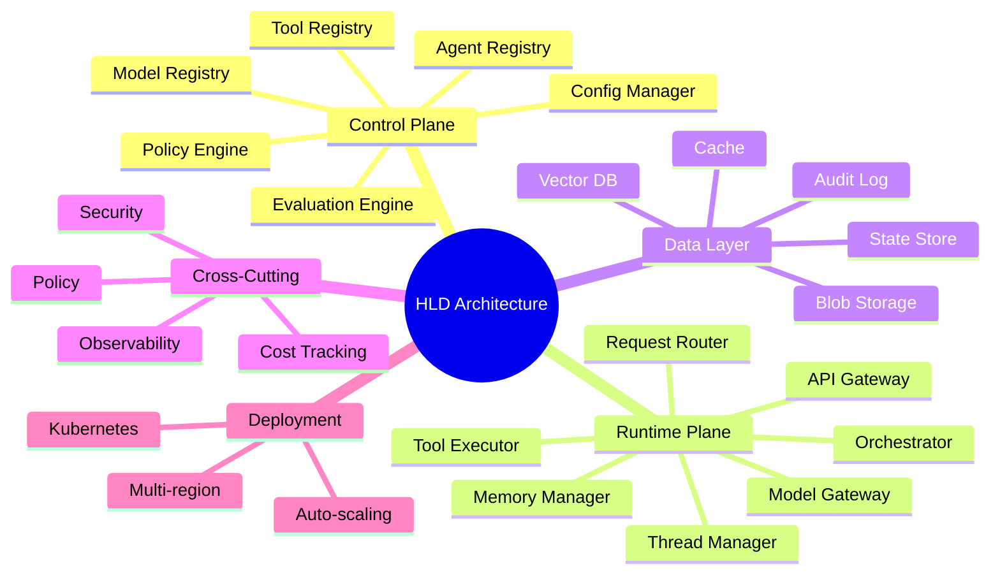

| What We Learned | Key Point |
|----------------|-----------|
| **HLD** | High-level architectural description, without implementation |
| **Control Plane** | Management, configurations, Registries |
| **Runtime Plane** | Execution, Orchestrator, Model/Tool Gateway |
| **Data Layer** | State, Vectors, Cache, Audit |
| **Cross-Cutting** | Observability, Security, Cost - across all layers |
| **Vendor Agnostic** | Not dependent on a specific provider |
| **Architecture Qualities** | Latency, Throughput, Availability, Security |

---

## ❓ Self-Check Questions

1. What is the difference between the Control Plane and the Runtime Plane?
2. What are the 7 components of the Control Plane?
3. What does the Orchestrator do and what is its state machine?
4. What are the 7 types of Data Stores and what does each one store?
5. What are Cross-Cutting Concerns and give 5 examples?
6. What is the difference between Vendor Agnostic and Vendor Specific?
7. What are the main Non-Functional Requirements?

---

### 📝 Answers

<details>
<summary>1. What is the difference between the Control Plane and the Runtime Plane?</summary>

**Control Plane** manages the "what" - configurations, policies, registration, versions. It is active when administrators make changes. **Runtime Plane** executes the "how" - request processing, LLM calls, tool execution, orchestration. It is active with every user request. This separation allows independent scaling of each layer.
</details>

<details>
<summary>2. What are the 7 components of the Control Plane?</summary>

1. **API Gateway** - Entry point, auth, rate limiting.
2. **Agent Registry** - Catalog of all agents.
3. **Config Manager** - Configuration management and versioning.
4. **Policy Engine** - Rule enforcement.
5. **Identity & Access** - AuthN + AuthZ.
6. **Tenant Manager** - Multi-tenancy management.
7. **Admin Portal** - UI for administrators.
</details>

<details>
<summary>3. What does the Orchestrator do and what is its state machine?</summary>

The Orchestrator manages the ReAct loop and the transitions between steps. State machine: **Init** → **Planning** (the LLM decides what to do) → **Executing** (runs tool/LLM) → **Waiting** (waiting for HITL or external) → **Completed** / **Failed** / **Cancelled**. Max steps guard prevents infinite loops.
</details>

<details>
<summary>4. What are the 7 types of Data Stores and what does each one store?</summary>

1. **Config Store** - Agent, tool, and policy configurations.
2. **Thread/State Store** - Conversations and state.
3. **Vector Store** - Embeddings for RAG.
4. **Cache** - Semantic/exact cache for LLM responses.
5. **Audit Log** - Documentation of every action.
6. **Metrics Store** - Metrics and telemetry.
7. **Blob/File Store** - Documents, files, artifacts.
</details>

<details>
<summary>5. What are Cross-Cutting Concerns and give 5 examples?</summary>

**Cross-Cutting Concerns** = Topics that touch **all** layers, not belonging to a single layer. 5 examples: (1) **Observability** - logs/metrics/traces everywhere, (2) **Security** - AuthN/AuthZ/encryption, (3) **Error Handling** - retry/fallback/circuit breaker, (4) **Cost Management** - token tracking/budgets, (5) **Compliance** - audit trail/DLP.
</details>

<details>
<summary>6. What is the difference between Vendor Agnostic and Vendor Specific?</summary>

**Vendor Agnostic** = A generic architecture that is not dependent on a provider ("Model Gateway" instead of "Azure OpenAI"). Advantage: flexibility, portability. Disadvantage: doesn't leverage provider-specific benefits. **Vendor Specific** = Mapping to concrete services ("Azure OpenAI"). Advantage: managed, optimal. Disadvantage: vendor lock-in.
</details>

<details>
<summary>7. What are the main Non-Functional Requirements?</summary>

1. **Scalability** - Support for growth (1K → 100K users).
2. **Availability** - 99.9%+ uptime.
3. **Latency** - Low response time (P95 < 2s for most requests).
4. **Security** - Zero Trust, encryption at rest+transit.
5. **Observability** - Full tracing, monitoring, alerts.
6. **Cost Efficiency** - Cost control.
7. **Extensibility** - Easy to add tools/models.
</details>

---

**[⬅️ Back to Chapter 13: Scalability](13-scalability.md)** | **[➡️ Continue to Chapter 15: Microsoft Stack →](15-microsoft-stack.md)**
