# 🧩 Chapter 16: Agent Development Frameworks & Ecosystem

## Table of Contents
- [Why Do You Need an Agent Framework?](#why-do-you-need-an-agent-framework)
- [The Landscape](#the-landscape)
- [LangChain](#langchain)
- [LangGraph](#langgraph)
- [Semantic Kernel](#semantic-kernel)
- [AutoGen / AG2](#autogen--ag2)
- [CrewAI](#crewai)
- [LlamaIndex](#llamaindex)
- [Interoperability Protocols: MCP & A2A](#interoperability-protocols-mcp--a2a)
- [Comprehensive Comparison](#comprehensive-comparison)
- [How Frameworks Map to Platform Concepts](#how-frameworks-map-to-platform-concepts)
- [Decision Guide: Choosing a Framework](#decision-guide-choosing-a-framework)
- [Summary and Questions](#summary-and-questions)

---

## Why Do You Need an Agent Framework?

In chapters 1–14, we learned all the **concepts** of an AI Agent Platform — memory, orchestration, tools, security, etc. In chapter 15, we saw how to map those concepts to **cloud services** (Azure).

But who actually **writes the Agent code**? That's where **Agent Development Frameworks** come in.

### Without a Framework:

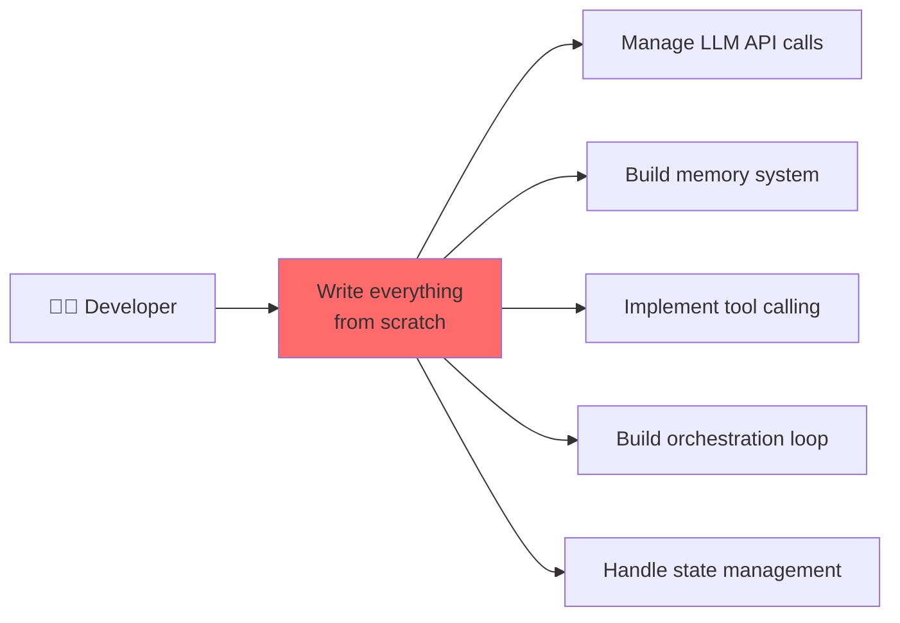

### With a Framework:

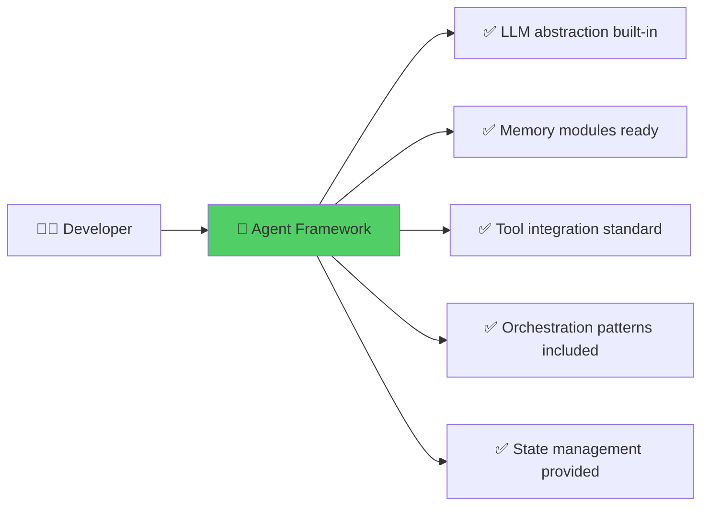

### The Analogy
Think of it like **web development**: you *could* build a website using raw TCP sockets and HTTP parsing. But nobody does. You use **frameworks** like Django, Express, or Spring Boot. Agent frameworks do the same for AI Agents — they provide the building blocks so you focus on **business logic**, not plumbing.

---

## The Landscape

The Agent framework ecosystem is evolving rapidly. Here are the major players as of 2025–2026:

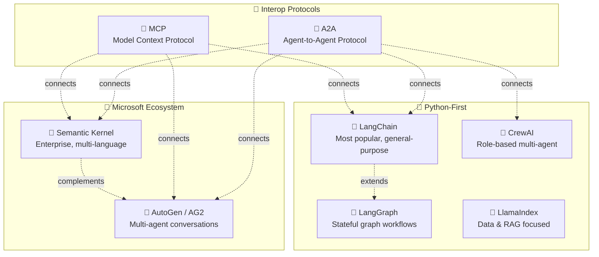

---

## LangChain

### What is LangChain?
**LangChain** is the most widely adopted open-source framework for building LLM-powered applications. Created in late 2022, it provides modular components for chaining LLM calls, tools, memory, and retrieval together.

### Core Components

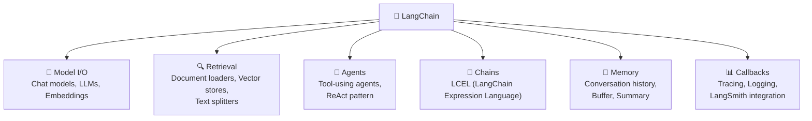

### LangChain Expression Language (LCEL)

LCEL is LangChain's declarative way to compose chains using a pipe (`|`) syntax:

```python
from langchain_openai import ChatOpenAI
from langchain_core.prompts import ChatPromptTemplate
from langchain_core.output_parsers import StrOutputParser

# Compose a chain using pipe syntax
chain = (
    ChatPromptTemplate.from_template("Explain {topic} in simple terms")
    | ChatOpenAI(model="gpt-4o")
    | StrOutputParser()
)

result = chain.invoke({"topic": "quantum computing"})
```

### When to Use LangChain

| ✅ Good For | ❌ Less Suitable For |
|------------|---------------------|
| RAG applications | Complex multi-agent workflows |
| Quick prototyping | Production stateful agents |
| Simple tool-calling agents | Low-level control over execution |
| Wide ecosystem of integrations | Minimal dependency requirements |

### Key Strengths
- **Largest ecosystem**: 700+ integrations (vector stores, LLMs, tools)
- **LangSmith**: Built-in observability and evaluation platform
- **Community**: Most tutorials, examples, and community support
- **LCEL**: Declarative chain composition with streaming support

---

## LangGraph

### What is LangGraph?
**LangGraph** is built on top of LangChain and provides a **graph-based** approach to building stateful, multi-step agent workflows. While LangChain handles simple chains, LangGraph handles **complex flows with cycles, branching, and persistence**.

### The Key Idea: Agents as Graphs

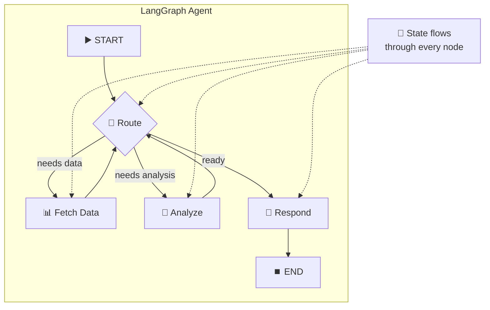

### Core Concepts

| Concept | Explanation | Platform Chapter |
|---------|-------------|------------------|
| **StateGraph** | A graph where nodes share a typed state object | Ch 6 - State Management |
| **Nodes** | Functions that read/write state | Ch 7 - Orchestration |
| **Edges** | Transitions between nodes (conditional or fixed) | Ch 7 - Orchestration |
| **Checkpointing** | Automatic state persistence after each node | Ch 6 - Checkpointing |
| **Human-in-the-Loop** | Pause graph, wait for human input, resume | Ch 6 - HITL |
| **Subgraphs** | Nested graphs for modular agent design | Ch 7 - Sub-agents |

### LangGraph Example: ReAct Agent with Tools

```python
from langgraph.prebuilt import create_react_agent
from langchain_openai import ChatOpenAI
from langchain_community.tools import TavilySearchResults

# Define tools
search_tool = TavilySearchResults(max_results=3)

# Create a ReAct agent with built-in tool loop
agent = create_react_agent(
    model=ChatOpenAI(model="gpt-4o"),
    tools=[search_tool],
    checkpointer="memory",  # Enable state persistence
)

# Run with thread-level persistence
config = {"configurable": {"thread_id": "user-123"}}
result = agent.invoke(
    {"messages": [("user", "What happened in AI news today?")]},
    config=config,
)
```

### LangGraph Architecture

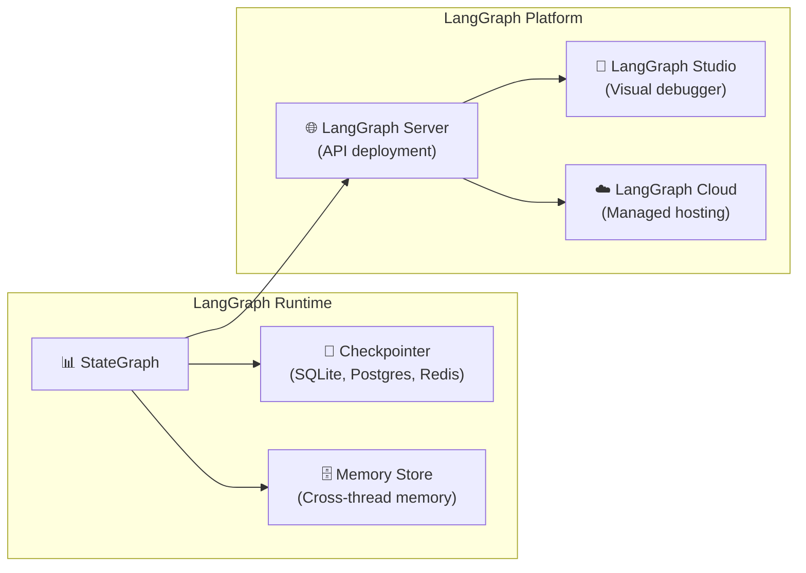

### When to Use LangGraph

| ✅ Good For | ❌ Less Suitable For |
|------------|---------------------|
| Complex multi-step workflows | Simple Q&A chains |
| Agents that need HITL | One-shot LLM calls |
| Stateful, long-running agents | Quick prototyping |
| Cyclic agent loops (ReAct) | Minimal dependency requirements |
| Production agents with persistence | |

---

## Semantic Kernel

### What is Semantic Kernel?
**Semantic Kernel (SK)** is Microsoft's open-source SDK for building AI agents and applications. Unlike Python-only frameworks, SK supports **C#, Python, and Java**, making it the go-to choice for enterprise teams already in the .NET ecosystem.

### Core Architecture

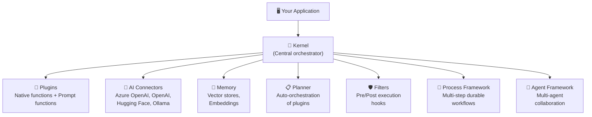

### Key Concepts

| Concept | Explanation | Example |
|---------|-------------|---------|
| **Kernel** | Central object that manages AI services, plugins, and memory | `kernel = Kernel()` |
| **Plugin** | A collection of functions (native code or prompts) the AI can call | `EmailPlugin`, `MathPlugin` |
| **AI Connector** | Adapter to any LLM provider | Azure OpenAI, Ollama |
| **Planner** | Automatically orchestrates plugins to achieve a goal | "Book a trip" → calls Flight + Hotel + Car plugins |
| **Filter** | Middleware that intercepts AI calls for logging, safety, etc. | Content safety filter |
| **Process Framework** | Durable multi-step workflows with state machines | Order processing pipeline |
| **Agent Framework** | Multi-agent collaboration with different strategies | Group chat, handoffs |

### Semantic Kernel Example

```python
import asyncio
from semantic_kernel import Kernel
from semantic_kernel.connectors.ai.open_ai import AzureChatCompletion
from semantic_kernel.functions import kernel_function

# Define a plugin
class WeatherPlugin:
    @kernel_function(description="Get weather for a city")
    def get_weather(self, city: str) -> str:
        return f"Weather in {city}: 22°C, sunny"

# Set up the kernel
kernel = Kernel()
kernel.add_service(AzureChatCompletion(
    deployment_name="gpt-4o",
    endpoint="https://my-ai.openai.azure.com",
))
kernel.add_plugin(WeatherPlugin(), "weather")

# Invoke with auto function calling
result = await kernel.invoke_prompt(
    "What's the weather like in Tel Aviv?",
    settings={"function_choice_behavior": "auto"}
)
```

### When to Use Semantic Kernel

| ✅ Good For | ❌ Less Suitable For |
|------------|---------------------|
| .NET / Java enterprise teams | Python-only teams wanting fast prototyping |
| Azure-first deployments | Teams needing large community/plugin ecosystem |
| Production agents with enterprise controls | Simple RAG-only applications |
| Multi-language projects (C#, Python, Java) | Rapid experimentation |
| Durable workflows (Process Framework) | |

---

## AutoGen / AG2

### What is AutoGen?
**AutoGen** (now evolving as **AG2**) is Microsoft's open-source framework specifically designed for **multi-agent conversations**. Its core idea: multiple AI agents that **talk to each other** to solve complex tasks.

### The Core Idea: Agent Conversations

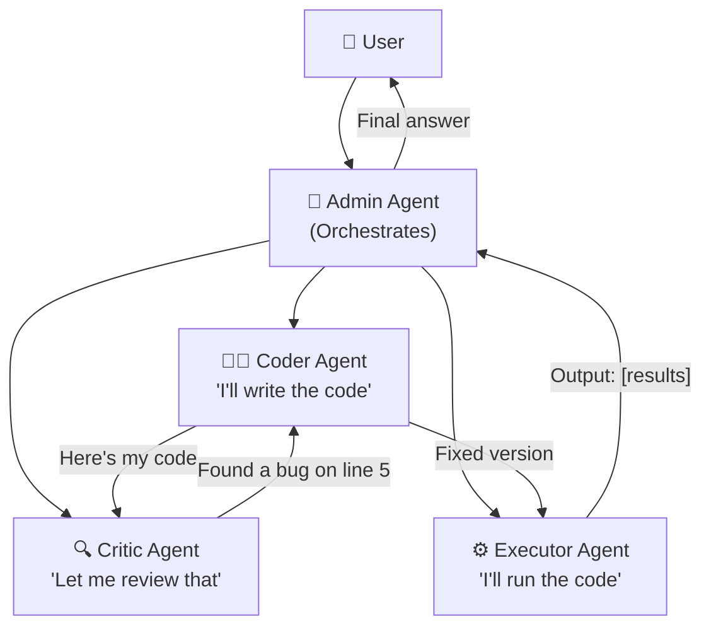

### Key Concepts

| Concept | Explanation |
|---------|-------------|
| **ConversableAgent** | Base agent that can send/receive messages |
| **AssistantAgent** | Agent backed by an LLM |
| **UserProxyAgent** | Agent that represents the user, can execute code |
| **GroupChat** | Multiple agents in a conversation with a manager |
| **GroupChatManager** | Controls turn-taking in multi-agent chats |
| **Nested Chats** | Agents can trigger sub-conversations |
| **Code Execution** | Built-in sandboxed code execution (Docker or local) |

### AutoGen Example: Two-Agent Collaboration

```python
from autogen import AssistantAgent, UserProxyAgent

# Create an LLM-backed assistant
assistant = AssistantAgent(
    name="analyst",
    llm_config={"model": "gpt-4o"},
    system_message="You are a data analyst. Write Python code to analyze data."
)

# Create a user proxy that can execute code
user_proxy = UserProxyAgent(
    name="executor",
    human_input_mode="NEVER",
    code_execution_config={"work_dir": "workspace", "use_docker": True},
)

# Start the conversation
user_proxy.initiate_chat(
    assistant,
    message="Analyze the top 10 programming languages by popularity in 2025."
)
```

### When to Use AutoGen

| ✅ Good For | ❌ Less Suitable For |
|------------|---------------------|
| Multi-agent problem solving | Simple single-agent tasks |
| Code generation + execution workflows | RAG / retrieval focused apps |
| Research and experimentation | Production APIs with strict latency |
| Complex tasks requiring diverse expertise | Teams needing fine-grained state control |

---

## CrewAI

### What is CrewAI?
**CrewAI** is a framework for building **role-based multi-agent teams**. Its analogy: instead of one agent doing everything, you build a **crew** — like a team at work — where each member has a specific **role**, **goal**, and **backstory**.

### The Crew Analogy

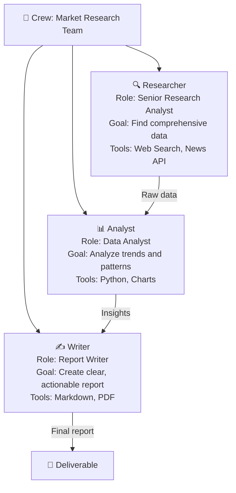

### Key Concepts

| Concept | Explanation | Analogy |
|---------|-------------|---------|
| **Agent** | An autonomous unit with a role, goal, and backstory | A team member |
| **Task** | A specific assignment with expected output | A work item |
| **Crew** | A team of agents working together | A department |
| **Tool** | A capability an agent can use | Software/equipment |
| **Process** | How the crew executes (sequential, hierarchical) | Management style |
| **Flow** | Event-driven workflows connecting multiple crews | Business process |

### CrewAI Example

```python
from crewai import Agent, Task, Crew, Process

# Define agents with roles
researcher = Agent(
    role="Senior Research Analyst",
    goal="Find comprehensive market data about AI trends",
    backstory="You are an experienced researcher with expertise in AI markets",
    tools=[search_tool, news_tool],
    llm="gpt-4o",
)

analyst = Agent(
    role="Data Analyst",
    goal="Analyze data and identify key trends",
    backstory="You excel at finding patterns in complex data",
    llm="gpt-4o",
)

# Define tasks
research_task = Task(
    description="Research the current state of AI agent frameworks in 2025",
    expected_output="A detailed list of frameworks with pros and cons",
    agent=researcher,
)

analysis_task = Task(
    description="Analyze the research and provide recommendations",
    expected_output="A structured analysis with clear recommendations",
    agent=analyst,
)

# Create and run the crew
crew = Crew(
    agents=[researcher, analyst],
    tasks=[research_task, analysis_task],
    process=Process.sequential,
)

result = crew.kickoff()
```

### When to Use CrewAI

| ✅ Good For | ❌ Less Suitable For |
|------------|---------------------|
| Role-based team simulations | Single-agent applications |
| Content generation pipelines | Low-latency requirements |
| Business process automation | Complex stateful graph workflows |
| Non-technical users (intuitive API) | Fine-grained control over agent internals |

---

## LlamaIndex

### What is LlamaIndex?
**LlamaIndex** is a data framework focused on connecting LLMs to your data. While other frameworks focus on orchestration or multi-agent, LlamaIndex excels at **data ingestion, indexing, and retrieval** (RAG).

### Core Focus

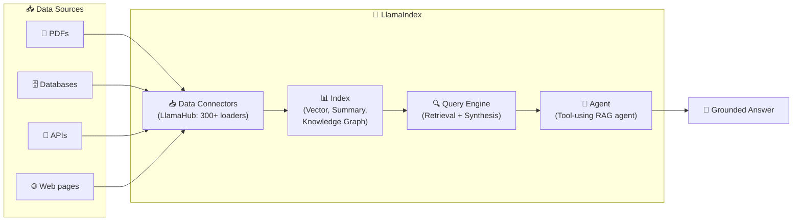

### Key Strengths
- **LlamaHub**: 300+ data connectors (Notion, Slack, Google Drive, databases, etc.)
- **Advanced RAG**: Sub-question, recursive retrieval, re-ranking
- **LlamaParse**: Intelligent document parsing (tables, images, complex layouts)
- **LlamaCloud**: Managed RAG pipeline service

### When to Use LlamaIndex

| ✅ Good For | ❌ Less Suitable For |
|------------|---------------------|
| RAG-heavy applications | Multi-agent orchestration |
| Complex document processing | General-purpose agent building |
| Enterprise data integration | Complex workflow/graph patterns |
| Combining multiple data sources | Role-based agent teams |

---

## Interoperability Protocols: MCP & A2A

As the framework ecosystem grows, two critical protocols have emerged to ensure agents and tools can **work together** regardless of which framework built them.

### Model Context Protocol (MCP)

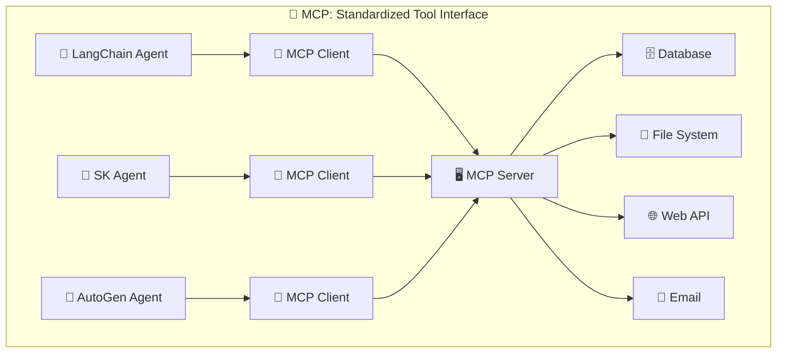

**What is MCP?**
- Created by **Anthropic** (open standard)
- A protocol that lets **any agent** connect to **any tool server**
- Think of it like **USB for AI tools** — one standard plug that works everywhere
- MCP Servers expose tools; MCP Clients (agents) consume them

**Key Benefits:**
- Write a tool server **once**, use it from any framework
- Standardized tool discovery, invocation, and response format
- Growing ecosystem: GitHub, Slack, databases, file systems, etc.

### Agent-to-Agent Protocol (A2A)

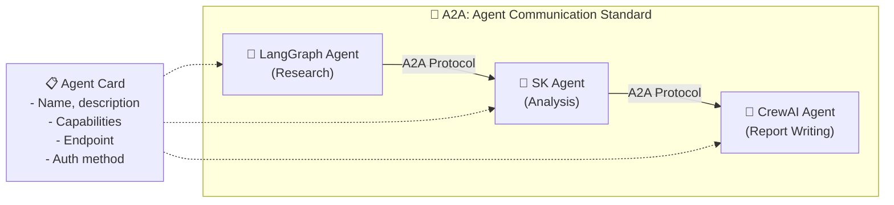

**What is A2A?**
- Created by **Google** (open standard)
- A protocol for agents built with **different frameworks** to communicate
- Each agent publishes an **Agent Card** describing its capabilities
- Agents can discover, negotiate, and delegate tasks to each other

**Key Concepts:**

| Concept | Explanation |
|---------|-------------|
| **Agent Card** | JSON metadata describing an agent's capabilities and endpoint |
| **Task** | A unit of work sent from one agent to another |
| **Message** | Communication between agents (text, files, structured data) |
| **Artifact** | Output produced by an agent (report, file, data) |
| **Push Notifications** | Agent can notify caller when async task completes |

### MCP vs A2A

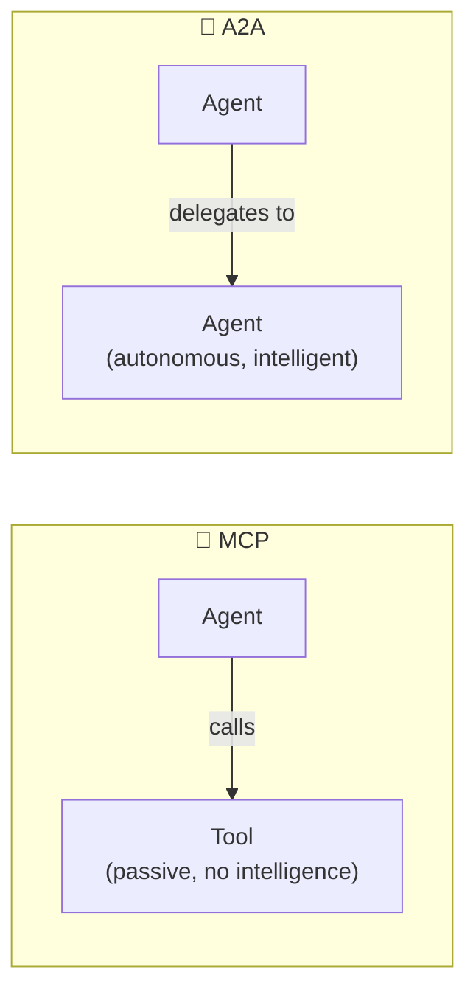

| | MCP | A2A |
|--|-----|-----|
| **Purpose** | Connect agents to **tools** | Connect agents to **agents** |
| **Analogy** | Plugging in a USB device | Calling a colleague |
| **Target** | Dumb tools (DB, API, file system) | Smart agents (with reasoning) |
| **Created by** | Anthropic | Google |
| **Communication** | Request → Response | Request → Negotiate → Stream → Complete |
| **Discovery** | Tool schema | Agent Card |

---

## Comprehensive Comparison

### Feature Matrix

| Feature | LangChain | LangGraph | Semantic Kernel | AutoGen | CrewAI | LlamaIndex |
|---------|-----------|-----------|-----------------|---------|--------|------------|
| **Primary Focus** | Chains & RAG | Stateful graphs | Enterprise SDK | Multi-agent chat | Role-based teams | Data & RAG |
| **Languages** | Python, JS | Python, JS | C#, Python, Java | Python, .NET | Python | Python, TS |
| **LLM Providers** | 50+ | Via LangChain | Azure OpenAI, OpenAI, Ollama, + more | OpenAI, Azure, + more | Via LiteLLM | 20+ |
| **Multi-Agent** | Basic | ✅ Subgraphs | ✅ Agent Framework | ✅ Core strength | ✅ Core strength | Basic |
| **State Management** | Basic | ✅ Built-in + persistence | ✅ Process Framework | Via group chat | Basic | Basic |
| **HITL** | Manual | ✅ Built-in | ✅ via Filters | ✅ via UserProxy | ⚠️ Limited | ⚠️ Limited |
| **RAG** | ✅ Strong | Via LangChain | ✅ via Memory | ⚠️ Basic | ⚠️ Basic | ✅ Best-in-class |
| **Tool Ecosystem** | 700+ integrations | Via LangChain | Via Plugins | Via tools | Via tools | 300+ data connectors |
| **Observability** | LangSmith | LangSmith | Azure Monitor, Aspire | Built-in logging | Built-in logging | LlamaTrace |
| **MCP Support** | ✅ | ✅ | ✅ | ✅ | ✅ | ✅ |
| **Enterprise Ready** | ⚠️ Growing | ✅ LangGraph Platform | ✅ Strong | ⚠️ Growing | ⚠️ Growing | ⚠️ Growing |
| **Learning Curve** | Medium | Medium-High | Medium | Medium | Low | Medium |
| **License** | MIT | MIT | MIT | CC-BY-4.0 (AG2: Apache 2.0) | MIT | MIT |

### Adoption & Community (2025–2026)

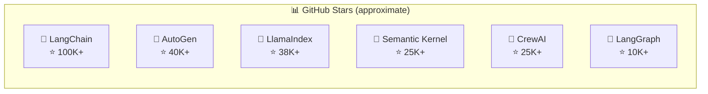

---

## How Frameworks Map to Platform Concepts

This table shows how each framework implements (or doesn't) the platform components we covered in chapters 1–14:

| Platform Concept (Chapter) | LangChain | LangGraph | Semantic Kernel | AutoGen | CrewAI |
|---------------------------|-----------|-----------|-----------------|---------|--------|
| **Model Abstraction (4)** | ✅ ChatModel abstraction | ✅ Via LangChain | ✅ AI Connectors | ✅ LLM config | ✅ Via LiteLLM |
| **Memory & RAG (5)** | ✅ Memory classes + Retrievers | ✅ Store + Checkpointer | ✅ Memory + Plugins | ⚠️ Teachability | ⚠️ Basic memory |
| **Thread & State (6)** | ⚠️ Basic | ✅ StateGraph + Checkpointer | ✅ Process Framework | ✅ Chat history | ⚠️ Task context |
| **Orchestration (7)** | ✅ LCEL chains | ✅ Graph with cycles | ✅ Planner + Process | ✅ Group chat | ✅ Sequential/Hierarchical |
| **Tools (8)** | ✅ @tool decorator | ✅ Via LangChain | ✅ @kernel_function | ✅ Function tools | ✅ @tool decorator |
| **Policy & Guardrails (9)** | ⚠️ Via callbacks | ⚠️ Via node logic | ✅ Filters (pre/post) | ⚠️ Via prompts | ⚠️ Via guardrails |
| **Evaluation (10)** | ✅ LangSmith Evals | ✅ LangSmith | ⚠️ Manual/Azure AI | ⚠️ Manual | ⚠️ Manual |
| **Observability (11)** | ✅ LangSmith | ✅ LangSmith | ✅ Azure Monitor | ⚠️ Basic logging | ⚠️ Basic logging |
| **Security (12)** | ⚠️ Via config | ⚠️ Via config | ✅ Azure Entra, RBAC | ✅ Docker sandbox | ⚠️ Basic |

---

## Decision Guide: Choosing a Framework

### Decision Flowchart

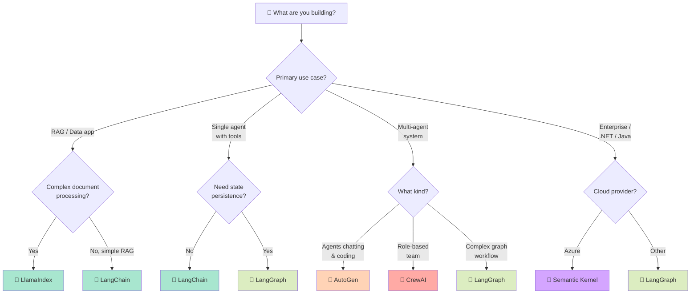

### Quick Decision Matrix

| If you need... | Choose | Why |
|----------------|--------|-----|
| Fast prototyping with many integrations | **LangChain** | Largest ecosystem, most examples |
| Complex stateful agent workflows | **LangGraph** | Graph-based state management with persistence |
| .NET/Java + Azure enterprise | **Semantic Kernel** | Multi-language, Azure-native, enterprise features |
| Agents that collaborate by chatting | **AutoGen** | Purpose-built for multi-agent conversation |
| Role-based team with simple API | **CrewAI** | Most intuitive, role/goal/backstory metaphor |
| Best-in-class RAG pipeline | **LlamaIndex** | 300+ data connectors, advanced retrieval |
| Framework-agnostic tool integration | **MCP** | Universal tool protocol, works with all |
| Cross-framework agent communication | **A2A** | Universal agent communication standard |

### Can You Combine Frameworks?

**Yes!** Frameworks are not mutually exclusive. Common combinations:

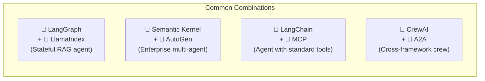

---

## Summary

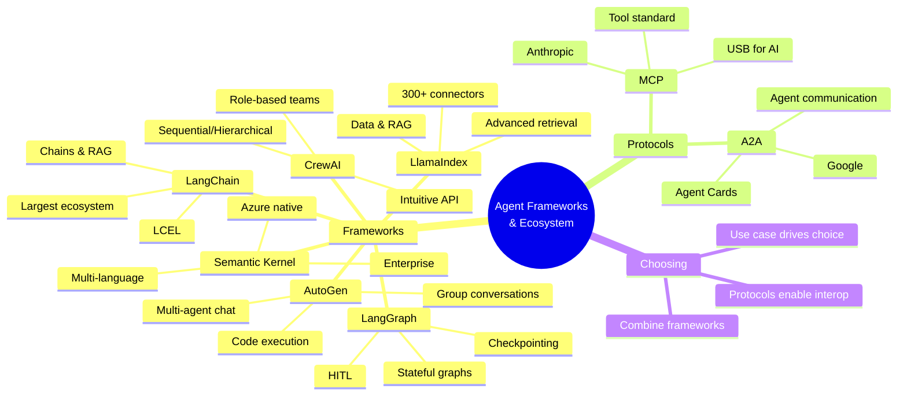

| What We Learned | Key Point |
|-----------------|-----------|
| **Agent Framework** | A library that provides building blocks (memory, tools, orchestration) so developers focus on business logic |
| **LangChain** | Most popular, general-purpose framework with the largest ecosystem |
| **LangGraph** | Graph-based stateful workflows built on LangChain — best for complex agents |
| **Semantic Kernel** | Microsoft's multi-language SDK — best for .NET/Java enterprise teams |
| **AutoGen** | Multi-agent conversation framework — best when agents need to collaborate |
| **CrewAI** | Role-based team framework — most intuitive API for multi-agent |
| **LlamaIndex** | Data-first framework — best for RAG and complex document processing |
| **MCP** | Standard protocol for connecting agents to tools (by Anthropic) |
| **A2A** | Standard protocol for agent-to-agent communication (by Google) |

---

## ❓ Self-Check Questions

1. What is the purpose of an Agent Development Framework and why use one instead of writing everything from scratch?
2. What is the difference between LangChain and LangGraph? When would you choose one over the other?
3. What are the key components of Semantic Kernel (name at least 4)?
4. How does AutoGen's approach to multi-agent differ from CrewAI's?
5. What is MCP and what problem does it solve?
6. What is A2A and how is it different from MCP?
7. How do frameworks map to the platform concepts from chapters 1–14? Give 3 examples.
8. You need to build a RAG-heavy application with complex document processing — which framework(s) would you choose and why?

---

### 📝 Answers

<details>
<summary>1. What is the purpose of an Agent Development Framework and why use one instead of writing everything from scratch?</summary>

An **Agent Development Framework** provides pre-built building blocks for common agent needs: LLM abstraction, memory management, tool integration, orchestration patterns, and state management. Using one instead of writing from scratch saves significant development time, provides tested and community-validated patterns, offers built-in observability and debugging tools, and lets developers focus on business logic rather than infrastructure plumbing.
</details>

<details>
<summary>2. What is the difference between LangChain and LangGraph? When would you choose one over the other?</summary>

**LangChain** is a general-purpose framework for building LLM chains and simple agents. It excels at RAG, chaining LLM calls, and integrating with 700+ tools. **LangGraph** is built on top of LangChain and adds graph-based stateful workflows with built-in checkpointing, HITL, and cyclic execution. Choose **LangChain** for simple chains, RAG apps, and quick prototyping. Choose **LangGraph** when you need complex multi-step workflows, state persistence, human-in-the-loop, or production agents that need to survive crashes.
</details>

<details>
<summary>3. What are the key components of Semantic Kernel (name at least 4)?</summary>

1. **Kernel** — the central orchestrator that manages AI services and plugins.
2. **Plugins** — collections of native functions and prompt functions the AI can call.
3. **AI Connectors** — adapters for LLM providers (Azure OpenAI, OpenAI, Ollama, etc.).
4. **Planner** — automatically orchestrates multiple plugins to achieve a complex goal.
5. **Filters** — middleware for pre/post-execution hooks (logging, content safety, etc.).
6. **Process Framework** — durable multi-step workflows with state machines.
7. **Agent Framework** — multi-agent collaboration with group chat and handoff strategies.
</details>

<details>
<summary>4. How does AutoGen's approach to multi-agent differ from CrewAI's?</summary>

**AutoGen** uses a **conversation-based** approach: agents are conversable entities that send messages to each other, like a group chat. The focus is on natural language conversation between agents, with built-in code execution support. **CrewAI** uses a **role-based** approach: agents have explicit roles, goals, and backstories, and work on structured tasks in a team (crew). CrewAI is more structured and intuitive (like a project team), while AutoGen is more flexible and open-ended (like a group discussion).
</details>

<details>
<summary>5. What is MCP and what problem does it solve?</summary>

**MCP (Model Context Protocol)** is an open standard created by Anthropic that provides a universal way for AI agents to connect to tools. It solves the **N×M integration problem**: without MCP, every framework needs custom integrations for every tool. With MCP, tool providers implement one MCP server, and any MCP-compatible agent can use it. Think of it as **USB for AI tools** — one standard connector that works everywhere.
</details>

<details>
<summary>6. What is A2A and how is it different from MCP?</summary>

**A2A (Agent-to-Agent Protocol)** is an open standard created by Google for agent-to-agent communication. While **MCP** connects agents to **passive tools** (databases, APIs, file systems), **A2A** connects agents to **other intelligent agents**. A2A agents publish Agent Cards describing their capabilities, can negotiate task delegation, support streaming responses, and handle long-running asynchronous tasks with push notifications.
</details>

<details>
<summary>7. How do frameworks map to the platform concepts from chapters 1–14? Give 3 examples.</summary>

1. **Memory & RAG (Chapter 5)** → LangChain provides memory classes and retrievers, LlamaIndex provides advanced document indexing, Semantic Kernel has memory plugins with vector store support.
2. **Thread & State (Chapter 6)** → LangGraph provides StateGraph with checkpointing and HITL, Semantic Kernel offers Process Framework for durable state machines, AutoGen maintains state through chat history.
3. **Orchestration (Chapter 7)** → LangChain uses LCEL chains (sequential), LangGraph uses graph-based orchestration with cycles, CrewAI provides sequential and hierarchical processes, AutoGen uses group chat patterns.
</details>

<details>
<summary>8. You need to build a RAG-heavy application with complex document processing — which framework(s) would you choose and why?</summary>

For a RAG-heavy application with complex document processing, the best choice is **LlamaIndex** as the primary data/RAG framework, potentially combined with **LangGraph** for the agent orchestration layer. **LlamaIndex** offers: 300+ data connectors (LlamaHub), advanced RAG patterns (sub-question, recursive retrieval, re-ranking), LlamaParse for complex document parsing (tables, images), and production-ready indexing pipelines. If you also need stateful agent workflows on top of the RAG, pairing it with **LangGraph** gives you graph-based orchestration with checkpointing and HITL.
</details>

---

**[⬅️ Back to Chapter 15: Microsoft Stack Mapping](15-microsoft-stack.md)** | **[🏠 Back to README](README.md)**
