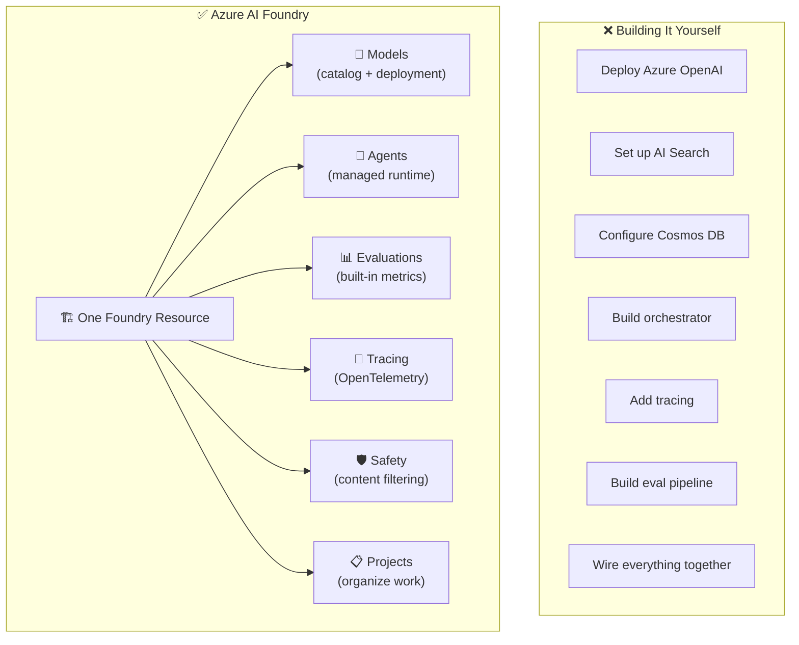
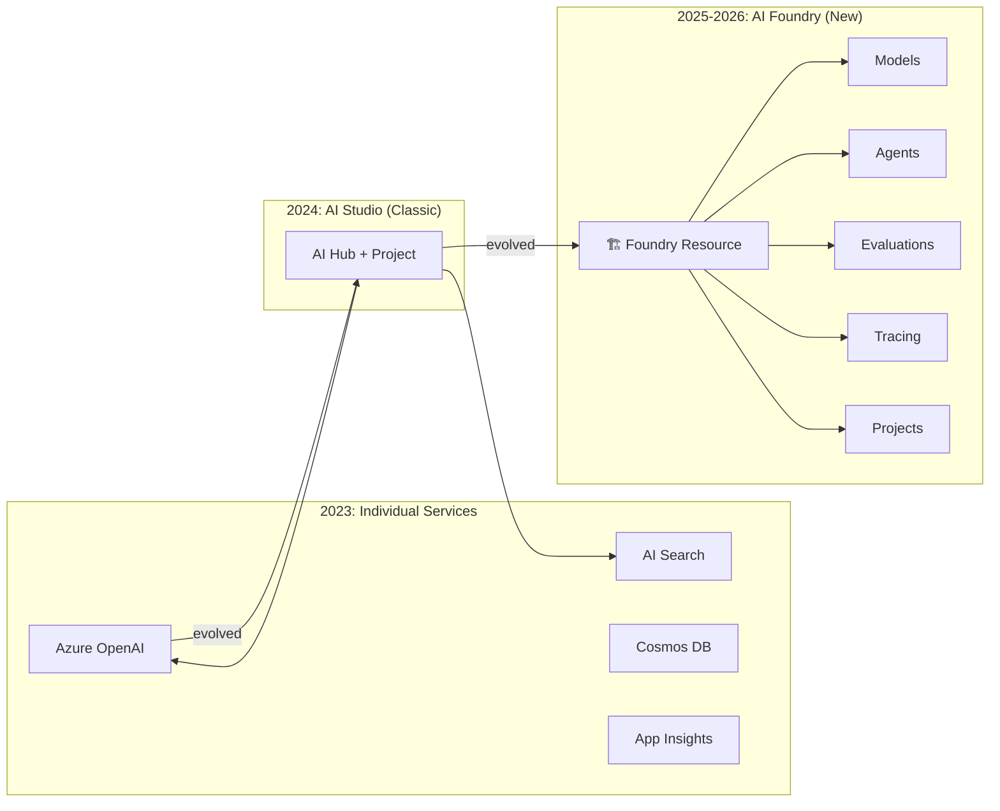
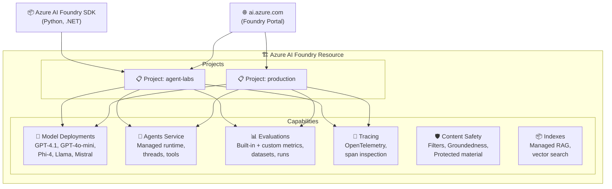
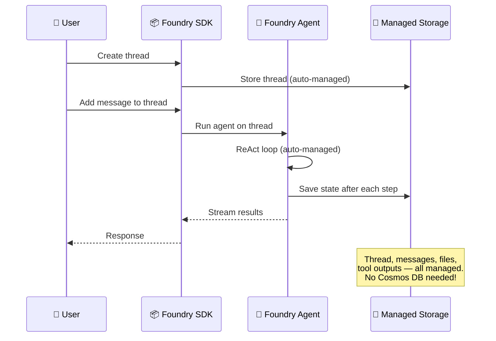
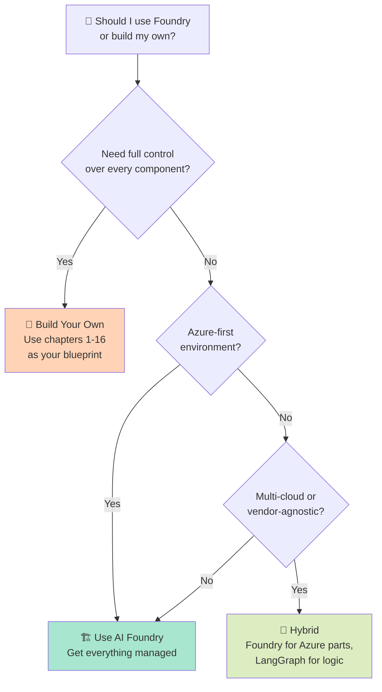

# 🏗️ Chapter 17: Azure AI Foundry — The Managed Agent Platform

## Table of Contents
- [What is Azure AI Foundry?](#what-is-azure-ai-foundry)
- [From Components to Platform](#from-components-to-platform)
- [Foundry Architecture](#foundry-architecture)
- [Model Catalog & Deployment](#model-catalog--deployment)
- [Agents Service](#agents-service)
- [Evaluations](#evaluations)
- [Tracing & Observability](#tracing--observability)
- [Content Safety & Guardrails](#content-safety--guardrails)
- [Foundry SDK](#foundry-sdk)
- [When to Build vs When to Use Foundry](#when-to-build-vs-when-to-use-foundry)
- [Summary and Questions](#summary-and-questions)

---

## What is Azure AI Foundry?

In chapters 1–14, we learned how to **design** every component of an AI Agent Platform from scratch. In chapter 15, we mapped those components to individual Azure services. But what if you could get **all of those components out of the box** — pre-integrated, managed, and production-ready?

That's exactly what **Azure AI Foundry** is.



### The Key Insight

> **Azure AI Foundry is NOT a new product. It's the unification of Azure AI services under one roof — with a portal, SDK, and managed runtime that handle what you'd otherwise build yourself.**

Every chapter we studied maps to a Foundry capability:

| Platform Chapter | What We Built | Foundry Equivalent |
|-----------------|---------------|-------------------|
| Ch 4 - Model Abstraction | Model router, fallback, caching | **Model Catalog** — deploy any model, unified API |
| Ch 5 - Memory & RAG | Vector DB, embeddings, retrieval | **Indexes** — managed RAG pipeline |
| Ch 6 - Thread & State | Thread manager, checkpointing | **Agents Service** — built-in thread/state |
| Ch 7 - Orchestration | ReAct loop, multi-agent | **Agents Service** — managed orchestration |
| Ch 8 - Tools | Tool registry, function calling | **Agents Service** — built-in tools (Code Interpreter, File Search) |
| Ch 9 - Policy & Guardrails | Content safety, DLP | **Content Safety** — integrated filtering |
| Ch 10 - Evaluation | Groundedness, relevance, toxicity | **Evaluations** — built-in metrics + custom |
| Ch 11 - Observability | Tracing, metrics, logging | **Tracing** — OpenTelemetry integration |

---

## From Components to Platform

### The Evolution



### New Foundry vs Classic (Hub)

| | Classic (Hub + Project) | New Foundry |
|--|------------------------|-------------|
| **Resource type** | `Microsoft.MachineLearningServices/workspaces` | `Microsoft.CognitiveServices/accounts` (kind: AIServices) |
| **Requires** | Hub + Project + Storage + Key Vault + ACR | Just the Foundry resource |
| **Portal** | ai.azure.com (old UI) | ai.azure.com (New Foundry toggle ON) |
| **Complexity** | Many dependent resources | Single resource with projects |
| **Child projects** | Workspace children of Hub | Lightweight project children |
| **Recommended for** | Legacy workloads | All new projects |

---

## Foundry Architecture



---

## Model Catalog & Deployment

The Foundry Model Catalog provides access to **hundreds of models** from multiple providers, deployable with a single API call:

| Provider | Models | Deployment Type |
|----------|--------|----------------|
| **OpenAI** | GPT-4.1, GPT-4o, o3, o4-mini | Standard, Global Standard |
| **Microsoft** | Phi-4, Phi-4-mini | Standard, Global Standard |
| **Meta** | Llama 3.3, Llama 4 | Serverless (MaaS) |
| **Mistral** | Mistral Large, Mistral Small | Serverless (MaaS) |
| **DeepSeek** | DeepSeek-R1 | Serverless (MaaS) |
| **Cohere** | Command R+, Embed | Serverless (MaaS) |

All models are accessible through a **unified inference API** — same endpoint, same SDK, just change the deployment name.

---

## Agents Service

The Foundry Agents Service provides a **managed agent runtime** that handles everything from Chapter 3 (Runtime), Chapter 6 (Thread/State), Chapter 7 (Orchestration), and Chapter 8 (Tools):

### Built-in Tools

| Tool | What It Does | Chapter |
|------|-------------|---------|
| **Code Interpreter** | Execute Python code in a sandbox | Ch 3, Ch 8 |
| **File Search** | RAG over uploaded documents | Ch 5, Ch 8 |
| **Function Calling** | Call your custom functions | Ch 8 |
| **Bing Grounding** | Search the web for current info | Ch 5 |
| **Azure AI Search** | Search your enterprise data | Ch 5 |

### Thread Management (Built-in)



---

## Evaluations

Foundry provides **built-in evaluation metrics** that cover everything from Chapter 10:

| Metric | What It Measures | Type |
|--------|-----------------|------|
| **Groundedness** | Is the answer based on provided context? | AI-assisted |
| **Relevance** | Does the answer address the question? | AI-assisted |
| **Coherence** | Is the answer well-structured? | AI-assisted |
| **Fluency** | Is the language natural? | AI-assisted |
| **Similarity** | How close to the expected answer? | AI-assisted |
| **F1 Score** | Token overlap with ground truth | Algorithmic |
| **Violence** | Does the output contain violence? | Safety |
| **Self-harm** | Does the output contain self-harm content? | Safety |

---

## Tracing & Observability

Foundry integrates **OpenTelemetry-based tracing** for full observability (Chapter 11):

- Every LLM call, tool execution, and agent step is traced
- Spans include token counts, latency, model used
- View traces in the Foundry portal or export to Application Insights
- Compatible with the Azure AI Foundry SDK's built-in instrumentation

---

## Content Safety & Guardrails

Built-in content safety (Chapter 9, Chapter 12):

- **Input filters** — block harmful prompts before they reach the model
- **Output filters** — block harmful responses before they reach the user
- **Groundedness detection** — flag when the model makes up information
- **Protected material detection** — detect copyrighted content
- **Custom categories** — define your own safety categories

---

## Foundry SDK

```python
from azure.ai.projects import AIProjectClient
from azure.identity import DefaultAzureCredential

# Connect to your Foundry project
client = AIProjectClient(
    credential=DefaultAzureCredential(),
    endpoint="https://your-foundry.services.ai.azure.com",
    project_name="agent-labs"
)

# Create an agent with tools
agent = client.agents.create_agent(
    model="gpt-41",
    name="data-analyst",
    instructions="You are a data analyst. Use code interpreter for calculations.",
    tools=[{"type": "code_interpreter"}]
)

# Create a thread and run
thread = client.agents.threads.create()
client.agents.threads.messages.create(
    thread_id=thread.id,
    role="user",
    content="Calculate the first 20 Fibonacci numbers and plot them"
)

run = client.agents.threads.runs.create(
    thread_id=thread.id,
    agent_id=agent.id
)

# The agent handles: ReAct loop, code execution, state management — all managed!
```

---

## When to Build vs When to Use Foundry



| Factor | Build Your Own | Use Foundry |
|--------|---------------|-------------|
| **Time to production** | Weeks-months | Hours-days |
| **Customization** | Complete control | Within Foundry's capabilities |
| **Cost** | More dev effort, less Azure cost | Less dev effort, Azure managed cost |
| **Observability** | You build it | Built-in tracing |
| **Evaluation** | You build it | Built-in metrics |
| **Multi-model** | You wire it | Model catalog built-in |
| **Vendor lock-in** | None | Azure |

---

## Summary

```mermaid
graph TD
    Root["Azure AI Foundry"]
    Root --> WhatItIs["What It Is"]
    WhatItIs --> W1["Managed Agent Platform"]
    WhatItIs --> W2["Unifies Azure AI services"]
    WhatItIs --> W3["Portal + SDK + Runtime"]
    Root --> KeyCap["Key Capabilities"]
    KeyCap --> MC["Model Catalog"]
    MC --> MC1["OpenAI, Meta, Mistral, Microsoft"]
    MC --> MC2["Unified inference API"]
    KeyCap --> AS["Agents Service"]
    AS --> AS1["Managed runtime"]
    AS --> AS2["Built-in tools"]
    AS --> AS3["Thread/state management"]
    KeyCap --> Ev["Evaluations"]
    Ev --> Ev1["Groundedness, Relevance"]
    Ev --> Ev2["Safety metrics"]
    Ev --> Ev3["Custom evaluators"]
    KeyCap --> Tr["Tracing"]
    Tr --> Tr1["OpenTelemetry"]
    Tr --> Tr2["Every step traced"]
    KeyCap --> CS["Content Safety"]
    CS --> CS1["Input/output filters"]
    CS --> CS2["Groundedness detection"]
    Root --> WhenToUse["When To Use"]
    WhenToUse --> U1["Azure-first teams"]
    WhenToUse --> U2["Fast time to production"]
    WhenToUse --> U3["Managed operations"]
```



| What We Learned | Key Point |
|----------------|-----------|
| **Foundry Resource** | A single Azure resource that provides Models, Agents, Evaluations, Tracing, and Safety |
| **New vs Classic** | New Foundry uses AIServices kind, not Hub/Workspace — much simpler |
| **Projects** | Organize work within a Foundry resource, with shared deployments |
| **Agents Service** | Managed agent runtime with built-in tools, threads, and state |
| **Evaluations** | Built-in quality and safety metrics, no custom pipeline needed |
| **Tracing** | OpenTelemetry-based, every LLM call and tool execution traced |
| **Model Catalog** | Hundreds of models from multiple providers, unified API |

---

## ❓ Self-Check Questions

1. What is Azure AI Foundry and how does it relate to the platform components from chapters 1-14?
2. What is the difference between New Foundry and Classic (Hub)?
3. What built-in tools does the Agents Service provide?
4. How does Foundry handle thread and state management?
5. What evaluation metrics are built into Foundry?
6. When should you build your own platform vs use Foundry?

---

### 📝 Answers

<details>
<summary>1. What is Azure AI Foundry and how does it relate to the platform components from chapters 1-14?</summary>

Azure AI Foundry is a managed platform that provides most of the components we designed in chapters 1-14 **out of the box**: model routing (Ch4), memory/RAG (Ch5), thread/state management (Ch6), orchestration (Ch7), tools (Ch8), guardrails (Ch9), evaluation (Ch10), and observability (Ch11). Instead of building each component yourself, Foundry provides them as integrated, managed services under a single resource.
</details>

<details>
<summary>2. What is the difference between New Foundry and Classic (Hub)?</summary>

**Classic** used a Hub + Project architecture based on `Microsoft.MachineLearningServices/workspaces`, requiring many dependent resources (Storage, Key Vault, ACR). **New Foundry** uses a simpler `Microsoft.CognitiveServices/accounts` (kind: AIServices) resource with lightweight project children — much less complexity, fewer resources to manage, same capabilities.
</details>

<details>
<summary>3. What built-in tools does the Agents Service provide?</summary>

Code Interpreter (Python sandbox), File Search (RAG over uploaded docs), Function Calling (custom functions), Bing Grounding (web search), and Azure AI Search (enterprise data search).
</details>

<details>
<summary>4. How does Foundry handle thread and state management?</summary>

The Agents Service manages threads automatically — you create a thread, add messages, and run the agent. The service handles the ReAct loop, saves state after each step, and persists threads in managed storage. No need to set up Cosmos DB or implement checkpointing yourself.
</details>

<details>
<summary>5. What evaluation metrics are built into Foundry?</summary>

Quality metrics: Groundedness, Relevance, Coherence, Fluency, Similarity, F1 Score. Safety metrics: Violence, Self-harm, Sexual content, Hate/unfairness. You can also create custom evaluators.
</details>

<details>
<summary>6. When should you build your own platform vs use Foundry?</summary>

Use Foundry when you're Azure-first, need fast time to production, and want managed operations. Build your own when you need full control over every component, are multi-cloud, or have specific customization needs that Foundry doesn't support. A hybrid approach (Foundry for Azure parts, LangGraph for custom logic) is also common.
</details>

---

> 🔗 **See it in production:** [Full AI Platform System (AI-Platform-System)](https://github.com/roie9876/AI-Platform-System)

**[⬅️ Back to Chapter 16: Agent Frameworks](16-agent-frameworks.md)** | **[🏠 Back to README](README.md)**
