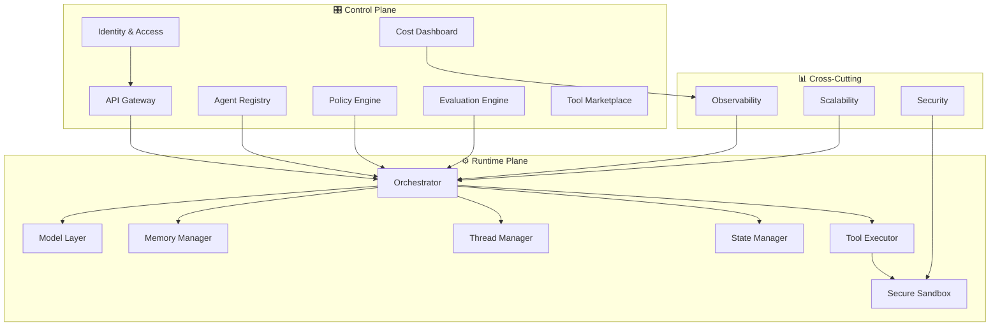

# 📚 AI Agent Platform - Education Hub

## Purpose
This document is a comprehensive educational resource designed to teach all the concepts, technologies, and architectures required to design and build an **AI Agent Platform as a Service (PaaS)**.

Each chapter is self-contained, but together they form a complete picture of a Production-grade system.

---

## 🗂️ Recommended Learning Path

| # | Topic | File |
|---|-------|------|
| 1 | **Fundamentals — What is an AI Agent?** | [01-fundamentals.md](01-fundamentals.md) |
| 2 | **Model Abstraction & Routing** | [02-model-abstraction-routing.md](02-model-abstraction-routing.md) |
| 3 | **Memory Management & RAG** | [03-memory-management.md](03-memory-management.md) |
| 4 | **Thread & State Management** | [04-thread-state-management.md](04-thread-state-management.md) |
| 5 | **Orchestration Patterns** | [05-orchestration.md](05-orchestration.md) |
| 6 | **Tools & Marketplace** | [06-tools-marketplace.md](06-tools-marketplace.md) |
| 7 | **Policy & Governance** | [07-policy-governance.md](07-policy-governance.md) |
| 8 | **Control Plane** | [08-control-plane.md](08-control-plane.md) |
| 9 | **Runtime Plane** | [09-runtime-plane.md](09-runtime-plane.md) |
| 10 | **Evaluation Engine** | [10-evaluation-engine.md](10-evaluation-engine.md) |
| 11 | **Observability & Cost** | [11-observability-cost.md](11-observability-cost.md) |
| 12 | **Security & Isolation** | [12-security-isolation.md](12-security-isolation.md) |
| 13 | **Scalability Patterns** | [13-scalability.md](13-scalability.md) |
| 14 | **HLD — Full Architecture** | [14-hld-architecture.md](14-hld-architecture.md) |
| 15 | **Microsoft Stack Mapping** | [15-microsoft-stack.md](15-microsoft-stack.md) |
| 16 | **Agent Frameworks & Ecosystem** | [16-agent-frameworks.md](16-agent-frameworks.md) |
| 17 | **Azure AI Foundry** | [17-azure-ai-foundry.md](17-azure-ai-foundry.md) |

---

## 🎯 How to Use This Material

1. **Read in order** - chapters are structured from basics to advanced
2. **Study each diagram** - the Mermaid diagrams illustrate the flows and relationships between components
3. **Pay attention to pros/cons tables** - they will help you understand when each technology is appropriate
4. **At the end of each chapter** there is a summary and self-check questions

---

## 🧭 Topic Map - Bird's Eye View

---

> **Note:** All Mermaid diagrams in these documents can be viewed directly in VS Code with the Mermaid extension, or on sites like [mermaid.live](https://mermaid.live).
