# 🎛️ פרק 2: Control Plane

## תוכן עניינים
- [מהו Control Plane?](#מהו-control-plane)
- [למה להפריד Control מ-Runtime?](#למה-להפריד-control-מ-runtime)
- [רכיבי ה-Control Plane](#רכיבי-ה-control-plane)
- [API Gateway](#api-gateway)
- [Identity & Access Management](#identity--access-management)
- [Agent Registry](#agent-registry)
- [Configuration Management](#configuration-management)
- [יתרונות וחסרונות](#יתרונות-וחסרונות)
- [סיכום ושאלות](#סיכום-ושאלות)

---

## מהו Control Plane?

**Control Plane** הוא ה"מוח הניהולי" של הפלטפורמה. הוא **לא** מריץ Agents - הוא **מנהל** אותם.

תחשוב על זה כמו תחנת פיקוד:

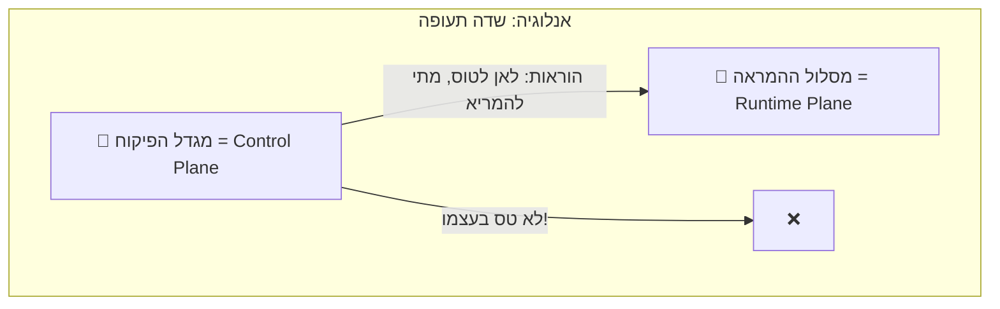

### מה ה-Control Plane עושה:
- ✅ מגדיר **אילו Agents** קיימים
- ✅ קובע **מי מורשה** לעשות מה
- ✅ מגדיר **Policies** (כללים)
- ✅ מנהל את ה-**Marketplace** של כלים
- ✅ אוסף **מטריקות** ומציג דשבורדים
- ✅ מריץ **הערכות** (Evaluations) על Agents

### מה ה-Control Plane **לא** עושה:
- ❌ לא שולח בקשות ל-LLM
- ❌ לא מריץ כלים
- ❌ לא מנהל זיכרון שיחה בזמן אמת
- ❌ לא מטפל בקריאות Function Calling

---

## למה להפריד Control מ-Runtime?

זהו עיקרון אדריכלי יסודי. המוטיבציה:

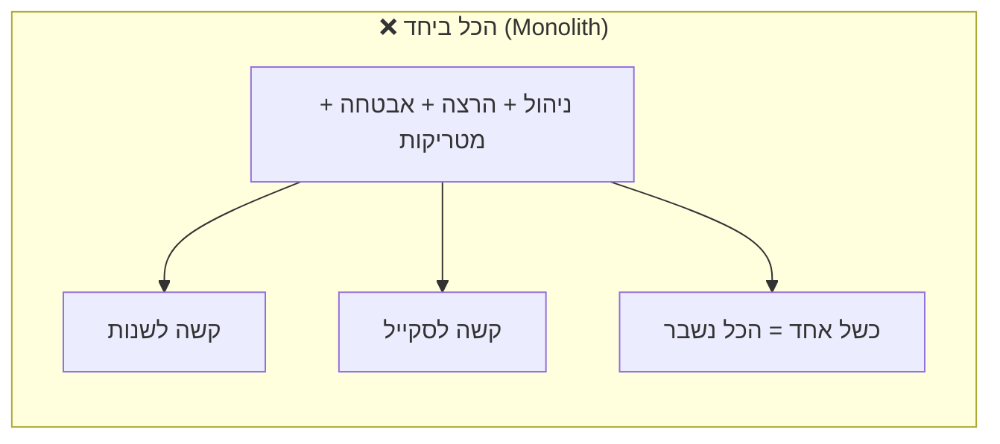

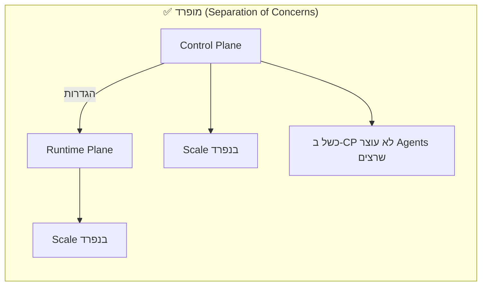

### היתרונות של ההפרדה:

| יתרון | הסבר |
|-------|-------|
| **Scaling עצמאי** | ה-Runtime צריך הרבה משאבים? תגדיל רק אותו |
| **Fault Isolation** | אם הדשבורד נופל, ה-Agents ממשיכים לעבוד |
| **Security Boundary** | ה-Control Plane לא חשוף לקוד שה-Agent מריץ |
| **Development Velocity** | צוותים שונים יכולים לעבוד על כל Plane בנפרד |
| **Compliance** | קל יותר להראות ש"הניהול" מופרד מ"ההרצה" |

### דוגמאות מעולם התוכנה:

| מערכת | Control Plane | Data/Runtime Plane |
|--------|--------------|-------------------|
| **Kubernetes** | API Server, Scheduler, Controller Manager | Kubelets, Pods, Containers |
| **תקשורת (SDN)** | SDN Controller | Switches, Routers |
| **Database** | Schema management, User permissions | Query execution, Data storage |

---

## רכיבי ה-Control Plane

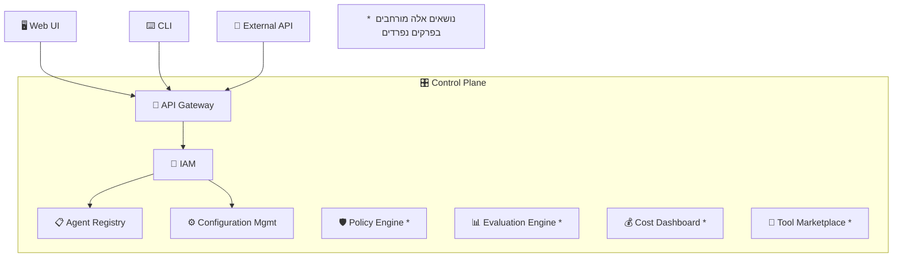

---

## API Gateway

### מה זה?
API Gateway הוא **נקודת הכניסה היחידה** לפלטפורמה. כל בקשה - מה-UI, ה-CLI, או API חיצוני - עוברת דרכו.

### למה צריך Gateway ולא פשוט לגשת ישירות לשירותים?

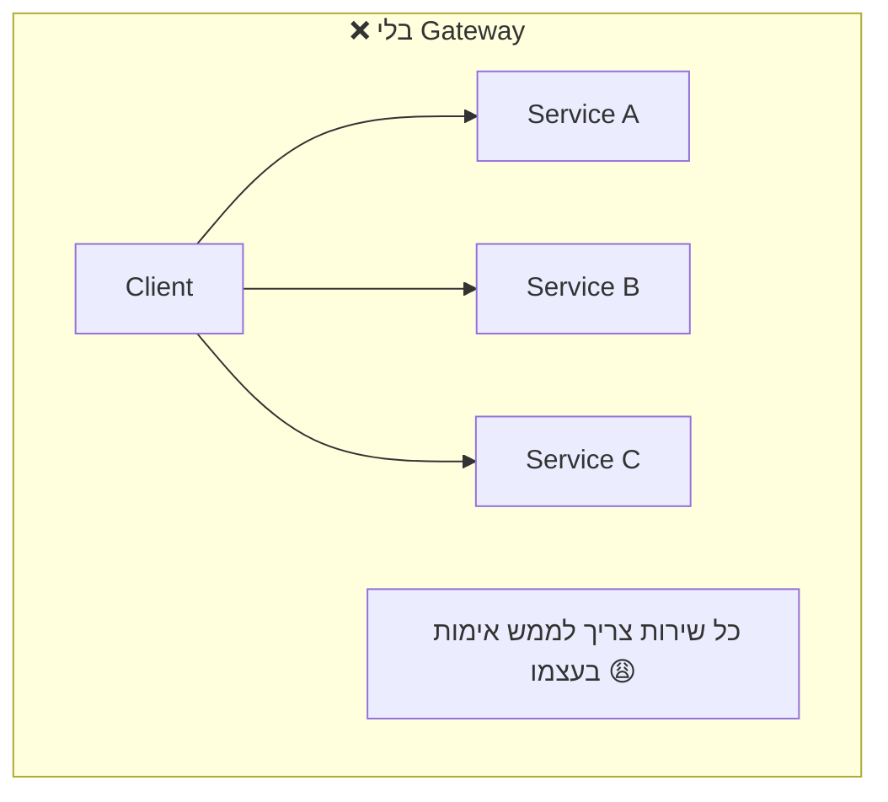

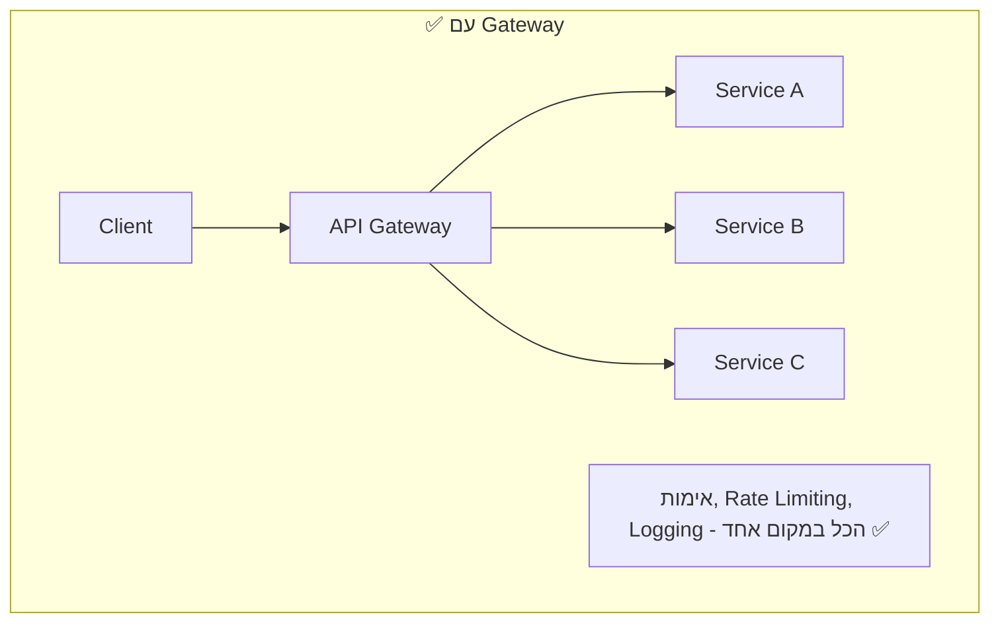

### תפקידי ה-API Gateway:

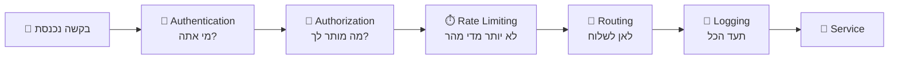

| תפקיד | הסבר | דוגמה |
|--------|-------|-------|
| **Authentication** | מזהה מי שולח את הבקשה | JWT Token, API Key |
| **Authorization** | בודק אם למשתמש יש הרשאה | RBAC - "אתה Admin? מותר לך" |
| **Rate Limiting** | מגביל כמות בקשות | מקסימום 100 בקשות בדקה |
| **Request Routing** | מפנה את הבקשה לשירות הנכון | POST /agents → Agent Service |
| **Load Balancing** | מפזר עומס בין instances | Round-robin, Least connections |
| **Request/Response Transform** | משנה פורמט של בקשות/תשובות | Convert XML → JSON |
| **Caching** | שומר תשובות תכופות | GET /agents (cache 60 sec) |
| **Logging & Telemetry** | מתעד כל בקשה | Timestamp, Duration, Status |

### יתרונות וחסרונות של API Gateway

| ✅ יתרון | ❌ חיסרון |
|----------|----------|
| נקודת כניסה אחת - פשטות | נקודת כשל אחת (SPOF) |
| אימות מרכזי | Latency נוסף (hop נוסף) |
| Rate Limiting מובנה | מורכבות בניהול ותחזוקה |
| Observability מרוכז | יכול להיות Bottleneck |

### איך מתמודדים עם החסרונות?
- **SPOF**: deploying multiple instances with load balancer
- **Latency**: lightweight gateway, proximity to services
- **Bottleneck**: horizontal scaling, caching

---

## Identity & Access Management (IAM)

### מה זה?
IAM = **מי אתה** (Authentication) + **מה מותר לך** (Authorization)

### Authentication vs Authorization

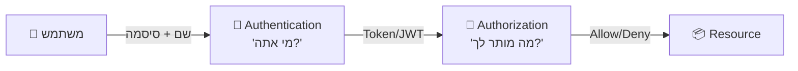

| מושג | שאלה | דוגמה |
|------|-------|-------|
| **Authentication (AuthN)** | מי אתה? | Login עם username/password → מקבל Token |
| **Authorization (AuthZ)** | מה מותר לך? | Admin יכול למחוק Agent, User רגיל רק לראות |

### RBAC - Role Based Access Control

ב-RBAC, אתה לא נותן הרשאות ישירות למשתמש. אתה נותן **תפקיד** (Role) ולתפקיד יש **הרשאות** (Permissions).

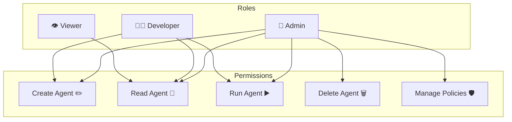

### Multi-Tenancy ב-IAM

כשמספר צוותים/ארגונים משתמשים באותה פלטפורמה, צריך **הפרדה** (Isolation):

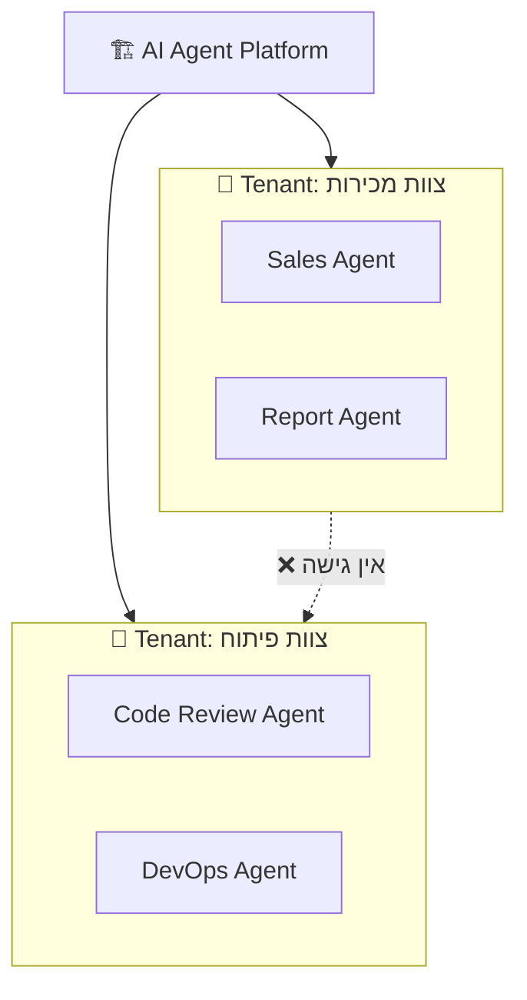

| מודל Multi-Tenancy | הסבר | בעד | נגד |
|---------------------|-------|-----|-----|
| **Shared DB, Shared Schema** | כולם באותו DB, עמודת tenant_id | זול, פשוט | סיכון לדליפה, Noisy Neighbor |
| **Shared DB, Separate Schema** | כל tenant schema משלו | הפרדה טובה יותר | ניהול schemas מורכב |
| **Separate DB** | DB נפרד לכל tenant | הפרדה מלאה | יקר, קשה לנהל |

---

## Agent Registry

### מה זה?
ה-Agent Registry הוא ה**מאגר המרכזי** שבו שמורים כל ההגדרות של ה-Agents. חשוב על זה כמו "תעודת זהות" של כל Agent.

### מה שמור ב-Registry?

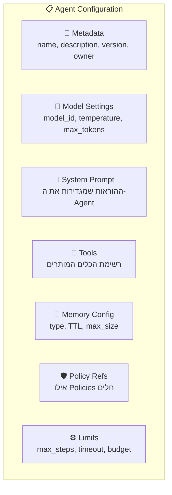

### דוגמה למבנה של Agent Definition:

```
Agent: "Data Analyst"
├── id: agent-001
├── version: 2.1
├── owner: team-analytics
├── model:
│   ├── primary: gpt-4o
│   ├── fallback: gpt-3.5-turbo
│   └── temperature: 0.2
├── system_prompt: "You are a data analyst..."
├── tools:
│   ├── sql_query (read-only)
│   ├── python_executor
│   └── chart_generator
├── memory:
│   ├── short_term: last 20 messages
│   └── long_term: vector search on company docs
├── policies:
│   ├── no_pii_in_output
│   └── max_cost_per_run: $0.50
└── limits:
    ├── max_steps: 10
    ├── timeout: 120s
    └── max_tokens_per_run: 50000
```

### Versioning - למה זה חשוב?

כמו קוד, גם Agents צריכים **ניהול גרסאות**:

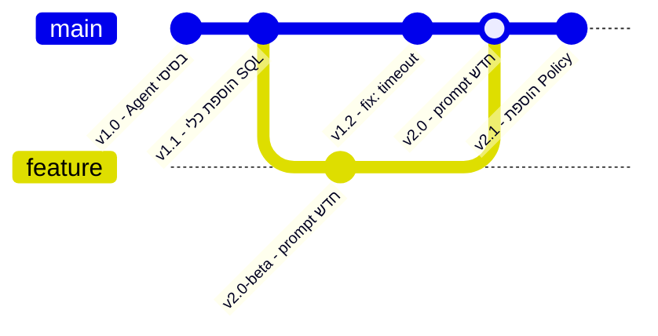

| יתרון של Versioning | הסבר |
|---------------------|-------|
| **Rollback** | אם גרסה חדשה לא עובדת טוב, חוזרים אחורה |
| **A/B Testing** | מריצים שתי גרסאות במקביל ומשווים |
| **Audit Trail** | מי שינה מה, מתי |
| **Gradual Rollout** | מעבירים 10% מהתנועה לגרסה חדשה, ואז 50%, ואז 100% |

---

## Configuration Management

### מה זה?
ניהול כל ההגדרות של הפלטפורמה באופן מרכזי, עקבי, ומבוקר.

### עקרונות חשובים:

| עקרון | הסבר |
|-------|-------|
| **Configuration as Code** | ההגדרות שמורות כקוד (YAML/JSON) ב-Git, לא ב-UI |
| **Separation of Config from Code** | הקוד של ה-Agent לא משתנה - רק ההגדרות |
| **Environment-specific** | הגדרות שונות ל-Dev, Staging, Production |
| **Secrets Management** | API Keys, passwords נשמרים בכספת (Vault), לא ב-config |

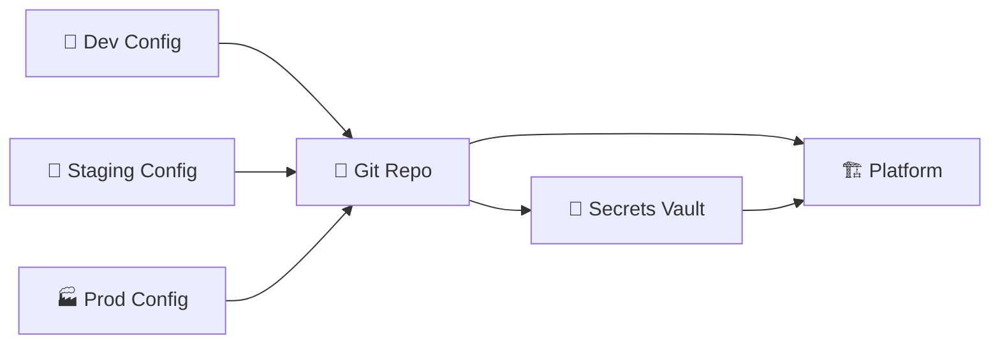

---

## זרימת בקשה דרך ה-Control Plane

הנה מה שקורה כשמשתמש יוצר Agent חדש:

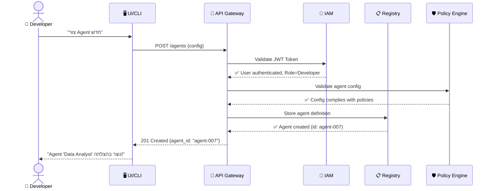

---

## יתרונות וחסרונות

### ✅ יתרונות של Control Plane

| יתרון | הסבר |
|-------|-------|
| **ניהול מרכזי** | מקום אחד לראות ולנהל את כל ה-Agents |
| **Governance** | אכיפת כללים ומדיניות |
| **Audit Trail** | תיעוד מלא של כל שינוי |
| **Self-Service** | צוותים יכולים ליצור Agents בעצמם דרך UI |
| **סטנדרטיזציה** | כל ה-Agents מוגדרים באותו פורמט |

### ❌ אתגרים

| אתגר | הסבר | פתרון |
|-------|------|-------|
| **SPOF** | אם ה-CP נופל, אי אפשר לנהל | High Availability, Multi-region |
| **Consistency** | שינוי ב-Registry צריך להגיע ל-Runtime | Event-driven propagation |
| **Complexity** | הרבה רכיבים לנהל | Infrastructure as Code |
| **Latency** | כל בקשה עוברת Gateway + Auth | Caching, Edge deployment |

---

## סיכום

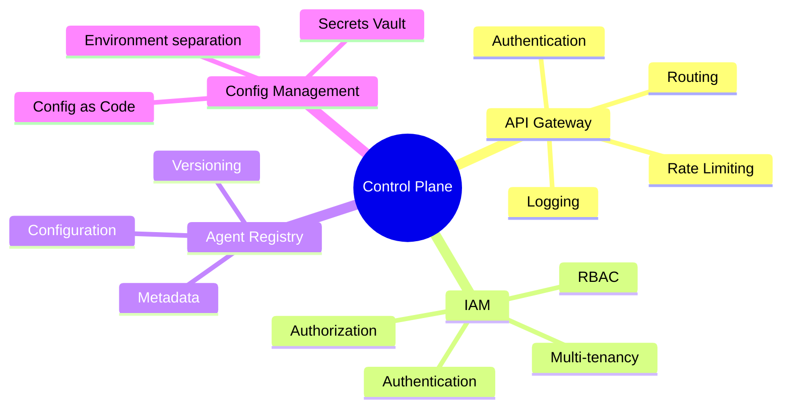

| מה למדנו | נקודה מרכזית |
|-----------|-------------|
| **Control Plane** | שכבת ניהול - לא מריצה Agents, מנהלת אותם |
| **הפרדה** | הפרדת Control מ-Runtime מאפשרת Scaling ובידוד כשלים |
| **API Gateway** | נקודת כניסה אחת - אימות, Rate Limiting, Routing |
| **IAM** | Authentication (מי אתה) + Authorization (מה מותר לך) |
| **RBAC** | הרשאות דרך תפקידים, לא ישירות למשתמשים |
| **Registry** | "תעודת זהות" של כל Agent - כל ההגדרות במקום אחד |
| **Versioning** | גרסאות מאפשרות Rollback, A/B Testing, Audit |

---

## ❓ שאלות לבדיקה עצמית

1. מהם שני התפקידים העיקריים של ה-Control Plane?
2. מה ההבדל בין Authentication ל-Authorization? תן דוגמה.
3. למה צריך API Gateway? מה קורה בלעדיו?
4. מהו RBAC ואיך הוא עובד?
5. למה חשוב Versioning של Agent Configuration?
6. תתאר את הזרימה של יצירת Agent חדש (מי פונה למי).
7. מהם שלושת מודלי ה-Multi-Tenancy ומה היתרון של כל אחד?

---

### 📝 תשובות

<details>
<summary>1. מהם שני התפקידים העיקריים של ה-Control Plane?</summary>

1. **ניהול (Management)** - הגדרת Agents, רישום כלים ומודלים, ניהול policies והרשאות.
2. **תצורה (Configuration)** - שמירת הגדרות, versioning, ניהול tenants וקביעת כללי השימוש בפלטפורמה.
</details>

<details>
<summary>2. מה ההבדל בין Authentication ל-Authorization? תן דוגמה.</summary>

**Authentication (AuthN)** = "מי אתה?" - אימות זהות (login, token). **Authorization (AuthZ)** = "מה מותר לך?" - בדיקת הרשאות. דוגמה: roi@company.com מתחבר עם סיסמה (AuthN ✅), אבל לא מורשה למחוק Agents כי הוא בתפקיד viewer (AuthZ ❌).
</details>

<details>
<summary>3. למה צריך API Gateway? מה קורה בלעדיו?</summary>

API Gateway מספק: rate limiting, authentication, routing, logging, TLS termination, ו-versioning. **בלעדיו**: כל שירות חייב לממש את כל אלה בעצמו → כפילויות, חורי אבטחה, אין שליטה מרכזית בתעבורה, קשה לעקוב ולהגביל שימוש.
</details>

<details>
<summary>4. מהו RBAC ואיך הוא עובד?</summary>

**RBAC (Role-Based Access Control)** = מערכת הרשאות מבוססת תפקידים. כל משתמש מקבל **Role** (admin, developer, viewer), וכל Role מגדיר אילו **Permissions** יש (create agent, read data, delete). במקום להגדיר הרשאות per user, מגדירים per role → פשוט יותר לנהל.
</details>

<details>
<summary>5. למה חשוב Versioning של Agent Configuration?</summary>

1. **Rollback** - אם עדכון שבר משהו, אפשר לחזור לגרסה קודמת.
2. **Audit** - לדעת מי שינה מה ומתי.
3. **A/B Testing** - להשוות ביצועים בין גרסאות.
4. **Reproducibility** - לשחזר בדיוק את ההתנהגות של Agent בזמן מסוים.
</details>

<details>
<summary>6. תתאר את הזרימה של יצירת Agent חדש.</summary>

1. **Developer** שולח בקשת POST /agents ל-**API Gateway**.
2. Gateway מבצע **Authentication** (מי זה?) ו-**Authorization** (מורשה ליצור?).
3. הבקשה מגיעה ל-**Agent Registry** שמאמת את ה-schema.
4. **Config Manager** שומר את ההגדרות.
5. **Policy Engine** מוודא שה-Agent עומד בכללים.
6. Agent נרשם ומוכן לשימוש ב-Runtime Plane.
</details>

<details>
<summary>7. מהם שלושת מודלי ה-Multi-Tenancy ומה היתרון של כל אחד?</summary>

1. **Shared Everything** - כל ה-tenants חולקים הכל (DB, compute). יתרון: **עלות נמוכה**. חיסרון: Noisy Neighbor.
2. **Shared Infra, Isolated Data** - compute משותף אבל DB/namespace נפרד per tenant. יתרון: **איזון עלות-אבטחה**.
3. **Fully Isolated** - כל tenant בסביבה נפרדת לחלוטין. יתרון: **אבטחה מקסימלית**. חיסרון: יקר מאוד.
</details>

---

**[⬅️ חזרה לפרק 1: מושגי יסוד](01-fundamentals.md)** | **[➡️ המשך לפרק 3: Runtime Plane →](03-runtime-plane.md)**
