# 🎭 פרק 5: Orchestration Patterns

## תוכן עניינים
- [מה זה Orchestration?](#מה-זה-orchestration)
- [Sequential Execution](#sequential-execution)
- [Parallel Execution](#parallel-execution)
- [Autonomous Execution](#autonomous-execution)
- [Sub-Agent Orchestration](#sub-agent-orchestration)
- [DAG Workflows](#dag-workflows)
- [Patterns מתקדמים](#patterns-מתקדמים)
- [השוואת Patterns](#השוואת-patterns)
- [סיכום ושאלות](#סיכום-ושאלות)

---

## מה זה Orchestration?

**Orchestration** = איך ה-Agent (או מספר Agents) מתאמים פעולות כדי להשלים משימה.

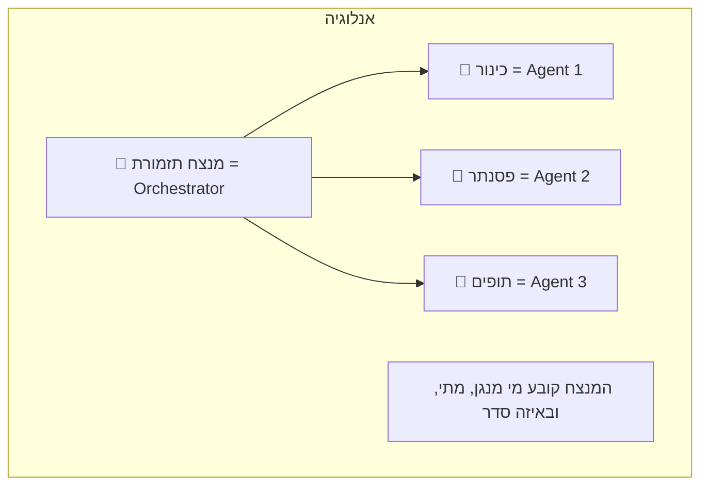


סוכן בודד עובד מצוין לשאלות פשוטות (למשל עם לולאת ReAct עליה למדנו בפרק 1). אבל משימות מורכבות — כמו "נתח את נתוני המכירות שלנו, תקרא 10 דוחות של מתחרים מהרשת, ותכתוב על זה מאמר אסטרטגי" — דורשות תיאום. בחירה בתבנית Orchestration לא נכונה תוביל לבאגים, איבוד נתונים או הרצה יקרה וארוכה מאוד.

### תרחיש מציאותי: הרכבת דוח השיווק השבועי
צוות השיווק רוצה לקבל בריף (דוח) אוטומטי בכל יום שני בבוקר. המשימה מחולקת ל-3:
1. שליפת רשימת הלידים שנסגרו ב-Salesforce בחזר האחרון.
2. ניתוח טראפיק האתר מה-Google Analytics.
3. כתיבת סיכום שבועי על בסיס שניהם.

אם תתנו למודל AI אחד "לרוץ חופשי" על המשימה הזו (לולאת ReAct מסורתית), הוא עלול להסתבך עם עשרות אלפי שורות ב-Salesforce ולשכוח שהוא היה צריך בכלל לפנות ל-Google. לחלופין, הוא יכול לעשות הכל *בטור* אחד אחרי השני מה שייקח 3 דקות.
עם **Orchestrator מבוסס גרף מונחה (DAG)**, המערכת תפעיל את המשימות של Salesforce ו-Google Analytics **במקביל באותו שבריר שנייה** ואז תמתין ששתיהן יסתיימו, ורק אז תפעיל את שלב הניסוח (רדוסר). זמן הביצוע צונח דרסטית ומובטח שה-Output תקין.

### למה צריך Orchestration?

משימות פשוטות = Agent אחד מספיק. משימות מורכבות = צריך **תיאום**:

| משימה | Agent אחד? | Orchestration? |
|--------|-----------|---------------|
| "מה מזג האוויר?" | ✅ | ❌ |
| "סכם את המייל" | ✅ | ❌ |
| "נתח מכירות, השווה למתחרים, וכתוב דוח" | ❌ | ✅ |
| "תתכנן טיול: טיסות + מלון + השכרת רכב" | ❌ | ✅ |

---

## Sequential Execution (ביצוע סדרתי)

### מה זה?
שלב אחרי שלב - כל שלב מתחיל רק אחרי שהקודם סיים.

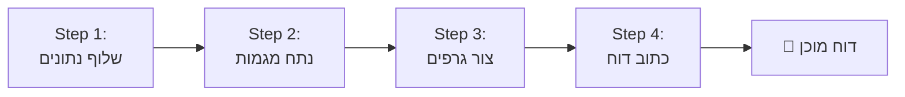

### דוגמה: Pipeline של עיבוד מסמך

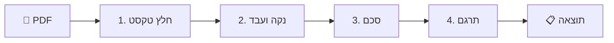

### בעד ונגד

| ✅ בעד | ❌ נגד |
|--------|--------|
| פשוט להבנה | איטי - שלב מחכה לקודמו |
| קל לדבג | לא מנצל parallelism |
| Deterministic - תמיד אותו סדר | אם שלב נכשל, הכל עוצר |
| קל להוסיף Checkpoint | |

---

## Parallel Execution (ביצוע מקבילי)

### מה זה?
מספר פעולות רצות **במקביל** - לא תלויות אחת בשנייה.

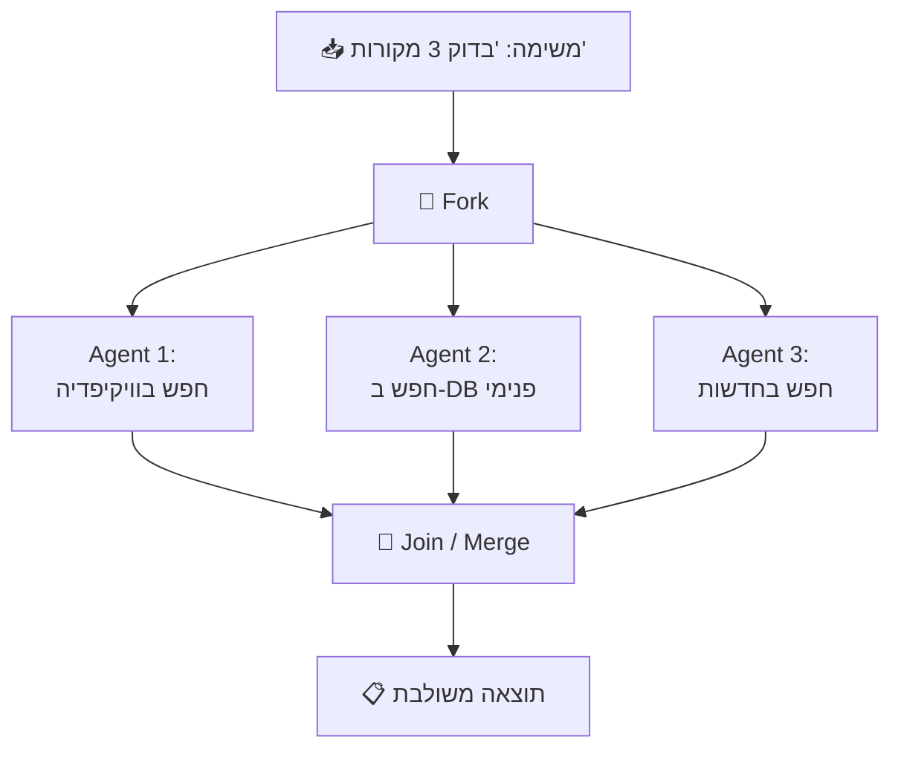

### Fan-Out / Fan-In Pattern

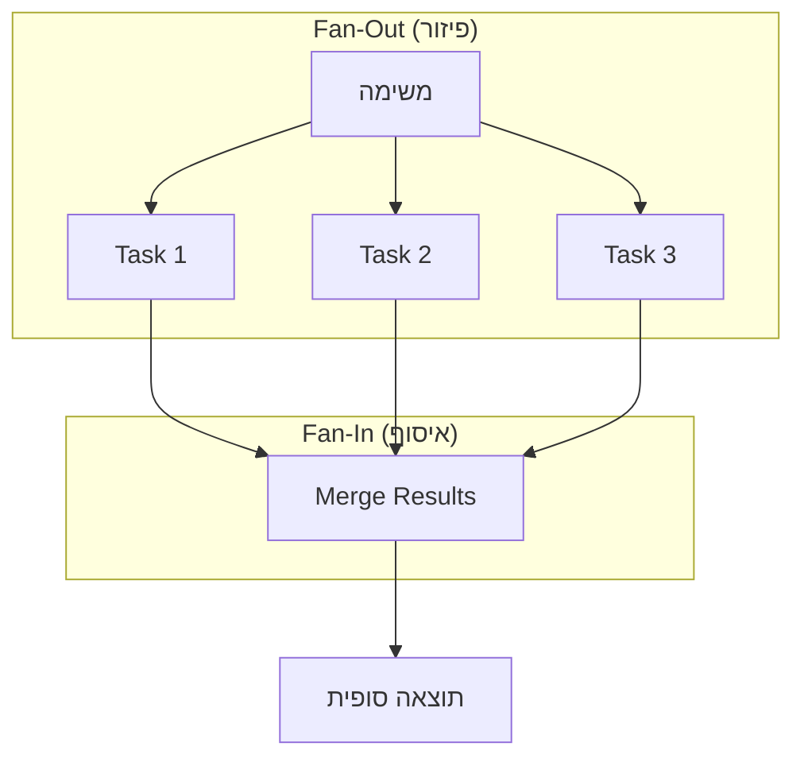

### אתגרים בביצוע מקבילי:

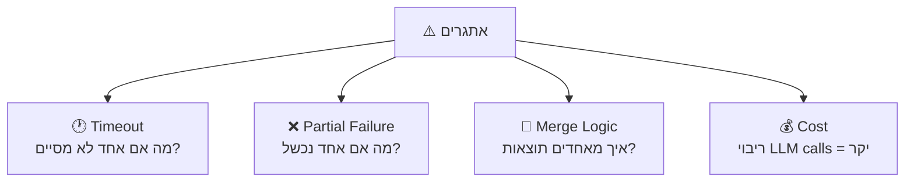

| אתגר | פתרון |
|-------|-------|
| **Timeout** | קבע deadline; אם לא סיים, המשך בלעדיו |
| **Partial Failure** | החלט: כשל אחד = כשל הכל? או המשך עם מה שיש? |
| **Merge** | Aggregator Agent שמאחד תוצאות |
| **Cost** | הגבל parallelism (max concurrent) |

### בעד ונגד

| ✅ בעד | ❌ נגד |
|--------|--------|
| מהיר (N פעולות בזמן של 1) | מורכב |
| מנצל משאבים טוב | Merge logic לא טריוויאלי |
| מתאים לחיפוש multi-source | כשל חלקי קשה לטפל |

---

## Autonomous Execution (ביצוע אוטונומי)

### מה זה?
ה-Agent **מחליט בעצמו** מה לעשות הלאה. אין workflow קבוע מראש - ה-Agent מנווט לפי הצורך.

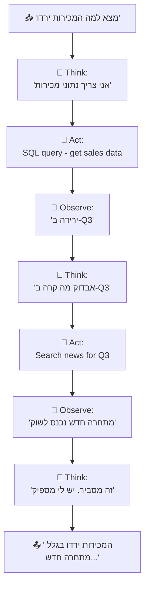

### ReAct Pattern (Reason + Act)

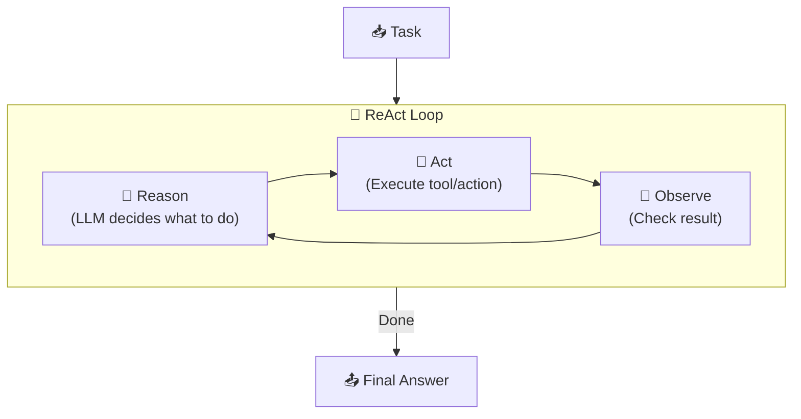

### Plan-and-Execute Pattern

שיפור על ReAct: ה-Agent **מתכנן מראש** ואז **מבצע** את התכנית:

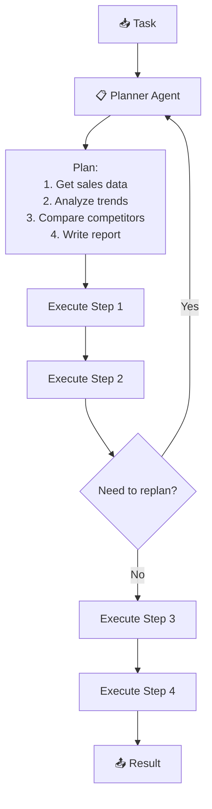

### בעד ונגד

| ✅ בעד | ❌ נגד |
|--------|--------|
| גמיש מאוד | לא צפוי (non-deterministic) |
| מגלה דברים שלא חשבת עליהם | יכול ללכת לאיבוד |
| מתאים לבעיות פתוחות | עלות גבוהה (הרבה LLM calls) |
| | קשה לדבג |
| | צריך guardrails חזקים |

---

## Sub-Agent Orchestration

### מה זה?
Agent ראשי שמאציל משימות ל-**Agents מומחים**:

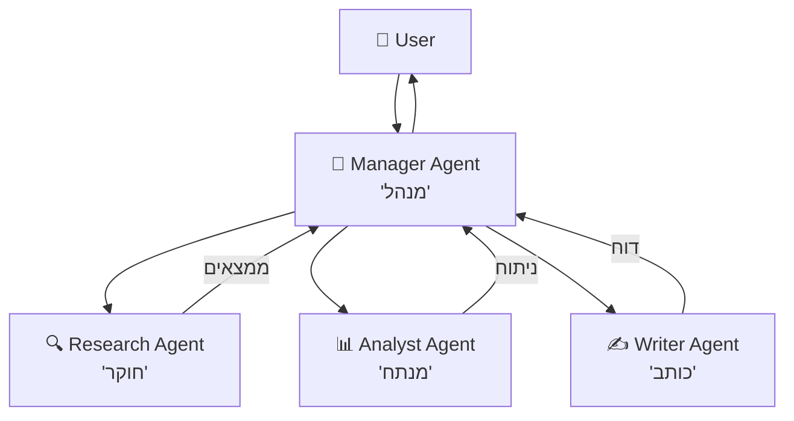

### דוגמה: כתיבת מאמר

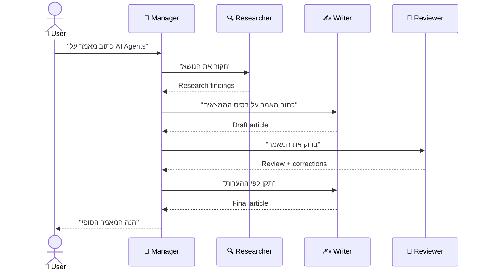

### Patterns של Sub-Agent:

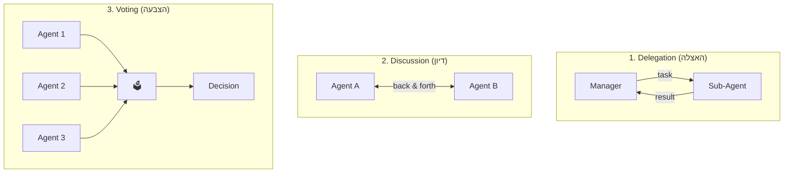

### יתרונות וחסרונות

| ✅ בעד | ❌ נגד |
|--------|--------|
| כל Agent מומחה בתחומו | תקשורת overhead |
| Scaling של experts | ריבוי LLM calls = cost |
| מודולריות - קל להחליף Agent | ניהול מורכב |
| Parallel execution אפשרי | Debugging קשה |

---

## DAG Workflows

### מה זה DAG?
**DAG = Directed Acyclic Graph** = גרף מכוון ללא מעגלים.

מאפשר לתאר workflows מורכבים עם **dependencies** - "שלב X רץ רק אחרי ש-A ו-B סיימו":

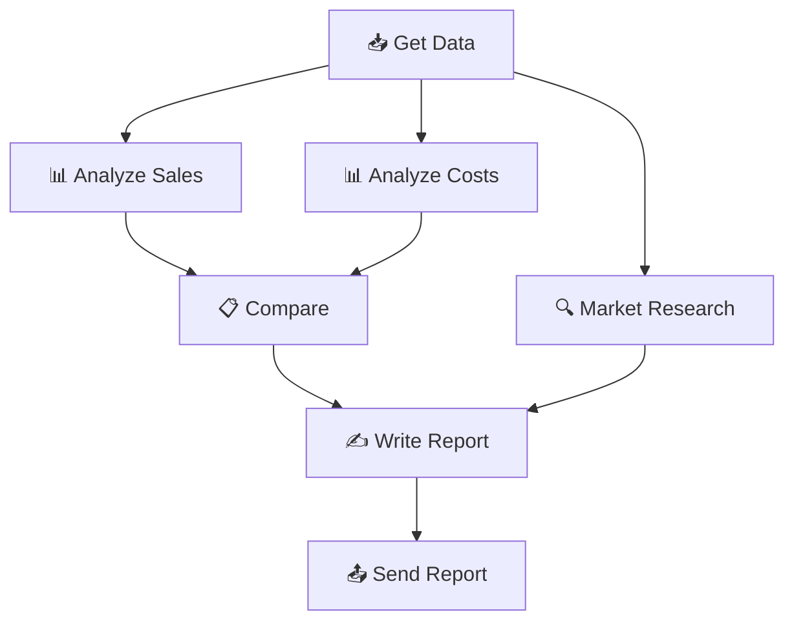

### למה DAG ולא רשימה?

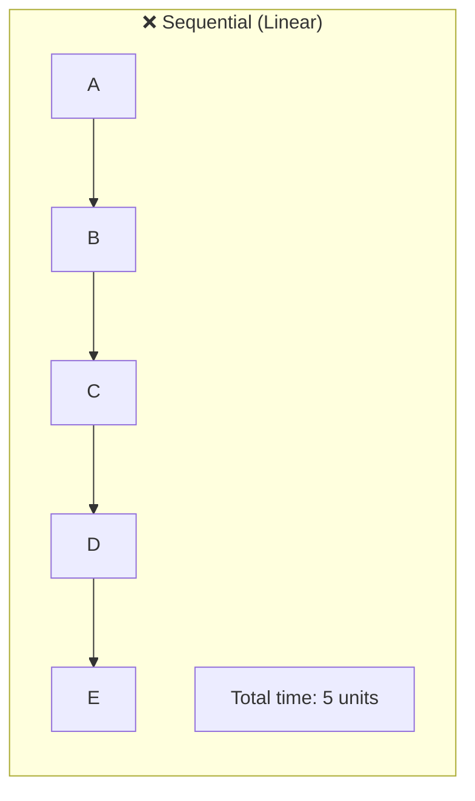

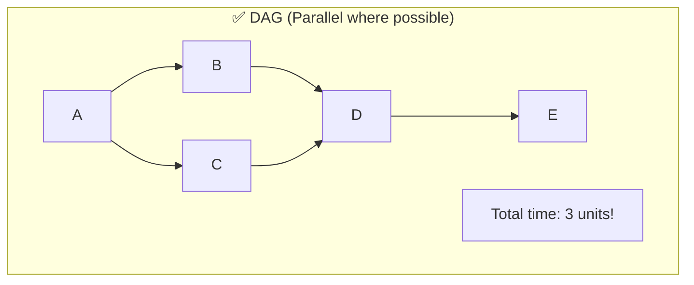

### DAG vs Sequential:

| Sequential | DAG |
|-----------|-----|
| A→B→C→D→E = 5 steps | A→(B,C parallel)→D→E = 3 steps |
| פשוט | מהיר |
| כל שלב תלוי בקודמו | שלבים עצמאיים רצים במקביל |

---

## Patterns מתקדמים

### 1. Map-Reduce Pattern

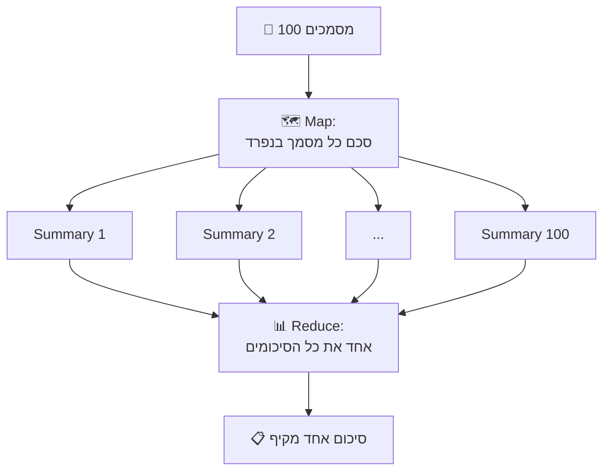

**מתאים ל:** סיכום מסמכים רבים, ניתוח datasets, aggregation

#### דוגמת מימוש Map-Reduce

```python
import asyncio

async def map_reduce_summarize(documents: list[str]) -> str:
    """סיכום 100 מסמכים בתבנית Map-Reduce."""
    
    # שלב MAP: עיבוד כל מסמך במקביל
    async def summarize_one(doc: str) -> str:
        """סיכום מסמך בודד (קריאת LLM אחת)."""
        return await llm.call(
            f"Summarize this document in 2-3 sentences:\n\n{doc}"
        )
    
    # הרצת 10 workers במקביל (לא 100 — כיבוד rate limits!)
    semaphore = asyncio.Semaphore(10)
    
    async def limited_summarize(doc):
        async with semaphore:
            return await summarize_one(doc)
    
    summaries = await asyncio.gather(
        *[limited_summarize(doc) for doc in documents]
    )
    # תוצאה: 100 סיכומים בודדים, ~10 שניות (במקביל)
    
    # שלב REDUCE: שילוב כל הסיכומים לאחד
    combined = "\n".join(
        f"[Doc {i+1}]: {s}" for i, s in enumerate(summaries)
    )
    
    final_summary = await llm.call(
        f"Synthesize these {len(summaries)} document summaries "
        f"into one cohesive report:\n\n{combined}"
    )
    # תוצאה: סיכום מקיף אחד
    
    return final_summary

# השוואת ביצועים:
# סדרתי: 100 קריאות LLM × 3s = ~300 שניות
# Map-Reduce: 10 batches × 3s + 1 reduce = ~33 שניות (פי 9 מהיר!)
```

### 2. Supervisor Pattern

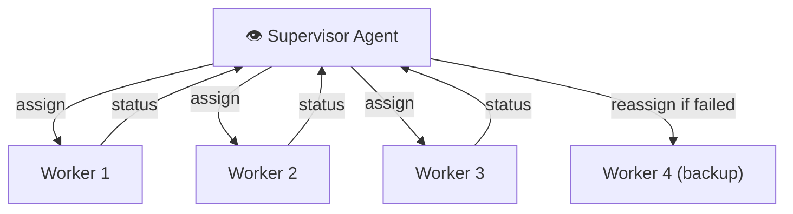

**Supervisor אחראי על:**
- הקצאת משימות ל-Workers
- מעקב אחרי התקדמות
- טיפול בכשלים (reassign)
- החלטה מתי הכל סיים

### 3. Critic Pattern

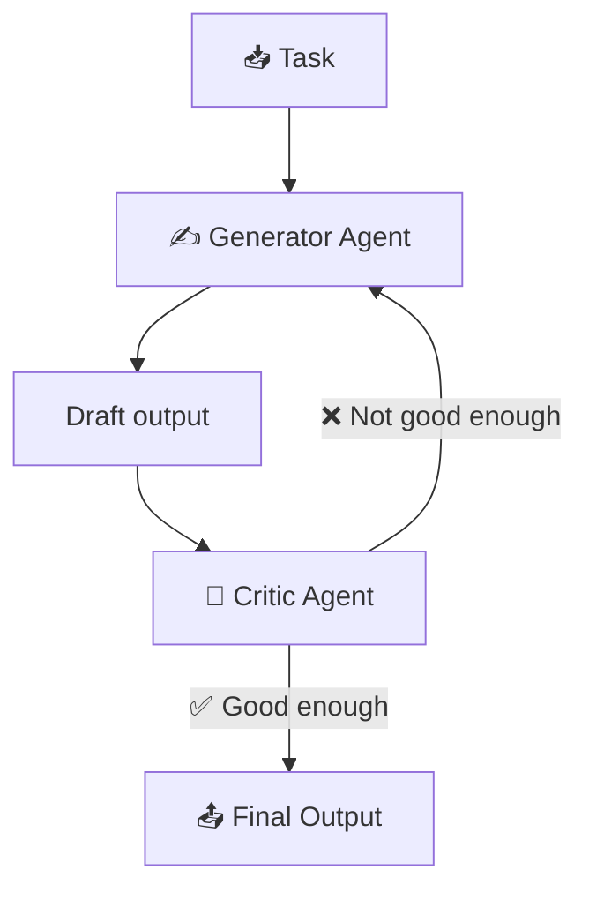

**מתאים ל:** כתיבה, קוד, תשובות שצריכות איכות גבוהה

---

## השוואת Patterns

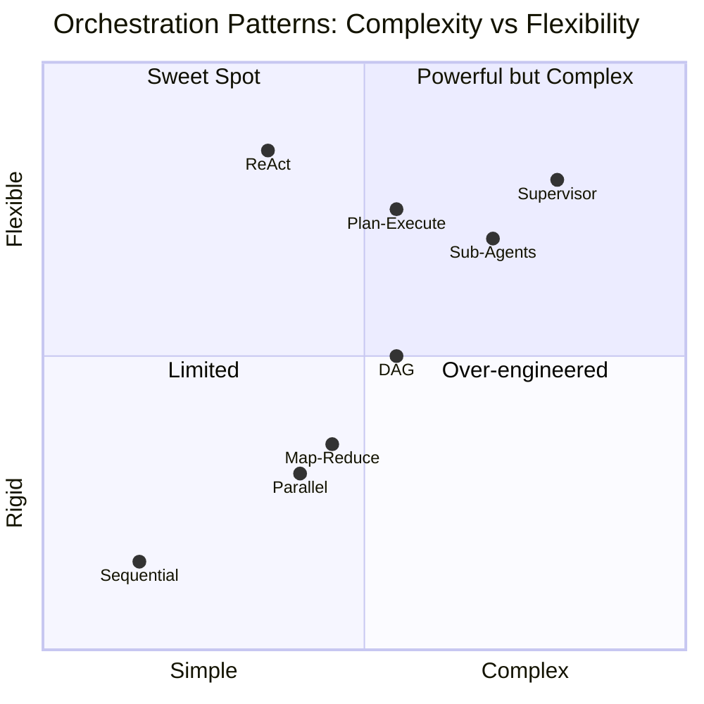

| Pattern | מתאים ל | מורכבות | עלות |
|---------|---------|---------|------|
| **Sequential** | Pipelines פשוטים | ⭐ | 💰 |
| **Parallel** | חיפוש multi-source | ⭐⭐ | 💰💰 |
| **ReAct** | בעיות פתוחות | ⭐⭐ | 💰💰💰 |
| **Plan-Execute** | משימות מורכבות | ⭐⭐⭐ | 💰💰💰 |
| **Sub-Agents** | צוות של מומחים | ⭐⭐⭐ | 💰💰💰💰 |
| **DAG** | Workflows עם dependencies | ⭐⭐⭐ | 💰💰 |
| **Map-Reduce** | עיבוד bulk | ⭐⭐ | 💰💰💰 |
| **Supervisor** | מערכות מבוזרות | ⭐⭐⭐⭐ | 💰💰💰💰 |

---

## סיכום

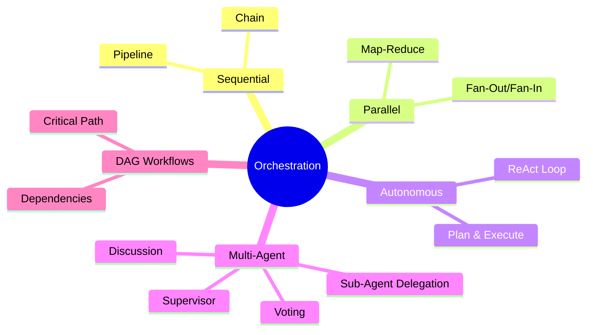

| מה למדנו | נקודה מרכזית |
|-----------|-------------|
| **Sequential** | שלב אחרי שלב - פשוט אך איטי |
| **Parallel** | מספר פעולות במקביל - מהיר אך מורכב |
| **Autonomous** | Agent מחליט בעצמו - גמיש אך לא צפוי |
| **Sub-Agents** | מומחים לכל תחום - מודולרי אך יקר |
| **DAG** | גרף dependencies - מאזן בין מקביליות לסדר |
| **Map-Reduce** | עיבוד bulk של נתונים |
| **Supervisor** | Agent שמנהל workers |

---

## ❓ שאלות לבדיקה עצמית

1. מה ההבדל בין Sequential ל-Parallel execution?
2. מה זה ReAct Pattern? תתאר את הלולאה.
3. מה היתרון של Plan-and-Execute על פני ReAct?
4. מתי כדאי להשתמש ב-Sub-Agents?
5. מה זה DAG ולמה הוא עדיף על רשימה?
6. מה זה Map-Reduce Pattern ומתי משתמשים בו?
7. מה תפקיד ה-Supervisor Agent?
8. איזה Pattern מתאים לכל סיטואציה: סיכום 100 מסמכים? חיפוש ב-3 מקורות? כתיבת מאמר?

---

### 📝 תשובות

<details>
<summary>1. מה ההבדל בין Sequential ל-Parallel execution?</summary>

**Sequential** = צעדים רצים אחד אחרי השני. הפלט של צעד 1 מזין את צעד 2. פשוט, אבל איטי. **Parallel** = צעדים רצים בו זמנית. מהיר, אבל דורש ניהול תלויות ו-fan-out/fan-in.
</details>

<details>
<summary>2. מה זה ReAct Pattern? תתאר את הלולאה.</summary>

**ReAct (Reason + Act)** = לולאה של: **Think** (ה-LLM מנתח מה לעשות) → **Act** (מפעיל כלי / עושה פעולה) → **Observe** (רואה את התוצאה) → חוזר ל-Think עד סיום. ה-Agent עוצר כשאין לו עוד פעולות לבצע או הגיע ל-max steps.
</details>

<details>
<summary>3. מה היתרון של Plan-and-Execute על פני ReAct?</summary>

**ReAct** מחליט צעד אחר צעד - לא רואה את התמונה המלאה. **Plan-and-Execute** קודם יוצר **תוכנית מלאה** ואז מבצע צעד אחר צעד. יתרונות: (1) יעילות גבוהה יותר, (2) פחות LLM calls (תכנון רק 1, כל הרצה נפרדת), (3) ניתן להקביל כל executor.
</details>

<details>
<summary>4. מתי כדאי להשתמש ב-Sub-Agents?</summary>

כשהמשימה **מורכבת ממספר תחומים שונים** (חיפוש + כתיבה + אנליזה). כל sub-agent הוא מומחה בתחום אחד עם system prompt, כלים, ומודל מותאמים. Agent ראשי (Supervisor) מנתב ל-sub-agents ומשלב תוצאות.
</details>

<details>
<summary>5. מה זה DAG ולמה הוא עדיף על רשימה?</summary>

**DAG (Directed Acyclic Graph)** = גרף מכוון ללא מעגלים. עדיף על רשימה כי: (1) מאפשר **parallelism** - צעדים ללא תלות רצים במקביל, (2) מאפשר **תלויות מורכבות** - A → B וגם A → C במקביל, (3) מבטיח שלא יהיו **לולאות אינסופיות**.
</details>

<details>
<summary>6. מה זה Map-Reduce Pattern ומתי משתמשים בו?</summary>

**Map** = פיצול משימה גדולה להרבה תת-משימות שרצות במקביל. **Reduce** = איחוד כל התוצאות לתשובה אחת. מתאים ל: סיכום 100 מסמכים (Map: סכם כל אחד | Reduce: אחד לסיכום אחד), אנליזה של טבלאות מרובות.
</details>

<details>
<summary>7. מה תפקיד ה-Supervisor Agent?</summary>

**Supervisor Agent** = Agent ראשי שמנהל צוות Sub-Agents. הוא: (1) מקבל את המשימה מהמשתמש, (2) מחליט לאיזה sub-agent להעביר, (3) עוקב אחרי תוצאות, (4) משלב ומחזיר תשובה סופית. הוא אחראי ל-routing ואיכות.
</details>

<details>
<summary>8. איזה Pattern מתאים לכל סיטואציה?</summary>

- **סיכום 100 מסמכים** → **Map-Reduce**: Map מסכם כל אחד, Reduce מאחד.
- **חיפוש ב-3 מקורות** → **Parallel + Fan-In**: 3 חיפושים במקביל, איחוד תוצאות.
- **כתיבת מאמר** → **Plan-and-Execute**: קודם תוכנית (outline, research, draft, review) ואז ביצוע sequential.
</details>

---

**[⬅️ חזרה לפרק 4: Thread & State](04-thread-state-management.md)** | **[➡️ המשך לפרק 6: Tools & Marketplace →](06-tools-marketplace.md)**
