# 🔧 פרק 8: Tools & Marketplace

## תוכן עניינים
- [מה הם Tools?](#מה-הם-tools)
- [Function Calling](#function-calling)
- [סוגי Tools](#סוגי-tools)
- [Tool Registry](#tool-registry)
- [Tool Execution Pipeline](#tool-execution-pipeline)
- [Tool Marketplace](#tool-marketplace)
- [אבטחת Tools](#אבטחת-tools)
- [יתרונות וחסרונות](#יתרונות-וחסרונות)
- [סיכום ושאלות](#סיכום-ושאלות)

---

## מה הם Tools?

**Tool** = פונקציה/API שה-Agent יכול להפעיל כדי **לפעול בעולם האמיתי**.

ה-LLM יודע לייצר טקסט. ה-Tools נותנים לו **ידיים**:

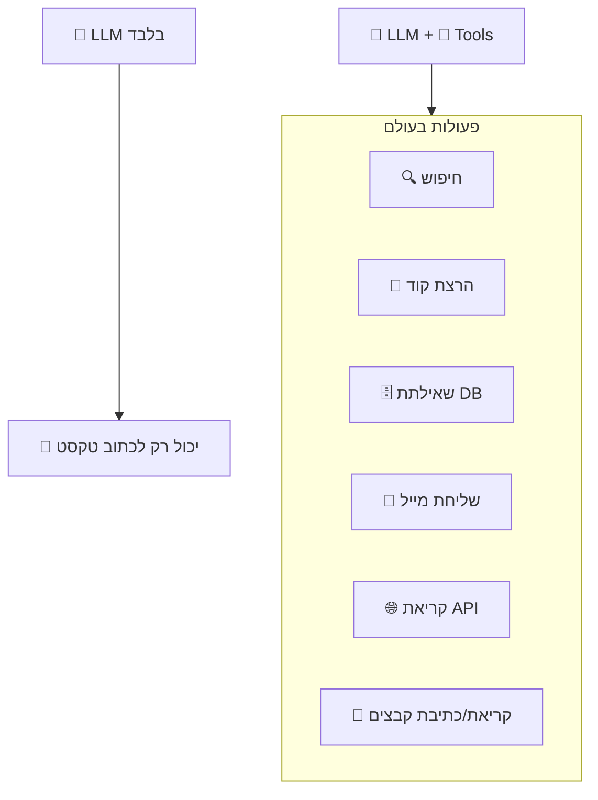

---

## Function Calling

### מה זה?
**Function Calling** הוא המנגנון שבו ה-LLM "מבקש" להפעיל כלי. ה-LLM לא מריץ את הכלי בעצמו - הוא **מחזיר הוראה** שהמערכת מריצה.

### הזרימה:

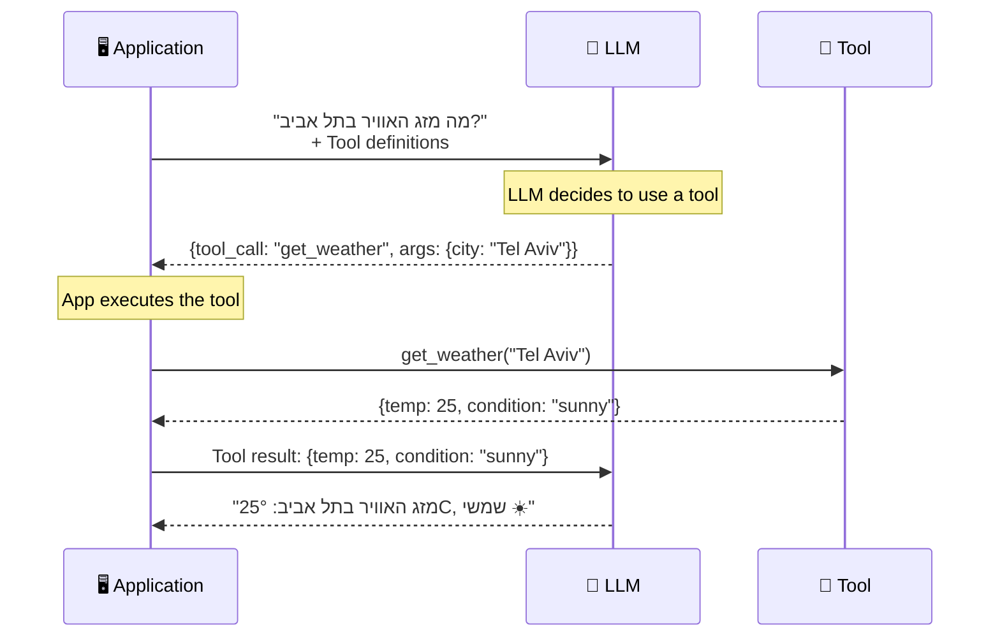

### איך ה-LLM "יודע" על הכלים?

אנחנו שולחים **הגדרות כלים** כחלק מהפרומפט:

```
Tool Definition:
├── name: "get_weather"
├── description: "Get current weather for a city"
└── parameters:
    ├── city (string, required): "The city name"
    └── unit (string, optional): "celsius or fahrenheit"
```

ה-LLM רואה את ההגדרה ו**מחליט** אם ומתי להשתמש בכלי.

### נקודה חשובה: ה-LLM לא מריץ כלום!

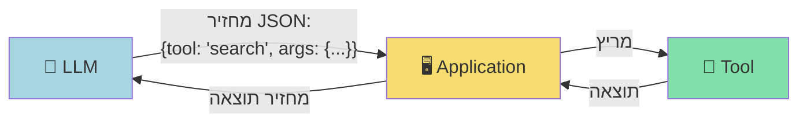

---

## סוגי Tools

### 1. Data Retrieval Tools (שליפת מידע)

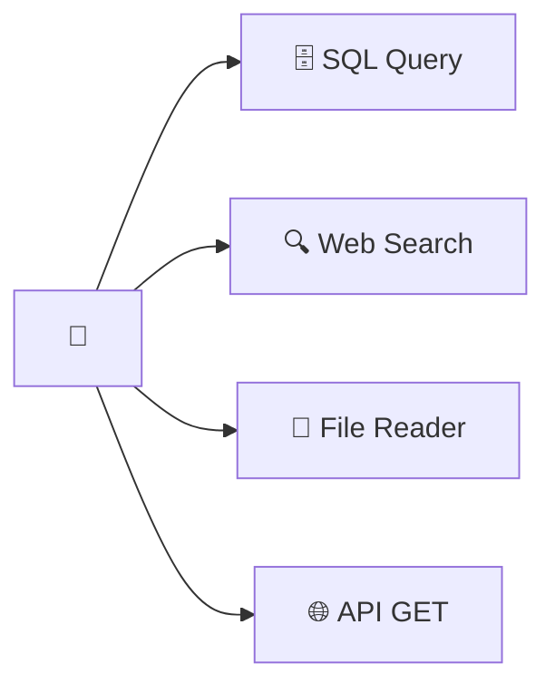

| כלי | מה עושה | דוגמה |
|-----|---------|-------|
| SQL Query | שאילתת מסד נתונים | `SELECT * FROM sales WHERE...` |
| Web Search | חיפוש באינטרנט | Bing/Google search |
| File Reader | קריאת קובץ | Read CSV, PDF, Excel |
| API Call | קריאת API חיצוני | GET /api/customers |

### 2. Action Tools (ביצוע פעולות)

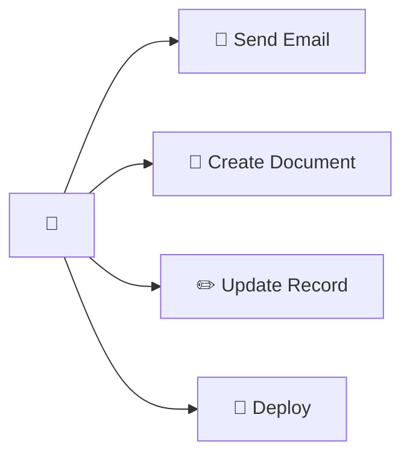

### 3. Computation Tools (חישובים)

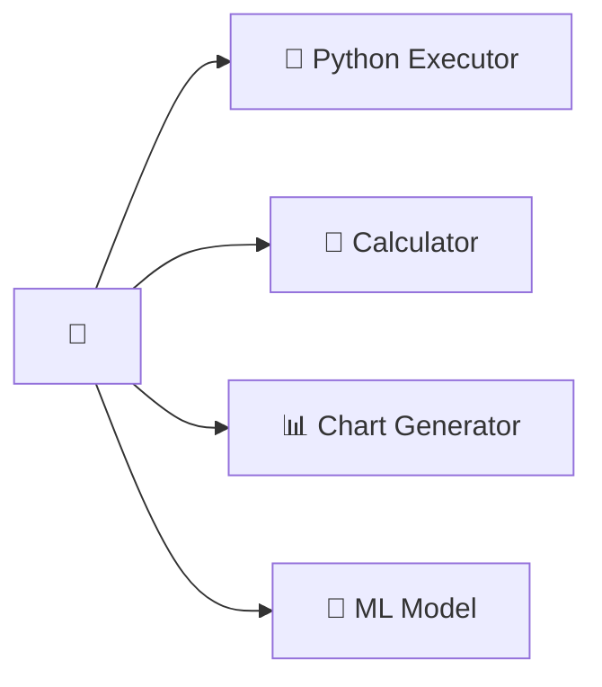

### 4. Communication Tools (תקשורת)

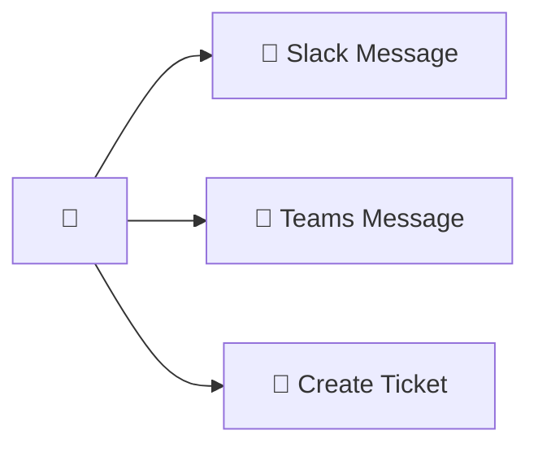

### סיווג לפי רמת סיכון:

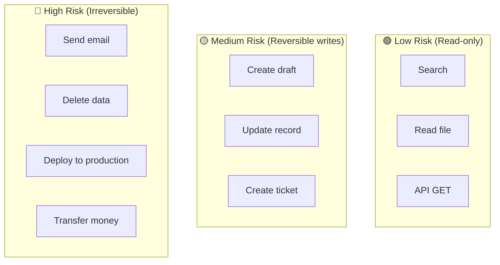

---

## Tool Registry

### מה זה?
**Tool Registry** = מאגר מרכזי של כל הכלים הזמינים בפלטפורמה.

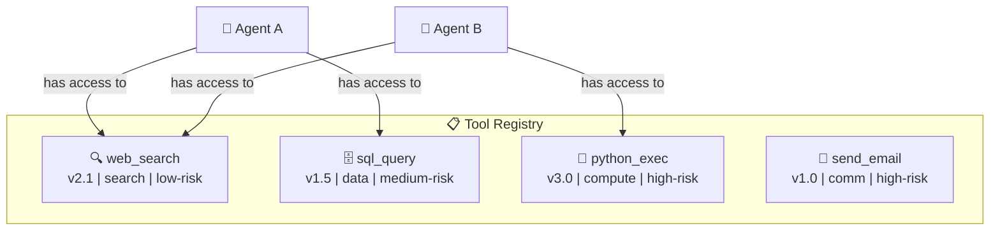

### Tool Definition Schema:

```
Tool:
├── id: "tool-sql-query"
├── name: "sql_query"
├── version: "1.5"
├── description: "Execute read-only SQL queries"
├── category: "data-retrieval"
├── risk_level: "medium"
├── parameters:
│   ├── query (string, required): "SQL query to execute"
│   └── database (string, required): "Target database name"
├── returns:
│   └── results (array): "Query results"
├── auth:
│   └── requires: ["db-read-access"]
├── limits:
│   ├── max_rows: 1000
│   ├── timeout: 30s
│   └── rate_limit: "10/minute"
├── sandbox:
│   └── required: true
└── owner: "team-data-platform"
```

---

## Tool Execution Pipeline

הזרימה מהרגע שה-LLM מבקש כלי ועד שהתוצאה חוזרת:

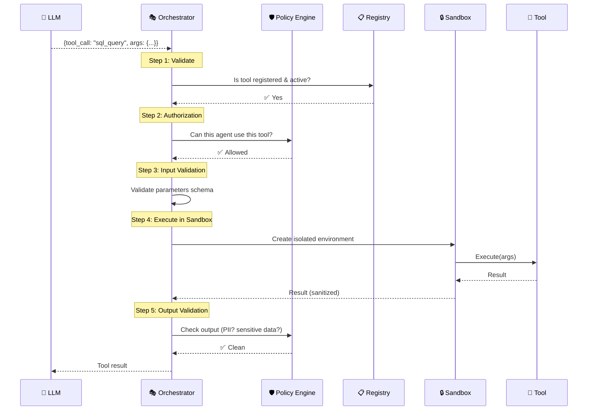

### שלבי ה-Pipeline:

| שלב | מה קורה | למה חשוב |
|------|---------|---------|
| **1. Validate** | בדוק שהכלי קיים | מניעת errors |
| **2. Authorize** | בדוק הרשאות | אבטחה |
| **3. Input Validate** | בדוק שהפרמטרים תקינים | מניעת injection |
| **4. Execute** | הרץ בסביבה מבודדת | אבטחה + isolation |
| **5. Output Validate** | בדוק שהתוצאה לא מכילה PII | compliance |

---

## Tool Marketplace

### מה זה?
**Marketplace** = חנות/קטלוג שבה צוותים יכולים **לפרסם**, **לגלות**, ו**להשתמש** בכלים שאחרים בנו.

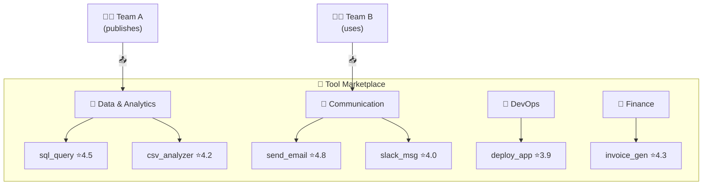

### Marketplace Features:

| Feature | הסבר |
|---------|-------|
| **Discovery** | חיפוש כלים לפי קטגוריה, שם, תיאור |
| **Versioning** | כל כלי עם גרסאות (v1.0, v1.1, v2.0) |
| **Documentation** | תיעוד, דוגמאות שימוש, API reference |
| **Ratings & Reviews** | דירוג ותגובות ממשתמשים |
| **Usage Analytics** | כמה פעמים השתמשו בכלי, success rate |
| **Access Control** | מי יכול להשתמש - public/private/team-only |
| **Certification** | כלים שעברו בדיקות אבטחה ואיכות |

### Publishing Flow:

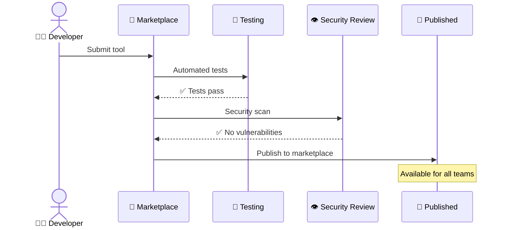

---

## אבטחת Tools

### Input Sanitization

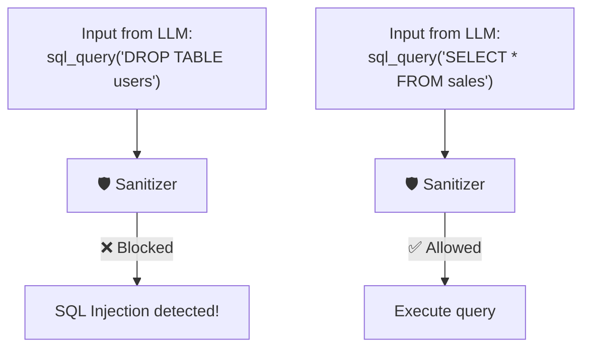

### סיכוני אבטחה בכלים:

| סיכון | הסבר | הגנה |
|-------|-------|------|
| **Prompt Injection** | LLM מרומה לקרוא לכלי לא מורשה | Policy Engine, allowlist |
| **SQL Injection** | LLM מייצר SQL זדוני | Parameterized queries, read-only |
| **Code Injection** | Agent מייצר קוד מסוכן | Sandbox, restricted permissions |
| **Data Exfiltration** | כלי שולח מידע רגיש החוצה | Network isolation, output scanning |
| **Excessive Permissions** | כלי עם הרשאות רחבות מדי | Least Privilege, scoped access |

### Principle of Least Privilege (עקרון ההרשאה המינימלית):

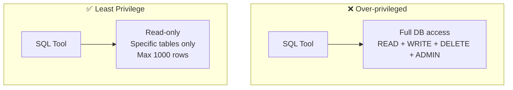

---

## יתרונות וחסרונות

### Tools

| ✅ יתרון | ❌ חיסרון |
|----------|----------|
| Agent יכול לפעול בעולם | סיכוני אבטחה |
| מרחיב את יכולות ה-LLM | כל tool call עולה latency |
| מודולרי - קל להוסיף כלים | LLM עלול לקרוא לכלי שגוי |
| Reusable בין Agents | Tool definitions תופסים tokens |

### Marketplace

| ✅ יתרון | ❌ חיסרון |
|----------|----------|
| שיתוף בין צוותים | ניהול versions |
| Discovery קל | Quality control |
| סטנדרטיזציה | Security review overhead |
| מהירות פיתוח | Dependency management |

---

## סיכום

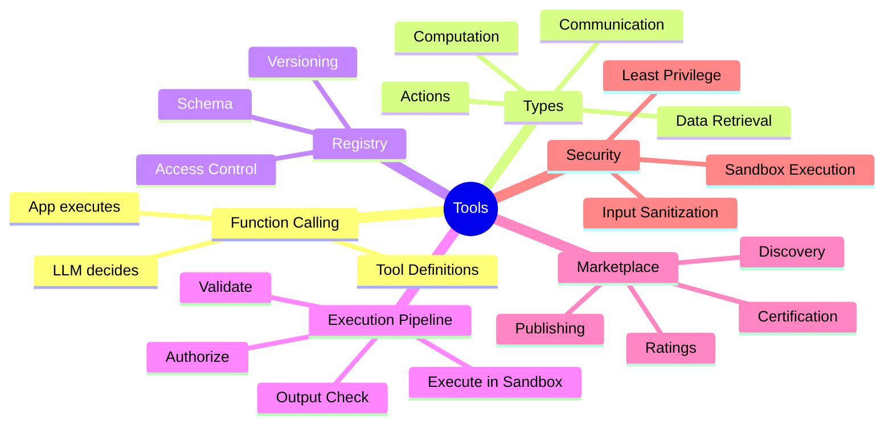

| מה למדנו | נקודה מרכזית |
|-----------|-------------|
| **Tools** | פונקציות שנותנות ל-Agent יכולת לפעול בעולם |
| **Function Calling** | LLM מחזיר הוראה (JSON), המערכת מריצה |
| **Tool Registry** | מאגר מרכזי של כל הכלים הזמינים |
| **Execution Pipeline** | Validate → Auth → Execute → Output Check |
| **Marketplace** | חנות כלים עם discovery, versioning, reviews |
| **Security** | Input sanitization, Least Privilege, Sandbox |

---

## ❓ שאלות לבדיקה עצמית

1. מה ההבדל בין Tool ל-Function Calling?
2. למה ה-LLM לא מריץ את הכלי בעצמו?
3. מהם ארבעת סוגי הכלים? תן דוגמה לכל אחד.
4. מהם 5 השלבים ב-Tool Execution Pipeline?
5. מה זה Tool Marketplace ולמה הוא חשוב?
6. מהו Principle of Least Privilege בהקשר של Tools?
7. מהם 3 סיכוני אבטחה בשימוש בכלים ואיך מתגוננים?

---

### 📝 תשובות

<details>
<summary>1. מה ההבדל בין Tool ל-Function Calling?</summary>

**Tool** = יכולת חיצונית שה-Agent יכול להפעיל (API, DB query, calculator). **Function Calling** = המנגנון הטכני שדרכו ה-LLM **מבקש** הפעלת כלי - הוא מחזיר JSON עם שם הפונקציה והפרמטרים. Tool = מה, Function Calling = איך ה-LLM מבקש את זה.
</details>

<details>
<summary>2. למה ה-LLM לא מריץ את הכלי בעצמו?</summary>

LLM הוא **מודל שפה** - הוא מייצר טקסט, לא מריץ קוד. הוא **לא מחובר לאינטרנט/DB/APIs**. לכן ה-LLM רק **מחליט** איזה כלי להפעיל, וה-**Platform** (Runtime) מבצע בפועל - הפרדת אחריות לאבטחה.
</details>

<details>
<summary>3. מהם ארבעת סוגי הכלים? תן דוגמה לכל אחד.</summary>

1. **API Tools** - קריאה לשירותים חיצוניים (מזג אוויר, הזמנת פגישה).
2. **Data Tools** - גישה למסדי נתונים (SQL query, vector search).
3. **Compute Tools** - קוד חישוב (Python sandbox, calculator).
4. **System Tools** - פעולות מערכת (שליחת מייל, file system).
</details>

<details>
<summary>4. מהם 5 השלבים ב-Tool Execution Pipeline?</summary>

1. **Selection** - ה-LLM בוחר איזה כלי להפעיל.
2. **Validation** - בדיקת פרמטרים, הרשאות, schema.
3. **Execution** - הרצת הכלי בפועל (ב-sandbox).
4. **Result Processing** - עיבוד התוצאה (סינון, קיצור).
5. **Return** - החזרת התוצאה ל-LLM לצעד Observe בלולאת ReAct.
</details>

<details>
<summary>5. מה זה Tool Marketplace ולמה הוא חשוב?</summary>

**Tool Marketplace** = קטלוג מרכזי של כלים מוכנים לשימוש, כמו App Store לכלים. חשוב כי: (1) **שימוש חוזר** - לא ממציאים הגלגל, (2) **תקינה** - כלים נבדקים ל-security ו-quality, (3) **תיעוד** - schema אחיד שה-LLM מבין, (4) **גילוי** - גרסאות discovery.
</details>

<details>
<summary>6. מהו Principle of Least Privilege בהקשר של Tools?</summary>

תת לכלי רק את ההרשאות ה**מינימליות** שהוא צריך. למשל: כלי שקורא מ-DB מקבל רק read, לא write/delete. כלי ששולח מייל יכול רק לשלוח, לא לקרוא את כל inbox. מצמצם את "blast radius" אם משהו לא בסדר.
</details>

<details>
<summary>7. מהם 3 סיכוני אבטחה בשימוש בכלים ואיך מתגוננים?</summary>

1. **Injection** - תוקף מזריק קלט זדוני לכלי (SQL injection דרך ה-agent). הגנה: input validation, parameterized queries.
2. **Data Exfiltration** - ה-Agent שולח מידע רגיש דרך כלי. הגנה: סינון output, DLP.
3. **Excessive Permissions** - כלי עם הרשאות רחבות מדי עושה נזק. הגנה: Least Privilege, ביקורת הרשאות קבועה.
</details>

---

**[⬅️ חזרה לפרק 7: Orchestration](07-orchestration.md)** | **[➡️ המשך לפרק 9: Policy & Governance →](09-policy-governance.md)**
