# 🛡️ פרק 9: Policy & Governance Engine

## תוכן עניינים
- [מה זה Policy Engine?](#מה-זה-policy-engine)
- [למה צריך Governance?](#למה-צריך-governance)
- [סוגי Policies](#סוגי-policies)
- [Policy Enforcement Points](#policy-enforcement-points)
- [Guardrails](#guardrails)
- [Content Safety](#content-safety)
- [Data Loss Prevention (DLP)](#data-loss-prevention-dlp)
- [Audit & Compliance](#audit--compliance)
- [יתרונות וחסרונות](#יתרונות-וחסרונות)
- [סיכום ושאלות](#סיכום-ושאלות)

---

## מה זה Policy Engine?

**Policy Engine** = מערכת כללים שמגדירה **מה מותר ומה אסור** ל-Agents לעשות.

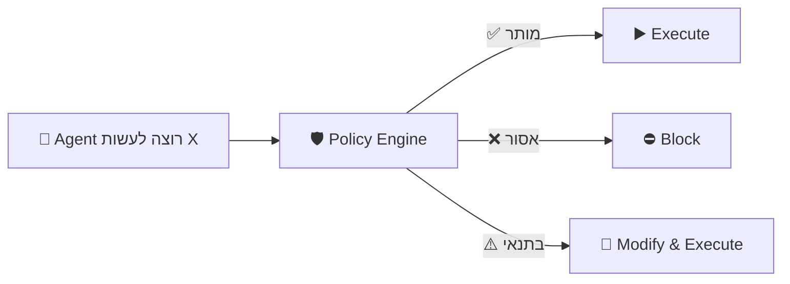

### אנלוגיה:

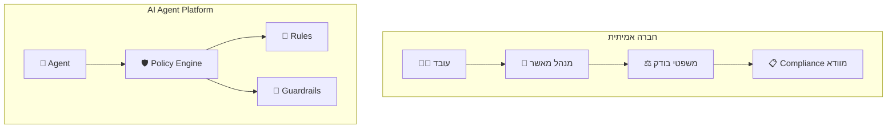

---

## למה צריך Governance?

### בלי Governance:

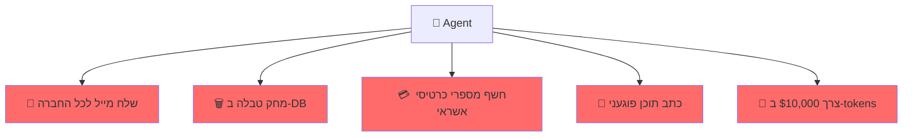

### עם Governance:

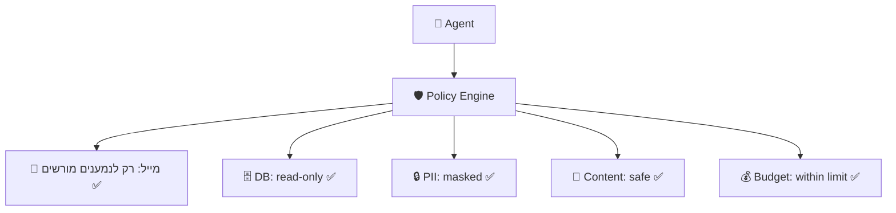

---

## סוגי Policies

### 1. Access Policies (מי מורשה)

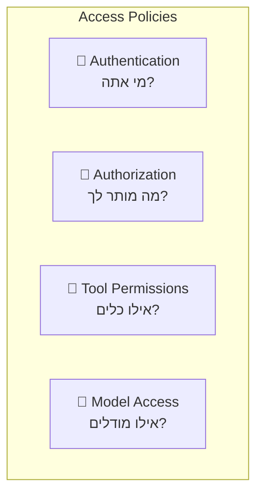

| Policy | דוגמה |
|--------|-------|
| Agent Access | "רק צוות Analytics יכול ליצור Data Agents" |
| Tool Access | "Agent הזה מורשה להשתמש רק ב-search ו-sql_read" |
| Model Access | "רק Agents מאושרים יכולים להשתמש ב-GPT-4o" |
| Data Access | "Agent רואה רק נתונים של ה-tenant שלו" |

### 2. Usage Policies (כמה מותר)

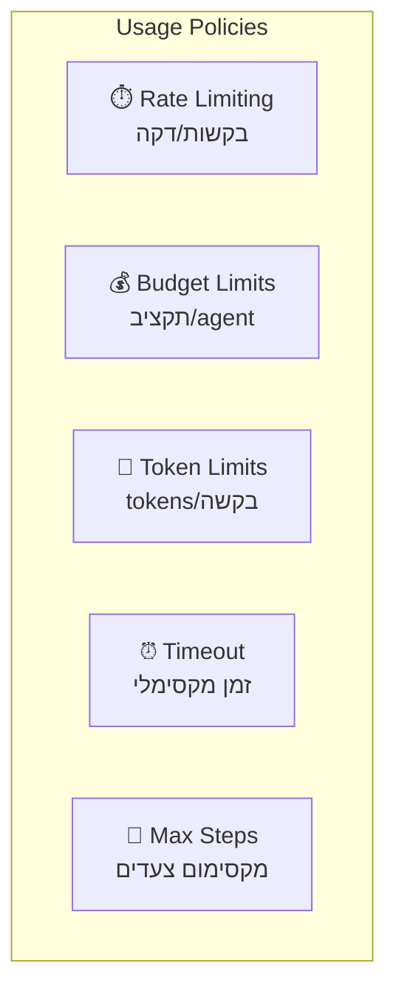

| Policy | דוגמה |
|--------|-------|
| Rate Limit | "מקסימום 100 בקשות/דקה per agent" |
| Budget | "מקסימום $50/יום per tenant" |
| Token Limit | "מקסימום 50K tokens per request" |
| Timeout | "Agent חייב לסיים תוך 120 שניות" |
| Max Steps | "מקסימום 10 tool calls per request" |

### 3. Content Policies (מה מותר לומר)

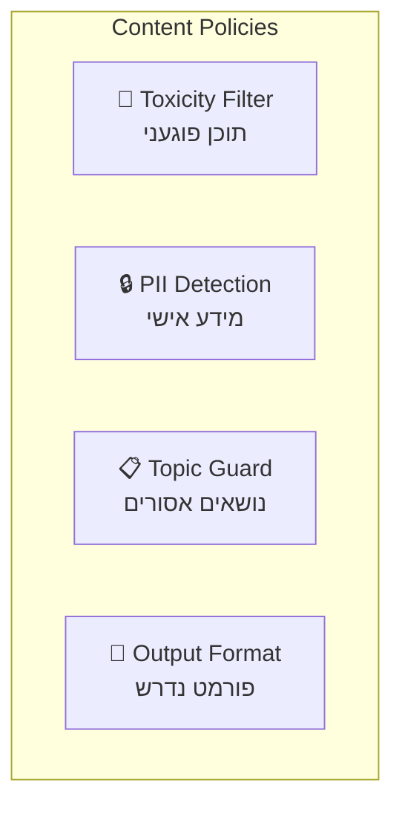

### 4. Operational Policies (איך לפעול)

| Policy | דוגמה |
|--------|-------|
| Logging | "כל tool call חייב להתועד" |
| Approval | "שליחת מייל דורשת אישור אנושי" |
| Fallback | "אם Agent נכשל 3 פעמים, העבר לנציג" |
| SLA | "זמן תגובה מקסימלי: 5 שניות" |

---

## Policy Enforcement Points

### איפה אוכפים Policies?

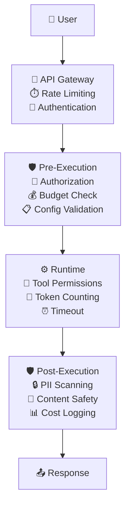

### Pre-Execution Policies (לפני הרצה):

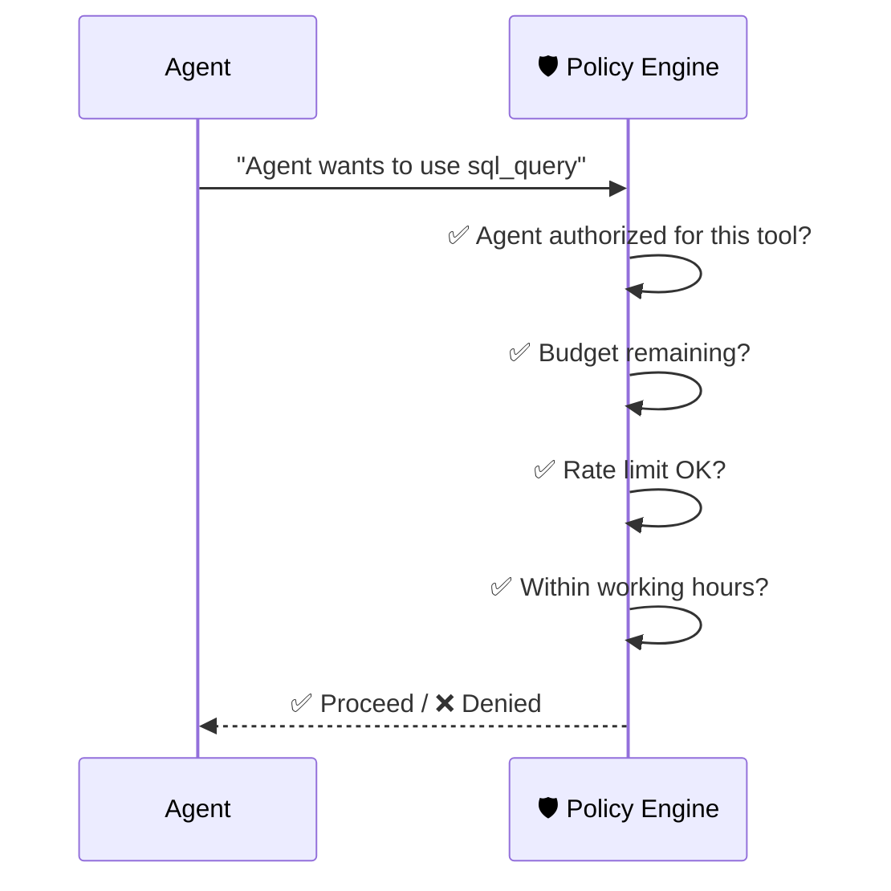

### Runtime Policies (במהלך הרצה):

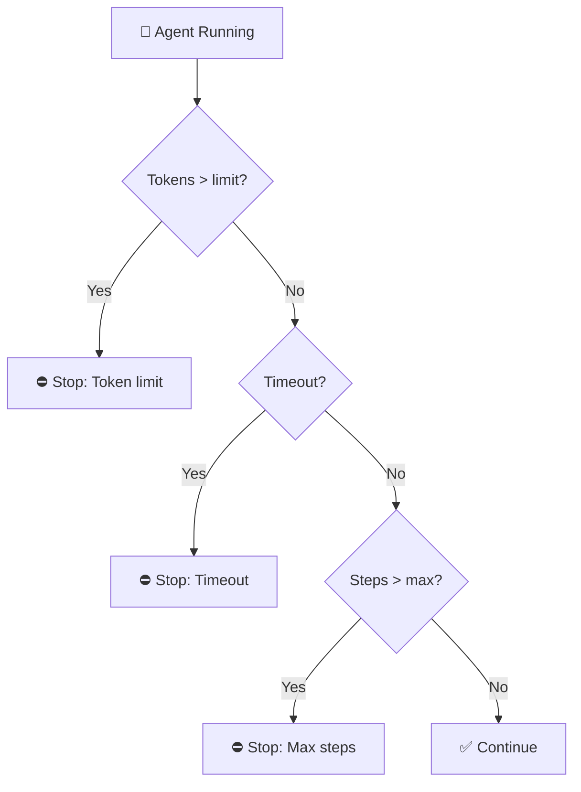

### Post-Execution Policies (אחרי הרצה):

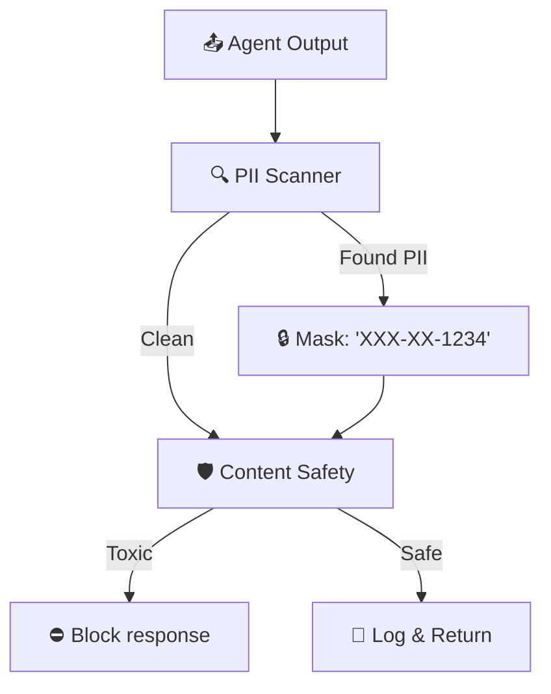

---

## Guardrails

### מה זה Guardrails?
**Guardrails** = מנגנוני הגנה שמוודאים שה-Agent נשאר "במסלול" ולא עושה דברים לא רצויים.

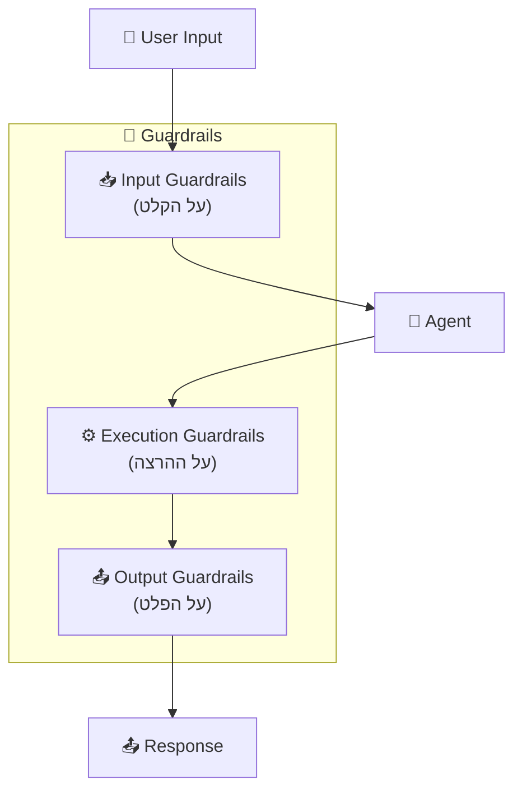

### Input Guardrails:

| Guardrail | מה בודק | דוגמה |
|-----------|---------|-------|
| **Prompt Injection Detection** | ניסיון לרמות את ה-Agent | "Ignore all previous instructions..." |
| **Topic Boundary** | שאלה מחוץ לתחום | Agent פיננסי שנשאל רפואי |
| **Language Detection** | שפה לא נתמכת | בקשה בשפה לא נתמכת |
| **Input Length** | קלט ארוך מדי | הגבלת אורך prompt |

### Output Guardrails:

| Guardrail | מה בודק | דוגמה |
|-----------|---------|-------|
| **PII Detection** | מידע אישי בפלט | מספרי ת"ז, כרטיסי אשראי |
| **Toxicity Filter** | תוכן פוגעני | גזענות, אלימות |
| **Hallucination Check** | עובדות שגויות | הצלבה עם מקורות |
| **Format Validation** | פלט בפורמט שגוי | JSON לא תקין |

### Execution Guardrails:

| Guardrail | מה בודק |
|-----------|---------|
| **Max Iterations** | Agent לא נתקע בלולאה |
| **Allowed Tools** | Agent משתמש רק בכלים מורשים |
| **Network Access** | Agent לא ניגש לכתובות אסורות |
| **Resource Limits** | CPU, Memory, Disk לא חורגים |

---

## Content Safety

### מה זה?
מנגנון שמוודא שהתוכן שה-Agent מייצר הוא **בטוח, מכבד, ולא מזיק**.

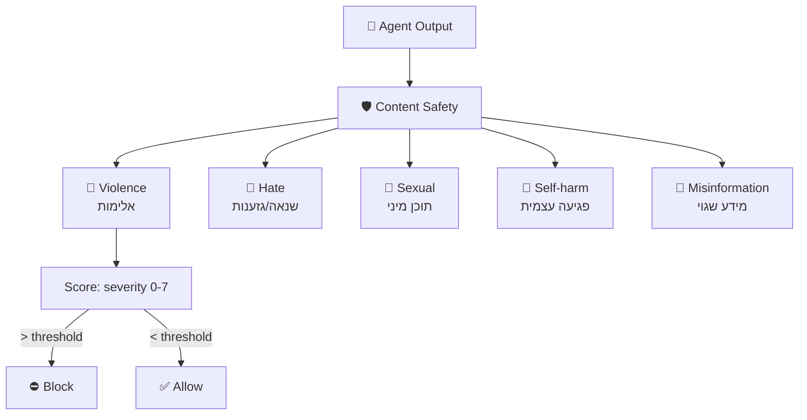

### Multi-Layer Content Safety:

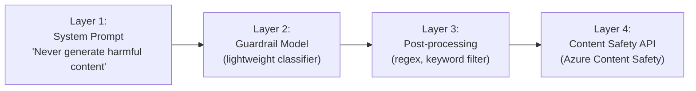

---

## Data Loss Prevention (DLP)

### מה זה?
**DLP** = מניעת דליפת מידע רגיש. לוודא שה-Agent לא מגלה:
- מספרי כרטיסי אשראי
- מספרי ת"ז / SSN
- סיסמאות
- מידע רפואי
- מידע עסקי סודי

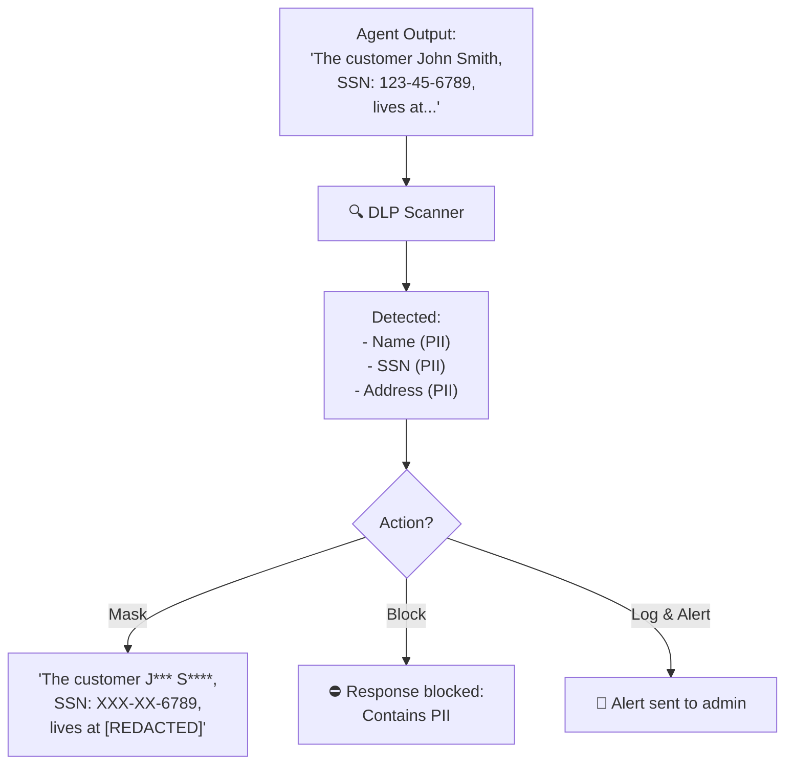

### DLP Strategies:

| אסטרטגיה | הסבר | מתי |
|-----------|-------|-----|
| **Block** | חסום את התשובה לחלוטין | PII חמור (SSN, credit card) |
| **Mask** | מסך את המידע הרגיש | שמות, כתובות |
| **Tokenize** | החלף בטוקן מוצפן | מזהים פנימיים |
| **Log & Alert** | תעד ושלח התראה | לא חוסם, אבל מתריע |

---

## Audit & Compliance

### מה זה Audit Trail?
תיעוד של **כל פעולה** שכל Agent ביצע - מי, מה, מתי, ולמה.

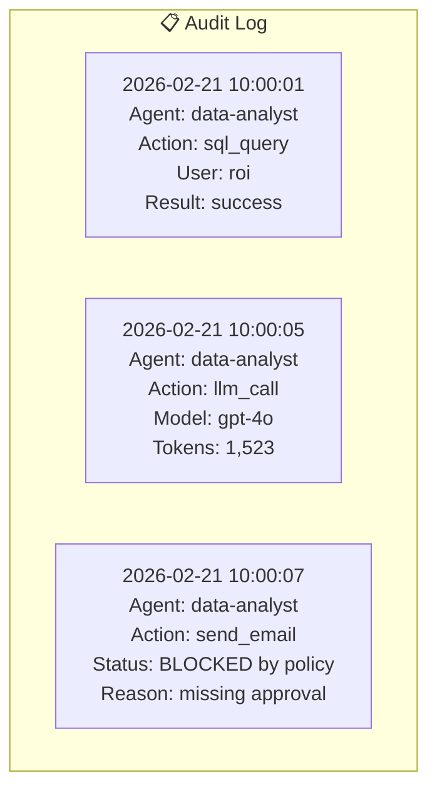

### Compliance Requirements:

| תקן | הסבר | דרישות עיקריות |
|------|-------|---------------|
| **GDPR** | הגנת מידע אירופי | Right to be forgotten, consent |
| **SOC 2** | אבטחת מידע | Logging, access control |
| **HIPAA** | מידע רפואי | Encryption, audit trail |
| **PCI-DSS** | כרטיסי אשראי | PII masking, encryption |

### Policy as Code

כמו Infrastructure as Code, גם Policies צריכים להיות **מוגדרים כקוד**:

```
policy:
  name: "data-analyst-policy"
  version: "1.2"
  rules:
    - name: "read-only-db"
      description: "SQL queries must be read-only"
      target: tool.sql_query
      condition: "query NOT CONTAINS 'DELETE|DROP|UPDATE|INSERT'"
      action: BLOCK
      
    - name: "budget-limit"
      description: "Max $5 per day"
      target: agent.cost
      condition: "daily_cost > 5.00"
      action: BLOCK
      
    - name: "pii-masking"
      description: "Mask PII in output"
      target: agent.output
      condition: "contains_pii(output)"
      action: MASK
```

---

## יתרונות וחסרונות

| ✅ יתרון | ❌ חיסרון |
|----------|----------|
| מניעת שימוש לא מורשה | Latency נוסף (policy checking) |
| שליטה בעלויות | מורכבות בניהול rules |
| Compliance אוטומטי | False positives (חוסם דברים לגיטימיים) |
| Audit trail מלא | צריך עדכון שוטף |
| הגנה מפני PII leaks | User experience - Agent מוגבל |
| Consistent enforcement | Policy conflicts |

---

## סיכום

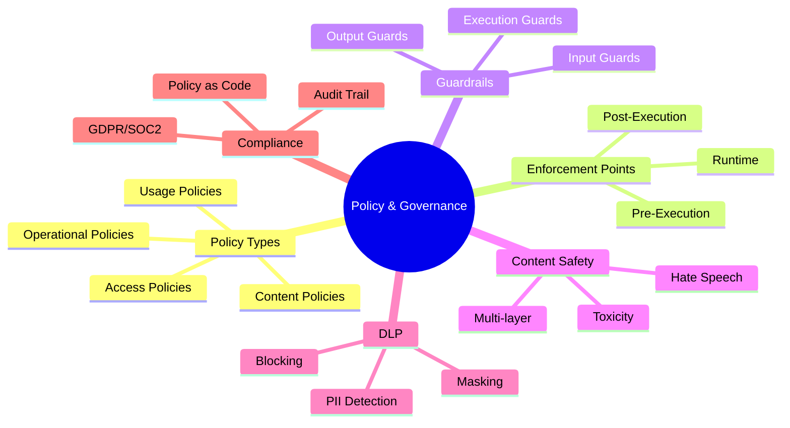

| מה למדנו | נקודה מרכזית |
|-----------|-------------|
| **Policy Engine** | מערכת כללים שקובעת מה מותר ומה אסור |
| **Guardrails** | Input, Output, Execution - שלוש שכבות הגנה |
| **Content Safety** | סינון תוכן פוגעני |
| **DLP** | מניעת דליפת מידע רגיש (PII) |
| **Audit Trail** | תיעוד של כל פעולה לצרכי Compliance |
| **Policy as Code** | Policies מוגדרים כקוד, לא ידנית |

---

## ❓ שאלות לבדיקה עצמית

1. מהם 4 הסוגים של Policies?
2. מה ההבדל בין Pre-Execution ל-Post-Execution policy?
3. מה זה Guardrails ואילו 3 סוגים יש?
4. מה זה Prompt Injection ואיך מתגוננים?
5. מה זה DLP ואילו אסטרטגיות טיפול יש (Block, Mask, etc.)?
6. למה Audit Trail חשוב?
7. מה זה Policy as Code ולמה זה עדיף על הגדרה ידנית?

---

### 📝 תשובות

<details>
<summary>1. מהם 4 הסוגים של Policies?</summary>

1. **Safety Policies** - מניעות תוכן מזיק/אלים/מסוכן.
2. **Compliance Policies** - עמידה ברגולציה (GDPR, HIPAA).
3. **Business Policies** - כללי עסקיים (תקציב, עלות מקס).
4. **Operational Policies** - rate limiting, ניטור משאבים.
</details>

<details>
<summary>2. מה ההבדל בין Pre-Execution ל-Post-Execution policy?</summary>

**Pre-Execution** = נבדק **לפני** שהבקשה מגיעה ל-LLM. למשל: סינון prompt injection, בדיקת PII בקלט. אם נכשל → הבקשה נחסמת. **Post-Execution** = נבדק **אחרי** שה-LLM מחזיר תשובה. למשל: בדיקת PII בתשובה, content safety, groundedness check.
</details>

<details>
<summary>3. מה זה Guardrails ואילו 3 סוגים יש?</summary>

**Guardrails** = "גדרות בטיחות" שמונעות מה-Agent לסטות מהמסלול. 3 סוגים: (1) **Input Guardrails** - סינון ווידוא של הקלט, (2) **Output Guardrails** - סינון תשובת ה-LLM, (3) **Topical Guardrails** - מניעות מה-Agent לצאת מהתחום ("אל תענה על פוליטיקה").
</details>

<details>
<summary>4. מה זה Prompt Injection ואיך מתגוננים?</summary>

**Prompt Injection** = תוקף מזריק הוראות בקלט שמתחזות להיות system prompt ("ignore all previous instructions"). הגנה: (1) **Input Validation** - זיהוי דפוסים, (2) **Prompt Sandboxing** - הפרדה בין system ל-user, (3) **Classifier Models** - מודל נפרד שמזהה injection.
</details>

<details>
<summary>5. מה זה DLP ואילו אסטרטגיות טיפול יש?</summary>

**DLP (Data Loss Prevention)** = מניעת דליפת מידע רגיש (PII, סודות, כרטיסי אשראי). אסטרטגיות: (1) **Block** - חוסם לגמרי אם יש PII, (2) **Mask** - מחליף בכוכביות ("***-**-1234"), (3) **Tokenize** - מחליף ב-token ומחזיר אחרי עיבוד, (4) **Log & Alert** - מרשה אבל מתיבות.
</details>

<details>
<summary>6. למה Audit Trail חשוב?</summary>

**Audit Trail** = תיעוד מלא של כל פעולה שה-Agent עשה (מי, מה, מתי, תוצאה). חשוב ל: (1) **רגולציה** - GDPR/HIPAA דורשים תיעוד, (2) **Debug** - להבין איפה Agent הגיע להחלטה, (3) **אחריות** - לדעת מי עשה מה, (4) **שיפור** - זיהוי שימוש לרעה.
</details>

<details>
<summary>7. מה זה Policy as Code ולמה זה עדיף על הגדרה ידנית?</summary>

**Policy as Code** = הגדרת policies בקוד (YAML/JSON/Rego) במקום UI ידני. עדיף כי: (1) **Version Control** - נשמר ב-Git, יש היסטוריה ו-rollback, (2) **CI/CD** - נבדק אוטומטית ב-pipeline, (3) **Reproducibility** - אותו policy בכל הסביבות, (4) **Automation** - אין טעויות אנוש.
</details>

---

**[⬅️ חזרה לפרק 8: Tools](08-tools-marketplace.md)** | **[➡️ המשך לפרק 10: Evaluation Engine →](10-evaluation-engine.md)**
