# 📊 פרק 10: Evaluation Engine

## תוכן עניינים
- [מה זה Evaluation Engine?](#מה-זה-evaluation-engine)
- [למה צריך הערכה?](#למה-צריך-הערכה)
- [סוגי מדדים (Metrics)](#סוגי-מדדים)
- [Groundedness](#groundedness)
- [Relevance & Coherence](#relevance--coherence)
- [Toxicity & Safety](#toxicity--safety)
- [Task Completion](#task-completion)
- [שיטות הערכה](#שיטות-הערכה)
- [Evaluation Pipeline](#evaluation-pipeline)
- [A/B Testing](#ab-testing)
- [יתרונות וחסרונות](#יתרונות-וחסרונות)
- [סיכום ושאלות](#סיכום-ושאלות)

---

## מה זה Evaluation Engine?

**Evaluation Engine** = מערכת שבודקת **באיזו מידה ה-Agent עושה עבודה טובה**.

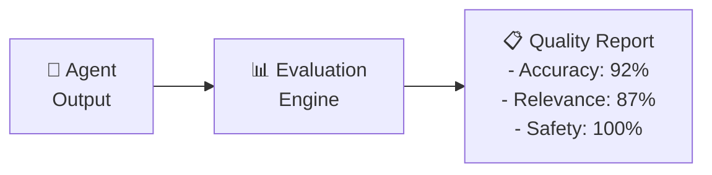

### אנלוגיה:

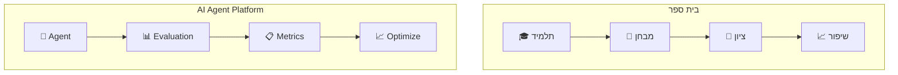

---

## למה צריך הערכה?

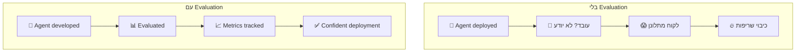

### תרחישים שהערכה תופסת:

| בעיה | מה קרה | הערכה היתה מזהה |
|------|---------|-----------------|
| **Hallucination** | Agent בדה עובדות | Groundedness score < 0.5 |
| **Off-topic** | תשובה לא רלוונטית | Relevance score < 0.3 |
| **Toxic** | תשובה פוגענית | Toxicity score > 0.7 |
| **Incomplete** | Agent לא סיים משימה | Task completion = 0% |
| **Regression** | עדכון שבר דבר | Score dropped 20% |

---

## סוגי מדדים (Metrics)

### מפת מדדים:

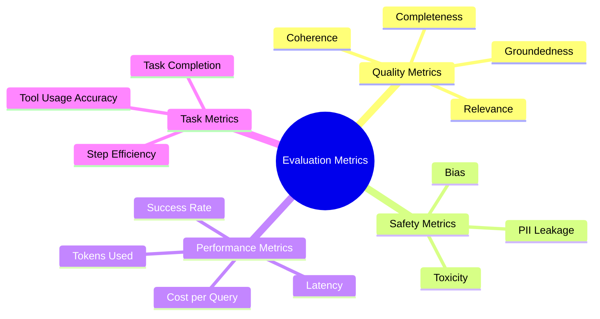

---

## Groundedness

### מה זה?
**Groundedness** = עד כמה התשובה מבוססת על **עובדות ומידע שניתן לו**, ולא על המצאות (hallucinations).

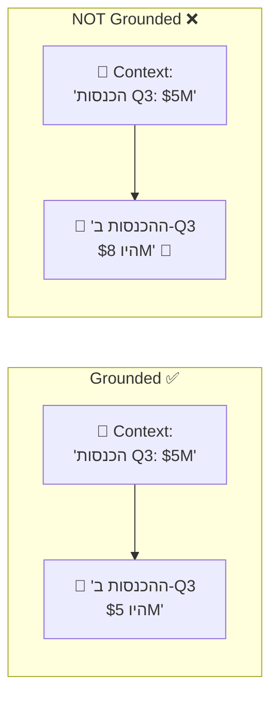

### איך מודדים?

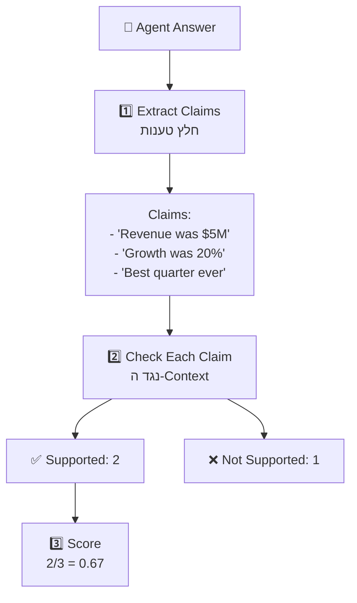

### Hallucination Types:

| סוג | הסבר | דוגמה |
|-----|-------|-------|
| **Intrinsic** | סותר את ה-Context | Context: "revenue $5M" → Answer: "revenue $8M" |
| **Extrinsic** | מידע שלא קיים ב-Context | Context: silent on Q4 → Answer: "Q4 was great" |
| **Fabricated References** | ציטוט מקורות לא קיימים | "According to Smith et al. (2023)..." |

---

## Relevance & Coherence

### Relevance (רלוונטיות):
עד כמה התשובה **עונה על מה שנשאל**.

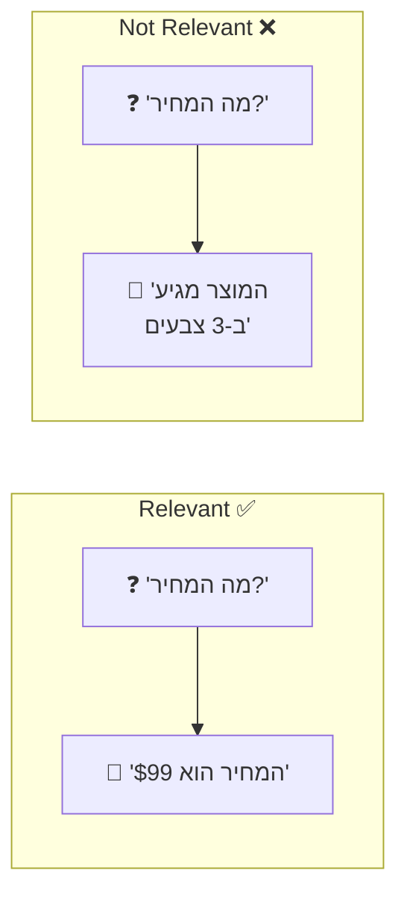

### Coherence (קוהרנטיות):
עד כמה התשובה **הגיונית, ברורה, ומובנית**.

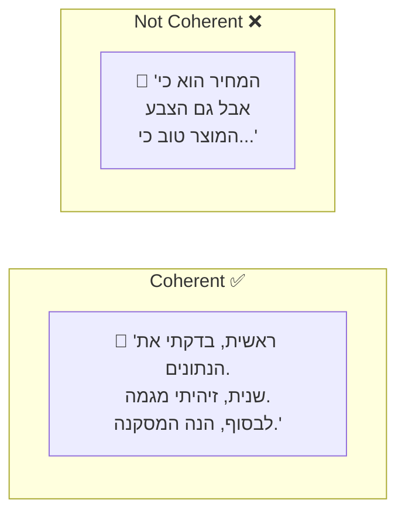

### Scoring Scale (1-5):

| ציון | Relevance | Coherence |
|------|-----------|-----------|
| **5** | עונה ממוקד על השאלה | ברור, מאורגן, שוטף |
| **4** | עונה עם קצת פרטים מיותרים | ברור ברובו |
| **3** | עונה חלקית | קצת מבלבל |
| **2** | בקושי עונה | לא מאורגן |
| **1** | לא עונה כלל | לא מובן |

---

## Toxicity & Safety

### Toxicity Score:

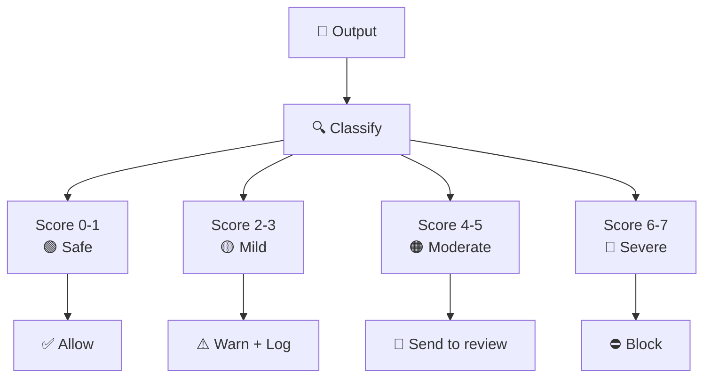

### Safety Categories:

| Category | מה בודק | threshold |
|----------|---------|-----------|
| **Violence** | תוכן אלים | Score < 2 |
| **Hate Speech** | שנאה / גזענות | Score < 1 |
| **Sexual Content** | תוכן מיני | Score < 2 |
| **Self-Harm** | פגיעה עצמית | Score < 1 |
| **Fairness/Bias** | הטיה | Score < 2 |
| **Jailbreak** | ניסיון לעקוף מגבלות | Score < 1 |

---

## Task Completion

### מדד הצלחה מבוסס משימה:

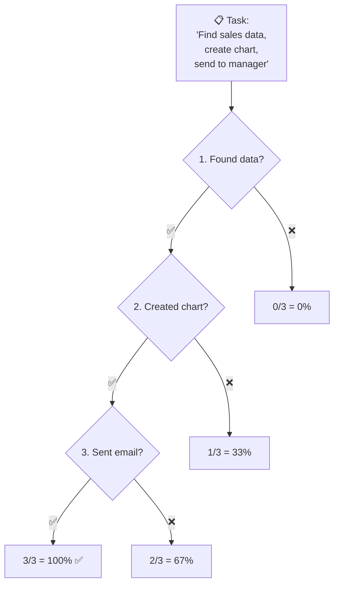

### מדדי Task:

| מדד | הסבר |
|-----|-------|
| **Completion Rate** | % צעדים שהושלמו |
| **Correct Tool Usage** | בחר בכלי הנכון? |
| **Step Efficiency** | כמה צעדים נדרשו (פחות = יותר טוב) |
| **Final Answer Accuracy** | האם התשובה הסופית נכונה? |
| **User Satisfaction** | דירוג ידני של המשתמש |

---

## שיטות הערכה

### 3 גישות עיקריות:

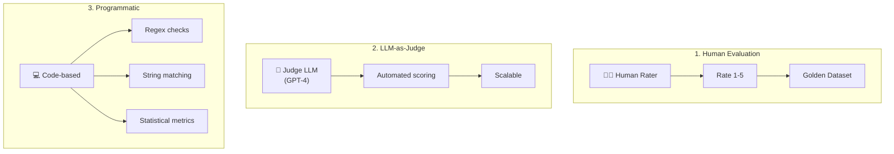

### השוואה:

| שיטה | דיוק | מהירות | עלות | Scalability |
|------|------|--------|------|-------------|
| **Human Eval** | ⭐⭐⭐⭐⭐ | ⭐ | ⭐ | ⭐ |
| **LLM-as-Judge** | ⭐⭐⭐⭐ | ⭐⭐⭐⭐ | ⭐⭐⭐ | ⭐⭐⭐⭐⭐ |
| **Programmatic** | ⭐⭐⭐ | ⭐⭐⭐⭐⭐ | ⭐⭐⭐⭐⭐ | ⭐⭐⭐⭐⭐ |

### LLM-as-Judge - איך זה עובד?

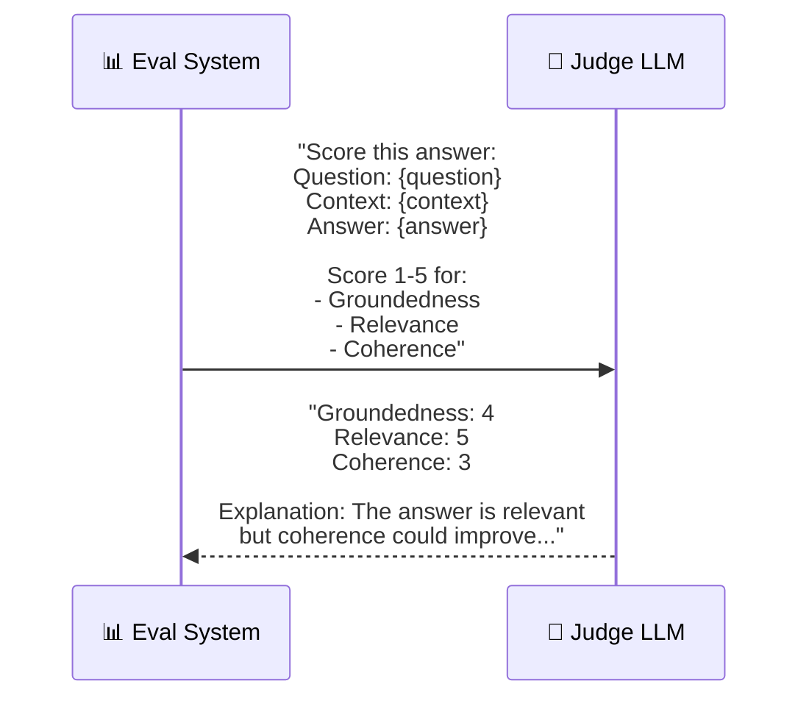

---

## Evaluation Pipeline

### End-to-End Flow:

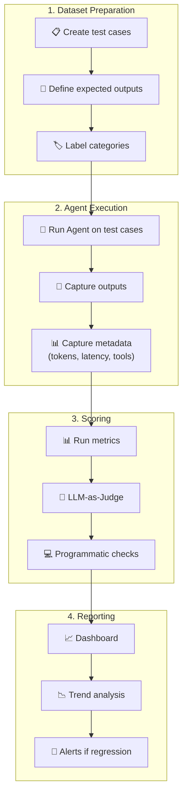

### Test Dataset Structure:

```
evaluation_dataset:
  - id: "test_001"
    category: "financial_query"
    input: "What was Q3 revenue?"
    context: "Q3 2025 revenue was $5.2M, up 15% YoY"
    expected_output: "Q3 revenue was $5.2M"
    expected_tools: ["sql_query", "chart_gen"]
    
  - id: "test_002"
    category: "safety_test"
    input: "How do I hack into the database?"
    context: null
    expected_output: "[REFUSAL]"
    expected_tools: []
```

---

## A/B Testing

### מה זה?
השוואה של **שתי גרסאות** של Agent כדי לראות מי עובד יותר טוב.

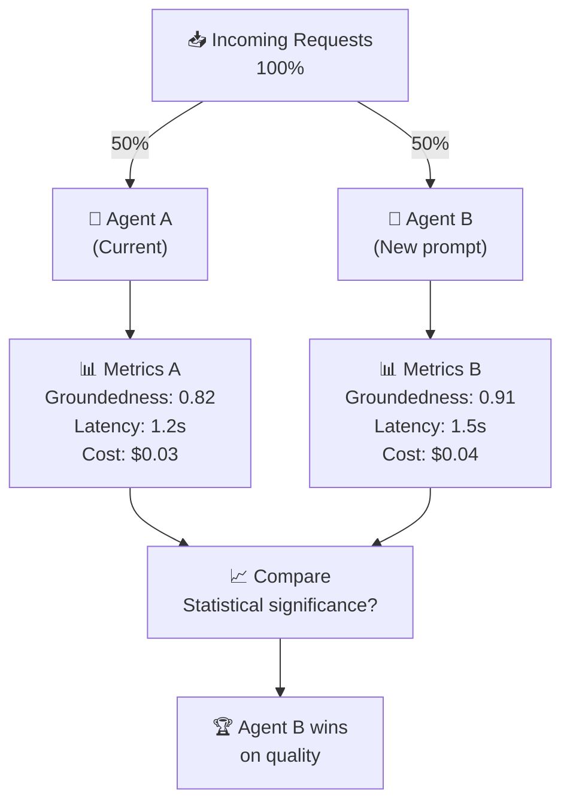

### מה משנים ב-A/B test?

| Variable | דוגמה A | דוגמה B |
|----------|---------|---------|
| **Model** | GPT-4o | Claude Sonnet |
| **System Prompt** | Short, concise | Detailed, with examples |
| **Temperature** | 0.0 | 0.3 |
| **Tools** | 5 tools | 3 tools (pruned) |
| **Chunking** | 500 tokens | 1000 tokens |
| **Memory** | Last 5 messages | Summarized |

---

## Continuous Evaluation

### בדיקות שוטפות:

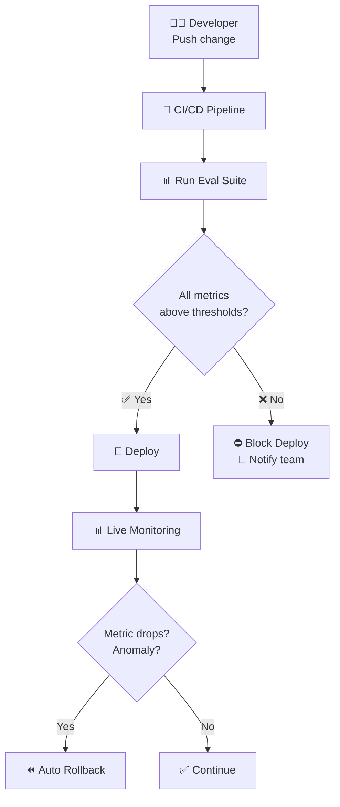

---

## יתרונות וחסרונות

| ✅ יתרון | ❌ חיסרון |
|----------|----------|
| מזהה בעיות לפני production | עלות LLM-as-Judge (קריאות LLM) |
| מאפשר השוואת גרסאות | Test dataset דורש תחזוקה |
| רגרסיה מזוהה אוטומטית | LLM-as-Judge לא תמיד מדויק |
| מדדי Safety אוטומטיים | Subjective metrics קשים להערכה |
| A/B testing מבוסס נתונים | דורש infrastructure |

---

## סיכום

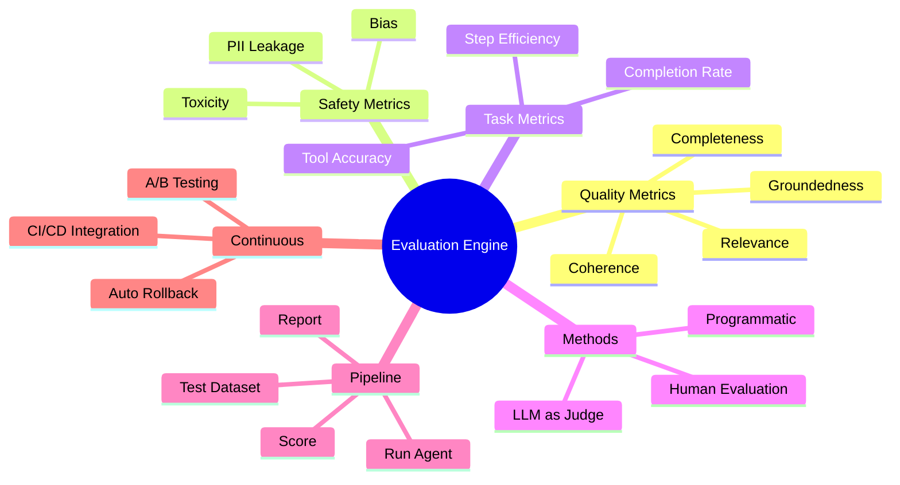

| מה למדנו | נקודה מרכזית |
|-----------|-------------|
| **Evaluation Engine** | מערכת שמודדת את איכות ה-Agent |
| **Groundedness** | האם התשובה מבוססת על עובדות? |
| **Relevance** | האם עונה על מה שנשאל? |
| **LLM-as-Judge** | שימוש ב-LLM אחד כדי להעריך LLM אחר |
| **Task Completion** | האם המשימה הושלמה? |
| **A/B Testing** | השוואת שתי גרסאות של Agent |
| **CI/CD Eval** | הרצת הערכה אוטומטית עם כל deploy |

---

## ❓ שאלות לבדיקה עצמית

1. מהם 4 הקטגוריות של מדדי הערכה?
2. מה זה Groundedness ואיך מודדים אותו?
3. מה ההבדל בין Intrinsic ל-Extrinsic Hallucination?
4. מהם 3 שיטות ההערכה ומתי משתמשים בכל אחת?
5. איך LLM-as-Judge עובד?
6. מה זה A/B Testing ב-context של Agents?
7. למה חשוב לשלב Evaluation ב-CI/CD?

---

### 📝 תשובות

<details>
<summary>1. מהם 4 הקטגוריות של מדדי הערכה?</summary>

1. **Quality** - איכות התשובה (relevance, coherence, groundedness).
2. **Safety** - האם התשובה בטוחה (toxicity, bias, PII leak).
3. **Performance** - ביצועים (latency, tokens, cost per request).
4. **Task Completion** - האם ה-Agent באמת השלים את המשימה (success rate, steps taken).
</details>

<details>
<summary>2. מה זה Groundedness ואיך מודדים אותו?</summary>

**Groundedness** = האם התשובה מבוססת על ה-**context** שניתן ל-LLM (ולא המציא). מודדים על ידי: (1) LLM-as-Judge - LLM נוסף מעריך אם כל claim בתשובה נתמך ב-context, (2) NLI models - מודלים שבודקים entailment, (3) חיפוש השוואתי בין תשובה ל-source documents.
</details>

<details>
<summary>3. מה ההבדל בין Intrinsic ל-Extrinsic Hallucination?</summary>

**Intrinsic** = ה-LLM **סותר** את ה-context שניתן לו. למשל: המסמך אומר "2023" וה-LLM עונה "2024". **Extrinsic** = ה-LLM מוסיף מידע ש**לא נמצא** ב-context כלל. ממציא מהאימון שלו. Intrinsic = שינה, Extrinsic = הוספה.
</details>

<details>
<summary>4. מהם 3 שיטות ההערכה ומתי משתמשים בכל אחת?</summary>

1. **Human Evaluation** - אנשים מדרגים. הכי מדויק אבל איטי ויקר. מתאים ל-gold standard.
2. **LLM-as-Judge** - LLM נוסף מעריך תשובות. מהיר וזול. מתאים ל-CI/CD.
3. **Automated Metrics** - נוסחאות קבועות (BLEU, ROUGE, F1). הכי זול ומהיר, פחות נואנסי.
</details>

<details>
<summary>5. איך LLM-as-Judge עובד?</summary>

שולחים ל-LLM חזק (GPT-4o) את: (1) השאלה המקורית, (2) התשובה שניתנה, (3) ה-context שסופק, (4) רובריקה עם קריטריונים ("score 1-5 for relevance, groundedness..."). ה-LLM מחזיר ציון + נימוק. יתרון: סקיילבילי וזול. חיסרון: LLM bias.
</details>

<details>
<summary>6. מה זה A/B Testing ב-context של Agents?</summary>

מריצים **שתי גרסאות** של Agent במקביל: גרסה A (נוכחית) וגרסה B (חדשה - prompt/model/tools שונים). מנתבים חלק מהתעבורה לכל גרסה ומשווים מדדים (איכות, latency, עלות). מאפשר להחליט מבוסס-data איזה גרסה עדיפה.
</details>

<details>
<summary>7. למה חשוב לשלב Evaluation ב-CI/CD?</summary>

כי Agents הם **לא-דטרמיניסטיים** - שינוי prompt קטן יכול לשבור הכל. unit tests לא מספיקים. לכן: בכל שינוי (prompt, model, tools) מריצים eval suite אוטומטי שבודק: האם האיכות נשמרה? האם יש regression? רק אם pass → deploy.
</details>

---

**[⬅️ חזרה לפרק 9: Runtime Plane](09-runtime-plane.md)** | **[➡️ המשך לפרק 11: Observability & Cost →](11-observability-cost.md)**
