# 📈 פרק 13: Scalability & High Availability

## תוכן עניינים
- [מה זה Scalability?](#מה-זה-scalability)
- [Horizontal vs Vertical Scaling](#horizontal-vs-vertical-scaling)
- [Stateless vs Stateful Scaling](#stateless-vs-stateful-scaling)
- [Agent Scaling Challenges](#agent-scaling-challenges)
- [Load Balancing](#load-balancing)
- [Queue-Based Architecture](#queue-based-architecture)
- [Auto-Scaling](#auto-scaling)
- [High Availability (HA)](#high-availability-ha)
- [Multi-Region](#multi-region)
- [Caching Strategies](#caching-strategies)
- [Partitioning & Sharding](#partitioning--sharding)
- [יתרונות וחסרונות](#יתרונות-וחסרונות)
- [סיכום ושאלות](#סיכום-ושאלות)

---

## מה זה Scalability?

**Scalability** = היכולת של מערכת **לגדול** כדי לטפל ביותר עומס, בלי לאבד ביצועים.

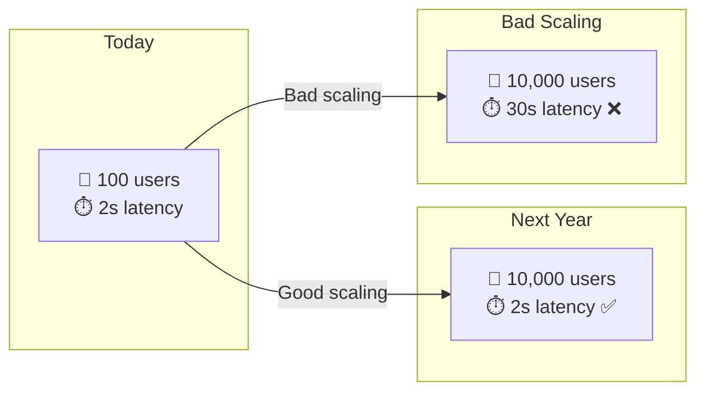

---

## Horizontal vs Vertical Scaling

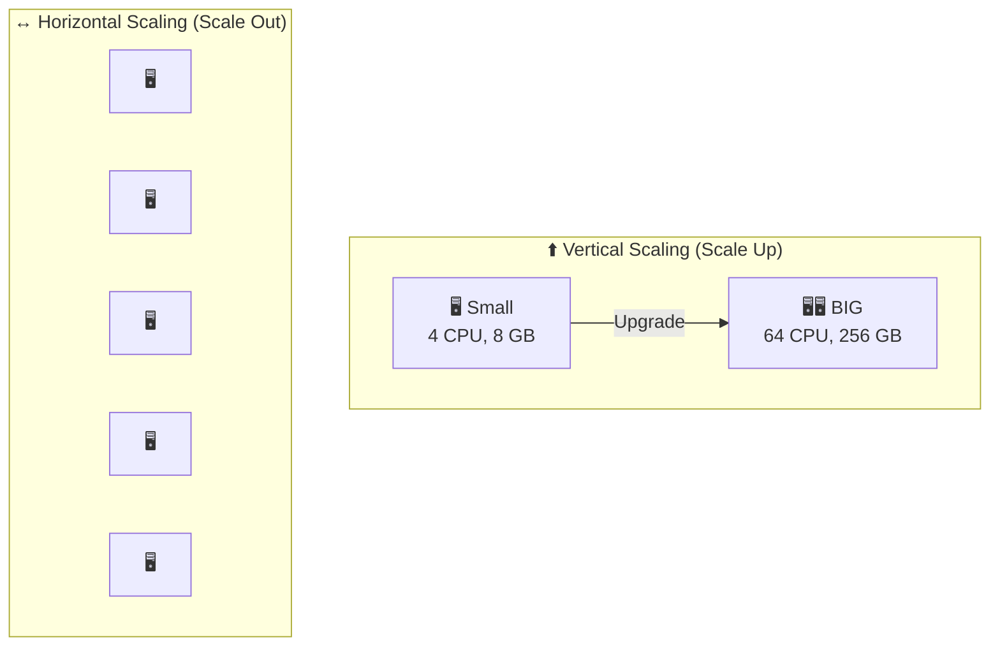

### השוואה:

| | Vertical (Scale Up) | Horizontal (Scale Out) |
|---|---|---|
| **מה עושים** | מגדילים שרת קיים | מוסיפים עוד שרתים |
| **מגבלה** | יש תקרה (max hardware) | אין תקרה (כמעט) |
| **עלות** | יקר מאוד בהתחלה | זול per unit |
| **Downtime** | דורש restart | Zero downtime |
| **Complexity** | פשוט | מורכב (state, sync) |
| **Agents** | ❌ לא מומלץ | ✅ מומלץ |

---

## Stateless vs Stateful Scaling

### למה זה חשוב ל-Agents?
Agents שומרים **state** (שיחה, זיכרון, Thread). זה מקשה על scaling.

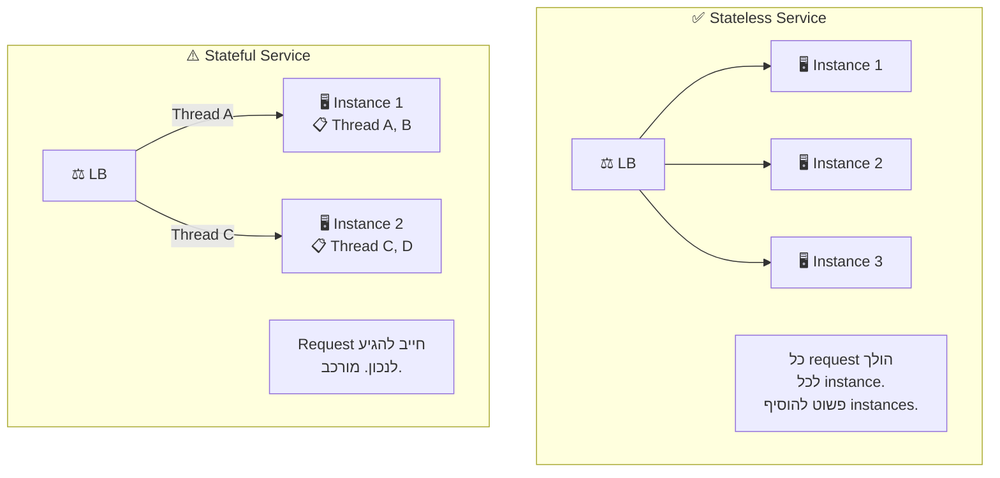

### פתרון: Externalize State

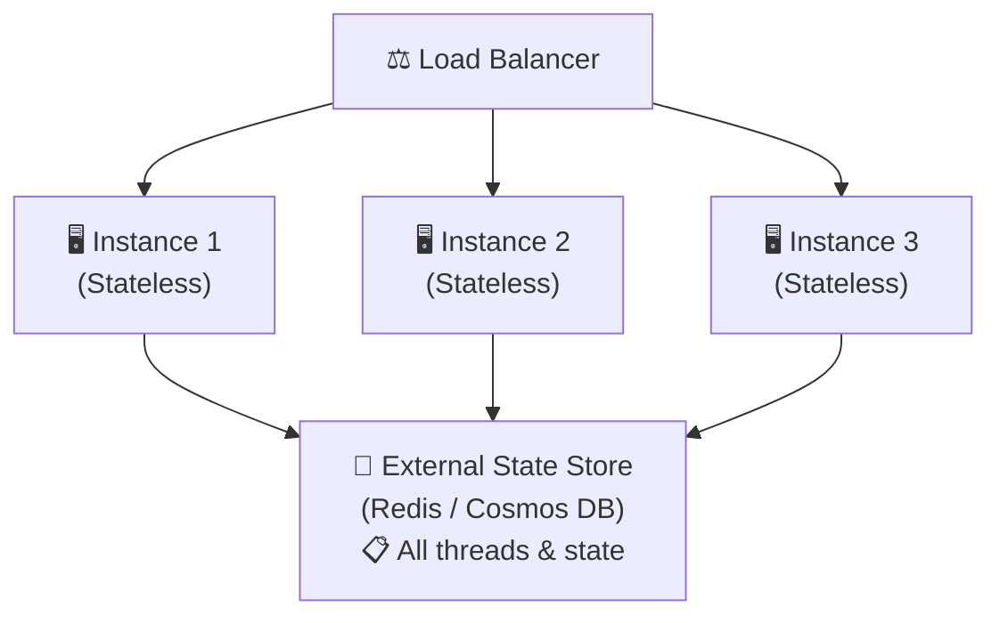

| Strategy | הסבר | Pros | Cons |
|----------|-------|------|------|
| **Externalize State** | שמור state ב-DB חיצוני | פשוט ל-scale | Latency to DB |
| **Sticky Sessions** | Route user לאותו instance | State local | Instance failure = lost state |
| **Event Sourcing** | שמור events, rebuild state | Reliable, audit | Complex |

---

## Agent Scaling Challenges

### למה Agents קשים ל-Scale?

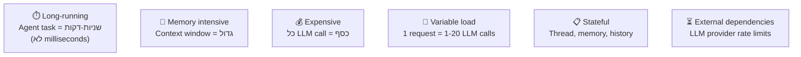

### Resource per Agent Request:

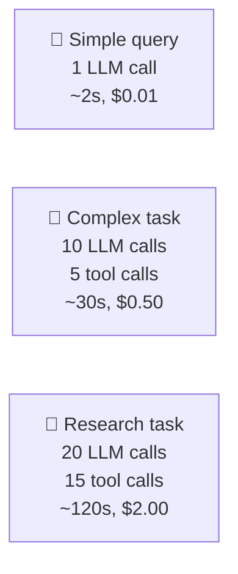

---

## Load Balancing

### Load Balancing Strategies:

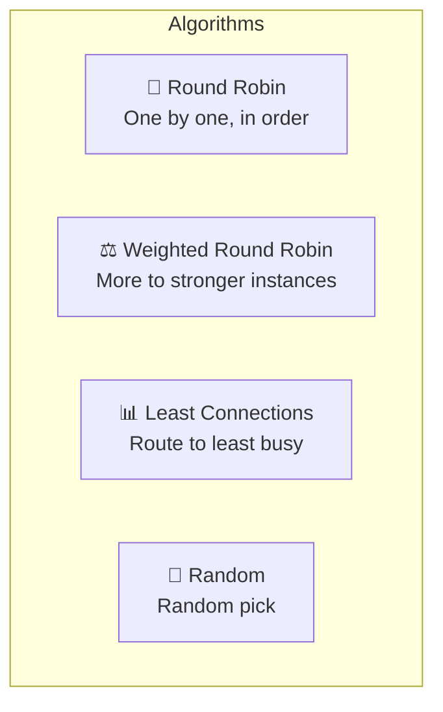

### Agent-Aware Load Balancing:

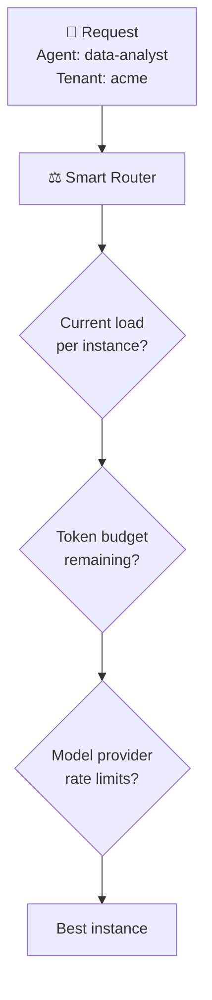

---

## Queue-Based Architecture

### למה Queues?
Agent requests הם **ארוכים** ו**כבדים**. Queue מאפשר:
- **Decoupling** - הפרדה בין מי ששולח למי שמעבד
- **Smoothing** - יישור spike-ים בעומס
- **Retry** - ניסיון חוזר אוטומטי
- **Priority** - טיפול לפי עדיפות

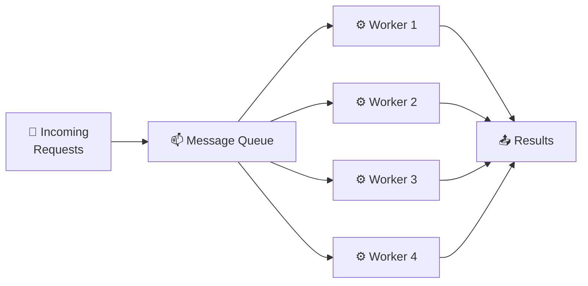

### Priority Queues:

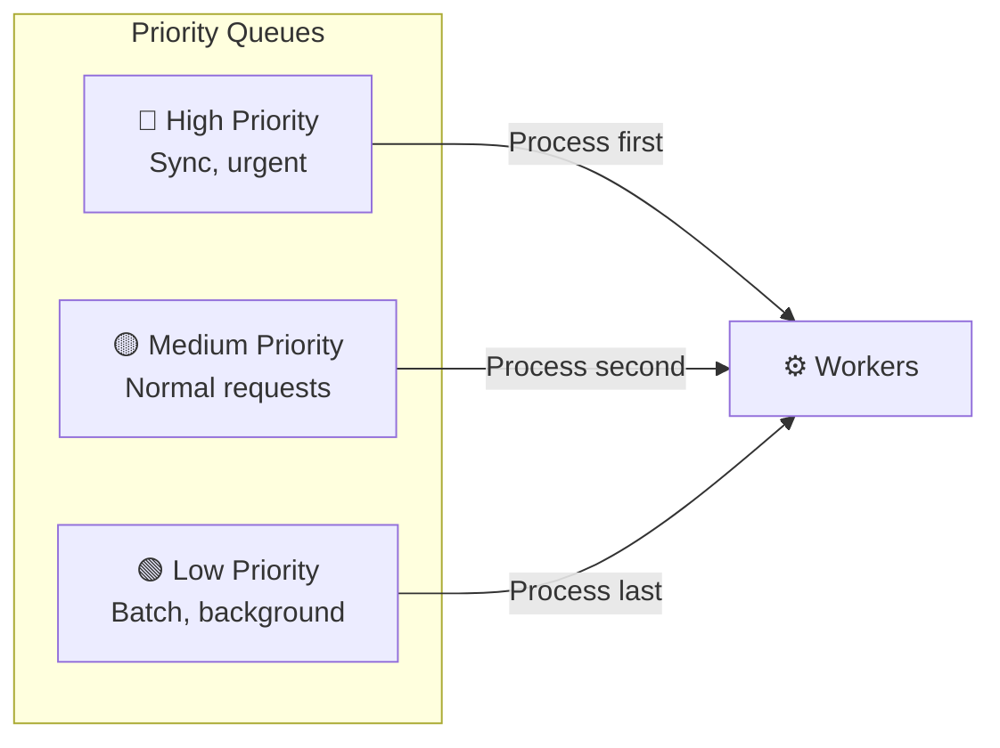

### Async Agent Execution:

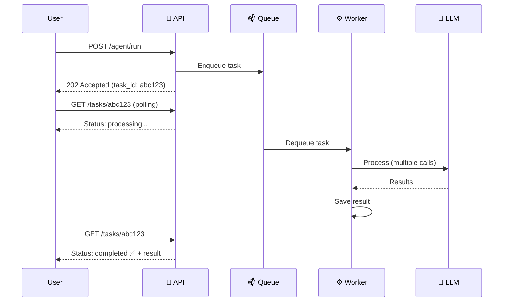

---

## Auto-Scaling

### מה זה?
**Auto-scaling** = המערכת **מוסיפה/מורידה** instances אוטומטית בהתאם לעומס.

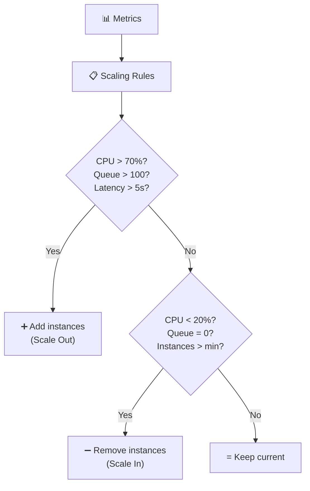

### Scaling Metrics for Agents:

| Metric | Scale Out When | Scale In When |
|--------|---------------|---------------|
| **CPU** | > 70% for 5 min | < 20% for 10 min |
| **Queue Depth** | > 50 pending tasks | Queue = 0 for 10 min |
| **Active Agents** | > 80% capacity | < 20% capacity |
| **Latency P99** | > 10s | < 2s consistently |
| **Concurrent requests** | > threshold | < min threshold |

### KEDA (Kubernetes Event-Driven Autoscaler):

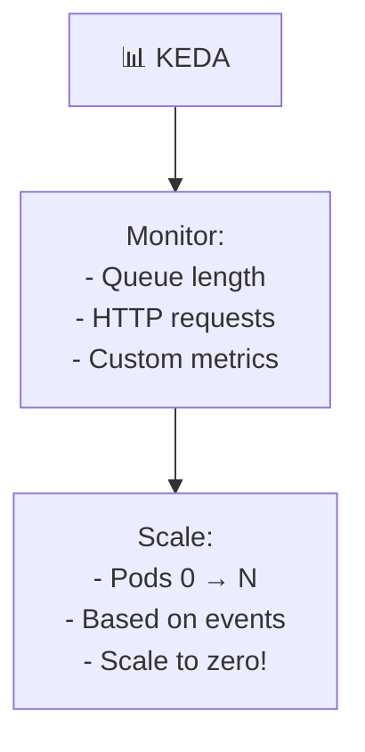

---

## High Availability (HA)

### מה זה?
**HA** = המערכת **ממשיכה לעבוד** גם כשחלקים ממנה נופלים.

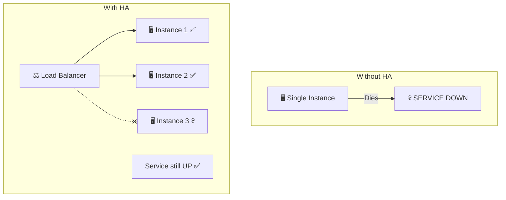

### HA Patterns:

| Pattern | הסבר |
|---------|-------|
| **Redundancy** | Multiple instances of everything |
| **Health Checks** | Automatic detection of failures |
| **Failover** | Automatic switch to backup |
| **Circuit Breaker** | Stop calling failed services |
| **Retry with Backoff** | Retry with increasing delays |
| **Graceful Degradation** | Reduce features rather than fail |

### Circuit Breaker:

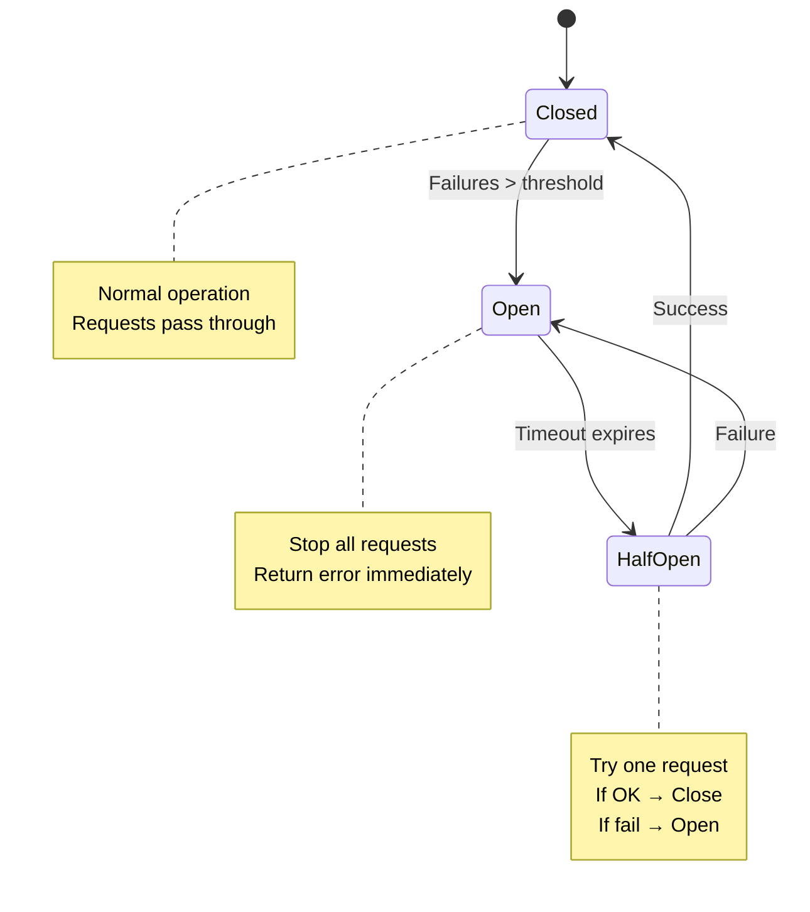

---

## Multi-Region

### למה Multi-Region?

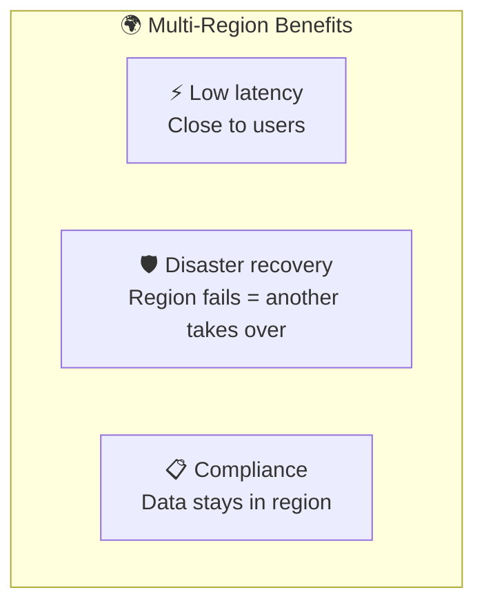

### Active-Active vs Active-Passive:

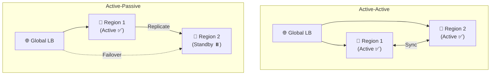

| | Active-Active | Active-Passive |
|---|---|---|
| **Latency** | ✅ Low (close to user) | ⚠️ One region only |
| **Capacity** | ✅ 2x capacity | ⚠️ Wasted standby |
| **Failover** | ✅ Instant | ⚠️ Minutes |
| **Complexity** | ❌ Data sync complex | ✅ Simpler |
| **Cost** | ❌ 2x cost | ✅ Lower |

---

## Caching Strategies

### מה מכניסים ל-Cache ב-Agent Platform?

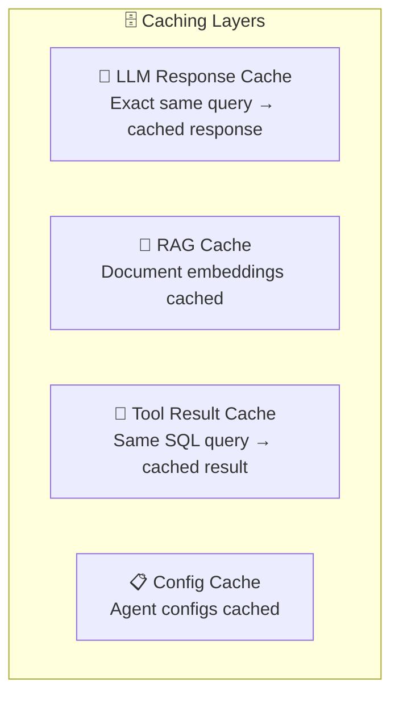

### Semantic Cache:

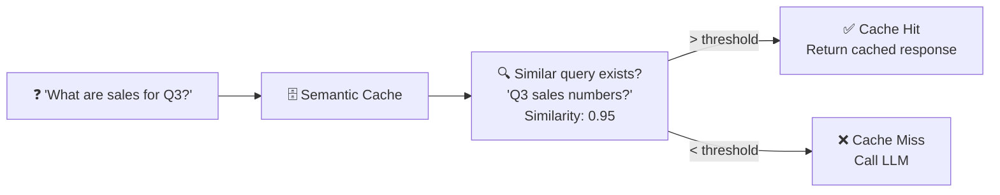

| Cache Type | Hit Rate | Savings |
|------------|----------|---------|
| **Exact Match** | Low (5-10%) | Tokens + latency |
| **Semantic Cache** | Medium (20-40%) | Tokens + latency |
| **RAG Embedding Cache** | High (80%+) | Embedding compute |
| **Tool Result Cache** | Variable | Tool execution time |

---

## Partitioning & Sharding

### Tenant-Based Partitioning:

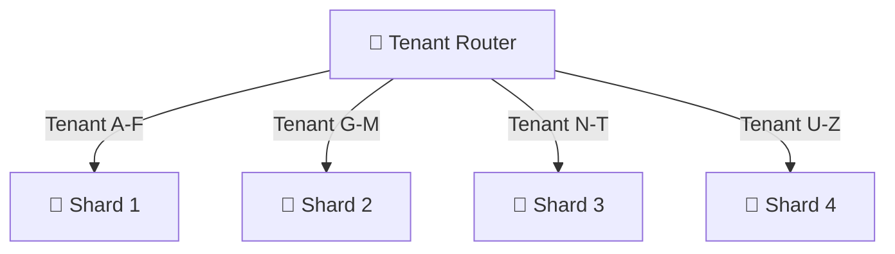

### Partitioning Strategies:

| Strategy | הסבר | For Agents |
|----------|-------|-----------|
| **By Tenant** | כל tenant ב-partition אחר | ✅ Common, good isolation |
| **By Agent Type** | כל סוג agent ב-partition אחר | ⚠️ Some types may be hot |
| **By Region** | לפי region גאוגרפי | ✅ Compliance + latency |
| **By Time** | לפי תאריך (logs, history) | ✅ For time-series data |

---

## יתרונות וחסרונות

| ✅ יתרון | ❌ חיסרון |
|----------|----------|
| Handle growing traffic | Added complexity |
| Cost efficiency (scale to zero) | State management challenges |
| High availability | Data consistency challenges |
| Low latency (multi-region) | Network costs |
| Fault tolerance | Debugging harder |

---

## סיכום

```mermaid
mindmap
  root((Scalability & HA))
    Scaling Types
      Horizontal ✅
      Vertical ❌
    State Management
      Externalize state
      Stateless services
      Event sourcing
    Load Balancing
      Round Robin
      Least Connections
      Agent-aware
    Queues
      Async processing
      Priority queues
      Spike smoothing
    Auto-Scaling
      Metrics-based
      KEDA
      Scale to zero
    High Availability
      Redundancy
      Circuit Breaker
      Failover
    Multi-Region
      Active-Active
      Active-Passive
      Data sovereignty
    Caching
      LLM cache
      Semantic cache
      Tool cache
    Partitioning
      By Tenant
      By Region
      By Time
```

| מה למדנו | נקודה מרכזית |
|-----------|-------------|
| **Horizontal Scaling** | מוסיפים עוד instances (לא שרת יותר חזק) |
| **Stateless** | הוצאת State החוצה מאפשרת scaling קל |
| **Queue-Based** | Queue מפריד בין שולח לעובד, מאפשר async |
| **Auto-Scaling** | המערכת גדלה וקטנה אוטומטית לפי עומס |
| **HA** | Redundancy + failover = שירות תמיד זמין |
| **Multi-Region** | Latency נמוך + DR + Compliance |
| **Caching** | Semantic Cache חוסך tokens וכסף |
| **Partitioning** | חלוקה per tenant לביצועים ואיזולציה |

---

## ❓ שאלות לבדיקה עצמית

1. מה ההבדל בין Horizontal ל-Vertical scaling?
2. למה Agents קשים ל-scale (5 סיבות)?
3. מה זה Externalize State ולמה זה חשוב?
4. מה היתרון של Queue-Based Architecture?
5. מה זה Auto-Scaling ואילו metrics משתמשים?
6. מה ההבדל בין Active-Active ל-Active-Passive?
7. מה זה Semantic Cache ואיך זה עוזר?
8. מה ה-tradeoff של Circuit Breaker?

---

### 📝 תשובות

<details>
<summary>1. מה ההבדל בין Horizontal ל-Vertical scaling?</summary>

**Vertical (Scale Up)** = להגדיל את המכונה הקיימת (יותר CPU, RAM). פשוט אבל יש תקרה. **Horizontal (Scale Out)** = להוסיף עוד מכונות (עוד instances). ללא תקרה תיאורטית, אבל דורש התמודדות עם state ו-load balancing.
</details>

<details>
<summary>2. למה Agents קשים ל-scale (5 סיבות)?</summary>

1. **Stateful** - כל agent מחזיק state (thread, memory).
2. **Long-Running** - בקשות נמשכות שניות (לולאות ארוכות).
3. **Unpredictable Cost** - כל בקשה צורכת מספר tokens שונה.
4. **External Dependencies** - LLM APIs עם rate limits ו-latency משתנה.
5. **Fan-Out** - agent אחד יכול להפעיל מספר כלים/sub-agents במקביל.
</details>

<details>
<summary>3. מה זה Externalize State ולמה זה חשוב?</summary>

**Externalize State** = הוצאת ה-state מה-instance ל-DB חיצוני (Redis, Cosmos DB). חשוב כי: אם ה-state בתוך ה-instance, אי אפשר לעשות scale out (בקשה חייבת להגיע לאותו instance). עם state חיצוני: כל instance הוא stateless → כל instance יכול לטפל בכל בקשה.
</details>

<details>
<summary>4. מה היתרון של Queue-Based Architecture?</summary>

במקום שהבקשות הולכות ישירות ל-Agent, הן נכנסות **לתור** (queue). יתרונות: (1) **החלקת עומס** - spike לא מפיל את המערכת, (2) **Decoupling** - producer ו-consumer עצמאיים, (3) **Retry** - הודעה שנכשלה חוזרת לתור, (4) **Scale** - מוסיפים consumers לפי עומק התור.
</details>

<details>
<summary>5. מה זה Auto-Scaling ואילו metrics משתמשים?</summary>

**Auto-Scaling** = המערכת מוסיפה/מורידה instances אוטומטית. Metrics: (1) **Queue depth** - כמה הודעות מחכות בתור, (2) **Active requests** - כמה בקשות בעיבוד, (3) **CPU/Memory** - ניצולת משאבים, (4) **Latency** - זמן תגובה. ב-Agents: queue depth הוא לרוב ה-metric הטוב ביותר.
</details>

<details>
<summary>6. מה ההבדל בין Active-Active ל-Active-Passive?</summary>

**Active-Active** = שני regions פעילים במקביל, תעבורה מתחלקת. RTO ≈ 0, אבל צריך data sync מורכב, יקר יותר. **Active-Passive** = region אחד פעיל, השני בהמתנה (standby). כשהראשון נופל → failover לשני. RTO > 0 (יש השבתה), אבל זול יותר.
</details>

<details>
<summary>7. מה זה Semantic Cache ואיך זה עוזר?</summary>

**Semantic Cache** = שמירת תשובות LLM והחזרתן לשאלות **דומות משמעותית** (לא זהות). עוזר ל-**scalability** ב: (1) חוסך LLM calls → פחות עומס על APIs, (2) חוסך tokens → חוסך עלות, (3) latency נמוך יותר על cache hit (מילישניות במקום שניות).
</details>

<details>
<summary>8. מה ה-tradeoff של Circuit Breaker?</summary>

**יתרון**: מגן מפני cascading failure - כששירות לא זמין, לא שולחים עוד בקשות שייכשלו → חוסכים משאבים. **חיסרון**: בקשות לגיטימיות נדחות בזמן שה-CB פתוח - אי אפשר לטפל בהן. צריך לכוון נכון את ה-thresholds וה-timeout period.
</details>

---

**[⬅️ חזרה לפרק 12: Security](12-security-isolation.md)** | **[➡️ המשך לפרק 14: HLD Architecture →](14-hld-architecture.md)**
