# ☁️ פרק 15: Microsoft / Azure Stack

## תוכן עניינים
- [מיפוי HLD ל-Azure](#מיפוי-hld-ל-azure)
- [Azure Full Architecture](#azure-full-architecture)
- [Azure OpenAI Service](#azure-openai-service)
- [Azure AI Search](#azure-ai-search)
- [Azure Cosmos DB](#azure-cosmos-db)
- [Azure Container Apps / AKS](#azure-container-apps--aks)
- [Azure API Management (APIM)](#azure-api-management-apim)
- [Microsoft Entra ID](#microsoft-entra-id)
- [Azure Key Vault](#azure-key-vault)
- [Azure Service Bus](#azure-service-bus)
- [Azure Monitor & App Insights](#azure-monitor--app-insights)
- [Azure Content Safety](#azure-content-safety)
- [Azure AI Foundry](#azure-ai-foundry)
- [Semantic Kernel](#semantic-kernel)
- [יתרונות וחסרונות של Azure Stack](#יתרונות-וחסרונות-של-azure-stack)
- [סיכום ושאלות](#סיכום-ושאלות)

---

## מיפוי HLD ל-Azure

### כל רכיב גנרי → מוצר Azure ספציפי:

| HLD Component (Generic) | Azure Product | למה? |
|-------------------------|---------------|-------|
| **API Gateway** | Azure API Management (APIM) | Rate limiting, Auth, Policies |
| **Identity Provider** | Microsoft Entra ID | SSO, RBAC, Managed Identity |
| **Container Runtime** | Azure Container Apps / AKS | Auto-scale, serverless containers |
| **LLM Provider** | Azure OpenAI Service | GPT-4o, embeddings, enterprise SLA |
| **Vector DB** | Azure AI Search | Vector search, hybrid search, semantic ranking |
| **State Store** | Azure Cosmos DB | Multi-model, global distribution, low latency |
| **Cache** | Azure Cache for Redis | In-memory caching |
| **Message Queue** | Azure Service Bus | Reliable messaging, priority queues |
| **Secret Vault** | Azure Key Vault | Secrets, keys, certificates |
| **Observability** | Azure Monitor + App Insights | Metrics, logs, traces, dashboards |
| **Content Safety** | Azure AI Content Safety | Toxicity, hate, violence detection |
| **Agent Framework** | Semantic Kernel / AutoGen | Agent orchestration SDK |
| **Blob Storage** | Azure Blob Storage | Documents, files |
| **WAF** | Azure Front Door + WAF | DDoS, edge security |
| **Network** | Azure VNet + Private Endpoints | Network isolation |

---

## Azure Full Architecture

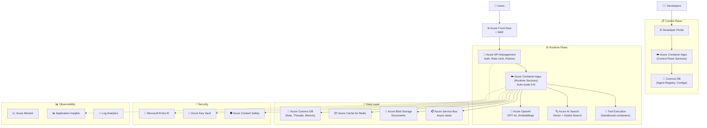

---

## Azure OpenAI Service

### מה זה?
**Azure OpenAI** = שירות של Azure שמספק גישה למודלי OpenAI (GPT-4o, GPT-4o-mini, Embeddings) עם enterprise-grade security.

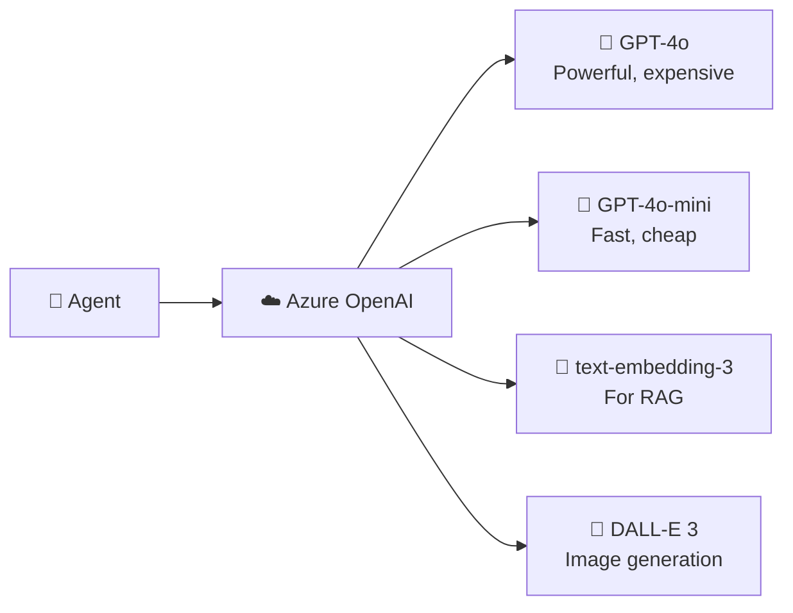

### למה Azure OpenAI ולא API ישיר של OpenAI?

| Azure OpenAI | OpenAI Direct |
|-------------|---------------|
| ✅ Data stays in your Azure region | ❌ Data goes to OpenAI servers |
| ✅ Enterprise SLA (99.9%) | ⚠️ Best-effort |
| ✅ VNet integration (private) | ❌ Public internet only |
| ✅ Managed Identity auth | 🔑 API key only |
| ✅ Content filtering built-in | ⚠️ Basic |
| ✅ Azure RBAC | ❌ Limited |
| ⚠️ Models available later | ✅ Latest models first |

### Deployment Concepts:

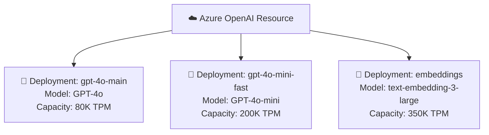

| Term | הסבר |
|------|-------|
| **TPM** | Tokens Per Minute - כמה tokens אפשר לצרוך |
| **Deployment** | Instance של מודל עם capacity מוגדר |
| **Provisioned** | Reserved capacity (מהיר, יקר) |
| **Standard** | Shared capacity (flexible, pay-per-use) |

---

## Azure AI Search

### מה זה?
**Azure AI Search** = שירות חיפוש שתומך ב-**Vector Search**, **Full-Text Search**, ו-**Hybrid Search**.

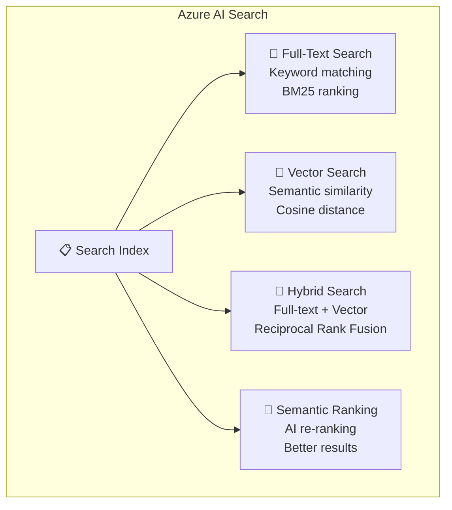

### RAG with Azure AI Search:

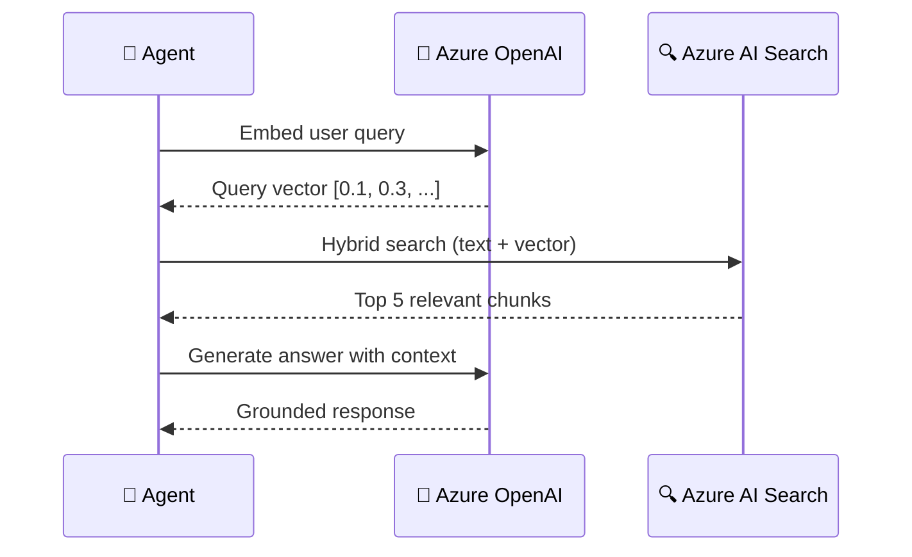

### Why Azure AI Search for RAG:

| Feature | Benefit |
|---------|---------|
| **Hybrid Search** | Best of keyword + semantic |
| **Semantic Ranking** | AI re-ranks results for quality |
| **Built-in Indexer** | Auto-index from Blob, Cosmos, SQL |
| **Integrated Vectorization** | Auto-embed using Azure OpenAI |
| **Security** | VNet, Managed Identity, RBAC |
| **Scale** | Handle millions of documents |

---

## Azure Cosmos DB

### מה זה?
**Azure Cosmos DB** = globally distributed NoSQL database עם low-latency guarantees.

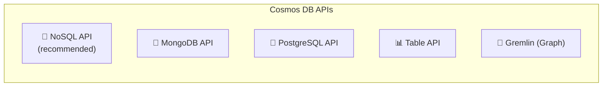

### למה Cosmos DB ל-Agent Platform?

| Use Case | Why Cosmos DB |
|----------|--------------|
| **Thread State** | Low latency reads/writes |
| **Chat History** | Document model fits naturally |
| **Agent Configs** | Schema flexibility |
| **Session Data** | TTL for auto-cleanup |
| **Multi-region** | Global distribution |
| **Multi-tenant** | Hierarchical partition keys |

### Partition Strategy:

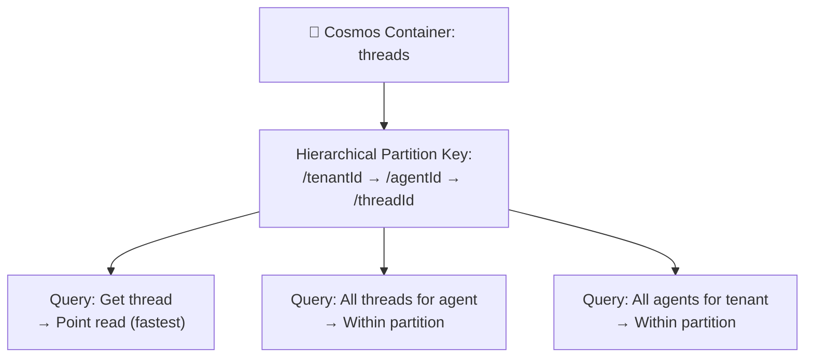

### Best Practices:

| Practice | הסבר |
|----------|-------|
| **Hierarchical Partition Keys** | tenantId/agentId/threadId |
| **Singleton CosmosClient** | Don't recreate per request |
| **Async SDK** | Use async APIs for throughput |
| **Retry-after on 429** | Handle rate limiting gracefully |
| **Right-size RUs** | Test and adjust Request Units |

---

## Azure Container Apps / AKS

### ACA vs AKS:

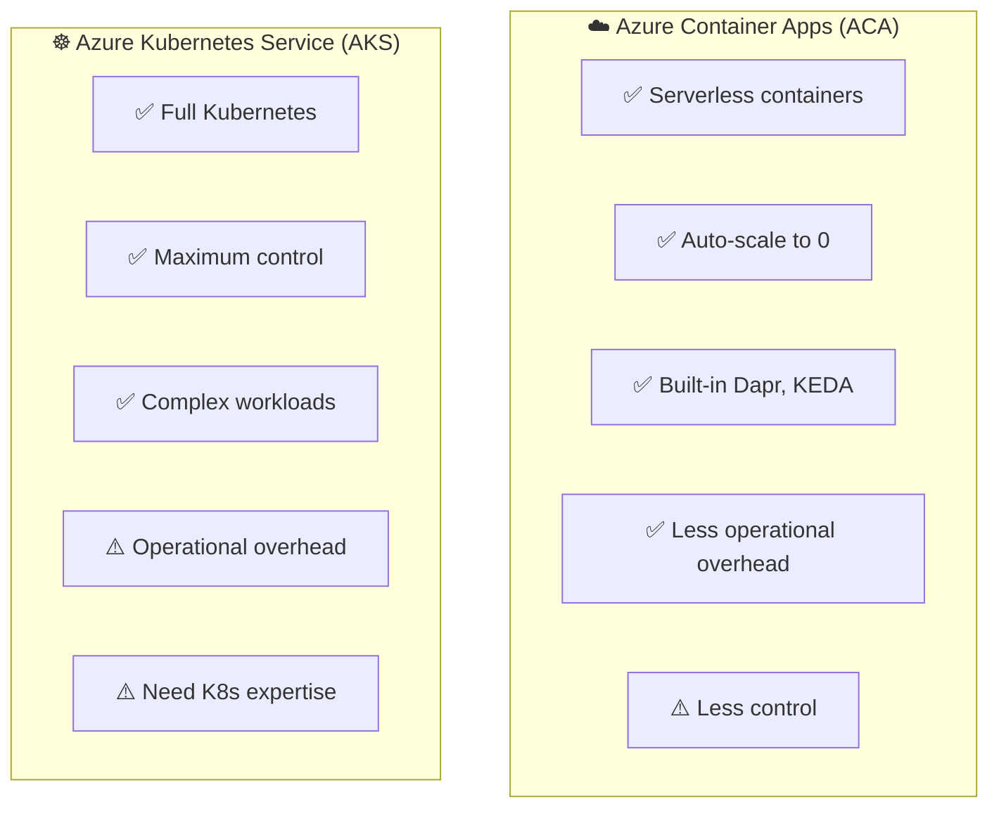

| | ACA | AKS |
|---|---|---|
| **Complexity** | ✅ Simple | ❌ Complex |
| **Scale to zero** | ✅ Yes | ⚠️ With KEDA |
| **Cost (small)** | ✅ Pay per use | ❌ Always-on nodes |
| **Control** | ⚠️ Limited | ✅ Full |
| **GPU workloads** | ⚠️ Limited | ✅ Supported |
| **Service mesh** | ✅ Built-in Envoy | ⚠️ Manual (Istio) |
| **Best for** | Most agent workloads | Large, complex platforms |

### Recommendation:

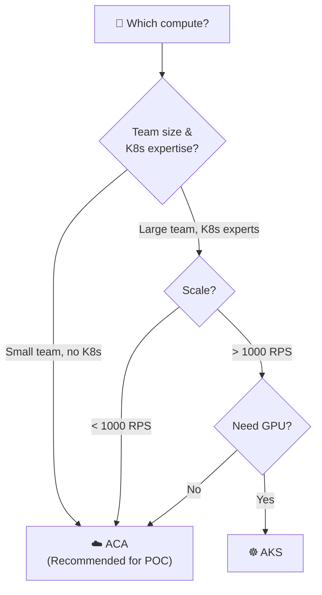

---

## Azure API Management (APIM)

### מה זה?
**APIM** = API Gateway של Azure. מנהל את כל ה-API traffic.

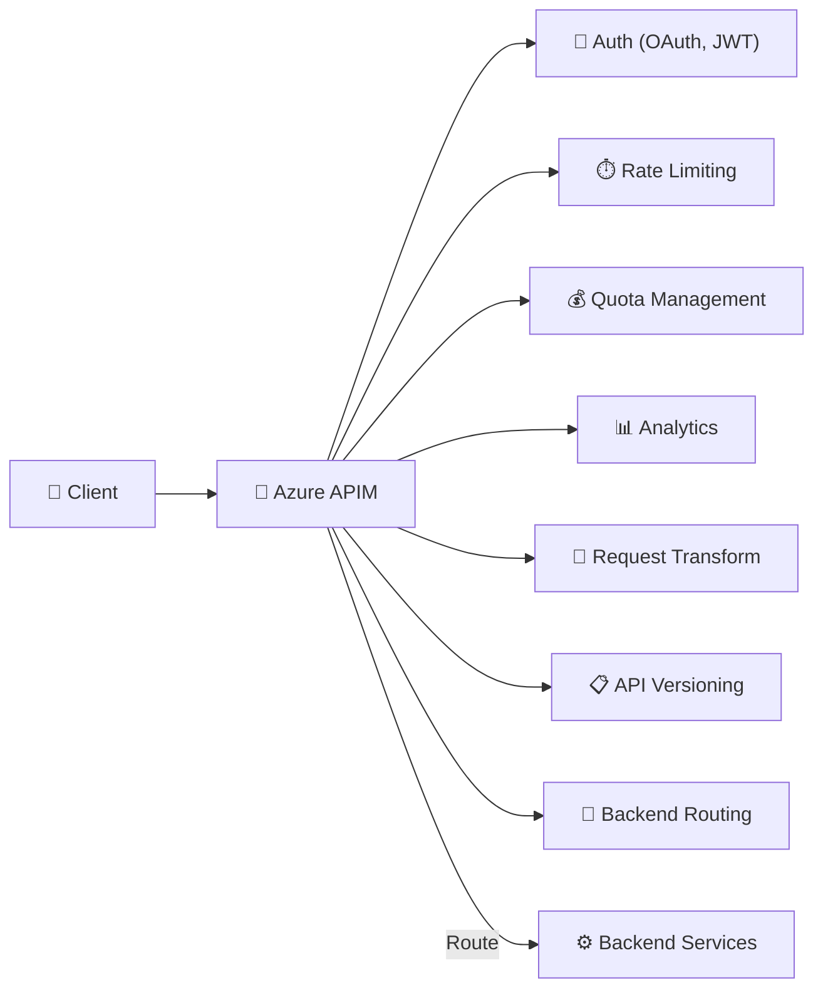

### APIM Policies for Agents:

```
<!-- Rate limiting per tenant -->
<rate-limit-by-key 
  calls="100" 
  renewal-period="60" 
  counter-key="@(context.Request.Headers['X-Tenant-Id'])" />

<!-- Token counting -->
<set-variable name="token-count" 
  value="@(context.Response.Headers['x-openai-usage'])" />

<!-- Route to Azure OpenAI with retry -->
<retry count="3" interval="1" delta="1" max-interval="10">
  <forward-request />
</retry>
```

---

## Microsoft Entra ID

### מה זה?
**Microsoft Entra ID** (formerly Azure AD) = Identity & Access Management.

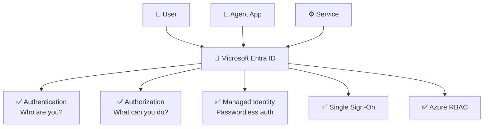

### Managed Identity:

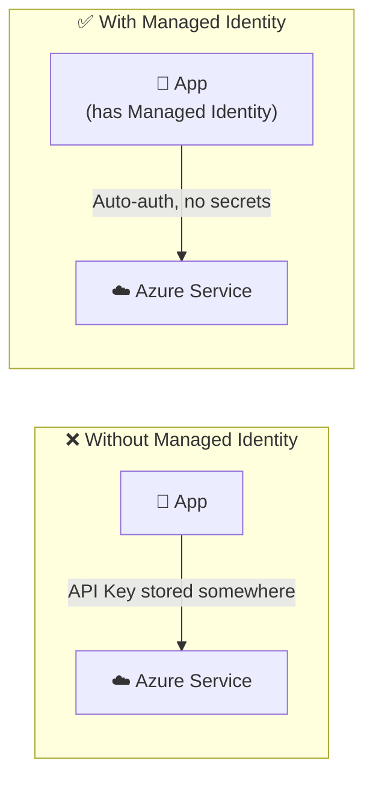

| Feature | Benefit for Agents |
|---------|-------------------|
| **Managed Identity** | No API keys/passwords needed |
| **RBAC** | Fine-grained access per agent/tenant |
| **Conditional Access** | Block access from untrusted networks |
| **Audit Logs** | Who accessed what, when |

---

## Azure Key Vault

### Agent Platform Integration:

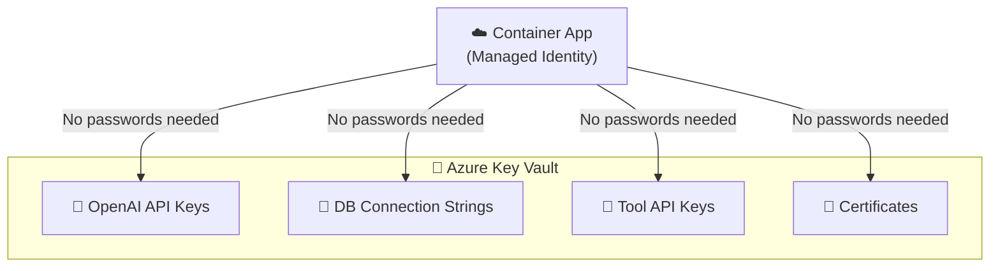

---

## Azure Service Bus

### Async Agent Execution:

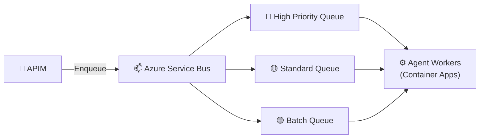

| Feature | Benefit |
|---------|---------|
| **Sessions** | Ordered processing per thread |
| **Dead-letter queue** | Failed messages preserved |
| **Scheduled delivery** | Delayed processing |
| **Duplicate detection** | Idempotency |
| **Priority** | Premium tier supports priorities |

---

## Azure Monitor & App Insights

### Full Observability Stack:

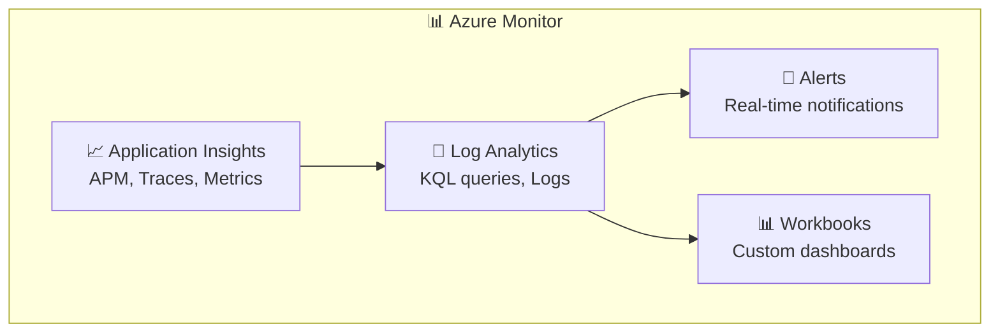

### Agent-Specific Monitoring:

```
// KQL: Cost per tenant per day
customMetrics
| where name == "agent_llm_cost"
| summarize TotalCost = sum(value) by tenant = tostring(customDimensions.tenant_id), bin(timestamp, 1d)
| order by TotalCost desc

// KQL: Slow agent requests
requests
| where duration > 10000  // > 10 seconds
| project timestamp, name, duration, customDimensions.agent_id, customDimensions.steps
| order by duration desc
| take 20
```

---

## Azure Content Safety

### מה זה?
**Azure AI Content Safety** = שירות שמזהה תוכן מזיק (אלימות, שנאה, מיני, פגיעה עצמית).

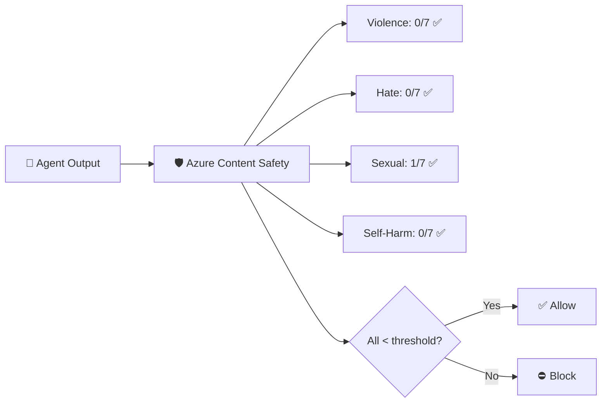

---

## Azure AI Foundry

### מה זה?
**Azure AI Foundry** (formerly Azure AI Studio) = פלטפורמה מלאה לפיתוח AI Apps ו-Agents.

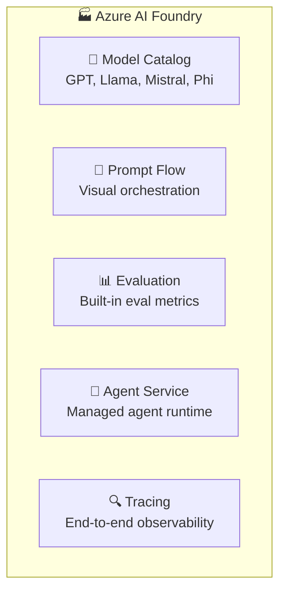

### Agent Service:

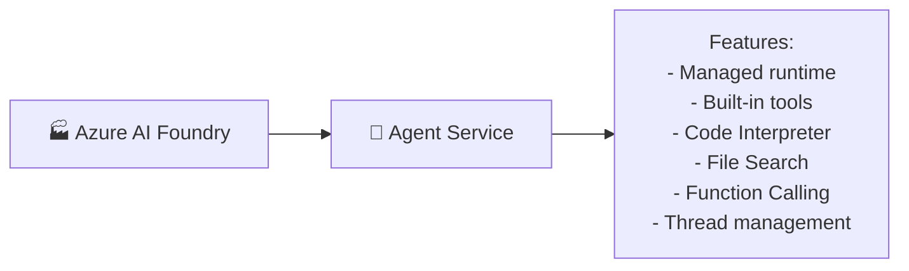

---

## Semantic Kernel

### מה זה?
**Semantic Kernel** = SDK של Microsoft לבניית AI Agents. זה ה-"framework" לכתיבת ה-Agent logic.

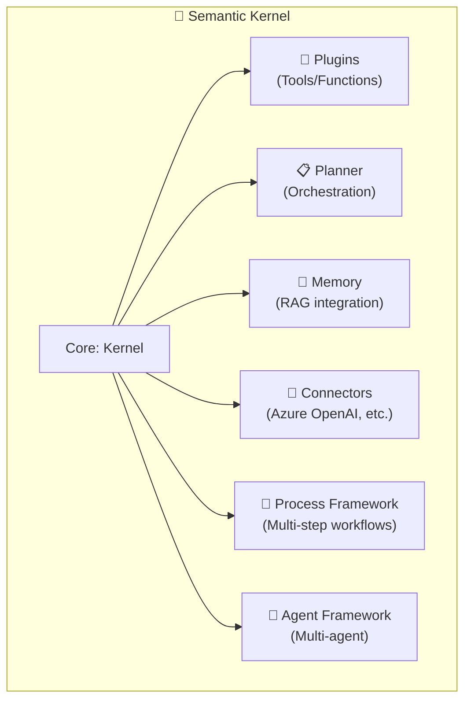

### SK vs LangChain:

| | Semantic Kernel | LangChain |
|---|---|---|
| **Company** | Microsoft | LangChain Inc. |
| **Languages** | C#, Python, Java | Python, JS |
| **Azure integration** | ✅ Native | ⚠️ Good |
| **Enterprise** | ✅ Designed for | ⚠️ Growing |
| **Multi-agent** | ✅ Agent framework | ⚠️ Via LangGraph |
| **Ecosystem** | Growing | ✅ Large |
| **Learning curve** | Moderate | Moderate |

---

## Architecture Summary: End-to-End Azure

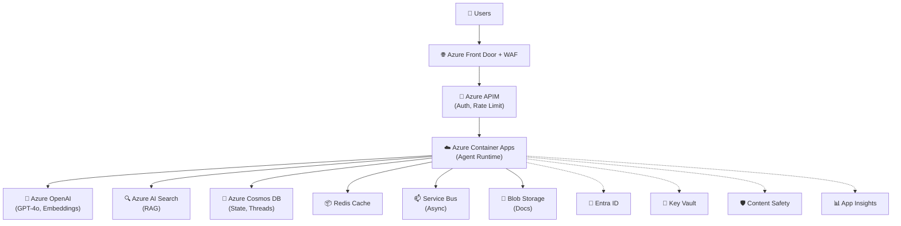

---

## יתרונות וחסרונות של Azure Stack

| ✅ יתרון | ❌ חיסרון |
|----------|----------|
| All services in one cloud | Vendor lock-in |
| Native integration between services | שירותים מסוימים יקרים |
| Enterprise-grade SLA | Learning curve per service |
| Managed Identity (passwordless) | Updates/changes by Microsoft |
| Compliance (GDPR, SOC2, HIPAA) | Some services still in preview |
| Global regions | Complexity of configuration |

---

## סיכום

```mermaid
mindmap
  root((Microsoft Stack))
    Compute
      Azure Container Apps
      AKS
    AI/LLM
      Azure OpenAI
      AI Search
      Content Safety
      AI Foundry
    Data
      Cosmos DB
      Redis Cache
      Blob Storage
    Messaging
      Service Bus
    Security
      Entra ID
      Key Vault
      VNet
    Observability
      Azure Monitor
      App Insights
      Log Analytics
    Framework
      Semantic Kernel
```

| Component | Azure Service | Role |
|-----------|--------------|------|
| **Gateway** | APIM | API management |
| **Compute** | Container Apps | Agent runtime |
| **LLM** | Azure OpenAI | AI models |
| **Search** | AI Search | RAG vector search |
| **State** | Cosmos DB | Threads, state, memory |
| **Cache** | Redis | Performance |
| **Queue** | Service Bus | Async processing |
| **Identity** | Entra ID | Auth |
| **Secrets** | Key Vault | Secret management |
| **Safety** | Content Safety | Content moderation |
| **Monitoring** | App Insights | Observability |
| **Framework** | Semantic Kernel | Agent SDK |

---

## ❓ שאלות לבדיקה עצמית

1. מפה כל רכיב גנרי מה-HLD ל-Azure service ספציפי (15 רכיבים).
2. למה Azure OpenAI ולא OpenAI ישירות?
3. מה היתרון של Hybrid Search ב-Azure AI Search?
4. למה Cosmos DB מתאים ל-Agent Platform (4 סיבות)?
5. מה ההבדל בין ACA ל-AKS ומתי משתמשים בכל אחד?
6. מה זה Managed Identity ולמה זה עדיף על API keys?
7. מה Semantic Kernel ואיך הוא שונה מ-LangChain?
8. מה Azure AI Foundry Agent Service מספק?

---

### 📝 תשובות

<details>
<summary>1. מפה כל רכיב גנרי ל-Azure service.</summary>

LLM Gateway → **Azure OpenAI**, Vector DB → **Azure AI Search**, State Store → **Cosmos DB**, Cache → **Azure Cache for Redis**, Compute → **Azure Container Apps (ACA)**, Queue → **Azure Service Bus**, Identity → **Microsoft Entra ID**, Secrets → **Azure Key Vault**, Monitoring → **Azure Monitor + App Insights**, Storage → **Azure Blob Storage**, Config → **Azure App Configuration**, Orchestration SDK → **Semantic Kernel**, CI/CD → **Azure DevOps / GitHub Actions**, Evaluation → **Azure AI Foundry**, Content Safety → **Azure AI Content Safety**.
</details>

<details>
<summary>2. למה Azure OpenAI ולא OpenAI ישירות?</summary>

1. **נתונים נשארים ב-Azure** - לא יוצאים ל-OpenAI, עומדים ב-compliance (GDPR, SOC2).
2. **Managed Identity** - ללא API keys.
3. **Private Endpoints** - תעבורה ברשת פרטית.
4. **Content Filtering** - מובנה.
5. **PTU (Provisioned Throughput)** - קפסיטי מובטח ל-enterprise.
6. **SLA** - 99.9% uptime עם תמיכה.
</details>

<details>
<summary>3. מה היתרון של Hybrid Search ב-Azure AI Search?</summary>

**Hybrid Search** משלב **Keyword (BM25) + Semantic (Vector)** ומאחד תוצאות עם RRF (Reciprocal Rank Fusion). יתרון: (1) מקבל את הדיוק של keyword (מונחים, שמות) + הבנה סמנטית (משמעות דומה), (2) תוצאות מדויקות יותר עם כל שיטה לבדה, (3) ב-Azure AI Search זה מובנה וקל להפעיל.
</details>

<details>
<summary>4. למה Cosmos DB מתאים ל-Agent Platform (4 סיבות)?</summary>

1. **Low Latency** - single-digit ms reads/writes, קריטי ל-real-time agents.
2. **Multi-Model** - תומך ב-JSON, Key-Value, Graph → מתאים לשמירת config, state, threads.
3. **Global Distribution** - multi-region writes → Active-Active.
4. **Elastic Scale** - auto scale RU/s לפי עומס, לא צריך provision מראש.
</details>

<details>
<summary>5. מה ההבדל בין ACA ל-AKS?</summary>

**ACA (Azure Container Apps)** = PaaS ל-containers. לא צריך לנהל K8s, auto-scaling מובנה, scale to zero. מתאים: רוב המקרים (80%), פשוט ומהיר. **AKS (Azure Kubernetes Service)** = IaaS+, שליטה מלאה על K8s. מתאים: מקרים מורכבים, custom networking, service mesh, GPU nodes.
</details>

<details>
<summary>6. מה זה Managed Identity ולמה זה עדיף על API keys?</summary>

**Managed Identity** = זהות ש-Azure מנהל אוטומטית ל-service. ה-service מתחבר לשירותים אחרים בלי API key בקוד. עדיף כי: (1) **אין secrets לנהל** - אין מה לדלוף/לסובב/לשכוח, (2) **רוטציה אוטומטית**, (3) **RBAC** - משתלב עם Entra ID.
</details>

<details>
<summary>7. מה Semantic Kernel ואיך הוא שונה מ-LangChain?</summary>

**Semantic Kernel** = SDK של Microsoft לבניית אפליקציות AI. **הבדלים מ-LangChain**: (1) **Enterprise-first** - אופטימיזציה ל-Azure, (2) **C# + Python + Java** (לא רק Python), (3) **Plugins** architecture (מודולרי), (4) **פחות abstractions** - פשוט להבנה. LangChain: פופולרי יותר ב-community, עשיר יותר ב-integrations צד שלישי.
</details>

<details>
<summary>8. מה Azure AI Foundry Agent Service מספק?</summary>

**Azure AI Foundry Agent Service** = שירות managed של Azure לבניית AI Agents. מספק: (1) **Managed Runtime** - לא צריך לנהל infra, (2) **אינטגרציה מובנית** עם Azure OpenAI, AI Search, Bing, (3) **Thread/State management** מובנה, (4) **Code Interpreter** ו-File tools מוכנים, (5) **Enterprise features** - אבטחה, compliance, monitoring. בעצם PaaS ל-Agent Platform.
</details>

---

**[⬅️ חזרה לפרק 14: HLD Architecture](14-hld-architecture.md)** | **[➡️ המשך לפרק 16: פריימוורקים לפיתוח סוכנים →](16-agent-frameworks.md)**
