# 🧩 פרק 16: פריימוורקים לפיתוח סוכנים ואקוסיסטם

## תוכן עניינים
- [למה צריך פריימוורק לסוכנים?](#למה-צריך-פריימוורק-לסוכנים)
- [הנוף הכללי](#הנוף-הכללי)
- [LangChain](#langchain)
- [LangGraph](#langgraph)
- [Semantic Kernel](#semantic-kernel)
- [AutoGen / AG2](#autogen--ag2)
- [CrewAI](#crewai)
- [LlamaIndex](#llamaindex)
- [פרוטוקולי תקשורת: MCP & A2A](#פרוטוקולי-תקשורת-mcp--a2a)
- [השוואה מקיפה](#השוואה-מקיפה)
- [איך פריימוורקים ממפים למושגי הפלטפורמה](#איך-פריימוורקים-ממפים-למושגי-הפלטפורמה)
- [מדריך בחירה: איך בוחרים פריימוורק](#מדריך-בחירה-איך-בוחרים-פריימוורק)
- [סיכום ושאלות](#סיכום-ושאלות)

---

## למה צריך פריימוורק לסוכנים?

בפרקים 1–14 למדנו את כל **המושגים** של פלטפורמת AI Agent — זיכרון, תזמור, כלים, אבטחה וכו'. בפרק 15 ראינו איך למפות את המושגים האלה ל**שירותי ענן** (Azure).

אבל מי בעצם **כותב את קוד הסוכן**? בדיוק לזה נועדו **פריימוורקים לפיתוח סוכנים**.

### בלי פריימוורק:

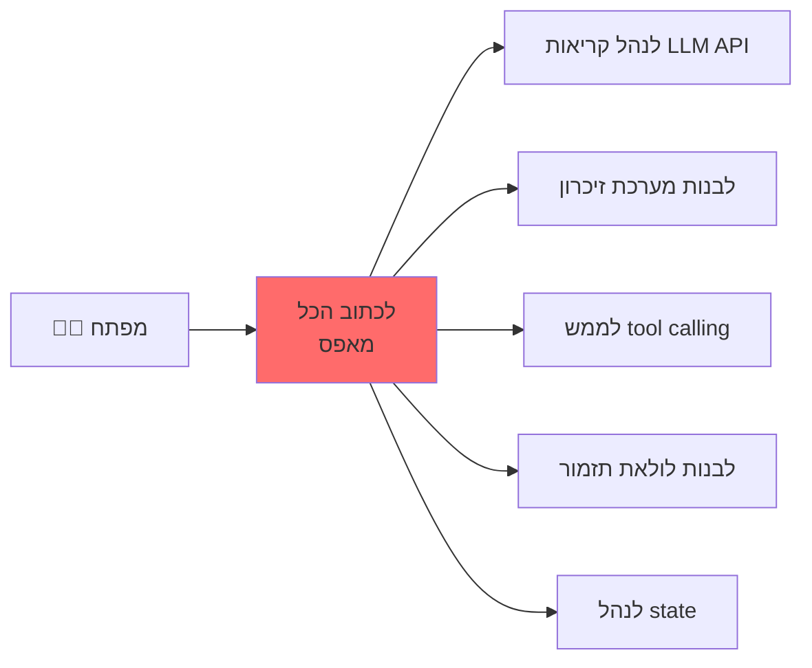

### עם פריימוורק:

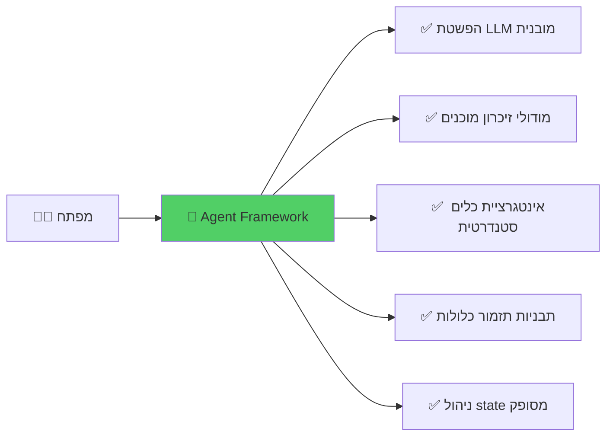

### האנלוגיה
חשבו על זה כמו **פיתוח ווב**: אפשר *תיאורטית* לבנות אתר עם raw TCP sockets ו-HTTP parsing. אבל אף אחד לא עושה את זה. משתמשים ב**פריימוורקים** כמו Django, Express, או Spring Boot. פריימוורקים לסוכנים עושים את אותו הדבר ל-AI Agents — הם מספקים את אבני הבניין כדי שתתמקדו ב**לוגיקה עסקית**, לא בצנרת.

---

## הנוף הכללי

אקוסיסטם הפריימוורקים לסוכנים מתפתח במהירות. הנה השחקנים המרכזיים נכון ל-2025–2026:

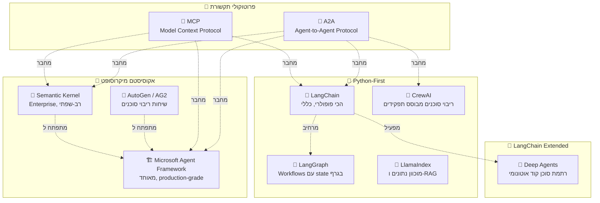

---

## LangChain

### מה זה LangChain?
**LangChain** הוא הפריימוורק הקוד-פתוח הנפוץ ביותר לבניית אפליקציות מבוססות LLM. נוצר בסוף 2022, ומספק רכיבים מודולריים לשרשור קריאות LLM, כלים, זיכרון ואחזור יחד.

### רכיבים מרכזיים

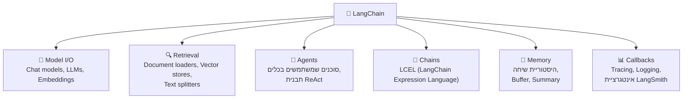

### LangChain Expression Language (LCEL)

LCEL הוא הדרך הדקלרטיבית של LangChain להרכיב שרשראות באמצעות תחביר pipe (`|`):

```python
from langchain_openai import ChatOpenAI
from langchain_core.prompts import ChatPromptTemplate
from langchain_core.output_parsers import StrOutputParser

# הרכבת שרשרת באמצעות תחביר pipe
chain = (
    ChatPromptTemplate.from_template("Explain {topic} in simple terms")
    | ChatOpenAI(model="gpt-4o")
    | StrOutputParser()
)

result = chain.invoke({"topic": "quantum computing"})
```

### מתי להשתמש ב-LangChain

| ✅ מתאים ל | ❌ פחות מתאים ל |
|-----------|----------------|
| אפליקציות RAG | Workflows מורכבים של ריבוי סוכנים |
| פרוטוטייפינג מהיר | סוכנים stateful בפרודקשן |
| סוכנים פשוטים עם כלים | שליטה ברמה נמוכה על ריצה |
| אקוסיסטם אינטגרציות ענק | דרישות מינימום תלויות |

### חוזקות עיקריות
- **אקוסיסטם הכי גדול**: 700+ אינטגרציות (vector stores, LLMs, כלים)
- **LangSmith**: פלטפורמת observability והערכה מובנית
- **קהילה**: הכי הרבה מדריכים, דוגמאות ותמיכה קהילתית
- **LCEL**: הרכבה דקלרטיבית של שרשראות עם תמיכה ב-streaming

### Deep Agents (של LangChain)

**Deep Agents** הוא **רתמת סוכן קוד אוטונומי** של LangChain — SDK ו-CLI מוכנים לבניית סוכני קוד אינטראקטיביים וארוכי-טווח. חשבו על זה כ"shell סוכן" שעוטף מודל ונותן לו הכל כדי לעבוד על codebases אמיתיים.

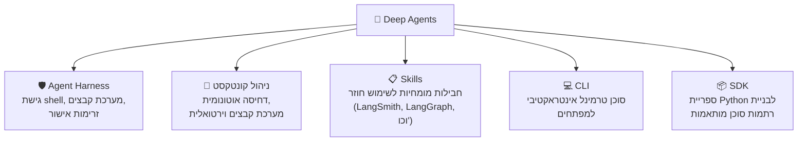

**תכונות מרכזיות:**
- **Agent Harness**: גישת shell ומערכת קבצים, זרימות אישור וניהול קונטקסט לסשנים ארוכים
- **דחיסת קונטקסט אוטונומית**: הסוכן יכול לדחוס את חלון הקונטקסט שלו ברגעים מתאימים — בלי צורך בפקודה ידנית
- **מערכת Skills**: חבילות מומחיות לשימוש חוזר שנותנות לסוכנים ידע תחומי
- **מערכת קבצים וירטואלית**: שומרת היסטוריית שיחה מלאה גם אחרי דחיסה, מאפשרת שחזור קונטקסט
- **CLI**: סוכן טרמינל אינטראקטיבי למשימות קוד (`deepagents` CLI)

```python
from deepagents import create_deep_agent
from deepagents.backends import StateBackend
from deepagents.middleware.summarization import (
    create_summarization_tool_middleware,
)

model = "openai:gpt-4o"
agent = create_deep_agent(
    model=model,
    middleware=[
        create_summarization_tool_middleware(model, StateBackend),
    ],
)
```

**מתי להשתמש ב-Deep Agents:** כשצריכים לבנות סוכן קוד, עוזר מבוסס-טרמינל, או כל סוכן אינטראקטיבי ארוך-טווח שעובד עם קבצים וקוד.

---

## LangGraph

### מה זה LangGraph?
**LangGraph** בנוי על גבי LangChain ומספק גישה **מבוססת-גרף** לבניית workflows סוכנים stateful ורב-שלביים. בעוד LangChain מטפל בשרשראות פשוטות, LangGraph מטפל ב**זרימות מורכבות עם מעגלים, הסתעפויות ופרסיסטנטיות**.

### הרעיון המרכזי: סוכנים כגרפים

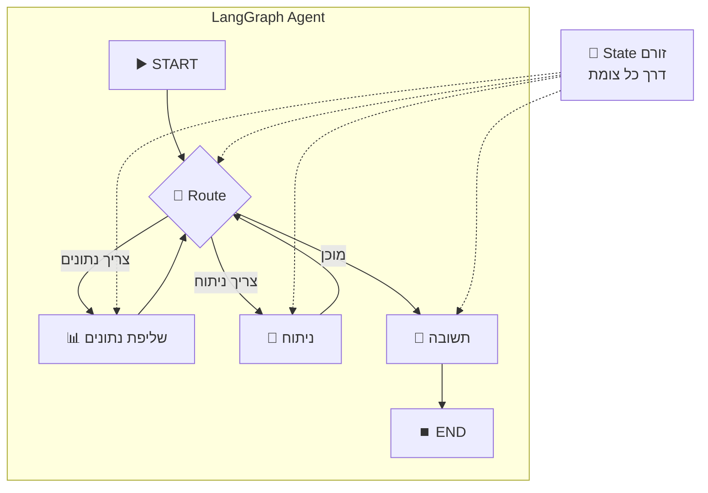

### מושגים מרכזיים

| מושג | הסבר | פרק בפלטפורמה |
|------|-------|--------------|
| **StateGraph** | גרף שבו צמתים חולקים אובייקט state מוטיפס | פרק 6 - ניהול State |
| **Nodes** | פונקציות שקוראות/כותבות state | פרק 7 - תזמור |
| **Edges** | מעברים בין צמתים (מותנים או קבועים) | פרק 7 - תזמור |
| **Checkpointing** | שמירת state אוטומטית אחרי כל צומת | פרק 6 - Checkpointing |
| **Human-in-the-Loop** | הקפאת גרף, המתנה לקלט אנושי, חידוש | פרק 6 - HITL |
| **Subgraphs** | גרפים מקוננים לעיצוב סוכנים מודולרי | פרק 7 - תת-סוכנים |

### דוגמה ל-LangGraph: סוכן ReAct עם כלים

```python
from langgraph.prebuilt import create_react_agent
from langchain_openai import ChatOpenAI
from langchain_community.tools import TavilySearchResults

# הגדרת כלים
search_tool = TavilySearchResults(max_results=3)

# יצירת סוכן ReAct עם לולאת כלים מובנית
agent = create_react_agent(
    model=ChatOpenAI(model="gpt-4o"),
    tools=[search_tool],
    checkpointer="memory",  # אפשור פרסיסטנטיות state
)

# הרצה עם פרסיסטנטיות ברמת thread
config = {"configurable": {"thread_id": "user-123"}}
result = agent.invoke(
    {"messages": [("user", "What happened in AI news today?")]},
    config=config,
)
```

### ארכיטקטורת LangGraph

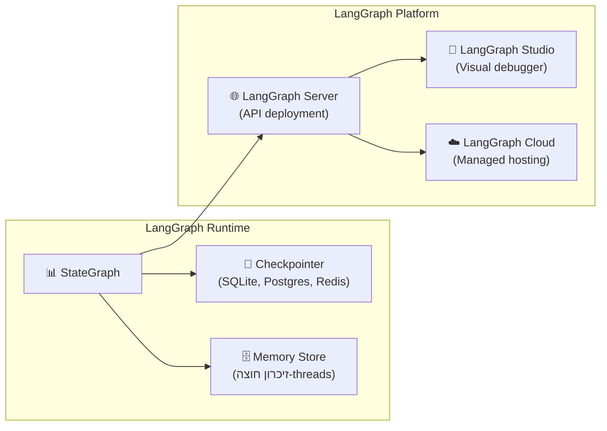

### מתי להשתמש ב-LangGraph

| ✅ מתאים ל | ❌ פחות מתאים ל |
|-----------|----------------|
| Workflows מורכבים רב-שלביים | שרשראות Q&A פשוטות |
| סוכנים עם צורך ב-HITL | קריאות LLM חד-פעמיות |
| סוכנים stateful ארוכי-טווח | פרוטוטייפינג מהיר |
| לולאות סוכן מחזוריות (ReAct) | דרישות מינימום תלויות |
| סוכני פרודקשן עם פרסיסטנטיות | |

---

## Semantic Kernel

### מה זה Semantic Kernel?
**Semantic Kernel (SK)** הוא ה-SDK הקוד-פתוח של מיקרוסופט לבניית סוכנים ואפליקציות AI. בניגוד לפריימוורקים שתומכים רק ב-Python, SK תומך ב-**C#, Python, ו-Java**, מה שהופך אותו לבחירה המועדפת לצוותים ארגוניים שכבר באקוסיסטם .NET.

### ארכיטקטורה מרכזית

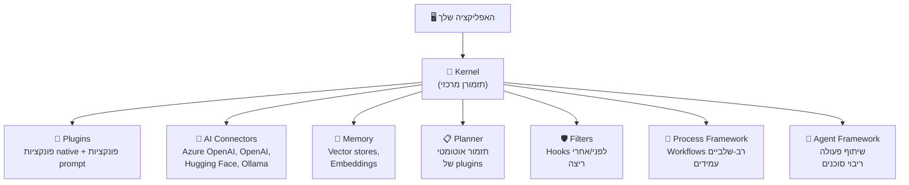

### מושגים מרכזיים

| מושג | הסבר | דוגמה |
|------|-------|-------|
| **Kernel** | אובייקט מרכזי שמנהל שירותי AI, plugins וזיכרון | `kernel = Kernel()` |
| **Plugin** | אוסף פונקציות (קוד native או prompts) שה-AI יכול להפעיל | `EmailPlugin`, `MathPlugin` |
| **AI Connector** | מתאם לכל ספק LLM | Azure OpenAI, Ollama |
| **Planner** | תזמור אוטומטי של plugins להשגת מטרה | "הזמן טיסה" → מפעיל Flight + Hotel + Car plugins |
| **Filter** | Middleware שמיירט קריאות AI ללוגינג, אבטחה וכו' | פילטר content safety |
| **Process Framework** | Workflows רב-שלביים עמידים עם state machines | צינור עיבוד הזמנות |
| **Agent Framework** | שיתוף פעולה רב-סוכנים עם אסטרטגיות שונות | Group chat, העברות |

### דוגמת Semantic Kernel

```python
import asyncio
from semantic_kernel import Kernel
from semantic_kernel.connectors.ai.open_ai import AzureChatCompletion
from semantic_kernel.functions import kernel_function

# הגדרת plugin
class WeatherPlugin:
    @kernel_function(description="Get weather for a city")
    def get_weather(self, city: str) -> str:
        return f"Weather in {city}: 22°C, sunny"

# הגדרת ה-kernel
kernel = Kernel()
kernel.add_service(AzureChatCompletion(
    deployment_name="gpt-4o",
    endpoint="https://my-ai.openai.azure.com",
))
kernel.add_plugin(WeatherPlugin(), "weather")

# הפעלה עם function calling אוטומטי
result = await kernel.invoke_prompt(
    "What's the weather like in Tel Aviv?",
    settings={"function_choice_behavior": "auto"}
)
```

### מתי להשתמש ב-Semantic Kernel

| ✅ מתאים ל | ❌ פחות מתאים ל |
|-----------|----------------|
| צוותי .NET / Java ארגוניים | צוותי Python בלבד שרוצים פרוטוטייפינג מהיר |
| דיפלויים Azure-first | צוותים שצריכים אקוסיסטם plugins גדול |
| סוכני פרודקשן עם בקרות ארגוניות | אפליקציות RAG בלבד פשוטות |
| פרויקטים רב-שפתיים (C#, Python, Java) | ניסויים מהירים |
| Workflows עמידים (Process Framework) | |

---

## AutoGen / AG2

### מה זה AutoGen?
**AutoGen** (כעת מתפתח כ-**AG2**) הוא פריימוורק הקוד-פתוח של מיקרוסופט שתוכנן ספציפית ל**שיחות ריבוי סוכנים**. הרעיון המרכזי: מספר סוכני AI ש**מדברים זה עם זה** כדי לפתור משימות מורכבות.

### הרעיון המרכזי: שיחות בין סוכנים

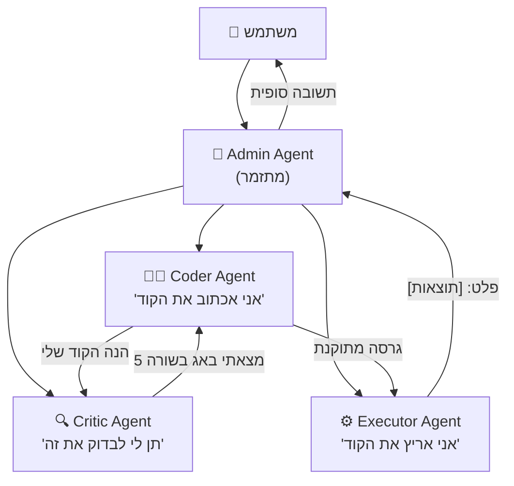

### מושגים מרכזיים

| מושג | הסבר |
|------|-------|
| **ConversableAgent** | סוכן בסיס שיכול לשלוח/לקבל הודעות |
| **AssistantAgent** | סוכן מגובה LLM |
| **UserProxyAgent** | סוכן שמייצג את המשתמש, יכול להריץ קוד |
| **GroupChat** | מספר סוכנים בשיחה עם מנהל |
| **GroupChatManager** | שולט בתורות בצ'אט ריבוי-סוכנים |
| **Nested Chats** | סוכנים יכולים להפעיל שיחות-משנה |
| **Code Execution** | הרצת קוד מבודדת מובנית (Docker או מקומי) |

### דוגמת AutoGen: שיתוף פעולה בין שני סוכנים

```python
from autogen import AssistantAgent, UserProxyAgent

# יצירת עוזר מגובה LLM
assistant = AssistantAgent(
    name="analyst",
    llm_config={"model": "gpt-4o"},
    system_message="You are a data analyst. Write Python code to analyze data."
)

# יצירת proxy משתמש שיכול להריץ קוד
user_proxy = UserProxyAgent(
    name="executor",
    human_input_mode="NEVER",
    code_execution_config={"work_dir": "workspace", "use_docker": True},
)

# התחלת השיחה
user_proxy.initiate_chat(
    assistant,
    message="Analyze the top 10 programming languages by popularity in 2025."
)
```

### מתי להשתמש ב-AutoGen

| ✅ מתאים ל | ❌ פחות מתאים ל |
|-----------|----------------|
| פתרון בעיות ריבוי-סוכנים | משימות סוכן בודד פשוטות |
| Workflows של יצירת קוד + הרצה | אפליקציות מוכוונות RAG / אחזור |
| מחקר וניסויים | APIs פרודקשן עם latency קפדני |
| משימות מורכבות שדורשות מומחיות מגוונת | צוותים שצריכים שליטה פרטנית ב-state |

---

## Microsoft Agent Framework

### מה זה Microsoft Agent Framework?
**Microsoft Agent Framework** (MAF) הוא הפריימוורק הקוד-פתוח החדש ביותר של מיקרוסופט ש**מאחד** את Semantic Kernel ו-AutoGen לפלטפורמה אחת, מוכנת-לפרודקשן. הוכרז בסוף 2025 והגיע ל-Release Candidate בתחילת 2026, ומספק בסיס עקבי רב-שפתי (C#, Python) לבניית הכל — מסוכן בודד ועד תזמורי ריבוי-סוכנים מורכבים.

> **חשוב:** Semantic Kernel ו-AutoGen מתפתחים כעת **לתוך** Microsoft Agent Framework. מיקרוסופט מספקת מדריכי מיגרציה לפרויקטי SK ו-AutoGen קיימים. מושגי היסוד משני הפריימוורקים נשמרים ומשופרים.

### למה איחוד?

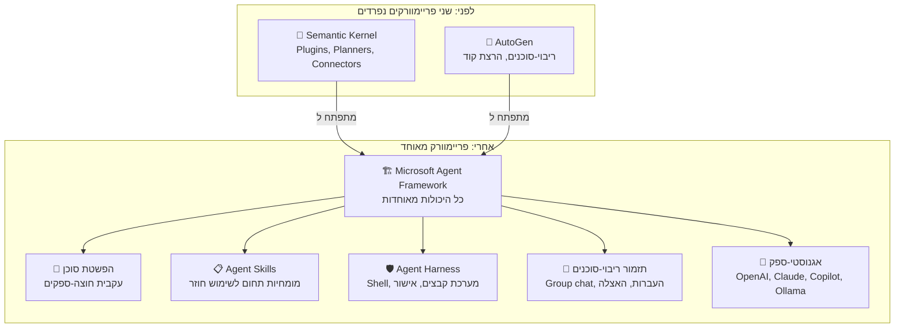

### מושגים מרכזיים

| מושג | הסבר |
|------|-------|
| **Agent Abstraction** | ממשק סוכן עקבי שעובד חוצה-ספקים שונים (OpenAI, Claude, GitHub Copilot, Ollama) |
| **Agent Skills** | חבילות מומחיות ניידות (מבוססות markdown) שסוכנים מגלים וטוענים בזמן ריצה |
| **Agent Harness** | שכבת runtime שמחברת חשיבה לביצוע אמיתי: גישת shell, מערכת קבצים, זרימות אישור |
| **תזמור ריבוי-סוכנים** | תיאום סוכנים מתמחים — group chat, העברות, תבניות האצלה |
| **Provider SDKs** | אינטגרציות עם Claude Agent SDK, GitHub Copilot SDK, Azure OpenAI ועוד |
| **OpenTelemetry** | Observability מובנה עם tracing סטנדרטי |
| **תמיכת MCP** | תמיכה טבעית בשרתי Model Context Protocol |

### דוגמת Microsoft Agent Framework

```python
from microsoft.agents import Agent, AgentRuntime
from microsoft.agents.skills import SkillsProvider

# יצירת סוכן עם skills
agent = Agent(
    name="analyst",
    model="azure-openai:gpt-4o",
    instructions="You are a data analyst with expertise in sales data.",
    skills_provider=SkillsProvider(skills_dir="./skills"),
)

# הרצה עם ה-runtime המאוחד
runtime = AgentRuntime()
result = await runtime.run(agent, "Analyze Q4 sales trends")
```

### מתי להשתמש ב-Microsoft Agent Framework

| ✅ מתאים ל | ❌ פחות מתאים ל |
|-----------|----------------|
| פרויקטים חדשים באקוסיסטם מיקרוסופט | צוותים שקועים עמוק באקוסיסטם LangChain |
| מערכות ריבוי-סוכנים ארגוניות | צוותי Python בלבד שרוצים פרוטוטייפינג מהיר |
| סוכני פרודקשן עם גמישות ספקים | אפליקציות RAG פשוטות חד-פעמיות |
| צוותים שמהגרים מ-SK או AutoGen | פרויקטים שדורשים הערכת LangSmith |
| פרויקטי .NET ו-Python | |

---

## CrewAI

### מה זה CrewAI?
**CrewAI** הוא פריימוורק לבניית **צוותי ריבוי-סוכנים מבוססי תפקידים**. האנלוגיה שלו: במקום שסוכן אחד עושה הכל, בונים **צוות** — כמו צוות בעבודה — שבו לכל חבר יש **תפקיד**, **מטרה**, ו**רקע** ספציפיים.

### אנלוגיית הצוות

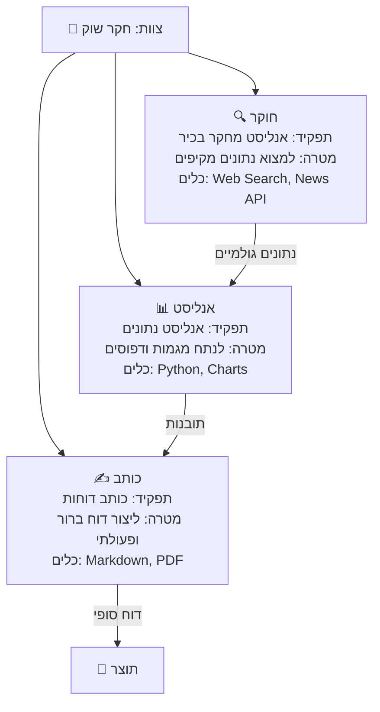

### מושגים מרכזיים

| מושג | הסבר | אנלוגיה |
|------|-------|---------|
| **Agent** | יחידה אוטונומית עם תפקיד, מטרה ורקע | חבר צוות |
| **Task** | משימה ספציפית עם פלט צפוי | פריט עבודה |
| **Crew** | צוות סוכנים שעובדים יחד | מחלקה |
| **Tool** | יכולת שסוכן יכול להשתמש בה | תוכנה/ציוד |
| **Process** | איך הצוות מבצע (סדרתי, היררכי) | סגנון ניהול |
| **Flow** | Workflows מונחי-אירועים שמחברים צוותים | תהליך עסקי |

### דוגמת CrewAI

```python
from crewai import Agent, Task, Crew, Process

# הגדרת סוכנים עם תפקידים
researcher = Agent(
    role="Senior Research Analyst",
    goal="Find comprehensive market data about AI trends",
    backstory="You are an experienced researcher with expertise in AI markets",
    tools=[search_tool, news_tool],
    llm="gpt-4o",
)

analyst = Agent(
    role="Data Analyst",
    goal="Analyze data and identify key trends",
    backstory="You excel at finding patterns in complex data",
    llm="gpt-4o",
)

# הגדרת משימות
research_task = Task(
    description="Research the current state of AI agent frameworks in 2025",
    expected_output="A detailed list of frameworks with pros and cons",
    agent=researcher,
)

analysis_task = Task(
    description="Analyze the research and provide recommendations",
    expected_output="A structured analysis with clear recommendations",
    agent=analyst,
)

# יצירת והרצת הצוות
crew = Crew(
    agents=[researcher, analyst],
    tasks=[research_task, analysis_task],
    process=Process.sequential,
)

result = crew.kickoff()
```

### מתי להשתמש ב-CrewAI

| ✅ מתאים ל | ❌ פחות מתאים ל |
|-----------|----------------|
| סימולציות צוות מבוססות תפקידים | אפליקציות סוכן בודד |
| צינורות יצירת תוכן | דרישות latency נמוך |
| אוטומציית תהליכים עסקיים | Workflows סטייטפול מורכבים בגרף |
| משתמשים לא-טכניים (API אינטואיטיבי) | שליטה פרטנית בפנימיות הסוכן |

---

## LlamaIndex

### מה זה LlamaIndex?
**LlamaIndex** הוא פריימוורק נתונים שמתמקד בחיבור LLMs לנתונים שלכם. בעוד פריימוורקים אחרים מתמקדים בתזמור או ריבוי-סוכנים, LlamaIndex מצטיין ב**הזנת נתונים, אינדוקס ואחזור** (RAG).

### מוקד מרכזי

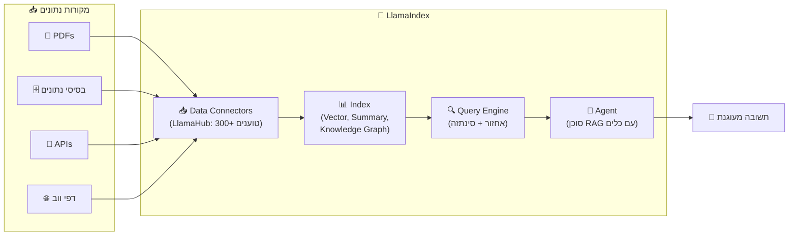

### חוזקות עיקריות
- **LlamaHub**: 300+ מחברי נתונים (Notion, Slack, Google Drive, בסיסי נתונים ועוד)
- **RAG מתקדם**: שאלות-משנה, אחזור רקורסיבי, re-ranking
- **LlamaParse**: פרסינג חכם של מסמכים (טבלאות, תמונות, layouts מורכבים)
- **LlamaCloud**: שירות managed pipeline ל-RAG

### מתי להשתמש ב-LlamaIndex

| ✅ מתאים ל | ❌ פחות מתאים ל |
|-----------|----------------|
| אפליקציות כבדות-RAG | תזמור ריבוי-סוכנים |
| עיבוד מסמכים מורכב | בניית סוכנים כלליים |
| אינטגרציית נתונים ארגונית | תבניות workflow/graph מורכבות |
| שילוב מקורות נתונים מרובים | צוותי סוכנים מבוססי תפקידים |

---

## פרוטוקולי תקשורת: MCP & A2A

ככל שאקוסיסטם הפריימוורקים גדל, שני פרוטוקולים קריטיים צצו כדי להבטיח שסוכנים וכלים יכולים **לעבוד יחד** בלי קשר לפריימוורק שבנה אותם.

### Model Context Protocol (MCP)

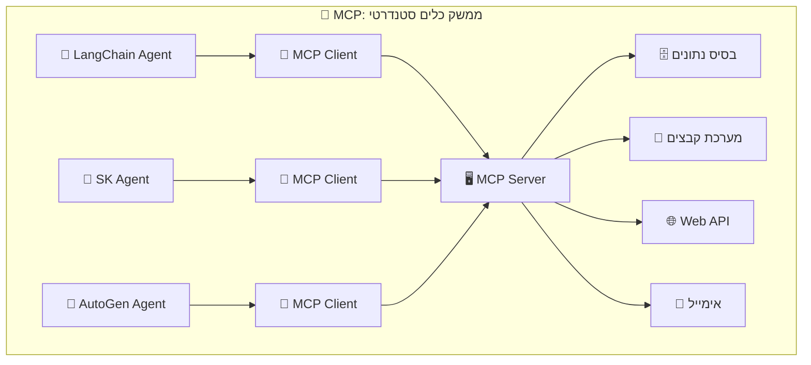

**מה זה MCP?**
- נוצר על ידי **Anthropic** (סטנדרט פתוח)
- פרוטוקול שמאפשר ל**כל סוכן** להתחבר ל**כל שרת כלים**
- חשבו על זה כמו **USB לכלי AI** — תקע סטנדרטי אחד שעובד בכל מקום
- שרתי MCP חושפים כלים; לקוחות MCP (סוכנים) צורכים אותם

**יתרונות עיקריים:**
- כותבים שרת כלים **פעם אחת**, משתמשים בו מכל פריימוורק
- פורמט סטנדרטי לגילוי כלים, הפעלה ותשובה
- אקוסיסטם הולך וגדל: GitHub, Slack, בסיסי נתונים, מערכות קבצים ועוד

### Agent-to-Agent Protocol (A2A)

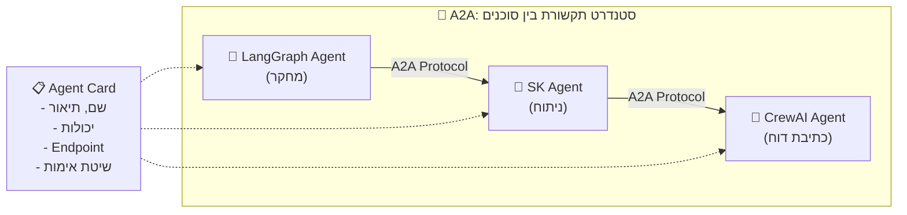

**מה זה A2A?**
- נוצר על ידי **Google** (סטנדרט פתוח)
- פרוטוקול לסוכנים שנבנו עם **פריימוורקים שונים** לתקשר
- כל סוכן מפרסם **Agent Card** שמתאר את היכולות שלו
- סוכנים יכולים לגלות, לנהל משא ומתן ולהאציל משימות זה לזה

**מושגים מרכזיים:**

| מושג | הסבר |
|------|-------|
| **Agent Card** | מטאדאטה JSON שמתאר את יכולות הסוכן והנקודת-קצה שלו |
| **Task** | יחידת עבודה שנשלחת מסוכן אחד לאחר |
| **Message** | תקשורת בין סוכנים (טקסט, קבצים, מידע מובנה) |
| **Artifact** | פלט שנוצר על ידי סוכן (דוח, קובץ, נתונים) |
| **Push Notifications** | סוכן יכול לעדכן את הקורא כשמשימה אסינכרונית מסתיימת |

### MCP מול A2A

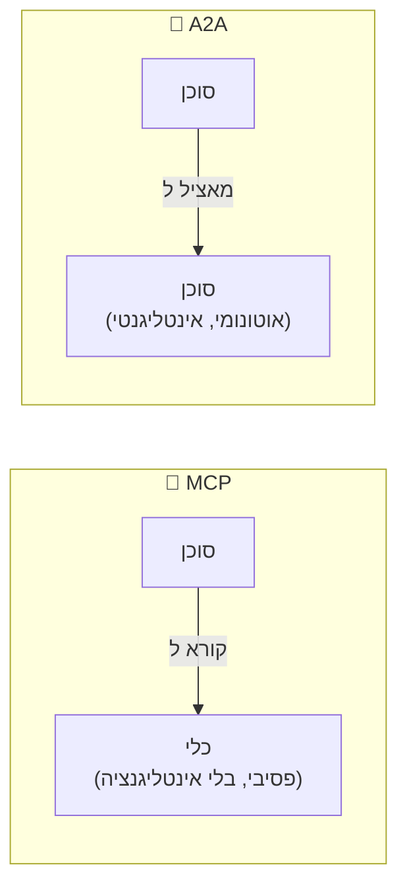

| | MCP | A2A |
|--|-----|-----|
| **מטרה** | חיבור סוכנים ל**כלים** | חיבור סוכנים ל**סוכנים** |
| **אנלוגיה** | חיבור התקן USB | להתקשר לעמית |
| **יעד** | כלים "טיפשים" (DB, API, מערכת קבצים) | סוכנים "חכמים" (עם חשיבה) |
| **נוצר על ידי** | Anthropic | Google |
| **תקשורת** | בקשה → תשובה | בקשה → משא ומתן → streaming → השלמה |
| **גילוי** | סכמת כלי | Agent Card |

---

## השוואה מקיפה

### מטריצת תכונות

| תכונה | LangChain | LangGraph | MS Agent Framework | Semantic Kernel | AutoGen | CrewAI | LlamaIndex |
|--------|-----------|-----------|-------------------|-----------------|---------|--------|------------|
| **מוקד עיקרי** | שרשראות & RAG | גרפים stateful | פלטפורמת סוכנים מאוחדת | SDK ארגוני (כעת חלק מ-MAF) | צ'אט ריבוי-סוכנים (כעת חלק מ-MAF) | צוותים מבוססי תפקידים | נתונים & RAG |
| **שפות** | Python, JS | Python, JS | C#, Python | C#, Python, Java | Python, .NET | Python | Python, TS |
| **ספקי LLM** | 50+ | דרך LangChain | OpenAI, Claude, Copilot, Ollama, Azure | Azure OpenAI, OpenAI, Ollama, + עוד | OpenAI, Azure, + עוד | דרך LiteLLM | 20+ |
| **ריבוי-סוכנים** | בסיסי | ✅ Subgraphs | ✅ חוזקה מרכזית | ✅ Agent Framework | ✅ חוזקה מרכזית | ✅ חוזקה מרכזית | בסיסי |
| **ניהול State** | בסיסי | ✅ מובנה + פרסיסטנטיות | ✅ מובנה | ✅ Process Framework | דרך group chat | בסיסי | בסיסי |
| **HITL** | ידני | ✅ מובנה | ✅ זרימות אישור | ✅ דרך Filters | ✅ דרך UserProxy | ⚠️ מוגבל | ⚠️ מוגבל |
| **RAG** | ✅ חזק | דרך LangChain | ⚠️ דרך אינטגרציות | ✅ דרך Memory | ⚠️ בסיסי | ⚠️ בסיסי | ✅ הטוב בקטגוריה |
| **אקוסיסטם כלים** | 700+ אינטגרציות | דרך LangChain | דרך Skills + MCP | דרך Plugins | דרך tools | דרך tools | 300+ מחברי נתונים |
| **Observability** | LangSmith | LangSmith | OpenTelemetry | Azure Monitor, Aspire | לוגינג מובנה | לוגינג מובנה | LlamaTrace |
| **תמיכת MCP** | ✅ | ✅ | ✅ טבעית | ✅ | ✅ | ✅ | ✅ |
| **מוכנות ארגונית** | ⚠️ בצמיחה | ✅ LangGraph Platform | ✅ חזק | ✅ חזק | ⚠️ בצמיחה | ⚠️ בצמיחה | ⚠️ בצמיחה |
| **עקומת למידה** | בינונית | בינונית-גבוהה | בינונית | בינונית | בינונית | נמוכה | בינונית |
| **רישיון** | MIT | MIT | MIT | MIT | CC-BY-4.0 (AG2: Apache 2.0) | MIT | MIT |

### אימוץ וקהילה (2025–2026)

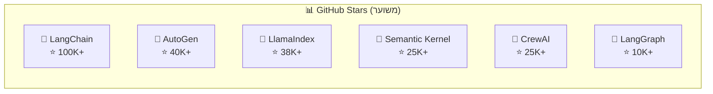

---

## איך פריימוורקים ממפים למושגי הפלטפורמה

הטבלה הזו מראה איך כל פריימוורק מממש (או לא) את רכיבי הפלטפורמה שלמדנו בפרקים 1–14:

| מושג פלטפורמה (פרק) | LangChain | LangGraph | Semantic Kernel | AutoGen | CrewAI |
|---------------------|-----------|-----------|-----------------|---------|--------|
| **הפשטת מודל (4)** | ✅ הפשטת ChatModel | ✅ דרך LangChain | ✅ AI Connectors | ✅ הגדרת LLM | ✅ דרך LiteLLM |
| **זיכרון & RAG (5)** | ✅ מחלקות Memory + Retrievers | ✅ Store + Checkpointer | ✅ Memory + Plugins | ⚠️ Teachability | ⚠️ זיכרון בסיסי |
| **Thread & State (6)** | ⚠️ בסיסי | ✅ StateGraph + Checkpointer | ✅ Process Framework | ✅ היסטוריית צ'אט | ⚠️ הקשר משימות |
| **תזמור (7)** | ✅ שרשראות LCEL | ✅ גרף עם מעגלים | ✅ Planner + Process | ✅ Group chat | ✅ סדרתי/היררכי |
| **כלים (8)** | ✅ דקורטור @tool | ✅ דרך LangChain | ✅ @kernel_function | ✅ כלי פונקציה | ✅ דקורטור @tool |
| **מדיניות & Guardrails (9)** | ⚠️ דרך callbacks | ⚠️ דרך לוגיקת צומת | ✅ Filters (pre/post) | ⚠️ דרך prompts | ⚠️ דרך guardrails |
| **הערכה (10)** | ✅ LangSmith Evals | ✅ LangSmith | ⚠️ ידני/Azure AI | ⚠️ ידני | ⚠️ ידני |
| **Observability (11)** | ✅ LangSmith | ✅ LangSmith | ✅ Azure Monitor | ⚠️ לוגינג בסיסי | ⚠️ לוגינג בסיסי |
| **אבטחה (12)** | ⚠️ דרך הגדרות | ⚠️ דרך הגדרות | ✅ Azure Entra, RBAC | ✅ Docker sandbox | ⚠️ בסיסי |

---

## מדריך בחירה: איך בוחרים פריימוורק

### תרשים החלטה

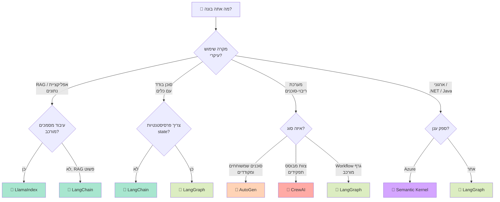

### מטריצת החלטה מהירה

| אם אתה צריך... | בחר | למה |
|----------------|------|-----|
| פרוטוטייפינג מהיר עם הרבה אינטגרציות | **LangChain** | אקוסיסטם הכי גדול, הכי הרבה דוגמאות |
| Workflows סוכנים stateful מורכבים | **LangGraph** | ניהול state מבוסס-גרף עם פרסיסטנטיות |
| .NET/Java + Azure ארגוני | **Semantic Kernel** | רב-שפתי, Azure-native, תכונות ארגוניות |
| סוכנים שמשתפים פעולה בצ'אט | **AutoGen** | בנוי ייעודית לשיחות ריבוי-סוכנים |
| צוות מבוסס תפקידים עם API פשוט | **CrewAI** | הכי אינטואיטיבי, מטאפורת תפקיד/מטרה/רקע |
| צינור RAG הטוב ביותר בקטגוריה | **LlamaIndex** | 300+ מחברי נתונים, אחזור מתקדם |
| אינטגרציית כלים אגנוסטית לפריימוורק | **MCP** | פרוטוקול כלים אוניברסלי, עובד עם הכל |
| תקשורת סוכנים חוצת-פריימוורקים | **A2A** | סטנדרט תקשורת אוניברסלי בין סוכנים |

### אפשר לשלב פריימוורקים?

**כן!** פריימוורקים לא סותרים זה את זה. שילובים נפוצים:

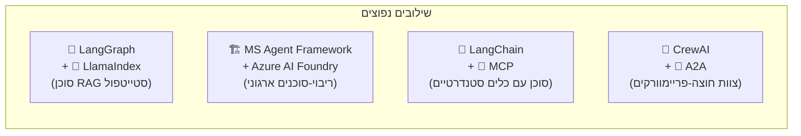

---

## סיכום

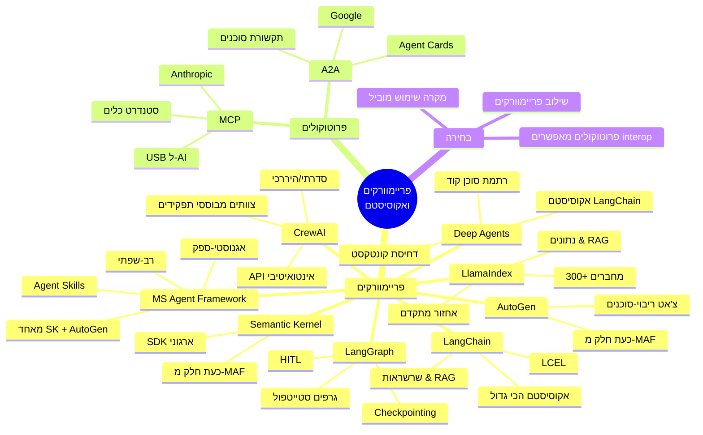

| מה למדנו | נקודה מרכזית |
|----------|-------------|
| **Agent Framework** | ספרייה שמספקת אבני בניין (זיכרון, כלים, תזמור) כדי שמפתחים יתמקדו בלוגיקה עסקית |
| **LangChain** | הפריימוורק הפופולרי ביותר, כללי, עם האקוסיסטם הגדול ביותר |
| **LangGraph** | Workflows סטייטפול מבוססי-גרף בנויים על LangChain — הטוב ביותר לסוכנים מורכבים |
| **MS Agent Framework** | הפריימוורק המאוחד של מיקרוסופט (יורש Semantic Kernel + AutoGen) — הבחירה המומלצת לפרויקטים חדשים באקוסיסטם מיקרוסופט |
| **Semantic Kernel** | ה-SDK הרב-שפתי של מיקרוסופט — כעת מתפתח לתוך Microsoft Agent Framework |
| **AutoGen** | פריימוורק שיחות ריבוי-סוכנים — כעת מתפתח לתוך Microsoft Agent Framework |
| **Deep Agents** | רתמת סוכן קוד של LangChain — ניהול קונטקסט אוטונומי לסוכנים ארוכי-טווח |
| **CrewAI** | פריימוורק צוותים מבוסס-תפקידים — ה-API הכי אינטואיטיבי לריבוי-סוכנים |
| **LlamaIndex** | פריימוורק מוכוון-נתונים — הטוב ביותר ל-RAG ועיבוד מסמכים מורכב |
| **MCP** | פרוטוקול סטנדרטי לחיבור סוכנים לכלים (של Anthropic) |
| **A2A** | פרוטוקול סטנדרטי לתקשורת סוכן-לסוכן (של Google) |

---

## ❓ שאלות לבדיקה עצמית

1. מה מטרת פריימוורק לפיתוח סוכנים ולמה להשתמש בו במקום לכתוב הכל מאפס?
2. מה ההבדל בין LangChain ל-LangGraph? מתי תבחרו באחד על פני השני?
3. מהם רכיבי המפתח של Semantic Kernel (ציינו לפחות 4)?
4. איך הגישה של AutoGen לריבוי-סוכנים שונה מזו של CrewAI?
5. מה זה MCP ואיזו בעיה הוא פותר?
6. מה זה A2A ואיך הוא שונה מ-MCP?
7. איך פריימוורקים ממפים למושגי הפלטפורמה מפרקים 1–14? תנו 3 דוגמאות.
8. אתה צריך לבנות אפליקציה כבדת-RAG עם עיבוד מסמכים מורכב — איזה פריימוורק/ים תבחר ולמה?

---

### 📝 תשובות

<details>
<summary>1. מה מטרת פריימוורק לפיתוח סוכנים ולמה להשתמש בו במקום לכתוב הכל מאפס?</summary>

**פריימוורק לפיתוח סוכנים** מספק אבני בניין מוכנות לצרכים נפוצים של סוכנים: הפשטת LLM, ניהול זיכרון, אינטגרציית כלים, תבניות תזמור וניהול state. שימוש בפריימוורק במקום כתיבה מאפס חוסך זמן פיתוח משמעותי, מספק תבניות בדוקות ומאומתות על ידי הקהילה, מציע כלי observability ו-debugging מובנים, ומאפשר למפתחים להתמקד בלוגיקה העסקית במקום בתשתית.
</details>

<details>
<summary>2. מה ההבדל בין LangChain ל-LangGraph? מתי תבחרו באחד על פני השני?</summary>

**LangChain** הוא פריימוורק כללי לבניית שרשראות LLM וסוכנים פשוטים. הוא מצטיין ב-RAG, שרשור קריאות LLM, ואינטגרציה עם 700+ כלים. **LangGraph** בנוי על גבי LangChain ומוסיף workflows סטייטפול מבוססי-גרף עם checkpointing מובנה, HITL, והרצה מחזורית. בחרו **LangChain** לשרשראות פשוטות, אפליקציות RAG ופרוטוטייפינג מהיר. בחרו **LangGraph** כשצריכים workflows מורכבים רב-שלביים, פרסיסטנטיות state, human-in-the-loop, או סוכני פרודקשן שצריכים לשרוד קריסות.
</details>

<details>
<summary>3. מהם רכיבי המפתח של Semantic Kernel (ציינו לפחות 4)?</summary>

1. **Kernel** — התזמורן המרכזי שמנהל שירותי AI ו-plugins.
2. **Plugins** — אוספי פונקציות native ופונקציות prompt שה-AI יכול להפעיל.
3. **AI Connectors** — מתאמים לספקי LLM (Azure OpenAI, OpenAI, Ollama ועוד).
4. **Planner** — תזמור אוטומטי של מספר plugins להשגת מטרה מורכבת.
5. **Filters** — middleware ל-hooks לפני/אחרי ריצה (לוגינג, content safety וכו').
6. **Process Framework** — workflows רב-שלביים עמידים עם state machines.
7. **Agent Framework** — שיתוף פעולה ריבוי-סוכנים עם group chat ואסטרטגיות העברה.
</details>

<details>
<summary>4. איך הגישה של AutoGen לריבוי-סוכנים שונה מזו של CrewAI?</summary>

**AutoGen** משתמש בגישה **מבוססת-שיחה**: סוכנים הם ישויות שניתן לשוחח איתן ושולחים הודעות זה לזה, כמו צ'אט קבוצתי. המוקד הוא בשיחה בשפה טבעית בין סוכנים, עם תמיכה מובנית בהרצת קוד. **CrewAI** משתמש בגישה **מבוססת-תפקידים**: לסוכנים יש תפקידים, מטרות ורקע מפורשים, והם עובדים על משימות מובנות בצוות (crew). CrewAI יותר מובנה ואינטואיטיבי (כמו צוות פרויקט), בעוד AutoGen יותר גמיש ופתוח (כמו דיון קבוצתי).
</details>

<details>
<summary>5. מה זה MCP ואיזו בעיה הוא פותר?</summary>

**MCP (Model Context Protocol)** הוא סטנדרט פתוח שיצרה Anthropic שמספק דרך אוניברסלית לסוכני AI להתחבר לכלים. הוא פותר את **בעיית האינטגרציה N×M**: בלי MCP, כל פריימוורק צריך אינטגרציות מותאמות אישית לכל כלי. עם MCP, ספקי כלים מממשים שרת MCP אחד, וכל סוכן תואם-MCP יכול להשתמש בו. חשבו על זה כמו **USB לכלי AI** — מחבר סטנדרטי אחד שעובד בכל מקום.
</details>

<details>
<summary>6. מה זה A2A ואיך הוא שונה מ-MCP?</summary>

**A2A (Agent-to-Agent Protocol)** הוא סטנדרט פתוח שיצרה Google לתקשורת בין סוכנים. בעוד **MCP** מחבר סוכנים ל**כלים פסיביים** (בסיסי נתונים, APIs, מערכות קבצים), **A2A** מחבר סוכנים ל**סוכנים אינטליגנטיים אחרים**. סוכני A2A מפרסמים Agent Cards שמתארים את היכולות שלהם, יכולים לנהל משא ומתן על האצלת משימות, תומכים בתשובות streaming, ומטפלים במשימות אסינכרוניות ארוכות-טווח עם push notifications.
</details>

<details>
<summary>7. איך פריימוורקים ממפים למושגי הפלטפורמה מפרקים 1–14? תנו 3 דוגמאות.</summary>

1. **זיכרון & RAG (פרק 5)** → LangChain מספק מחלקות memory ו-retrievers, LlamaIndex מספק אינדוקס מסמכים מתקדם, Semantic Kernel יש plugins לזיכרון עם תמיכה ב-vector store.
2. **Thread & State (פרק 6)** → LangGraph מספק StateGraph עם checkpointing ו-HITL, Semantic Kernel מציע Process Framework ל-state machines עמידים, AutoGen מתחזק state דרך היסטוריית צ'אט.
3. **תזמור (פרק 7)** → LangChain משתמש בשרשראות LCEL (סדרתי), LangGraph משתמש בתזמור מבוסס-גרף עם מעגלים, CrewAI מספק תהליכים סדרתיים והיררכיים, AutoGen משתמש בתבניות group chat.
</details>

<details>
<summary>8. אתה צריך לבנות אפליקציה כבדת-RAG עם עיבוד מסמכים מורכב — איזה פריימוורק/ים תבחר ולמה?</summary>

לאפליקציה כבדת-RAG עם עיבוד מסמכים מורכב, הבחירה הטובה ביותר היא **LlamaIndex** כפריימוורק הנתונים/RAG העיקרי, בשילוב אפשרי עם **LangGraph** לשכבת תזמור הסוכן. **LlamaIndex** מציע: 300+ מחברי נתונים (LlamaHub), תבניות RAG מתקדמות (שאלות-משנה, אחזור רקורסיבי, re-ranking), LlamaParse לפרסינג מסמכים מורכב (טבלאות, תמונות), וצינורות אינדוקס מוכנים לפרודקשן. אם צריכים גם workflows סוכנים סטייטפול מעל ה-RAG, שילוב עם **LangGraph** נותן תזמור מבוסס-גרף עם checkpointing ו-HITL.
</details>

---

**[⬅️ חזרה לפרק 15: Microsoft Stack Mapping](15-microsoft-stack.md)** | **[🏠 חזרה ל-README](README.md)**
