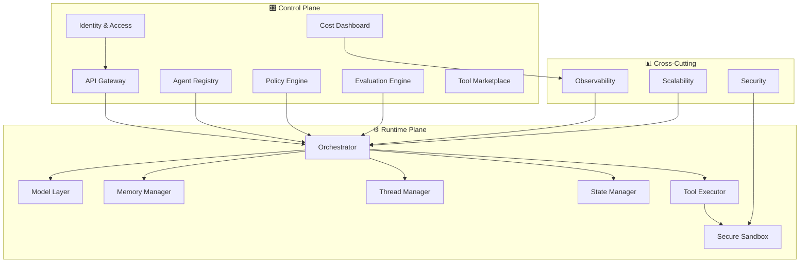

# 📚 AI Agent Platform - Education Hub

## מטרת המסמך
מסמך זה הוא חומר לימודי מקיף שנועד ללמד את כל המושגים, הטכנולוגיות והאדריכלויות הנדרשים לתכנון ובניית **AI Agent Platform as a Service (PaaS)**.

כל פרק עומד בפני עצמו, אך יחד הם יוצרים תמונה שלמה של מערכת ברמת Production.

---

## 🗂️ סדר הלימוד המומלץ

| # | נושא | קובץ | מה תלמד |
|---|-------|-------|---------|
| 1 | **מושגי יסוד - מהו AI Agent?** | [01-fundamentals.md](01-fundamentals.md) | מה זה LLM, מה זה Agent, ההבדל בין Chatbot ל-Agent, מושגים בסיסיים |
| 2 | **Control Plane** | [02-control-plane.md](02-control-plane.md) | מהו Control Plane, למה צריך אותו, רכיבים מרכזיים |
| 3 | **Runtime (Data) Plane** | [03-runtime-plane.md](03-runtime-plane.md) | מהו Runtime Plane, איך Agent רץ, מחזור חיים של בקשה |
| 4 | **Model Abstraction & Routing** | [04-model-abstraction-routing.md](04-model-abstraction-routing.md) | שכבת הפשטה ל-LLMs, ניתוב חכם בין מודלים, אסטרטגיות Routing |
| 5 | **Memory Management & RAG** | [05-memory-management.md](05-memory-management.md) | זיכרון קצר וארוך טווח, RAG, Vector Databases, Embeddings |
| 6 | **Thread & State Management** | [06-thread-state-management.md](06-thread-state-management.md) | ניהול שיחות, State Machines, Checkpointing, Human-in-the-Loop |
| 7 | **Orchestration Patterns** | [07-orchestration.md](07-orchestration.md) | Sequential, Parallel, Autonomous, Sub-agents, DAG workflows |
| 8 | **Tools & Marketplace** | [08-tools-marketplace.md](08-tools-marketplace.md) | Function Calling, Tool Integration, Tool Registry, Marketplace |
| 9 | **Policy & Governance** | [09-policy-governance.md](09-policy-governance.md) | Content Safety, DLP, Rate Limiting, Guardrails |
| 10 | **Evaluation Engine** | [10-evaluation-engine.md](10-evaluation-engine.md) | מדדי איכות, Groundedness, Relevance, בדיקות אוטומטיות |
| 11 | **Observability & Cost** | [11-observability-cost.md](11-observability-cost.md) | Metrics, Tracing, Token Tracking, Cost Dashboards |
| 12 | **Security & Isolation** | [12-security-isolation.md](12-security-isolation.md) | Sandboxing, Container Isolation, Zero Trust, Secrets Management |
| 13 | **Scalability Patterns** | [13-scalability.md](13-scalability.md) | Horizontal Scaling, Multi-tenancy, Partitioning, Edge Cases |
| 14 | **HLD - Full Architecture** | [14-hld-architecture.md](14-hld-architecture.md) | איך הכל מתחבר - תרשים ארכיטקטורה מלא |
| 15 | **Microsoft Stack Mapping** | [15-microsoft-stack.md](15-microsoft-stack.md) | מיפוי כל רכיב לשירותי Azure ספציפיים |
| 16 | **Agent Development Frameworks & Ecosystem** | [16-agent-frameworks.md](16-agent-frameworks.md) | LangChain, LangGraph, Semantic Kernel, AutoGen, CrewAI, MCP, פרוטוקולי A2A |

---

## 🎯 איך להשתמש בחומר הזה

1. **קרא לפי הסדר** - הפרקים בנויים מהבסיס למורכב
2. **עצור על כל תרשים** - התרשימים (Mermaid) מדגימים את הזרימות והקשרים בין הרכיבים
3. **שים לב לטבלאות היתרונות/חסרונות** - הן יעזרו לך להבין מתי כל טכנולוגיה מתאימה
4. **בסוף כל פרק** יש סיכום ושאלות לבדיקה עצמית

---

## 🧭 מפת הנושאים - מבט מלמעלה

---

> **הערה:** כל תרשימי ה-Mermaid במסמכים אלה ניתנים לצפייה ישירות ב-VS Code עם תוסף Mermaid, או באתרים כמו [mermaid.live](https://mermaid.live).
