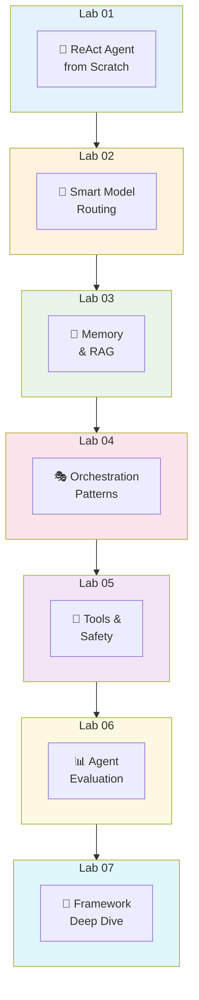

# 🧪 AI Agent Platform — Hands-On Labs

> **Learn by building.** Each lab teaches you one core concept of AI Agent Platforms — not by reading about it, but by building it with your own hands.

---

## 🎯 Philosophy

These labs follow the same teaching philosophy as the [RAG Workshop](https://github.com/roie9876/RAG-WorkShop):

1. **Understand the concept first** — every lab starts with a deep explanation of WHY before HOW
2. **Build it yourself** — no magic wrappers, you see every moving part
3. **See it fail, then fix it** — we intentionally build naive versions first so you appreciate the real solutions
4. **Simple language** — written for smart people who aren't AI engineers (yet)
5. **Real examples** — not toy demos, but patterns you'll use in production

**All labs use LangChain / LangGraph** — the most popular open-source agent framework — so the skills you learn here transfer directly to real projects.

---

## 🗺️ Lab Journey Map



---

## 📚 What Each Lab Covers

| Lab | What You Build | Education Chapter | What You Learn |
|-----|---------------|-------------------|----------------|
| **Lab 01** | [ReAct Agent from Scratch](lab-01-react-agent/README.md) | Ch 1 | Build a working agent with NO framework first, then rebuild with LangGraph. Understand Think→Act→Observe. |
| **Lab 02** | [Smart Model Routing](lab-02-model-routing/README.md) | Ch 2 | Route requests to cheap vs expensive models based on complexity. See the cost difference. |
| **Lab 03** | [Memory & RAG](lab-03-memory-rag/README.md) | Ch 3 | Add short-term memory (conversation) and long-term memory (RAG) to your agent. |
| **Lab 04** | [Orchestration Patterns](lab-04-orchestration/README.md) | Ch 5 | Build Sequential, Parallel, and Map-Reduce patterns. Measure the speedup. |
| **Lab 05** | [Tools & Safety](lab-05-tools-safety/README.md) | Ch 6, 7 | Create custom tools, add input validation, DLP scanning, and budget guardrails. |
| **Lab 06** | [Agent Evaluation](lab-06-evaluation/README.md) | Ch 10 | Build an eval pipeline that scores groundedness, relevance, and toxicity. |
| **Lab 07** | [Framework Deep Dive](lab-07-frameworks/README.md) | Ch 16 | Build the same agent in LangChain, LangGraph, and Deep Agents. Compare approaches. |
| **Lab 08** | [Observability & Monitoring](lab-08-observability/README.md) | Ch 11 | Instrument agents with OpenTelemetry, track costs, build dashboards. |
| **Lab 09** | [Azure AI Foundry](lab-09-foundry/README.md) | Ch 17 | Build agents with Foundry Agents Service, built-in evals and tracing. |

---

## 🛠️ Prerequisites

| Requirement | Version | Why |
|------------|---------|-----|
| **Python** | 3.11+ | All labs |
| **Azure Subscription** | Owner or Contributor | Deploy cloud resources |
| **Azure CLI** | Latest | Deploy via Bicep |
| **VS Code** | Latest | Recommended IDE |
| **Jupyter Extension** | Latest | Run notebooks |

> 🆕 **New to these tools?** See [lab-00-setup/PREREQUISITES.md](lab-00-setup/PREREQUISITES.md) for step-by-step installation.

> 💡 **All AI models run in Azure** (Azure OpenAI with GPT-4.1). The notebooks run on your local machine.

### Quick Setup

```bash
# Clone the repo
git clone https://github.com/roie9876/AI-Agent-Platform.git
cd AI-Agent-Platform/labs

# Create virtual environment
python -m venv .venv
source .venv/bin/activate  # macOS/Linux
# .venv\Scripts\activate   # Windows

# Install dependencies
pip install -r requirements.txt

# Deploy Azure resources (~5-10 min)
cd ../infra
./deploy.sh
# This auto-generates labs/.env with all connection strings!

# Validate setup
cd ../labs
# Open lab-00-setup/health-check.ipynb and run all cells
```

---

## ⏱️ Time Estimates

| Path | Labs | Time |
|------|------|------|
| **Essential** (fundamentals) | Labs 00, 01, 03, 05 | ~5 hours |
| **Full Workshop** | Labs 00–07 | ~12 hours |
| **Quick Taste** | Labs 00, 01 | ~2 hours |

---

## 🗂️ How Each Lab is Structured

Every lab follows the same pattern:

```
lab-XX-topic/
├── README.md       # Deep concept explanation (read this FIRST)
├── lab.ipynb        # Hands-on notebook (step-by-step code)
└── solutions/       # Complete solutions (no peeking!)
```

1. **Read the README** — understand the concept, the "why", the architecture
2. **Open the notebook** — follow along, run each cell, read the explanations
3. **Experiment** — change things, break things, understand what happens
4. **Check solutions** — compare your understanding

---

> **Ready?** Start with **[Lab 00 — Environment Setup](lab-00-setup/README.md)**
